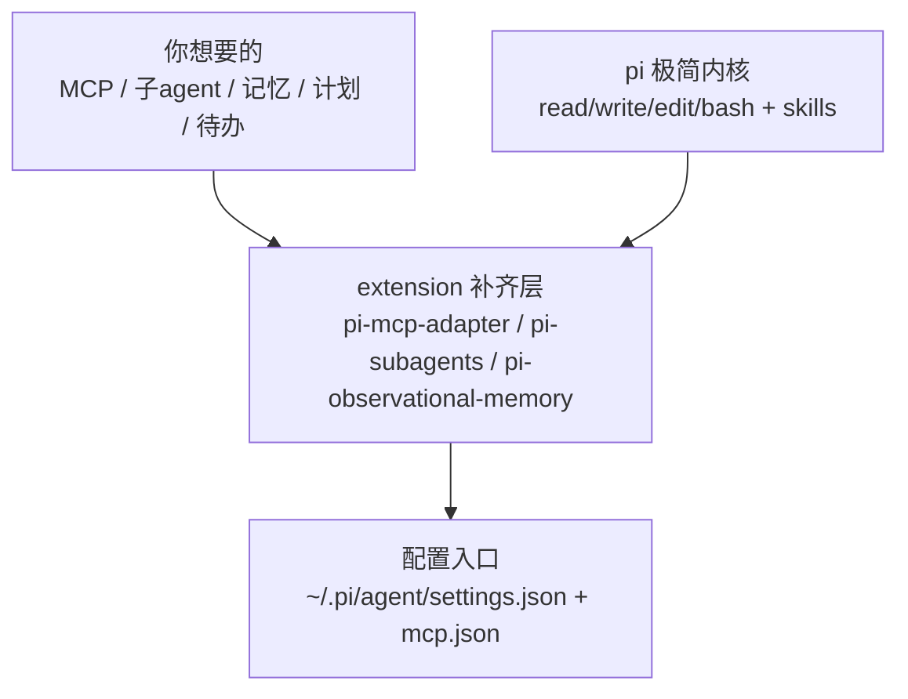

> **⚠️ 持续维护声明（2026-08-09）**：本文写于 pi 开荒期（08-06）。此后配置持续演进——① 记忆扩展 `pi-hermes-memory` 因破坏多行粘贴，已于 08-08 替换为 `pi-observational-memory`（观察式记忆 + 分层压缩，会话收尾自动记录）；② 后续补装 `pi-dynamic-workflows`（workflow 编排）+ 4 个本地扩展工具。正文保留开荒时的真实探索，**当前最新状态见文末「后来长出的器官」**。想看记忆机制本身，移步 [pi 靠什么记住事](/posts/pi-agent-memory-mechanism/)。

手里 AI 编程工具越堆越多，pi 是这批里最特别的一个：官方文档明言它不带 MCP、不带子 agent、不带 plan 模式，连 TodoWrite 和后台 bash 都没有，走的是"primitives, not features"的极简内核。但开荒完回头看，最大的体会是一句话：**pi 缺的不是能力，是接入层——adapter 借来 MCP、subagents 借来子 agent、memory 借来记忆，真正的坑全在配置落地，不在装包。**

> pi 官方 usage.md 原话：It intentionally does not include built-in MCP, sub-agents, permission popups, plan mode, to-dos, or background bash.

> 材料说明：文中提到的吞吐结论（Anthropic 协议明显优于 OpenAI）来自对智谱两个协议的直连压测，不是 pi 自带的统计；pi 那 8 个会话里只有环境事实。别把两组数据搞混。

## 缺啥补啥，先画一张图

pi 的内核有多瘦？你能想到的"重设施"它一个都不带。这反而逼出一条干净的路：缺什么，就在 settings.json 里点名补什么。

三包加起来磁盘才 7MB，系统提示基本不受影响——这是"按需补件"和"全家桶"最大的区别。我的结论：**能少装绝不多装，每多一个包就多一份工具列表膨胀和 token 开销。**

| 缺失能力 | 补齐方案 | 配置入口 |
|---|---|---|
| MCP 桥接 | pi-mcp-adapter | mcp.json（imports 软引用） |
| 子 agent | pi-subagents | agents/*.md |
| 持久记忆 | pi-observational-memory（原 hermes，08-08 换） | 会话收尾自动记录 + recall 回溯 |
| plan / todo | pi-code 或独立小包 | settings.json |
| 后台 bash | extension / tmux | — |

## GLM-5.2 是纯文本，看图得自己搭梯子

接智谱 GLM-5.2 时踩了个认知坑：官方文档把 GLM-5.2 放在"文本模型"分类里，输入输出都是文本——**纯文本**！智谱的视觉能力在 GLM-5V-Turbo / GLM-4.6V 那批模型上。

对纯文本模型，看图就得多走一步：`MINIMAX_API_KEY` + openai SDK，把图片 base64 塞进消息，让 MiniMax 的视觉模型替 pi 看一眼。这条链路的 key、SDK、路径三个前置条件都得自己现场核，别信 AI 一句"已配好"。

MCP 里不想用的 server，`/mcp disable` 一行搞定，或写 `{disabled:true}`；全局禁用写 `~/.pi/agent/mcp.json`。

## 最大的坑不是缺功能，是 LANG 环境变量

开荒最烧时间的是中文乱码排查。查了一圈发现 `LANG` 在 pi 进程里是空的，而 `~/.bashrc` 明明有 `export LANG=zh_CN.UTF-8`——矛盾点在这：pi 执行命令走的是**非交互式 bash**（`shopt login_shell=off`），根本不读 `.bashrc`。

正解是 `setx LANG zh_CN.UTF-8`（注意只对新进程生效，改完要重开），或者靠早已在位的 `PYTHONUTF8=1` / `PYTHONIOENCODING=utf-8` 兜底。

> 教训：规范里写"去 ~/.bashrc 加一行"可能不适用于非交互启动的 CLI。环境问题的排查顺序：先确认进程形态（交互还是非交互），再谈改哪个文件。

## 版本号靠现场实测，别让 AI 的嘴替你做决定

让 AI 报依赖版本号是幻觉高发区。openai SDK 在 Claude Code 环境实测是 2.26.0，pi 环境可能是 2.46.0——两个环境并存，谁也别替谁做主。**版本这类可实证的东西，一律 `pip show` / `import` 现场看。**

装包顺序也有讲究：adapter → subagents → memory，一个一个来，每装一个验证一次，别一锅端。真出问题 `pi remove npm:<包>` 单独卸，不影响其他。

| 启动时的 MCP 报错 | 归因 | 处理 |
|---|---|---|
| supabase / vercel | needs auth（OAuth 未授权） | `/mcp-auth` 按需授权 |
| obsidian | server 端 inputSchema 校验失败 | 等 server 更新，不是 adapter 的锅 |
| github | 401 token 过期 | 重新配置凭证 |
| server 报 `must configure exactly one of command, url, socket` | 本地 server 与 imports 同名，`command`+`url` 字段级浅合并撞名 | 本地别重复配（让 imports 接管），或改名 / 换 transport |
| tavily 等 401 | env 写了 `${KEY}` 但 pi **不解析 `${}` 插值** | 本地硬编码 key，别用 `${}`；改完 TUI `/reload` |
| 其余 18 个 | 在线，146 tools | 正常用 |

## 三包七兆，九个小兵，命令就几条

pi-subagents 自带 9 个 builtin agent，全是"干一件具体事"的定位：

| agent | 干吗 |
|---|---|
| scout | 快速侦察（找文件、探目录） |
| reviewer | 审查代码 / 差异 |
| oracle | 深挖一个问题 |
| planner | 拆计划 |
| worker | 执行单项任务 |
| advisor / researcher / context-builder / delegate | 咨询 / 调研 / 上下文组装 / 委派 |

命令面也窄，记得住：

| 场景 | 命令 |
|---|---|
| 装扩展 | `pi install npm:X`（ECONNRESET 就换淘宝镜像重试） |
| 看已装 | `pi list` |
| 切模型 | `/model`（或 `/model provider/modelId`） |
| MCP 导入 / 禁用 | `/mcp setup` / `/mcp disable` |
| 会话树 / 压缩 | `/tree` / `/compact` |
| 重载扩展 | `/reload` |

## 记忆靠双保险：handoff prompt + memory 重索引

pi 没有原生自动记忆，得自己搭。开荒时我两路并进：交接时用 handoff prompt 把基线固化给下个会话；平时靠 `pi-hermes-memory` 的 SQLite FTS5 会话搜索，跨会话能捞回"上次踩过的坑"。

> **⚠️ 此方案已弃用（2026-08-08）**：`pi-hermes-memory` 会把粘贴的长文本拆成多条消息喂给模型（断章取义），实测破坏多行粘贴。已换 `pi-observational-memory`——会话收尾自动记录观察/反思、分层压缩，靠 `recall(id)` 精确回溯。下面 hermes 的机制细节留作历史，**别照着装**。

一个小坑：包文档里的 `/memory-index-sessions` 看着像斜杠命令，实际是内部 handler 名，重索引靠**重启触发自动 backfill**。别照着文档敲一个不存在的命令。

顺带一条取舍：pi-code 虽然一站式补齐 todo / memory / web / subagents，但它会读 `.claude` 配置，和我现有的三目录 skill 共享冲突，最后选择不装。**功能重叠的包，宁缺毋滥。**

## pi 开荒可抄清单（直接抄）

1. 配置分两级：全局 `~/.pi/agent/settings.json`，项目 `.pi/settings.json`
2. skills 三目录共享（`~/.claude/skills` + `~/.agents/skills` + `~/.pi/agent/skills`），不复制
3. mcp.json 用 imports 软引用，别硬拷贝 server 定义；但同名会撞（本地 + imports 浅合并触发 command/url 互斥）、`${}` 插值不解析、改完要 `/reload`
4. 装包顺序：adapter → subagents → memory，逐个验证
5. 装前备份：`cp settings.json settings.json.bak.<时间戳>`
6. GLM-5.2 纯文本，看图走 MiniMax 视觉回退
7. LANG 用 setx，别指望 pi 读 .bashrc
8. 版本号一律现场实测
9. 记忆用 handoff + observational 双保险（hermes 已弃，破坏多行粘贴）
10. 功能重叠的包（pi-code）宁缺毋滥

急救：`pi remove npm:<包>` 卸单个；`pi list` 看现状；`/reload` 让扩展生效；`/model glm-5-turbo` 换模型；配置炸了就用装前的备份还原。

## 后来长出的器官（持续维护）

开荒只是起点，pi 在本机一直在长新器官。补一份增量记录，让这篇别停留在 08-06 那天。

**接入层 → 编排层的升级**：开荒补的是"借能力"（MCP / 子 agent / 记忆），后来发现还缺"编排能力"——形状不固定的任务没法扇出。`pi-dynamic-workflows` 补的就是这块：一个 `workflow` 工具，写段 JS 就能 `parallel` / `pipeline` 调度多个子 agent。冒烟验证：`parallel` + 两个 `agent()` 一次跑通，比口头让模型"分头查"靠谱。至此 pi 从"接入层"补到了"编排层"。

**记忆扩展换代**：`pi-hermes-memory` → `pi-observational-memory`，原因上文说了——hermes 破坏多行粘贴。observational 走另一条路：不往系统提示灌记忆，而是会话收尾自动把关键观察/反思落盘、分层压缩，需要时 `recall(12位hex)` 精确拉回原始上下文。更轻，也不抢 token。

**四个本地扩展（自建工具）**：除开荒时唯一的 `rtk.ts`（bash 输出压缩），后来又写了三个——`assess-change`（git 变更/风险盘点）、`blog-context`（Firefly 博客上下文）、`pi-env`（会话/provider/模型自检）。共同点：把"手搓四五条 bash 拼上下文"固化成一个工具调用。固化思路见 [命令是快捷键，工具是仪表盘](/posts/pi-extension-commands-tools/)。

> 一句话总结演进：**开荒补"能借到什么"，维护补"借来怎么编排、怎么固化"**。pi 的极简内核没变，变的是外挂的厚度。

---

把 Claude 的生态搬去别的工具，pi 给出了第三种答法：不搬运，用扩展一件件补。MCP、子 agent、记忆这些"器官"，它一个没长，但每个都能借。**开荒的最优解不是全都要，是缺啥借啥、坑现场踩** ☕(￣▽￣)ノ
