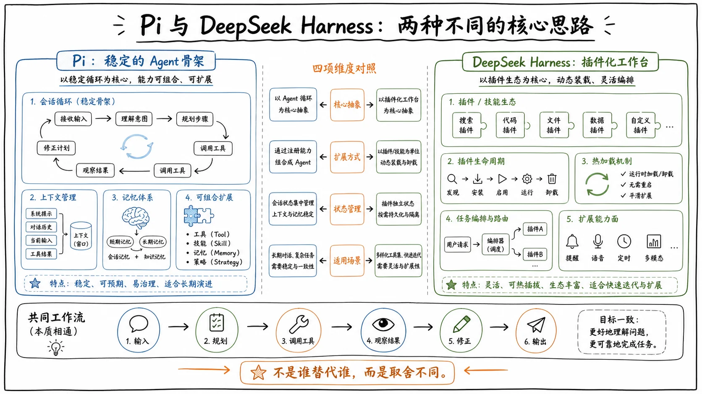

eepSeek Harness 发布以来，一个被频繁问到的问题是：**它和 Pi 到底有什么区别？**

这两个项目看起来确实很像：它们都非常灵活，也都允许用户大幅改变 Agent 的能力与行为。但把两边的架构拆开以后会发现，它们其实对同一个问题给出了完全不同的答案：

> 一个 Agent Harness，到底应该保留多少不可替换的核心？

这里先用一句话解释 Harness：

> **模型负责思考，Harness 负责把模型接入真实世界。**

Harness 管理工具和上下文，记录会话，并负责驱动模型不断思考、调用工具、读取结果，直到当前任务结束。

要看清 Pi 和 DSH 的区别，可以先从 Pi 的核心思路讲起，再看 DSH 采用了怎样的设计，最后通过一个实际例子，把两种思路放在一起对比。

## Pi：保留稳定的 Agent 骨架

如果去掉细枝末节，Pi 大致可以看成四层：

1. **底层**连接不同的大模型；
2. **上层**处理消息和会话；
3. **中间层**是现在 Agent 设计中最常见的 Agent Loop，负责把模型、工具和上下文串成一条可以持续运行的任务流程；
4. **最外层**加入文件读写、命令执行和交互界面等实际能力，最终组成一个可以使用的 Coding Agent。

这几层共同组成了 Pi 内置的 Agent 骨架。它很小，边界也比较清楚。

Pi 的扩展性主要来自这套骨架沿途开放的大量接缝。当前版本的 Pi 一共开放了 30 个扩展事件，覆盖用户输入、会话管理、模型请求、Agent Loop、消息流和工具执行等主要阶段。

不需要记住完整名单，只看三个位置，就能理解这些事件为什么可以深刻改变 Pi 的行为：

- 用户输入刚进来时，扩展可以改写这段输入；
- 模型调用之前，扩展可以修改模型将要看到的上下文和系统提示词；
- 工具执行之前，扩展可以修改参数，或者阻止这次调用；
- 工具执行之后，扩展还可以改写返回给模型的结果。

这 30 个事件中，有些只负责通知扩展当前发生了什么；有些则允许扩展改写、阻断或替换默认行为。

除了事件之外，Pi 还允许扩展直接注册新工具、新命令、新的模型服务和界面组件。因此，Pi 的扩展可以影响：

- 输入怎样进入系统；
- 模型能够看到什么；
- 哪些工具可以执行；
- 工具执行结果如何返回到下一轮思考。

如果把 Harness 比作一栋房子，**Pi 就像是一栋已经搭好合金结构的房子**：主梁和楼层已经确定，但房子里预留了大量插座、管线和改造接口。你可以安装智能家居、重新设计照明，也可以改变很多房间的用途，但承重结构本身仍然由 Pi 负责。

刚才提到的四层结构，包括 Agent Loop 和会话系统，就是 Pi 预先搭建好的 Agent 骨架。扩展可以围绕这套骨架做大量改造，但骨架本身仍然由 Pi 管理。

## Pi 的生命周期边界

这套设计还有一个明确的生命周期边界。

当你退出 Pi、切换会话或者重新加载扩展时，Pi 会发出关闭事件，让扩展有机会停止自己创建的定时器、连接和后台任务。再次启动时，Pi 可以重新建立扩展环境，同时保留当前会话和其他持久数据。

这让扩展开发者面对的是一条相对稳定的运行流程：

> 输入 → 模型请求 → 工具调用 → 结果返回 → 下一轮思考

当某个行为出现问题时，通常可以沿着这些固定阶段向下排查。

但这种设计也意味着：如果想改变更深层的结构，就会受到宿主已经开放哪些接缝的限制。

## DeepSeek Harness：一切皆插件

DSH 则把同一个问题继续向下推了一层：

> Harness 这栋房子的承重结构，能不能也由同一种插件机制组装出来？

DSH 最醒目的架构原则叫做：**一切皆插件**。

模型适配器是插件，工具和会话系统是插件，默认的 Agent Loop 本身也是插件。负责装配这些插件的底座反而很薄，主要使用一个叫作 **Cos** 的运行机制，以及一小层负责启动和装配的基础代码。

官方再通过不同的插件组合，形成标准模式、极简模式和创造模式等预设。

所以，DSH 更像是一套模块化建筑系统。官方提供的不同预设，就是用这些插件预先搭建好的几套成品方案。你可以直接使用，也可以按照需要重新组合。

## “一切皆插件”不代表所有组件地位相同

这里的“一切皆插件”，指的是这些组件拥有相同的架构身份，但它们的重要性依然存在区别。

Agent Loop 和会话系统仍然承担着承重作用，只是它们也通过统一的插件机制进入系统。这些常用插件可以被替换，但替代品仍然需要遵守 DSH 内部的公共约定：

- 一项能力叫什么；
- 可以接收什么输入；
- 会返回什么结果；
- 一次 Agent 运行会产生哪些事件；
- 会话中需要记录哪些事实。

新组件可以改变内部实现，但必须继续使用这套系统能够理解的语言，依赖它的其他组件才能正常工作。

这就像一栋楼可以更换整套电梯，但新电梯仍然需要适配已经约定好的轨道和控制信号。新的 Agent Loop 可以采用不同的循环策略，但同时也要使用系统约定的模型、工具和会话能力，并产生其他组件能够理解的事件与记录。

架构上，允许更换承重插件只是第一步。真正运行起来以后，这些插件可能已经注册了工具、监听了事件，也可能已经被其他插件依赖。此时想把其中一个替换掉，系统就必须同时解决两个问题：

1. 旧插件留下的影响怎样清理；
2. 依赖它的其他插件怎样安全地断开和重新连接。

## Cos 与“时空可组合性”

DSH 选择 Cos 作为底层运行机制，根本原因就在于它需要处理插件动态安装、卸载、更新以及依赖变化等问题。

在 DSH 出现之前，Cos 已经长期用于一个聊天机器人插件生态。那里需要同时管理不同聊天平台、数据库和大量社区插件。插件持续安装、卸载和更新以后，怎样清理残留、怎样处理不断变化的依赖，早就是一个真实的工程问题。

这些经验后来被进一步概括成了一个听起来有些学术的名字：**时空可组合性**。

## 时间可组合性：卸载之后能够清理干净

先看“时间”这一边。

我们都卸载过软件：图标已经消失，但电脑里可能还留着后台任务、配置文件或者开机启动项。用户只需要点击一下“卸载”，但背后怎样收尾，仍然要靠开发者提前写好。

开发者需要把安装过程中发生的事情一项项还原，少写一步就有可能留下残留。

Cos 采用了一种更接近“撤销记录”的做法。插件通过 Cos 注册事件监听、提供服务、注册工具或挂载子插件时，这些接口本身就知道对应的反向操作：

- 事件监听加入了哪张表，卸载时就从同一张表里摘掉；
- 服务登记在什么名字下面，卸载时就移除这项服务；
- 父插件挂载了哪个子插件，父插件退出时，子插件也跟着退出。

Cos 能做到这些，是因为相关操作都经过了它能够追踪的注册接口。它不会阅读任意代码，然后猜出应该怎样撤销。

如果插件直接创建了一个定时器，或者打开了一条网络连接，Cos 无法凭空知道应该怎样关闭。开发者仍然需要在创建资源时，把对应的关闭方式一起登记。

这样，无论插件是因为主动卸载、代码变化、依赖消失，还是加载失败而退出，Cos 都会走同一套清理路径。

Pi 在重新加载时，会整体重建扩展环境；Cos 则进一步把每项变化记录在对应的插件名下。一个组件离开以后，在 Cos 能够管理的系统范围内，系统会尽可能将它产生的影响清理干净。

论文把这个目标称为**时间可组合性**。

## 空间可组合性：根据依赖关系重新组织组件

但干净地拆掉一个组件，只解决了一半问题。

软件通常由许多相互依赖的组件组成一个完整能力。某个组件离开时，正在使用它的组件怎么办？这就进入了“空间”这一边。

在 Cos 中，一个插件可以明确声明自己需要哪些能力。运行时因此能够维护一张依赖关系图：

> 谁提供能力，谁依赖这项能力。

如果某项必需能力还没有出现，依赖它的插件就不会启动。能力出现以后，它才开始运行。

如果提供这项能力的插件被卸载，依赖者也会退出；新的提供者出现以后，它们再重新启动并建立连接。

新的实现能否顺利替换，卸载顺序也很重要。当一项能力准备离开时，系统会：

1. 先停止向新的组件提供这项能力；
2. 沿依赖图通知现有的依赖者退出；
3. 等依赖者完成自己的清理；
4. 旧的能力提供者才真正关闭；
5. 新的能力提供者安装完成后，相关依赖者再重新启动。

这样可以避免某个仍在运行的插件继续持有已经失效的服务。

这类依赖会由运行时持续维护，而不是只在启动时检查一次。论文把这种根据能力变化重新组织组件的目标称为空间可组合性。

## Cos 的边界

Cos 也有清楚的边界：它只能管理插件明确声明的依赖。

隐藏在普通代码里的关系，它无法自动发现；插件没有登记的副作用，它也无法替开发者清理。

已经发送到外部世界的消息、已经写入的文档，或者其他不可逆操作，也不会因为插件卸载就自动消失。

因此，时空可组合性主要保证的是：**在系统所管理的边界内部，组件有机会回到干净、依赖一致的状态。**

## 组件集热更新：只更新真正发生变化的部分

把时间和空间两部分合起来，就能理解 DSH 的组件级热更新特点。

所谓**组件级热更新**，就是系统运行过程中只更新发生变化的组件，其他无关部分继续运行。

更新时：

- 时间可组合性负责把旧组件清理干净；
- 空间可组合性负责找到依赖它的组件，让它们先退出；
- 新组件安装完成后，这些依赖者再重新启动，并连接到新的实现。

这意味着，DSH 不需要每次都整体重建整个扩展环境，而是可以根据变化范围，重新组织受到影响的组件和依赖链。

## 实际例子：定时提醒与语音播报

讲到这里仍然有些抽象，可以用一个实际功能来看看 Pi 和 DSH 会怎样处理同一个问题。

假设我们要让 Agent **每隔一段时间提醒我站起来活动，并且把提醒内容用语音播报出来**。

这个功能可以拆成两部分：

1. 一个负责定时提醒；
2. 一个负责语音播报。

提醒功能启动以后，后台定时器会一直存在，所以删除提醒时必须关闭定时器。提醒功能又需要使用语音能力，因此替换语音模块时，也不能让提醒功能继续调用已经失效的旧语音服务。

## 在 Pi 中实现

在 Pi 里，这两个能力可以写在一个扩展中。

扩展可以在 `session_start` 这个会话启动事件中创建定时器。时间到了以后，它向 Agent 注入一条提醒消息，触发新一轮运行。

语音能力则可以通过 Pi 接口注册成模型能够调用的工具。

现在假设我们修改了语音播报的实现，想让新版本生效，就可以执行：

```text
/reload
```

这会先触发 `session_shutdown` 事件，让扩展有机会关闭定时器和语音连接，然后整体重建扩展环境。

所有通过 Pi 注册的工具和事件处理器，都会随旧环境一起消失；当前会话和持久数据仍然可以保留。

在这个过程中，Pi 主要维护的是一套稳定的宿主和一份可以整体重建的扩展环境。扩展开发者需要按照宿主规定的生命周期，在适当的阶段创建和清理资源。

## 在 DSH 中实现

在 DSH 里，可以将提醒和语音拆成两个插件：

- **语音插件**提供一项名为“语音播报”的服务；
- **提醒插件**明确声明自己依赖这项服务。

提醒插件创建定时器时，同时把关闭定时器的方式加入自己的撤销记录。

现在，如果我们把语音组件替换成另一个实现，Cos 会从依赖关系图中自动找到提醒插件：

1. 先让提醒插件退出；
2. 提醒插件关闭自己的定时器；
3. 旧语音组件真正关闭；
4. 新语音组件安装并提供“语音播报”服务；
5. 提醒插件重新启动，并连接新的语音实现。

如果新的语音组件安装失败，系统会清理这次未完成的安装，并尝试恢复原来的语音组件。

没有依赖语音服务的其他组件，不需要因为这次变化重新建立。

两边最终都能实现定时提醒和语音播报，区别在于系统怎样理解这次变化：

- **Pi** 维护的是一套稳定宿主，以及一份可以整体重建的扩展环境；
- **DSH** 进一步记录每个组件产生了哪些可撤销影响，也记录组件之间的动态依赖；
- 哪个组件发生变化，DSH 就重新组织它和受到影响的依赖链。

## 两种设计的取舍

Pi 的扩展开发者主要面对一条相对固定的运行流程：输入经过哪些阶段、模型在哪里调用工具、工具怎样执行、扩展环境何时关闭。

这种边界更容易理解，也更容易排查问题。但更深层的替换会受到宿主接缝的限制。

DSH 则把更多结构开放出来，组件可以进行更细粒度的替换和重组。这带来了更大的灵活性，也增加了理解成本。

组件拆得越细，需要配置、命名和梳理的依赖关系就越多。插件开发者还需要理解一张会动态变化的组件关系图：

- 自己提供什么能力；
- 自己依赖什么能力；
- 某个组件离开时，会影响哪些下游组件；
- 依赖者应该以什么顺序退出和重新启动。

因此，两种设计可以概括为：

| 对比维度 | Pi | DSH |
|---|---|---|
| 核心结构 | 保留稳定的 Agent 骨架 | Agent Loop、工具和会话系统都可以插件化 |
| 扩展方式 | 围绕宿主开放的事件和接口扩展 | 通过统一插件机制重组系统组件 |
| 生命周期 | 整体重建扩展环境 | 按组件和依赖链进行动态更新 |
| 依赖管理 | 主要由扩展自身负责 | 运行时维护动态依赖关系 |
| 清理机制 | 通过关闭事件完成资源清理 | 通过可撤销记录统一清理 |
| 灵活性 | 边界清晰，理解和排查成本较低 | 替换粒度更细，组合能力更强 |
| 复杂度 | 受到宿主接缝限制 | 需要管理更多组件、能力和依赖关系 |

## 从扩展工具到自我构建的 Harness

当然，这些插件不一定都由人来编写，也可以交给 Agent 生成。

沿着这个思路再往前一步，就会碰到 DSH 另一个很受关注的话题：**自我构建**。

如果 Agent 只能给自己增加一个工具，它改变的只是自己的能力。

但如果 Agent 连 Loop、会话系统和运行组件都可以重新组合，它就开始触及 Harness 本身的构成方式。

DSH 还提供了一个**创造模式**，让 Agent 检查当前运行结构、实验插件，并创建新的 Agent 组合。

Pi 提供的可逆卸载、动态依赖和失败恢复路径，让这种修改拥有了更适合反复试错和持续运行的基础。

DSH 目前仍然处于开发者预览阶段。它展示的是一种开放程度很高的架构方向，以及一套已经可以研究和实验的组件机制。

论文中也认为，未来的**自进化 Agent Harness**，可能需要在持续运行的过程中生成、替换和重新组合自己的组件。

但现有系统很难把旧组件清理干净，也很难处理随之变化的依赖关系。论文提出的时空可组合性，以及它在 Cos 中的实现，就是在为这类动态修改提供基础。

## 总结

Pi 和 DSH 都允许 Agent 不断改变自己的能力，但它们把变化放在了不同的层次。

> **Pi 把这些变化放在一套稳定的骨架之中。**

它预先搭建好 Agent Loop、会话和工具执行流程，再通过事件和扩展接口开放改造空间。这样做的优点是结构清晰、生命周期稳定，也更容易理解和排查。

> **DSH 则进一步开放了构成 Harness 的组件。**

模型适配器、工具、会话系统和 Agent Loop 都可以通过插件机制被替换和重组。Cos 负责追踪可撤销影响与动态依赖，使组件级热更新、失败恢复以及更复杂的自我构建成为可能。

简单来说，Pi 更像是**一栋结构稳定、接口丰富的房子**；DSH 更像是**一套可以重新搭建承重结构的模块化建筑系统**。

两者都追求灵活和可扩展，只是 Pi 选择保留一个稳定核心，而 DSH 试图让这个核心本身也成为可组合、可替换的组件。


