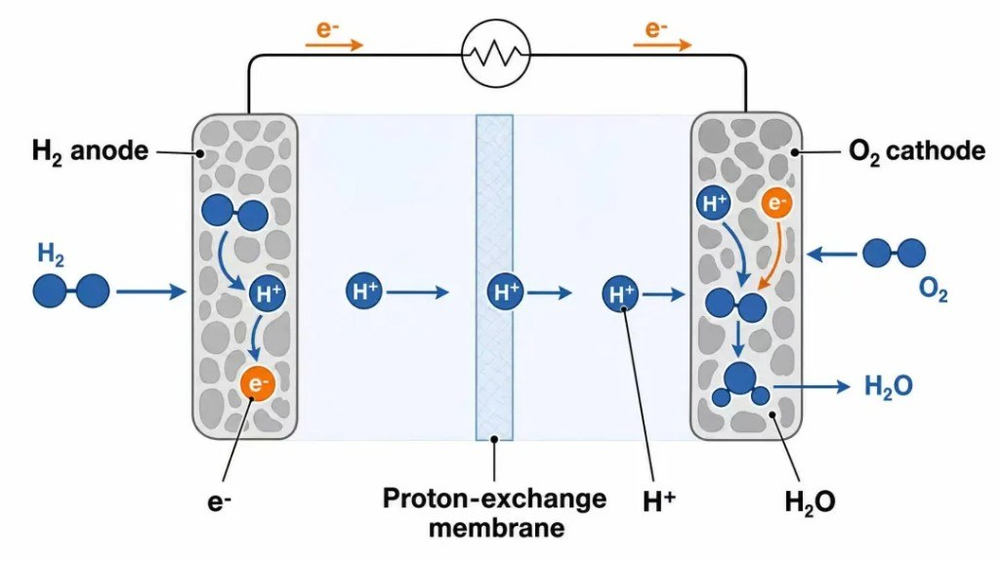
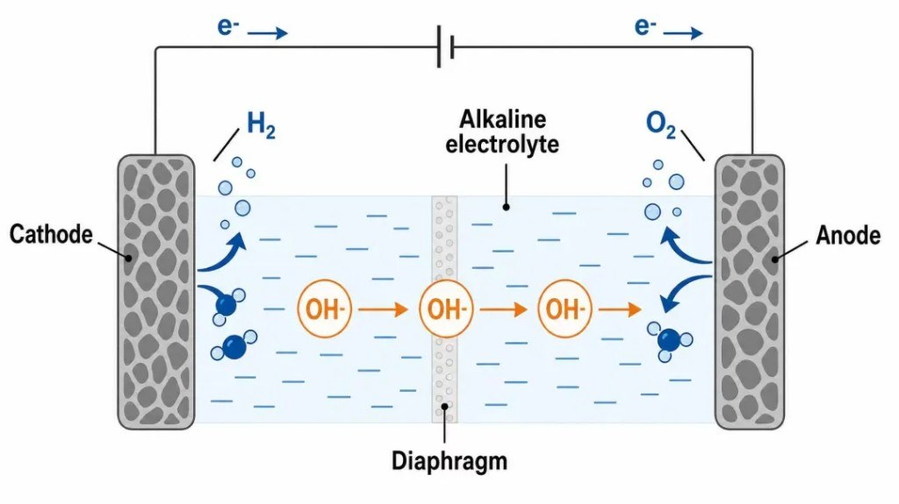
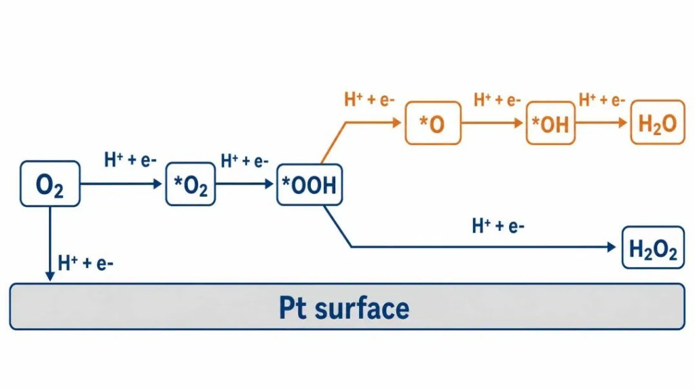
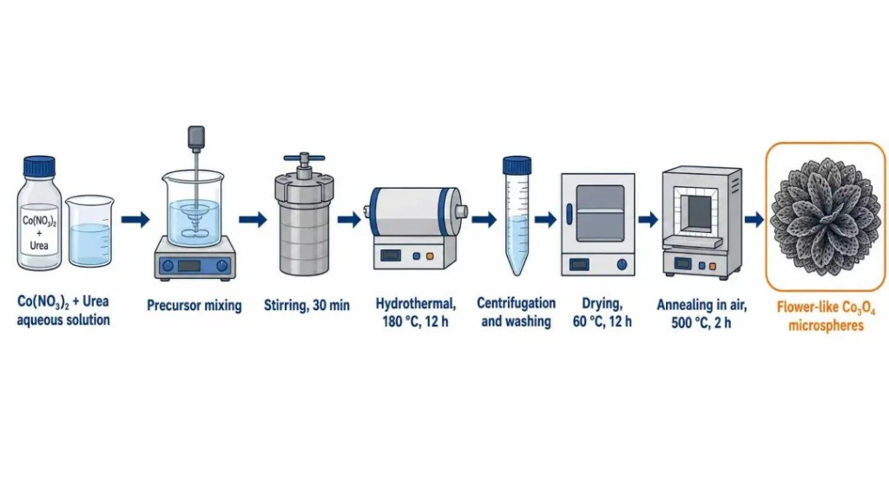
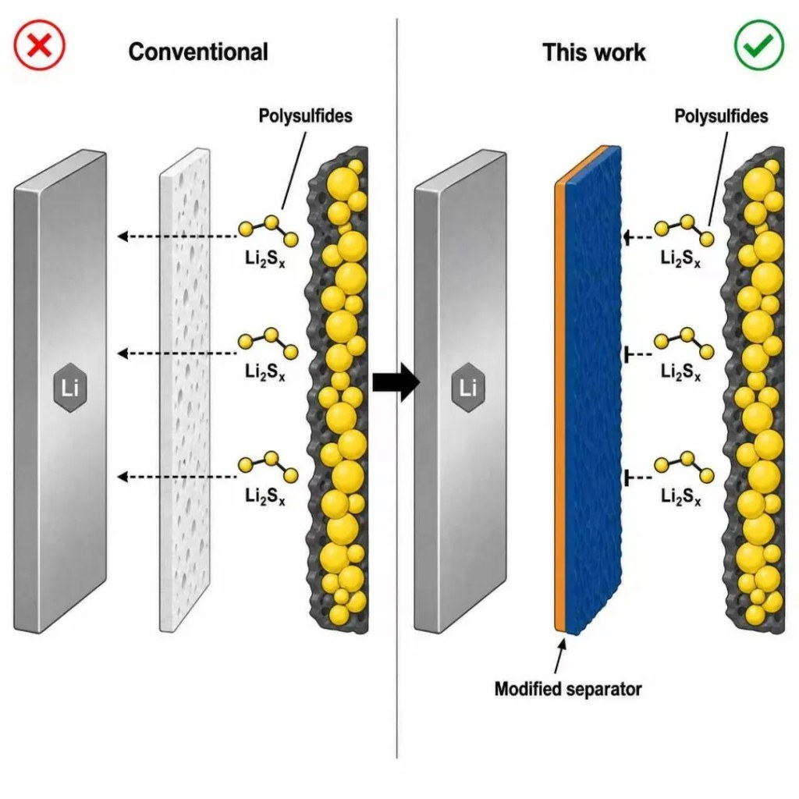
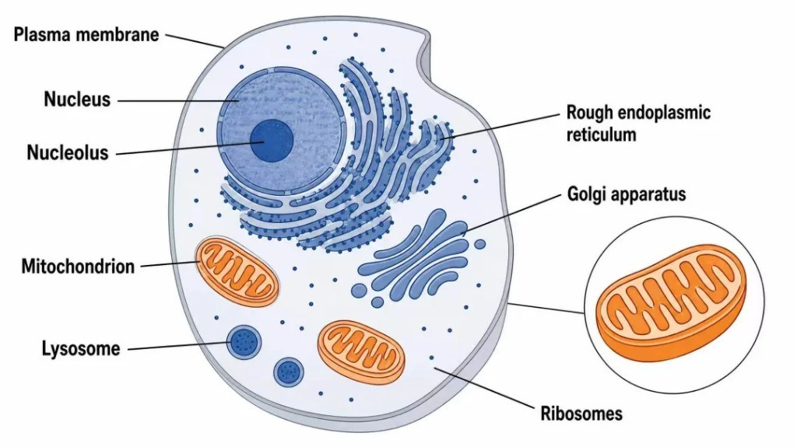
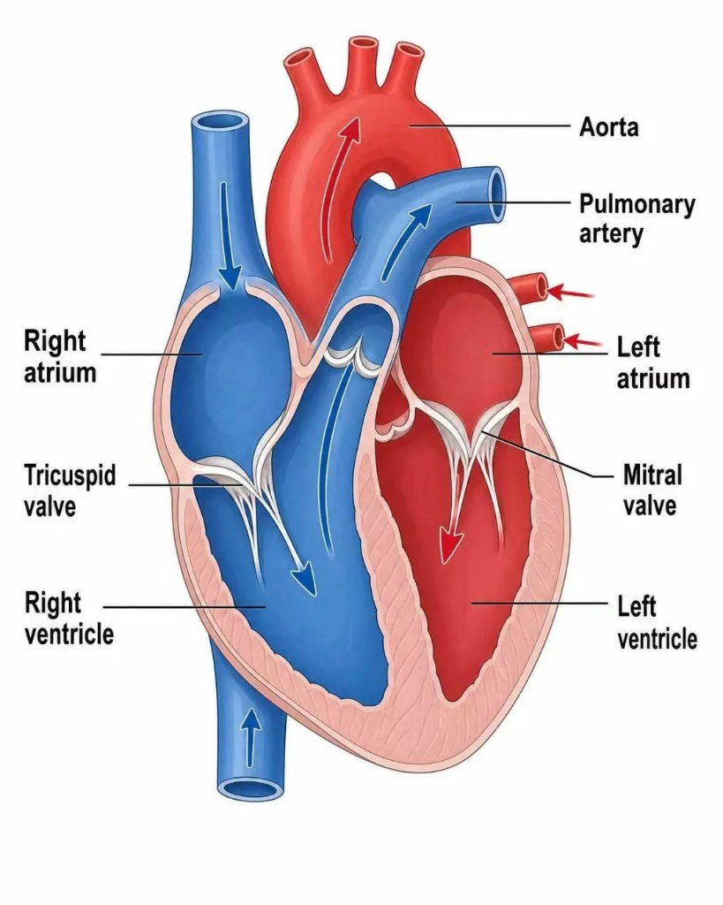

通用生图画科研机理，翻车点往往不在「好不好看」：下标丢了、连字符被改、多出来你没写过的中间体——意思已经变了。

[PictureFlow](https://pic.sci2ai.com) 走另一条路：你填**已确认**的中文要点，选画风或专业模板，系统管构图与术语落图。它不发明机理，也不造实验数据。注册限 `.edu` / `.edu.cn` / `.ac.cn`；文称赠 12 积分，按量计费（价格以官网为准）。

## 它画什么，不画什么

| 画 | 不画 |
|---|---|
| 器件剖面、反应路径、制备流程、TOC 对照、结构示意 | 散点/柱状/误差棒/拟合/p 值等**数据图** |
| 把已定内容画清楚 | 替你「发现」新中间体或实验结论 |

投稿合规、期刊 AI 披露政策，仍要你自己查；出图后对照原始资料逐项核。

## 样图在证明什么

作者称下列为站内直出、无后期。电化学同一模板切换时，**电极名、外电路、离子方向、产物要一起变**，不能只改标题。

反应路径更吃标注：ORR 共同路径再分 4e⁻（水）与 2e⁻（过氧化氢）。星号与上下标当受控字段，目标是按输入落图，不是模型自由润色——**仍须你校对**。

制备链要保序：混合 → 水热 → 离心洗涤 → 干燥 → 退火 → 产物。装置图标是阅读锚点，不是装饰。

TOC 一眼对照问题与改进（如多硫化物穿梭 vs 改性隔膜阻隔），不是把全文缩成海报。

生物医学模板仍标 beta：细胞结构、心脏剖面等可做教学/初稿；临床与病理结论别省复核。文内 EGFR–MAPK 通路样例本次未附。

## 三个入口怎么选

官网当前也是「画风 / 专业模板 / 自由画」三分：

| 入口 | 你手里有什么 | 适合 |
|---|---|---|
| 画风 | 一句话想法 | 快速比平面 / 2.5D / 3D 视觉方向 |
| 专业模板 | 总反应、材料、步骤、标注已定 | 投稿/标书主战场；中文槽位；文称约 13 模板五类 |
| 自由画 | 自己会写提示词 | 不套模板、不做增强 |

器件工作台常见选项：2K/4K、比例、中英/无字、最多两张参考图；模型侧文称有 Image2 / Nano Banana Pro（名称随产品页变动）。

## 第一次怎么试

1. 学术邮箱注册 → 别一上来画论文总图。
2. 挑熟对象：五步制备、一张器件剖面、或两分支反应网络。
3. 先填示例，再换成自己的术语与步骤。
4. 出图后**沿箭头走一遍**：文字、下标、方向、节点。
5. 等待约 1–2 分钟；可关页后回历史记录（文称 2K=6 分、4K=8 分，以官网为准）。

## 图可以快，内容不能快进

图可以快一点，科学内容不能跟着快进——工具负责构图与落字，你负责机理为真。
