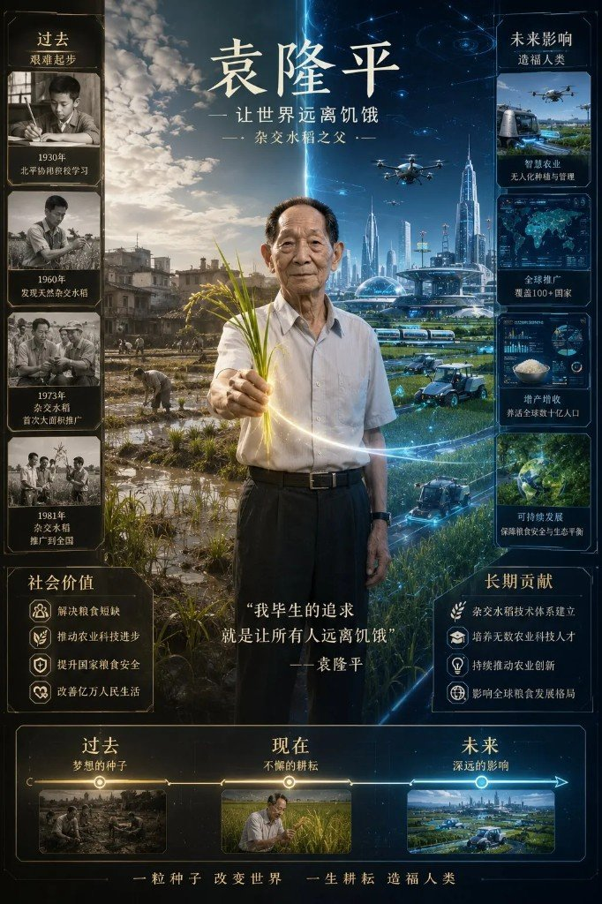
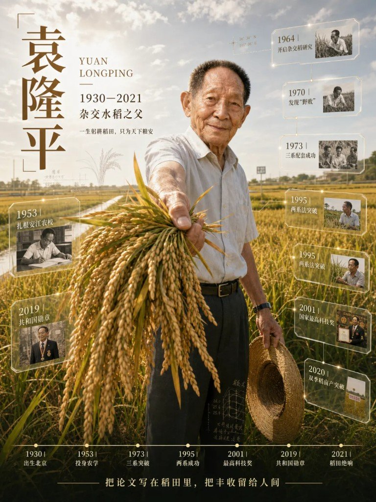
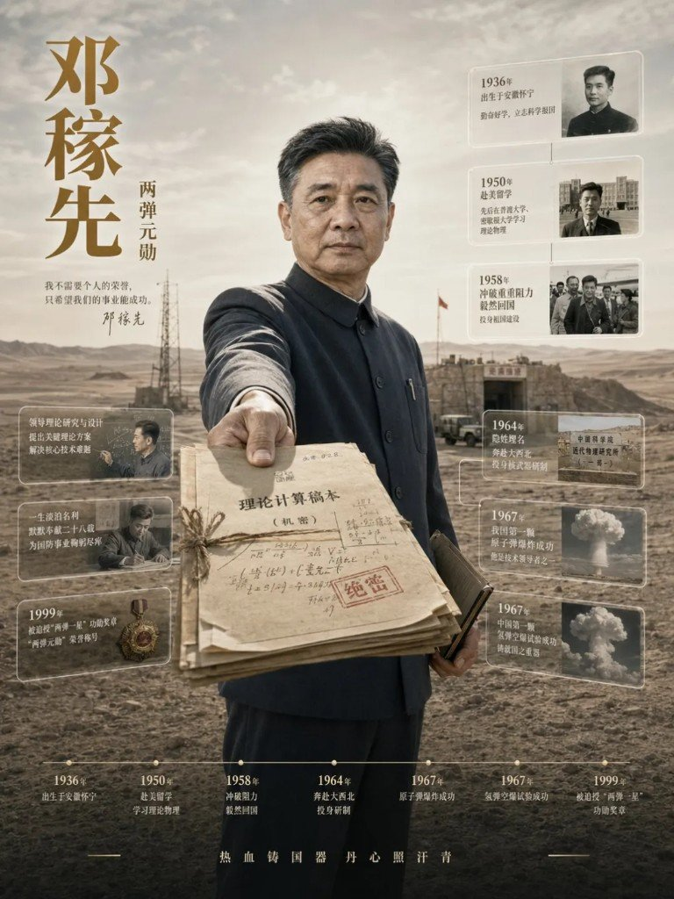
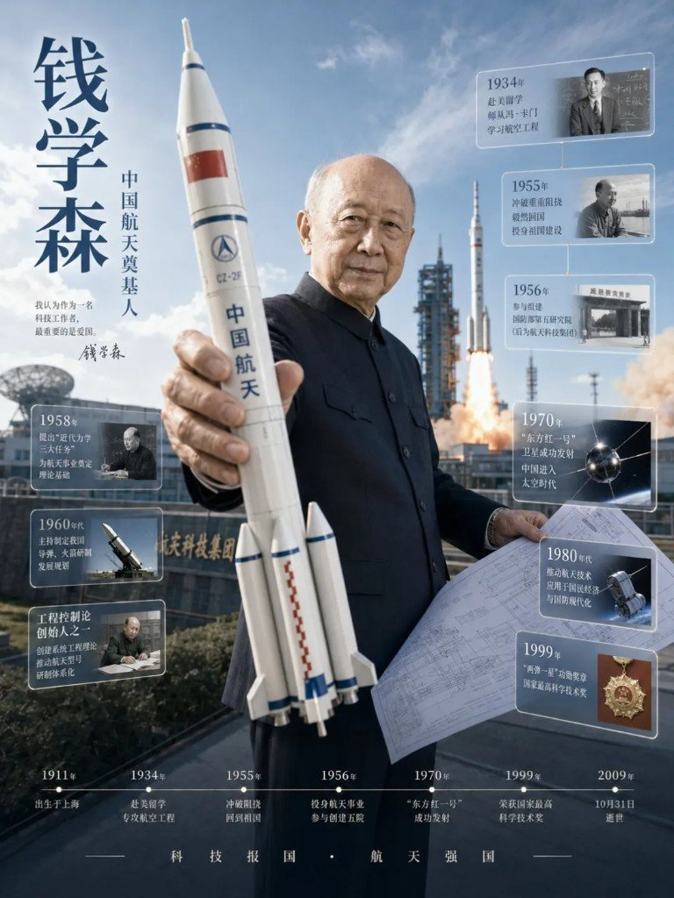
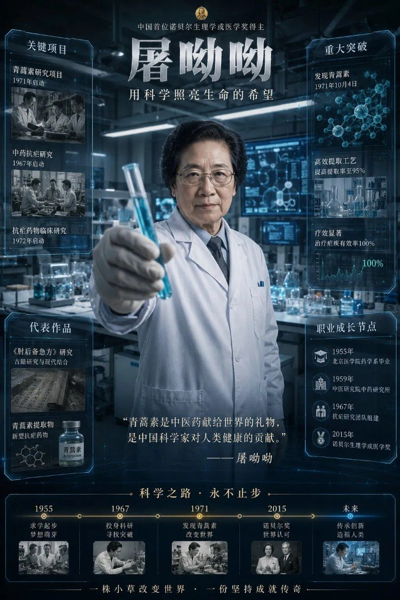
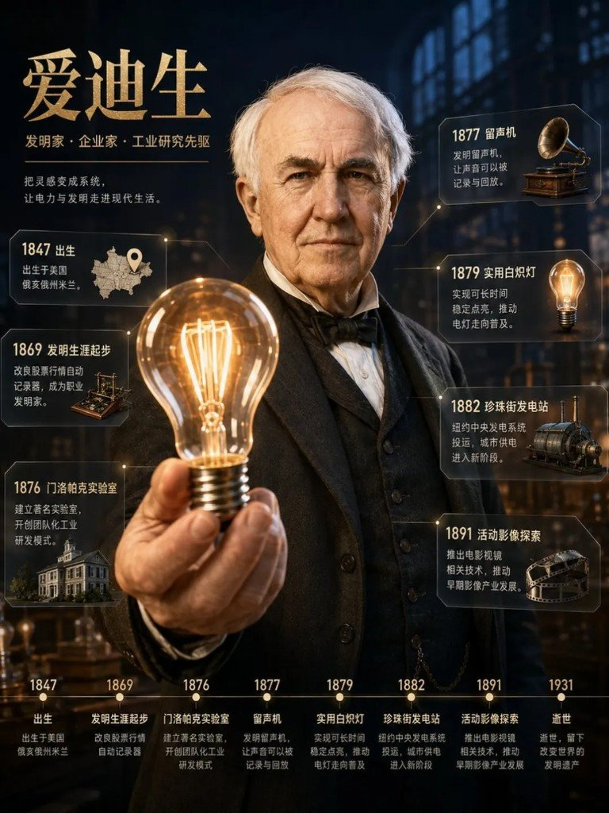
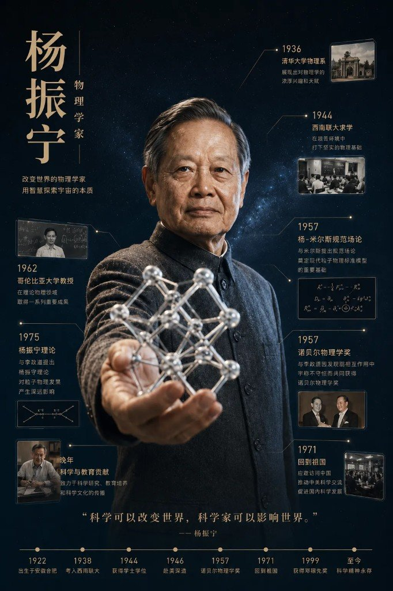

好看的人物海报不难。难的是换一个人名，还能保持同一套版式语法——竖构图、道具前伸、信息切片、底栏时间轴——并且事实别写错。

有人把一段能跑的 Prompt 直接丢给同事：「照着改名字就行」。结果每人重查一遍资料、重填一遍字段，风格漂、年份错、脸还像隔壁那位。这篇原料的做法反过来：**先把 Prompt 拆成可复用的 Skill（岗位说明书 / SOP），再加确认闸门，最后才让 GPT Image 2 出图。**

---

## Prompt 本身已经很完整，问题在复用

那段能出片的 Prompt，要素其实钉得很死：

| 要素 | 干什么 |
|---|---|
| 竖版 **3:4** | 信息海报常用画幅 |
| 写实人物立像 | 脸与气质要像本人，不是卡通滤镜 |
| 标志性道具 **前伸 3D** | 稻穗 / 试管 / 火箭模型 / 灯泡……压出景深 |
| **6–8** 块信息切片 | 节点卡，别堆成墙 |
| 左侧大字姓名 | 一眼认人 |
| 底部时间轴 | 生平骨架 |
| 风格关键词 | 色板、光感、材质锁住系列感 |

一次跑通没问题。麻烦在于：**每个人都要自己重查资料、重填字段**。Prompt 是一次性口头交代；团队要的是可交接的岗位。

---

## Skill = 岗位说明书，不是更长的 Prompt

把流程写进 Skill 之后，Agent 更像一个固定工种：调研 → 出确认卡 → 等人点头 → 写 `research.md` 与提示词文件 → 生图 → 质检。

确认闸门是关键一刀。没确认就出图，错名、错年、错道具会直接印上海报。确认卡通常要钉死这些字段（文称有 UI 截图，**附件未给**[^miss]）：

- 人物姓名 / 称谓
- 来源类型（百科 / 论文 / 官方年表 / 其他）
- 时间轴节点草案
- 主道具与构图意向
- 风格关键词
- 禁止项（别画错时代服装、别乱加勋章等）

人机分工也清楚：人负责选题、确认与终检；机器负责检索整理、填模板、出图与自检清单。

金句就三句，够用：

1. **Prompt 一次性，Skill 可复用。**
2. 像流水线：上游钉规格，下游别每次重新发明。
3. 人机各干各的——确认归人，执行归员工。

---

## 袁隆平先跑通：确认 → 写错名 → 质检 → 修订

首例用袁隆平把整条链路走通：填确认卡、标明来源类型、生成研究底稿与提示词，再出海报。过程里出现过**名字写错的首版**——质检拦住，修订后再交付。（首版错名图、确认卡截图、交付目录树：文称有，**附件未给**。[^miss]）

附件里袁隆平有两张不同构图，都保留：

### 过去 / 未来分屏版

左稻田「艰难起步」，右未来城「造福人类」，中间稻穗前伸发光——叙事向更强。



### 稻田写实最终版

金黄稻田、草帽、八块信息切片 + 底栏时间轴——更接近「系列可复用」的最终语法。



交付物约定是三件套：**海报 PNG + `research.md` + 提示词文件**（后两件样例截图未给）。

---

## 同系列样张：邓稼先 / 钱学森 / 屠呦呦 / 爱迪生

正文列举还跑过邓稼先、钱学森、屠呦呦、爱迪生、**贝聿铭**。附件里有前四位的样张；贝聿铭图未给。另有一张**杨振宁**样张在附件里，正文未展开——脚注保留，不当成正文案例硬写。[^yang]

### 邓稼先：绝密稿本前伸

荒漠试验场，手持「理论计算稿本（机密）」卷宗，信息切片围着两弹节点。



### 钱学森：火箭模型前伸

长征运载火箭模型 + 蓝图，身后发射与测控场景。



### 屠呦呦：两张构图都留

实验室青蓝 HUD + 试管版：



青蒿素瓶为主道具版（古籍 + 青蒿枝）：


### 爱迪生：白炽灯前伸

暖金实验室，灯泡怼向镜头，切片覆盖门洛帕克到珍珠街发电站。



### 附件多出来的杨振宁（正文未展开）

晶体/分子结构道具前伸，黑金宇宙底。正文案例列表没写他，样张仍归档备查。[^yang]



评论回复确认生图模型是 **GPT Image 2**。同模型其他玩法见旁链玩法盘点 / 高张力海报——主题相关，交付形态不同。

---

## 认清它解决的是哪一层

| 你卡在哪 | 这篇帮得上吗 |
|---|---|
| 只会一次出图，换人就重写 | 帮得上：Skill + 确认卡 |
| 要神魔浮雕 / 古装脸谱 | 去西游谱，别硬套写实科学家模板 |
| 只要 Coze 三十秒出图 | 去 Coze 历史人物海报笔记 |
| 要仓库级路由规矩 | 去 AGENTS / CLAUDE.md 模板 |
| 要 Skill 公开仓库地址 | 原文没给——别猜 |

把 Prompt 当一次性咒语，你会一直当「会写提示词的人」。把它写成带确认闸门的岗位 SOP，你才开始有「AI 员工」。

---

## 附录：人物海报提示词 · 填空骨架

> **口径**：任务要求收录评论区作者贴出的完整提示词模板（verbatim）。本轮素材包**未附评论区原文**，下列按正文「Prompt 要素」整理成填空骨架，**勿当作作者原文逐字照录**。若补贴评论截图/全文，应整段替换本附录。

```text
【画幅】竖版 3:4 信息海报

【主体】写实人物立像：{姓名}（{称谓/身份}）
- 五官、年龄感、气质符合公开形象
- 服装与时代匹配：{时代服装要点}

【道具 · 前伸 3D】
- 主道具：{标志性道具}，手臂向前伸向镜头，形成景深突出
- 禁止：平面贴图感、道具悬浮无接触

【信息切片】6–8 块
- 每块含：年份 / 短标题 / 一句事实
- 节点草案：
  1. {年} {事件}
  2. {年} {事件}
  3. {年} {事件}
  4. {年} {事件}
  5. {年} {事件}
  6. {年} {事件}
  （可选 7–8）

【排版】
- 左侧大字姓名：{中文名}（可附拼音/外文名）
- 底部时间轴：{起点年} → … → {终点年/至今}
- 可选金句：{一句引言}

【风格关键词】
{色板}；{光感}；{材质}；写实摄影感；信息图 UI；高细节；无水印乱码

【禁止】
错名、错年、错勋章/奖项；现代道具穿越；过度赛博滤镜破坏系列一致性
```

生图侧按评论回复使用 **GPT Image 2**。

---

[^miss]: 文称有 Codex 拆 Skill 过程、确认卡、`research.md`、提示词文件、错名首版、交付目录等截图；本次附件仅 8 张人物样张，过程图未给。
[^yang]: 附件含杨振宁样张，正文列举为邓稼先 / 钱学森 / 屠呦呦 / 爱迪生 / 贝聿铭——杨振宁未展开；贝聿铭样张附件亦无。
