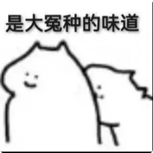
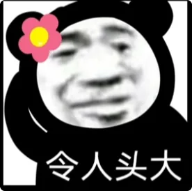

## 前言
你们有没有发现这样一个问题：从古至今修行的人少说也有百亿了，但真正修成的人为什么屈指可数呢？

因为过去几千年所有的修法都是妖魔鬼怪创造出来的，跟正神半点关系都没有。妖魔鬼怪自己都修不上去，又怎么给人类指一条正确的修行之路？人类连正能量的世界是怎么运行的都不知道，又怎么可能知道怎么修？

我前面讲过，负能量世界的运作规则就是弱肉强食，说白了就是吃来吃去，吃你没商量。

## 正能量世界的运作规则
这一集我们讲正能量世界的运作规则。很多人一听正能量就自动以为它应该是**大爱的、光明的、无条件的**——错!

正能量的世界稍微文明一点，但是也是有规则的。这个规则就是**能者拿**。那怎么拿呢？

正能量的世界讲究**从上到下按级分发**: 
*也就是上一个级别的能量体把自身一小部分的纯正能量分给下一个级别的能量体。*
然而一个能量体最重要的就是自己的能量值。**能量值等于生命**，这就是为什么纯正能量非常珍贵。因为分发下去的是自己的能量值，也就是自己的生命。
除了本源之外，所有能量体的能量值都是有限的。既然是有限的、是硬通货，就会有一套非常严苛的规则，受到非常严苛的把控，就不会随随便便给你。

这一套理论是不是听都没有听过？很多人就会疑惑：
* 为什么正能量的世界不是光与爱呢？
* 为什么不是无条件呢？
* 为什么不是一连接就有呢？
* 为什么不是我一召唤就来了？

那你觉得可能吗？你当神仙是客服吗？你当自己是上帝吗？

## 什么是正能量系统
既然规则是分发，那分发的标准又是什么呢？

你就想象正能量世界是一个**银行系统**，都是老天爷在把控。所有正能量系统里面的能量体，也就是神仙、佛菩萨都听令于老天爷。
这个银行在地球的各个地方都是有分行的，而每个分行都有神灵掌管，也有凶兽守护，而老天爷只照顾自己人。

## 怎么进入正能量系统？
什么是自己人？
* **首先，你得入门**：你得登记在纯正能量分发的系统里面，你得是老天爷的人。不然系统都不认识你，怎么给你发？就好像银行里面都没有你的账户，你又没有银行卡，谁敢给你钱？市面上绝大部分的人听都没听过这个银行，就更别说在系统里了。

## 正能量去哪里拿？
* **其次，即使进入了系统，你得知道在哪儿拿**：你得知道哪里有银行。这一部分的信息也是不对外公开的，如果你不在系统里，根本不可能知道。

## 怎么才能有授权拿？
* **再次，即使你知道了银行在哪，你是不是还得知道银行卡密码？** 你没有密码你怎么证明你有授权？你没有授权谁敢给你钱？

## 能不能随便拿？能拿多少？
最后，在系统里面的、又有密码的人，是不是就能随便拿呢？

那怎么可能呢？你去银行是可以随便拿钱的吗？想拿多少就拿多少的吗？

既然是顶级的资源，那肯定是一分付出一分收获的。你银行里的钱肯定也是人力、物力、财力、时间、精力去堆出来的。**记住，哪个系统都不可能养闲人。**

那是不是贡献了人力、物力、财力就能拿到呢？答案也是否定的。
能拿到什么、拿多少，完全看上一级的心情，包括但不限于：
* 你的修炼程度
* 能力贡献
* 心性关系
* 顺眼程度等

万事不绝对，上面的事我知道的也非常有限，但是付出绝对是没有错的。

## 分发的规则
那这个分发到底是一个什么样子的呢？我给你举个例子你就明白了，还是用数学题来解：

1. **案例一**：假设一个系统里的修行人能量为 1。他经过允许来到了一个能量值为 100 的神灵的家，请求能不能给点能量。神灵觉得这个小朋友最近表现不错，孺子可教，就把自身能量的 1% 分给了这个修行人。这个修行人的能量值就变成了 2，神灵变成了 99。那这个 99 的神灵会不会就垮掉了呢？不会的，因为 1000 的神灵看他最近表现不错，也会给他能量，以此类推往上推。
2. **案例二**：刚刚这个修行人现在能量已经为 2 了，他的修为又是 next level 了，有资格来到一个更高级的能量值为 10000 的神灵的家，请求说能不能给点能量。神灵觉得这个小朋友不错，孺子可教，就把自身能量的 0.1% 分给了这个修行人。0.1% 也有 10 了，那现在这个修行人就变成了 12。

**正能量修行就是去拜访不同神灵的家，相当于纯正能量在地球的分行。分多少、分给谁，完全是由神灵决定的。看你顺眼投缘，或者你的人品好、心性好、贡献大，那就多给点；反之就少给或者不给。**

那么普通人如果来到神灵的家会怎么样呢？
* **首先**，普通人根本就认不出哪里有神灵的家，也根本不知道那里有一个神灵，也就是说你根本找不着银行。
* **其次**，你即使认出了银行，知道那里有银行。能量越大的神灵的家，周围就有越厉害的妖魔鬼怪在把守。没有授权硬取，那就是抢银行了。周围把守的妖魔鬼怪可就有饭吃了，渣都不剩也是非常有可能的。

还有些自认为念一下谁的名号就有保佑的，人家祖师爷下面徒子徒孙没有 1 万也有 8000，人家头都大了，谁认得你谁是谁？
这就好比你去银行，你说你认识银行行长，问题是银行行长认识你不？你光嘴说能取钱不？

## 怎么才能入门？
怎么才能入门？就是你得认识那个**可以通人类和正能量系统的中间人**，这个人必须有权限给你办卡（声明一下这个人不是我）。

你在入门之前：
1. 这个中间人首先要把你身上的妖魔鬼怪给冲掉一些。
2. 再给你身上充一点正能量。

有了正能量，你才能同频共振，才算半只脚踏进正能量世界的大门，这样你才有可能感受得到正能量。一旦感受得到正能量，你才有可能找到正能量存在的银行，这个就是**点化**。

所以找对人比努力重要 1 亿倍，人找不对努力白费。

## 总结
说了这么多，还是回到那句话：你在找到正门之前，所有的修法都是邪法。要么修了个心理作用，要么就是越修越负，被吃的越来越厉害，跟真正的修行真的是半毛钱关系没有。

