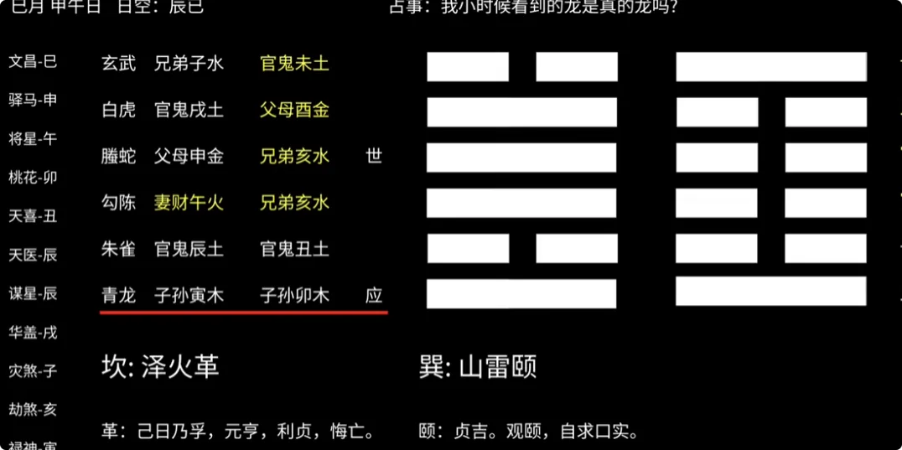

> **第一卦问：世界上是否真的存在龙？**
> 
> **第二卦问：卦童小时候亲眼看到的那条龙，究竟是真实存在，还是儿时的幻觉与记忆偏差？**

## 1. 为什么要起两卦：宏大的问题，和普通小事的起卦方式并不一样

各位好，我们本期看个轻松点的卦：**问龙是否存在？**

开始之前跟各位介绍一下，每期节目的起卦者其实都不是我本人。我自己平常很少起卦，一是我没有什么想问的，二是起卦和解卦都挺费时间。

找我解卦的朋友都知道，大多数时候都是你们自己起的卦，我来解。
我自己需要起卦的时候，用时间或者数字起卦比较多。比如随便想个数字，看看今天的飞机会不会延误、今天会不会堵车，或者找不到的东西在哪里。这些小事情可能很快起个卦，花一分钟扫一眼，就知道答案了，比较省时间。

但当问比较宏大的事情，比如之前问造物主或者某些国事层面的事情，这时候可能就会花费数十天解一个卦象，起卦前做的功课也比较多。

所以本频道其实所有的卦，都是由我们一位专门的**卦童**起的。这位卦童自己一点《易经》都不懂，但可能因为特殊的灵感体质，他起的卦往往不同于常人，往往都十分灵验和准确，信息也很直截了当。

### 起卦真正依赖的，是那一刻的“起心动念”

这是为什么呢？

《易经》作为宇宙运行的底层代码书，它的权限其实是很高的。对于财运、事业、学业，甚至一些未解之谜，对于这些不上锁的东西，它几乎是无上限的，所有人都可以使用。

但是使用这本书的钥匙只有一个：

> **心要足够清明。**

起卦本质靠的是当下那一刻的起心动念，是由起心动念这个 **input** 换来结果 **output**。

> _**只有足够清明的 input，换出来的 output，才能够准确地回答我们真正想问的事情。**_

本期有两卦：
1. **问世界上是否存在龙；**
2. **卦童本人小时候曾说自己见过龙，因此第二卦问：小时候见到的龙是真实的亲眼所见，还是幻觉，或者因为年龄太小而记错了？**

---

## 2. 第一卦：问世界上是否存在龙，得“坤为地”

> **第一卦：问世界上是否存在龙，得卦——坤为地。**

我们先看这个卦的整体。

在中国传统文化中，龙是一种什么样的存在呢？它能腾云驾雾、兴风布雨，是至阳至刚之物。
然而，在问“龙”这个东西的时候，宇宙给出的却是一个**至阴至柔的坤卦**。

### 三个信息，都在指向“它不是普通的肉身生物”

1. **纯阴**
坤卦由六个阴爻组成。

所谓：

> _**孤阴不生，孤阳不长。**_

只要是存在于我们人间的碳基生命，只要它具有肉身、能够活动、能够被我们肉眼所见，它就一定需要某种“阳”的动力。
而阴者为死物，呈现的是毫无生机之象。

2. **六冲**

再看坤为六冲卦，卦中各部分、各爻彼此冲散，难以长久凝聚，也难以稳定成型。
龙若是一种生物，它的细胞、骨骼、能量都必须聚合。
而六冲表现出的，却恰恰是：

> **无法稳定聚合成型。**

3. **应爻旬空**

我们继续看应爻。

应爻可以理解为所问的对象，也可以理解为外部世界对这个问题给出的回应。
这次问的是“世界上存在龙吗”，那么应爻便可视为这个问题所指向的对象，也就是**龙在卦中对应的位置之一**。

而这一卦的应爻，在当日处于**旬空**的状态。
旬空这个词，可以先按照字面意思理解成：

> **落空、没有、不显现。**

也就是说，龙作为一种生物，它是没有的，是不显现的。
所以这一卦分析到这里，出现了三个连续的信息：

- **纯阴**：呈现毫无生机之象；
- **六冲**：无法以稳定肉身形态凝聚；
- **旬空**：没有、不显现。

如果只看到这里，似乎已经可以直接得出一个结论：

> _**龙这种现实世界中的肉身生物，并不存在。**_

但这一卦的内容，才刚刚展开。

---

## 3. 看似“没有龙”的卦里，却出现了一个极其鲜明的“龙象”

因为卦中，还有一个与传统文化中的龙高度吻合的位置。
我们看这个应爻：

> **螣蛇　官鬼　卯木**

应爻，本身就是所问之事，也就是龙。
龙性本淫，好变幻、好繁衍；而这一爻又属**桃花星、螣蛇官鬼**，本身可以取象为缠绕状的鬼神怪异之物。
而卯木又属东方，处震卦之位。

《周易》八卦取象中：
- 乾为马；
- 坤为牛；
- **震为龙**；
- 巽为鸡；
- 坎为豕；
- 离为雉；
- 艮为狗；
- 兑为羊。

卯木处震卦之位，恰恰就代表着**龙**。

> **多象定一象。**

应爻、螣蛇、官鬼、卯木、东方、震位……
这些信息叠加以后，这一爻就如同：

> _**“龙”亲临此卦之中一样。**_

而这时候，真正有意思的矛盾出现了。

---

## 4. 一边说“没有”，一边又龙象鲜明：这两组信息如何统一

现在我们得到了一个看似完全矛盾的局面。

一边是：
1. 坤卦纯阴；
2. 六冲难聚；
3. 应爻旬空。

这些都说明，**龙不像是现实世界中的肉身生物。**

但另一方面，我们传统文化概念中的“龙”，在本卦中却又有十分鲜明的形象，和传统龙象高度符合。

那么这两组信息该如何统一呢？

玄成先生给出的解释是：

> _**龙并非不存在，而是并不以三维世界中的肉身生物形式存在。**_

### 人间为空，但“月建”上的能量却极旺

龙虽然在本卦中旬空，又逢六冲，代表它在凡间没有肉体，但是它高悬于天，与**卯木月建同气同源**。
月建，可以理解为卦中最强盛的气。
若一爻与月建相同，便说明它在卦中的能量处于十分旺盛的状态。
这里就出现了一个非常关键的判断：

> **如果一个事物彻底不存在，它的能量应该趋近于 0。**

但是在此卦中，代表龙的这个卯木，其能量**临月建，是极旺的**。
拥有这样的能量，它绝对不会是一个单纯“不存在”的形象。
所以可以转换一个理解方式：

> **本卦视为人间，日月则视为更高层级的时空。**

它在人间层面为空，没有肉身；可是在更大的天地气场层面，它的能量却极其旺盛。
月建：

> _**掌一月之权，司三旬之令，操持万卜之提纲，巡查六爻之善恶。**_

因此，按照本卦的推演，可以得出这一层结论：

> **龙不以肉身、动物的形式存在于人间，但它存在于另一个更高层级的维度。**

---

## 5. 如果龙不以肉身存在，人类为什么还会偶尔“看见龙”

那么问题又来了：
为什么我们人类仍有机会发现它？
为什么真真假假之间，偶尔仍会听说关于龙的目击事件？
为什么龙的形象、性格、秉性，能够传承上千年而不发生根本改变？

这里就需要再次**转换太极点**。
以上卦为天，下卦为地：
- **上卦**代表高维世界；
- **下卦**代表我们所在的人间；
- **三爻**则处于天地夹缝之间，位居门户之处。

也就是说，它正处于：

> **高维世界与人间之间。**

所以按照这一卦的解释，我们在人间才有机会见到龙，但它并不会轻易显现于人间。

> _**只有等这个旬空的卯木“填实”的机缘到来之时，它才会在三维世间中显现肉身。**_

到这里，第一卦关于“龙是否存在”的逻辑就完整了。

它给出的并不是一个简单的“有”或者“没有”，而是进行了区分：
1. **如果问龙是不是一种长期生活在人间、具有稳定肉身结构的普通动物——卦象是否定的；**
2. **如果问“龙”这个存在本身有没有对应的信息与能量——卦中却出现了极为鲜明而旺盛的龙象；**
3. **因此，本卦最终将它解释成了一种平时不以三维肉身形式存在、但可能在特殊条件下显现的存在。**

---

## 6. 第二卦：卦童小时候在井里看到的那条龙，是真的吗

本期卦童说，他小时候曾经见过龙。
地点是在：

> **一口井里。**

所以第二卦问的就是：

> **小时候看到的那条龙，是真实的吗？**

这也是他本人起的卦。
我们依然以**应爻**为所问之事。
结果这一次，他小时候看到的龙，对应的是：

> **青龙　子孙　卯木**

又是**卯木应爻**。
刚刚说过，卯木属东方，处震卦之位，而八卦中：

> **震为龙。**

你看，在这里依然是这么相应。
而且这次临的还是：

> **青龙。**

意思就更加明显了。

### 初爻、丑土与“井下”的位置

所问的位置是在卦之**初爻**，也就是起卦过程中第一个得出的爻位。
多象定一象，这个意思就很明显指向了：

> **童年时期见到的那条龙。**

它又位于**初爻丑土之下**。
丑土为冰冷、阴湿之土，在这里可以取象为：

> **井。**

所以“龙在井下”的位置关系，也与他童年时描述的情景对应上了。

更重要的是，这一次的卯木**并没有旬空**。
这就与第一卦出现了很大的区别。
第一卦中的龙：

> **旬空——没有人间肉身。**

而第二卦中的这条龙：

> **没有旬空——在当时是有实体、有肉身的，所以他才能够看见。**

---

## 7. 为什么这条“井中的龙”会出现：卦象显示它当时极其虚弱

不过，这条卯木在**火月、火日**的卦中，木气极其孱弱。
这就和第一卦中看到的那种状态完全不同。
第一卦里的龙，卯木临月建：

> **能量极旺。**

而第二卦里的这条龙，本来应该十分强劲、十分有能量，但此时却：

> **能量极弱。**

所以按照卦象继续向下推，玄成先生认为：

> _**它应该是受伤了。**_

而且它显现的时间也极短：

> **如白驹过隙。**

这一卦解到这里，其实已经足够回答卦童最初提出的问题：

> **他小时候看到的究竟是不是龙？**

按照这一卦的推演，答案指向的是：

> **那次经历并非单纯的幻觉或者儿时记错，而是当时确实出现了一条具有实体的龙；只是它处于极其虚弱、疑似受伤的状态，所以才短暂显现于井中。**

不过一卦中仅六个爻，其中却有**四爻皆动**。
如果继续深挖，这个卦还能解得非常复杂。
剩下的四爻，讲的其实都是：

> **这条龙为什么会受伤？**
> 
> **它为什么会落入这口井？**
> 
> **在它出现之前，究竟发生了什么？**

不过本期到这里，就先不继续往下说了。