## 复习说明
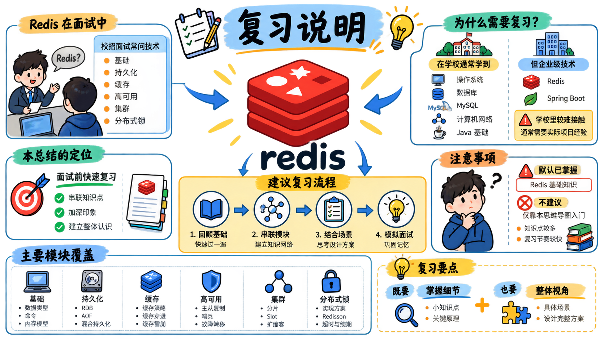

Redis 是校招面试中经常被问到的技术，涉及**基础、持久化、缓存、高可用、集群、分布式锁**等多个模块。对于找工作前没有接触过开发的同学来说，Redis 可能是一个比较陌生的概念。

本科阶段通常会学习操作系统、数据库、MySQL、计算机网络、Java 基础等开发相关知识，但 Redis、Spring Boot 这类企业级开发中真正会用到的技术，在学校里往往很难接触到，除非真正做过开发项目。偏偏在招聘面试中，面试官又很喜欢提问这些内容，因此我花了很多精力，完整学习了一遍 Redis，并进行了相关实践。

这份总结默认大家已经掌握 Redis 的基础知识，主要用于**面试前快速复习和串联知识点**，帮助加深印象。如果还没有 Redis 基础，不建议只靠这份思维导图入门，因为涉及的知识点较多，复习节奏也会比较快。

> 学习 Redis 面试题时，既要掌握一个个细小的知识点，也要形成整体视角：面对一个具体场景或业务问题，应该怎样设计完整方案。

## Redis 基础
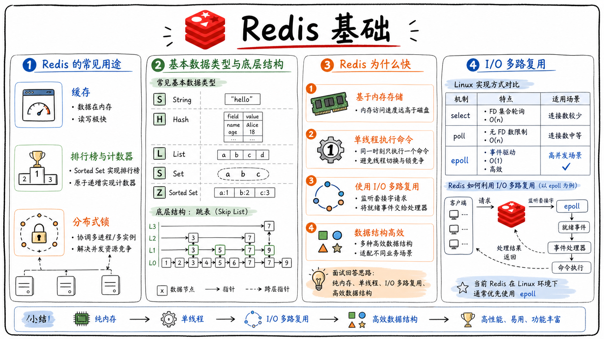

## Redis 的常见用途
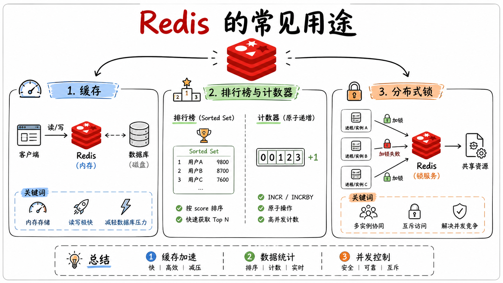

Redis 主要有三类常见用途：

1. **缓存**
   
   Redis 的数据主要存储在内存中，读写速度非常快，远超基于磁盘存储的传统数据库，因此缓存是它最常见的应用场景。

2. **排行榜与计数器**
   
   Redis 的 `Sorted Set`（有序集合）非常适合实现排行榜；原子递增操作则可以用于实现计数器。

3. **分布式锁**
   
   Redis 可以协调多个进程或服务器实例对共享资源的访问，用于解决并发环境下的资源竞争问题。

## 基本数据类型与底层结构
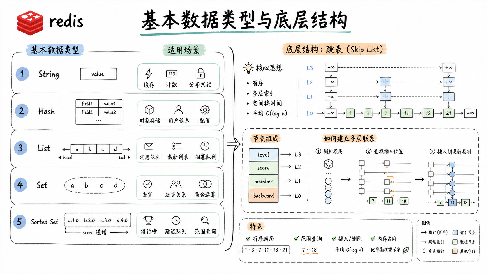

Redis 常见的基本数据类型包括：

- `String`
- `Hash`
- `List`
- `Set`
- `Sorted Set`

这些数据类型各自适用于不同场景。如果真正做过相关项目，对它们的使用方式通常会有比较深刻的印象。

除基本数据类型外，还需要了解 Redis 的底层数据结构。底层结构很多，但面试中经常被问到的是**跳表（Skip List）**。

跳表是一种有序数据结构，通过在每个节点中维护多个指向其他节点的指针，实现对节点的快速访问。需要理解跳表的节点组成，以及节点之间如何通过多层指针建立联系。

## Redis 为什么快
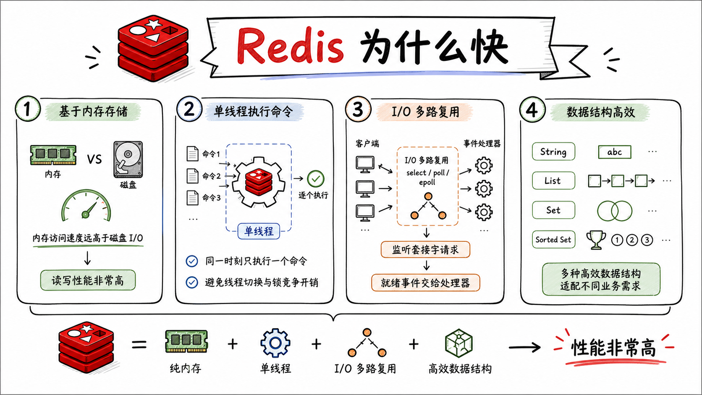

Redis 性能高，主要有以下几个原因：

1. **基于内存存储**
   
   内存访问速度远高于磁盘 I/O，因此 Redis 的读写性能非常高。

2. **采用单线程执行命令**
   
   Redis 使用单线程处理命令，在同一时刻只有一个命令被执行，避免了线程切换和锁竞争带来的额外开销。

3. **使用 I/O 多路复用**
   
   Redis 基于 Linux 的 `select`、`poll`、`epoll` 等机制监听套接字上的请求，再将就绪的事件交给事件处理器处理。

4. **数据结构高效**
   
   Redis 提供了 `String`、`List`、`Set`、`Sorted Set` 等多种高效数据结构，可以适配不同的业务需求。

> 面试回答“Redis 为什么快”时，可以围绕**纯内存、单线程、I/O 多路复用、高效数据结构**四点展开。

## I/O 多路复用
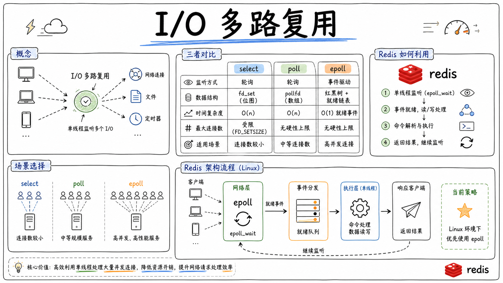

Linux 常见的 I/O 多路复用实现包括：

- `select`
- `poll`
- `epoll`

需要了解三者之间的区别、各自适用的场景，以及 Redis 如何利用 I/O 多路复用机制提升网络请求处理效率。当前 Redis 在 Linux 环境下通常优先使用 `epoll`。

## Redis 持久化
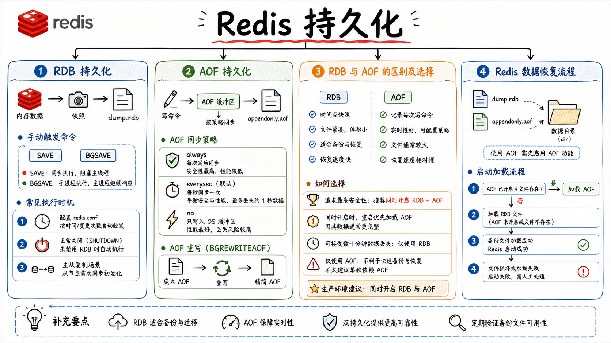

## RDB 持久化
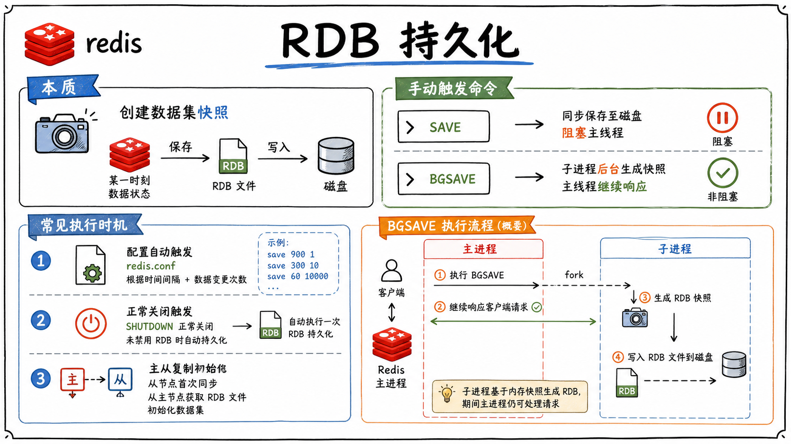

RDB 本质上是创建数据集快照：在指定时间间隔内，将 Redis 在某一时刻的数据状态保存到磁盘中的 RDB 文件。

RDB 可以通过以下命令手动触发：

- `SAVE`
- `BGSAVE`

二者的区别如下：

- `SAVE` 会同步地将 Redis 数据保存到磁盘，执行期间会阻塞主线程。
- `BGSAVE` 会通过创建子进程，在后台异步生成数据快照。执行期间 Redis 主进程仍可继续响应客户端请求，因此对服务可用性的影响较小。

RDB 的常见执行时机包括：

1. 在 Redis 配置文件 `redis.conf` 中，根据时间间隔和数据变更次数配置自动触发条件。
2. Redis 服务器通过 `SHUTDOWN` 命令正常关闭时，如果没有禁用 RDB，会自动执行一次持久化。
3. 在主从复制场景中，从节点首次与主节点建立同步时，通常会通过主节点生成的 RDB 文件初始化数据集。

## AOF 持久化
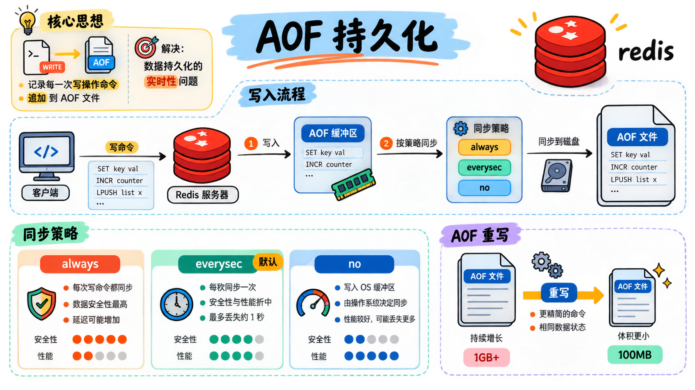

AOF 通过记录每一次写操作命令，并将命令追加到 AOF 文件中实现持久化。它主要解决数据持久化的实时性问题。

启用 AOF 后，Redis 服务器接收到写命令时，会先将命令写入 AOF 缓冲区，再按照配置的同步策略将缓冲区内容同步到磁盘文件。

随着写操作不断执行，AOF 文件会持续增长。为了减小文件体积，Redis 支持对 AOF 文件进行重写，以更精简的命令重新表达当前数据状态。

### AOF 同步策略

AOF 主要有三种同步策略：

1. **`always`**
   
   每次执行写命令后都将数据同步到 AOF 文件。数据安全性最高，但同步次数多，可能增加延迟并影响性能。

2. **`everysec`**
   
   每秒同步一次，也是默认策略。它在安全性与性能之间进行了折中；如果系统崩溃，最多可能丢失约一秒的数据。

3. **`no`**
   
   Redis 只负责将数据写入操作系统缓冲区，具体何时同步到磁盘由操作系统决定。性能较好，但发生故障时可能丢失更多数据。

## RDB 与 AOF 的区别及选择
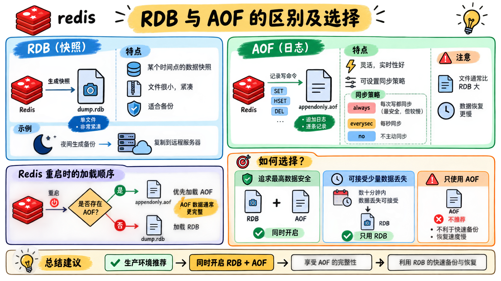

RDB 是一个非常紧凑的单文件，代表 Redis 在某个时间点的数据快照，因此很适合用于备份。例如，可以在夜间生成备份，再复制到远程服务器。

AOF 最大的优点是灵活、实时性好，可以设置不同的同步策略。如果选择安全性最高的 `always`，每次写操作都会进行同步，但速度会相对较慢。同时，AOF 文件通常比 RDB 文件大，数据恢复速度也更慢。

具体如何选择，需要根据业务场景决定：

- 如果希望尽可能保障数据安全，最好同时开启 RDB 和 AOF。
- 同时开启时，Redis 重启通常会优先加载 AOF 文件，因为 AOF 保存的数据一般比 RDB 更完整。
- 如果能够接受数十分钟内的数据丢失，可以只使用 RDB。
- 有些用户只使用 AOF，但这不利于快速备份和恢复，因此不太建议单独依赖 AOF。

## Redis 数据恢复流程
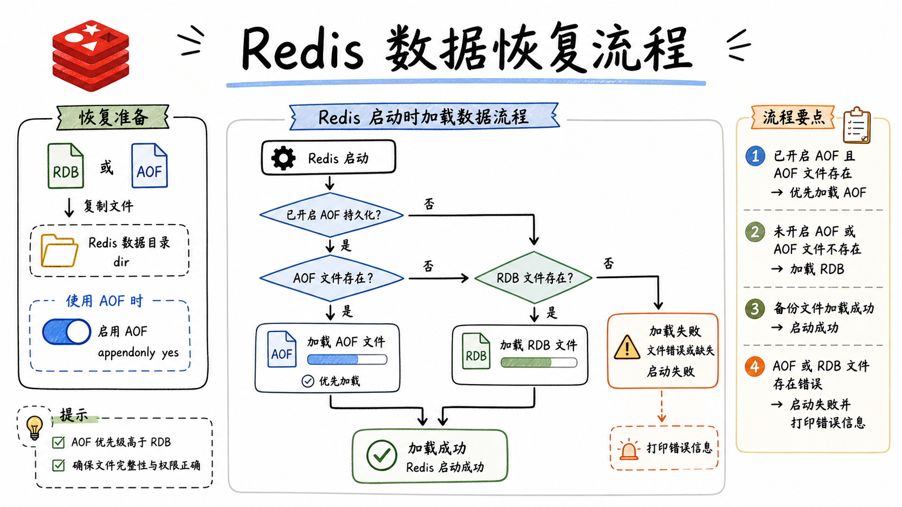

Redis 数据恢复的基本方式，是将 RDB 或 AOF 文件复制到 Redis 的数据目录中。如果使用 AOF，需要先启用 AOF 功能。

Redis 启动时加载数据的流程如下：

1. 如果已开启 AOF 持久化且 AOF 文件存在，优先加载 AOF 文件。
2. 如果未开启 AOF，或者 AOF 文件不存在，则加载 RDB 文件。
3. 备份文件加载成功后，Redis 启动成功。
4. 如果 AOF 或 RDB 文件存在错误，Redis 可能启动失败，并打印相应的错误信息。

## Redis 缓存核心问题
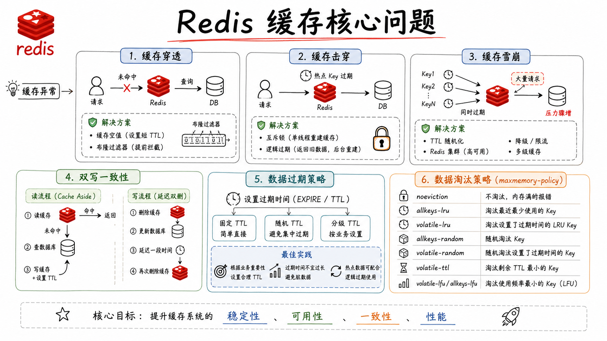

## 缓存穿透、缓存击穿与缓存雪崩
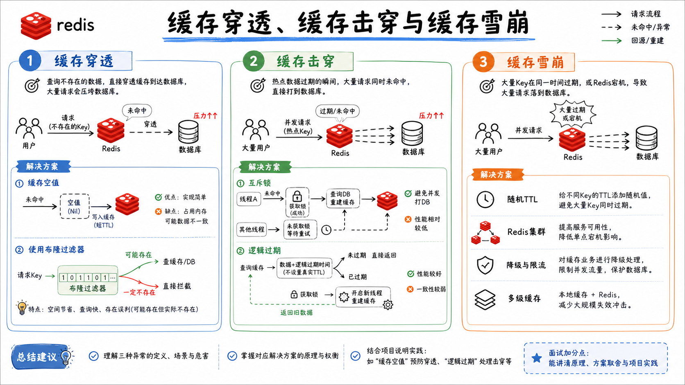

缓存异常是 Redis 面试中的重点，主要包括：

- 缓存穿透
- 缓存击穿
- 缓存雪崩

我在面试中被问过很多次。面试官通常会结合项目提问：“我看你在项目中用到了 Redis，你知道 Redis 的缓存异常有哪些吗？”或者“你是怎么解决缓存异常的？”

因此，最好熟悉三种缓存异常的定义及对应解决方案。

### 缓存穿透

缓存穿透是指查询一个不存在的数据，缓存中没有命中，请求便直接穿过缓存到达数据库。如果大量请求持续查询不存在的数据，就会给数据库带来很大压力。

常见解决方案有：

1. **缓存空值**
   
   查询结果为空时，将空结果也写入缓存。
   
   - 优点：实现简单。
   - 缺点：会消耗额外内存，也可能产生数据不一致问题。

2. **使用布隆过滤器**
   
   布隆过滤器用于判断某个元素是否可能存在于集合中，可以提前拦截一定不存在的数据。不过，布隆过滤器存在一定的误判概率。

布隆过滤器本身的特点、工作原理和误判问题也值得重点掌握。我曾经把缓存异常的解决方案回答完后，面试官继续追问：“你知道布隆过滤器的具体特点吗？它是怎么工作的吗？”所以不能只记住它的名字。

### 缓存击穿

缓存击穿是指某个或少数几个热点数据被高频访问。当热点数据恰好过期时，大量请求瞬间绕过缓存到达数据库，造成数据库压力骤增。

常见解决方案包括：

1. **互斥锁**
   
   一个线程查询缓存未命中后获取锁，查询数据库并重建缓存。其他线程由于无法获得锁，只能等待一段时间后重试。
   
   这种方式可以避免大量请求同时访问数据库，但性能相对较低。

2. **逻辑过期**
   
   热点 Key 不设置真实过期时间，而是在缓存值中记录逻辑过期时间。线程查询缓存时，如果发现数据已经逻辑过期，在成功获得互斥锁后开启新线程重建缓存，同时先返回旧数据。
   
   在缓存重建完成前，其他线程仍返回旧数据。这种方案性能较好，但数据一致性相对较弱。

### 缓存雪崩

缓存雪崩是指某个时间点大量缓存数据同时过期，或者 Redis 服务器突然宕机，导致大量请求全部落到数据库。

常见解决方案包括：

- 给不同 Key 的 `TTL` 添加随机值，尽量避免大量 Key 同时过期。
- 使用 Redis 集群提高服务可用性，降低单点宕机的影响。
- 为缓存业务增加降级、限流策略。
- 建立多级缓存，减少大量 Key 同时失效带来的冲击。

> 对缓存异常，不仅要熟记解决方案，最好还能结合项目说明自己是怎么处理的。例如项目规模较小时，可以说自己通过“缓存空值”预防缓存穿透。

## 双写一致性
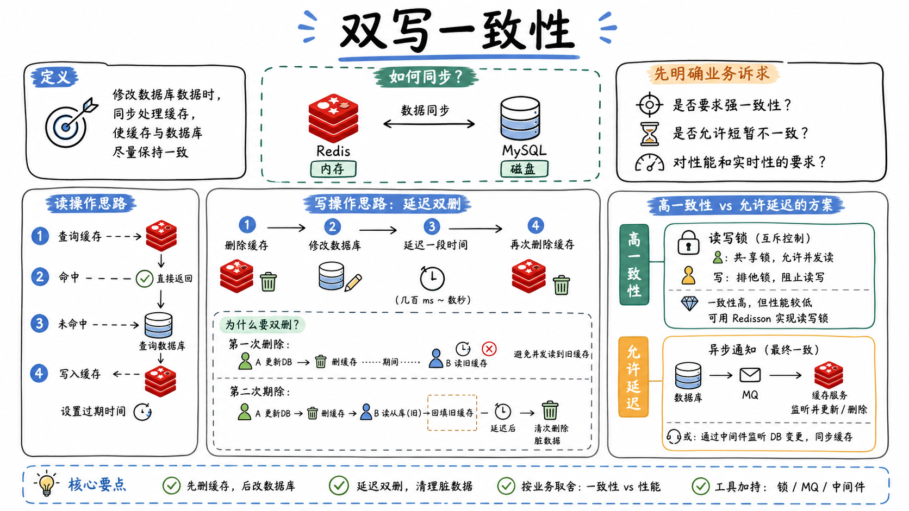

双写一致性是指修改数据库数据时，也要同步处理缓存，使缓存与数据库尽量保持一致。

Redis 数据位于内存中，而 MySQL 数据位于磁盘中，两者如何同步是常见面试题。面试官可能会问项目中如何实现双写一致性，也可能给出具体场景，要求设计解决方案。

回答时，需要根据业务判断：

- 是否要求强一致性；
- 是否允许短暂不一致；
- 对性能和实时性的要求如何。

### 读写操作的基本思路

读操作一般是：

1. 查询缓存。
2. 缓存命中则直接返回。
3. 缓存未命中则查询数据库。
4. 将查询结果写入缓存，并设置过期时间。

写操作可以采用**延迟双删**：

1. 删除缓存。
2. 修改数据库。
3. 延迟一段时间。
4. 再次删除缓存。

第一次删除，是为了避免数据库更新期间并发读请求命中旧缓存。如果不先删除缓存，可能出现线程 A 更新数据库后删除缓存，而线程 B 在此之前读到旧缓存并重新回填，导致缓存中残留旧数据。

第二次删除，是为了清理延迟期间可能被重新写入的脏数据。例如，第一次删除缓存后，线程 B 查询数据库；此时主库已经更新，但从库尚未完成同步，线程 B 可能从从库读到旧值并回填缓存。延迟后再次删除，可以清除这类脏数据。

### 高一致性与允许延迟的方案

对于一致性要求较高的场景，可以使用读写锁：

- 读取数据时加共享锁，允许其他线程并发读。
- 写入数据时加排他锁，阻止其他线程读写。

这种方式一致性较高，但性能较低。实际开发中可以使用 **Redisson** 提供的读写锁。

如果业务允许短暂不一致，可以采用异步通知：

- 数据库修改后发送消息到 MQ。
- 缓存服务监听 MQ 消息并完成更新或删除。

也可以通过相关中间件监听数据库变更，再异步同步缓存。

## 数据过期策略
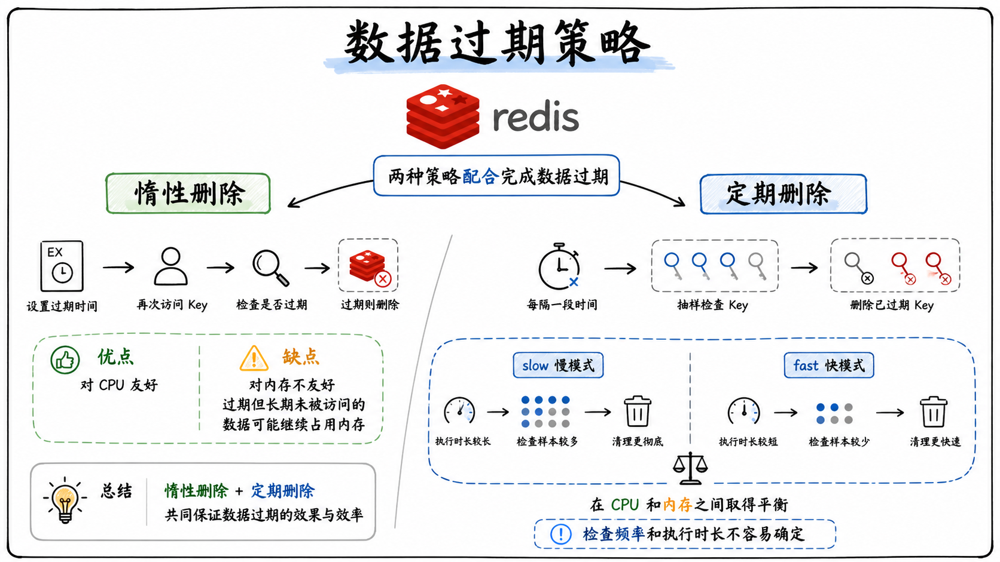

Redis 的数据过期主要由两种策略配合完成。

### 惰性删除

设置 Key 的过期时间后，不会立即删除。等再次访问这个 Key 时，Redis 才检查它是否过期；如果已经过期，就将其删除。

- 优点：对 CPU 友好。
- 缺点：对内存不友好，过期但长期未被访问的数据可能继续占用内存。

### 定期删除

Redis 每隔一段时间抽样检查 Key，并删除其中已经过期的 Key。

这种方式能够在 CPU 和内存之间取得平衡，但检查频率和执行时长不容易确定。定期删除又包含：

- `slow` 慢模式
- `fast` 快模式

## 数据淘汰策略
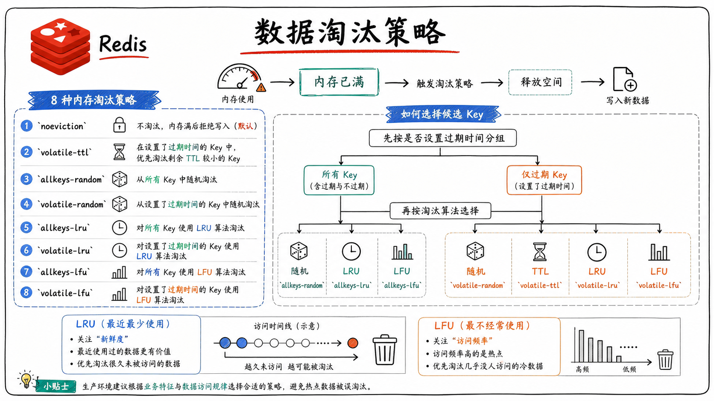

Redis 常见的内存淘汰策略一共有八种：

1. **`noeviction`**
   
   不淘汰任何 Key。内存满后不允许写入新数据，是默认策略。

2. **`volatile-ttl`**
   
   在设置了过期时间的 Key 中，优先淘汰剩余 `TTL` 较小的 Key。

3. **`allkeys-random`**
   
   从所有 Key 中随机淘汰。

4. **`volatile-random`**
   
   从设置了过期时间的 Key 中随机淘汰。

5. **`allkeys-lru`**
   
   对所有 Key 使用 LRU 算法进行淘汰。

6. **`volatile-lru`**
   
   对设置了过期时间的 Key 使用 LRU 算法进行淘汰。

7. **`allkeys-lfu`**
   
   对所有 Key 使用 LFU 算法进行淘汰。

8. **`volatile-lfu`**
   
   对设置了过期时间的 Key 使用 LFU 算法进行淘汰。

**LRU（Least Recently Used）**是“最近最少使用”，可以理解为关注数据的“新鲜度”。它认为最近使用过的数据更有价值，因此优先淘汰很久没有被访问的数据。

**LFU（Least Frequently Used）**是“最不经常使用”，更关注访问频率。它认为访问频率高的数据才是热点，因此优先淘汰几乎没人访问的冷数据。

## Redis 高可用
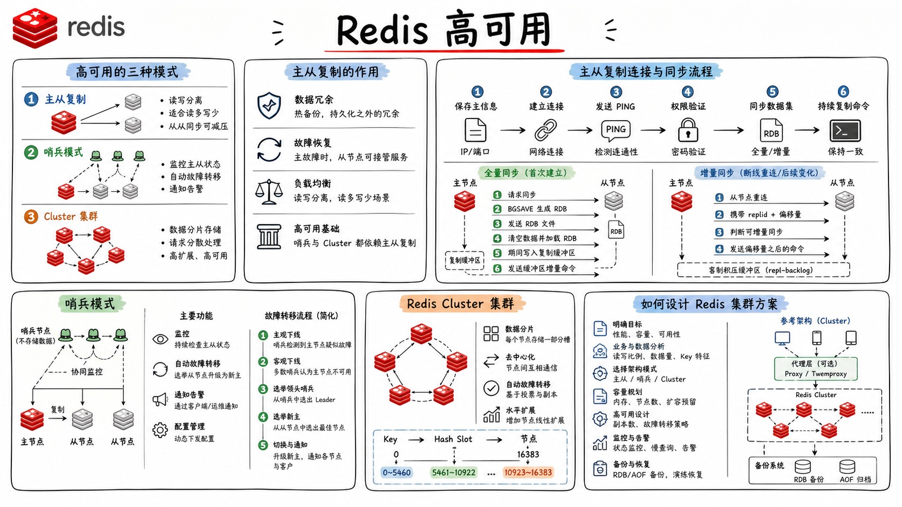

## 高可用的三种模式
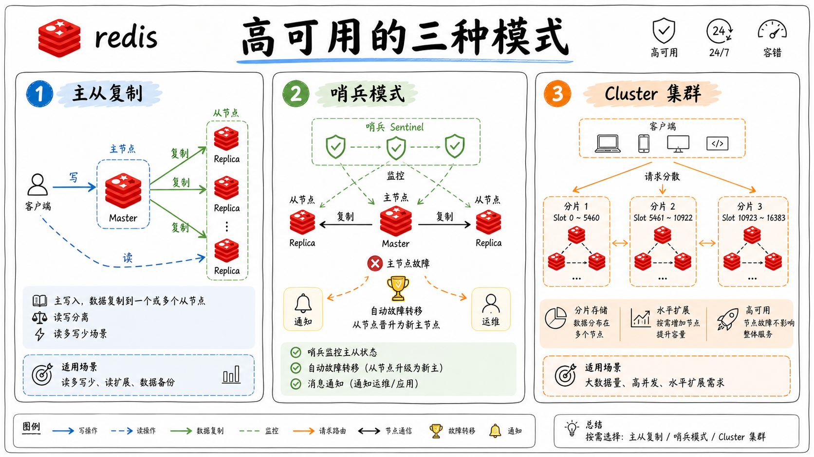

Redis 主要通过三种模式实现高可用：

1. **主从复制**
   
   一个 Redis 主节点可以将数据复制到一个或多个从节点，实现读写分离，适用于读多写少的场景。

2. **哨兵模式**
   
   哨兵用于监控主从节点状态，实现自动故障转移和消息通知。如果主节点发生故障，哨兵可以自动将某个从节点升级为新的主节点。

3. **Cluster 集群**
   
   Redis Cluster 通过分片方式存储数据，每个节点只存储一部分数据，用户请求可以分散处理。

## 主从复制的作用
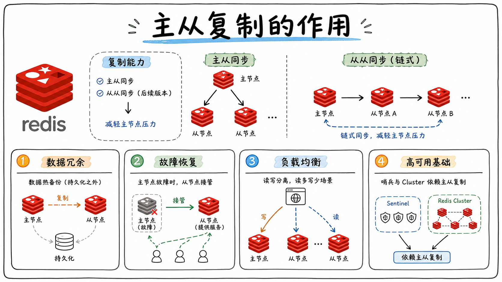

Redis 支持主从同步，也支持从从同步。从从同步是后续版本增加的能力，可以进一步减轻主节点压力。

主从复制主要有以下作用：

1. **数据冗余**
   
   实现数据热备份，是持久化之外的一种数据冗余方式。

2. **故障恢复**
   
   主节点出现问题时，可以由从节点提供服务，实现快速恢复。

3. **负载均衡**
   
   配合读写分离，由主节点提供写服务，从节点提供读服务，适合读多写少的场景。

4. **高可用基础**
   
   哨兵和 Redis Cluster 都依赖主从复制，因此主从复制是 Redis 高可用的重要基础。

## 主从复制连接与同步流程
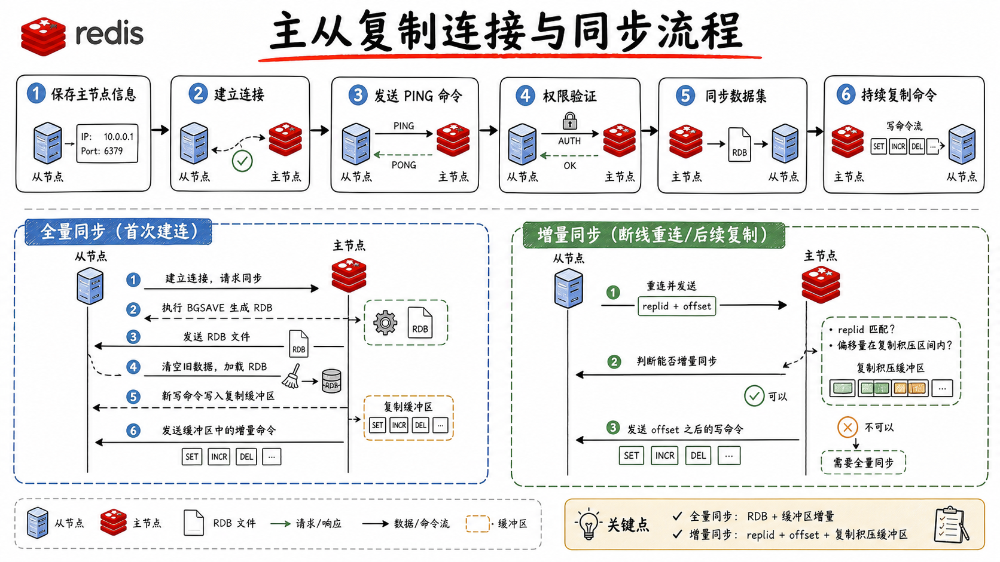

主从复制的基本流程如下：

1. **保存主节点信息**
   
   从节点保存主节点的 IP 和端口。

2. **建立连接**
   
   从节点发现新的主节点后，尝试与主节点建立网络连接。

3. **发送 `PING` 命令**
   
   连接成功后，从节点与主节点进行首次通信，主要检测网络套接字是否可用，以及主节点能否正常接收和处理命令。

4. **权限验证**
   
   如果主节点要求密码验证，从节点必须提供正确密码。

5. **同步数据集**
   
   主从连接正常后，主节点将已有数据发送给从节点。

6. **持续复制命令**
   
   完成初始同步后，主节点持续将新的写命令发送给从节点，以尽量保持主从数据一致。

### 全量同步

全量同步一般用于第一次建立主从关系。

1. 从节点与主节点建立连接并请求同步。
2. 主节点判断需要全量同步后，执行 `BGSAVE` 生成 RDB 文件。
3. 主节点将 RDB 文件发送给从节点。
4. 从节点清空本地旧数据并加载 RDB 文件。
5. 在生成和加载 RDB 期间，主节点收到的新写命令会记录在复制缓冲区中。
6. RDB 加载完成后，主节点再将这些增量命令发送给从节点。

### 增量同步

增量同步通常发生在从节点短暂断线重连，或者后续数据发生变化时。

Redis 会根据主节点的复制 ID（`replid`）、从节点保存的复制偏移量以及复制积压缓冲区判断能否进行增量同步。如果条件允许，主节点只需把偏移量之后的写命令发送给从节点，而不需要重新发送全部数据。

## 哨兵模式
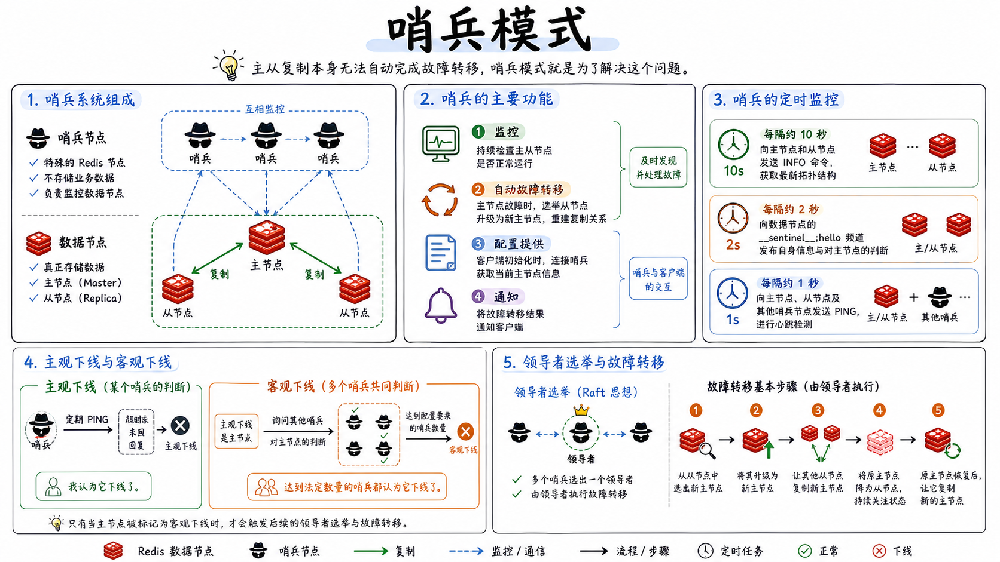

主从复制本身无法自动完成故障转移，哨兵模式就是为了解决这个问题。

哨兵系统主要由两部分组成：

- **哨兵节点**：特殊的 Redis 节点，本身不存储业务数据，负责监控数据节点。
- **数据节点**：真正存储数据的主节点和从节点。

### 哨兵的主要功能

1. **监控**
   
   哨兵持续检查主节点和从节点是否正常运行。

2. **自动故障转移**
   
   如果主节点不能正常工作，哨兵会从其从节点中选择一个升级为新的主节点，并让其他从节点改为复制新主节点。

3. **配置提供**
   
   客户端初始化时，可以连接哨兵并获取当前 Redis 服务的主节点信息。

4. **通知**
   
   哨兵可以将故障转移结果通知客户端。

其中，监控和自动故障转移使哨兵能够及时发现并处理主节点故障；配置提供和通知功能，则体现在哨兵与客户端的交互过程中。

### 哨兵的定时监控

哨兵通过定时任务发现和监控节点故障：

- 每隔约 **10 秒**，哨兵向主节点和从节点发送 `INFO` 命令，获取最新的主从拓扑结构。
- 每隔约 **2 秒**，哨兵向 Redis 数据节点的 `__sentinel__:hello` 频道发送自己对主节点的判断，以及当前哨兵节点的信息。
- 每隔约 **1 秒**，哨兵向主节点、从节点及其他哨兵节点发送 `PING` 命令进行心跳检测，确认节点是否可达。

### 主观下线与客观下线

**主观下线**是某个哨兵自己的判断。

哨兵定期向主节点、从节点及其他哨兵节点发送 `PING`。当某个节点超过指定时间没有回复时，该哨兵会认为这个节点已经下线。

**客观下线**是多个哨兵共同作出的判断。

当被主观判定下线的是主节点时，当前哨兵会询问其他哨兵对该主节点的判断。当达到配置要求的哨兵数量后，才会认为主节点确实存在问题，并将其标记为客观下线。

可以简单理解为：

- 主观下线：*我认为它下线了。*
- 客观下线：*达到法定数量的哨兵都认为它下线了。*

### 领导者选举与故障转移

多个哨兵会选出一个领导者，由领导者执行故障转移。Redis Sentinel 的领导者选举借鉴了 **Raft 算法**的思想，具体选举过程也建议了解。

故障转移的基本步骤是：

1. 从原主节点的从节点列表中选出一个节点作为新主节点。
2. 哨兵领导者向该从节点发送命令，使其升级为主节点。
3. 向其他从节点发送命令，让它们改为复制新的主节点。
4. 将原主节点标记为从节点，并持续关注它的状态。
5. 原主节点恢复后，让它复制新的主节点。

新主节点具体如何筛选和选举，过程相对复杂，也应当单独掌握。

## Redis Cluster 集群
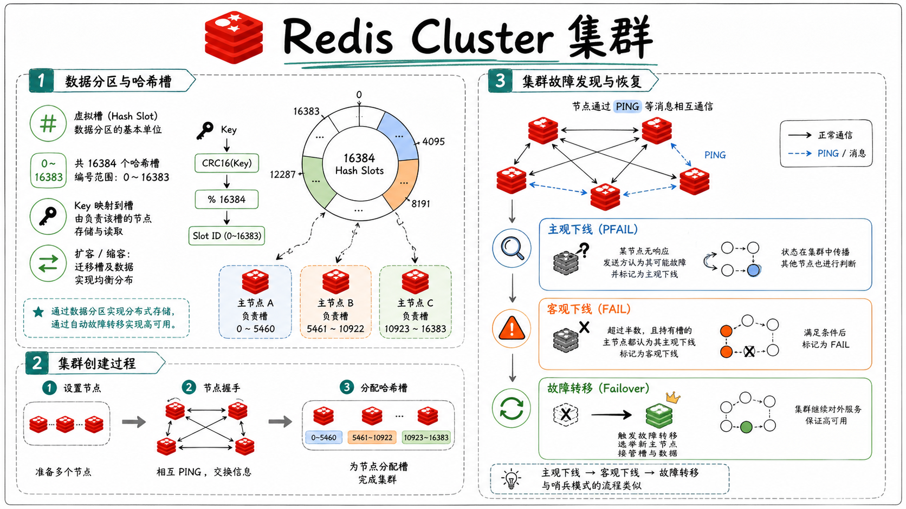

### 数据分区与哈希槽

Redis Cluster 采用**虚拟槽，也叫哈希槽（Hash Slot）**的方式进行数据分区。

Redis Cluster 一共有 `16384` 个哈希槽，编号范围为 `0～16383`。每个主节点负责一部分槽，Key 会通过计算映射到相应槽，再由负责该槽的节点完成数据存储和读取。

槽是数据迁移和管理的基本单位。扩容或缩容时，可以把槽以及槽中的数据从一个节点平滑迁移到另一个节点，使数据分布更加均匀。

> Redis Cluster 通过数据分区实现分布式存储，通过自动故障转移实现高可用。

集群创建过程主要包括：

1. 设置节点。
2. 节点握手。
3. 分配哈希槽。

### 集群故障发现与恢复

集群中的节点通过 `PING` 等消息相互通信。

如果某个节点没有响应，发送方会认为该节点可能发生故障，并将其标记为主观下线。该状态会在集群中传播，其他节点收到信息后也会进行判断。

当超过半数、且持有槽的主节点都认为某个节点主观下线时，就会将其标记为客观下线，并触发故障转移。这个过程与哨兵模式中的主观下线、客观下线比较相似。

## 如何设计 Redis 集群方案
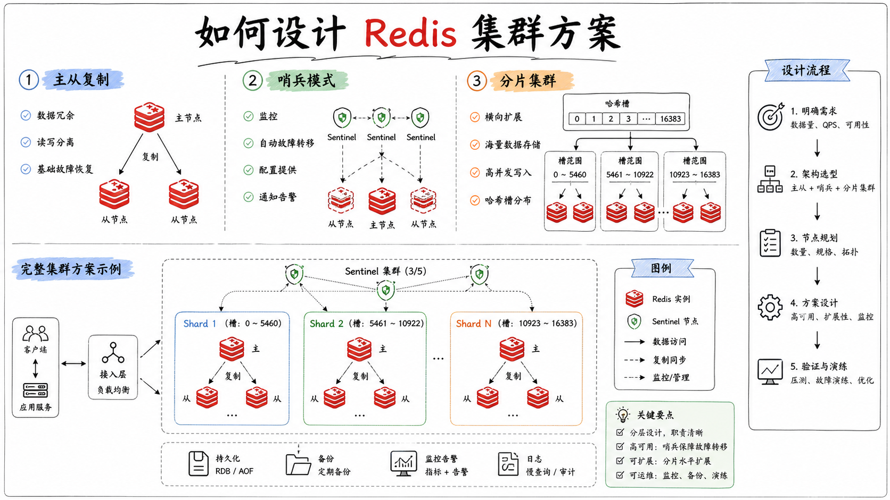

Redis 的高可用和集群方案可以从三个层次回答：

- **主从复制**：解决数据冗余、读写分离和基础故障恢复问题。
- **哨兵模式**：负责监控、自动故障转移、配置提供和通知。
- **分片集群**：解决海量数据存储和高并发写入问题，通过哈希槽把数据分布到不同实例。

我之前被面试官问过：“你会怎样设计一个 Redis 集群方案，用来实现某个具体场景？”当时没有答上来，因为对 Redis 的理解还停留在比较基础的阶段。

后来专门学习后发现，这类问题应该用结构化方式回答：需要怎样设计主从复制、哨兵模式和分片集群，最终形成完整的集群方案。

现在技术要求较高的公司，尤其是大厂，可能会问较多场景题。因此学习时既要有微观知识，也要有宏观设计能力。

## Redis 分布式锁
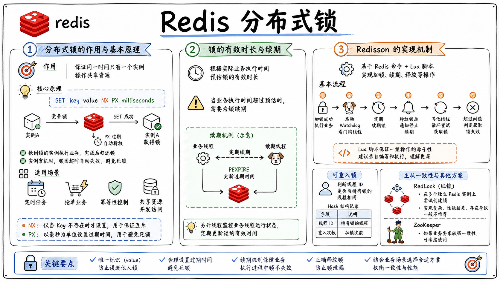

## 分布式锁的作用与基本原理
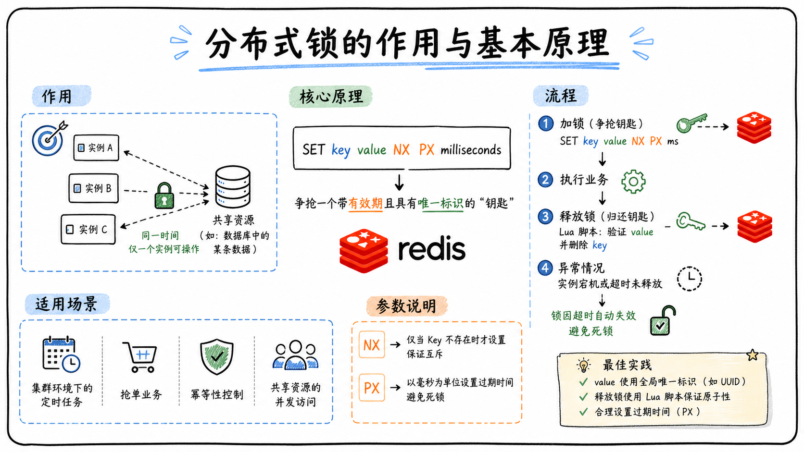

分布式锁用于保证在多个服务实例并存的环境下，同一时间只有一个实例能够操作某个共享资源，例如数据库中的某条数据。

核心原理比较简单：使用 Redis 的

```text
SET key value NX PX milliseconds
```

争抢一个带有效期且具有唯一标识的“钥匙”。

- 抢到锁的实例执行业务，完成后归还钥匙。
- 如果实例意外宕机，锁会因超时自动失效，从而避免死锁。

分布式锁通常适用于：

- 集群环境下的定时任务
- 抢单业务
- 幂等性控制
- 共享资源的并发访问

其中：

- `NX` 表示仅当 Key 不存在时才设置，用于保证互斥。
- `PX` 表示以毫秒为单位设置过期时间，用于避免死锁。

## 锁的有效时长与续期
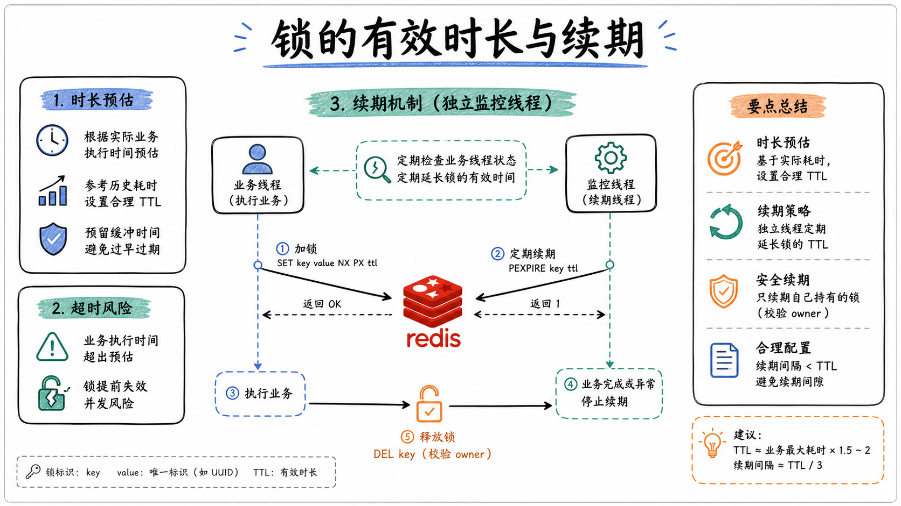

锁的有效时长应该根据实际业务执行时间进行预估。同时还要考虑业务执行时间超出预估时，如何为锁续期。

常见做法是另开一个线程监控当前业务线程的执行情况，并定期更新锁的有效时间。

## Redisson 的实现机制
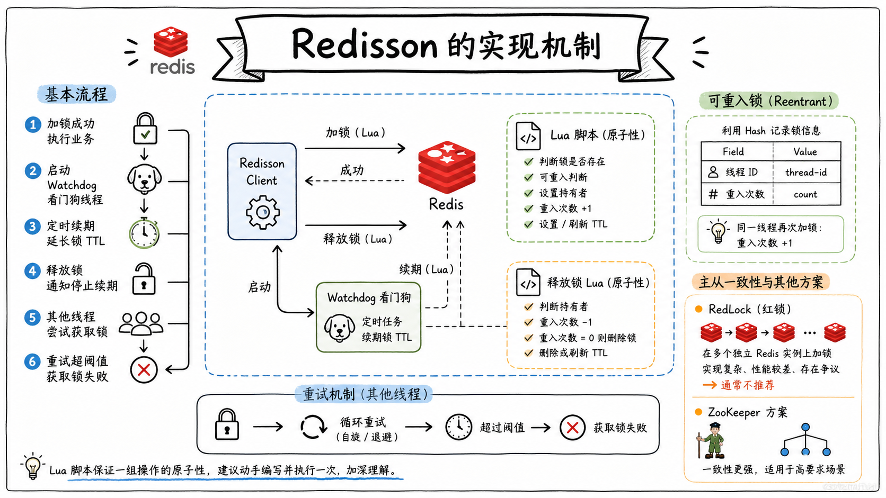

实际开发中常使用 **Redisson** 实现分布式锁。它的底层会结合 Redis 命令和 Lua 脚本实现加锁、续期、释放等操作。

基本流程如下：

1. 加锁成功后执行业务。
2. 启动一个 `Watchdog` 看门狗线程。
3. 看门狗每隔一段时间为锁续期。
4. 释放锁后，通知看门狗停止续期。
5. 其他线程尝试获得锁时，会通过循环重试。
6. 重试超过阈值后，判定获取锁失败。

Lua 脚本可以保证一组操作的原子性，建议真正动手编写和执行一次，这样理解会更深。

### 可重入锁

实现可重入时，需要判断当前请求锁的线程 ID 是否与持有锁的线程相同。如果是同一个线程，就允许再次加锁。

通常可以利用 Hash 结构记录：

- 当前线程 ID
- 重入次数

### 主从一致性与其他方案

Redis 分布式锁还需要考虑主从一致性问题。

一种方案是 **RedLock（红锁）**：不只在单个 Redis 实例上创建锁，而是在多个独立 Redis 实例上尝试创建锁。但它实现复杂、性能较差，也存在争议，因此通常不太推荐。

如果业务要求较强的一致性，也可以考虑使用 **ZooKeeper** 实现分布式锁。

## Redis 应用与场景题
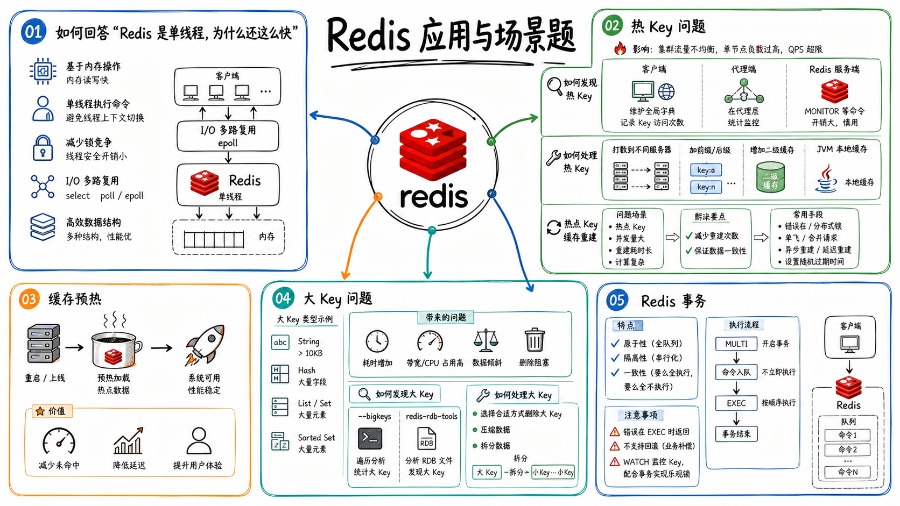

## 如何回答“Redis 是单线程，为什么还这么快”
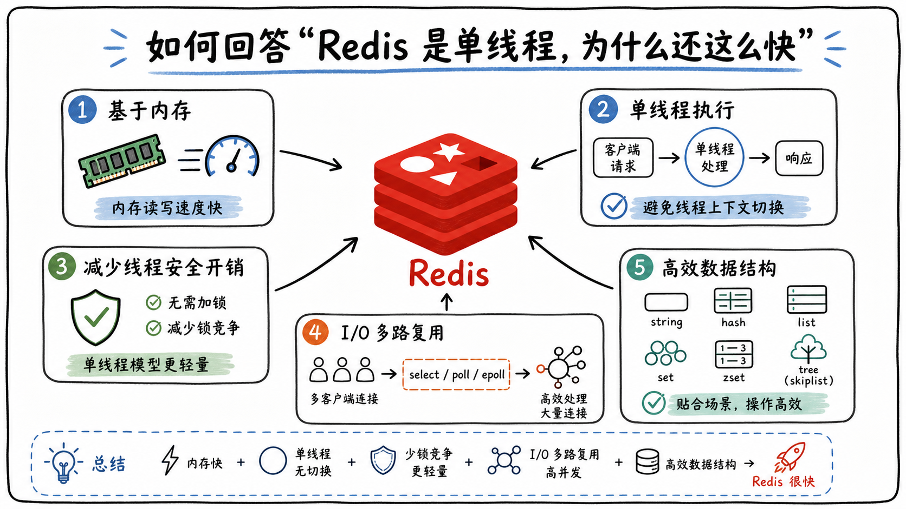

这个问题可以从以下几点回答：

1. Redis 基于内存操作，内存读写速度很快。
2. Redis 执行命令时主要采用单线程，避免了线程上下文切换。
3. 单线程模型减少了多线程环境下的线程安全和锁竞争问题。
4. Redis 使用 I/O 多路复用机制，包括 `select`、`poll` 和当前常用的 `epoll`。
5. Redis 内部使用了多种高效的数据结构。

## 热 Key 问题
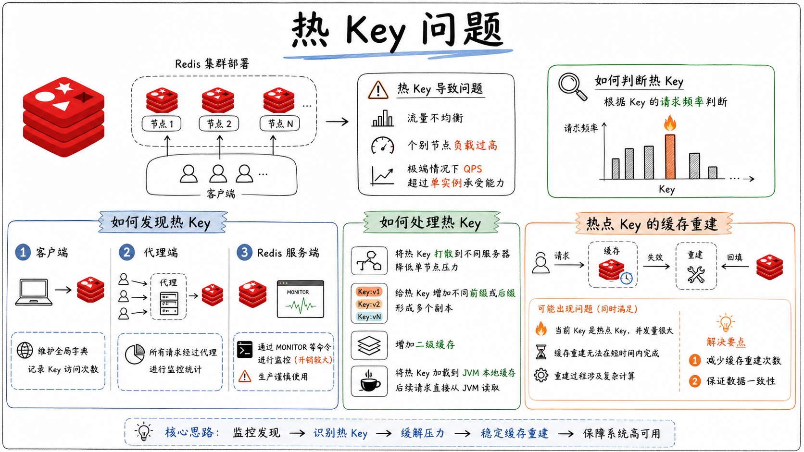

Redis 通常以集群方式部署。热 Key 可能造成集群流量不均衡，使个别节点出现负载过高的问题。极端情况下，热 Key 的访问量甚至会超过单个 Redis 实例所能承受的 QPS。

通常可以根据 Key 的请求频率判断它是否属于热 Key。

### 如何发现热 Key

可以从三个位置进行监控：

1. **客户端**
   
   客户端距离 Key 最近，可以维护全局字典，每次调用 Redis 命令时记录 Key 的访问次数。

2. **代理端**
   
   在分布式架构中，如果所有客户端请求都经过代理，可以在代理端进行监控统计。

3. **Redis 服务端**
   
   可以通过 `MONITOR` 等命令进行统计和监控。不过该命令开销较大，生产环境中需要谨慎使用。

### 如何处理热 Key

- 将热 Key 打散到不同服务器，降低单节点压力。
- 给热 Key 增加不同的前缀或后缀，形成多个副本。
- 增加二级缓存。
- 将热 Key 加载到 JVM 本地缓存中，后续请求直接从 JVM 读取。

### 热点 Key 的缓存重建

开发中通常采用“缓存加过期时间”的策略，既能加速读写，也能保证数据定期更新。这种模式能够满足大部分需求，但在以下情况下可能出现问题：

- 当前 Key 是热点 Key，并发量很大。
- 缓存重建无法在短时间内完成。
- 重建过程涉及复杂计算。

解决问题时要抓住两个要点：

1. 尽量减少缓存重建次数。
2. 尽可能保证数据一致性。

## 缓存预热
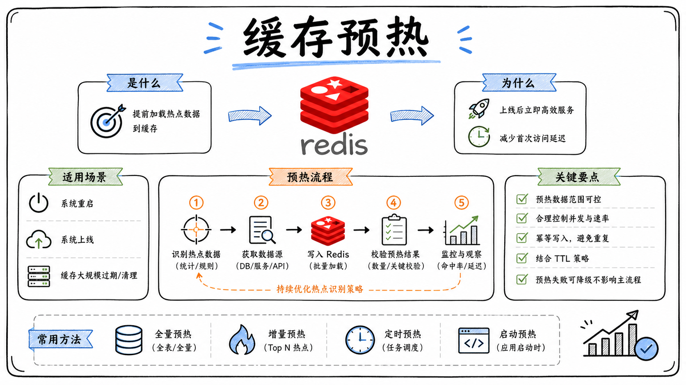

缓存预热是指系统重启或上线时，提前把预定义的热点数据加载到缓存中，避免系统运行初期因为大量缓存未命中而影响性能。

缓存预热可以让系统上线后立即提供较高效的服务，并减少首次访问的延迟。

## 大 Key 问题
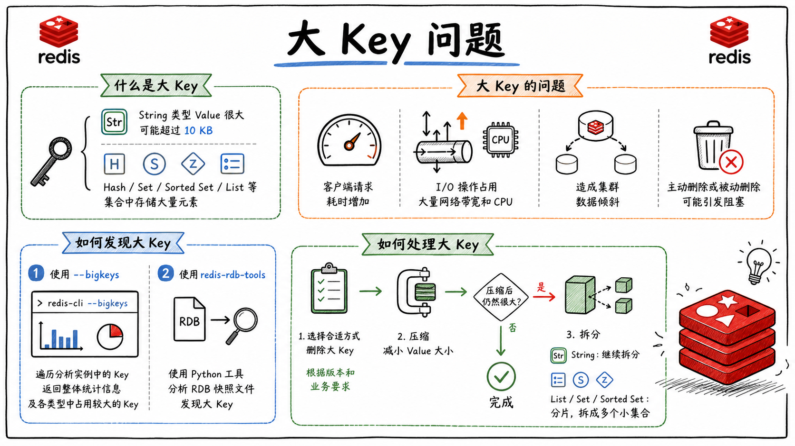

大 Key 是指存储数据量较大的 Key，例如：

- 单个 `String` 类型的 Value 很大，可能超过 `10 KB`。
- `Hash`、`Set`、`Sorted Set`、`List` 等集合中存储了大量元素。

大 Key 可能造成以下问题：

- 客户端请求耗时增加。
- I/O 操作占用大量网络带宽和 CPU。
- 造成 Redis 集群数据倾斜。
- 主动删除或被动删除大 Key 时可能引发阻塞。

### 如何发现大 Key

1. **使用 `--bigkeys`**
   
   通过遍历方式分析 Redis 实例中的 Key，返回整体统计信息，以及每种数据类型中占用较大的 Key。

2. **使用 `redis-rdb-tools`**
   
   这是一个使用 Python 编写的工具，可以分析 RDB 快照文件并发现大 Key。

### 如何处理大 Key

- 根据 Redis 版本和业务要求选择合适方式删除大 Key。
- 对数据进行压缩和拆分。
- 如果 Value 是 `String`，压缩后仍然很大，则继续进行拆分。
- 如果 Value 是 `List`、`Set` 等集合类型，则可以进行分片，将一个大集合拆成多个小集合。

## Redis 事务
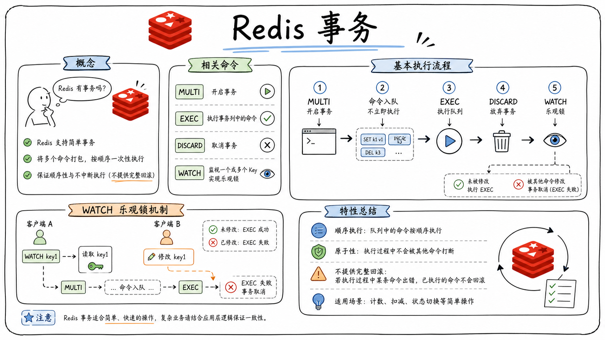

我曾经被面试官问过：“Redis 中有事务吗？”当时对 Redis 还不太熟悉，以为只有 MySQL 这类数据库才有事务，于是回答 Redis 没有事务，但实际上 Redis 支持简单事务。

Redis 可以将多个命令打包，按照顺序一次性执行，主要涉及以下命令：

- `MULTI`：开启事务。
- `EXEC`：执行事务队列中的命令。
- `DISCARD`：取消事务。
- `WATCH`：监视一个或多个 Key，实现乐观锁。

基本执行流程如下：

1. 使用 `MULTI` 开启事务。
2. 后续命令不会立即执行，而是进入事务队列。
3. 使用 `EXEC` 触发队列中命令的执行。
4. 如果在执行 `EXEC` 前决定放弃事务，可以使用 `DISCARD`。
5. 使用 `WATCH` 监视指定 Key。如果在事务执行前，被监视的 Key 被其他命令修改，事务将被取消。

Redis 事务可以保证队列中的命令按顺序、不中断地执行，但它不像传统关系型数据库事务那样提供完整的回滚能力，这一点也需要注意。

## 面试复习与总结方法
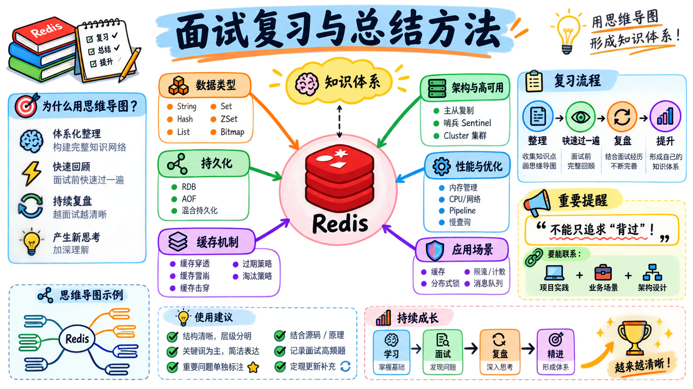

## 用思维导图形成知识体系
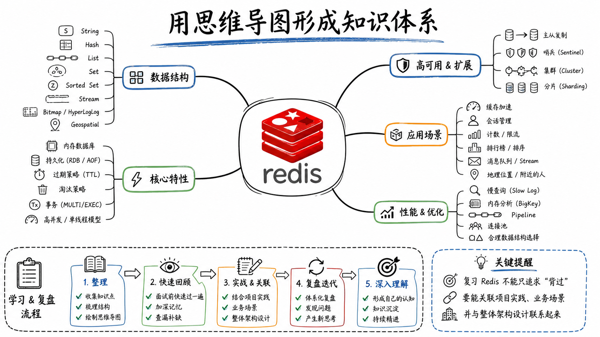

以上是 Redis 面试中经常被问到的一些知识点，可能仍有不全面的地方，可以继续补充。

学习这类“八股”时，最好把知识点整理成思维导图。面试前可以快速完整地过一遍，加深记忆。随着面试次数增加，再不断进行复盘，后面会越来越清楚。

因为复盘是快速且体系化地进行的，所以在复盘过程中还可能产生新的思考，对 Redis 形成更深入的理解。

> 复习 Redis 不能只追求“背过”，还要能够把知识点与项目实践、业务场景和整体架构设计联系起来。
