> https://www.youtube.com/watch?v=mW7J_DJdbP4  
> 

## 开头引子: 
一提到修仙，你是不是立刻浮现出御剑飞行，呼风唤雨？一说到境界，你是不是满脑子练气、筑基、金丹、元婴？别被现代的修仙小说给洗脑了。你知不知道，那些所谓念经打坐、练功炼丹的正统传承，在几千年前的祖师爷眼里，不过是把自己练成了一只比较清纯的鬼。真正的修仙，跟那些花里胡哨的东西真的半毛钱关系没有。古往今来真正留下来的典籍，最核心的只有四个字，***"阴尽阳纯"*** 搞明白这四个字你才能知道修行到底应该怎么修。
> *其实是修成了 "鬼仙", 并不知道 道法真谛, 而是幻想的路径*

今天这期视频，我就带你挖一挖古籍里的真相，详细拆解这条修仙通天路径，彻底说透你从哪里来，你为什么会来人间，这一世又能修到哪里。看完这期你会明白为什么人身难得，也会真正理解这一世到底要怎么选。
知道自己来历或者正在修炼的同学，这一期建议你对号入座。还是那句话，我的视频只给看得懂的人看。拿好小板凳，我们直接开讲。
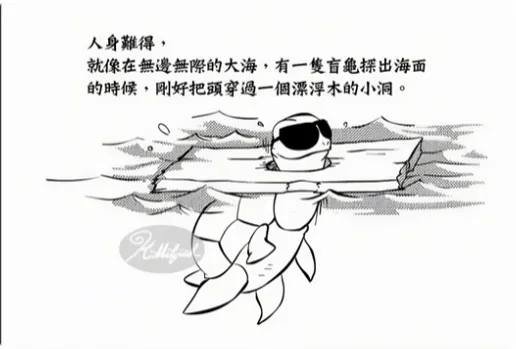

### 仙魔的定义
要讲清楚修仙路径，我们就必须先重新定义什么是仙，什么是魔。
如果你的理解还停留在仙就是好人，魔就是坏人的阶段，那后面的内容你都会理解错。**天道从来不用善恶来划分仙魔，天道只是规则，也只看规则**。
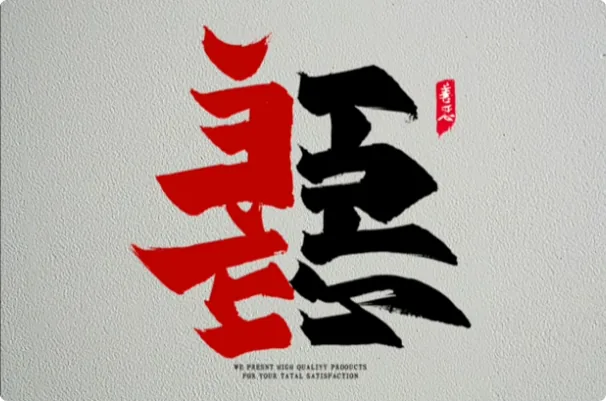

我口中的仙和魔，不是两个具体的物种，而是三界中两套完全不同的修炼体系。
- 所谓**仙**，是所有通过正能量修炼的生命统称，神仙佛菩萨本质都属于这一套体系。只要你顺着天道运行的规则，吸收正能量，在正能量的世界里不断成长，你走的就是修仙之路。
- 而所谓**魔**，是所有通过负能量修炼的生命统称，妖魔鬼怪本质上都属于这一套体系。只要你逆着天道的运行规则，吸收负能量，让自己不断地壮大，你走的就是修魔之道。

所以，一个生命是仙还是魔，不看它叫什么、长什么样，也不看世人如何定义它，唯一的评判标准就是身上气的本质和来源。所以，如果仙背离了天道，照样会被一巴掌拍下来；魔如果想向善改过自新，天道也同样会给他上岸的机会。
> ***大道无情, 也最公平***

### 气的分类
既然仙魔的区别最终落在气上，那么接下来就必须分清天地之间到底有哪几种气。气的划分和仙魔系统相似，分三大类：

1. **浊气**——也就是魔道系统用来修炼的气，包括但不限于鬼气、妖气、魔气等等。他们的名字不相同，但本质是一样的，吸收的越多，生命就越往下沉。

2. **凡气**——指的是凡人的阳气，主要作用是给肉身提供生命能量，让人活着，但它不能支撑你脱离人间，更不能让你飞升。为了避免和古籍里面的纯阳混淆，我们统一把它叫做凡气。

3. **清气**——也就是仙道系统用来修炼的气，包括但不限于灵气、生气、真气等等。它们之间等级不同、功能不同，但是这些暂时都不重要。你只需要记住，天地之间只有这种更高级、更纯净的气才能帮助人类脱胎换骨。古人云“清气上升，浊气下沉”，说的就是这件事。人想往上走只能用清气。

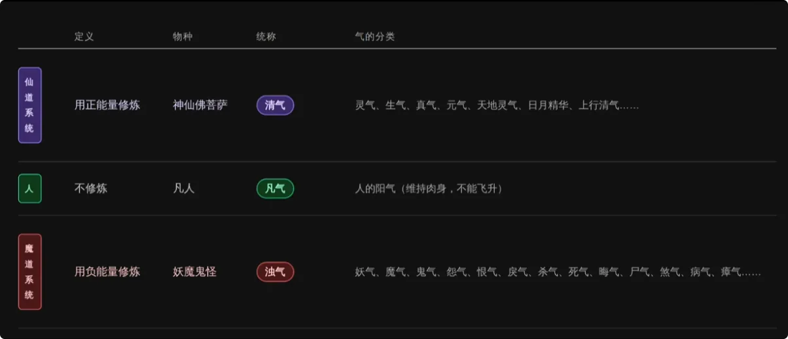

看完了这两套系统，傻子都该知道怎么选，那我就默认你想走的是仙道系统。

### 修仙的本质: 
那修仙的本质到底是什么呢？从古至今，**仙道系统修炼靠的是口传心授**，所以我从来都不建议大家自己翻古籍，真正的功法从来不会写在书里。但修炼的路径多少会留下一些痕迹。为了把这一条轮回晋升的路径讲清楚，我翻遍了古籍，把散落的线索重新梳理拼接，尽可能还原出一张完整的灵魂轮回晋升图。至少目前，这应该是全网最详细也最接近真实规则的一版。

在《钟吕传道集》中有这么一句话，用大白话说就是：
纯阴的是鬼，也就是在下界这一层；
纯阳的是仙，也就是上界的这一层；
纯凡气或者阴阳相杂的都是人，都在人间。
其中最关键的一句是：*只有人可以为鬼，也可以为仙，是两个系统唯一的通道*。
> ***人是中间的一个过渡态***

你看，**人鬼仙的区别，说白了就是阴阳能量比例问题**。能量的比例决定了你的物种和层级。但这里有一个特别容易混淆的概念，很多人一听到纯阳就以为指的是男人的阳气，或者是凡人的阳气，甚至觉得人的阳气就是可以拿来修炼的高级能量。这几个理解都是错的。你想想: 
- 如果纯阳是男人的阳气，那男人岂不是个个都该升天了？
- 如果指的是凡人的阳气，那婴儿出生时阳气最足，那岂不是婴儿一出生就是仙？这逻辑显然说不通。
所以古籍里的纯阳，指的就是我们刚刚说过的清气；纯阴指的是浊气，跟男人、女人、老人、小孩都没有关系。

**普通人的一生，是顺着肉体生老病死的规律，不断消耗先天的凡气，又被后天的浊气腐蚀，最终凡气耗尽，变成纯阴走向死亡。**
**但真正的修炼恰恰是反着来的——清掉浊气，替换凡气，汇聚清气，最终阴尽阳纯就成仙了。**
这就是道家传了千年的一句话: **"顺则凡，逆则仙"**, 这句话很多人都听过，可是没几个人真正搞清楚到底该顺什么、逆什么，
于是自己搞出一套又一套的理论，什么逆人性、逆欲望、逆自然生长规律，说什么的都有。
还有人喊出“我命由我不由天”，觉得修仙就是逆天。人是什么渺小的玩意，逆天只会被天拍死，不会成仙。

## 玻璃杯模型: 
搞懂了阴尽阳纯这个物理公式，你可能会问修炼的过程到底是什么样子的。别急，我给你举一个生动活泼的例子。
假设我们每一个人的身体都是一个容量为100的玻璃杯。出生的时候，这个玻璃杯是完美无瑕的原装状态，里面装满了100%的凡气。
如果一出生就开始修炼，那么事情就变得很简单了，你只需要不断地用清气替换掉体内的凡气，这个过程就叫修炼。随着清气不断地累积，凡气会越来越少，玻璃杯的材质也会一点一点地蜕变，容量会越来越大。哪怕你只是替换了1%的凡气，你都已经是开始增加修为了。

但是绝大部分的人不可能一出生就开始修炼。
随着肉体的衰老、欲望缠身、负能量吸食，体内的凡气会不断地被浊气侵蚀。更可怕的是，浊气腐蚀的不仅仅是杯子里的凡气，它还腐蚀整个玻璃杯。
假设一个人到了中年，凡气被吃得只剩下50%了，另外50%不仅被浊气填满，玻璃杯壁也被腐蚀得千疮百孔。这个时候人突然醒悟开始修炼，你知道他要付出多少倍的代价吗？
1. 他得先用50的清气冲掉50的浊气；
2. 他还要再花大量的清气，把这个破破烂烂的玻璃杯一点一点地修好，不修的话，往里面填多少就漏多少，烂杯子是没有办法修成纯阳之体的；第三，等杯子修得差不多了，才慢慢开始往里面填上清气，替换凡气，改变材质，扩大容量。听明白了没？**这个时候你真正的修为才开始，前面漫长的岁月都只是在修补。**

所以，婴儿拿到的是完整的杯子，直接开始换水就可以了；而一个中年人是先清理淤泥，再修补漏洞，最后才有资格开始换水，修炼难度和耗费的清气直接翻了好几倍。

那如果一个人的生命到了末期呢？如果一个人的凡气被吃得只剩下10%了，生命也只剩个一年半载了，而这个玻璃杯早就破得稀巴烂，这个时候想修炼，慢慢修时间不够，直接灌身体又承受不住，大罗金仙来了也救不了。
唯一能做的就是攒下些正能量，让灵魂少受点罪，争取下辈子投个好胎。这就是为什么我一直强调修行要趁早，杯子破得越少，你修补的成本就越低；被腐蚀得越少，你离阴尽阳纯的距离就越近。

但是，千万别以为开始修炼以后就一劳永逸了，浊气就不会再进来了。不是的，只要你还活在凡尘里，你就会遇到各种各样的负能量，一层一层地吃掉你的凡气，你只能不断地清理、不断地补充清气、不断地修补自己。
螺旋式上升也是修炼升级打怪里面的一环。所以，修仙根本不是你退休后的消遣，而是一场你和负能量、和生老病死之间的赛跑。

## 灵魂轮回晋升图
知道了修炼为什么要抢时间，下一步就要看清这一条路到底分几层，你现在又站在哪里。古籍里对仙的等级早就有明确的记载。
葛洪在《抱朴子》中按照肉体和灵魂的比例把仙分为三等；《钟吕传道集》分得更细，按阴阳的比例分为五等。
两套分法的名称和细节并不完全相同，但都在描述生命从下往上晋升的大致框架。以今天的规则来看，古籍里的部分内容已经不完全适用，但基本层级依然可以参考。不过这些理论名词都不重要，咱们还是用最直观的能量值来画这张**轮回晋升路径**。先声明一下，数字只是用来代表相对量级，而不是实际的数值。
如果把修仙比喻成高考，那么一个生命体的总能量值就是高考总分，高考总分就决定了你是上二本还是211。
假设凡人的初始能量值为0，人如果往上走有5个等级，每个等级都有分数线。比人低一层，同样生活在人间的有动植物和石头；再往下就是妖魔鬼怪所在的负能量的世界，也有分数线，不过是负数。

按照正常的逻辑，接下来是不是应该从人开始一层一层地往上讲？错。在带你们去看高维的世界之前，我们必须先认清一件事情：这个时代能真正往上修的人是很少的，但是走错系统的人却很多。所以在讲人怎么飞升之前，我们要从人以下说起。我们一起去看一看，**一旦一个生命体往下走，想上岸拿到考试资格到底有多难**。

### 动植物也能修炼？
先说离人最近的是地球上的动植物、石头。你没有听错，动物、植物，甚至连石头都是可以修炼的，而且它们和人一样也可以往上走或者是往下走。

葛洪的《抱朴子》就提到“千岁之狐”“千岁之鳖”“千岁之木”，都可以幻化出其他东西，至少说明一点，古人很早就认为动物、植物、石头确实是可以修炼生出灵智的，甚至拥有神通变化。
传说上古时期地球上灵力充沛，动植物、石头吸收了日月精华，是可以直接飞升成神仙的，所以很多上古大神就是这么修上去的。但是后来天道发现了一个bug：动植物没有经过人性的磨练，思想太简单直接了，飞升之后质量好像有点参差

于是后来这条路就被封死了。所有的非人生命都必须经过人间试炼场，拿到人身才有资格继续向更高的层级进阶。

就拿我们最熟悉的狐狸举例子：假设一只狐狸它运气非常好，出生在一个清气极其充沛的福地洞天，日积月累吸收清气，当正能量达到100，开始生出灵智，主动修炼的那一刻，它就不再是一只普通的狐狸了。这种完全依靠清气修出灵智的生命，我们统称“山精水灵”。如果它们不争不抢，万年如一日地修到了1万，其实已经强大到可以脱离地球了，但是他们没有直接的晋升通道，强行飞升是会被雷劈的。

于是天道安排他们转世成人，修为清零，通过人生继续修炼。其实这辈子能够拿到修仙机缘的，很大一部分元神根本就不是凡人，而是动植物或者草木灵转世投胎的。如果有一天你测出来自己的前世是一个动植物灵转世，那么可以回来再看看这一段，就知道你自己是怎么一路修上来的了。
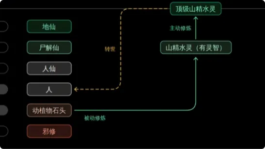
山精水灵转世的修行人，虽然记忆修为都被清零，但是灵魂不会白修，那些靠清气一点一点修出来的底子，会跟着元神带过来这一世。所以这一类修行人转世命都比较好，容易出生在不错的人家，一旦接触正能量修炼，能力苏醒得也比较快。

那如果是走另外一条路呢？
动植物、石头吸收的不是清气，而是浊气。当负能量不断地累积，同样也会生出灵智，当强大到可以不受原始形态的束缚，就变成了妖。一旦掉进妖魔鬼怪这一层，想回头可就不是修几千年几万年能解决的事了。
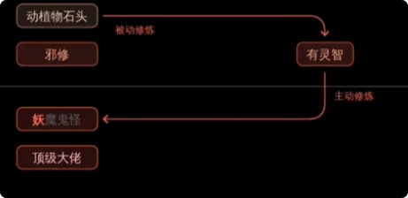

### 鬼仙是什么？
人也一样，人同样可以往上或者往下。往下的路十万八千条，但往上的路只有一条。只要修炼拿不到纯正能量，就是往下走的旁道邪修。
你知道这种旁道邪修走到顶级，修炼到顶峰是什么概念吗？市面上那些所谓的顶级大师、神通奇人，很多人都以为他们已经成仙成佛了，其实他们绝大部分人的天花板也就是鬼仙。
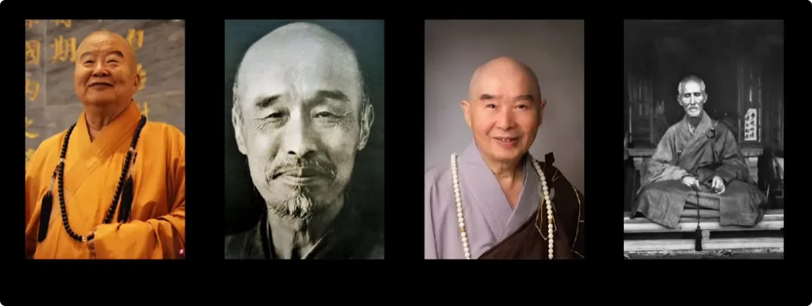

早在千年前吕洞宾在《钟吕传道集》里就问过汉钟离这个问题。吕洞宾问：“鬼仙是什么呀？”汉钟离答：“鬼仙是五仙中的倒数第一，哪里都不认，地府无姓，三山无名。
他不入轮回但也飞升不了，实际上是一个死胡同，他最终的归宿只有一个——投胎转世。”吕祖也懵了，问到底修了啥把自己搞成这样。汉钟离那小嘴也是淬了毒，他说：“这帮修炼的人一开始就不懂天地正道，满脑子只想速成求神通，他们把自己打坐打得形如枯木、心若死灰，强行的把意识锁在体内，最后练出所谓的阴神，那就只是一团比较清纯的鬼，根本就不是什么高维飞升的纯阳真仙。说是仙那是客气，本质上还是鬼。古往今来无数的修行人修炼到这一步，就自以为得到了，简直是太好笑。”

所以你看懂这个宇宙级大讽刺了没有？鬼仙其实连考场都没走对。

也就是说，你本来就是人，你拥有最完美的晋升通道，你直接好好地往上走就完了，结果你还往下修，修成了鬼，兜兜转转不入轮回几百年还得重新投胎成人重新修，回到最初的原点，这不是修了个寂寞是什么？这也不是我在骂你们，我自己就是一个鬼仙转世的修行人，所以我太知道修成鬼仙的后果了。

### 妖魔鬼怪的晋升路径
接下来咱们就来说一说，一旦掉到了妖魔鬼怪这一层，想爬上来究竟有多难。
**动植物、石头能修成妖，人邪修或者死后会变成鬼，都在妖魔鬼怪这一层。这一层最大的特点就是所有生灵都是纯阴的，他们同样有两个选择：向上或者向下。**
1. 如果向下继续吸食负能量，从小妖小魔变成大妖大魔，他们的法力确实可以强大到极其恐怖的地步，甚至神仙都打不过他们，但只要他们不越界，天道平时也懒得管。那如果有一天他们发癫不想守规矩，想强行冲破境界飞升天界呢？只要他敢碰天界这条红线，就会降下雷劫，扛得住的算你命大，天道看你还有点用处或许会收你，但是99.99%根本扛不住，万年苦修瞬间清零，直接灰飞烟灭。所以邪修是会被雷劈的。
2. 那如果不强冲，选择改邪归正的正规途径呢？你以为改邪归正就是闭上眼睛重新投胎就完事了？想得美。
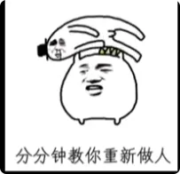
天道是极其严密公平的，改邪归正是一条非常非常艰难的路，因为你走错的每一段路、做错的每一件事都算数。你以为杀人不用偿命吗？欠债不用还钱吗？都要的。
《钟吕传道集》中就把这些异类想重新修回正道的路径写得清清楚楚：“辗转不悟而世世堕落，失去人身，在别的壳子里变成异类，在旁道轮回不能解脱。”想解脱的唯一出路是……但是你不知道拿到这个消罪的资格再得人身的概率有多渺茫。消罪怎么消呢？给天道打工，我们就称之为“天选打工人”吧。但是你以为什么小魔小怪都能成为天选打工人吗？不可能的。**给天道打工的都是千年万年级别的大佬，也就是说，人家在负能量的世界里已经是金字塔尖的存在了。**

那哪些是我们熟知的“天选打工人”层级呢？有三大类：

1. 第一类，绝大多数生前是凡人，死后因功德、忠烈、善行，灵魂不散，被地方百姓供奉或者被上天册封的地方基层行政神职，比如城隍、土地、门神、灶神。这些我们熟知的正面形象，他们都是鬼，全都不是仙。
2. 第二类，封神榜里那些肉体先死后，灵魂飞往封神台的角色，比如闻仲、黄飞虎、赵公明等等，都属于鬼仙层级的天选打工人，怪不得一个个都不想上封神榜。
3. 第三类，编外被天道派去搞事情、推动天道任务的大反派，或者是保护宝地、考验修行人的大妖大魔大鬼，这部分人数那可就是数不胜数了。

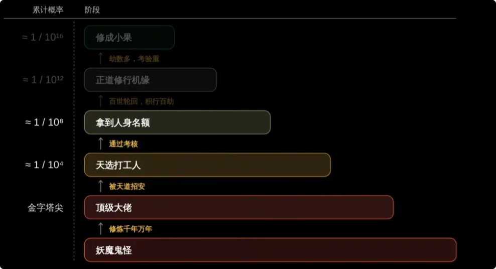

然后在这些天选打工人里，经过极其苛刻的贡献、心性、品行考核，受到天道认可的，最终能拿到转世为人的名额的、给报考资格的，更是这群大佬里万里挑一的极少数。
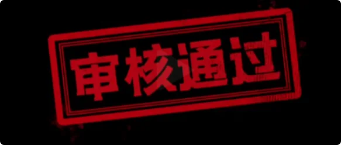

也就是说，有资格拿到名额的天选打工人，他们看到我的视频和文字灵魂会苏醒，这是天道刻在他们灵魂的印记。但是没有资格的普通妖魔鬼怪转世成人的，是没有正道修行的机缘的，他们看到我的视频只会莫名其妙嗤之以鼻，甚至破口大骂，或者连我的频道都不会看到。

但是！
拿回人生仅仅是漫长考验的开始。有报考资格是一回事，你找不找得到正道、能不能撑到高考就是另外一回事了。
古籍是这么写的：
1. 在得人身之后，首先你得“积行百劫”。也就是说，就算你投胎做了人，刚开始也是处于贪嗔痴慢疑的愚昧状态，你必须在人间轮回经历百次劫数，才能慢慢洗清前世的无边罪业
2. 然后“升在福地”——你必须找到福地洞天，也就是风水宝地，借着天地灵气才有资格向上修。
3. 最可怕的是这一句：“苟或复作前孽，如立板走完，再入旁道轮回。”也就是说，如果你在人间一不小心重蹈覆辙，又动了恶念搞了邪修，你就会瞬间滑落，重新调回旁道轮回。

你看妖魔鬼怪有多惨，无论是得人身前打工万年赎罪，还是得人身后轮回百世历经百劫，这哪个都不是好词啊。

能够在这百世轮回里找到修炼的路、能够撑住百劫的，也是万里挑一。所以你数数这是多少层的万里挑一的概率了。
所以，魔道系统转世的修行人，出身往往都不好，命里劫数坎坷特别多，想要重新走上正道，对心性的考验更是高到了极致。而且底下上来的修行人，灵魂自带的气是非常非常浊的，比其他来历的要浊很多倍，不仅要花费几倍的时间、金钱、能量，修行路上遇到的难关和心魔劫数更是别人的数倍以上。

所以，作为一个鬼仙转世过来的修行人，我用亲身经历告诉你，我就是轮轮回回百世，每一世都是打打杀杀的角色，而且是各种凄惨的死法，即使到了这一世，也是经历了很多很多的磨难才遇到正道的。这个故事太长，我们先挖个坑，另一期讲。
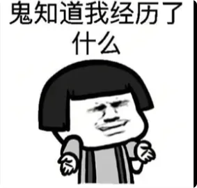

言归正传，人往下，不管是动植物或者是妖魔鬼怪，他们最终都是要转成人的。所以你现在理解了为什么“人身难得”了吧？因为掉下去啊，它就是一个无尽的死循环。

好了，讲完了那些负能量的下坠史，咱们接下来应该换个轻松的。如果你选择正能量往上走呢，这个路径就简单直接很多了。

### 人仙是什么？

人间框架内，除了总能量，还得看体内阴阳的比例。假设我们每个人出生的时候都是100%的凡气，清气为零。当你开始踏上正能量晋升通道，第一个接触到的层级就是**人仙**。人仙的本质就是一个寿命长一点、病少一点的凡人。

人仙也分正修和邪修两种，古籍里只记载了邪修的人仙。
《钟吕传道集》中是这么定义人仙的：**所谓人仙，五仙中的倒数第二名，“不悟大道”——也就是说他们根本就拿不到纯正能量，不懂得能量的底层规则，只是学了某种偏门功法或者某种养生技术。他们靠着一股苦修的狠劲，把肉身练得非常坚固，百病不侵，一辈子极少生病，能安乐延年。**
送玻璃杯的例子就是这个人仙，他也不管什么气不气的，天天都在补玻璃杯，以为补好了就能上天。
就连葛洪《神仙传》里提到的活了800岁的彭祖，他自己都承认自己只是一个人仙。还有现代这位被世人尊称为“陆地神仙”的某道长，无数人跟着他学功法、练养生，都以为他老人家早就飞升上去了，其实他活着的时候也就只是一个比较长寿的人，而现在他在下面——惊喜不惊喜，意外不意外？
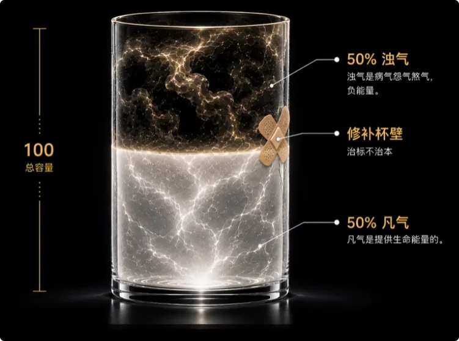

正修呢，也有类似于人仙的等级，只不过圈外人是不知道的。假设人仙的能量值为10，哪怕你只有5%的纯正能量和95%的凡气，你和凡人就已经不是一个物种了。虽然表面还是人，但身上气的本质不同了，能量和感知力和凡人不是一个维度等级了。这个时候你已经具备了考试资格。大部分刚入门的正道修炼者基本都在这个等级。
我之前视频说过，纯正能量护体，少则一生无病无灾、健康顺遂，多则成仙成佛。人仙就是纯正能量还比较微弱，只够护体的层级。
甚至我认识的很多人，他们不仅自己修炼，还偷偷把一些纯正能量分给家人，保他们平安健康，他们的家人甚至都不知道自己有纯正能量。这种被正能量滋养的家人，也能归为人仙的等级。

但是我还是要强调，即使是正修，人仙和鬼仙一样，本质并不是仙，只是有一些纯正能量护体罢了，死后也还是得变鬼再入轮回。
唯一的区别是你攒了些好能量，死后灵魂不会受罪，下辈子能投个好人家。所以人仙其实算不上境界，是每一个还在路上的正道修炼人都能做到的一件事情。

### 尸解仙怎么晋升?
关于**尸解仙**，历史上的争议比较大，以后单独开一期讲。这期就讲个大概: 
假设你继续修，总能量值能到100了，体内的清气值为50，凡气还剩50，那么你至少能得个尸解仙。
1. 在魏晋时期的《抱朴子》里，葛洪说了一句非常刻薄的话：“气少肉多，不得上去，当为尸解。”什么意思呢？就说你正能量其实修得还行，但你的肉身实在太烂了，拖了后腿保不住了，你就只能先经历一次形式上的死亡，灵魂再蜕变成仙。
2. 《神仙传》也记载仙人王远评价蔡京的时候说“气少肉多，不得上去，当为尸解”，看到这句话我都笑喷了，合着在仙界眼里你飞不上去是因为肉太多、清气太少，超重了。
3. 就连西王母也下旨说“尸解仙掉到下界，我一点都不可惜”。你看仙界鄙视链里尸解仙纯粹就是一个被看不起的淘汰选手。
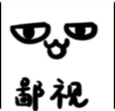

 但到了南北朝，古人对尸解仙的内部机制进行了非常精细的补丁升级。
 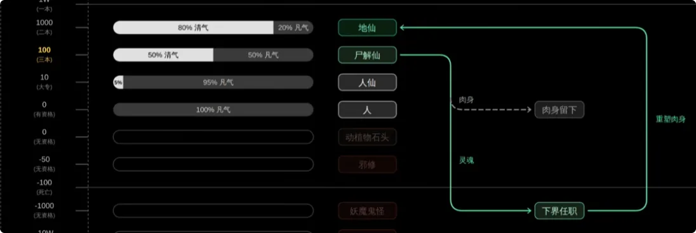
 
 《真诰》将尸解解释为去地下冥府工厂重造并兼职打工的候补神仙，等肉身重塑就可以升级了；而《无上秘要》里更夸张，直接把尸解仙定义为天庭留在冥界的在编公务员，像墨子、张良这些大佬明明就能直接成仙，却故意选择“扣关死绝”来尸解，就是为了去地府担任地下主者的官职，通过在冥界秉公执法、管理鬼神来积攒功德KPI，工龄熬满了之后，天庭会下达红头文件（也就是紫简）直接提拔调任为正式的地仙或者天仙。
 

反正后世补上的东西啊，我就这么一提，你就这么一听。我之所以拿出来讲呢，是因为我看过其他玄学博主做过的有关尸解仙的视频，引经据典是不假，但真的是一本正经地胡说八道，因为他们本身不修仙，所以他们看不出文字里面的门道，这就是隔行如隔山。

抛开这些后世缝合的传说，本人觉得对尸解仙比较准确的描述，就是“气少肉多”，没了肉体的候补神仙。至于去哪把肉体补上，真的还没有定论。
但是仙界看不起候补神仙，你作为凡人可真的没有资格看不起尸解仙。在道教所有的古籍设定中，尸解仙都彻底跳出了地府的生死簿，就不会被格式化，就能保留全部的记忆、智慧和修为，只要好好修炼就依然有机会可以原地升职。光就这一点，就已经是所有凡间修炼人的终极目标了。

那么现代正道修炼者达到尸解仙级别难不难呢？我们门内有一句话供你参考：“这条路好好走，别做叛徒，至少也能得个尸解。”

### 地仙是怎么修成的? 
尸解仙往上，是非常接地气的**地仙**。假设这个时候你的总能量值到1,000了，纯正能量为80%，凡气还剩20%，那么恭喜你至少也能得个地仙。
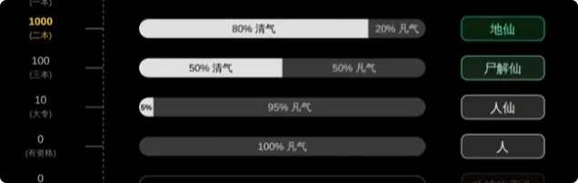

到了这个层次，你的肉身已经完成了深度的改造，真正能做到延年益寿、长生不老。那他们为什么不上天呢？
葛洪在《抱朴子》里说“地仙者，唯得长生，住世不死”
而《钟吕传道集》中更直白：“地仙者，天地之半，神仙之才。”翻译过来就是，地仙只能算个半成品，悟道悟了一半，身体也没练到纯阳，肉体虽然挣脱了生老病死，但是还挣脱不了地球的重力，所以就只能留在地上逍遥，是个有正式仙籍的“驻外公务员”。

听起来好像也没有多厉害哦？不是的，你别小看这个“驻外公务员”，《神仙传》里绝大部分的神仙都只是修到了这个层级，可见地仙等级有多不容易。很多人总是把地仙和土地爷搞混: 
前面说过，土地爷是鬼仙，是忙得焦头烂额的纯牛马，他没空修炼。地仙不一样，他是地球“在野神仙”，他不干活、不任职，他的任务就只有三种：
1. 不想努力的就天天游山玩水，和地仙朋友面基；想努力的就天天闭关修炼，把身体练成纯阳，他就能当神仙；
2. 再努力一点的，他还得去人间积功德。《抱朴子》中写过明确的KPI：“欲求天仙，当立一千三百善。”所以他们还得去人间完成KPI，还会暗中考察度化有仙缘的凡人。
八仙之首汉钟离一天到晚在人间晃悠，就是为了在红尘中寻找并考核吕洞宾，引导他走上正途。

但这个时代是一个有大机缘的时代，不仅名额多，果位还大，修炼资源更是前所未有。那现代正道的修炼人中有没有类似于地仙等级的人类呢？
有的，达到这个水平和实力的不算少，只是高考还没到，一切还没有定数。门内也有一句话供你参考：“如果你在这个时代找到了正道修仙的路，地仙水平相当于你，都读五道口中学了，你才考上个二本。”这句话我就点到为止了。

### 神仙和天仙
地仙往上就不是人间了，大致分为**神仙**和**天仙**两大类。假设你的总能量超过了1万，清气为100%，凡气为0%，是真真正正的阴尽阳纯了，那么你至少是一个神仙了，就能跳出人间框架，不用在地上吸浊气了。
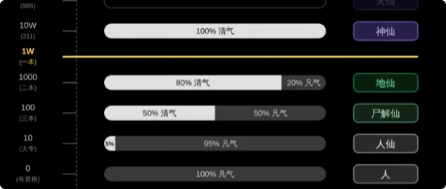

《钟吕传道集》中是这样描述的：“所谓神仙者，格也。阴尽阳纯，谢绝尘俗，以返三山。
”注意“阴尽阳纯”这个词，能量值到了，纯净度到了，就可以成为神仙。

《抱朴子》也说“仙之纯者，谓之神仙”，也就是说不仅仅气纯阳了，就连整个肉身都转化成纯阳之体了，这个时候你就不需要丢弃任何东西，带着肉身就能白日飞升，这是人间修行的天花板了。在神仙这个等级，一般不认官职，逍遥自在，我们也称“散仙”。散仙虽然自在，但是一些核心的修炼资源也是轮不到散仙的，比如说蟠桃。

那神仙再往上是**天仙**，天仙要求更高一点。
古籍是这么说的：“天仙者，功成行满，受天书，返洞天。”
也就说想晋级天仙，必须满足三个硬性指标，缺一不可：
1. 第一，“功成”——修为达标，你的纯正能量和纯度积累到天仙的段位了；
2. 第二，“行满”——也就是贡献值达标，在世间承担责任，积攒绝大的功德。有些人以为做好事积功德就是修行，这也不能说全错，但是是在你的能量值和纯度都达标的情况下，功德才有用。没有能量值和纯度的功德，就好像你高考参加一堆课外活动，但是你高考分数为0，甚至没参加高考，那谁敢录取你？
3. 第三点，“受天书”——这六个字信息量极大，受天书代表你拿到了天道下旨；而“返洞天”里的这个“返”字，说明能成天仙的人很多原本就是天仙下来，所谓**“神仙本是神仙做”**。
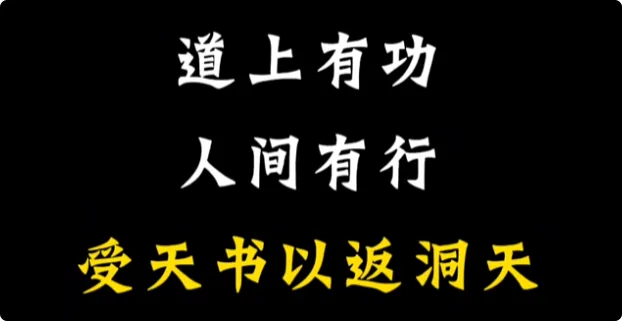

当然，如果要细分的话，小神仙、大神仙、小天仙、大天仙、上古大神、大罗金仙等等等等，还是那句话，名词不重要，最重要的是**能量值**。
大能量大神仙，小能量小神仙，就这么简单。
你只需要记住，天仙就是作为人能修到的天花板了。古籍里还有这么一句话：“若洞天住久，亦可任仙官。”也就是说，如果洞天住久了住腻了，可以任仙官。天庭的官职系统呢，又是另外一套晋升规则了，可以另外开一期讲。

天仙再往上呢，就不是人直接能修的了，所以作为人类的你也没有必要知道。

## 作为过渡的人身
### 人身的福利: 
其实每个层级的仙都可能被贬为人或带任务下凡，但作为人往上修，有一个全宇宙最大的隐藏福利🎁：
**只要你这一世做得好，短短几十年就能实现果位的晋升，甚至连续几级跳。这就是为什么这一次人间的大机缘，不管是山精水灵、妖魔鬼怪，还是天上各路神仙，都宁愿舍弃万年修为，挤破头也要转世投胎为人。**

### 人身的风险: 
但是作为人也有一个最大致命风险，那就是迷失在人间，在红尘里灵根受损，彻底忘了修炼，再也回不去了。
不过对天道来说也没关系，迷在人间的就是经不起考验的淘汰者，经不起考验就不配再回天上，刚好把名额腾出来给那些更优质的、更有冲劲的后来者。

说到底，这次宇宙级的高考，筛的就是综合素质。能量值和纯净度是硬性要求，它决定了你能去哪个层级；心性、贡献、来历是加分项，决定你修成什么果位，最终进哪个学校。

听我讲完这一条灵魂轮回晋升路径，你是不是对修仙越来越清晰了呢？你原本从哪来，想修哪去，相信你差不多也有一个目标了吧。
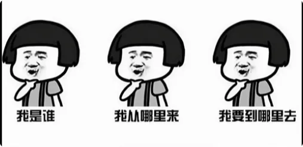

## 关于 二元对立的思考🤔? 
说到这里，肯定有些高维玩家会在评论区或者弹幕里跟我杠：“博主你讲的这些不还在天道框架里打工吗？
你还停留在3维的思维里，人家5维、6维、7维根本就没有二元对立，宇宙本来就是空，世界本来就不存在规则和束缚，直接跳出游戏设定不好吗？”

你先打住。首先啊，宇宙有宇宙的规则，太阳系有太阳系的规则，地球也有地球的规则，哪里都不存在绝对的自由。
你知道你现在为什么是一个人，而不是神、不是仙吗？难道是因为你不懂概念、不够聪明吗？不是的，是你灵魂当前的能量值就只配待在三维世界，你就只配拥有这具凡胎肉体。
**维度不是靠想象出来的，物种不是靠逻辑自洽进化出来的，它是一个绝对的能量纯度和数值决定的。** 你以为你脑子里学会背“色即是空”、没有二元对立，你的灵魂就能超越维度了？
一个二维的纸片人，脑子里再怎么幻想三维立体球形，只要它的能量不足以让物理形态发生质变，它就永远是一张纸。

所以，不要用概念去代替你的能力，更不要用你的想象力去代替实打实的能量值。这具肉体从来都不是限制你的牢笼，它是天道在你的能量还没有修够之前，给你安排的新手保护期的防弹衣。否则，以你现在两米高的气场和微弱的能量值，一旦真正脱离这具肉身，你就会瞬间被灵界秒得渣都不剩。
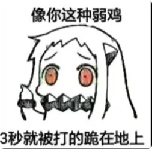

想跳出系统？你不如先实事求是地问问自己：
你那破玻璃杯修好了吗？你今天的能量值是多少？你体内的阴阳比例又是多少？
还是说你连自己的能量值都不知道，各种气傻傻分不清，还想着自己可以不守规则？
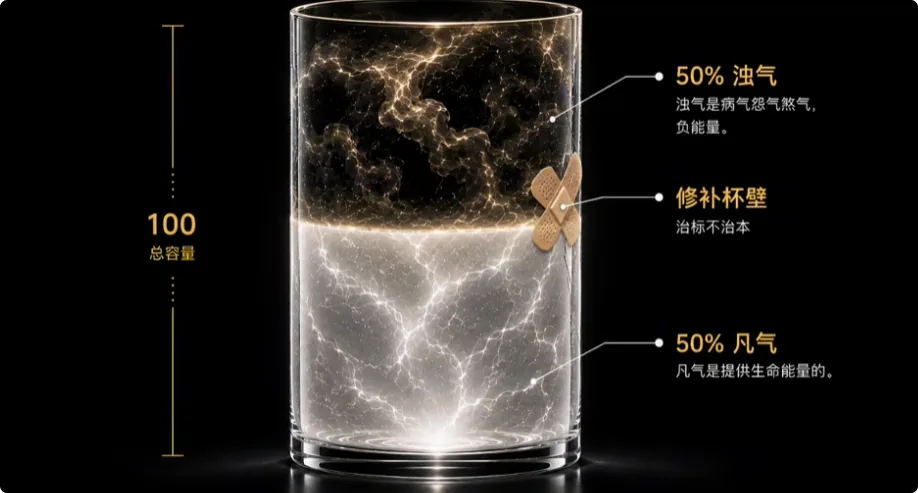
能量不够，所有的超脱都只是脑海里的幻觉。
人呐，还是得饭一口一口地吃，路一步一步地走。把这一世的身体养好，把体内的浊气排干净，把能量值实打实地修上去，才有资格谈后面的事情。

## 结尾: 

**万般故事，不过落笔云烟；千般算计，不如命运轻轻一笔。**

