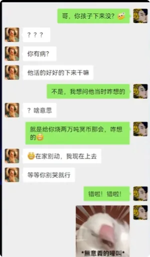
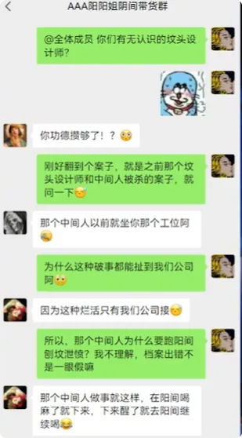

> _**阴间生活不只要懂建设、就业和功德，还得懂安全法规。真题做得少，到了下面一样要吃亏。**_

## 1. 热身题：离开泉台收费站，什么场景绝对不可能见到

> **夜间行车，请注意安全。**

当你离开**泉台收费站**，即将到达阳间的时候，请问以下哪一个场景你**不可能**见到？
- **A** 牛头马面在路口抽检，查看车内是否携带了阴间物品。
- **B** 阳间司机把脚焊死在油门上之后，以时速199公里的速度朝你冲来，但到你面前的时候及时避让。
- **C** 有鬼在地上泼洒棺材钉，企图把你拉到距离收费站50公里的修车场去。
- **D** 路边有号称自己上山挖出宝贝的工人，拿着山龟告诉你这玩意儿功德长得快。

很明显，答案是：

> **D**

为什么？

> **因为泉台附近没有龟，全被陆压老祖打完了。**

积了小小的阴德。

上一期说到这个地府旅游区暂时不让进，只能委托我同事去买地图。结果我老板刚刚发来消息，说我同事涉嫌**夹带阴间商品**，在泉台边检被抓了。

就很离奇。

所以本期就找一些**阴间安全与法规真题**，给各位做一做、熟悉一下。

---

## 2. 第一题：阴间土地建设局门口，千万不要乱种菜

> **日间出行请注意太阳温度以及植物光合作用的角度，避免踩踏草坪。**
> 
> **在以下行为中，哪一项容易发生“鬼体安全事故”？**

- **A** 在阴间土地建设局门前的方块草坪上偷偷种外来植物，如豌豆、向日葵、坚果等。
- **B** 在阴间墓地生态保护区内，无视管理员劝解，执意采摘坟头蘑菇带回家煲汤。
- **C** 在规划区的落英河段，利用路边长相怪异、带有网状结构的杆子，下河捞取落水的小鬼。
- **D** 利用放大镜企图加快植物光合作用，并在植物附近泼洒煤油与汽油，帮助植物保温。

这一题答案很明显，一看就知道是：

> **A**

咱们来看看为什么。

### B为什么没问题：坟头蘑菇可以摘，所谓管理员才有问题

首先用排除法，看B。
在阴间吃点蘑菇，还是坟头上的蘑菇，怎么了？
很合理。
而且墓地生态保护区里头根本没有管理员。
所谓的“管理员”，其实都是当地黄牛，自己偷偷收蘑菇，不让别人收。

所以：

> **直接排除。**

### C为什么已经不是正确答案：版本更新了

然后是C。
我在《阴间考编指南》那一期说过，落英河那边“放声听雷”的都已经被抓得差不多了。
所以这一题：

> **十几年前可能还能选C，现在不能选了。**

### D为什么也是陷阱：阴间根本不用煤油和汽油

最后是D。
这个可能很多刚从阳间下来的鬼会选错。
这里重新说一下：

> **阴间没有煤油和汽油这两个玩意儿。**

咱们用的那个叫“活水”，是骨灰炼出来的。
所以D本身就是专门坑那些刚刚下来、什么都不懂的新鬼的。
也可以排除。

### 为什么最终只能选A

那么为什么选A呢？
废话。
你跑到**阴间土地建设局门口种菜**，你想干嘛？
还种这种明显的外来物种。
一看就知道是地狱细作。
被抓以后，必然要严刑拷问一番。

所以：

> _**非常容易造成鬼体安全事故。**_

---

## 3. 第二题：为了骗“意外转生补贴”主动当鱼，会不会影响功德

> **坟头风水一向被认为是阴间转生的参考数据之一，那么在以下行为中，哪一项会影响转生时的功德积累？**

- **A** 中间人利用职务便利，让阳间的孩子给自己烧2万吨冥币。
- **B** 先申报转生成为鱼，转生以后光速重开，再进入忘川河故意被桥上的鬼砸到，企图享受“意外转生补贴”。
- **C** 在阴间大学就读期间，屡次推荐同学成为被献祭对象，而自己享受献祭福利。
- **D** 利用功德机，在阴间蹴鞠联赛中强行刷高我方球员的功德数量，使球员全身发光，以达到震慑对手的效果。

这一题比较吃小道消息储备。
各位选错也很合理。
答案是：

> **B**

咱们一个选项一个选项分析。

### A：两万吨冥币不会改功德，但会直接改你的转生进度

这个选项我上期提过，可能大部分人没看。
这事是我同事干的。
他刚成为中间人没多久，有一次喝多了，让自己的孩子多烧点冥币下来。
但因为中间人没转正的时候不能托梦，所以清醒以后他很害怕，怕这件事情被发现。
然后他亲自上去告诉孩子：

> “千万不要烧。”

结果他孩子看见以后，以为他是：

> **嫌少。**

于是直接作出了一个很离谱的决定：

> **一把火点了一个冥币厂。**

最后合计烧下来两万多吨冥币。
我同事现在已经没法托梦了，大概两百多年以后才能转生。
所以A虽然严重，但是：

> **它不影响原有功德积累，而是直接影响转生资格和时间。**

### C：推荐同学被献祭，是为了让同学早日享受阳间生活

然后是C。
各位应该清楚：

> **阴间大学献祭一两个学生，很合理。**

反正功德最后都会记到账户上，等下辈子的时候加回去。
你推荐自己的同学，说明什么？
说明你认为：

> **这个同学很有潜力，值得早点享受阳间的美好生活。**

你自己留在阴间承受苦难，主动把转生机会让给同学。
多么感人的事情。
怎么会影响功德积累呢？

### D：给别人刷功德，出问题的是别人

接着是D。
你的确用了功德机。
但是：

> **你给自己加了吗？**

没有。
既然都没给自己加，为什么会影响自己的功德？
你主动给别的鬼加功德，这甚至可以理解为：

> **舍己为鬼。**

所以自己的功德并不会因此受到直接影响。
但是要注意：

> **如果你恰好就是那个被刷高功德的人，就可能因为数据异常被封号、强制回档，并且直接转生。**

### B：鱼的问题在于“主观恶意骗补贴”

B这个案例，我之前在功德机操作指南里提过，但是当时没有讲最终结果。
现在告诉各位。
这个案子最终的判决认为：

> **这条鱼心术不正，企图利用张三、李四之间的情感纠纷，给自己增加功德。**

可以说非常坏。
用丧尽天良来形容也不为过。
所以这条鱼最后被判：

> 下辈子转生到养殖场；
> 
> 随后被做成烤鱼；
> 
> 又因为厨师没有处理好，被顾客打翻在地；
> 
> 最后还要在厨师与顾客争吵的过程中，被人踩上一脚。

只能说：

> **功德系统不好骗。**

---

## 4. 第三题：忘川河半夜的哭声，到底是什么东西发出来的

> **清明时节，忘川河畔总有很多旅游露营的鬼。**
> 
> **但每到午夜，他们都会听到呜咽的哭声，以及“咔嚓咔嚓”的啃食声，因此非常害怕。**
> 
> **作为一个熟知阴间都市传说的你，请问以下哪一项才是声音的真相？**

- **A** 有鬼因为抢不到露营草坪，在午夜期间故意播放声音，企图吓走其他鬼。
- **B** 落英河段的水鬼因为河道改建，拖家带口搬到了忘川河附近，午夜只是他们正常吃饭的时间。
- **C** 忘川河畔管理员因为呼吸道堵塞，导致睡眠鼾声过大，声音经过墓碑反射之后形成了这种效果。
- **D** 某公司团建时，把刚刚下来的员工丢在了附近，员工因为迷路过于害怕，所以发出了这种声音。

这个题目纯粹考：

> **知识储备。**

答案是：

> **C**

### A：忘川河根本不值得抢露营位

首先，A直接排除。
忘川河畔是什么地方？
著名的：

> **三无旅游区域。**

也就是：
- 无旅游项目；
- 无旅游景点；
- 无旅游设施。

说白了：

> **就是一片草地，旁边有一条河。**

为什么还会有鬼来旅游？
因为：

> **免费。**

所以“因为抢不到露营地而放声音赶人”这种事情，属于无稽之谈。

### B：阴间没有水怪，不要造谣

接着是B。
哪里有什么水怪？
不要乱说。
阴间当然没有水怪。
这么多年的河道治理，水怪肯定早就已经消失了。

> **不要造谣。**

### D：只有我们公司会这么团建，但我们不会数漏员工

最后是D。
这个只要在地府待过，都知道答案。
会把公司团建安排在这种：

> **免费，而且没有任何旅游项目的地方**

的单位，只有我们公司。
但是我们公司非常缺鬼。
所以：

> **少一两个员工，不至于看不出来。**

因此也排除。

### C背后的真实故事：河神其实只是管理员打呼噜

为什么是C？
这件事情和我一个已经转生的同事有关。
他最早进我们公司的时候，我们带他出去团建。
然后我们组长骗他说：

> “这里有一个河神，晚上会发出怪声。”
> 
> “只要顺着声音找到河神，就能积攒大量功德。”

我同事居然信了。
大半夜一个人顺着声音找过去。
最后：

> **跪在人家管理员床前开始哭。**

不知道的还以为管理员活了。
后来才知道：
管理员原来住在上游。
但是因为鼾声实在太大，被老婆赶了出来。
好在邻居十分热心，主动帮助管理员照顾家里的老婆孩子。
管理员这才安安心心地在下游做起了管理员。
从此以后：

> **这个所谓的忘川河都市传说，也算破案了。**

---

## 5. 第四题：阴间交友诈骗题——六个故事里，哪两个绝对不可能发生

第四题是比较新的题目。
而且是一道：

> **多选题。**

**阴间交友讲究功德圆满、门当户对，同时也要谨防诈骗交友。请问以下情形中，绝对不可能出现的是哪些？**

### A

你把流浪猫养在楼道里，遇到了一位一起喂猫的阿姨。
阿姨告诉你，她有一个女儿：

> 长相甜美；
> 
> 不善言辞；
> 
> 而且马上就要转生。

希望你们可以结下阴婚，共赴阳间，并且成为兄妹。

### B

黄泉路上有一位长相俊朗、不善言辞的道长，主动提出为你开坛做法，让你下辈子多一点桃花运。

### C

你是一名**铁处女刑罚力度测试员**。
工作多年以后，你每天测试的铁处女突然产生了灵性，并且表示：

> **要和你结婚。**

还要求你：

> **永远留在阴间。**

### D

你最近使用功德轮转机时，遇到了一位因为版本更新而没人要的修女。
她因为案底无法升入天堂。
但是在你的悉心照料下，她逐渐走出了阴影。
就在你转生前夜，修女表示想要报答你，可以让你转生以后：

> **随意选择自己想去的地方。**

### E

你是一名黄昏崖的办事员。
一次登记途中，意外认识了一位误入阴间的仙女。
经历一番曲折后感动上苍，天庭最终决定把你调上去，让你和仙女：

> **永结同心。**

### F

你是一名在阴间生活多年的鬼。
在黄泉接待处做志愿者的时候，偶然与一名刚刚去世、长相甜美、不善言辞的少女相爱。
就在你们准备约定共同转生、成为兄妹的时候，她却偷偷先投胎了。
后来调查才发现：

> **她原来是比你晚出生一年的姐姐。**

这一题答案是：

> **D、F**

我真的不知道地府编题这群人，每天都在看些什么电视剧。
不过既然出了，还是照例分析一下。

### A：看起来像诈骗，但在阴间居然正常

A虽然看起来非常像诈骗。
但在阴间反而属于正常情况。
毕竟双方结婚会同时增加功德。
功德虽然不多：

> **但总比没有好。**

所以A完全可能发生。

### B：黄泉路上真的可能遇到“营业道长”

B就牵扯到阳间的一些事情了。
按理来说，道长们的编制在天庭，不应该有想不开的主动下来玩。
但是为了刷功德，总有人铤而走险。
通过各种我目前还不知道的方式：

> **卡进黄泉路营业。**

至于桃花运这种业务有没有效果，那就难说了。
但是：

> **黄泉路上营业的道长确实不少。**

### C：铁处女爱上测试员，居然还是“真实案件”

C是一个真实案件。
很久以前有一个骨骼惊奇的小伙子，号称：

> **铁处女唯一指定测试员。**

因为测试次数实在太多，而且一直没死，结果硬是把铁处女养出了灵性。
随后铁处女天天缠着他：

> **要求结婚。**

好在这个小伙子也是艺高鬼胆大，最后真的选择和铁处女在一起。
只能说：

> **可喜可贺。**

要不然这东西以后还不知道会祸害谁。

### D：一个自己都回不去天堂的修女，没资格决定你去哪投胎

D就是：

> **纯纯的诈骗。**

她一个修女，户口都不在阴间。
自己还得靠你照顾才能活。
她何德何能：

> **决定你一个鬼下一世转生到哪里？**

这种剧情：

> _**《聊斋》都不敢这么写。**_

### E：仙女不可能因为“走错路”误入阴间

至于E：
你觉得一个仙女，能因为什么原因误入阴间？
怎么可能：

> **单纯走错路？**

台阶朝上还是朝下都分不清，怎么做仙女？
一看就是诈骗。
遇到这种事情，各位立刻联系我。
我会帮你们处理。

### F：黄泉接待处不可能需要志愿者

F就是凑数答案。
这完全是瞎写。
为什么？

> **黄泉接待处怎么可能会有志愿者？**

想做接待员的鬼，估计能从奈何桥一路排到南天门。
队伍指不定比天王站得还高。
还招志愿者？

> **做梦都不敢做这种梦。**

---

## 6. 第五题：坟头设计师张三案——一道阴间版阅读理解

第五题是一道：

> **阅读理解题。**

请阅读以下案例，写出答案。

### 案情

张三是一名**坟头设计师**。
偶然遇到了一位需要修建坟头的李四。
李四表示，想要修一座比较别致的坟头，希望能够影响**子孙后代的运势**，要求：

> 坟头朝阴；
> 
> 并且在坟头种满向日葵。

于是张三联系了中间人王五，让王五去阳间帮忙调查李四的档案。
结果王五喝酒误事，在阳间和别人发生争执：

> **被拘留了。**

张三眼看工期快到了，于是收买了路边对联店的老板。
让老板：

> **伪造了一张李四的假档案。**

随后张三按照这份假档案设计出了坟头蓝图。
李四拿到档案和蓝图以后非常高兴。
于是：

> **连夜杀死了张三，把档案和蓝图据为己有。**

随后，李四又把自己的档案交给了刚刚结束拘留、回到阴间准备向张三道歉的王五。
他想让王五把档案重新拿回阳间。
因为：

> **自己已经用完了。**

王五看见李四的档案以后非常气愤。
他认为，一定是张三把自己在阳间被拘留的事情告诉了李四。
李四现在是在：

> **故意羞辱自己。**

王五于是：

> **一不做二不休，接下了这个档案。**

然后王五在去阳间的时候，根据档案上的风水资料，找到了“李四的坟头”。
为了报复，他狠狠地：

> **刨坟泄愤。**

结果因为档案本来就是假的。
王五刨到的其实是：

> **赵六家的坟。**

### 案情进一步升级

赵六是李四的好友。
发现自己的坟被刨以后，把事情告诉了李四。

李四重情重义，表示：

> **一定要替兄弟出一口恶气。**

于是趁着月黑风高，两人找到了王五：

> **先杀后杀，再杀再杀。**

完事以后，李四一点也不害怕。
因为：

> **反正他已经杀过张三了。**

但是赵六只是突然被冲昏了头脑。
事后非常害怕。

因为他的功德已经快**攒好了**，本来马上就准备转生。
于是赵六决定：

> **给自己修建一座坟头。**

说不定自己下辈子重新到阳间以后，就不会受到这件事情的影响。
赵六按照地址找到坟头设计师张三家。
门一打开，却看见：

> **正在调查案件的鬼差。**

赵六当场被捉。
随后：

> **李四也被供了出来。**

此案结束。

---

## 7. 阅读理解答案：向日葵、坟头顺序与对联店老板

根据以上材料，回答三个问题：

### 第一问：李四坟头上的向日葵能影响阳间风水吗

答案：

> **不能。**

这个很好理解。

你在自己家门上挂一把瓜子：

> **它能影响风水吗？**

最多：

> **影响食欲。**

所以第一题直接回答不能即可。

### 第二问：赵六应该先修阴间坟头，还是先修阳间坟头

这一题稍微刁钻。

因为很少有人会专门去记：

> **功德计算流程。**

咱们中间人有时候都得现查。
先说结论：

> **赵六必须先修建阴间坟头，再去修补阳间坟头。**

为什么？
因为功德计算顺序是按照：

> **当前所在地**

来算的。
也就是说：

> 你在阴间，就先算阴间；
> 
> 你在阳间，就先算阳间。

所以赵六当前身处阴间，自然要：

> **先处理阴间坟头。**

### 第三问：对联店老板收了钱，又向国安局举报张三，道德吗

第三题：

> **对联店老板在接受张三的钱以后，如果又选择报告给国安局，那么对联店老板的行为是否道德？**

这个答案：

> **留到下一期再说。**

可能不少真正做过这道题的小伙伴已经想起来了。

可以在弹幕或者评论区：

> **写下误导性的回答。**

本期就到这里结束。

> **如果有机会，我们还会再见。**

