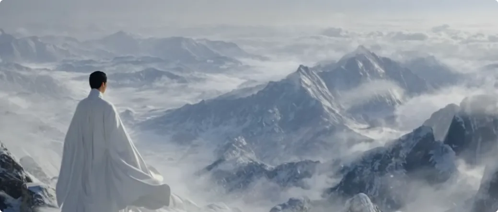
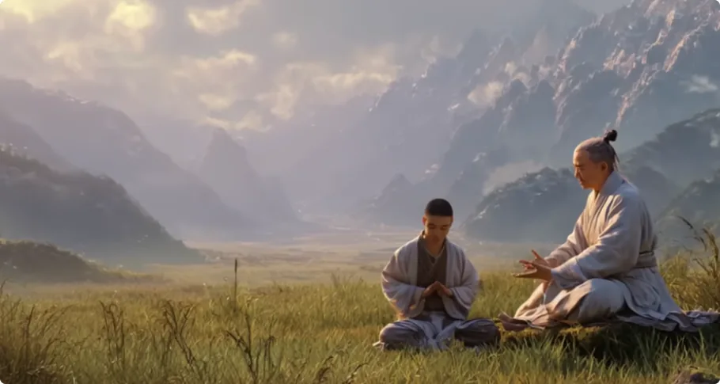

今天依旧来分享实修修仙的经验。
早些天，有个网友给我写信，说我运用了很多“不坑穷人”的顶级营销技巧，让人跃跃欲试，但又想不明白博主为何要这么做。

这是因为，高价值的东西就应该分享给懂它的人听。机会终究是给有准备的人。有句话叫：“师父领进门，修行靠个人。”
如果一个修行人始终听不懂这些简单的道理，等个一百年，人都凉了还没修上去，那么渡他的意义何在呢？

一个人的认知，很大程度上决定了他在修行上的起点。
废话不多说，今天我整理了几条修仙所需要的条件。

## 第一，来历

来历绝对是第一位的。

来历是修仙的隐形资质，几乎决定了一个人的缘分。因为来历代表的是一个灵魂在过去修行的总质量，也就是修了有多久，以及修出了什么结果。

真正有缘修仙的人，早在遥远的过去就一直在修行、修炼，而且是在正道上修得了一些成果的。即便不是都修成过神仙，那也一定是被道法认可过的。

所以，早在他转世成人前，道法就已经给他开通了一个登天考试的机会。
这也是为什么我一直强调，**冥冥之中想要修行，对一个修行人来说有多重要。** 因为这代表你本来就是这条道上的人，是有修行天赋的。

曾经修过仙的人，直觉上对正道是有模糊印象的，大致能感受到哪条路是真的，对经书不太感冒。而没修炼过的人，更喜欢读死书，更喜欢修心、静坐，做一些不实在的事情。

其次，来历好也意味着多一层保护。

有缘修仙的人以前付出的功劳不在少数，所以道法和诸神都会记着你的好。因此很多时候，哪怕这个人转世后变得愚笨，也会有股神秘力量把他引到正道上来。如果遇到危险，也不至于面临死亡。

但也有极少数人是普通人，没有来历，这就很需要悟性了。对修仙没有过感触的人，很难开启这个机缘。

还有一些来历不上不下的，这种也是修不成的。这类人往往觉得自己可牛了，觉得自己来历不凡，就应该被特殊对待，等着死了自会有人接他上天。这种人，老天一点机会也不会给他，因为自负本就跟修行背道而驰。

## 第二，真气

凡人和仙人之间最大的差别，就是气的差别。

凡人凡气，仙人真气。

自先天一炁进入新生儿的躯体后，此炁便开始凡化。随年龄增长，凡气渐盛，七情六欲也渐盛，直到耗尽死去。

所以从头到尾，人的体内都是没有真气的，只有不同质量的凡气。

要问真气在何处？答案是在自然。

因为道法自然。

在自然的某个地方，日月星辰、风雨雷电、江河湖海的真气会汇聚。这是为何自古仙人都住深山，而不是待在道观里。

过去的丹道修炼法，其实也是拿着这个气来修炼，而不是人气。
大多数人不知道的是，修佛也需要真气。连菩提树也是一棵长在真气上的树，基督背后所谓的“被提升”也是靠真气。

只有真正触及这个修行核心的人，才能看到不同宗教背后都在说的“升天”指的是什么。

## 第三，真法

首先，很多诀窍和知识，其实是一种只可意会、不可言传的体验，需要经历相同的情景才能理解，而文字根本无法将这类知识记录下来，尤其是那些超过常人认知的知识和信息。

所以，文字并不是最好的知识载体。

其次，法不轻传，道不贱卖。越是珍贵的东西，对得道者的要求就越高，往往需要得道者具备一定的心性、格局和同情心。

因为**德不配位，必有灾殃**，所以登天的真法必须先考核才能得到。

除此以外，越顶级的东西越容易招致垄断。因此，珍贵的知识和信息天然自带定义权和流通权。

在一把土都能私有化的人间，修行人应该尽早想明白：
*凡是能流通的书籍，都不会记录真正长生的方法。*

历来真法显现时，都是仙人亲自下来渡人时才出现的，走后便一并带走。此外的时间里，人间的真气都是不开放的。

“灵山脚下狮驼岭”这句话，充分体现了道对真法的严格管制。不该你触碰的东西，不管你的借口多么冠冕堂皇，你敢伸手去要，就是找死。

现在很多人被“人人都是神仙佛的化身”和“向内求就足矣”的理论迷得走不动道。这类人的心性，本质上还是自负的。
还没修成，就把自己当成神佛，把自性凌驾于道法之上，用唯心的想象替代外部的现实，甚至把“终有一日元赐回来”当作大保底，完全丧失了脚踏实地寻求进步的能力。
实际上，道家没说过人人都是神仙，佛陀没说过人人都是佛陀，上帝也没说过人人都能上天堂。

从一开始讲的就是：***人有这个潜力，但需要修行正果、菩提。***

## 第四，机缘、机会

为什么历来修成仙佛的人很少呢？为什么不是一群一群地飞升呢？

其实这个道理跟科举是一样的，不存在全国青年一起上清华、北大的事情。
为什么清北每年只录取固定的数量？为什么不把几百万考生都录取了呢？

天上的能量运转，有生有灭，有分有合。只有当新的大生大合到来时，才能创造足够多的真气和位置，容纳新晋升的神明。

也就是说，修仙是需要时机的，不是什么时候都可以。
所以大多数时候，修炼的生灵并不会转世成人，没有必要在得不到真气修炼的时期沾染人性和人气。
反之，当你看到越来越多性格古怪、不解人情的人出现的时候，可能就是修仙的时机到了。

最近博主在《阴符经》看到一句话，感觉要长脑子了，在此分享给大家。它是这么说的：

> 天发杀机，移星易宿；  
> 地发杀机，龙蛇起陆。

## 第五，引渡人

你可以模仿成功者的路径，但复制不了成功的关键。

比如高度情境化的实战经验、帮你填补信息差的贵人、特定的时机等等。

总结起来说，就是**认知跨越才是成功背后最难的部分。成功的人从来不是一个人完成跨越鸿沟。**

在认知空白的领域，其实都有指路的贵人，有懂门道的人指点他该怎么做。这些特定的、专有的、稀缺的、无法复制、无法公开的部分，通常不会记录在成功者的自传中。
同样，历来修成仙的人，无一例外是神仙下凡，亲自指点修行人如何在特定的地方、特定的时机，用特定的方法，学习特定的经验，完成特定的修行，完成试炼。

以上种种方法、路径，如果没有这个引渡人的真传，一项都不可能完成。

甚至连这个修仙的人也是特定的，有特定的来历。

所以，当此人成功修成飞升后，所有特定的、无法复制、无法公开的部分，统统都不会流传出来。顶多告诉大家有这么一件事，或者当事人有什么心得体会。没了，结束了。

## 第六，个人素质

能成功的人都具备一些良好的品质，比如：

- 目标明确；
- 积极进步；
- 通情达理；
- 真诚讨教；
- 性格独立；
- 刻苦钻研；
- 坚持不懈；
- 言而有信；
- 有始有终。

这也是有贵人愿意帮助和提点他们的原因。

孺子可教也。

而这样的人，大多都会逐渐积累出一些才能，可能是学业上，可能是事业上。反过来说，通过看一个人的才能，可以客观了解他具备的心理素质。

其次是经济条件。
经济基础决定上层建筑。

香港富豪田北辰曾坚信，只要有斗志，弱者也能变强者。之后，节目组让他体验为期一周的底层生活，并且不得动用原有的财富和人脉。

结果短短两天时间，他就被彻底打脸。高强度的劳动让他完全没有精力去思考，微薄的工资让他吃了上顿，只想下顿。他的精神和思想已经完全妥协和退化。

所以，人没有一定经济基础，是很难考虑修仙的。

不过凡事皆有两面。经济基础太好的人，大多并不想修行，因为可选项太多了，何必修行为难自己？
相当多投生在这种人家的修仙者，也迷失在其中。不过，很快也到你们想修行了。
总之，大多数修仙之人，既要体验到人间的苦，明白要修行，也要体验到如何才能成功，以具备实现修行的能力。

## 第七，临门一脚

有人说，厉害的师父都是主动找徒弟，甚至心中早有选定。

师父可以这么想，但徒弟也这么想的话，那就完蛋了。
常言：

> 医不叩门，师不顺路。

真正有价值的东西，从来不会主动送上门。主动自降身价，那样肯定不被珍惜。

反之，一个在家中等着不劳而获的人，肯定不是可教之才。

一个悟性足够的修行者，应当知道该以何种姿态迎接高价值的机缘。

所以，真正的师父可以坐在十字路口说书，在那里等徒弟上前问路，但他绝不可能来到你面前，请你当他的徒弟。

所以，真正应该临门一脚的，只能是徒弟本身。
尽管修仙者的列表已有定，但如果连这个基本的道理都没悟明白，那就轮回。

几千年对于天上的神仙来说，根本不是事儿。

我是修炼者小烨，我们下期再见。