## 观前提示

大家好，我是山吒，欢迎来到我的宇宙。上期我们讲了关于**入世**的话题，这一期来聊关于**出世**的话题，再下一期会和大家探讨生命的意义。这三期表面上没有任何关系，但在内核上却有着很深联系，所以我称为“世界真相三部曲”。

开始之前，友情提示一下：
如果你不是这种人，现在就可以退出，要不对我们双方来说都是一种折磨。同时本期和上期一样，牵扯的敏感话题较多，所以有的地方我会说得比较隐晦，对于某些理解能力有问题的人来说会更加痛苦。以上是观前提示，请反复观看三遍。

废话不多说，直接进入主题。

## 一、从好奇到唯物，再到动摇

一直以来，超自然现象都是开启人类好奇心的最强密码。我小学的时候看过一本书，《世界未解之谜》，现在回想起来，我早已忘记这本书的来源，但对于书上所描绘的各种超自然现象，直到今天我都记忆犹新。不知道正在观看视频的各位有没有相同经历。
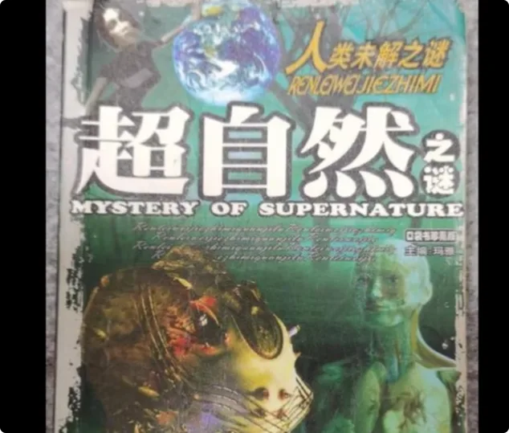

也是在同一时期，因为我爸是一个佛教徒，经常会给我看一些佛教小故事，包括书籍视频等等。那时我对于这些东西，都是抱着一种神话故事的态度去看待，即使不怎么科学，但确实也比课本上的内容有意思多了。

所以这本书和我爸算是点燃我这方面兴趣的两个启蒙老师。很多年都没有再关注过这方面的信息，除了偶尔朋友之间会聊聊发生在各自身上的一些灵异事件。

到了2014、2015年，那时候《逻辑思维》大火。我也通过节目入坑了一本书，尤瓦尔·赫拉利的《人类简史》。读完这本书后，我突然恍然大悟：
***原来这些所谓的神神鬼鬼都是人类的谎言。***

这本书不仅解开了我小时候的疑惑，更让我成为了一名坚定的唯物主义者。从此谁再聊超自然的事情，我都会用《人类简史》里的理论去反驳他。

就这样时间到了2020年，又一个颠覆我认知的人出现了，他就是 **YouTube 中文频道涨粉最快的男人老高**。

刚开始看老高视频的时候，也是抱着小时候那种心态去看，但是看了3年之后，发现这些都市传说的背后都有着千丝万缕的联系。

当然也有人喷老高逻辑不严谨，这里我想替老高说句话：
你想要严谨看什么自媒体啊？你去看书啊，看资料啊，你去听老教授讲课啊，你听得进去吗？自媒体最重要的就是有趣，如果你对这个东西感兴趣，可以自己去研究。有人说媒体也要严谨啊，你看严不严谨嘛。

我相信讲到这儿又有人要喷我：你就是宣传自媒体可以弄虚作假，你就是在给这些坏人洗白。所以我让你别进来看嘛，去给他俩耳光，让他以后长长记性。

言归正传，相信经常看的朋友都会和我一样有一个疑问：
这些事到底是不是真的？
人到底有没有超能力？
死后到底有没有灵魂？

那接下来就和大家科学地探讨一下这几个问题。关于人到底有没有超能力，这个问题从古到今都有记录，我今天就不从古时开始讲了，直接切入重点。

## 二、官方研究脉络：从星门计划到507所

从近些年 CIA 的解密资料来看，人类开始科学研究这个事儿，是从1979年美国的**星门计划**开始的。

同年，咱们中国四川大足县一个5年级的小学生**唐雨**可以用耳朵认字，这件事在本地报纸刊登后，全国媒体都跑到了四川，对他进行了采访。
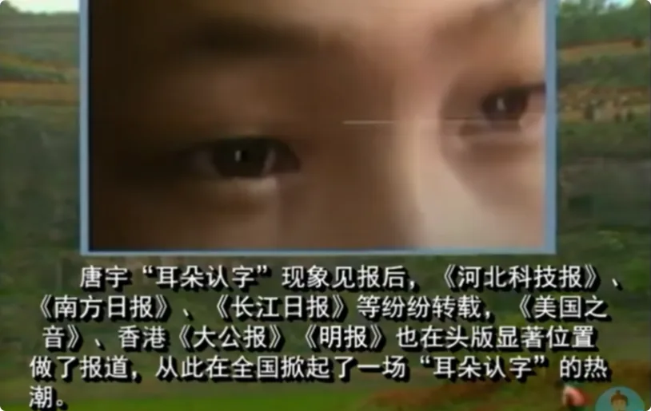

随后一票专家对唐雨进行了测试，最后发现唐雨是在弄虚作假，提出了批评。但是上海《自然杂志》却是不同态度，《自然杂志》发表了系列文章，阐述了耳朵识字的可能性。1980年2月，唐雨还登上了《自然杂志》的封面。

也是这一年，中国对人体特异功能的专业研究开始了: 

1. 1968年成立的国防科工委航天医学工程研究所，也被称为**中国人民解放军第507研究所**，最开始是研究航天医学，包括对航天员的选拔、训练、培养，隶属于钱学森任院长的中国空间技术研究院。
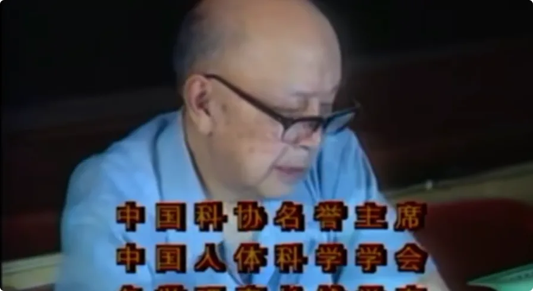

2. 到了80年代，由于经费问题，507所屡次被列入裁撤名单。当时钱学森坚决反对，他认为从长远来看，载人航天肯定是未来的重要研究方向。在钱老的坚持下，国防科委同意保留507所，但要缩减编制，研究人员被缩减到了几百人。

3. 到了86年，国防科委再次提出裁撤507所，理由是目前载人航天任务暂缓，但钱老再一次反驳道：人员经费可以减，但机构不能撤，至于留下来做什么，他会亲自安排。从此507所的研究方向也转向了人体科学，也就是我们所说的特异功能。从钱老带头开始，越来越多的教授专家也开始进入到了这个领域。
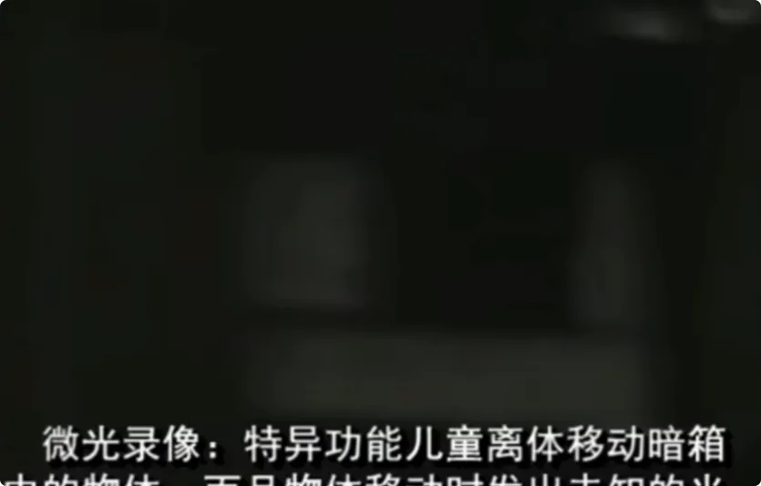

4. 中国80年代气功热的源头，就是国家站台、大V背书，所以在那个时期涌现出了一堆骗子，最后和传销一样被全面封杀，从此转向了地下研究。本来我想像《PUA历史》那期一样，做一期节目来讲解一下那段时期的历史，但是已经有人这么做了。如果大家感兴趣，可以自己去看一下到底是怎么回事，来龙去脉讲得非常清楚。

## 三、钱学森与帕森斯：特异功能研究的隐秘渊源

网上有些言论说，钱老研究特异功能是因为年纪大了，脑袋糊涂了，还有一些说是为了给政治服务。其实钱老研究特异功能是有渊源的。

早在他回国之前，还在美国上学的时候，他的同学、加州理工学院火箭自杀小组的成员、自学成才的燃料专家**杰克·帕森斯**，就是研究黑魔法的。

这个人很有意思，简单来说就是有钱版的曼森。

他自己说，他研究火箭燃料的灵感，来源于古代炼金术中的希腊火。人类火箭第一次进入太空是在1957年，他们30年代就在造火箭，对于当时的人来说还是一件很科幻的事情。

当然帕森斯也有很多黑料，其中最大的就是他通过宗教的方式在搞女人。

但我觉得这个说法是不成立的：
帕森斯从小就是一个富二代，后来造火箭还是军方在给他投资，又是青年科学家，长得又帅，这样的人缺女人吗？需要通过这么复杂的方式来搞女人吗？我相信一个满脑子只会想着搞女人的男人，也造不出火箭。

他研究黑魔法的方式比较邪恶，这里就不细说了，但是目的是为了打开时空隧道，后来据说是打开了。

就在他38岁的时候，家中发生了爆炸。美国政府说是因为他在家中研究燃料发生了意外，但他妻子却说是美国政府把他暗杀了，因为帕森斯平常是一个非常严谨的人，更不会在家里做实验。

帕森斯1952年6月17日去世，7月12日到29日期间，连续几晚有不明飞行物飞过白宫，他的妻子坚信他打开了时空之门。

帕森斯认为，意念也就是我们上期节目所说的，

**想象力是人类命运、内心信仰的集合，意念力是无处不在的，与量子物理是相通的**。

钱学森在其著作《论人体科学与现代科技》中也说到，特异功能和气功的本质原理，就是人类运用意念力对人体或是其他物体进行控制。

当气功练到高级阶段的时候，发功者就可以运用意念力传递消息，或是改变物体的物理形态，这种意念力甚至可以突破时间和空间的限制，可以和量子力学平行研究，是未来人类科学的发展方向。

## 四、关键研究者与实验案例

说了这么多，有没有点实际案例呢？

>有的，这就来了。从钱老带头研究开始，也有很多来自各地的科学家加入了进来。接下来就介绍几个有一定研究成果的。

### 1. 李嗣涔：手指识字与脑场

台湾大学校长**李嗣涔**教授的手指识字实验，相信经常关注这方面的朋友一定听过他的故事。为了照顾还不了解的朋友，这里我简单说一下他的研究过程和成果。

李嗣涔毕业于美国斯坦福大学电机系，1980年取得博士学位，是台湾半导体方面的专家。

李校长当时看到儿童手指识字的新闻后，第一时间展开了研究，后来发现不止唐雨可以，当地有很多小孩都可以做到，于是他自己训练了一批，训练的方式就是静坐冥想。后来又发现不止手指识字，耳朵、鼻子各种都可以识字。

再后来发现根本就不是用这些器官去感应的，而是一种超感官、超视觉。这种能力，6~14岁的小孩经过后天训练，成功率在六七十%左右。这里不禁让我想起了《龙珠》里只有单纯的人才能坐上筋斗云的设定。

在他的实验过程中，有一批科学家前来踢馆，借此来验证他实验的真实性。在这次实验中，让这些小孩在脑袋上接上电线，随时监控他们脑波的变化，然后让他们看的字，也是由这些踢馆的科学家来写。

为了验证真实性，还把让小孩看的字故意写得更复杂，或是画成更复杂的图形让他们辨认。最后一个叫**高桥舞**的日本小女孩辨认率最高，达到70%。

也是在这次实验中，专家为了为难这些小孩，在写有很多复杂汉字的纸条中加入了不少宗教性的字眼，比如佛、耶稣这类。每当出现这些字的时候，小孩都表示看不到，直到灵能最高的高桥舞看到了一束光。

就这样在这次意外中，他们发现了另一个我们用肉眼和仪器无法观测的世界，李嗣涔教授称之为**脑场**。

我们在这个宇宙中的其他生物和更高维的生命体，都是通过脑场来交流的。

脑场中的时间是超越光速的，脑场就像一个搜索引擎，这些宗教性的字眼就是一个网址，用天眼一看就可以进入到这个网址里面。

这些小孩手指识字，其实也是通过天眼去看。那天眼在哪儿呢？其实就在我们左右脑的中间，一个叫做**松果体**的腺体。

百度百科和维基百科对松果体的解释是，调节人体生物钟、分泌褪黑素，和天眼以及超感官无关。但李嗣涔教授说，为什么小孩有超感官，大人没有？

>因为松果体就是禁锢灵魂的地方，灵魂是非常活跃的，如果没有松果体，灵魂很容易就跑了。随着人年龄的增长，松果体慢慢钙化，越长越牢固，如果没有经过长期的训练，人就很难再开启超感官了。

除了李嗣涔教授，还有一个人也说过类似的话，他就是著名的大哲学家、数学家、解剖学家**笛卡尔**。

他在最后一本著作《论灵魂的激情》中，对松果体有大量的提及。这种哲学书籍非常深奥，我尽量用通俗的语言给大家翻译一下：

>在大脑中有一个小腺体，灵魂在那里，要比在其他部位更特别地发挥着它的作用。他还说过，我唯一可以确定的事情就是我自己思想的存在，因为当我在怀疑其他时，我无法怀疑我思想的本身。笛卡尔这句话的中心思想就是“我思故我在”。

其实除了笛卡尔，东西方在宗教上都有对松果体的崇拜。
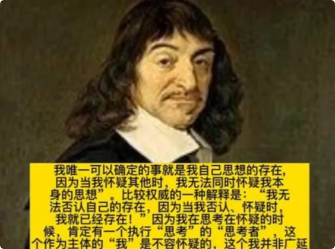

西方就不说了，在佛教中，我一直以为佛祖头上的是包，后面了解才知道全是松果体智慧的象征。除了佛祖，大家也会发现很多东西方的先人神，眉心处都会有一个红点，其实就是指向松果体的位置。

### 2. 朱念麟：虚数空间与意念摄影

还有一位大牛，对人体特异功能有着更全面的研究，他就是云南大学物理系的**朱念麟**教授，已经在这个领域研究了30多年。
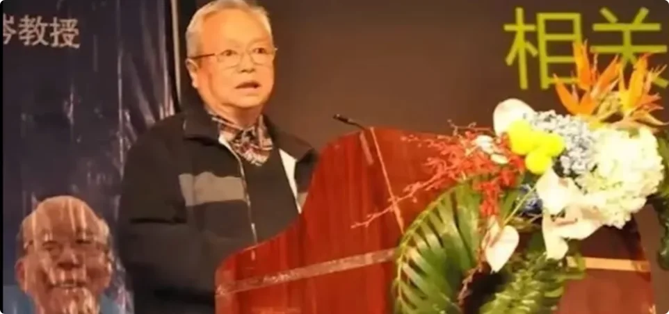

据李嗣涔教授说，他90年作为一个新人，到潭柘寺参加特异功能研讨会时，朱念麟教授当时在业内已经很有名气了，他手下的功能人能力更为强大。

刚刚提到的和李校长做实验、灵能最强的高桥舞，80年代作为日本天才儿童代表团来云大，和朱教授手下的孩子们做交流的时候，她的灵魂和云南的孩子相比，还显得非常平庸。这个世界有一个纪录片，大家感兴趣可以去塔哥的频道了解一下。

我把朱教授的一些研究成果看完后，发现他所创立的这套公式体系，可以完美地解释出很多特异功能现象背后的原理和机制。

简单来说就是为什么用念力可以把勺子掰弯，从科学上来说是怎样的一个交互过程；为什么有人算命就能算得这么准，他是用数学的方式算命，还是某种心电感应；如果是心电感应又是怎样一个感应法。

我这个人就喜欢刨根问底，比如说养小鬼，我就想知道怎么养，怎么和他沟通，怎么让他帮你做事，是突然变出来，还是通过某些干预让你间接获得。别急，对于这些朱教授都有解释。

朱教授通过研究这些功能人士发现，我们这个三维世界之外，还有一个他称之为**虚数空间**的世界。这个空间是重叠的，就像太极图的阴阳交错一样，中间的两个洞就是两个空间之间的时空隧道。

通过意识来连接。对于两个空间之间的关系，你也可以用正负数来理解，两个空间处于一种纠缠态，开了天眼的人才能看见虚数空间的存在，和李教授所说的脑场是一个意思。

虚数空间与我们所处的实数空间时间是不一样的，要比我们所处的空间更快。至于快多少，目前还没有一个具体的数据，不同的功能人虽然都能到那个空间去，但是感受到的时间还是有差别的。
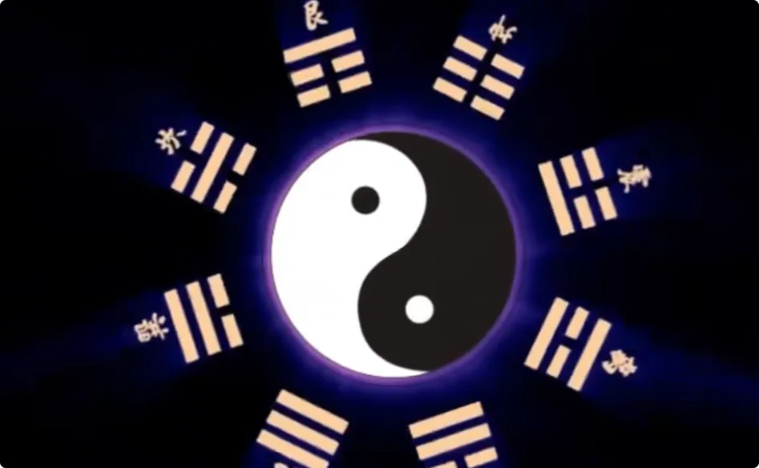

但是这个就解释了超能力算命的原理。算命分两种，一种是**数学算命**，一种是**超能力算命**。

什么叫数学算命？

比如说拿算卦来说，算命师在算卦之前，都要让你摇签或者摇铜钱等等，反复摇过几次后，他们根据今天的天象环境、你所问的问题、你的状态，通过他们那一套公式，最后推出一个卦象，最后根据算命师的人生阅历进行主观的解读。

### 3. 孙储琳：金箔刻字与熟虾复活

朱教授把特异功能主要分为了几大类，如下所示：

1. **物理类**：念力拨动钟表指针、玻璃软化。像李嗣涔教授和异能榜排名第二的**孙储琳**做的半导体金箔刻字实验也属于物理类。她在硅片上做了几十片金箔，金箔的大小是十微米，我们的头发大概是60~80微米，相当于头发大小的1/8，这个金箔得在显微镜下才能看得见。孙储琳就是在这么小的金箔上用念力写字，所以这个实验是很难作假的，应该是物理类中比较有名的一个实验。

2. **化学类**：用念力只让火柴盒中的一根火柴燃烧、水的紫外线吸收系数改变、酒精变水、水变酒精。说到这，我想起了我高中时候发生的一件事：某天放学回家，我在一个天桥上遇到卖盗版书的小贩，我当时溜了一眼，看到一本书叫《中功秘法》。我就研究了一下书上的内容，就是教你怎么修炼超能力的，什么手指变长、酒精变水这些。有一次我在班里看，被我们班主任发现。他跟我说这个是邪教书籍，我要是真感兴趣，让我去研究一下507所。因为当时学业繁重，也没有再去研究了。

   直到最近我和一个很好的朋友说，我要做这期内容，他突然和我说，他想到了一件事：他早年间和现在的新晋四大天王之一的**姜云升**在一起玩的时候，姜云升就当众表演了他的超能力。他说你信不信，我可以把你手里的烟变成草莓味。他当时就说不信，然后姜云升拿过来用手摸了一下，再递给他，真就变成草莓味了。然后又跟他说，你信不信，我还能给你再变回来。果然又是一样的手法，味道又变回来了。当时大家都以为是魔术。他还跟我说，有一次他们去参加 battle 比赛，姜云升和他说，我算了一下，这场比赛我会得亚军，你第二轮就会被淘汰出局。这和他在《说唱新世代》里把黄子韬耍蒙的路数一模一样。熟悉他的人都知道他们家是道氏家族。我看了武汉大学宫哲兵教授对于道教的研究，确实有这样的技术，所以这个事情还是有点悬的。

3. **生物类**：种子快速发芽、快速开花、油炸花生米返生再发芽。其中最神奇的一个是，我在孙储琳女士的专访中看到的，她可以把煮熟变红的虾通过念力重新变绿，并且动起来。她的这个操作原理，就是她能看到虾即将入锅的时候，灵魂就跑出来了，就在桌子的周围，她用手把灵魂又拽到熟虾身上，虾又活了。

4. **信息类**：比如李嗣涔教授他们做的脑场实验。高桥舞要进入到佛的世界，她自己进不去，要脑场里的一个灵体，也就是她在那个空间里的老师带她才能进去。但是后来李教授和孙储琳做实验的时候发现，她不需要老师，自己就可以进入到各个神的世界中去。

除了以上这些，还有像远程治疗、远程整形、一分钟之内断骨重接等实验。关于远程治疗，朱教授说了一个案例：

>一个在昆明的初中生远程发功，帮助一个在武汉的脑梗患者起死回生的实验。还有远程整形：一个患者的鼻骨凹陷，功能人远程发功，患者坐在家中，感觉凹陷处被电了一下，再摸已经好了，非常神奇。

为了探索虚数空间的更多秘密，朱教授发现虚数空间里还有很多的书籍资料，有的是我们人类遗失的，有的根本就不存在于我们人类世界。

为了搬运这些资料，朱教授就让这些小功能人抄书，但是至今也没抄几本，因为这些学生的作业实在是太多了。

所以朱教授感叹道: 
国家应该大力研究如何把虚数空间的能量转化到我们这个世界来，这可比可控核聚变的作用大多了。就像李嗣涔教授通过脑场和天鹅座的外星人沟通后才了解到，他们都是瞬间可及。因为虚数空间里的所有物质都是靠想象，面包进入虚数空间里面，想一下，再通过设备转化过来。

还有一个很神奇的实验：**意念摄影**: 

>把虚数空间的图像投射到我们这个世界来。刚说了，每一个实体空间的物体，都会和虚数空间里有一个对应，操作原理就是让功能人用虚数空间里的手机拍一张照片，因为两个手机之间处于纠缠态，也就是量子纠缠状态，实体空间的手机相册里就会多出一张照片。

大家可以看一下朱教授他们意念摄影所拍的照片。朱教授说：

> 在路上，我们就一路拍照，其中有个孩子技术比较好，就照了四张。这件事很有意思，有意思在什么地方呢？影像当是很清晰的，因为长的不清晰，怎么不经历拍什么东西呢？这些东西都是我们没有见过的星系。这边有个东西是很清晰的，看这个上面本来应该很清晰嘛，看着就是个八字，当时就是文物古流的。想利用这个现象，我们就让一个刚刚学会的孩子，还在10km、12km，他的家里还有我们实验室，在沙发和这个电视机啊。另外呢，这个是什么照片？颜色非常鲜艳，图像很简单，但是里面很多很多细节，老黑呢把白色的颗颗粒再往外飞。那么这个时候说的照片呢是追踪流星，就是我们的一个小朋友，他正要想拍什么的时候，在虚数时间看见一个流星，他就追上了流星，把它拍成一个特写的镜头，就是心智利用这个特色。因为流星在飞追都追不上的，但是意念可以追上，你就拍了这么一个照片。所有的这些就告诉了我们，这个理论是成功的。

人类不像蜜蜂蚂蚁一样有兵蚁、工蚁、蜂后等等分工，生来生理结构就不同，从生下来开始，一生命运就注定了。

人和人之间在生理结构上没有着明确的分工，所以自古以来才会有“王侯将相，宁有种乎”的说法，所以才需要宗教、政治、各种主义来进行分工。我一直以来对宗教的看法就是洗脑工具而已。
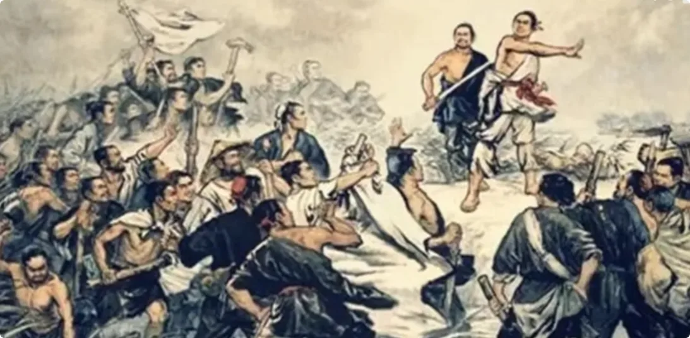

## 五、我亲身经历的两件玄学事件

### 1. 算命师傅精确到天

比如有一次我去算命，是一对父子给我算，我问的感情。他儿子跟我说“白嫖了吗”，他老爸却说“哎也不能这么说，他一开始还是喜欢你的呢”。老头大概50岁，他儿子初中生的感觉。

据推荐给我的朋友说，他们是祖传手艺，算得特别准，能把破坏她闺蜜感情的小三的姓给算出来。

还有一点比较神：你要问的问题不用告诉她，你就心里想着，然后摇她那个铜钱，他们就开始算。等你摇完了，他就拿出一张纸来问你，你要问的是不是这个，这个就是他们的基本操作流程。

当时我和朋友一起去的，给他算算了差不多55分钟，给我算起码算了半个小时。我当时看他和他儿子在那算得满头大汗，像做题一样，我都有点尴尬。

当时算完了，他跟我说，我都不信，可是后面这些事情都一一发生了。

就是因为这次的准确预测，后面我带了一个客户过去，还是找那个师傅算，但是当时客户没来，我就让师傅先给我算。我问她，我下一个女人什么时候出现。

这次他俩差不多算了10分钟左右开始了争执：他儿子说应该是下个月的17号，他老爸很生气地对他说，那下个月17号，这个月17号？我当时很震惊地说：“现在可以精确到哪天了吗？”师傅突然很不屑地对我说：“不要了，我走在时间前面，那牛逼牛逼。”

当时出来以后，我心里就想着，17号我就不出门了，我看这个女人怎么出现。结果真的很离谱，真的出现了一个陌生女人，我们还度过了一段美妙的时光。

整个过程非常违背常理，为了不占用大家时间，这里我就不细说了。如果大家感兴趣，本期视频点赞只要比上期多，我就把这段离奇的经历写在本期的视频笔记上。

### 2. 表哥离世与仙人的远程判断

这段经历我认为只能算得上是小神奇，接下来和大家讲的另一段经历，绝对能够证明超能力算命的存在，也符合朱教授虚数空间的说法。

不知道大家还有没有印象，我在《PUA历史》那期快结束的时候，讲了一个家里很有钱的哥哥，被小绿茶PUA弄得我嫂子整天以泪洗面的那个故事。

当时我在节目里面说，他的眼睛突然看不见了，这件事才得以结束。我发布那期视频的时间是今年的1月19号。就在四天后的23号，他突然就去世了。当时我得知这个消息的时候，整个人都懵了。因为就在两个月前，11月23号的时候，他还在给德国队加油，怎么可能就两个月的时间，一个活生生的人就莫名其妙的没了。

故事太长，我就长话短说。大致是因为他们家本身就有一种基因缺陷，免疫力就比正常人低，加上疫情期间打了疫苗，因为疫苗本身也是一种病毒，所以为什么有的人打了会头昏脑胀。
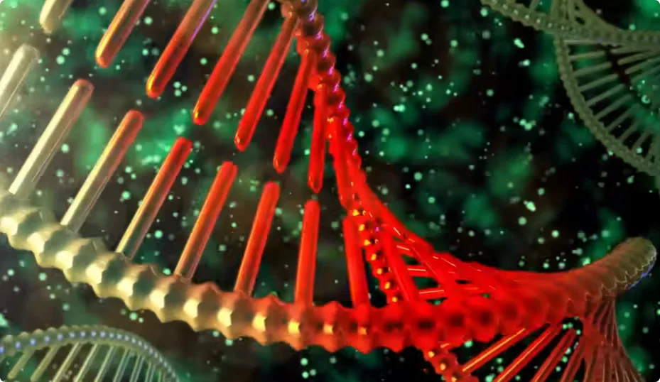

我和他其实是没有血缘关系的，我叫他哥，是因为他妈和我妈是高中同学兼闺蜜，我们从小就在一起玩。

他眼睛就是因为打了疫苗，加上他本身又感冒，还喝酒，一下子炎症控制不住，直接把左眼的视网膜给溶解了。后来通过治疗命暂时保住了，本来想把他送到医疗条件更好的地方去，但是因为疫情封控加上他本来身体就不好，就一直没有出去。
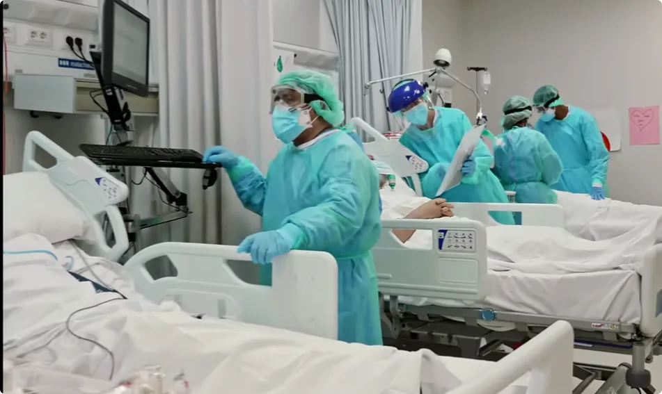

世界杯期间他稍微好了点，医院就放他回家了。因为他家的饮食比较清淡，他熬夜看球，各种烧烤饮料啤酒，听我嫂子说，大口茶都喝了三杯。

大家都知道糖是会引发身体炎症的，更何况他的身体状况，还摄入了大量工业糖精。然后开始发烧，又送医院了。

由于昆明这边的医院对他这个并没有任何临床经验，给他注射了大量激素，炎症是消了，可是他的内脏器官全面衰竭了。然后他的父母眼看不行，大年三十晚上托关系，把北京某医院的院长临时请过来给他治疗。

最后临近我哥去世前的四小时，他爸觉得医学上已经无法拯救他儿子了，想求助于玄学，想找一个他自己认识的江湖人士来想想办法。

这个时候院长就说，因为他们中医接触这方面的人比较多，他身边就有一个仙人，他的原话是“仙不用修炼，从小就有特异功能那种”。

告诉他吧，如果真要找这方面的人，就不要找什么江湖人士了，直接找这个仙人看看有没有办法。于是当场就给这个仙人打电话。

大家请注意，故事的重点来了：院长只和仙人说了，他一个朋友的儿子叫某某，现在生病了，让他帮看看这个病什么情况。

仙人只说了两个字：**方位**。院长就说云南昆明。生辰八字什么的还没问呢，仙人思索了一会儿，就说了一个字：**死**。如果要吊，可以多吊十天，但是过了十天还是死。

当场我听完就是一阵鸡皮疙瘩，难道人的命运真的是被安排好的？这个问题我们先不讨论仙人远程算命的原理。如果按照朱教授所说的，虚数空间时间比实数空间快这个概念，那就说得通了：

>所有实数空间的物体在虚数空间都有对应，比如现在正在看视频的你和你的手机，在虚数空间就同时存在着。那他只要通过天眼看一下这个在虚数空间的成像，不就知道了。

OK那还有第二个问题，那通过吊他多活十天又是什么意思？吊的意思就是，通过意念改变物理世界的现实法则。但是他当时已经脑梗了，很痛苦，他父母决定还是让他安心地走，不想让他再受苦了。

我现在终于明白为什么人在看过生死以后，更愿意相信有灵魂了。我哥走的时候才32岁，他的魔术工作室才开到一半，抱着吉他浪迹天涯的梦想还没实现，他的两个孩子甚至都没有学会叫爸爸。如果真的有轮回，愿他来生再来弥补这个遗憾吧。

这两件事情都是真实发生在我身边的，让我对这个世界的看法开始产生了一些改变。

## 六、宗教、辉光与科学修仙

用《人类简史》的话来说，在远古时代，如果你要去山里打老虎，你告诉大家真实情况，可能没有人会跟你去；

但如果你告诉大家，山里有神仙水，喝了能长寿，那就会有很多人追随你。可是随着科学技术的进步，再回过头来看宗教，发现科学只是不断在验证着宗教早已说过的事情而已。

### 1. 人体辉光与经络

比如说西方、印度、中国的神的画像上都在发光。前苏联科学家**基尔里安**通过仪器发现了人体会发光的秘密。他通过仪器检测发现，人在不同的健康状况、情绪状态时，所发出的光都会不同。

他称这种光为**人体辉光**。当一个人平静的时候，光呈浅蓝色；一个人生气的时候，光呈橙黄色；恐惧的时候光呈橘红色；说谎的时候，光呈各种颜色的交替。

后来他的继承者、量子物理学家**科罗特科夫**发明了辉光相机，发现不止健康状况和情绪，连人的品行和运气都能通过辉光表现出来。

一些修炼之人的辉光呈黄色并重，或是将死之人的辉光呈暗淡或黑色。男女在相爱的时候，辉光特别亮；当牵手的时候，女性指尖的光会向男性延伸，男性的辉光则相应后缩，就像一道闪电一样。

并且这项技术已经走出了实验室，运用到了实践当中。

在圣彼得堡建城300周年盛典举行之前，在入场口的岗亭位置安装了辉光相机，三天之内就帮警察找到了九个罪犯，有运送毒品的，有运送枪支的，还有其他通缉犯。在实验过程中还发现，即使把树叶裁掉一半，再用相机照，辉光还是呈完整性，这也解释了幻肢痛的医学现象。

除了西方，中国安徽医科大学的张学军教授也在研究人体辉光。他在研究中发现，人体中特别亮的光点，位置和中医所说的经络穴位是完全一致的。

### 2. 佛教宇宙观与最小粒子

除此之外，我们都知道，构成我们这个世界的单位是基本粒子。1811年，人类发现了分子，以为分子就是最小的单位；后来发现分子里还有原子；再后来又在原子中发现了质子。到现在为止，人类发现的最小单位是夸克。

夸克有多少呢？针头里那个针眼的位置可以容纳5000万个。虽然目前夸克是最小单位，但科学家相信随着技术的进步，肯定还有更小单位。

但是早在2500年前，释迦牟尼佛就说过，**一花一世界，一树一菩提**。四个大洲加上须弥山是一个小世界，1000个这样的小世界成为小千世界，1000个小千世界成为大千世界，3000个大千世界成为三千世界。
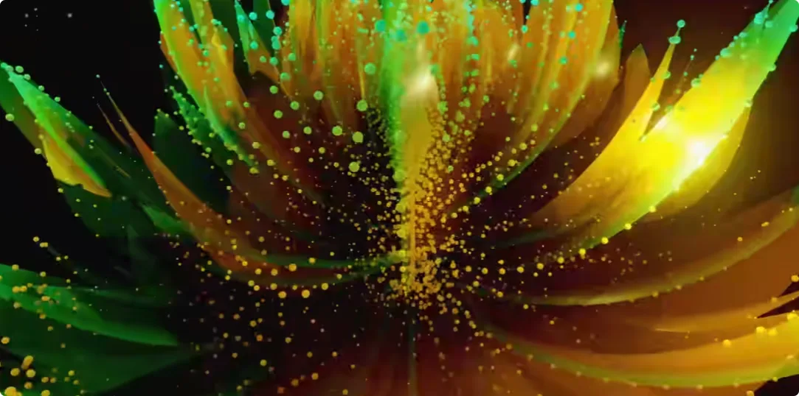

我们所处的这个大千世界，佛陀称为娑婆世界。

宇宙中存在着无数个三千世界。在《华严经》中就说过: 
在一粒沙子里，就有着我们看不见摸不着的三千世界。现在的弦理论科学家也预测，任何一个点上都隐藏着更高维的11维空间。而佛家早就说过，不光是我们这个世界里的一粒沙子，在沙子里的三千世界里的一粒沙子，也隐藏着另外的三千世界，这样往复循环下去。所以按照佛陀的说法，人类永远也无法找到最小单位，也无法了解宇宙运行的本质。

接下来就要说到我们今天的主题了：**科学修仙时代真的到了吗？**

我在研究各种宗教的宇宙观后发现，不论真假，佛教的宇宙观绝对是想象力最丰富的，它几乎包含了所有宗教的存在。

我们在看神话故事中经常听到一句话，跳出三界之外，不在五行之中。这个三界的概念最早就是佛家提出的色界、欲界、无色界。我们所处的这个世界，加上须弥山顶上的六层天，称为色界；再加上往上的22层天，统称为28层天，都在六道轮回中进行循环。越往上的生命就越长，享受的快乐就越多。

那么佛祖是怎么知道这些的呢？就是通过修炼开启了超能力以后亲眼看到的。这种修炼: 
***佛家叫禅定，道家叫打坐，印度叫冥想***

大致是一个意思。修炼的方式上原理都一样，细节上有些差别。

这一点就有点颠覆我对宗教的看法，感觉不是在画大饼，就好像佛祖在跟你说：我通过修炼看到了更高维的世界，我把这个方法告诉你们，称为经，你们通过修炼也可以看到，到时候再来验证我说的话。

这个修炼方法佛家称为**四禅八定**，修炼的程度越高，你的能力就越强。比如当你修炼到了四禅八定中的四禅，你就能开启五神通，通过天眼通就能看到佛祖所说的28层天，以及六道中各种世界的样子。
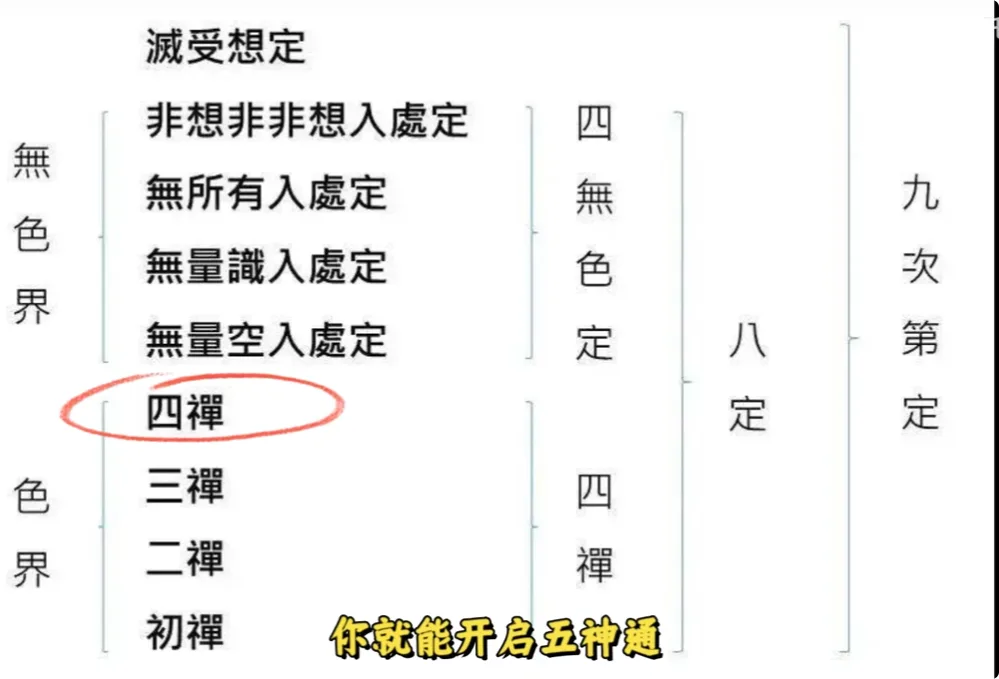

### 3. 四禅八定与禅乐

除了佛祖之外，特斯拉也说过，宇宙当中存在一个信息库，我所有的发明都来自于这个信息库。

这个信息库在印度教中叫做**阿卡西记录**，在佛教中叫做**阿赖耶识**，在道教中叫做**先天一炁**。有的人天生就能连接上，像特斯拉这种可以在脑子里做实验的人；有的人后天通过修炼也可以连接上。

那人为什么要修炼呢？按照佛家六道轮回的说法，六道分为三善道、三恶道。三恶道中的地狱和饿鬼就不说了，非常惨；

其中稍好一点的就是畜生道，但是畜生道的生灵由于比较愚痴，没有什么灵性，很难有往上走的机会，没有什么修炼天赋。那么三善道中的阿修罗和天道就很好吗？

佛经上说了，即使到了天道中的最高天——**非想非非想处天**，你拥有了八劫的寿命，一劫就是268亿年，和最高等级的禅乐。

这里要解释一下什么是**禅乐**: 
普通人是通过五感来感受快乐，但是随着环境的变化，这种快乐很快就会消失，比如很好吃的东西、一首很好听的音乐、男女之间刚开始的激情，都是转瞬即逝。但是当你修炼到四禅八定中的初禅时，就会拥有最低等级的禅乐。无法用语言来形容是一种怎样的感觉，大致形容的话，就是你高潮的1亿倍，而且是长久持续的。

三界之中，色界的天人生来就有这种快乐。所以一些修炼之人在那静坐，你以为是被洗脑了，在那苦撑，实际上是在享受着这种高级的快乐。

就好像你整天躺在床上玩手机，家长觉得你很颓废，实际上你是在通过互联网遨游世界，家长也体会不到你的快乐一样。

禅乐我虽然没有体会过，但是我体会过延迟满足的快乐，其实是一种原理。以前我是一个追求及时行乐的人，但是这种快乐流失得太快了。

后来发现做一首歌、做一期视频，过程虽然很痛苦，但是却能让我开心很久。比如我10年前做的歌，现在放给朋友听一听，还是觉得蛮有成就感的。

天界的天人就是以禅乐为食，最低级别的禅乐我们都已经无法想象了，更何况是最高级的。但是即使是最高天的天人，时间一到就会立刻轮回到地狱受苦。

因为天道本来就是享福的地方，由于生活得太好，按照佛教的积分系统，没有什么机会增加积分。反而是六道中的人道不仅能修炼，还有很多增加积分的机会。
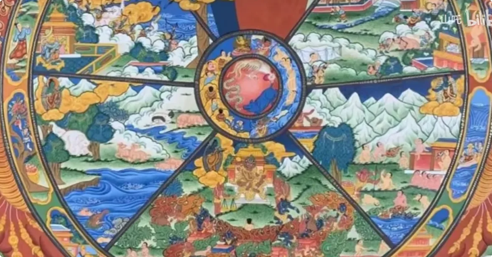

虽然身处人道的我们要经历生老病死、爱恨离别，但也是唯一一个可以看尽六道众生相的地方。比如北欧就是天然呆的地方，非洲就是地狱。当然修炼一途也并非易事，很多人一辈子可能也达不到初禅。

在看视频的各位，如果有人修炼到了，可以在评论区分享一下。不过没有关系，经常冥想一下，还是立马能感受到好处的。

我们老祖宗很早就发现一件事：我们身体内的大部分器官我们都控制不了，唯独肺是我们唯一能控制的器官。

>***呼吸一慢，心率就降；心率一降，心就会静；心静情绪就会少。*** 

感情当中情绪少的一方往往能占有主动权。大家仔细想一想，是不是这样。

而且拥有定力的人，气场都会很强，显得很有气质。为什么女生都喜欢成熟男人，现在懂了吧。

## 七、真假之辨与结尾

我们回到一开始的主题：这些事到底是不是真的？到现在我也经常在想这件事。我可以从个人的角度来帮大家分析一下。

如果说是真的，那国家为什么没有大力投入研究，反而是从一开始的热烈到现在的冷淡状态？

我想是因为这些东西对于目前的生产来说很不可控，想拥有这些能力，就得戒除世俗的欲望，整个过程又很漫长，没有太强的复制性。

**顺成人，逆成仙**

我以前以为是白天睡觉、晚上活动，到现在我才知道这句话的真正含义。如果说要把这些能力变成一种生产力，或是一种欲望，那能力又会立马消失，这也解释了为什么小孩有大人没有。

但如果这些事是假，那为什么几十年来有这么多的教授一直在研究这个事儿？
你说是为了出名，他们已经在自己的领域内很有名；
如果是为了评诺贝尔，不可能通过造假拿奖吧；
你说是为了赚钱，现在已经过了最赚钱的那个时期了

反而现在的社会环境，你研究这个还会被套上神棍的标签。而且我看了上百个这方面的视频，在评论区有很多人在分享自己的经历，难道都是水军？

前几天和我妈去看望一个奶奶，当时他们一家人都在。因为她孙女曾经就读于云大物理系，我就和他孙女聊起这个事了，我问他认不认识朱念麟教授。

聊了一会儿，他孙女就和我说，他小时候也能看到一些意象，他儿子今年六岁也能看见，他们一家人可以算得上是传统的高级知识分子。

这里我想引用507所研究员**宋孔智**教授的一段专访作为结尾。当时所里给他的任务是研究功能人**张宝胜**的特异功能。

张宝胜可以算是异能榜排名第一的人物了，因为到目前为止，他是唯一一个可以当众表演特异功能的。很多教授在研究中发现这个能力很不稳定，不是随时都有。现在在百度上搜张宝胜都说是骗子，可是宋孔智教授时隔多年却说，当年对于药瓶盗药这个实验，他做得非常严谨。

首先要确认这个功能到底是真是假，如果是真的才会展开研究。当时的实验环境用了1000瓦的灯泡来做照明，确保高速摄像机可以不放过任何一帧画面。高速摄像机每秒是1000张的拍摄速度。

药品也是他亲自制作、亲自密封，又把里面的药片换成了彩色玻璃片，每个玻璃面上还刻上了暗纹，来确保实验的严谨性。

在整个实验过程中，还拍下了药片穿过瓶子的中间态，头上还接上了脑波感应装置。宋教授说，如果是作假，情绪应该是紧张的，脑波应该是乱的，怎么会那么平静？还有很多细节我就不叙述了，大家感兴趣可以亲自去看一下这个长达一个半小时的专访。

宋老先生把整个实验过程说得非常详细，所以对于网上那些魔术揭秘的人和大喊骗子的人，我只想说肤浅得可笑。当然张宝胜的功能有时也不太稳定，有时功能不起效的时候也会作假，也被他们发现过。

但正如宋老先生所说，我们不能因为一次实验的成功，就不去质疑它的真实性；也不能因为一次实验的失败就否定它的存在性。所谓迷信就是盲目相信，如果你经过亲自深入研究发现的结果，就不能称之为迷信。

好了，本期节目到这里就结束了。因为本期内容太过庞杂，没法讲得非常详细，光一个实验专访就能长达一个半小时。

为了让更多人了解真相，我只能进行一个笼统的介绍。如果你对于特异功能、身心灵、出世等话题感兴趣，可以把我上述提到的视频自己看一下。如果你觉得本期视频有点意思，麻烦三连支持一下。下期是世界真相三部曲的最终章，我是山吒，我们下期再见。
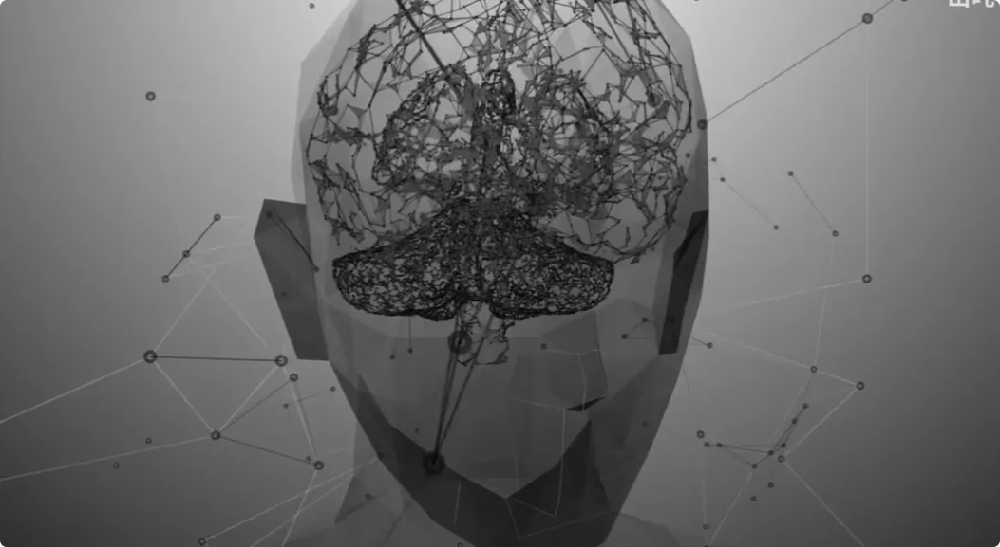

**附：结尾口述片段**

> 没有被发现的一大类，我们都忽视了，一说就是伪科学。你人类不是宇宙最高智能，地外文明、史前文明远超我们的想象。随便举一个例子，我看到的书里我都想写这么一本书，现实例太多了。发现的不是5000年文明史是吧？25亿年之前，非洲的那个加蓬，就有那个几十个反应堆的那种迹象，但不能最后下结论，就是他的那个同位素的比值，不是那个自然衰变的那种比值。这么强有力的证据挑战现代科学，我们还是说我们有中国有几千年、3000年、4000年、5000年，现在就三星堆就不太敢研究啊是吧，因为三星堆的文化和中原文化有很大差别，很可能是中亚的文化。

> 我们就第一个我想讲的就是宇宙文明，地球人类怎么正确定位我们在宇宙文明当中的地位。这个所以通过15天的观察，我感觉到他有真正的这个法术的能力，特别是搬运术。当然我这里还要声明一下，后来经过很多年的跟踪研究，我发现他一方面有真功夫，第二他在某些时候会作弊。比如说当他正在表演，突然功能不能出现，他就有一套应对方法，就通过作弊来达到。但是这两点我认为是共存的。不能因为他有功能，就说他从不作弊；也不能因为发现他作弊了，就否认他有功能。我觉得科学是复杂的，社会是复杂的，人也是复杂的。但是一个社会的文明程度，要看这个社会能不能容忍假说、科学的假说啊，能不能够容忍一些创新的言论，不要去打击他们。他们又不犯罪，他们也不占用国家的钱，他们也没有宣传迷信。我请求大家对我们这样的一些人宽容，能够支持一下更好。不是钱的支持，精神上的，是精神上的支持。因为我们中国在全世界面临着一个复兴的过程，而这个复兴的过程要求我们的人民全部都要有创造的心态，在软件上能够给世界留下一点创造。否则很多很多的国家认为中国缺乏创造力，你们只是模仿了我们的技术，你们缺乏独创。恰好，我们国内还有一批献身于独创的科学家和教授。那是我们在座的同志都知道，在近10年多来。

> 我们整个这个概念，对于人的概念受到了人体特异功能的冲击。因为有了冲击，所以我们才觉悟过来了：原来书本上、学校中教的是大大的不够用了，使我们扩大了思路，终于看到了人体是一个开放的复杂巨系统。那么我们回过头来想，我们之所以有这样的一个新的观点，我们要感谢人体特异功能，因为是身体特异功能给我们的启发，开动了我们的脑筋。但是我们也绝不能够把人体科学限于人体特异功能。正如我在1983年那篇文章就讲到了，人体科学是现代科学技术体系当中的一个大的部门，一个平行于自然科学、社会科学的大部门。那么我们人体科学这个大的部门，它也有一个哲学的概括，这就是人天观点。
