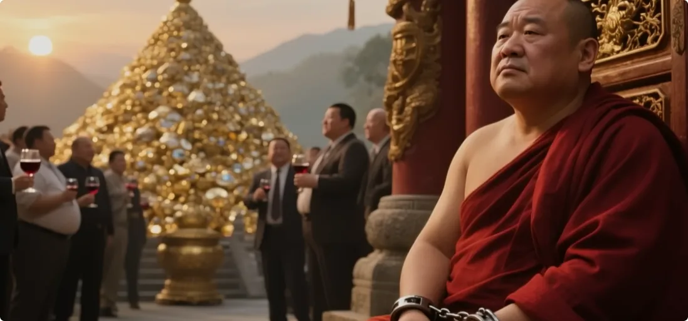
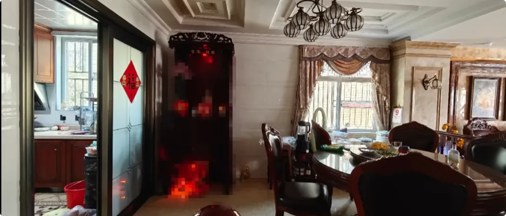
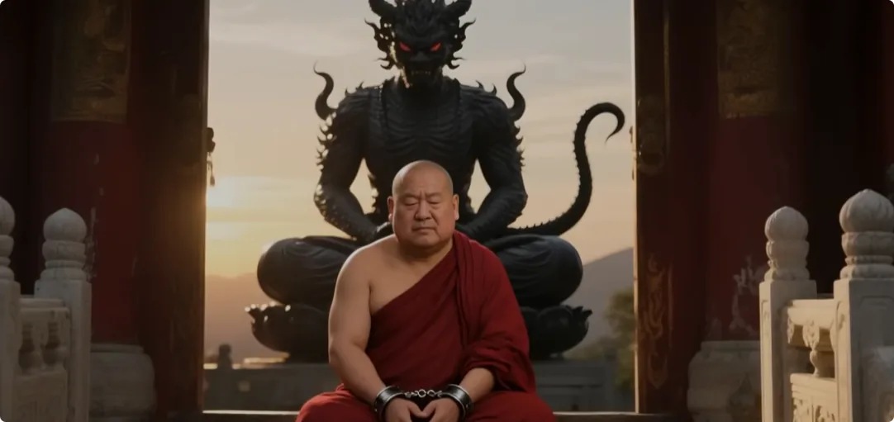
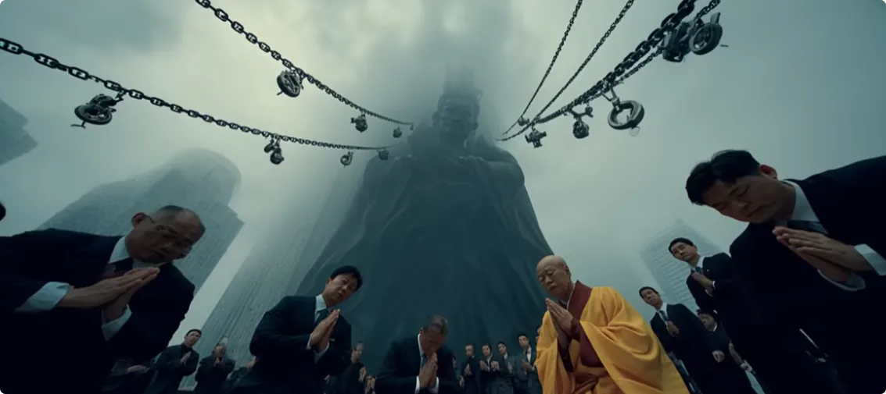

## 宗教圈的商业模式与立场执念

最近释永信的事情大家都知道吧？其实这种事情，一般就是普通阶层的人不懂。但是稍微在商业上有阅历的人都知道，宗教圈背后的商业模式其实是很成熟的，业内都是心照不宣、各取所需。有求财的商人，有借运的商人，倒没几个是真的求解脱的。

可能有人要伤心了，觉得我污蔑了某信仰。首先我要声明，我没有否定过佛菩萨。我自己是去过菩萨法界修行过的，与某位大神有过一面之缘，所以我得声明，我很尊重佛菩萨。但是凡人搞的那些是不是正法，就另说了。

**其实真正的上升渠道是不分佛道、基督、萨满的，只是人对立场这件事情太有执念了，想不通。如果你是真心想解脱的修行人，请先找修行的真相，找本质，而不是只顾着站立场。**

人是易伪装的，也是易伪善的，不要听信空口善言。

我今天想讲什么呢？我想讲的是，不管你再虔诚，没有找到正道正法，你的一切信念都是徒劳的。灵界那些大佬的操作都很黑，比人间还黑。

## 案例一：请回家的是朋友还是大佬？

先讲个案例。这是某位粉丝家里，视觉上第一感觉非常凌乱。这种情况下一般都会住进一些小妖小怪之类的，但是很出奇，他家的整体能量场比较干净，甚至找不到阴类众生。

然后我往下翻其他照片，能量扫到这里才明白，原来是家里请了别的朋友。因为有这位大佬在，赶走了其他灵界生灵，同时她也没有过分影响主人家。并且这位大佬还是很有礼貌的，收敛着她的能量，不与我冲撞。

直到我轻轻地扫描了一下，对方才跟我有一点能量交流。而且当晚我就做了一个梦，有一个比较温和的女性，她跟我说，在她的星球，她负责种植某种毒植物。她还给我看了一下她施展的红色能量的一个法术，她的星球本身又是另一个大佬。

当然了，这只是一个梦。看到这里，很多人会觉得太好了，我也要请个大佬回去，帮我赶走其他生灵。那我就要再讲一个案例了。

## 案例二：做寺庙运营，却招来了大家伙

这是另一位粉丝的家。这几张照片都散发着昏沉的能量，但是仔细看家里的物品，却找不到是谁散发出来的。只有每张照片的下沿有一种油油的、黏稠的能量，只可能是拍摄者身上散发出来的能量了。
然后我就看到沙发，沙发上明显有一位大佬坐在上面。她的能量直接冲出屏幕，把我干吐了。而且她的能量属性和拍摄者身上的是相同的，说明就是她附身的。

我赶紧看看这个粉丝什么背景，怎么招了这么大的家伙回家。这里是她的原话，她说她是做寺庙运营的。
当晚我也做了一个噩梦。梦里是山脚下有一个长脸猪妖，当着我和村民的面活吞了一个七岁的小女孩，而且不是第一次吃人了。村民拿家伙去追杀她，她就转身躲进山洞里，然后又从别的洞穴出来寻人来吃。

试问，普通人能分辨自己请了什么角色回去吗？不能的。区区凡人想跟大佬合作，还得掂量掂量自己的运气。想铤而走险、投机取巧，基本不会有好的结局。

以上两种情况，如果你不修行，不走正道修行的话，那么你要自己处理好这种关系，自己保护好自己。

## 正神不偏袒，各论各的因果

**对于正神来说，不管是普通人还是妖魔鬼怪，都是众生的一员。善恶角色很容易就转换，所以正神不会无私偏爱一方，再带着偏见压制另一方。从来都是各论各的因果，正神是不干涉的。**

如果人太愚钝，非要跟阴类众生混，或者非要走邪道修行，那从大爱的角度来说，众神也不应该管。因为谁都是栽了跟头才长教训，连神仙下凡转世也不例外。不栽跟头、不长教训，都回不去的。

所以神明若真想为你的成长着想，那就看着你栽跟头。等你终于大彻大悟，知道怎么真心求正道正法的时候，再引你到门前一试。

## 想跟灵界合作，这趟水很深

但以上还不是我今天想讲的。我想说的是什么？想跟灵界神秘力量合作，这趟水很深。万千修行人都感化不了那些灵界大佬。信徒表忠贞也好，痛哭也好，献出宝贵的东西乃至生命也好，都没用. ***抛弃你就跟吐西瓜子一样随意，弄死你就跟弄死蚂蚁一样简单。***

相信有一些了解寺庙商业模式的人会感到困惑，为什么释永信那样高位的人会出事呢？背后那位不保他了吗？毕竟都保了他这么久了。

这里我要说个案例。有一次我出门修行，路过一个地方。那个地方有个雕塑，它直径一百米的范围内，魔气压人。有多压呢？走进这个结界，我和我的朋友都眉心紧皱发疼，两侧脸颊发颤发麻，站都站不稳。

我当时很好奇，哪位大佬这么厉害，为何又要在这儿呢？于是我顶着压力去看了一眼，原来是某教捐赠的雕塑。

雕塑周围一圈不仅刻满了经文，还写着是谁捐赠的。一共有十几二十个人，都是圈内有名有姓的大师，每个人都散发着衰败之气。

当时就让我联想到一位巨魔拉着一条条锁链，都套在这些人脖子上的一个景象。有一瞬间我有点同情他们，后来又想，万一他们一开始就知道呢？万一是他们主动投怀送抱呢？

算了，不想了，我只想赶紧离开这个地方。我们沿着结界的外围绕道走，一边走还一边看到有很多游客在虔诚地跪拜，在求保佑。

## 被抛弃的释永信与人性

很多时候，人们觉得是得到了保佑的，有了富贵运，然后还愿砸钱盘下更多的地盘，招揽更多的人加入。你肯定会想，我付出了这么多，灵界大佬肯定要保我周全吧？

那就看看释永信吧。没有了利用的价值，或者说想换人了，随时就可以把你抛弃了。名利路上从来不缺虔诚者，任何人都可以随时抛弃。

不要想着大佬会顾及跟你的情分。魔子有魔爹疼，你区区凡人，灵魂层面毫无靠山。你不走正道，正神都没理由疼你、庇佑你。

很早以前我就说过，很多灵界大佬，上古的、非本世界的，都跟人不是一个维度，不是一个物种，对人类是半点都共情不来的。

人家自始至终都只专注修炼，能量越多，法力和影响力越强，生存舒适度越高，跟人类天天想着做大、富贵、资源是一个道理。

在这个底层逻辑下，灵界大佬们想的都是怎么把人圈养起来，偶尔立几个标杆，让他们展现信仰的好处。诸如此类，人能玩得有多阴，大佬肯定能玩得更阴。

跟灵界大佬谈感情和付出，真的是有点恋爱脑了。

最后还有一点，大佬之间也是要划清界限的。不同的圈子有不同的靠山。一般情况下，一个圈子的人不会主动去动另一个圈子的人。

但是当一个人在公众层面出事了，那就说明这个人背后的那位已经把他抛弃了，不保他了。因此，其他人也不用顾及他背后那位同不同意了，他可以直接下线了。