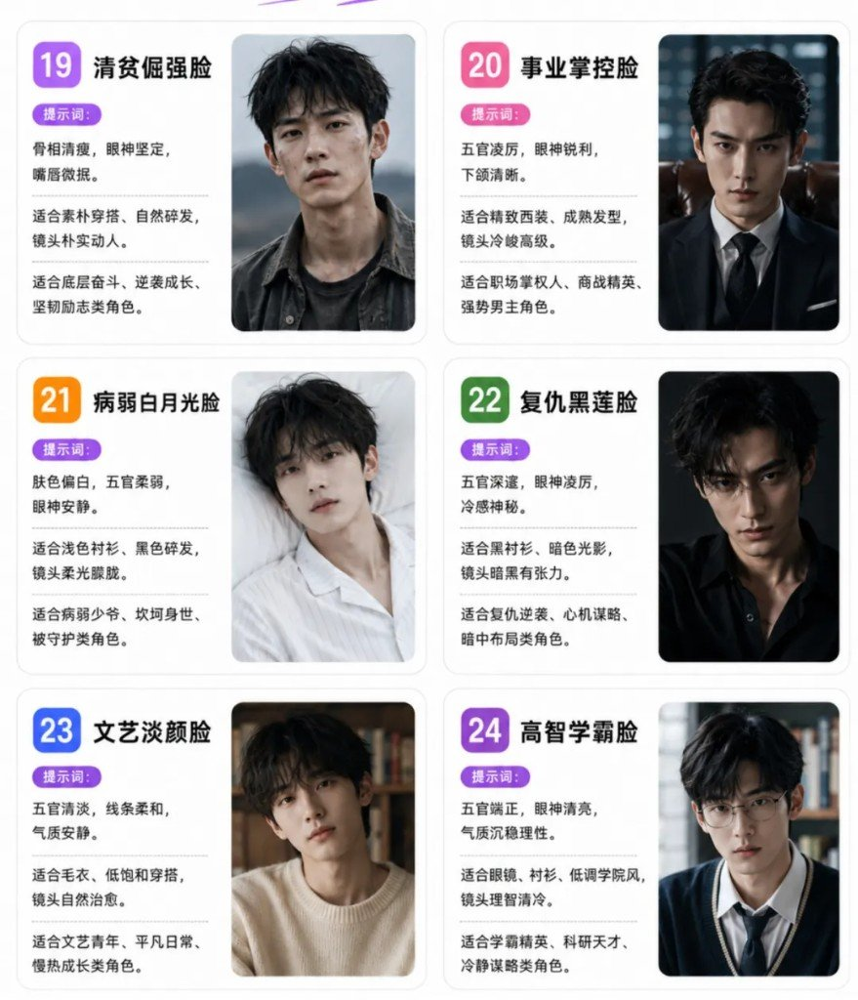
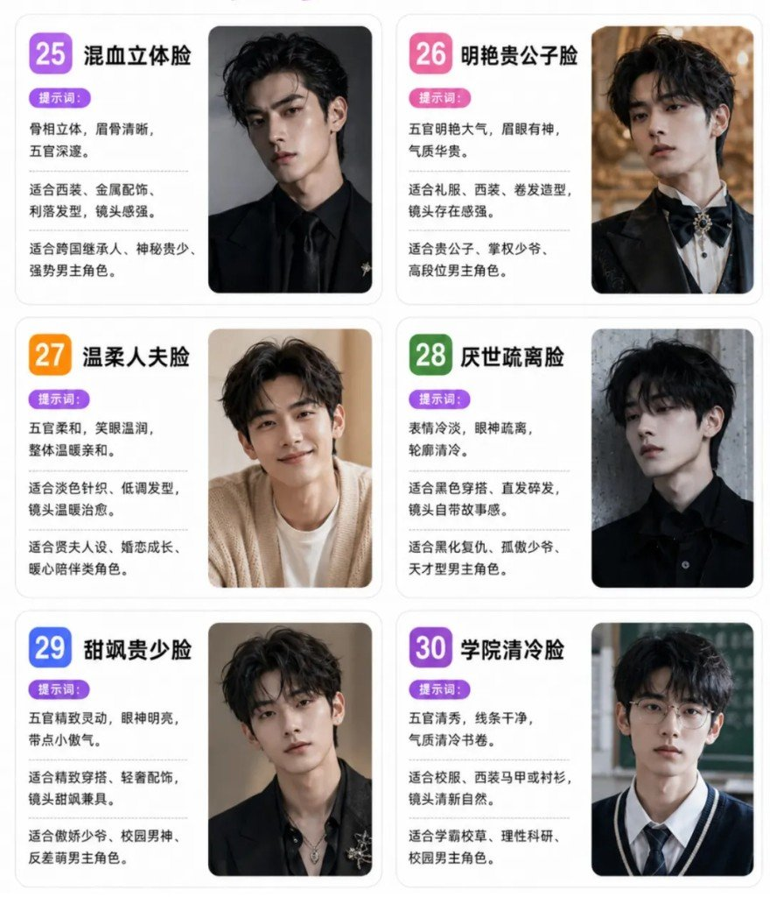
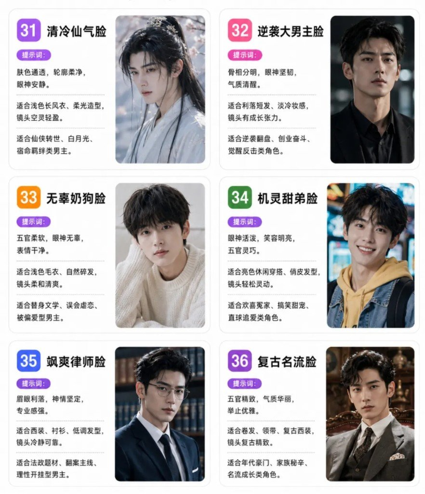
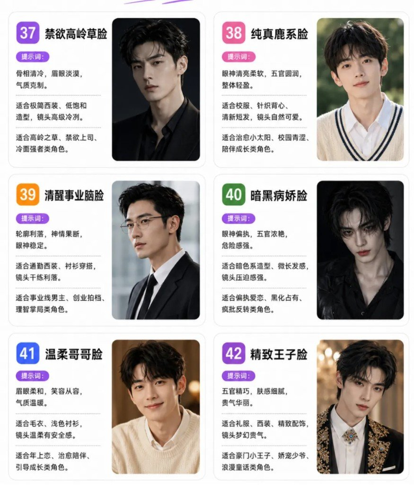

AI 出男主，最烦的不是「不够帅」，是**怎么生成都像同一个人**。根因多半不是模型抽风，是脸型风格跟人设没对上——冷峻复仇线却塞了元气犬系脸，画面再精致也像串戏。

用法很简单：**先定人设性格与身份，再挑脸型气质**，别先丢「帅哥」三个字碰运气。冷峻型、清爽型、清冷型、反派型、贵气型、破碎型、野痞型……方向对了，撞脸概率会低一截。

---

## 先定人设，再对脸

把角色拆成三件事再开生成：性格（冷 / 暖 / 邪 / 碎）、身份（学长 / 总裁 / 反派 / 将军）、题材场（校园 / 商战 / 仙侠 / 年代）。三件事定完，从表里挑气质最近的一款，把「提示词」当五官锚、「适合造型」当服装镜头锚。

同一部剧换装可以，**脸型气质锚别一场戏换三种**——观众认的是骨相情绪，不是衣服。

---

## 60 款速查（编号 · 风格名）

| 区段 | 风格 |
|---|---|
| 01–06 | 冷峻电影脸 · 清爽初恋脸 · 阳光少年脸 · 清冷校草脸 · 都市精英脸 · 轻熟总裁脸 |
| 07–12 | 白月光学长脸 · 港风浓颜脸 · 元气犬系脸 · 清冷骨相脸 · 豪门贵公子脸 · 反派野心脸 |
| 13–18 | 狐系钓系脸 · 邻家治愈脸 · 破碎感男主脸 · 禁欲撩人脸 · 猫系慵懒脸 · 温柔知性脸 |
| 19–24 | 清贫倔强脸 · 事业掌控脸 · 病弱白月光脸 · 复仇黑莲脸 · 文艺淡颜脸 · 高智学霸脸 |
| 25–30 | 混血立体脸 · 明艳贵公子脸 · 温柔人夫脸 · 厌世疏离脸 · 甜飒贵少脸 · 学院清冷脸 |
| 31–36 | 清冷仙气脸 · 逆袭大男主脸 · 无辜奶狗脸 · 机灵甜弟脸 · 飒爽律师脸 · 复古名流脸 |
| 37–42 | 禁欲高岭草脸 · 纯真鹿系脸 · 清醒事业脑脸 · 暗黑病娇脸 · 温柔哥哥脸 · 精致王子脸 |
| 43–48 | 落魄少爷脸 · 冷感模特脸 · 柔弱哭包脸 · 清醒复仇脸 · 古早白月光脸 · 飒气太子脸 |
| 49–54 | 书卷温柔脸 · 清冷科研脸 · 野痞荷尔蒙脸 · 斯文败类类型脸 · 少年将军脸 · 腹黑军师脸 |
| 55–60 | 异域锋锐脸 · 漫撕贵公子脸 · 忠犬守护脸 · 冷面法医脸 · 狼系狠戾脸 · 少年帝王脸 |

---

## 01–06

| # | 风格名 | 提示词 | 适合造型 | 适合角色 |
|---|---|---|---|---|
| 01 | 冷峻电影脸 | 骨相立体，眉眼冷峻，轮廓分明。 | 适合利落短发、深色西装，画面高级有张力。 | 适合复仇男主、商战精英、强势掌控型角色。 |
| 02 | 清爽初恋脸 | 五官柔和，笑容干净，眼神澄澈。 | 适合浅色针织、自然短发，镜头温暖治愈。 | 适合校园恋爱、青梅竹马、甜宠男主角色。 |
| 03 | 阳光少年脸 | 眼神明亮有活力，轮廓清爽，少年感足。 | 适合运动风、休闲穿搭，镜头轻快明朗。 | 适合热血成长、校园青春、元气系男主。 |
| 04 | 清冷校草脸 | 五官清秀，气质干净，眼神安静耐看。 | 适合校服、白衬衫、低饱和穿搭，镜头清爽。 | 适合学霸校草、暗恋纯爱、校园男主角色。 |
| 05 | 都市精英脸 | 五官端正，线条流畅，气质沉稳知性。 | 适合西装、低调配饰，镜头高级从容。 | 适合职场精英、创业伙伴、理性成熟型角色。 |
| 06 | 轻熟总裁脸 | 眉眼明艳，五官精致，气场成熟有压迫感。 | 适合深色西装、精致发型，镜头华丽高级。 | 适合豪门博弈、强强对峙、掌权系男主角色。 |

---

## 07–12

| # | 风格名 | 提示词 | 适合造型 | 适合角色 |
|---|---|---|---|---|
| 07 | 白月光学长脸 | 皮肤通透，五官柔和，笑眼温润。 | 适合白衬衫、长风衣、自然短发，镜头清新。 | 适合校园初恋、成长救赎、温柔学长类角色。 |
| 08 | 港风浓颜脸 | 五官立体，眉眼深邃，唇形清晰。 | 适合复古卷发、衬衫西装，画面自带港风感。 | 适合豪门争斗、商战权谋、成熟男主角色。 |
| 09 | 元气犬系脸 | 脸型柔和，眼神明亮，笑容爽朗。 | 适合卫衣、运动风造型，镜头轻松明快。 | 适合校园甜宠、日常轻喜、陪伴系男主角色。 |
| 10 | 清冷骨相脸 | 骨相清晰，五官冷峻，眼神疏离。 | 适合低饱和穿搭、利落短发，镜头克制冷静。 | 适合高智人设、白切黑、禁欲系强者角色。 |
| 11 | 豪门贵公子脸 | 五官精致，眉眼舒展，气质贵气从容。 | 适合礼服、西装、精致发型，镜头奢华大气。 | 适合豪门继承人、名流成长、家族博弈类角色。 |
| 12 | 反派野心脸 | 眼神凌厉，轮廓锋利，笑意克制。 | 适合深色西装、暗色氛围，镜头张力十足。 | 适合反派对决、权谋布局、黑化逆袭类角色。 |

---

## 13–18

| # | 风格名 | 提示词 | 适合造型 | 适合角色 |
|---|---|---|---|---|
| 13 | 狐系钓系脸 | 眼尾微挑，眼神勾人，清冷又带魅惑感。 | 适合浓颜、微卷发、深色穿搭，镜头氛围感强。 | 适合危险爱情、诱惑反派、掌控局面类角色。 |
| 14 | 邻家治愈脸 | 五官柔和，笑容温暖，亲和力强。 | 适合针织衫、自然短发，镜头自带生活感。 | 适合治愈救赎、温暖陪伴、日常男主角色。 |
| 15 | 破碎感男主脸 | 眼神空灵带倦意，脆弱感强，故事感明显。 | 适合清冷穿搭、碎发造型，镜头氛围感拉满。 | 适合虐恋情深、命运坎坷、救赎成长类角色。 |
| 16 | 禁欲撩人脸 | 五官精致，气质克制，眼神克制又带撩意。 | 适合衬衫、西装、微湿发感，镜头轻熟暧昧。 | 适合心动拉扯、禁忌关系、高冷类男主角色。 |
| 17 | 猫系慵懒脸 | 眼型细长，眼神慵懒，带点疏离感。 | 适合黑色穿搭、柔软卷发，镜头松弛感十足。 | 适合神秘顶流、慵懒大佬、掌控局面类角色。 |
| 18 | 温柔知性脸 | 眉眼柔和，气质温润，知性优雅从容。 | 适合衬衫、薄针织、低调配色，镜头自带高级感。 | 适合医生、律师、温柔成熟型男主角色。 |

---

## 19–24

| # | 风格名 | 提示词 | 适合造型 | 适合角色 |
|---|---|---|---|---|
| 19 | 清贫倔强脸 | 骨相清瘦，眼神坚定，嘴唇微抿。 | 适合素朴穿搭、自然碎发，镜头朴实动人。 | 适合底层奋斗、逆袭成长、坚韧励志类角色。 |
| 20 | 事业掌控脸 | 五官凌厉，眼神锐利，下颌清晰。 | 适合精致西装、成熟发型，镜头冷峻高级。 | 适合职场掌权人、商战精英、强势男主角色。 |
| 21 | 病弱白月光脸 | 肤色偏白，五官柔弱，眼神安静。 | 适合浅色衬衫、黑色碎发，镜头柔光朦胧。 | 适合病弱少爷、坎坷身世、被守护类角色。 |
| 22 | 复仇黑莲脸 | 五官深邃，眼神凌厉，冷感神秘。 | 适合黑衬衫、暗色光影，镜头暗黑有张力。 | 适合复仇逆袭、心机谋略、暗中布局类角色。 |
| 23 | 文艺淡颜脸 | 五官清淡，线条柔和，气质安静。 | 适合毛衣、低饱和穿搭，镜头自然治愈。 | 适合文艺青年、平凡日常、慢热成长类角色。 |
| 24 | 高智学霸脸 | 五官端正，眼神清亮，气质沉稳理性。 | 适合眼镜、衬衫、低调学院风，镜头理智清冷。 | 适合学霸精英、科研天才、冷静谋略类角色。 |

---

## 25–30

| # | 风格名 | 提示词 | 适合造型 | 适合角色 |
|---|---|---|---|---|
| 25 | 混血立体脸 | 骨相立体，眉骨清晰，五官深邃。 | 适合西装、金属配饰、利落发型，镜头感强。 | 适合跨国继承人、神秘贵少、强势男主角色。 |
| 26 | 明艳贵公子脸 | 五官明艳大气，眉眼有神，气质华贵。 | 适合礼服、西装、卷发造型，镜头存在感强。 | 适合贵公子、掌权少爷、高段位男主角色。 |
| 27 | 温柔人夫脸 | 五官柔和，笑眼温润，整体温暖亲和。 | 适合淡色针织、低调发型，镜头温暖治愈。 | 适合贤夫人设、婚恋成长、暖心陪伴类角色。 |
| 28 | 厌世疏离脸 | 表情冷淡，眼神疏离，轮廓清冷。 | 适合黑色穿搭、直发碎发，镜头自带故事感。 | 适合黑化复仇、孤傲少爷、天才型男主角色。 |
| 29 | 甜飒贵少脸 | 五官精致灵动，眼神明亮，带点小傲气。 | 适合精致穿搭、轻奢配饰，镜头甜飒兼具。 | 适合傲娇少爷、校园男神、反差萌男主角色。 |
| 30 | 学院清冷脸 | 五官清秀，线条干净，气质清冷书卷。 | 适合校服、西装马甲或衬衫，镜头清新自然。 | 适合学霸校草、理性科研、校园男主角色。 |

---

## 31–36

| # | 风格名 | 提示词 | 适合造型 | 适合角色 |
|---|---|---|---|---|
| 31 | 清冷仙气脸 | 肤色通透，轮廓柔净，眼神安静。 | 适合浅色长风衣、柔光造型，镜头空灵轻盈。 | 适合仙侠转世、白月光、宿命羁绊类男主。 |
| 32 | 逆袭大男主脸 | 骨相分明，眼神坚韧，气质清醒。 | 适合利落短发、淡冷妆感，镜头有成长张力。 | 适合逆袭翻盘、创业奋斗、觉醒反击类角色。 |
| 33 | 无辜奶狗脸 | 五官柔软，眼神无辜，表情干净。 | 适合浅色毛衣、自然碎发，镜头柔和清爽。 | 适合替身文学、误会虐恋、被偏爱型男主。 |
| 34 | 机灵甜弟脸 | 眼神活泼，笑容明亮，五官灵巧。 | 适合亮色休闲穿搭、俏皮发型，镜头轻松灵动。 | 适合欢喜冤家、搞笑甜宠、直球追爱类角色。 |
| 35 | 飒爽律师脸 | 眉眼利落，神情坚定，专业感强。 | 适合西装、衬衫、低调发型，镜头冷静可靠。 | 适合法政题材、翻案主线、理性开挂型男主。 |
| 36 | 复古名流脸 | 五官精致，气质华丽，举止优雅。 | 适合卷发、领带、复古西装，镜头复古精致。 | 适合年代豪门、家族秘辛、名流成长类角色。 |

---

## 37–42

| # | 风格名 | 提示词 | 适合造型 | 适合角色 |
|---|---|---|---|---|
| 37 | 禁欲高岭草脸 | 骨相清冷，眉眼淡漠，气质克制。 | 适合极简西装、低饱和造型，镜头高级冷冽。 | 适合高岭之草、禁欲上司、冷面强者类角色。 |
| 38 | 纯真鹿系脸 | 眼神清亮柔软，五官圆润，整体轻盈。 | 适合校服、针织背心、清新短发，镜头自然可爱。 | 适合治愈小太阳、校园青涩、陪伴成长类角色。 |
| 39 | 清醒事业脑脸 | 轮廓利落，神情果断，眼神稳定。 | 适合通勤西装、衬衫穿搭，镜头干练利落。 | 适合事业线男主、创业拍档、理智掌局类角色。 |
| 40 | 暗黑病娇脸 | 眼神偏执，五官浓艳，危险感强。 | 适合暗色系造型、微长发感，镜头压迫感强。 | 适合偏执爱恋、黑化占有、疯批反转类角色。 |
| 41 | 温柔哥哥脸 | 眉眼柔和，笑容从容，气质温暖。 | 适合毛衣、浅色衬衫，镜头温柔有安全感。 | 适合年上恋、治愈陪伴、引导成长类角色。 |
| 42 | 精致王子脸 | 五官精巧，肤感细腻，贵气华丽。 | 适合礼服、西装、精致配饰，镜头梦幻贵气。 | 适合豪门小王子、娇宠少爷、浪漫童话类角色。 |

---

## 43–48

| # | 风格名 | 提示词 | 适合造型 | 适合角色 |
|---|---|---|---|---|
| 43 | 落魄少爷脸 | 贵气尚在，神情倔强，眼底带故事感。 | 适合简约穿搭、淡冷妆感，镜头自带反差张力。 | 适合家道中落、逆袭归来、豪门复仇类角色。 |
| 44 | 冷感模特脸 | 面部留白感强，轮廓利落，气质高级。 | 适合极简黑白穿搭、利落发型，画面时尚冷感。 | 适合时尚圈、名利场、高冷气场类角色。 |
| 45 | 柔弱哭包脸 | 眼神湿润，表情委屈，脆弱感强。 | 适合淡色毛衣、碎发造型，镜头柔软有共情力。 | 适合追妻火葬场、误会虐恋、心碎成长类角色。 |
| 46 | 清醒复仇脸 | 眼神冷静，轮廓明晰，克制锋利。 | 适合利落短发、深色西装，镜头压迫感强。 | 适合重生复仇、手撕反派、高能反击类角色。 |
| 47 | 古早白月光脸 | 五官清俊，气质温柔，笑意很浅。 | 适合白衬衫、长外套、淡系造型，镜头怀旧干净。 | 适合旧爱重逢、青春遗憾、念念不忘类角色。 |
| 48 | 飒气太子脸 | 五官明艳，气场爽利，高贵又有攻击性。 | 适合西装或礼服造型，镜头又飒又贵。 | 适合豪门太子、商战继承人、强势反击类角色。 |

---

## 49–54

| # | 风格名 | 提示词 | 适合造型 | 适合角色 |
|---|---|---|---|---|
| 49 | 书卷温柔脸 | 五官舒展，眼神平和，书卷气浓。 | 适合眼镜、浅色穿搭、自然短发，镜头温柔自然。 | 适合老师、医生、学术型、温暖陪伴类角色。 |
| 50 | 清冷科研脸 | 轮廓清爽，神情克制，眼神理性。 | 适合衬衫、西装、简约妆感，镜头理智高级。 | 适合科研天才、理工男主、高智破局类角色。 |
| 51 | 野痞荷尔蒙脸 | 眉骨硬朗，痞气外放，男性张力强。 | 适合皮衣、工装、寸头或短碎发，镜头粗粝有冲击力。 | 适合街头逆袭、热血动作、狠系男主角色。 |
| 52 | 斯文败类类型脸 | 五官精致，笑意克制，危险又优雅。 | 适合金丝眼镜、衬衫马甲、低饱和配色，镜头暗藏压迫感。 | 适合腹黑反派、双面精英、心机布局类角色。 |
| 53 | 少年将军脸 | 眉眼英挺，轮廓利落，少年英气十足。 | 适合束发、深色制服或古风轻甲，镜头飒爽干净。 | 适合热血守护、家国成长、少年英雄类角色。 |
| 54 | 腹黑军师脸 | 眼神深沉，气质克制，心思缜密。 | 适合长衫、西装或极简穿搭，镜头沉稳有谋略感。 | 适合智斗权谋、幕后布局、军师型男主角色。 |

---

## 55–60

| # | 风格名 | 提示词 | 适合造型 | 适合角色 |
|---|---|---|---|---|
| 55 | 异域锋锐脸 | 轮廓深邃，眉眼锋利，辨识度极高。 | 适合卷发、耳饰、深色穿搭，镜头神秘张扬。 | 适合异域贵族、危险情人、强设定男主角色。 |
| 56 | 漫撕贵公子脸 | 五官完美，肤感细腻，贵气精致。 | 适合礼服、丝绒西装、胸针配饰，镜头华丽梦幻。 | 适合财阀少爷、宴会中心、偶像级男主角色。 |
| 57 | 忠犬守护脸 | 眼神真诚，气质可靠，亲近感强。 | 适合夹克、毛衣、自然短发，镜头温暖踏实。 | 适合守护骑士、陪伴成长、治愈系男主角色。 |
| 58 | 冷面法医脸 | 轮廓冷静，目光专注，理性感很强。 | 适合白衬衫、黑西装、短发造型，镜头干净克制。 | 适合法医悬疑、破案主线、专业型男主角色。 |
| 59 | 狼系狠戾脸 | 眉眼锋锐，攻击性强，气场凌厉。 | 适合黑色皮衣、寸发或背头，镜头凶悍有冲击力。 | 适合黑帮对决、复仇行动、狠厉男主角色。 |
| 60 | 少年帝王脸 | 骨相尊贵，神情沉稳，少年王者感强。 | 适合华服、深色礼服、利落发型，镜头贵气压场。 | 适合权力继承、帝王成长、天选男主角色。 |

---

## 怎么用，别整成词库堆砌

1. **人设三件套先写死**：性格 + 身份 + 题材场，再从表里挑气质最近的一款。
2. **提示词管五官情绪，造型栏管镜头服装**：两栏一起丢进生成，比单抄风格名稳。
3. **一部剧锁 1～2 个脸型锚**：正剧主线一款，黑化/回忆可再开一款；别六款混同一角色骨相。
4. **气质撞车时看编号邻居**：清冷系（04/10/28/37）、贵气系（11/26/42/56）、破碎系（15/21/45）各自成簇，比硬背 60 个名字快。

想压住镜头节奏，可看 [运镜提示词](/posts/ai-comic-camera-moves-prompts/)；女装造型见 [古风六风格](/posts/ancient-women-costume-six-styles/)。本篇只解决「这张脸该长什么样」。