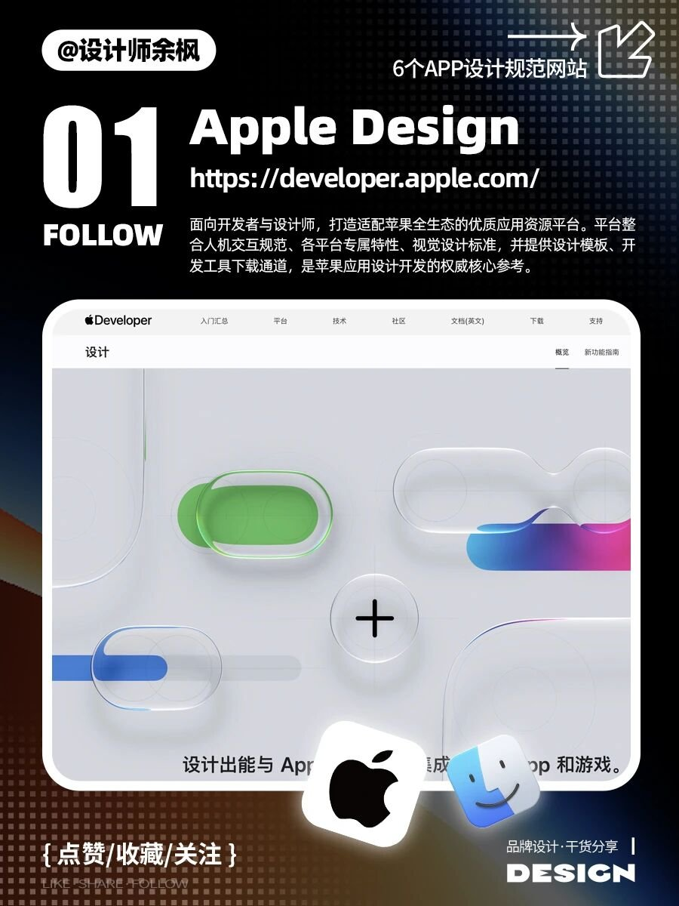
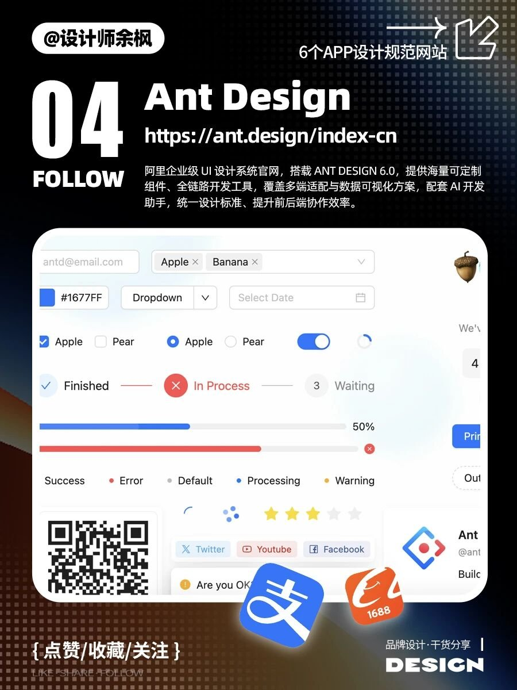

别一上来从零画按钮、从零定色板。苹果系、Android 系、微软桌面、国内三大 B 端——各有一套官网把 HIG / 组件 / 开发文档捆在一起。余枫这组资源卡把六站压成一张表，够收藏、不够当教程。

## 六站速查

| # | 系统 | URL | 带走什么 |
|---|---|---|---|
| 01 | Apple Design | https://developer.apple.com/ | 全生态 HIG、平台特性、视觉标准、模板/工具 |
| 02 | Material Design | https://m3.material.io/ | 材质光影、色字动效组件、响应式多端（M3） |
| 03 | Fluent Design | https://fluent2.microsoft.design/ | Fluent 2、多端组件、Figma kits、无障碍、微软生态一致 |
| 04 | Ant Design | https://ant.design/index-cn | 阿里企业级、6.0、海量组件、多端+数据可视化、AI 助手 |
| 05 | TDesign | https://tdesign.tencent.com/ | 腾讯开源；Vue/React/小程序；PC+移动；图提 Uniapp / MCP online |
| 06 | Semi Design | https://semi.design/zh-CN | 字节抖音团队；Figma+React；设计转代码；主题/多语言/无障碍 |

## 怎么选，别全开六标签

| 你在做 | 优先翻 |
|---|---|
| iOS / macOS / 苹果生态感 | Apple |
| Android / Material You 气质 | Material（m3） |
| Windows / 微软系桌面 | Fluent 2 |
| 国内中后台、表格表单堆料 | Ant Design |
| 腾讯系技术栈（含小程序 / Uniapp 线索） | TDesign |
| 要 Figma↔React、设计转代码更紧 | Semi |

规范站解决「标准与组件从哪抄」；审美旋钮、风格 Prompt、海报刀法是另一条线。同桶旅行 App 信息架构案例见 [旅行 App：先砍首页再谈好看](/posts/travel-app-ui-cases-02/)（草稿箱同批）；ui-styles / design-beautify / 创意海报品味另夹旁链，别跟本表并成一篇。
