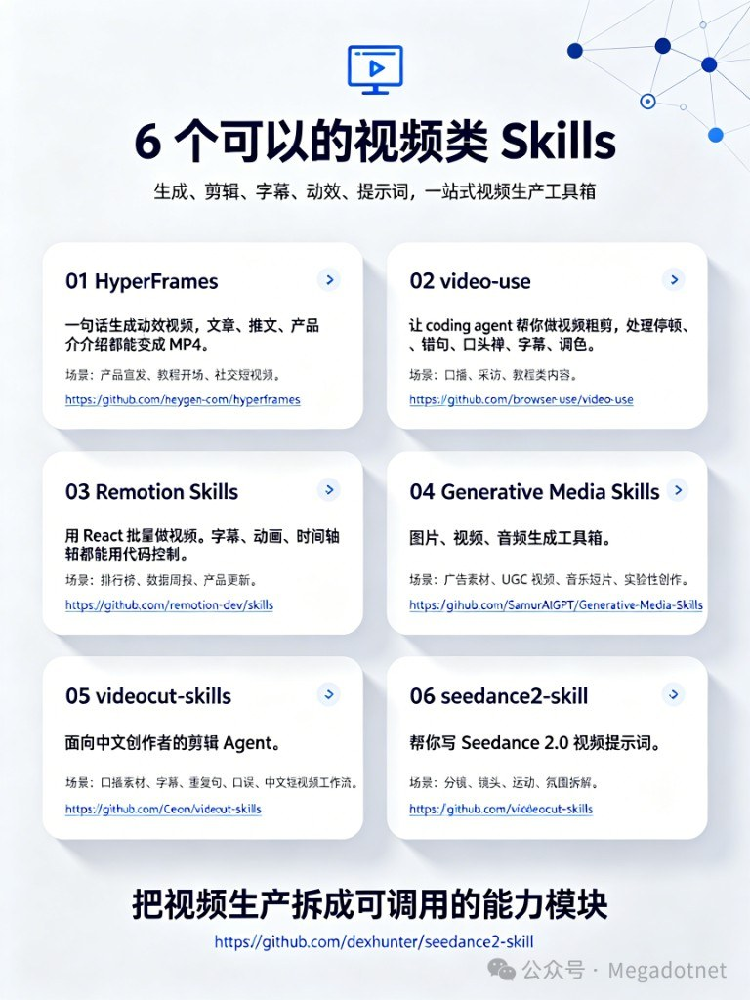

生成、粗剪、代码排版、多模态生媒、中文口播剪辑、Seedance 提示词——别指望一个 Skill 包打天下。Megadotnet 这张清单把链路拆开；信息图里 seedance 卡片曾误贴 videocut 仓库，以正文链接为准（作者已认）。



用法通识：装进 Agent Skills 目录后，由工具显式或隐式调用（作者留言口径）。下面对照 GitHub 现状（2026-08-11 抽查）做一张选型表。

## 六件对照，对上你卡的那段

| # | Skill | 仓库 | 干嘛的 | 更适合 | 抽查备注 |
|---|---|---|---|---|---|
| 1 | HyperFrames | [heygen-com/hyperframes](https://github.com/heygen-com/hyperframes) | HTML/CSS/动画 → 确定性 MP4 | 宣发、教程开场、社交短片 | Apache-2.0；面向 agent 渲染 |
| 2 | video-use | [browser-use/video-use](https://github.com/browser-use/video-use) | coding agent 粗剪 | 口播/采访/教程先过一遍 | MIT；去填充词、调色、烧字幕 |
| 3 | Remotion Skills | [remotion-dev/skills](https://github.com/remotion-dev/skills) | React 代码控字幕/动画/时间轴 | 排行榜、周报、产品更新栏目 | `npx skills add remotion-dev/skills` |
| 4 | Generative Media Skills | [SamurAIGPT/Generative-Media-Skills](https://github.com/SamurAIGPT/Generative-Media-Skills) | 图/视频/音频生成工具箱 | 广告、UGC、音乐短片、实验 | MIT；依赖 muapi 等生媒后端 |
| 5 | videocut-skills | [Ceeon/videocut-skills](https://github.com/Ceeon/videocut-skills) | 中文口播剪辑 Agent | 重复句、口误、术语字幕 | 对比剪映：偏语义理解 + 词典 |
| 6 | seedance2-skill | [dexhunter/seedance2-skill](https://github.com/dexhunter/seedance2-skill) | 写 Seedance 2.0 视频提示词 | 分镜/镜头/运动/氛围拆解 | MIT；英文+中文 Skill 文件 |

作者点名 Remotion「貌似目前最好用」——更准确的说法是：**固定版式、要批量、能接受代码管时间轴**时它强；口播去废话优先 video-use / videocut；纯文生视频提示词走 seedance2；要从 HTML 直接渲片走 HyperFrames。

## 能力落点，别混成一条河

```text
想法 / 文案
  → seedance2（拆镜头提示词）或 Generative Media（直生媒）
成片素材（口播原片）
  → video-use / videocut-skills（粗剪）
栏目化、可复现版式
  → Remotion Skills（React 批产）
文章/推文 → 动效 MP4
  → HyperFrames
```

## 和本机栈怎么并排放

仓内 / 本机已有 `video-use`、`firefly-minimax-media`、[story-to-handdrawn-video](/posts/story-to-handdrawn-video/) 等——这张清单是**外部选型地图**，不是替代安装说明。真要上某仓库，仍以其 README 的 skills 安装命令与密钥要求为准；Generative Media 类还要单独看付费后端。

白板手绘整条生产线（分镜·旁白·对角扫描渲染）另见 [create-whiteboard-video](/posts/create-whiteboard-video/)。

## 别踩这些坑

- 信息图右下角卡片链接曾写错：seedance ≠ videocut。
- 「最好用」取决于任务：口播剪辑和数据周报不是同一条管线。
- 装了 Skill ≠ 免费无限生视频；生图/生片额度、ffmpeg、Remotion 工程环境都要自己备齐。
