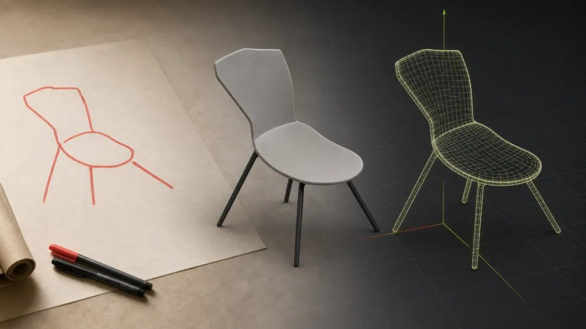
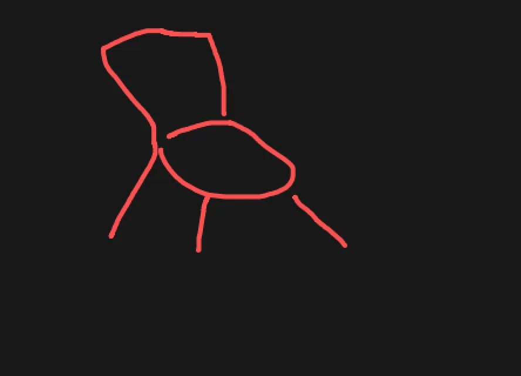
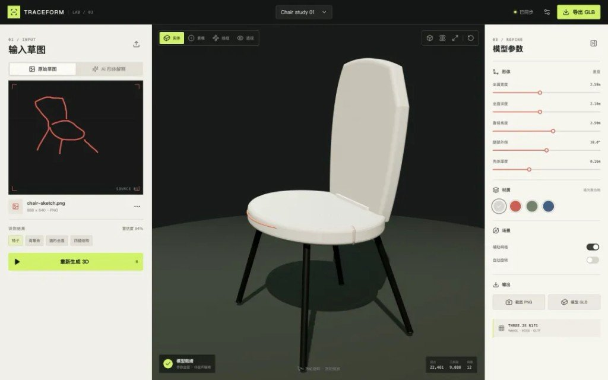
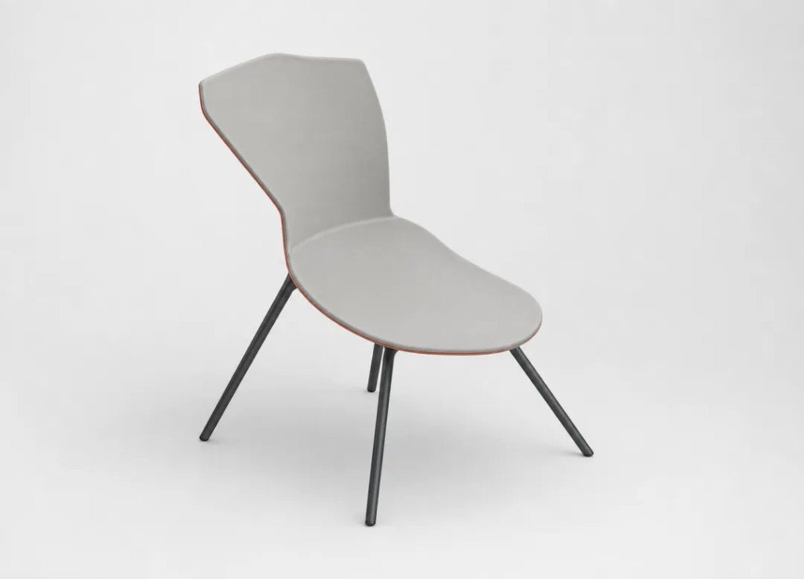
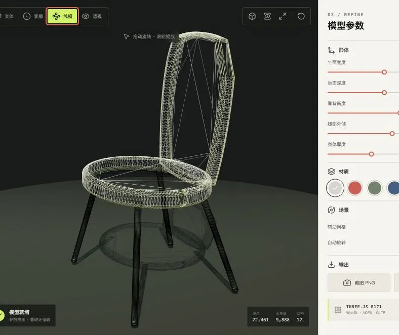
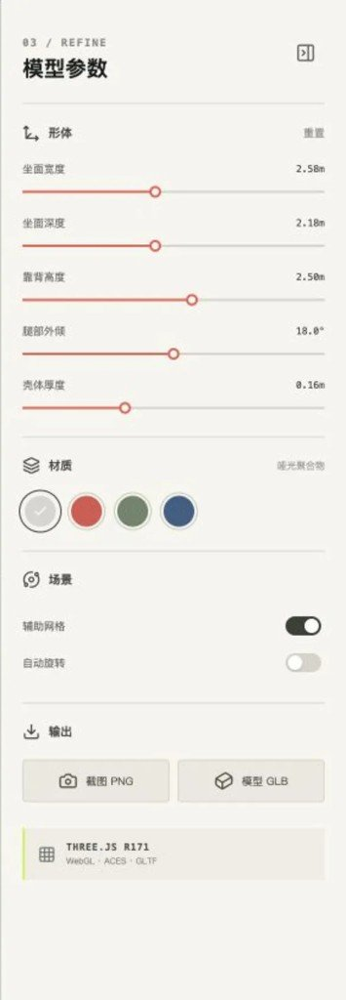
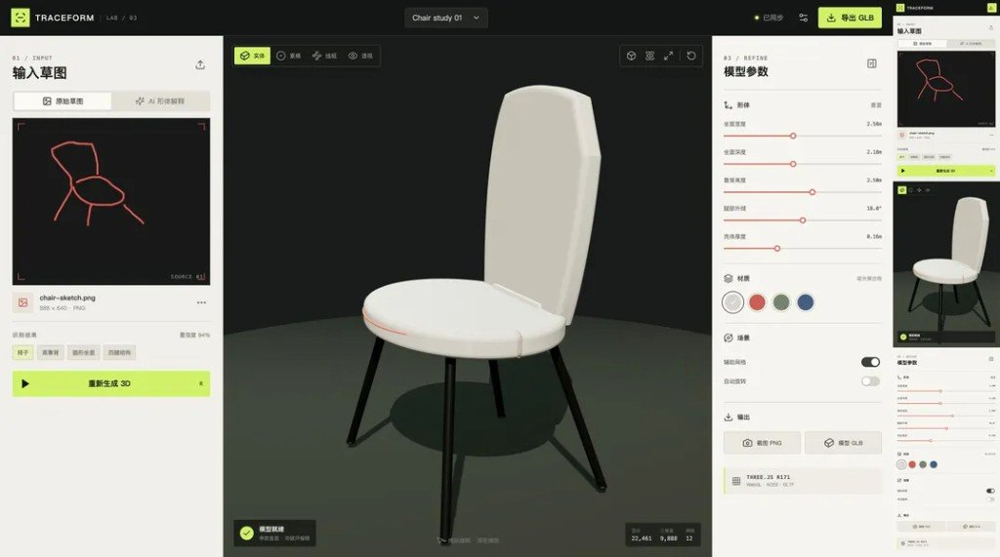

单视角椅子草图出发的完整实践：先把模糊形体解释清楚，再把设计假设写成可编辑、可验证、可导出的三维原型。

链路是：**草图输入 → GPT-Image-2 形体解释 → Three.js 参数化建模 → 浏览器交互与 GLB 导出**。目标不是「一键还原真实物体」，而是把有限证据变成可讨论、可旋转、可继续争论的设计对象。

旁链（**不硬并**）：开源产线 [img2threejs](../2026-08-10_img2threejs一张图变Threejs模型/扔一张参考图，吐出来的是可动画的Three.js工厂.md) 出的是规格 + TS 工厂；本篇钉的是 **Codex 编排闭环 + TRACEFORM 参数化工作台**。同模型出图向见文末 GPT Image2 海报 / 玩法盘点。

---

## 01｜草图不是模型，但它是有效的设计约束

一张黑底红线的草图没有深度、背面拓扑和精确尺寸，却已经提供了最重要的设计证据：对象类别、主轮廓、部件数量、连接关系和大致视角。这次实践的目标不是承诺「一键还原真实物体」，而是把有限证据转化成一套可讨论的设计假设；最终链路是草图输入、GPT-Image-2 形体解释、Three.js 参数化建模、浏览器交互与 GLB 导出。它把「灵感」变成了可旋转、可修改、可交付、也可以继续争论的设计对象。



---

## 02｜先读证据，再做推断

面对原始草图，Codex 先只记录看得见的事实：这是高靠背椅子，坐面接近椭圆，四条腿向外张开，靠背与坐面通过较窄的区域连接；而座深、壳体厚度、腿部落点和背面结构都属于未知量。随后把未知量收敛为有边界的参数，例如 `seatWidth`、`seatDepth`、`backHeight`、`legAngle` 与 `shellThickness`。这个步骤很关键，因为单视角重建没有唯一答案，诚实的做法不是隐藏不确定性，而是把不确定性变成用户可以调节的旋钮。



---

## 03｜Codex 是编排器，而不是单一的生成按钮

在整个流程中，Codex 负责把视觉理解、提示词设计、前端工程和运行验证串成闭环：检查草图与仓库，调用 GPT-Image-2 生成形体参照，依据参照选择 Three.js 几何策略，启动 Vite 应用，再通过真实浏览器检查构图、交互、响应式布局和导出链接。这里最有价值的不是「写了多少代码」，而是每一步都有可观察的输入和输出，发现偏差后可以回到上一层修正，不必把错误一直带到最终模型。



---

## 04｜GPT-Image-2 负责消解视觉歧义，不负责生成网格

GPT-Image-2 接收原草图作为几何与轮廓参考，提示词要求保留椅子类别、高靠背、圆润坐面、四腿外撇和原始视角，同时禁止增加扶手、装饰和额外部件。输出是一张边界清晰的产品级形体解释图，它帮助我们判断曲面、比例与材质方向，但它仍然是二维图像，不是可旋转的 mesh，更不能被伪装成生产级 CAD；实际三维几何必须在下一步由 Three.js 或专业重建后端生成。



---

## 05｜Three.js 把假设变成确定性的几何

实际模型由命名的 `THREE.Group` 组织：坐面和靠背用 `THREE.Shape` 加 `ExtrudeGeometry` 构造，曲线由贝塞尔控制点描述，四条椅腿则用端点之间对齐的 `CylinderGeometry` 生成；材质统一使用可导出的 `MeshStandardMaterial`。因此相同参数永远得到相同网格，实体、素模、线框和透视模式只是观察方式的变化，而不是四套互不一致的模型。相比把生成图贴在平面上，这种实现才能承受真正的环绕观察和后续编辑。



---

## 06｜参数化让「渲染结果」升级为「设计工具」

一个好看的静态渲染只能回答「它现在是什么样」，参数化工作台还可以回答「如果更宽、更深、更薄会怎样」。界面把座宽、座深、靠背高度、腿部角度与壳体厚度直接连接到几何重建，同时提供材质色板、网格开关、自动旋转和多种观察模式；参数改变后旧几何会被移除并释放资源，新的 GLB Blob 链接也会重新生成。设计评审因此从交换截图，变成围绕同一可执行模型调整变量。



---

## 07｜「能运行」之后，还要验证它真的可用

三维界面最常见的问题并不只在代码：相机可能裁掉模型，Canvas 可能尺寸正常但实际空白，控制面板可能在移动端溢出，异步下载也可能丢失用户激活。本次验证覆盖 **1440 × 900** 桌面与 **390 × 844** 移动视口，检查 Canvas 的非空像素、完整构图和水平溢出，并实际操作形体参数、材质、线框模式、重建进度及原图/AI 参照切换；PNG 截图使用 `preserveDrawingBuffer`，GLB 则预先生成原生 Blob URL，避免「按钮存在但文件下不下来」。



---

## 08｜把一次实践封装成可复用的 Skill

这套方法已经封装为 `$build-sketch-to-3d`：它约束 Codex 先判断任务属于品类原型、固定展示还是生产级图生网格，再按「证据提取、ImageGen 解释、Three.js 建模、工作台实现、PNG/GLB 导出、桌面与移动端验证」的顺序执行。Skill 的价值不是复制这把椅子，而是保存经过验证的判断顺序、能力边界和交付标准；下次给出灯具、家具或产品概念草图时，可以从同一条可靠流程开始。[^skill-repo]


---

## 实现骨架

```js
const initialShape = {
  seatWidth: 2.58,
  seatDepth: 2.18,
  backHeight: 2.5,
  legAngle: 18,
  shellThickness: 0.16,
};
const group = new THREE.Group();
group.name = 'Traceform_Chair';

const seatGeometry = new THREE.ExtrudeGeometry(seatShape, {
  depth: shape.shellThickness,
  bevelEnabled: true,
  bevelSegments: 4,
  curveSegments: 72,
});
const exporter = new GLTFExporter();
exporter.parse(
  chair,
  (result) => {
    const url = URL.createObjectURL(
      new Blob([result], { type: 'model/gltf-binary' }),
    );
    onExportReady(url);
  },
  console.error,
  { binary: true, onlyVisible: true },
);
```

---

## 评论区里两句有用的

| 谁 | 说啥 | 带走 |
|---|---|---|
| Sunny、 | `$build-sketch-to-3d` 在哪呢？最近刚好需要这个 | Skill 名公开了，**仓库位置原文没给** |
| 泡泡糖 | 核心还在是 image2 吧 | 作者回：图像是 GPT-image2，锁保持一致性 |

「能做室内 3D 机器人第三人称走动吗」那条闲聊不展开——Three.js 能干游戏，和本篇草图→参数化原型不是同一题。

---

## 旁链（互见，别硬并）

| 旁链 | 它管啥 | 别并进这篇的原因 |
|---|---|---|
| [扔一张参考图，吐出来的是可动画的 Three.js 工厂](../2026-08-10_img2threejs一张图变Threejs模型/扔一张参考图，吐出来的是可动画的Three.js工厂.md) | 开源 img2threejs：图 → 规格 + TS 工厂 | 仓库 README 深挖 ≠ Codex 编排实践 / TRACEFORM 工作台 |
| [一眼很猛：GPT Image2 七种高张力海报](../2026-08-10_GPT-Image2高张力海报7风格/一眼很猛：GPT-Image2七种高张力海报提示词.md) | 同模型海报冲击 | 出图玩法 ≠ 形体消歧义再进几何 |
| [GPT Image2 案例 55–75](../2026-08-10_GPT-Image2玩法盘点_55-75/GPT-Image2案例55到75：抄完这批玩法就够用一阵.md) | 同模型提示词合集 | 配方库 ≠ 本篇闭环编排 |
| [滚动就是运镜：sen-3d-resume](../2026-08-10_sen-3d-resume_3D网页简历/滚动就是运镜：sen-3d-resume把简历长在3D场景里.md) | 可交互 3D 简历壳 | 简历产品形态 ≠ 草图参数化原型 |

本篇只归档 **TRACEFORM / `$build-sketch-to-3d`**：草图约束 → Image2 消歧义 → 确定性 Three.js → 参数旋钮 → 双端验证。要发帖再走 `knowledge-output`；此处不 commit、不 push。

[^skill-repo]: 文中提及 Skill 名 `$build-sketch-to-3d`，仓库位置未在原文给出——勿编造 GitHub URL。
