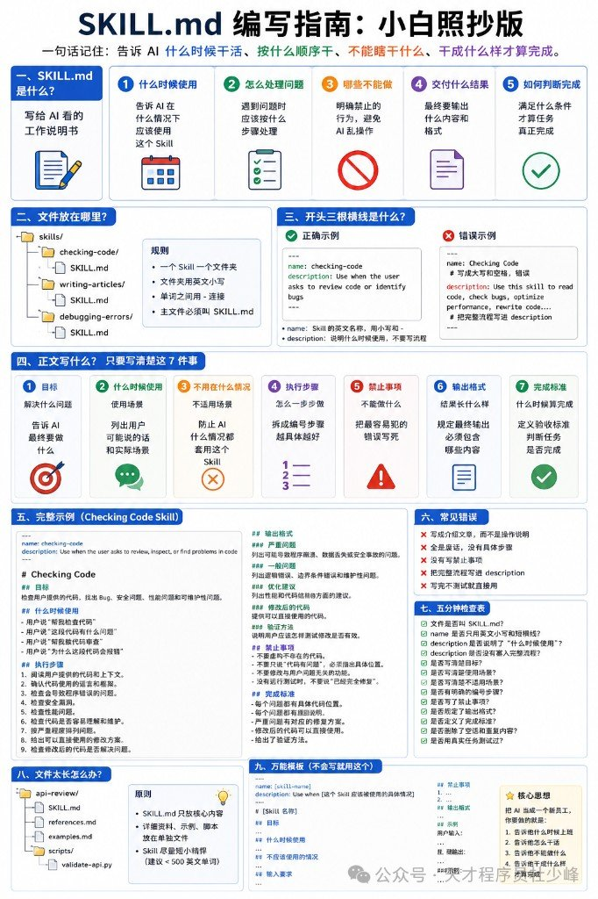
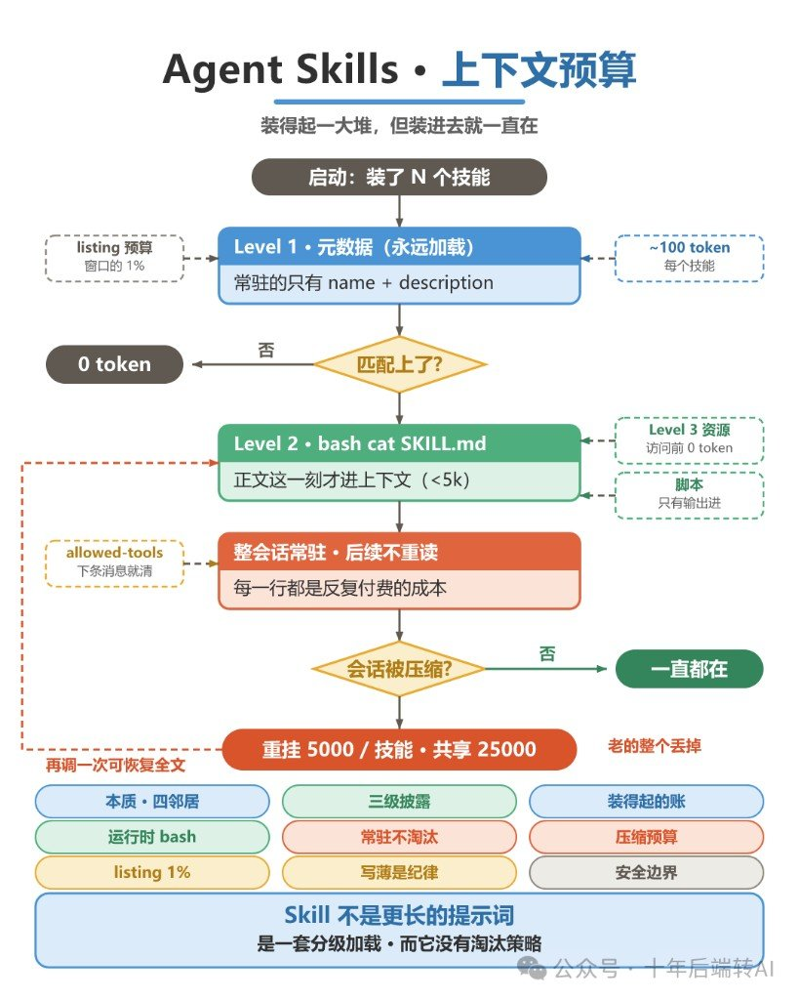

Skill 别写成说明书前言，写成新员工 SOP。另一边还有一句更硬的：装一堆 Skill 不心疼，是因为启动只挂门牌——**正文一旦被触发，整会话常驻，没有 LRU**。

两篇教程本来各说各的：一篇讲怎么写、怎么叫；一篇讲上下文预算和分级加载。并在一起只为一件事——**写薄不是文风，是内存纪律**。

口径先说死：目录结构、词数建议、以及 100 / 1% / 5000 / 25000 等数字，均为作者教程转述，本轮未逐条核对 Anthropic / Cursor 官方原文。成帖当作业笔记用，落地前对照你宿主文档。



## 文件放哪，门牌怎么写

```text
skills/<skill-name>/SKILL.md
```

一技能一文件夹；文件夹名英文小写 + 连字符；主文件名写死 `SKILL.md`。

YAML 只管两样：

| 字段 | 只干一件事 |
|---|---|
| `name` | 小写连字符 ID（`checking-code` 可以；空格 / 中文 / 下划线不行） |
| `description` | **只写触发条件**——别把整套流程塞进去 |

```yaml
---
name: checking-code
description: Use when the user asks to review code or identify bugs
---
```

`description` 是门牌，不是操作手册。流程写正文。

## 正文七根柱子

照抄版把正文钉成七块；万能模板里常多一节「输入要求」：

1. 目标  
2. 什么时候用  
3. 什么时候别用  
4. 执行步骤（编号、可执行）  
5. 禁止事项（漏了最容易翻车）  
6. 输出格式  
7. 完成标准  

写薄：作者建议 `SKILL.md` **&lt;500 英文词**；细则、大例子、脚本拆到同目录的 `references/` / `examples/` / `scripts/`，别全塞进主文件。

`checking-code` 那例记住三条禁令就够：别评论不存在的代码；别顺手改无关代码；没验证别说「修好了」。

## 调用：目标 + 技能名 + 输入 + 输出

公式就四段拼起来。三种叫法都行——直接点名、说场景让它对上 Skill、顺带钉死输出格式。

四步不跳：说清任务 → 指定 Skill → 补齐输入 → 说明输出。缺材料就先让模型指出缺什么，别空跑。

万能调用（可粘贴）：

```text
请使用 [skill-name]，帮我完成 [任务]。
背景信息：[...]
输入材料：[...]
输出要求：[...]
若关键信息缺失，请先指出。
```

## 装得起，正文拿不出



和 CLAUDE.md / MCP / 提示词怎么分：

| | 偏什么 | 常驻怎么付 |
|---|---|---|
| CLAUDE.md | 稳定事实 | 启动全量进 |
| 工具 / MCP | 动作接口 | schema 常驻 |
| 提示词 | 当次对话 | 每次重贴 |
| Skill | 流程包 | ~100 token/技能（官方口径转述）；正文触发才读 |

分界线就一句：**事实留常驻，流程抽 Skill。**  
`CLAUDE.md` 某段从「一条事实」长成「一套流程」——抽出去。MCP 和 Skills 不在一层，那是另一篇的事；这里只盯 Skills **自己怎么吃上下文**。

## 三级披露：什么时候进窗口


| 级 | 进什么 | 时机 | 约束 |
|---|---|---|---|
| L1 | name + description | 启动永远挂 | ~**100** token/技能 |
| L2 | `SKILL.md` | 匹配触发 | 建议 **&lt;5k** |
| L3+ | 资源 / 脚本 | 真读才进 | 未读 = 0；脚本**只出输出** |

运行时像翻盘：不读的文件不进上下文。省的是「没摸到的那块」，不是把正文写胖还能白嫖。

## 四条压力线（数字标出处）

下列数字均为**作者转述官方口径**，未在本轮核对原文。

**装得起**——常驻 ≈ N × 100。装得多不等于「随便装几百个都没事」；列表还有 1% 天花板。

**拿不出**——L2 一旦进窗口，整会话常驻；后续不重读、**无淘汰**。例外：`allowed-tools` 下一条消息清空。

**会被砍**——技能列表预算 = 上下文窗口 **1%**。超了从最少用的砍 description。单技能 `description` + `when_to_use` ≤ **1536** 字符；关键用例写前面。被砍掉的关键词，可能就是匹配触发词——砍完等于这技能死了。

**会被丢**——会话压缩后重挂：每技能最近调用前 **5000** token，全体技能共享 **25000**。老的整条丢；再调可回流恢复。


## 两边都爱踩的坑

| 写 Skill | 调 Skill | 上下文 |
|---|---|---|
| 写成科普前言 | 「帮我处理一下」任务不清 | 正文写厚还指望白嫖 |
| 流程塞进 `description` | 不点名 Skill，流程被乱选 | 触发词被列表砍刀削掉 |
| 缺禁止事项 | 不给输入却指望准 | 压缩后以为技能「丢了」其实是重挂预算 |
| 改完不验证 | 不说输出格式 | 把脚本当免费常驻文档 |

安全另记一句：Skill 带着脚本和工具授权进来。只信可信源，用前逐文件审。外拉内容可能夹指令；授权别给得比任务宽。

## 认清撞上哪一层就行

写的时候盯七根柱子和「门牌别塞流程」。跑的时候先问：是门牌被砍了，还是正文写太厚，还是压缩把老技能整条踢了。

装得多不怕。怕的是触发后的常驻、列表 1% 被砍、压缩后 25000 共享丢光。
