大家好，我是程序员Dan。过了很久没有更新，后台也收到了不少同学的私信，希望我继续更新八股系列。今天要总结的，是计算机专业学生在校招中最常接触、甚至可能是第一个接触到的练手项目——**苍穹外卖**。

苍穹外卖对于 Java 初学者来说非常合适。它是一个基于 Spring Boot 架构的实战项目，业务模型也是非常经典的外卖系统。基于这个项目，还可以改造成很多不同的项目，包装到自己的简历中。

这篇内容汇总了苍穹外卖项目中可能被问到的问题，也包括我当时把苍穹外卖作为简历项目时，在面试中实际碰到的一些问题。

## 一、苍穹外卖项目概述
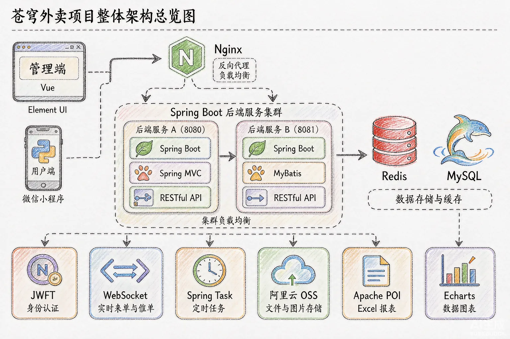

## 1. 管理端与用户端
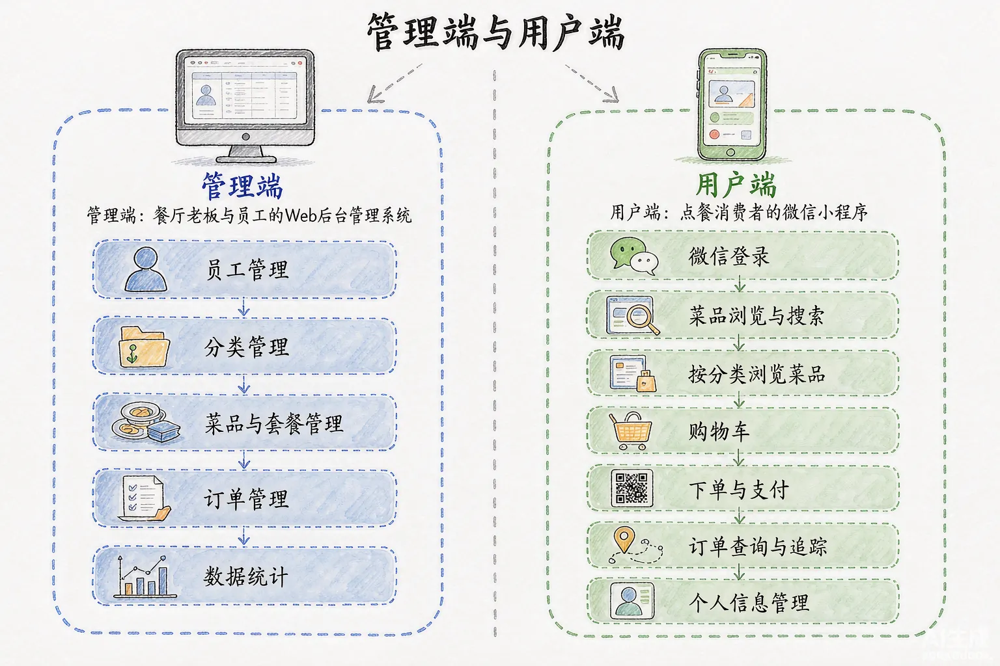

整个项目有两个核心端：

- **管理端**：面向餐厅老板和员工的 Web 后台管理系统。
- **用户端**：面向点餐消费者的微信小程序。

管理端主要包括以下功能：

1. **员工管理**：员工账号登录、退出和信息维护等。
2. **分类管理**：维护菜品和套餐的分类。
3. **菜品与套餐管理**：管理菜单、菜品及套餐信息。
4. **订单管理**：查看和处理用户订单。
5. **数据统计**：统计餐厅营业额、用户数量和订单量等数据。

用户端的首要功能是**微信登录**。用户通过微信授权即可一键登录，不需要额外注册账号。其他功能与常见的外卖程序基本一致，包括：

- 菜品浏览与搜索；
- 按照分类浏览菜品；
- 将菜品或套餐加入购物车；
- 下单与支付；
- 订单查询与追踪；
- 个人信息管理。

面试时，可以先从这两个端及其实现的功能入手，介绍整个项目。

## 2. 项目技术栈
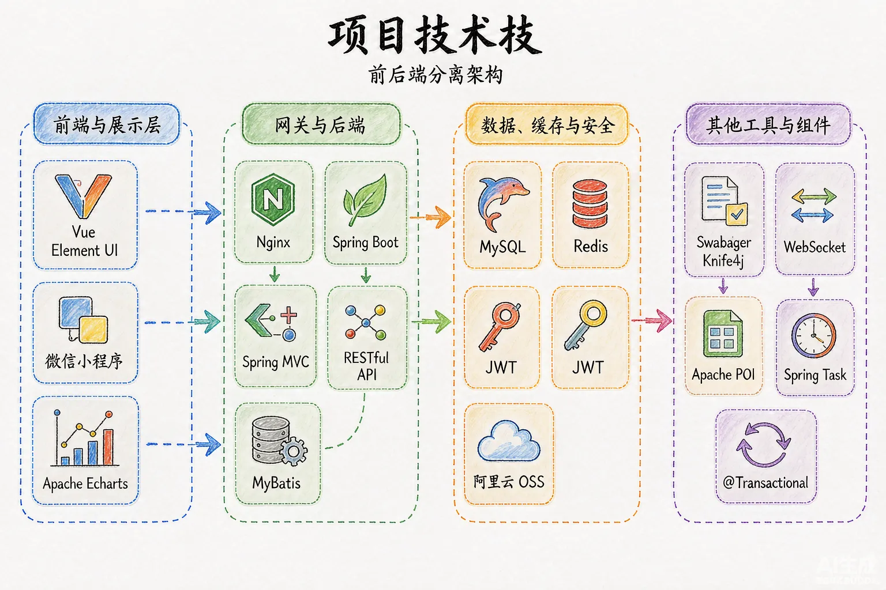

苍穹外卖最大的亮点，是技术覆盖比较全面，并且采用了**前后端分离架构**，基本涵盖了当前主流的 Java 开发技术。

### 前端与展示层

- 管理后台：**Vue + Element UI**
- 用户端：**微信小程序**
- 数据图表：**Apache ECharts**

### 网关与后端

- 反向代理与负载均衡：**Nginx**
- 核心框架：**Spring Boot**
- Web 层：**Spring MVC**
- 接口风格：**RESTful API**
- 持久层框架：**MyBatis**

### 数据、缓存与安全

- 核心业务数据：**MySQL**
- 缓存：**Redis**
- 用户认证：**JWT**
- 文件及图片存储：**阿里云 OSS**

### 其他工具与组件

- 接口文档：**Swagger、Knife4j**
- 实时来单与催单提醒：**WebSocket**
- Excel 报表处理：**Apache POI**
- 定时任务：**Spring Task**
- 事务管理：**`@Transactional`**

## 3. 项目上线与业务难点
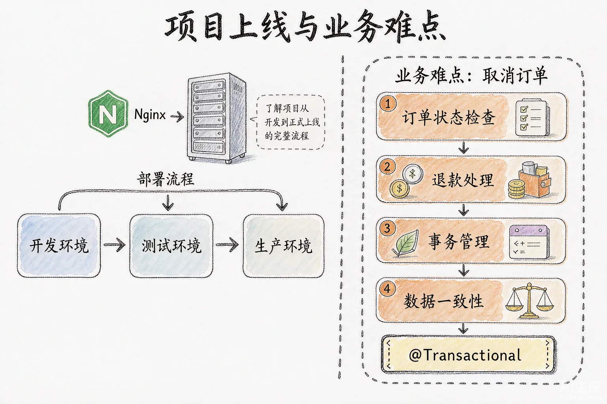

项目的另一个亮点，是按照接近生产环境的方式进行部署，因此可以对项目上线流程形成比较清晰的认识。

如果面试官问“你从这个项目中学到了什么”，可以这样回答：

> 我了解了项目如何在开发、测试和生产等不同环境中进行部署，也深入理解了一个项目从开发到正式上线的完整流程。

业务逻辑中也包含一些难点，例如**取消订单**。这一流程可能涉及：

- 订单状态检查；
- 退款处理；
- 事务管理；
- 多个业务步骤之间的数据一致性。

事务管理可以通过 Spring 提供的 **`@Transactional`** 注解实现。

## 二、Redis 在项目中的应用
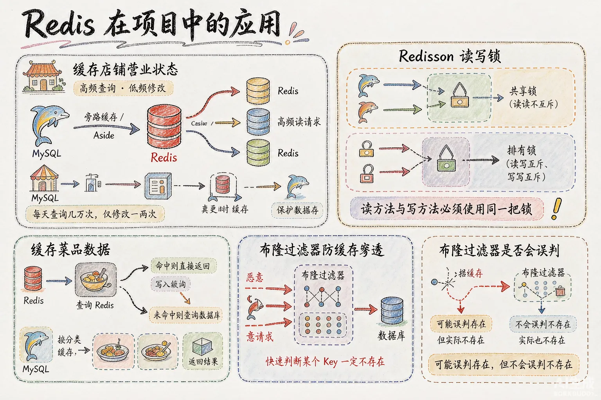

## 1. 缓存店铺营业状态
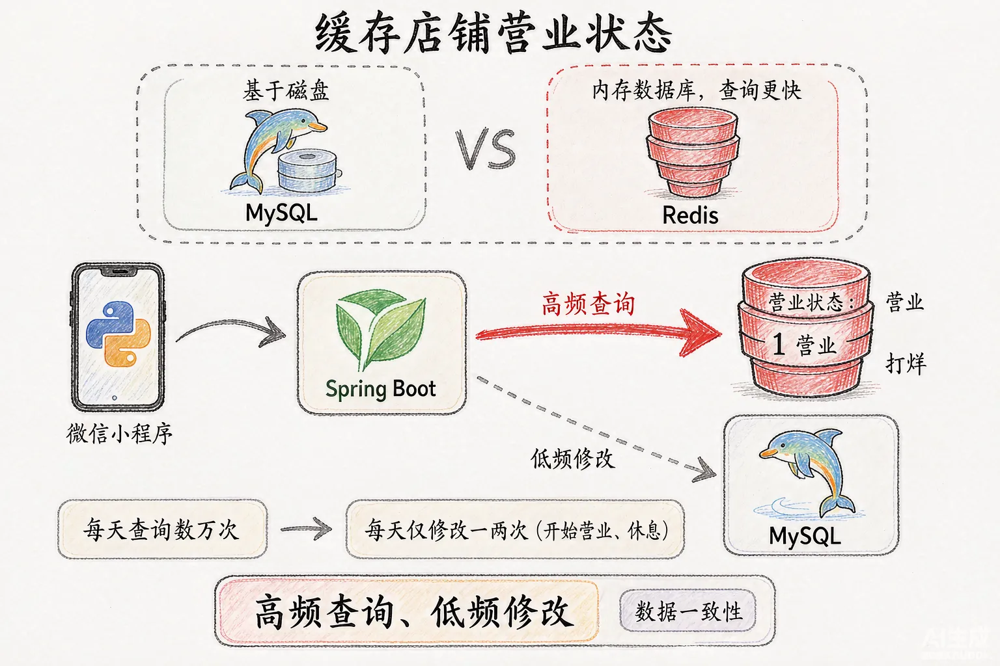

用户查看店铺营业状态时，需要保证相关数据的一致性。因为店铺未营业时，用户不能继续点单，所以这一数据对实时性要求比较高。

店铺营业状态属于典型的**高频查询、低频修改**数据。只要用户打开小程序、浏览店铺，前端就会自动向后端发送请求，查询店铺当前是营业还是休息。

这一数据每天可能被查询几万次，但通常只会修改一两次：餐厅开始营业时修改一次，休息时再修改一次。因此，将营业状态直接存储在 Redis 中，查询速度会更快，也可以避免每次访问 MySQL。

相较于基于磁盘的 MySQL，Redis 作为内存数据库，在这类高频查询场景中的性能更好。

## 2. 使用读写锁保证一致性
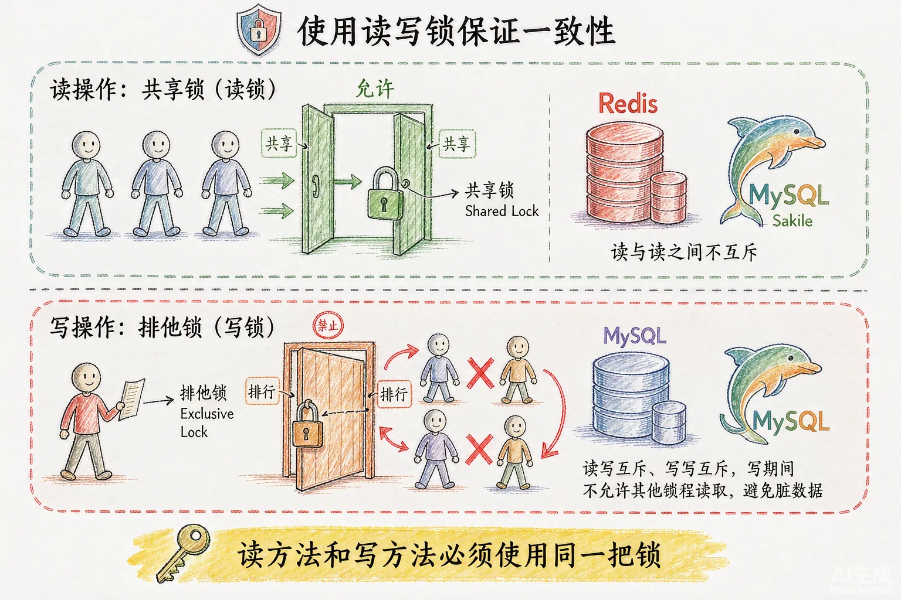

为了保证数据库与 Redis 中的店铺状态一致，可以使用 **Redisson 读写锁**。

- 读取数据时添加**共享锁**，读与读之间不互斥；
- 更新数据时添加**排他锁**，读写之间互斥，写写之间也互斥；
- 写数据期间，不允许其他线程同时读取，避免读取到脏数据。

> 读方法和写方法必须使用**同一把锁**，否则无法真正实现互斥和一致性控制。

## 3. 缓存菜品数据
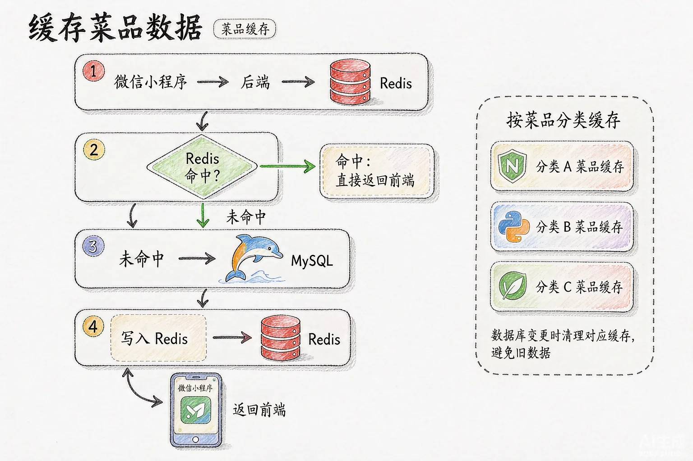

如果用户端展示菜品时，每次都直接查询数据库，那么随着访问量增大，数据库压力也会随之增大，系统响应可能变慢，用户体验也会变差。

菜品缓存的基本流程如下：

1. 先查询 Redis；
2. 如果 Redis 中存在数据，直接返回；
3. 如果 Redis 中不存在数据，则查询数据库；
4. 将数据库查询结果写入 Redis；
5. 再将结果返回给前端。

项目中可以按照菜品分类进行缓存，即**每一个分类保存一份菜品缓存数据**。当数据库中的菜品信息发生变更时，需要清理对应缓存，避免读取到旧数据。

## 4. 布隆过滤器与缓存穿透
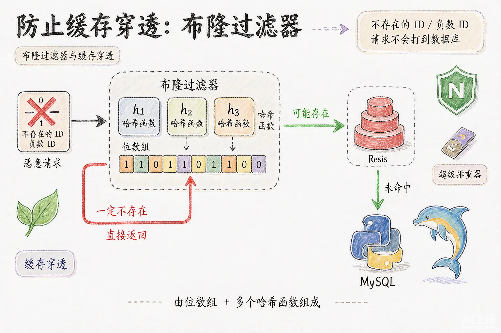

布隆过滤器主要用于防止**缓存穿透**。

例如，有人恶意使用不存在的 ID，甚至持续使用负数 ID 请求接口。这些请求在 Redis 中查不到数据，就会直接穿过缓存访问数据库。如果请求量很大，数据库可能被打爆。

布隆过滤器可以理解为一个“超级排重器”，能够快速判断某个 Key 是否**一定不存在**。

### 布隆过滤器的结构

布隆过滤器主要由两部分组成：

- 一个包含大量二进制位的**位数组**；
- 多个相互独立、分布相对均匀的**哈希函数**。

初始状态下，位数组中的所有位置都被设置为 `0`。位数组会占用一定的内存空间，但相较于直接存储完整数据，空间利用率更高。

### 插入元素

当一个新元素加入布隆过滤器时：

1. 使用多个哈希函数对该元素进行计算；
2. 得到多个哈希值；
3. 将这些哈希值映射到位数组中的不同位置；
4. 把对应位置设置为 `1`。

例如，可以把数据库中所有真实存在的 ID，通过多个哈希函数映射到位数组中。

### 判断元素是否存在

检查一个元素是否存在时，同样需要对该元素进行多次哈希计算，然后检查位数组中对应位置的值：

- 如果任何一个位置为 `0`，可以确定该元素**一定不存在**；
- 如果所有位置都为 `1`，只能说明该元素**可能存在**。

## 5. 布隆过滤器是否会误判
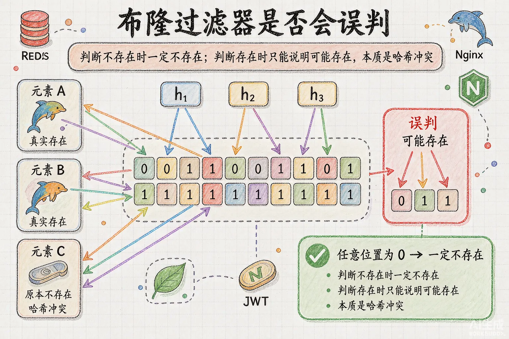

布隆过滤器存在误判。

由于多个不同元素可能被映射到位数组中的相同位置，某个原本不存在的元素，其对应位置可能恰好都已经被其他元素设置为 `1`。此时，布隆过滤器会错误地判断该元素可能存在。

这本质上属于**哈希冲突**。

> 布隆过滤器判断“不存在”时，一定不存在；判断“存在”时，只能说明可能存在。

换句话说，布隆过滤器说某个 ID 存在，它不一定真的存在，也可能只是其他几个 ID 的哈希值凑巧把相关位置占了。

## 三、微信登录、JWT 与身份认证
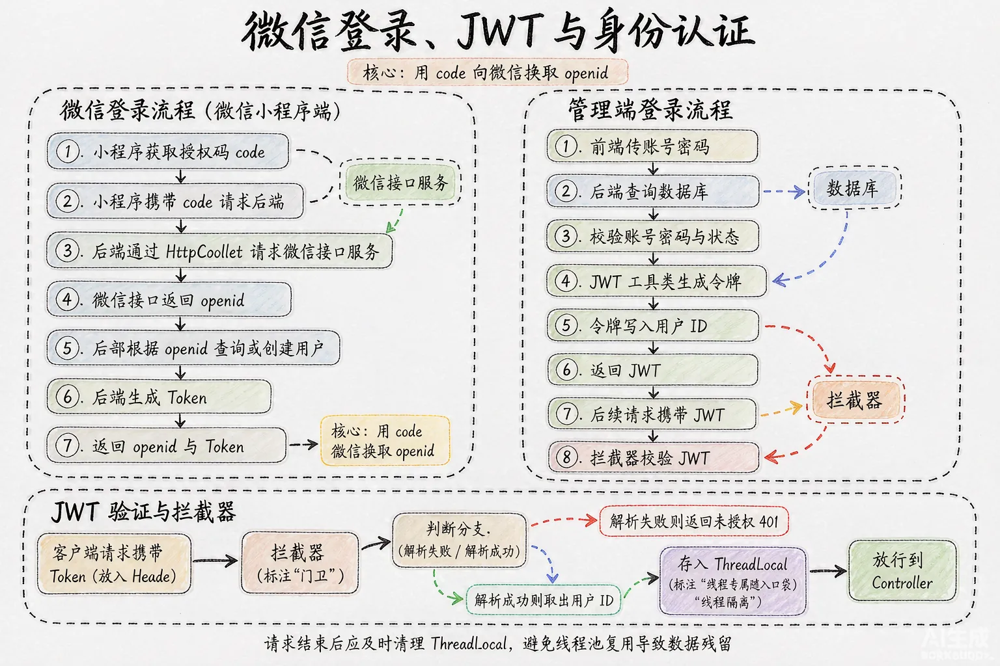

## 1. 微信登录中的 HttpClient
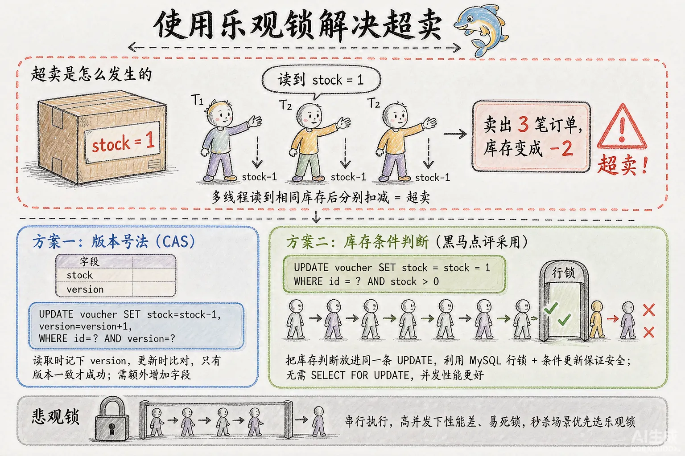

在微信登录模块中，后端不需要自行验证用户的微信账号和密码，而是接收前端传来的临时授权码 `code`，再通过 **HttpClient** 调用微信官方 API。

HttpClient 可以理解为后端用于模拟浏览器发送 HTTP 请求的工具，能够发送多种类型的请求，例如：

- `GET`
- `POST`
- `PUT`
- `DELETE`

在微信登录开发中，后端需要携带登录凭证，请求微信提供的指定 URL，这项任务可以通过 HttpClient 完成。

## 2. 微信登录流程
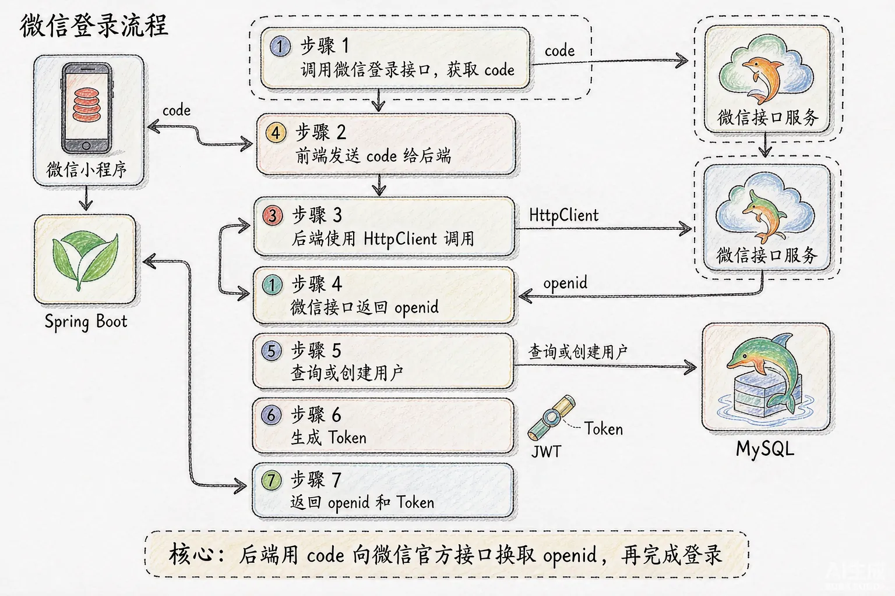

微信登录的大致流程如下：

1. 小程序端获取微信授权码 `code`；
2. 小程序向后端服务发送请求，并携带该授权码；
3. 后端收到授权码后，通过 HttpClient 请求微信接口服务；
4. 微信接口返回用户的 `openid` 等信息；
5. 后端根据 `openid` 完成用户查询或创建；
6. 后端生成 Token；
7. 后端向小程序返回 `openid` 和 Token 等数据。

这里的核心是：后端通过前端传来的 `code`，向微信官方接口换取用户的 `openid`，再完成登录。

## 3. 管理端登录流程
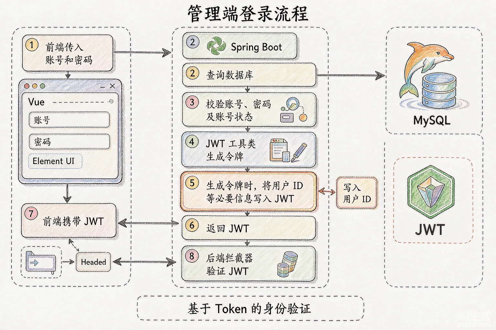

管理端登录的整体流程如下：

1. 前端传入账号和密码；
2. 后端查询数据库，判断该用户是否存在；
3. 校验账号、密码及账号状态；
4. 校验通过后，通过 JWT 工具类生成令牌；
5. 生成令牌时，将用户 ID 等必要信息写入 JWT；
6. 后端将 JWT 返回给前端；
7. 前端在后续请求中携带 JWT；
8. 后端拦截器负责验证 JWT。

## 4. JWT 的验证流程
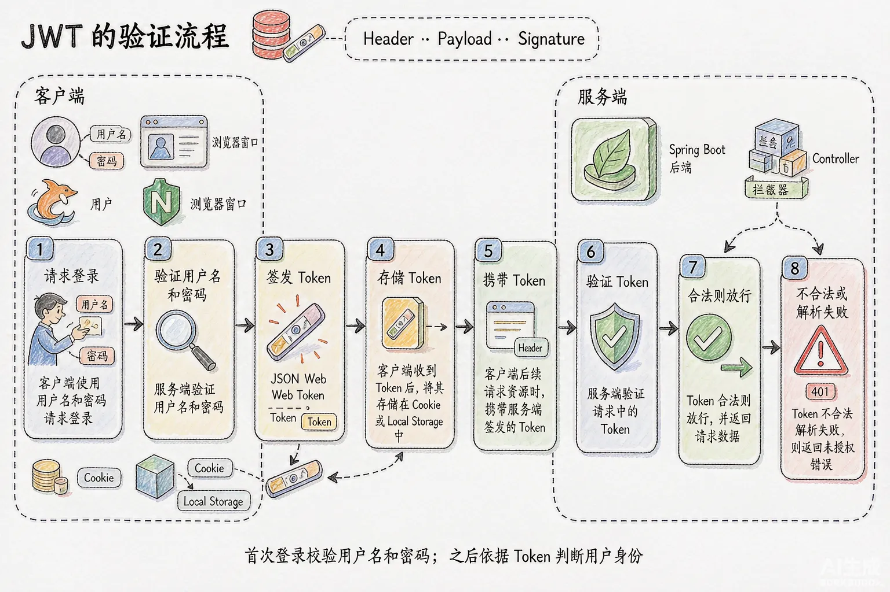

JWT 的全称是 **JSON Web Token**。用户在管理端输入账号和密码，后端校验通过后，会生成一串 JWT 字符串并返回给前端。

前端在之后的请求中，需要将 JWT 放入请求头，也就是 `Header` 中。后端配置拦截器，在请求进入 Controller 之前完成身份校验。

基于 Token 的身份验证流程可以概括为：

1. 客户端使用用户名和密码请求登录；
2. 服务端验证用户名和密码；
3. 验证成功后，服务端签发 Token；
4. 客户端收到 Token 后，将其存储在 Cookie 或 Local Storage 中；
5. 客户端后续请求资源时，携带服务端签发的 Token；
6. 服务端验证请求中的 Token；
7. Token 合法则放行，并返回请求数据；
8. Token 不合法或解析失败，则返回未授权错误。

*首次登录时，服务端校验用户名和密码；之后接收 HTTP 请求时，主要依据 Token 判断用户身份。*

## 5. 拦截器的作用
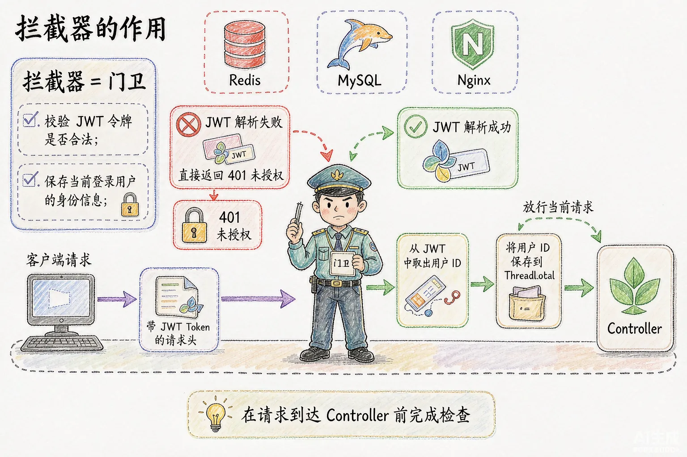

拦截器类似“门卫”，会在请求到达 Controller 前进行检查。

- 如果 JWT 解析失败，直接返回未授权；
- 如果 JWT 解析成功，则从中取出用户 ID；
- 将用户 ID 保存到 ThreadLocal；
- 放行当前请求。

因此，拦截器主要承担两项任务：

1. 校验 JWT 令牌是否合法；
2. 保存当前登录用户的身份信息。

## 6. ThreadLocal 的作用
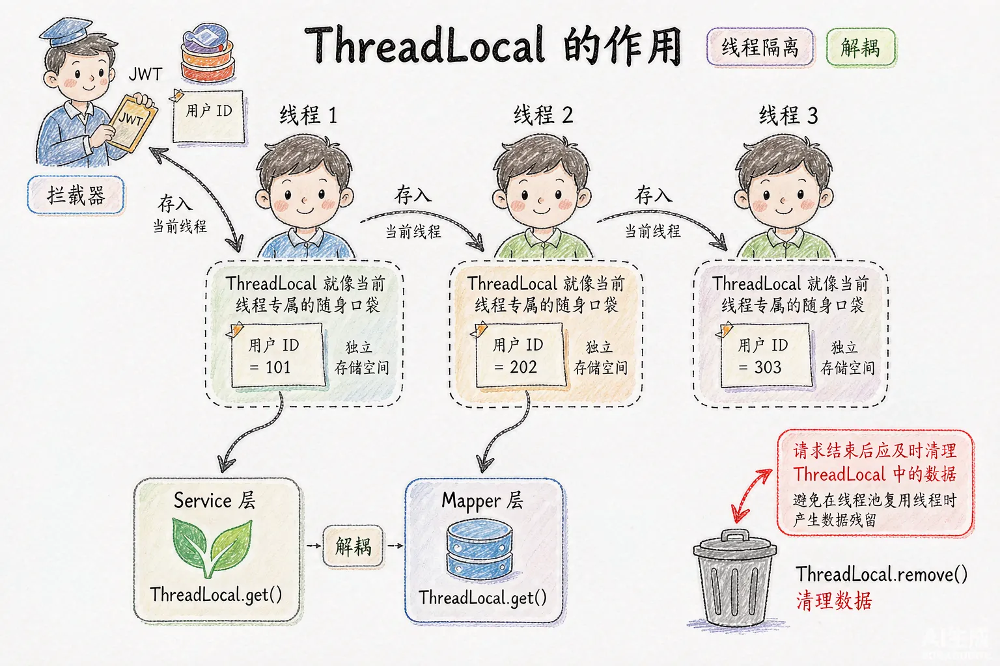

ThreadLocal 会为每个线程提供独立的存储空间，具有**线程隔离**能力。只有在同一个线程中，才能获取该线程保存的值，因此它可以用来保存线程本地变量。

拦截器解析出用户 ID 后，可以把它放入 ThreadLocal。ThreadLocal 就像当前线程专属的“随身口袋”。

后续无论是在 Service 层还是 Mapper 层，都可以通过类似 `ThreadLocal.get()` 的方式，获取当前登录用户的 ID，不需要在方法之间层层传递参数。这也起到了解耦的作用。

需要注意的是，请求结束后通常应及时清理 ThreadLocal 中的数据，避免在线程池复用线程时产生数据残留。

## 四、Nginx、负载均衡与实时通信
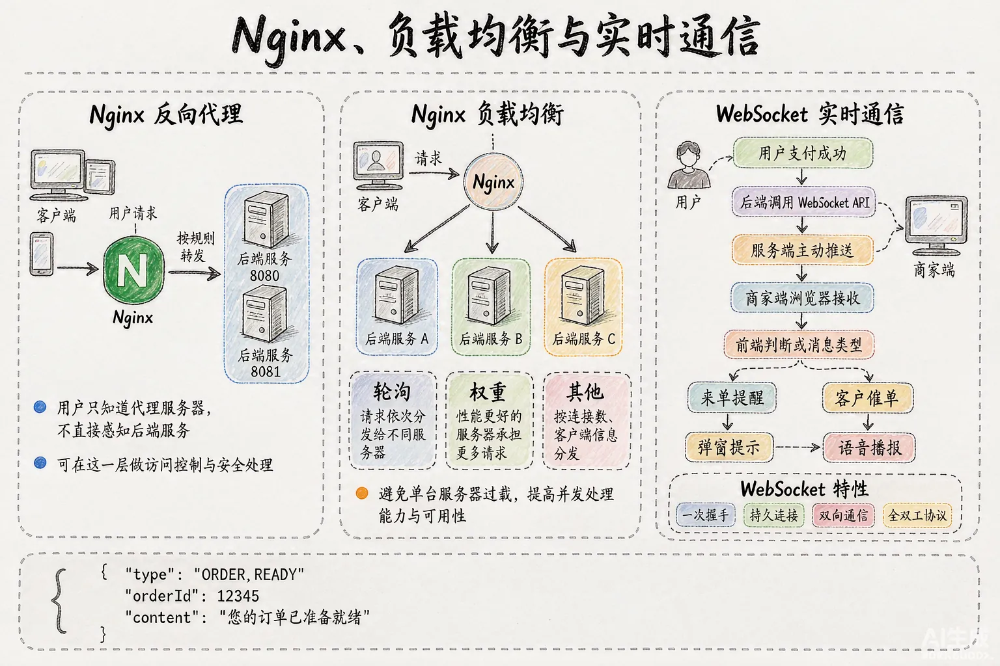

## 1. Nginx 反向代理
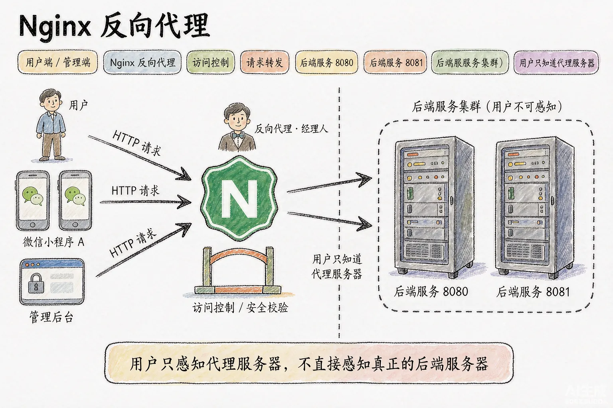

项目部署时，为了避免单个服务器承受不住访问压力，通常会启动多个后端服务，例如监听 `8080`、`8081` 等不同端口。

Nginx 反向代理就像站在最前面的“经理人”。用户并不知道后台到底有几台机器，所有请求都会先发送给 Nginx，再由 Nginx 按照具体规则转发给相应的后端服务。

这就是反向代理的基本概念：

> 用户只知道代理服务器，不直接感知真正提供服务的后端服务器。

Nginx 位于系统入口，也可以在这一层进行访问控制等安全处理，相当于在后端服务前增加了一道门槛。

## 2. Nginx 负载均衡
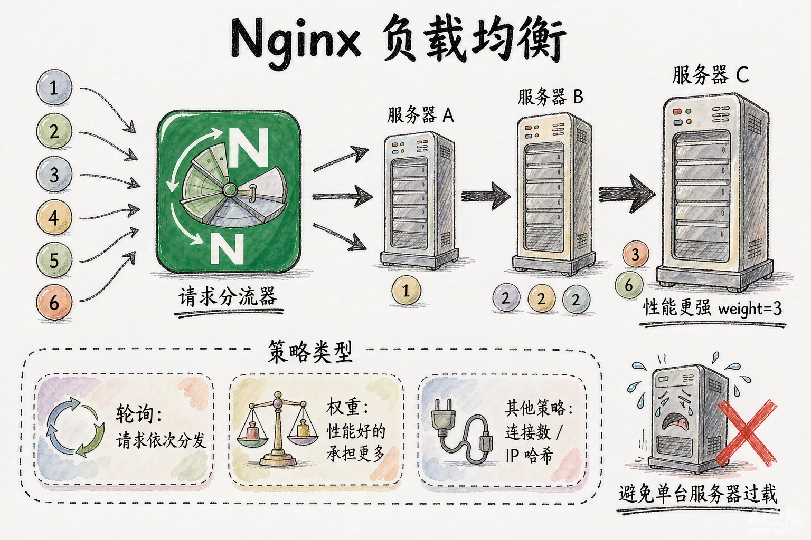

负载均衡是指 Nginx 通过轮询、权重等算法，把请求分摊给多台后端服务器，避免其中某一台服务器“累死”。

这样可以让各个服务器承担的任务相对均衡，提高系统的并发处理能力与可用性。

常见策略包括：

- **轮询**：请求依次分发给不同服务器；
- **权重**：性能更好的服务器承担更多请求；
- **其他策略**：可以根据连接数、客户端信息等进行分发。

## 3. WebSocket 实现来单与催单提醒
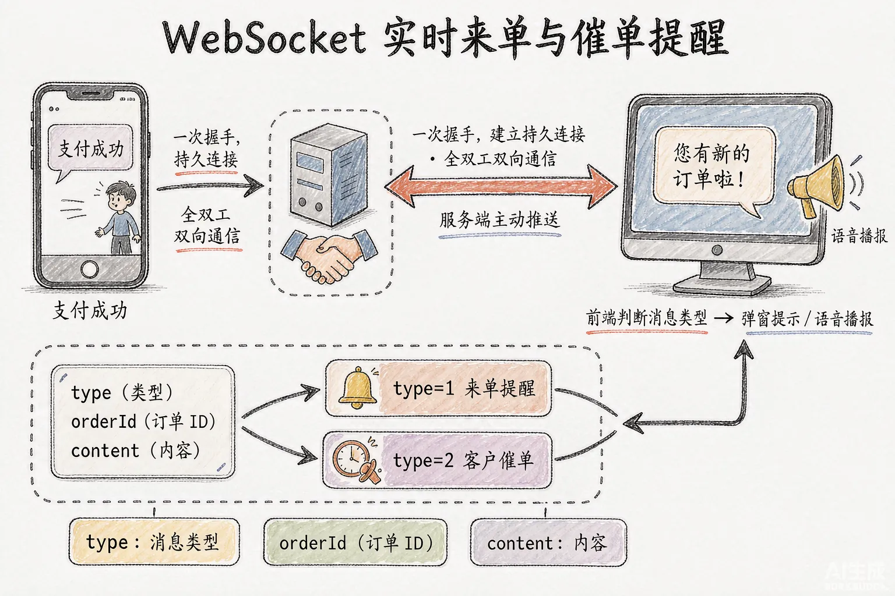

后端与商家端需要建立实时通信。例如，用户下单成功后，系统应第一时间通知商家。

项目中可以使用 **WebSocket** 实现这一功能。WebSocket 是一种长连接、双向通信的全双工协议，可以让客户端与服务器之间的数据交换更加简单，并允许服务端主动向客户端推送消息。

在 WebSocket API 中，浏览器与服务器只需要完成一次握手，就可以建立持久连接，并在连接期间进行双向数据传输。

具体到业务场景：

1. 用户支付成功；
2. 后端调用 WebSocket 相关 API；
3. 服务端主动向商家端推送消息；
4. 商家端浏览器接收服务端消息；
5. 前端判断消息属于来单提醒还是客户催单；
6. 根据消息类型进行弹窗提示或语音播报。

服务端与浏览器之间可以约定使用 JSON 格式传递消息，字段可以包括：

- `type`
- `orderId`
- `content`

消息类型主要包括：

- 来单提醒；
- 客户催单。

用户下单成功后，后端通过 WebSocket 主动向商家的电脑或收银台推送消息，商家端就可以播放大家经常听到的：

> “您有新的订单啦！”

这样就能实现秒级的实时提醒。

## 五、库存超卖与并发控制
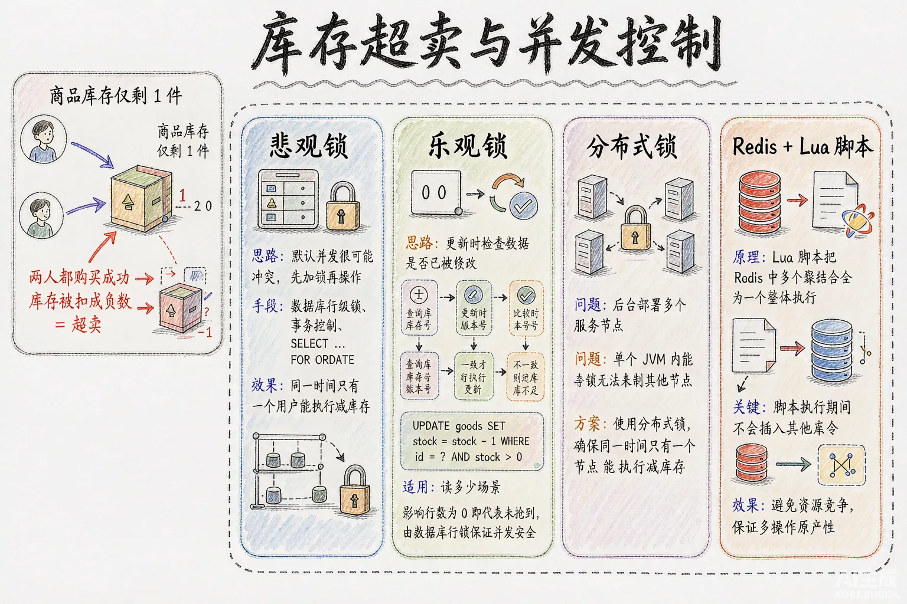

## 1. 什么是商品超卖
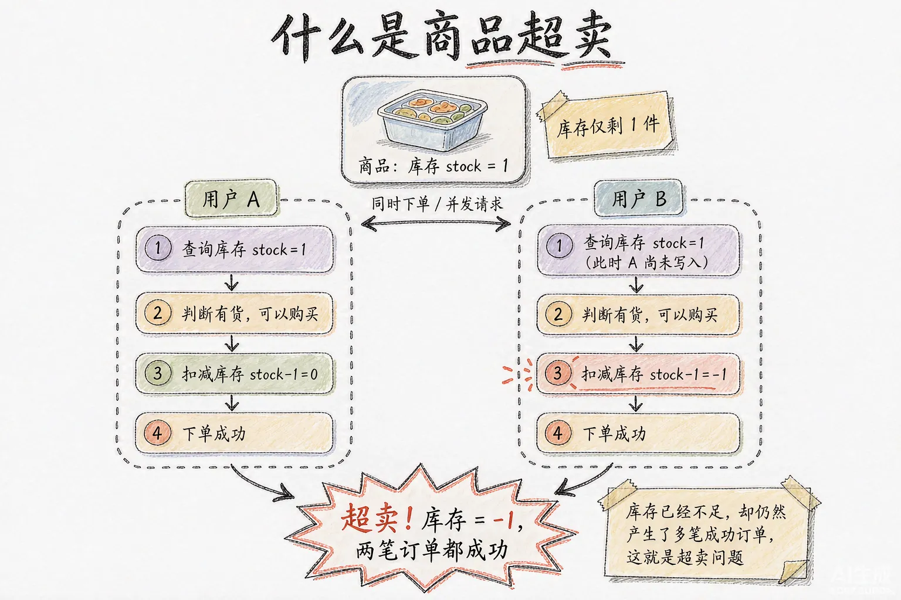

如果面试官问项目中比较难实现的问题，可以把**商品超卖**作为例子。

例如，某件商品的库存只剩 `1` 件，但两个用户同时下单。如果系统没有做好并发控制，两个人可能都会购买成功，最终库存被扣成负数。

库存已经不足，却仍然产生了多笔成功订单，这就是超卖问题。

## 2. 悲观锁
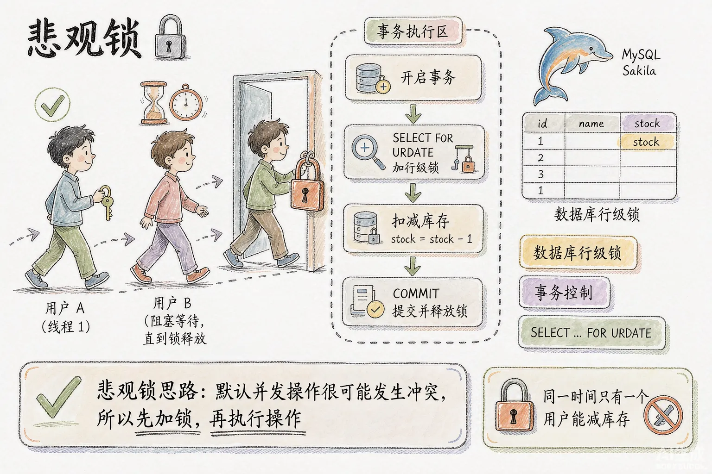

使用悲观锁时，需要在商品购买过程中对库存数据加锁，确保同一时间只有一个用户能够执行减库存操作，从而避免并发冲突。

可以在数据库层面使用：

- 数据库行级锁；
- 事务控制；
- `SELECT ... FOR UPDATE` 等方式。

悲观锁的思路是：*默认并发操作很可能发生冲突，因此先加锁，再执行操作。*

## 3. 乐观锁
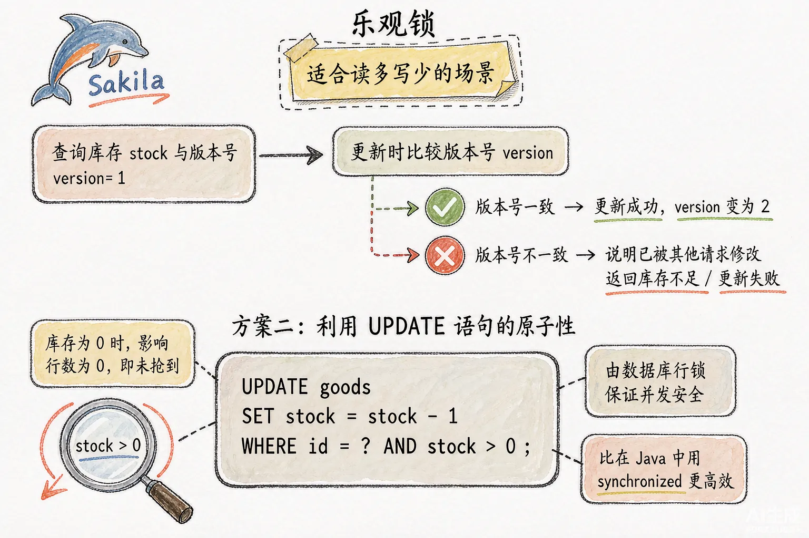

乐观锁不会在一开始就锁住数据，而是在更新时检查数据是否已被其他请求修改。

一种做法是引入版本号：

1. 购买商品时查询库存和当前版本号；
2. 更新库存时比较版本号；
3. 版本号一致才执行更新；
4. 如果版本号不一致，说明数据已经被其他请求修改；
5. 此时返回库存不足或更新失败。

这种方式比较适合**读多写少**的场景。

在实际项目中，也可以直接利用数据库更新语句的原子性，例如：

```sql
UPDATE goods
SET stock = stock - 1
WHERE id = ?
  AND stock > 0;
```

如果库存为 `0`，SQL 影响的行数也会是 `0`，由此即可判断当前用户没有抢到商品。

这种方式由数据库行锁保证并发安全，通常比在 Java 中直接使用 `synchronized` 更高效。

## 4. 分布式锁
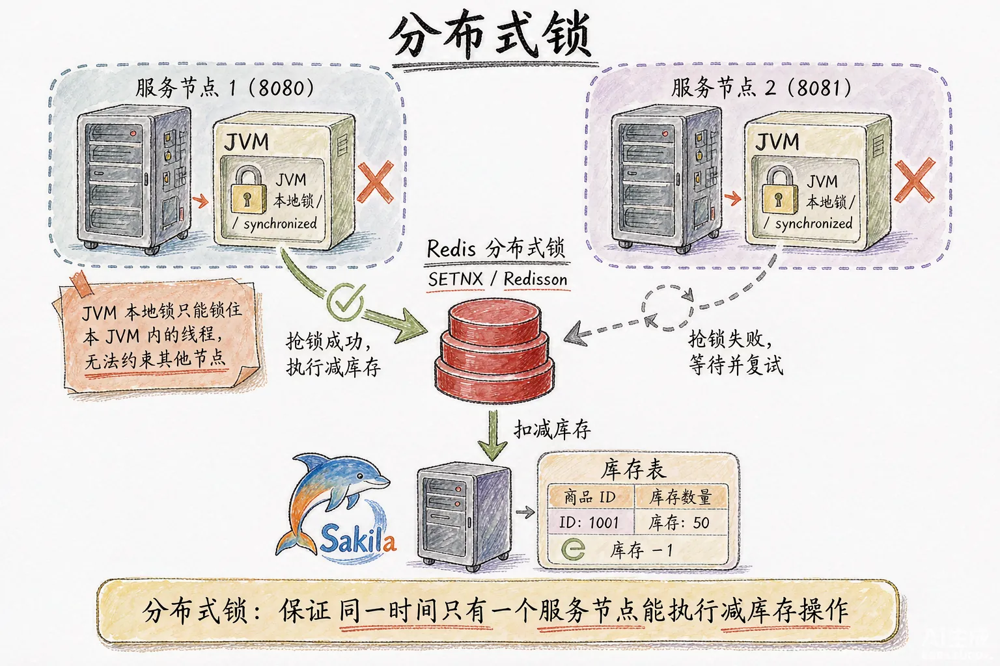

在分布式系统中，后台可能部署了多个服务节点。此时，仅使用单个 JVM 内的锁，无法约束其他节点。

可以使用分布式锁对库存操作加锁，确保同一时间只有一个节点能够执行减库存操作，从而避免多个节点之间发生并发冲突。

## 5. Redis 与 Lua 脚本
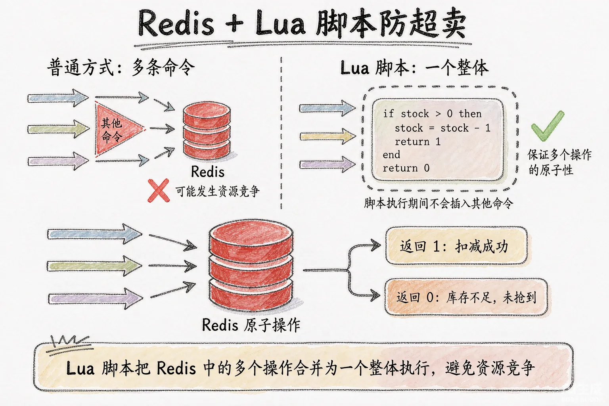

还可以利用 Redis 的原子操作，并结合 **Lua 脚本**预防库存超卖。

Lua 脚本可以把 Redis 中的多个操作合并为一个整体执行。在脚本执行期间，不会插入其他命令，因此可以避免资源竞争，保证多个操作的原子性。

面试时，可以把悲观锁、乐观锁、分布式锁和 Redis + Lua 都介绍出来，也可以选择其中一种，作为项目“吹水”的重点。

## 六、分页查询与 Spring Cache
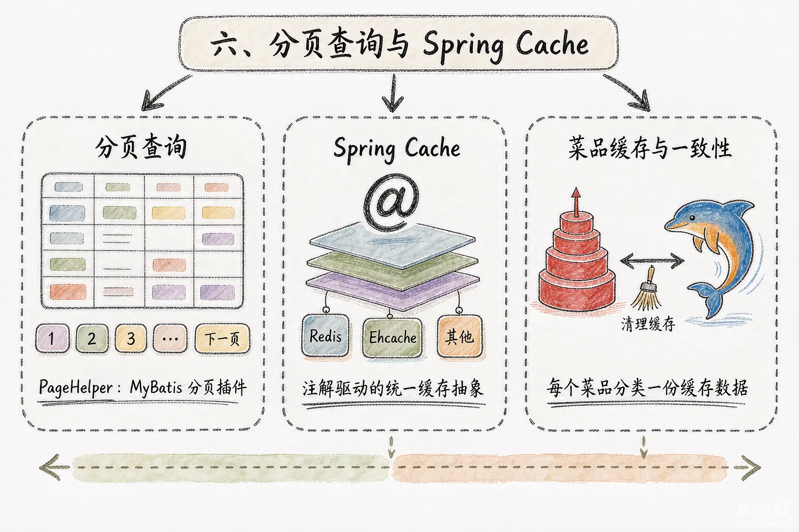

## 1. PageHelper 分页查询
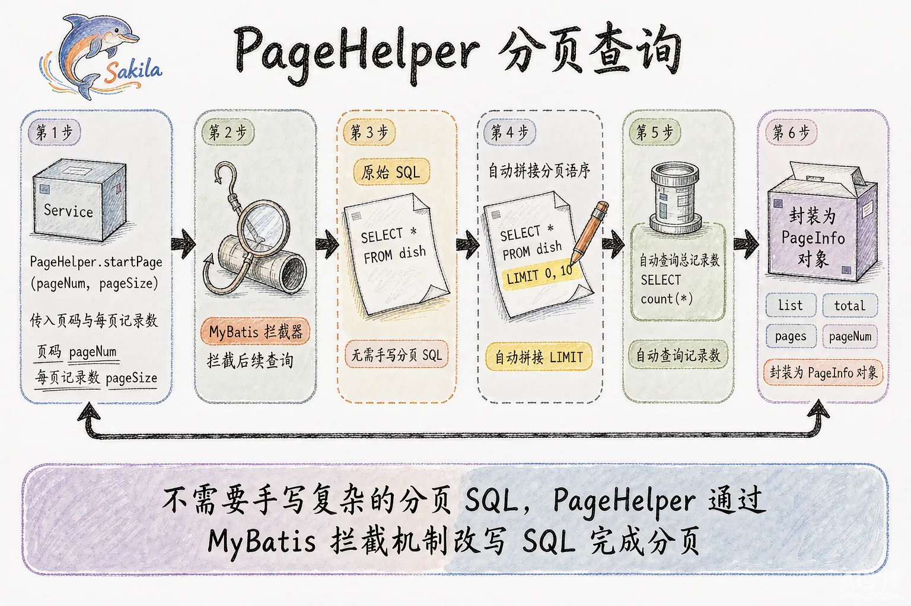

项目中的分页查询可以使用 **PageHelper**。它是 MyBatis 的分页插件。

进行分页查询时，只需要在执行原始 SQL 之前调用：

```java
PageHelper.startPage(pageNum, pageSize);
```

传入页码 `pageNum` 和每页记录数 `pageSize` 后，PageHelper 会：

1. 拦截后续执行的查询；
2. 在原始 SQL 后自动拼接 `LIMIT` 等分页语句；
3. 自动查询总记录数；
4. 将分页结果封装为 `PageInfo` 等对象。

这样就不需要手写复杂的分页 SQL，使用起来“极度舒适”。

面试时不一定要把底层实现全部背下来，能够说明它通过 MyBatis 拦截机制改写 SQL、完成分页查询即可。

## 2. Spring Cache 的作用
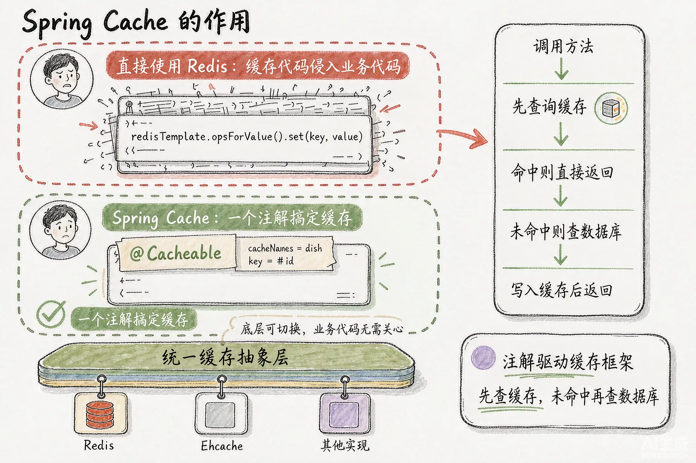

**Spring Cache** 是 Spring 提供的注解驱动缓存框架。它为应用提供统一的缓存抽象，开发者不需要过度关心底层使用的是哪一种缓存技术。

如果直接使用 Redis，通常需要在方法体中编写类似下面的代码：

```java
redisTemplate.opsForValue().set(key, value);
```

而使用 Spring Cache 后，可以通过注解完成缓存逻辑，例如：

```java
@Cacheable(cacheNames = "dish", key = "#id")
```

执行流程大致如下：

1. 调用方法前，先查询缓存；
2. 如果缓存中有数据，直接返回；
3. 如果缓存中没有数据，执行原方法查询数据库；
4. 将方法返回值写入缓存；
5. 再把结果返回给调用方。

Spring Cache 提供的是一层抽象，底层可以使用不同的缓存实现，例如：

- Redis；
- Ehcache；
- 其他兼容的缓存组件。

## 3. 菜品缓存与一致性
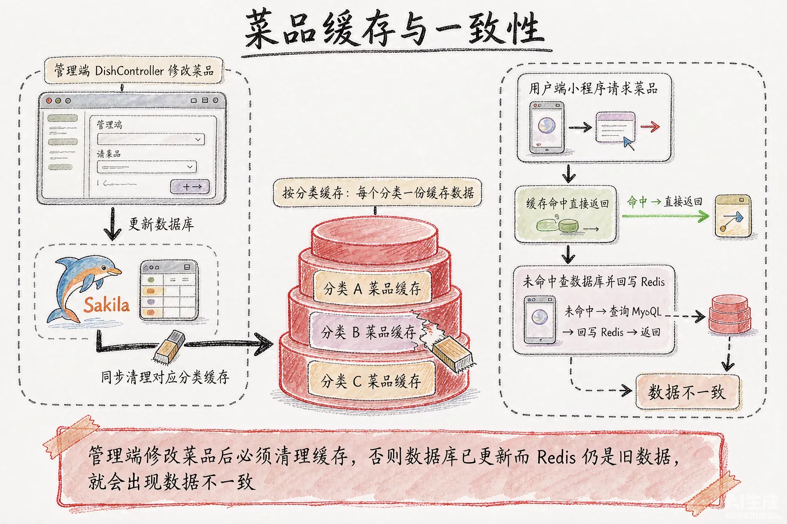

用户端小程序展示菜品时，如果每次都查询数据库，访问量增大后会给数据库造成较大压力。

因此，可以利用 Redis 缓存菜品数据，并通过 Spring Cache 注解简化代码。缓存逻辑是：**每个菜品分类保存一份缓存数据**。

当管理端修改菜品信息后，需要在 `DishController` 等相关业务入口中加入缓存清理逻辑。否则，数据库已经更新，但 Redis 中仍然保存旧数据，就会出现不一致问题。

关于数据一致性，还可以继续扩展到 Redis 缓存异常、缓存穿透、缓存击穿、缓存雪崩等常见面试题。

一般面试官会先让你介绍某个功能是如何实现的。当你提到使用了某项技术后，他可能继续追问对应的八股知识。很多国企面试时间相对较短，问题通常以这种方式展开；如果是大厂或私企，可能还会加入难度更高的场景题。

## 七、定时任务与订单状态处理
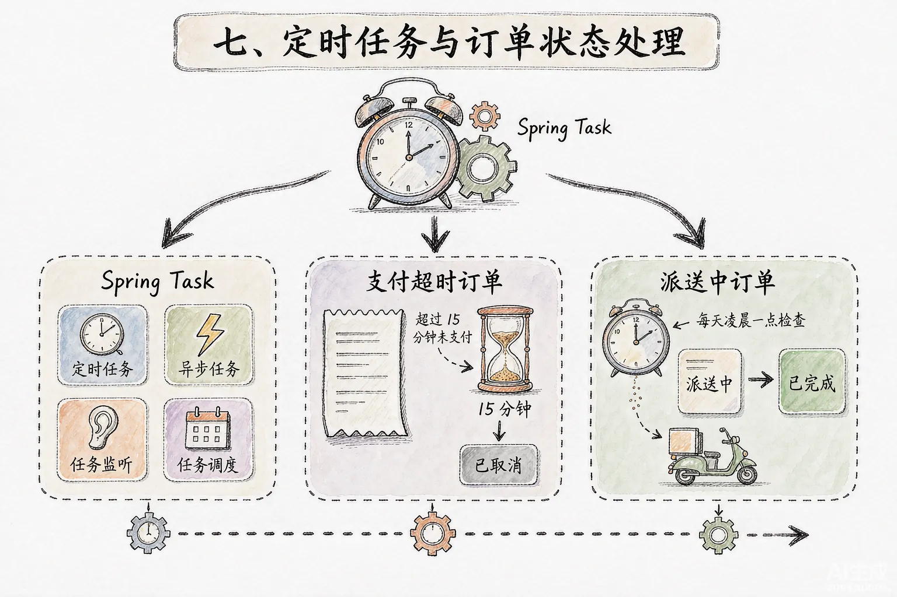

## 1. Spring Task
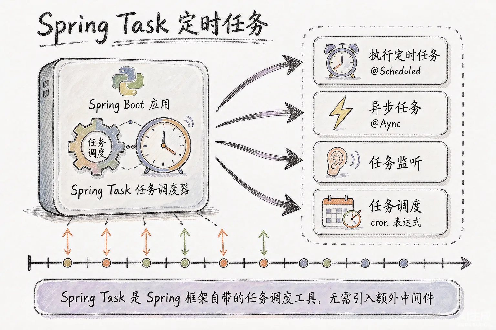

定时任务主要使用 **Spring Task** 实现。Spring Task 是 Spring 框架提供的任务调度工具，可以用于：

- 执行定时任务；
- 异步任务；
- 任务监听；
- 任务调度。

## 2. 支付超时订单处理
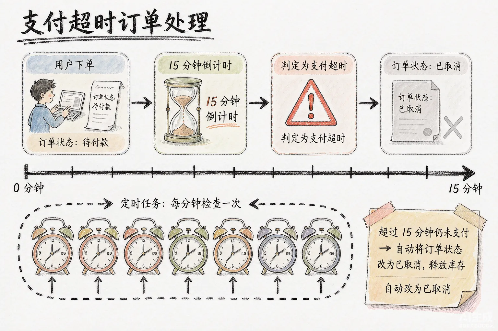

项目通过定时任务，每分钟检查一次是否存在支付超时的订单。

处理规则如下：

1. 用户下单；
2. 超过 `15` 分钟仍未支付；
3. 判定为支付超时；
4. 将订单状态修改为“已取消”。

## 3. 派送中订单处理
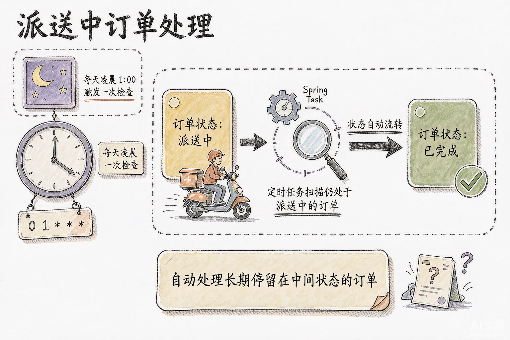

系统还可以每天凌晨一点检查一次是否存在仍处于“派送中”状态的订单。

如果存在，则将订单状态修改为“已完成”。

通过定时任务，可以自动处理因用户未操作、商家未点击完成等原因而长期停留在中间状态的订单。

## 八、反射、AOP 与公共字段填充
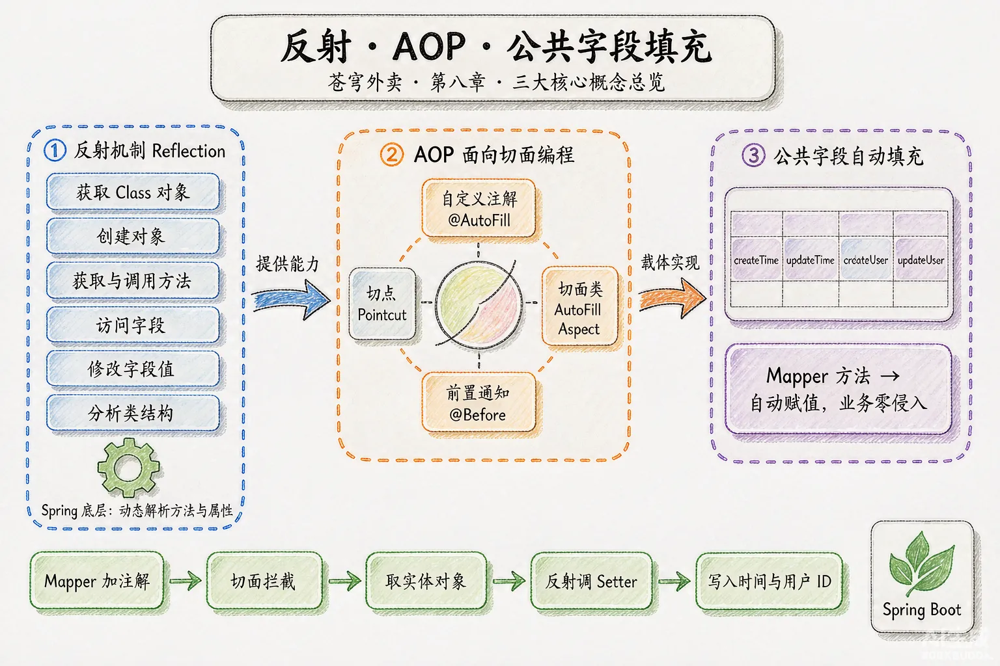

## 1. Java 反射机制
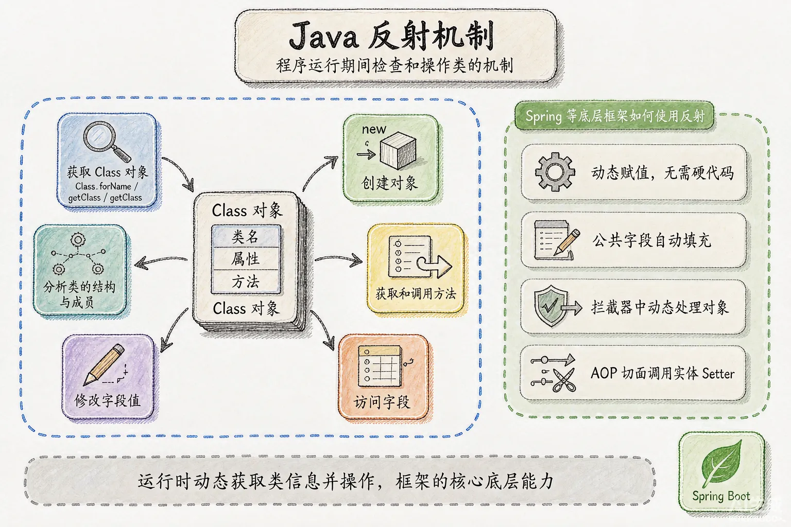

反射是一种在程序运行期间检查和操作类的机制。程序可以通过反射获取类的信息，并动态完成以下操作：

- 获取 Class 对象；
- 创建对象；
- 获取和调用方法；
- 访问字段；
- 修改字段值；
- 分析类的结构和成员。

Spring 等底层框架会通过反射获取类的方法和属性，并进行动态赋值，而不需要通过硬编码把逻辑写死。

在苍穹外卖项目中，反射可以用于：

- 公共字段自动填充；
- 拦截器中动态处理相关对象；
- AOP 切面中调用实体类的 Setter 方法；
- 框架内部的方法和属性解析。

## 2. AOP 的作用
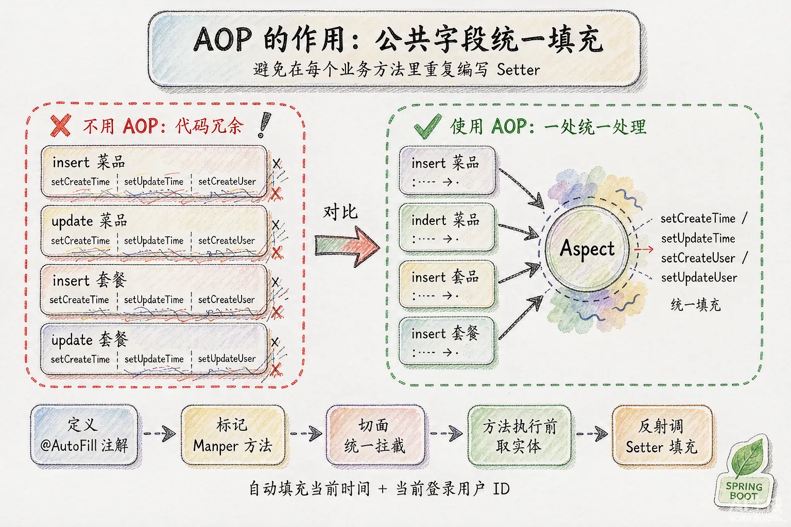

项目中的很多数据表都包含重复的公共字段，例如：

- `createTime`
- `updateTime`
- `createUser`
- `updateUser`

如果每次插入或更新数据时，都在业务代码中手动调用 Setter 方法，代码会非常冗余。

可以使用 **AOP，也就是面向切面编程**，统一完成这些公共字段的填充。

基本思路如下：

1. 定义一个自定义注解，例如 `@AutoFill`；
2. 使用该注解标记需要自动填充公共字段的方法；
3. 定义切面类 `AutoFillAspect`；
4. 统一拦截添加了 `@AutoFill` 注解的方法；
5. 在方法执行前获取实体对象；
6. 利用反射调用 `setCreateTime`、`setUpdateTime` 等方法；
7. 自动填充当前时间和当前登录用户 ID。

示意代码如下：

```java
@AutoFill(OperationType.INSERT)
void insert(Entity entity);
```

这样，业务层只需要关心核心业务，不需要在每个插入或更新方法中重复设置公共字段。

## 3. 公共字段自动填充的实现步骤
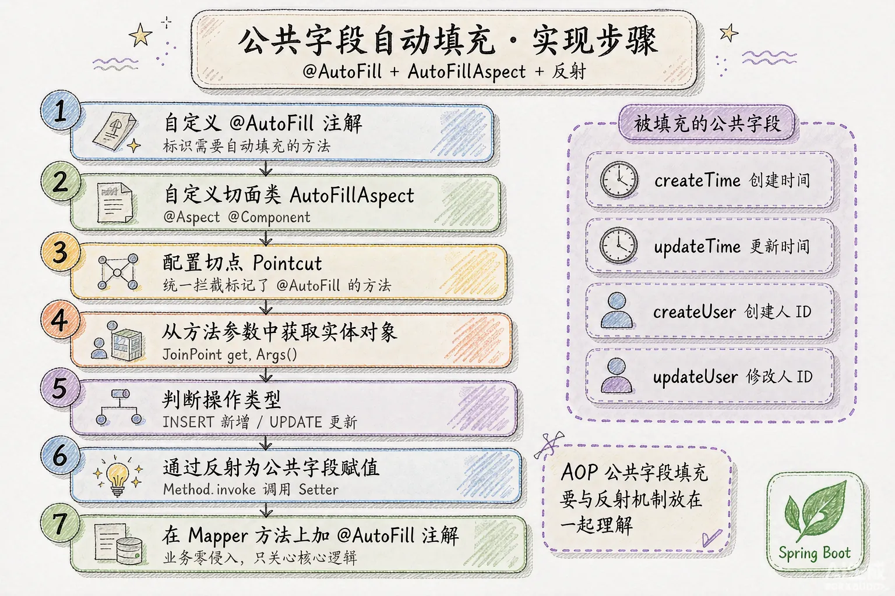

完整实现流程可以概括为：

1. 自定义 `@AutoFill` 注解，用于标识需要进行公共字段自动填充的方法；
2. 自定义切面类 `AutoFillAspect`；
3. 配置切点，统一拦截标记了 `@AutoFill` 的方法；
4. 从方法参数中获取实体对象；
5. 根据操作类型判断是新增还是更新；
6. 通过反射为公共字段赋值；
7. 在 Mapper 方法上加入 `@AutoFill` 注解。

这里的 AOP 公共字段填充内容，应该与反射机制放在一起理解。

## 九、Swagger、Knife4j 与接口文档
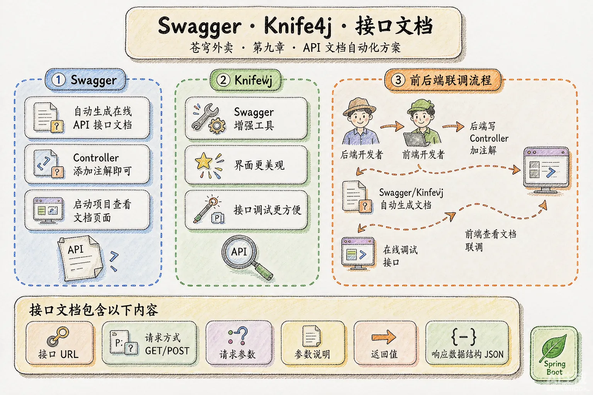

## 1. Swagger
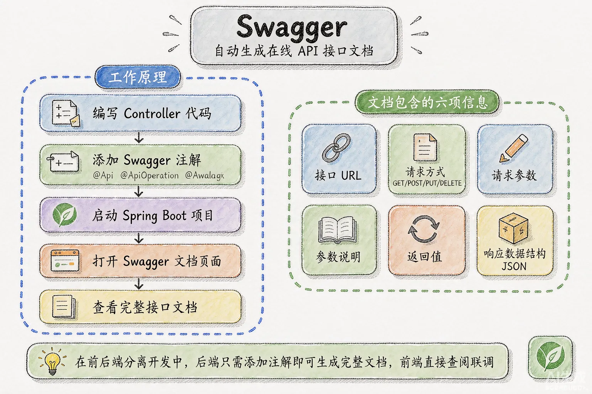

Swagger 可以自动生成在线 API 接口文档。

编写完 Controller 后，通过添加相应注解，启动项目并打开文档页面，就可以查看：

- 接口 URL；
- 请求方式；
- 请求参数；
- 参数说明；
- 返回值；
- 响应数据结构。

例如，可以使用接口描述类注解或操作说明注解，为接口补充文档信息。

## 2. Knife4j
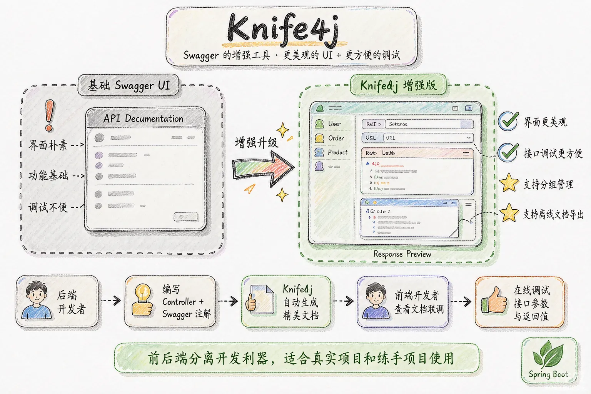

**Knife4j** 可以理解为 Swagger 的增强工具。相比基础的 Swagger UI，它的界面更美观，接口调试也更方便。

在前后端分离开发中，前端开发人员可以直接查看接口文档，并根据文档完成接口联调。Swagger 和 Knife4j 不仅适合真实项目，也很适合在练手项目中使用。

## 十、面试介绍思路
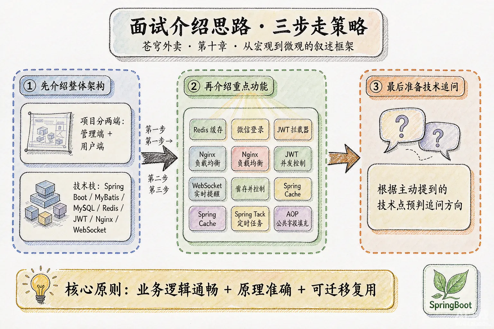

## 1. 先介绍整体架构
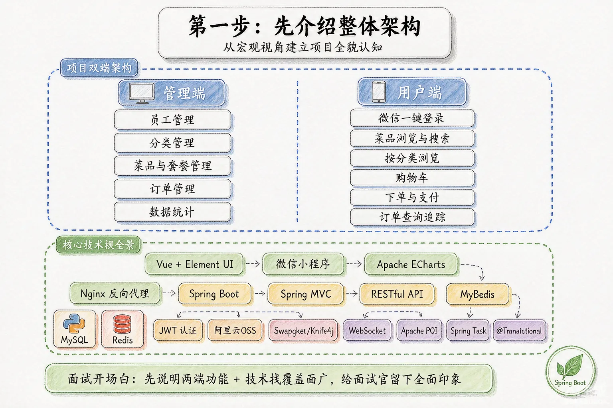

面试时，可以先说明项目分为两端：

- 管理端；
- 用户端。

然后分别介绍两端的核心功能，再说明项目使用了 Spring Boot、MyBatis、MySQL、Redis、JWT、Nginx、WebSocket 等技术。

## 2. 再介绍重点功能
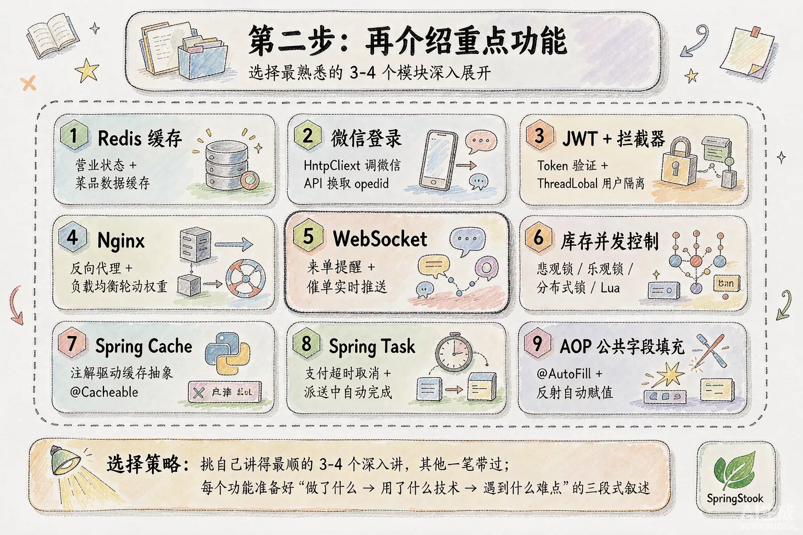

可以选择几个自己最熟悉的模块展开，例如：

1. Redis 缓存营业状态和菜品；
2. 微信登录及 HttpClient 调用；
3. JWT、拦截器与 ThreadLocal；
4. Nginx 反向代理与负载均衡；
5. WebSocket 实时来单提醒；
6. 库存超卖及并发控制；
7. Spring Cache；
8. Spring Task 定时处理订单；
9. AOP 与公共字段自动填充。

## 3. 最后准备技术追问
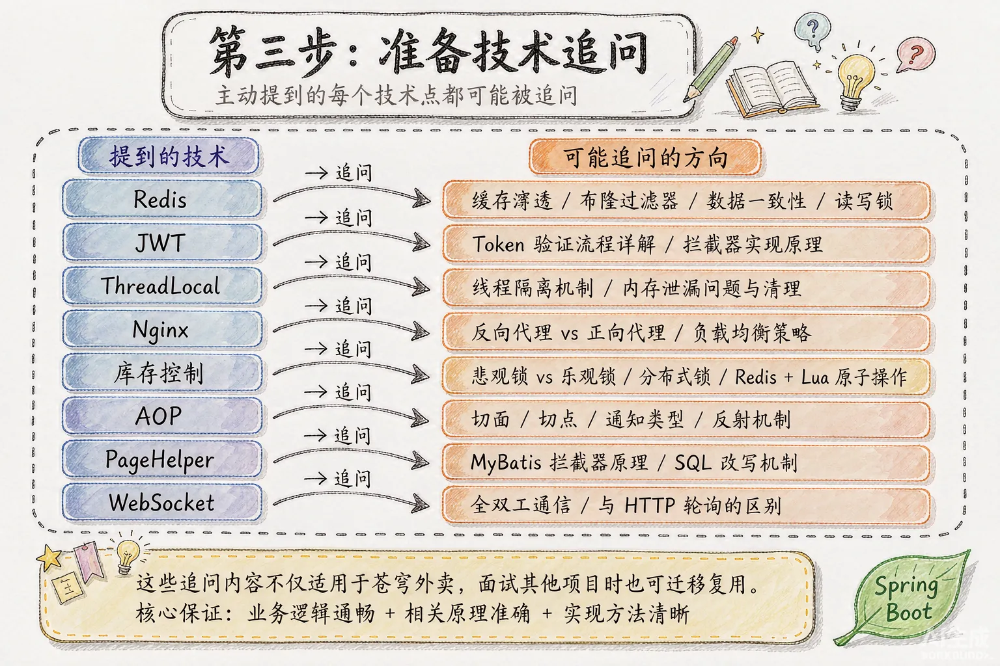

面试官通常会根据你主动提到的技术继续追问。例如：

- 提到 Redis，可能追问缓存穿透、布隆过滤器和数据一致性；
- 提到 JWT，可能追问 Token 验证流程和拦截器；
- 提到 ThreadLocal，可能追问线程隔离及内存泄漏问题；
- 提到 Nginx，可能追问反向代理与负载均衡；
- 提到库存控制，可能追问悲观锁、乐观锁、分布式锁和 Lua 脚本；
- 提到 AOP，可能追问切面、切点、通知和反射；
- 提到 PageHelper，可能追问分页插件的实现原理；
- 提到 WebSocket，可能追问它与 HTTP 轮询的区别。

这些内容不仅可以用于苍穹外卖项目。面试其他项目时，如果业务场景合适，也可以把相应技术方案迁移过去。核心是保证自己的业务逻辑通畅，相关原理与实现方法准确。

面试官通常会根据你主动提到的技术继续追问。例如：

- 提到 Redis，可能追问缓存穿透、布隆过滤器和数据一致性；
- 提到 JWT，可能追问 Token 验证流程和拦截器；
- 提到 ThreadLocal，可能追问线程隔离及内存泄漏问题；
- 提到 Nginx，可能追问反向代理与负载均衡；
- 提到库存控制，可能追问悲观锁、乐观锁、分布式锁和 Lua 脚本；
- 提到 AOP，可能追问切面、切点、通知和反射；
- 提到 PageHelper，可能追问分页插件的实现原理；
- 提到 WebSocket，可能追问它与 HTTP 轮询的区别。

这些内容不仅可以用于苍穹外卖项目。面试其他项目时，如果业务场景合适，也可以把相应技术方案迁移过去。核心是保证自己的业务逻辑通畅，相关原理与实现方法准确。
