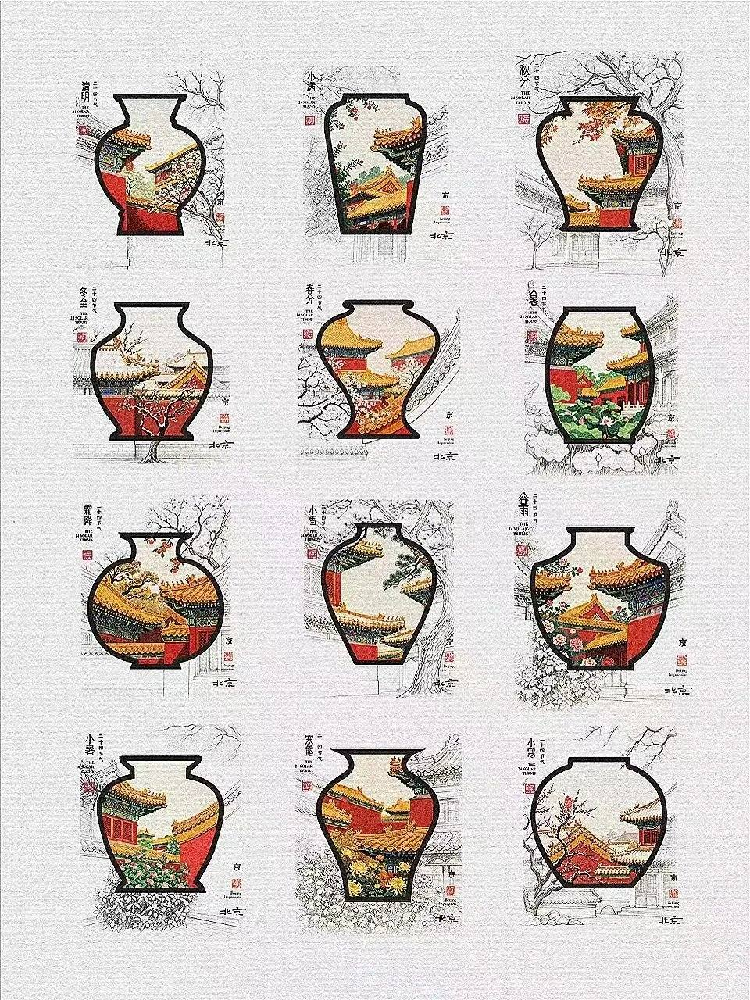
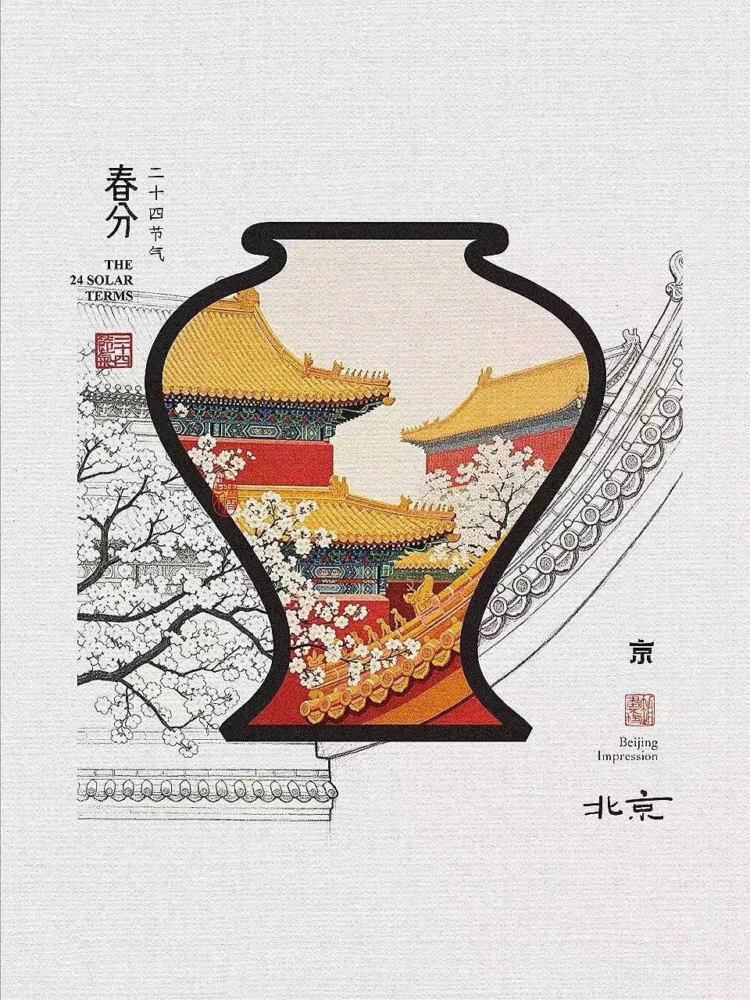
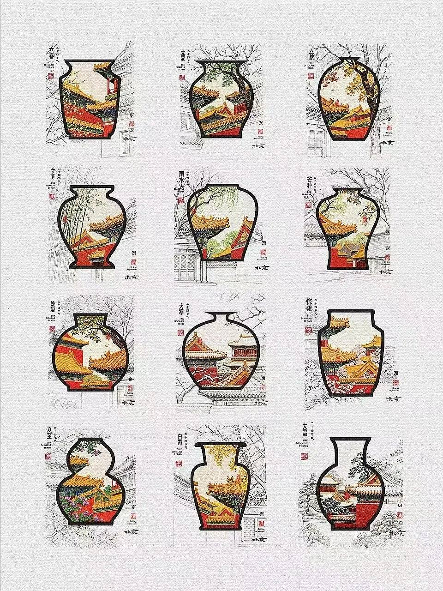
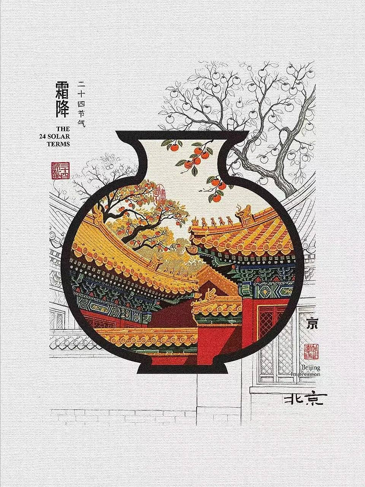
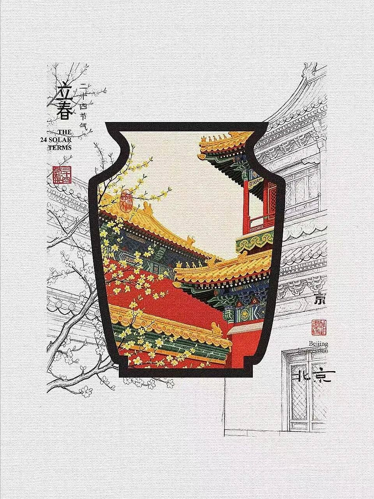
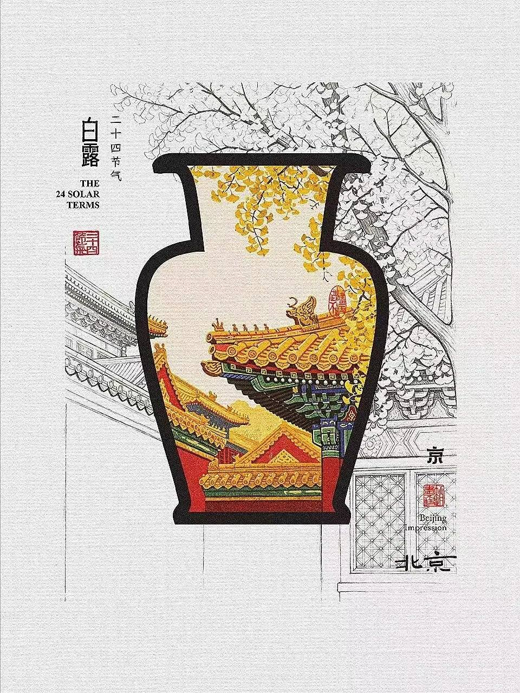

公众号几乎没写技法长文，甩出来的是一整套「节气 × 红墙」插画。对我来说够用了：审美参考进库，版权红线写死，别当免费素材库。

同日视觉品味旁链：[LogoLounge 2026 十五刀](/posts/logolounge-2026-trends/) · [六张海报刀法](/posts/creative-poster-gallery/)（均仍在草稿箱，本地可开）。

## 这套图到底好看在哪

同一套母题打二十四节气（目标如此），辨识度拉满：

- 瓶形开窗：粗黑瓶廓当取景框，瓶口形状会随节气换（梅瓶、葫芦、琮式等）
- 瓶内：彩绘紫禁城——红墙、黄瓦、斗拱彩绘，再叠当季花木物候
- 瓶外：线稿把屋顶、枝干、地面砌砖延出去，像草稿没上色，和瓶内饱和色硬碰
- 角落固定「二十四节气 / THE 24 SOLAR TERMS」+「京 / Beijing Impression」印章位

看一眼就知道是系列，不是散张网图。

## 构图语法：有色窗 + 无色延展

| 层 | 做什么 |
|---|---|
| 轮廓 | 瓶 / 壶剪影 = 色块边界 |
| 内景 | 建筑恒定（红墙黄瓦），物候换季 |
| 外延 | 同场景线稿溢出，纸本底纹托住留白 |
| 信息 | 左上节气名竖排，右下地点印 |

做 PPT / 信息图时，记「有色窗 + 无色延展」这一刀就够。别去描人家的紫禁城细节——描了就是踩红线。

## 本批实际收了哪些

诚实说：未收齐二十四。原料是两套 12 格合集 + 8 张单幅；`大暑` 在 A/B 两套合集里各出现一次。去重后可见 23 个节气名，缺大寒（留言也有人喊缺节气；另有「猫儿不见了」——原作彩蛋或后续补图，本批图里没对上猫）。

### 合集网格 A（12）

清明 · 小满 · 秋分 · 冬至 · 春分 · 大暑 · 霜降 · 小雪 · 谷雨 · 小暑 · 寒露 · 小寒

### 合集网格 B（12）

立春 · 立夏 · 立秋 · 立冬 · 雨水 · 芒种 · 处暑 · 大暑 · 惊蛰 · 夏至 · 白露 · 大雪

### 单幅代表

| 节气 | 本稿 |
|---|---|
| 春分 | 有 |
| 霜降 | 有 |
| 立春 | 有 |
| 白露 | 有 |

## 版权红线（别装没看见）

原文口径很硬，归档时原样遵守：

1. 原图约 3000×4000 / 300dpi（本批落盘为公众号压缩预览图，勿当印刷母版）
2. 禁商用 · 禁临摹 · 禁二创
3. 使用须书面授权；转载保留水印
4. 本稿 = 个人学习归档，不授权二次传播、不授权改图出周边、不授权当 AI 训练集样张去「复刻同款」

留言区有人夸好看——夸归夸，手别伸。
