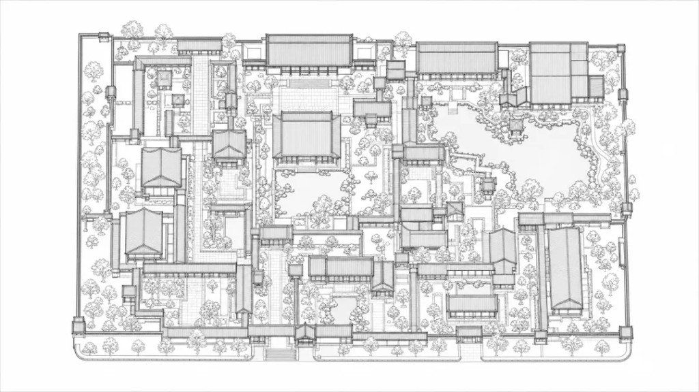
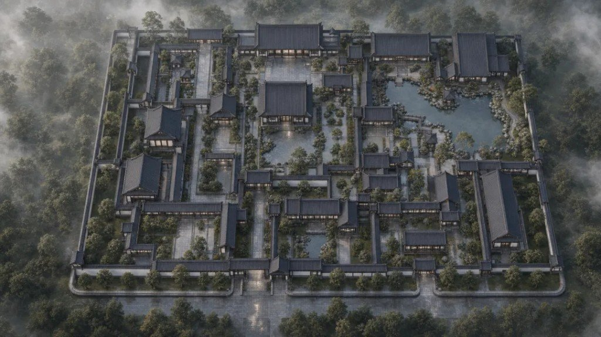
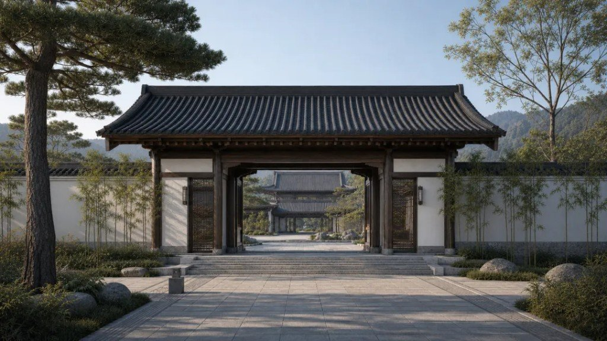
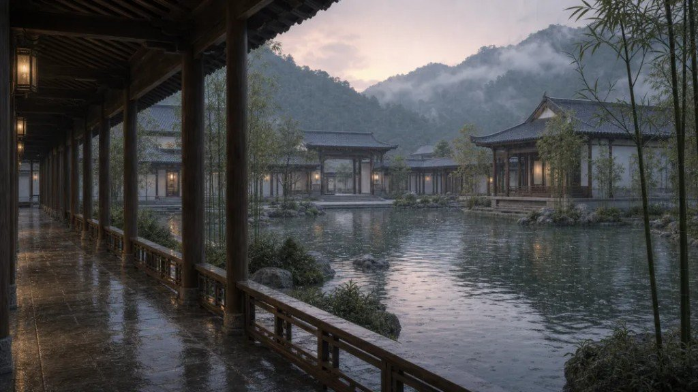
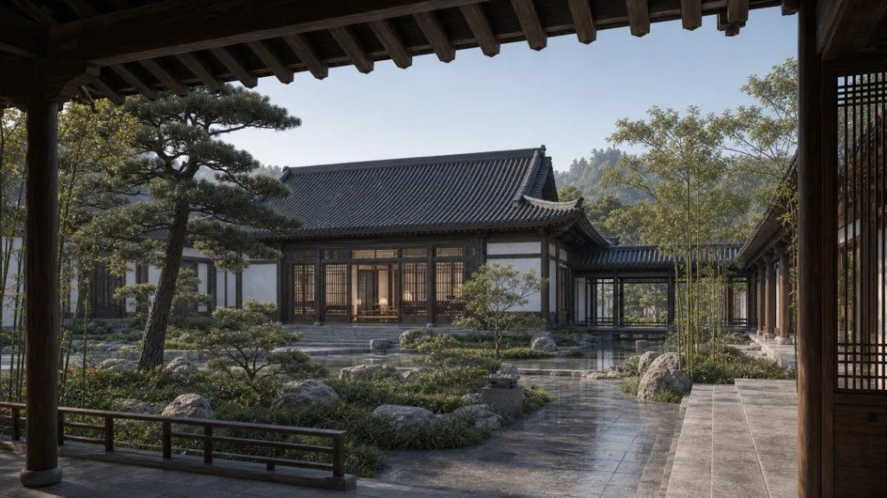
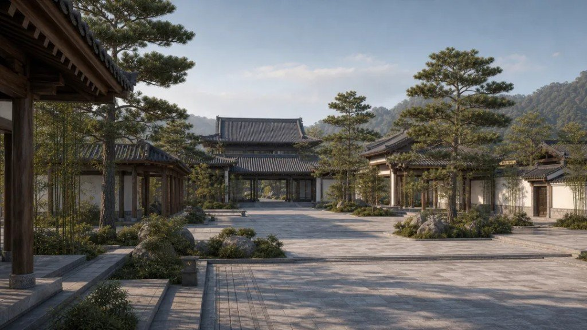
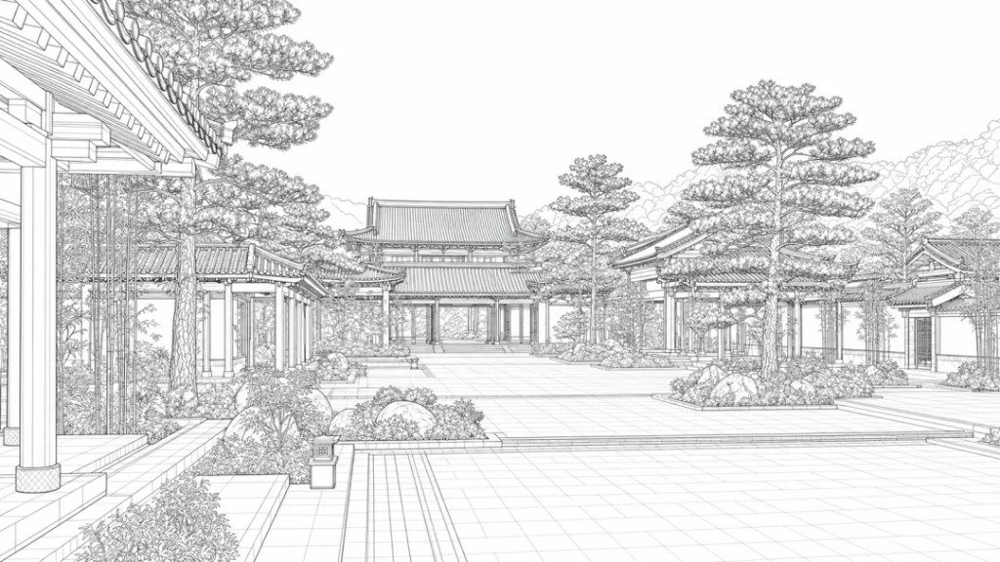
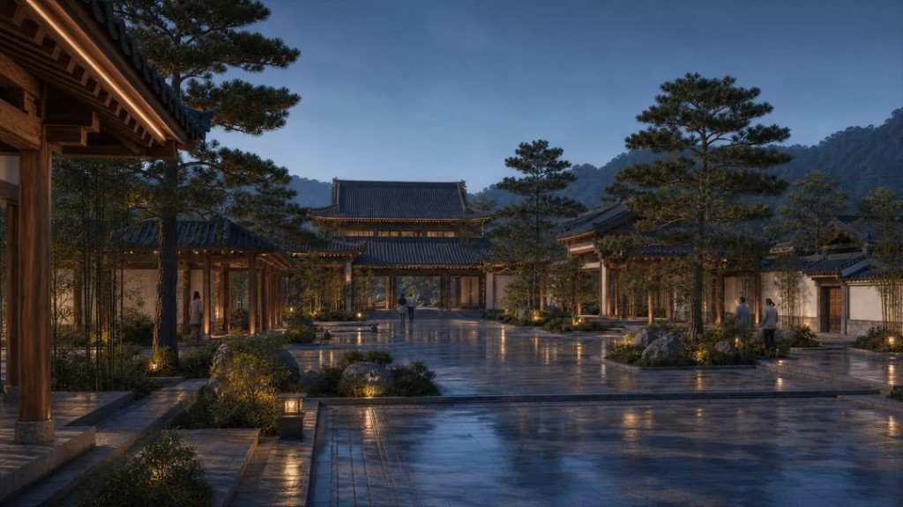
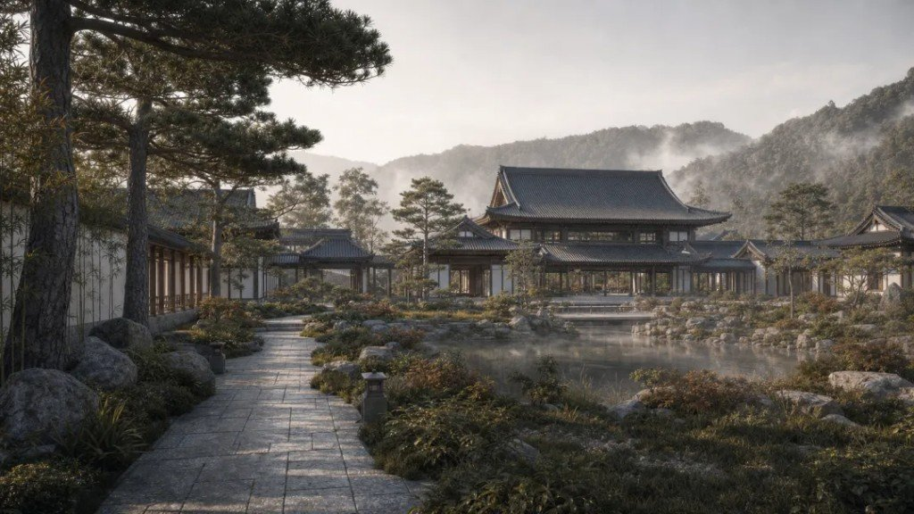
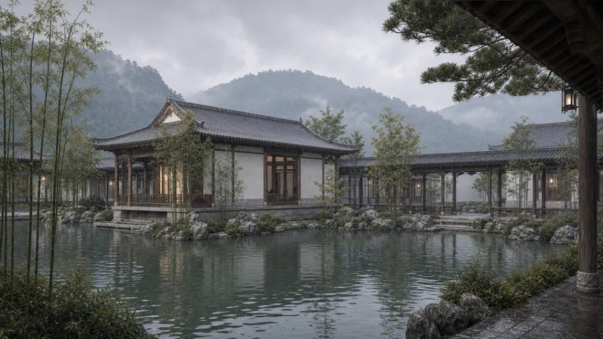

生成一张漂亮的古建筑效果图并不难。难的是让总平面、入口、庭院、水院、书院与夜景都属于**同一个园区**。

单张图质量可以很好，但建筑数量、屋顶方向、院落比例和水体位置容易漂移——因为每次生成都在重新设计园区。真正的问题不是提示词长短，而是**状态管理**：布局合同、风格合同、固定机位、参考图顺序、失败返工。

旁链（**不硬并**）：[草图→可交互 Three.js](/posts/sketch-to-interactive-3d-traceform/) 钉单物体参数化；本篇钉的是**园区多机位 + 布局/风格合同**。[好 AGENTS.md 模板](/posts/agents-md-template-six-scenes/) 讲通用路由原则；这里落到四个古代园区 skills。同模型其他交付见文末。


---

## 流程先改定义，再谈出图

流程被重新定义为：

需求与分区 → 正交总平面 → 布局锁定合同 → 宋式风格合同 → 固定机位登记 → 参考图约束生成 → 独立线框图 → 跨视角一致性审计

Codex 在这里不是「帮我写一段提示词」的聊天工具，而是工作流执行者：读取项目文件、维护版本目录、调用图像接口、检查尺寸、生成审计记录，并把反复使用的方法沉淀为 skills。OpenAI 的 Codex 用例也将「把重复工作保存为 skills」列为正式工作方式。

---

## 第一步：先锁定总平面

项目首先生成严格俯视的园区线框图，把南侧主入口、南北主轴、中央大殿、西侧水院、东侧书院、北侧后园、围墙、连廊和道路固定下来。



与图片同时保存的 `LAYOUT_LOCK.md` 明确规定：后续可以改变机位、天气、季节、灯光和人物活动，但不能移动、旋转或增删主要建筑，也不能改变庭院、水体、连廊和入口关系。

本阶段的核心 Prompt 直接要求模型把鸟瞰图转换为正交建筑线框，而不是重新设计：

```text
Transform the reference aerial rendering into a precise orthographic
top-down architectural wireframe master plan of the exact same campus.
Preserve every major building footprint, courtyard, wall, covered corridor,
pond, path and landscape boundary. Remove perspective and render north-up
on a white background. No shading, photorealism, labels, dimensions,
logo or watermark.
```



[^layout-juxtapose]

这一步非常关键。效果图不再决定布局，布局反过来约束效果图。

---

## 第二步：把「宋代感」写成设计系统

「古风」「宋代建筑」都太宽泛，必须进一步拆成可检查的规则：

- 灰色陶瓦与克制的屋面起翘
- 深出檐、深色原木柱梁与稳定开间
- 暖白墙体、青灰石铺地
- 松、竹、山石、水面与雾山背景
- 当代无障碍、玻璃和照明只能低调嵌入
- 排除明清式红金装饰、日式神社符号、奇幻屋顶和主题乐园化表达

主入口图被选为风格母图。之后每个机位都按固定顺序输入：总平面线框、风格母图、可选的已批准局部视角。GPT Image 2 的图像编辑能力使「参考既有设计并改变视角或氛围」成为可执行路径，而不是每次从文本重新开始。



本阶段 Prompt 不使用抽象的「古风」，而是明确屋面、木构、墙体、铺地、植物和排除项：

```text
Use gray clay tile roofs, moderate roof curvature, deep eaves, dark
natural timber frames, stable structural bay rhythm, warm white lime
walls and blue-gray stone paving. Use pine, bamboo, scholar rocks,
still water and misty mountain context. Exclude imperial red and gold,
ornate Ming-Qing motifs, Japanese shrine markers, fantasy roofs, neon,
readable text and watermarks.
```





---

## 第三步：拆成四个 skills，用 AGENTS.md 路由

为了避免职责混乱，项目没有保留一个巨大的「万能 skill」，而是拆成四个阶段：

| Skill | 职责 |
|---|---|
| `plan-ancient-campus-layout` | 总平面、轴线、分区和布局合同 |
| `define-ancient-campus-style` | 朝代语言、构造比例、材料和禁用元素 |
| `render-ancient-campus-views` | 固定机位和参考图约束生成 |
| `audit-ancient-campus-consistency` | 逐图核对、问题分级和定向返工 |

根目录 `AGENTS.md` 负责路由：新项目必须依次执行四个 skills，后续阶段不得修改前一阶段已经批准的合同。这让设计过程从一次对话变成可以复用、检查和继续迭代的项目资产。[^skills-route]

[^skill-repo]

每个多机位任务都使用同一条参考顺序约束：

```text
Image 1 is the immutable orthographic site plan.
Image 2 is the immutable Song-inspired architectural system.
Image 3, when provided, is only a local camera and facade reference.
Change only camera, lighting, weather, season and requested visitor activity.
Preserve complete layout, architecture, materials and landmarks.
```

---

## 第四步：效果图与线框图一一对应

最终方案包含八个独立机位：总体鸟瞰、主入口、中央庭院、水院廊桥、书院内院、中央夜景、北侧后园和临水茶亭。每个机位都有独立效果图，也有独立透视线框图，不把多个视角合并成一张交付图。





线框图通过图像编辑从已批准效果图转换而来，要求保持原机位、屋顶、柱网、墙体、庭院、水体和景观轮廓，只移除颜色、材质、光影和人物。这些线框适合概念沟通，但不能替代从统一三维模型导出的工程投影。

```text
Convert this exact approved camera view into a clean professional
architectural perspective wireframe. Preserve the identical camera,
framing, building positions, roof directions, columns, walls, corridors,
pond edges, paths and trees. Change only rendering style. One view only;
no collage, split screen or text.
```

夜景使用白天中央庭院作为第三张参考图，只改变光线和活动：



---

## 一致性不是「看起来差不多」

审计阶段按文件名逐张检查：

- 建筑数量、主轴、入口、庭院、水体和连廊是否匹配总平面
- 屋顶方向、坡度、出檐、柱网、墙体和开间是否匹配风格母图
- 松竹、铺地、山石、水面和远山是否属于同一环境
- 白天与夜景是否仍是同一栋建筑、同一个空间
- 是否出现文字、水印、现代高楼、日式构件或红金宫殿化装饰

项目 V3 的概念审计没有发现 blocker 或 major 问题，但仍保留一个明确边界：参考图约束能够提高视觉一致性，**不能**保证坐标、尺寸和构件在不同视角下达到施工级一致。概念一致 ≠ 几何 / 施工级一致。

```text
Audit every filename against the canonical site plan, layout contract
and style reference. Check building count, axis, gates, courtyards, pond,
corridors, roof direction, bay rhythm, materials and day/night identity.
Classify each finding as blocker, major or minor. Name the exact file
and regenerate only the failing view.
```





---

## Codex 与 GPT Image 2 的分工

| Codex | GPT Image 2 |
|---|---|
| 管理目录、合同、版本和机位 | 生成或编辑具体图像 |
| 将流程拆成 skills | 根据多张参考图完成视觉转换 |
| 调用工具并等待长任务 | 处理构图、材质、光线与氛围 |
| 检查尺寸、文件和跨图一致性 | 输出效果图与线框图 |
| 记录失败原因和返工规则 | 按目标修改单张失败图 |

真正提升稳定性的不是更长的提示词，而是把图像模型放进一个有状态、有合同、有版本、有验收的工程流程。

---

## 顺序不能反，边界要认

第一，先做布局，再做风格，最后做多机位。顺序不能反。

第二，相关场景必须使用图像编辑和共同参考图，不要用八段独立文本生成八张图。

第三，概念一致性与几何一致性是两件事。

若项目进入技术设计阶段，应把确定性总平面转成 CAD、SketchUp、Blender 或其他统一三维模型，从同一模型输出各机位结构图，再用 GPT Image 2 做材质和氛围增强。

---

## 评论里吵过的几件事

- **Work Buddy / API**：有人问 Work Buddy 怎么连 GPT Image 2；作者称自己基本走 Codex，Work Buddy 侧多半要用 API（型号命名混乱：image 2.0 / v2 / Pro 并不等于 GPT Image 2）。
- **AI 感**：有人嫌图 AI 味重；作者回应 AI 抹不掉创意，但可替掉低效低质环节、压成本。另有读者称自己也做类似流，直出 AI 感重后换了别的生图路径。
- **做成服务**：有人建议产品化；作者称准备把建筑设计到室内软装串成项目。

---

## 同模型不同交付（旁链）

- GPT-Image2 玩法盘点 55–75（待发布）
- [UI 分层切图](/posts/gpt-image2-ui-layer-slice/)
- 高张力海报七风格（待发布）
- 竹林现代东方美术馆长 Prompt（待发布，建筑向单场景，非园区合同链）

[^layout-juxtapose]: 文称「总平面与效果图并置对照」；本套附件第 3 张与第 1 张鸟瞰 MD5 相同，未单独给出并置拼图。
[^skills-route]: 文称有「四个 skills 的路由关系」示意；附件未单独给出架构图，正文不编造插图。
[^skill-repo]: 四个 skill 名称按原文保留；公开仓库 URL 原文未给出，此处不补编。
