大家好，我是程序员Dan。今天想和大家一起总结一下计算机校园招聘中，Java 开发岗位经常提问的 Spring 八股知识点。我们可以通过思维导图的方式，理清整个 Spring 家族及其相关考点的脉络。

## Spring 家族核心框架
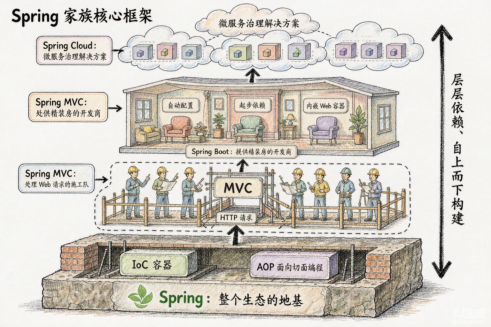

## Spring：整个生态的地基
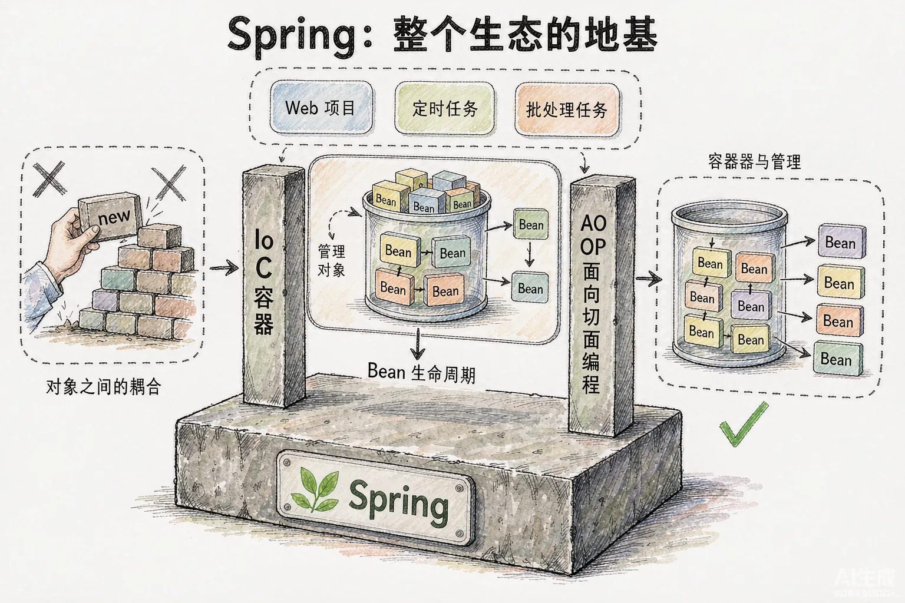

首先需要弄清楚：**Spring、Spring MVC、Spring Boot 和 Spring Cloud 分别是什么，它们之间又有什么关系。**如果要面试 Java 开发岗位，这部分内容是必须掌握的。

简单来说，Spring 是一个庞大的家族生态，它最核心的地基是：

- **IoC 容器**
- **AOP 面向切面编程**

Spring 主要解决 Java 开发中对象之间的耦合问题。以前我们可能需要自己 `new` 一个对象，现在则由 Spring 统一管理所有 Bean 及其生命周期。

Spring 本身并不关心你做的是 Web 项目、定时任务还是批处理任务，它最核心的职责就是**管理对象**。

## Spring MVC：处理 Web 请求的施工队
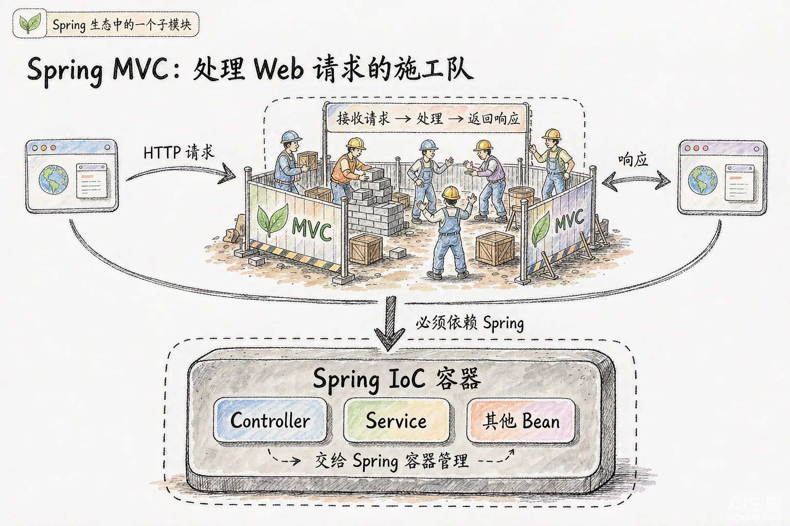

如果说 Spring 是“地基加生态”，那么 Spring MVC 就像一支专门处理 Web 请求的施工队。它是 Spring 生态中的一个子模块，负责接收前端发来的 HTTP 请求并返回响应。

Spring MVC 必须依赖 Spring，因为它本身不负责提供独立的 IoC 容器，而是把 Controller、Service 等对象交给 Spring 容器管理。

## Spring Boot：提供精装房的开发商
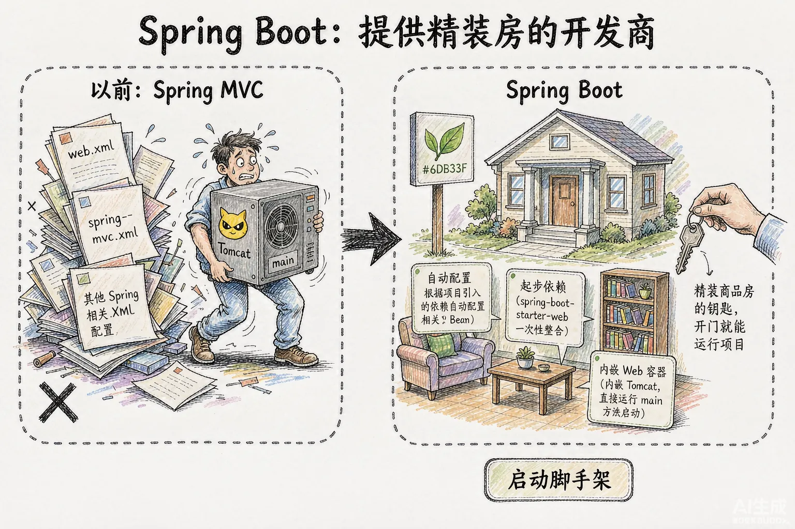

Spring Boot 有点像提供精装商品房的开发商。它并不是一个全新的框架，而是建立在 Spring 和 Spring MVC 之上的**启动脚手架**。

以前使用 Spring MVC 时，可能要编写大量配置文件，例如：

- `web.xml`
- `spring-mvc.xml`
- 其他 Spring 相关 XML 配置

同时还要手动下载、安装和部署 Tomcat。Spring Boot 主要做了三件大事：

1. **自动配置**  
   根据项目引入的依赖，自动配置相关 Bean。

2. **起步依赖**  
   例如引入 `spring-boot-starter-web`，相关依赖就会被一次性整合进来。

3. **内嵌 Web 容器**  
   Spring Boot 内嵌 Tomcat 等服务器，因此不需要手动安装 Tomcat，直接运行 `main` 方法即可启动项目。

> 以前自己做建筑，需要买水泥、砌墙、装水电，最后才能入住；Spring Boot 相当于直接把精装商品房的钥匙交给你，开门就能运行项目。

## Spring Cloud：微服务治理解决方案
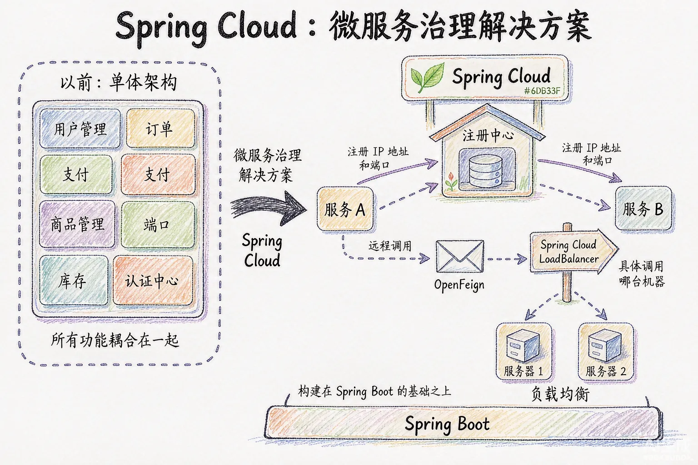

Spring Cloud 是近几年面试中经常涉及的微服务知识。它不像 Spring MVC 那样是一个功能相对集中的单一模块，而是一整套微服务治理解决方案。

在没有微服务之前，项目通常采用单体架构。引入 Spring Cloud 后，可以把系统拆分成多个服务。服务启动时，会把自己的 IP 地址和端口注册到注册中心；其他服务可以通过 OpenFeign 发起远程调用，再由 Spring Cloud LoadBalancer 决定具体调用哪台机器，从而实现负载均衡。

Spring Cloud 构建在 Spring Boot 的基础之上：

> **Spring 提供对象管理能力，Spring MVC 负责 Web 请求，Spring Boot 简化项目开发和启动，Spring Cloud 负责微服务治理。**

## Spring 基础知识与常见注解
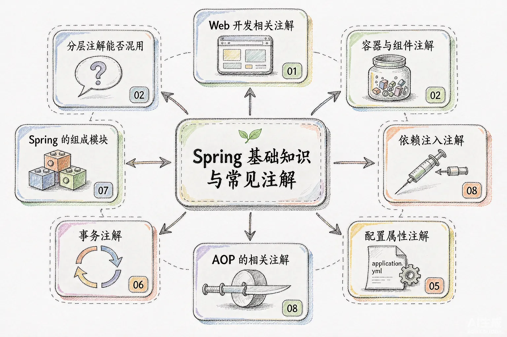

## Web 开发相关注解
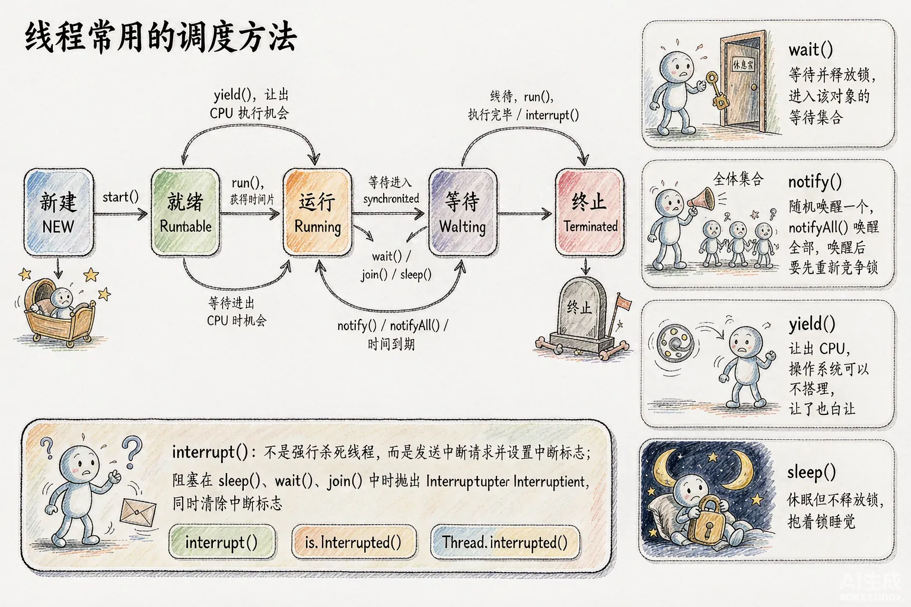

在 Web 开发中，首先需要记住以下常见注解。

### `@Controller` 与 `@RestController`

一般会在类上添加 `@RestController`。这样 Spring 就知道该类中的方法主要用于提供接口，而不是返回页面。

如果只写 `@Controller`，默认返回的通常是 JSP 或 HTML 等页面的逻辑路径。如果想直接返回 JSON 数据，还需要在方法上添加 `@ResponseBody`。

`@RestController` 可以理解为：

```java
@Controller
@ResponseBody
```

因此，使用 `@RestController` 时可以直接返回 JSON 数据。

### 请求映射注解

`@RequestMapping` 用于把请求 URL 映射到具体的处理方法。根据不同的 HTTP 请求方式，还可以使用：

- `@GetMapping`：处理 GET 请求
- `@PostMapping`：处理 POST 请求
- `@DeleteMapping`：处理 DELETE 请求
- `@PutMapping`：处理 PUT 请求

## 容器与组件注解
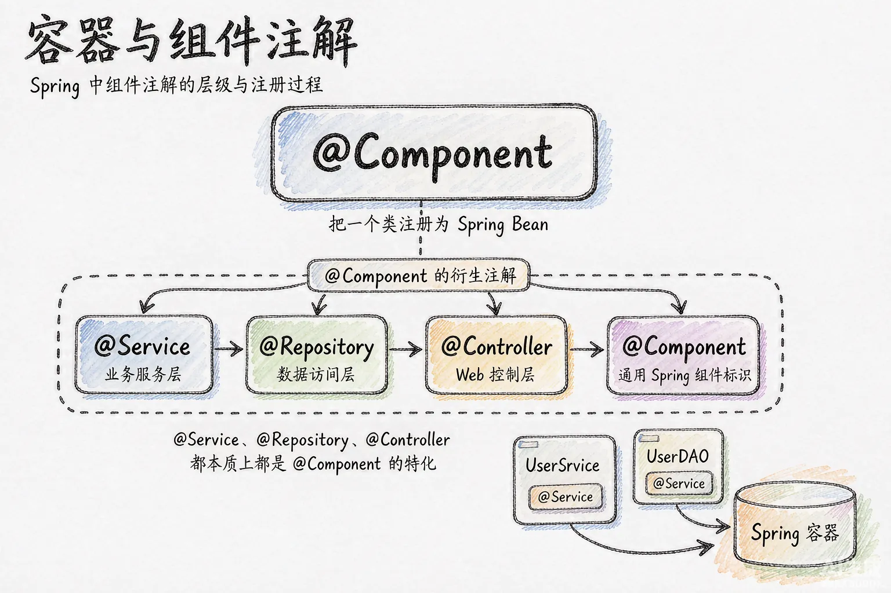

`@Component` 用于把一个类注册为 Spring Bean。在它的基础上，又衍生出了多个具有分层语义的注解：

- `@Service`：通常用于业务服务层
- `@Repository`：通常用于数据访问层
- `@Controller`：通常用于 Web 控制层
- `@Component`：通用的 Spring 组件标识

例如，编写用户服务 `UserService` 时，通常添加 `@Service`；编写 `UserDAO` 时，则可以添加 `@Repository`。

## 依赖注入注解
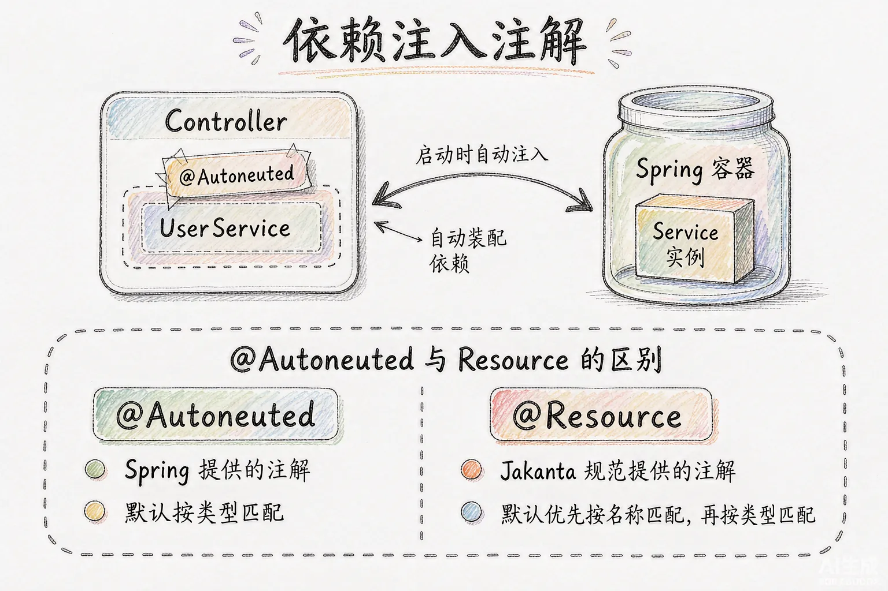

`@Autowired` 用于自动装配依赖。例如，在 Controller 中的 `UserService` 字段上添加 `@Autowired`，Spring 启动时就会自动把对应的 Service 实例注入进来。

面试中也可能会问：**`@Autowired` 和 `@Resource` 有什么区别？**

- `@Autowired` 是 Spring 提供的注解，默认按类型匹配。
- `@Resource` 是 Jakarta/Java 规范提供的注解，默认优先按名称匹配，再按类型匹配。

## 配置属性注解
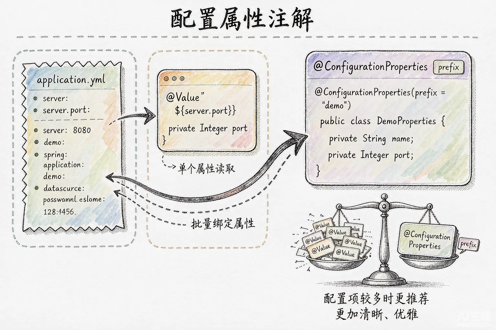

如果想读取 `application.yml` 中的配置，例如把 `server.port` 读取到一个变量中，可以使用 `@Value`：

```java
@Value("${server.port}")
private Integer port;
```

如果配置项较多，更推荐使用 `@ConfigurationProperties` 批量绑定属性。相比一个个编写 `@Value`，这种方式更加清晰、优雅。

## AOP 相关注解
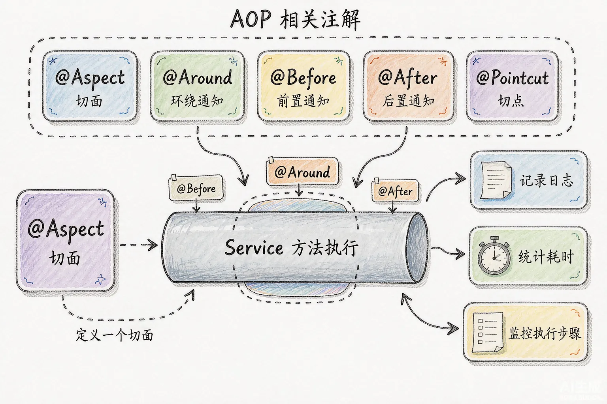

常见的 AOP 注解包括：

- `@Aspect`
- `@Around`
- `@Before`
- `@After`
- `@Pointcut`

例如，可以定义一个切面，通过 `@Around` 环绕通知，在 Service 方法执行前后记录日志、统计耗时或监控执行步骤。

## 事务注解
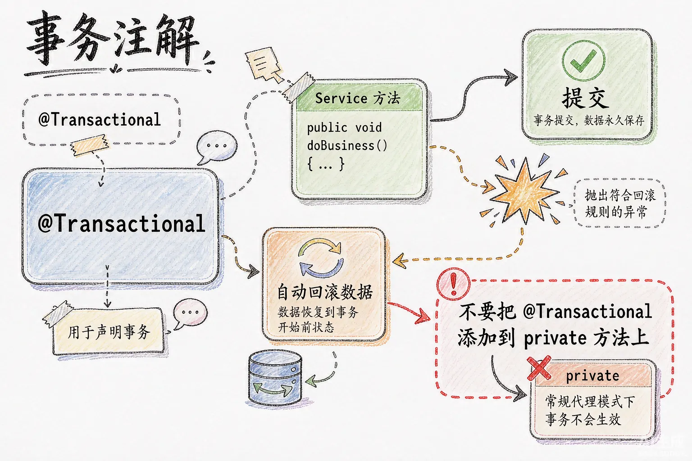

`@Transactional` 用于声明事务。把它添加到 Service 方法上后，如果执行过程中抛出符合回滚规则的异常，Spring 就会自动回滚数据。

需要特别注意：

> **不要把 `@Transactional` 添加到 `private` 方法上，否则在常规代理模式下事务不会生效。**

## Spring 的组成模块
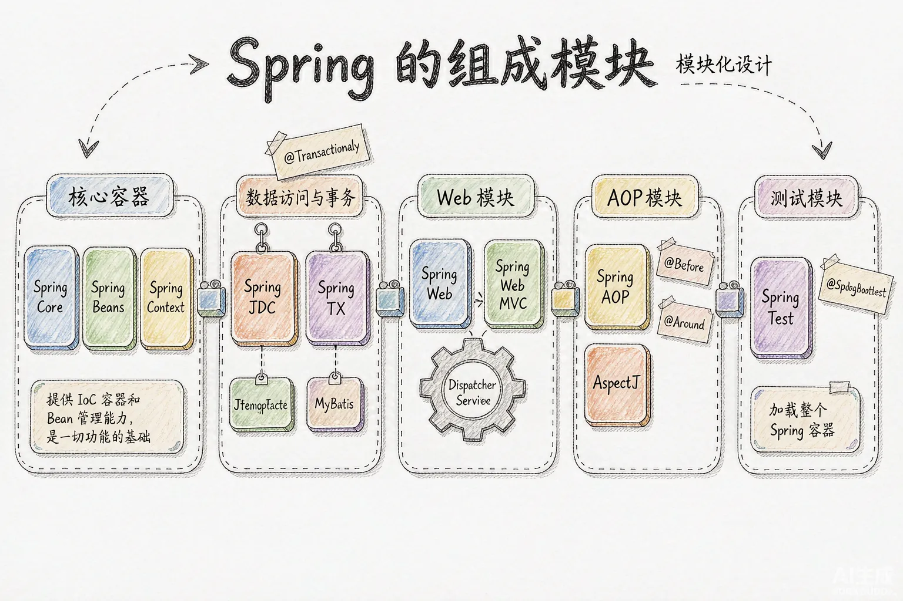

Spring 之所以被称为轻量级框架，其中一个原因就是它采用了**模块化设计**。面试时一般能够说明主要模块及其职责即可，不一定要求展开所有细节。

### 核心容器

核心容器主要包括：

- Spring Core
- Spring Beans
- Spring Context

这些模块是一切功能的基础，负责提供 IoC 容器和 Bean 管理能力。

### 数据访问与事务

数据访问和事务相关模块包括 Spring JDBC、Spring TX 等。引入后可以使用 `JdbcTemplate`、整合 MyBatis，并使用 `@Transactional` 管理事务。

### Web 模块

Web 相关模块包括：

- Spring Web
- Spring Web MVC

编写 Controller 所依赖的 `DispatcherServlet` 就在这些模块中。如果没有引入 Web 模块，通常只能编写非 Web 类型的程序。

### AOP 模块

AOP 相关模块包括 Spring AOP、AspectJ 集成等。引入这些模块后，`@Before`、`@Around` 等通知才能正常发挥作用。

### 测试模块

Spring Test 负责测试支持。使用 `@SpringBootTest` 运行测试时，它可以帮助我们加载整个 Spring 容器，不需要手动 `new` 各种依赖对象。

## 分层注解能否混用
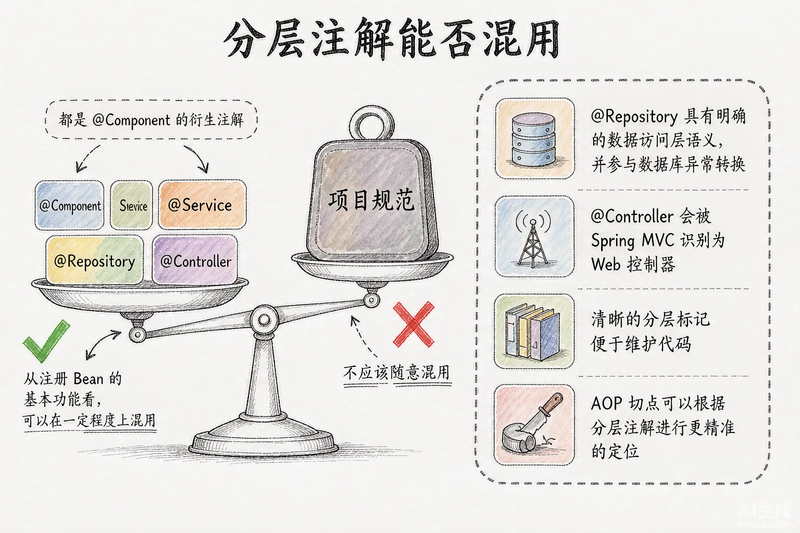

面试官还可能会问：**`@Component`、`@Service`、`@Repository` 和 `@Controller` 能不能混用？**

从注册 Bean 的基本功能来看，它们可以在一定程度上混用，因为 `@Service`、`@Repository` 和 `@Controller` 都是 `@Component` 的衍生注解。

但在项目规范中不应该随意混用，原因包括：

- `@Repository` 具有明确的数据访问层语义，并参与数据库异常转换。
- `@Controller` 会被 Spring MVC 识别为 Web 控制器。
- 清晰的分层标记便于维护代码。
- AOP 切点可以根据分层注解进行更精准的定位。

## IoC、DI 与 Bean 管理
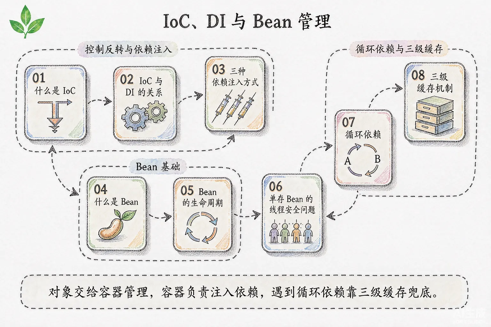

## 什么是 IoC
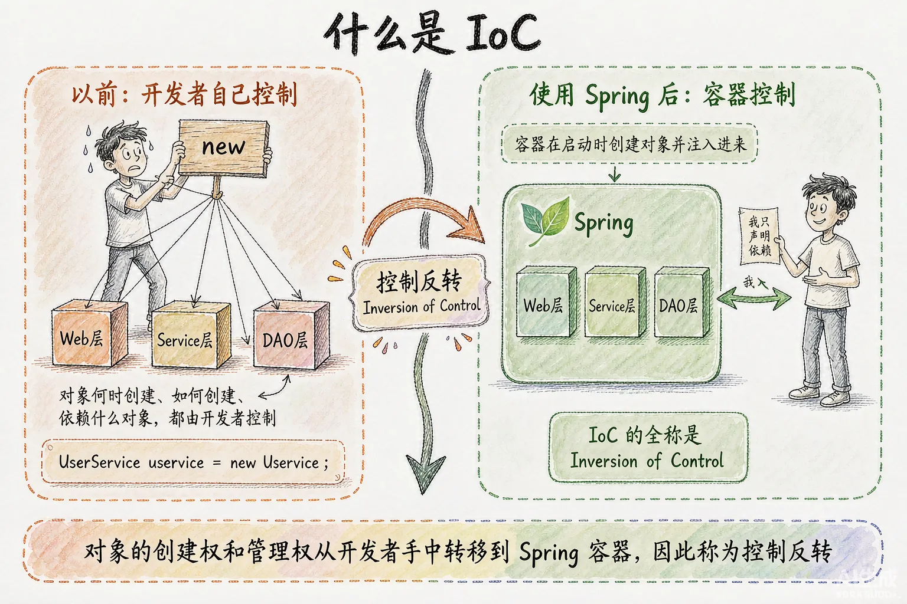

IoC 的全称是 *Inversion of Control*，即**控制反转**。

以前在 Web 层调用 Service 时，开发者需要自己创建对象：

```java
UserService userService = new UserService();
```

这种情况下，对象何时创建、如何创建、依赖什么对象，都由开发者控制。

使用 Spring 后，只需要声明依赖，Spring 就会在启动时创建对象并注入进来。对象的创建权和管理权从开发者手中转移到了 Spring 容器，因此称为“控制反转”。

## IoC 与 DI 的关系
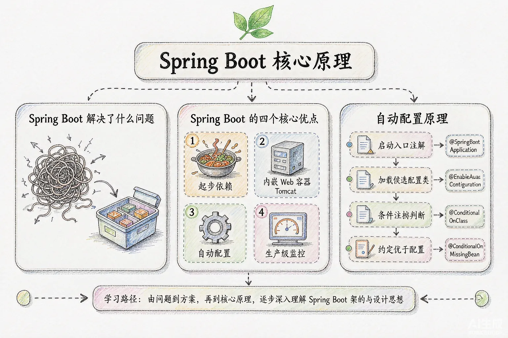

DI 的全称是 *Dependency Injection*，即**依赖注入**。

二者的关系可以概括为：

> **IoC 是一种设计思想，DI 是实现 IoC 的具体方式。**

IoC 表示把对象的控制权交给容器，DI 则是容器把对象所需要的依赖“塞”给它。

## 三种依赖注入方式
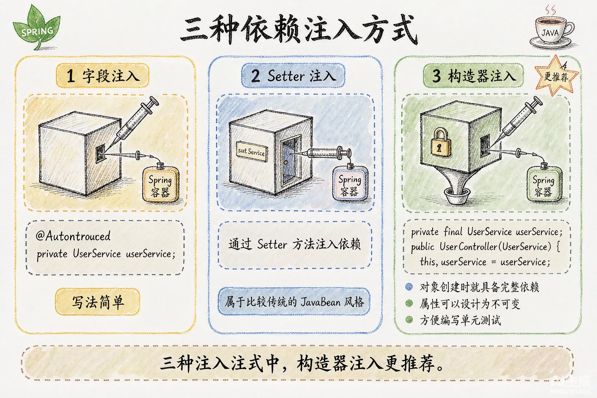

Web 开发中常见的依赖注入方式有三种。

1. **字段注入**

   直接在字段上添加 `@Autowired`，写法简单：

   ```java
   @Autowired
   private UserService userService;
   ```

2. **Setter 注入**

   通过 Setter 方法注入依赖，属于比较传统的 JavaBean 风格。

3. **构造器注入**

   通过构造函数传入依赖，这是更推荐的方式。对象创建时就具备完整依赖，属性可以设计为不可变，也方便编写单元测试。

   ```java
   private final UserService userService;

   public UserController(UserService userService) {
       this.userService = userService;
   }
   ```

## 什么是 Bean
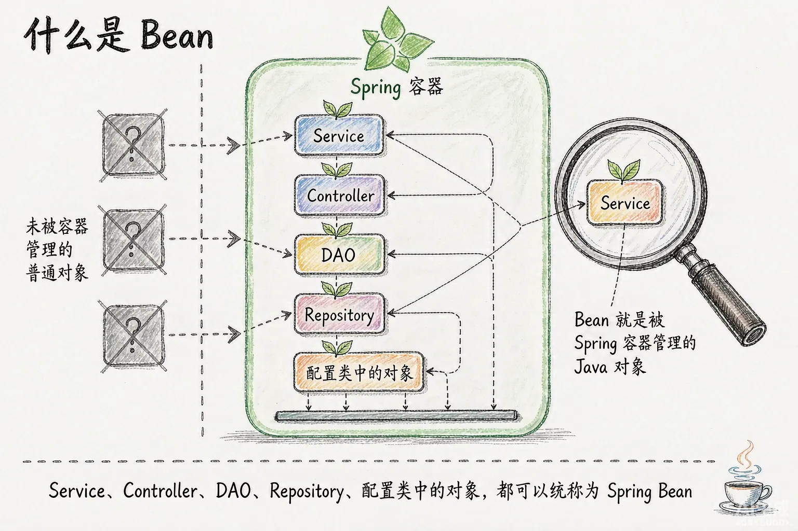

Bean 就是被 Spring 容器管理的 Java 对象。例如：

- Service
- Controller
- DAO
- Repository
- 配置类中的对象

这些对象都可以统称为 Spring Bean。

## Bean 的生命周期
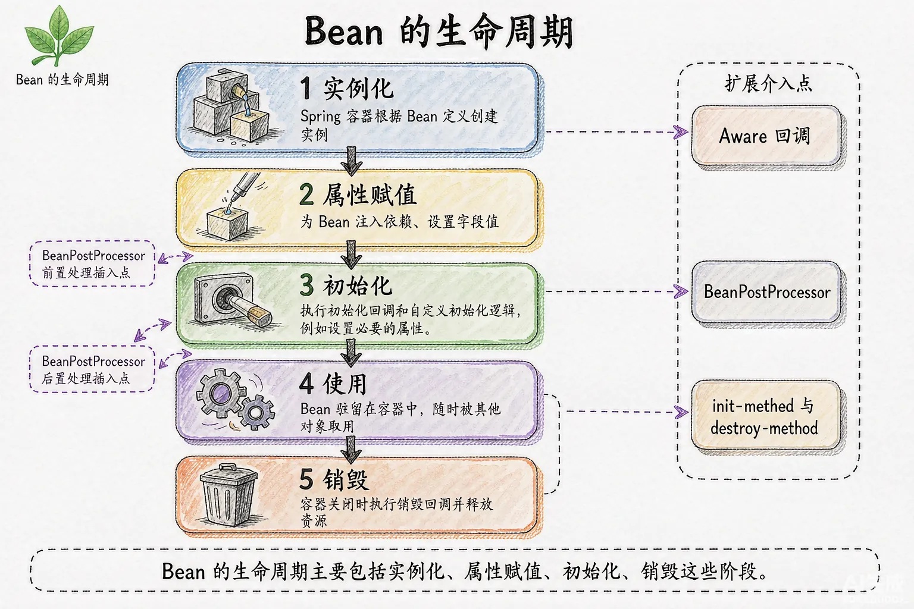

Bean 的生命周期主要包括以下阶段：

1. **实例化**  
   Spring 容器根据 Bean 定义创建实例。

2. **属性赋值**  
   为 Bean 注入依赖、设置字段值。

3. **初始化**  
   执行初始化回调和自定义初始化逻辑，例如设置必要的属性。

4. **销毁**  
   容器关闭时执行销毁回调并释放资源。

## 单例 Bean 的线程安全问题
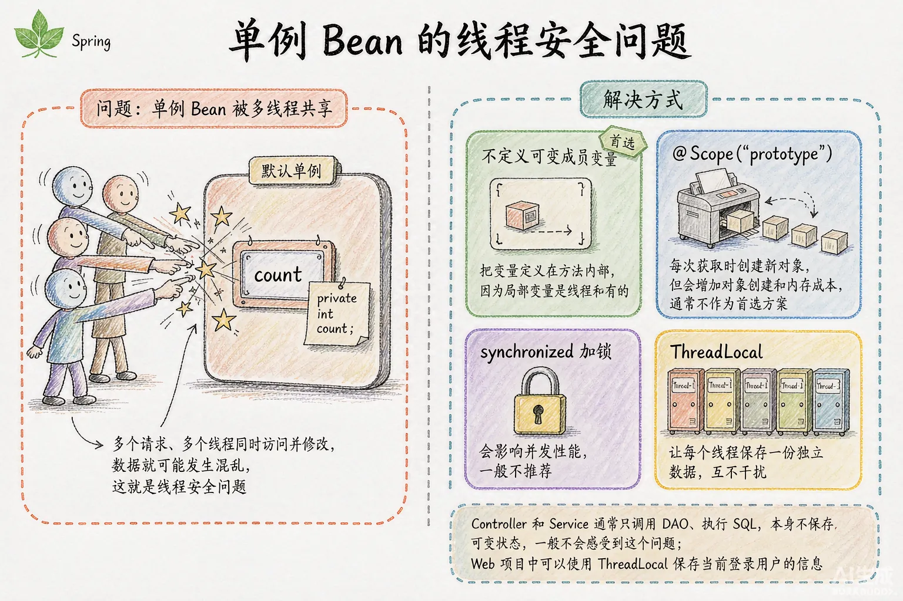

Spring 中的 Bean 默认通常是单例的，即整个应用中只有一个实例。如果在 Service 中定义了可变成员变量，例如：

```java
private int count;
```

多个请求、多个线程同时访问并修改 `count`，数据就可能发生混乱，这就是线程安全问题。

平时编写的 Controller 和 Service 通常只负责调用 DAO、执行 SQL，本身不保存可变状态，因此一般不会感受到这个问题。

解决方式包括：

- **优先不要在单例 Bean 中定义可变成员变量。**把变量定义在方法内部，因为局部变量是线程私有的。
- 使用 `@Scope("prototype")`，让容器每次获取时创建新对象，但会增加对象创建和内存成本，通常不作为首选方案。
- 使用 `synchronized` 加锁，但会影响并发性能，一般不推荐。
- 使用 `ThreadLocal`，让每个线程保存一份独立数据，互不干扰。

例如，在 Web 项目或“苍穹外卖”这类项目中，可以使用 `ThreadLocal` 保存当前登录用户的信息。

## 循环依赖
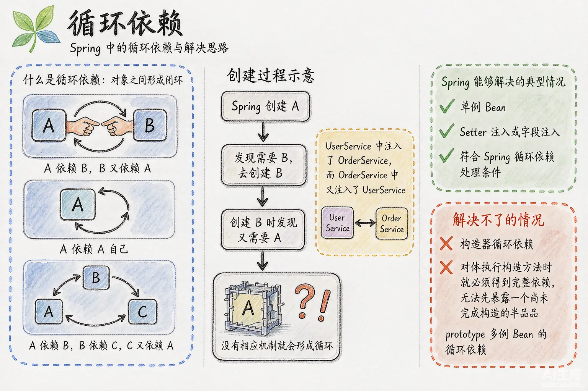

循环依赖指的是对象之间形成闭环依赖，例如：

- A 依赖 B，B 又依赖 A
- A 依赖 A 自己
- A 依赖 B，B 依赖 C，C 又依赖 A

例如，`UserService` 中注入了 `OrderService`，而 `OrderService` 中又注入了 `UserService`。Spring 创建 A 时发现需要 B，于是去创建 B；创建 B 时又发现需要 A，如果没有相应机制，就会形成循环。

Spring 能够解决的典型情况是：

- 单例 Bean
- Setter 注入或字段注入
- 符合 Spring 循环依赖处理条件

Spring 无法通过传统三级缓存机制直接解决构造器循环依赖，因为对象执行构造方法时就必须得到完整依赖，无法先暴露一个尚未完成构造的半成品。

## 三级缓存机制
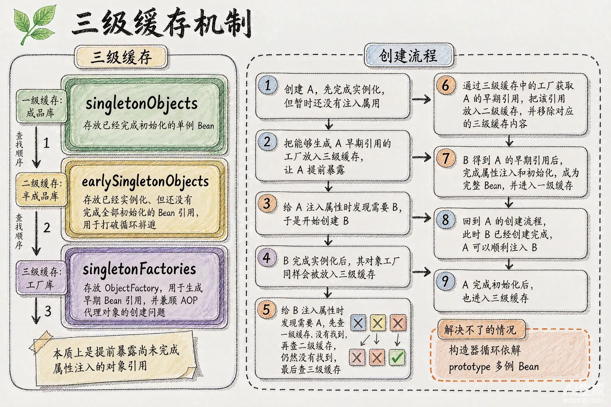

Spring 解决部分循环依赖问题的核心机制是**三级缓存**，本质上是提前暴露尚未完成属性注入的对象引用。

三级缓存分别承担不同职责：

1. **一级缓存：成品库**  
   存放已经完成初始化的单例 Bean。

2. **二级缓存：半成品库**  
   存放已经实例化、但还没有完成全部初始化的 Bean 引用，用于打破循环依赖。

3. **三级缓存：工厂库**  
   存放 `ObjectFactory`，用于生成早期 Bean 引用，并兼顾 AOP 代理对象的创建问题。

以 A 依赖 B、B 又依赖 A 为例：

1. Spring 创建 A，先完成实例化，但暂时还没有注入属性。
2. Spring 把能够生成 A 早期引用的工厂放入三级缓存，让 A 提前暴露。
3. Spring 给 A 注入属性时发现需要 B，于是开始创建 B。
4. B 完成实例化后，其对象工厂同样会被放入三级缓存。
5. Spring 给 B 注入属性时发现需要 A，于是先查一级缓存，没有找到；再查二级缓存，仍然没有找到；最后查三级缓存。
6. Spring 通过三级缓存中的工厂获取 A 的早期引用，把该引用放入二级缓存，并移除对应的三级缓存内容。
7. B 得到 A 的早期引用后，完成属性注入和初始化，成为完整 Bean，并进入一级缓存。
8. 回到 A 的创建流程，此时 B 已经创建完成，A 可以顺利注入 B。
9. A 完成初始化后，也进入一级缓存。

总结来说：

> Spring 通过 IoC 管理 Bean。默认单例模式下，应避免在 Bean 中使用可变成员变量，以保障线程安全。对于部分单例 Bean 的字段注入或 Setter 注入循环依赖，Spring 可以借助三级缓存提前暴露早期引用；构造器循环依赖则无法通过这种方式解决。

## AOP 面向切面编程
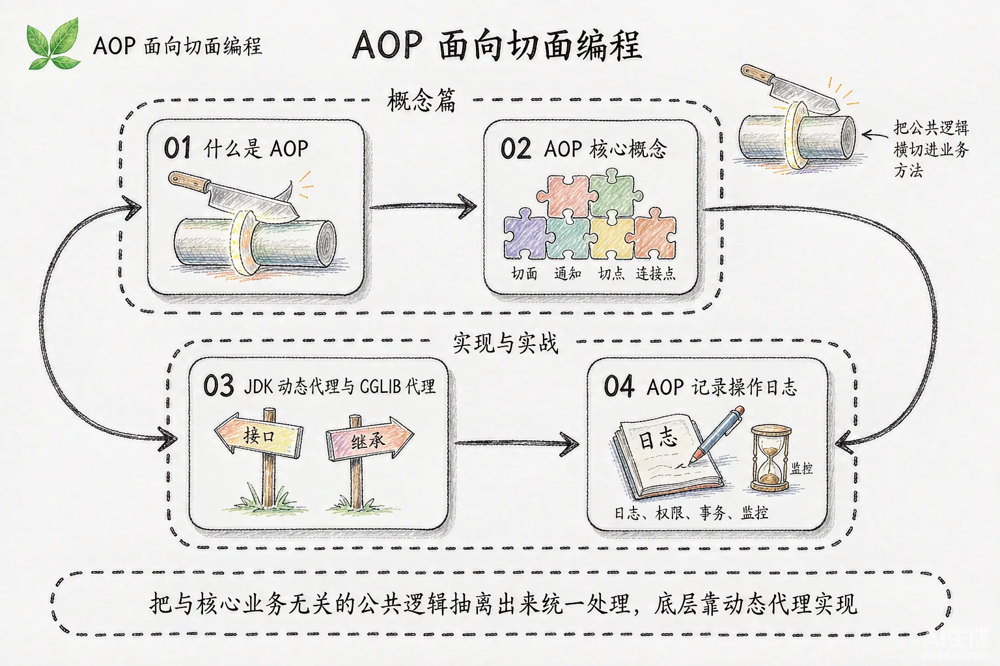

## 什么是 AOP
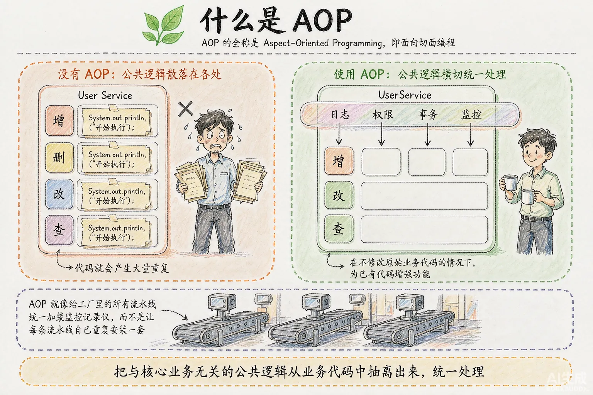

AOP 的全称是 *Aspect-Oriented Programming*，即**面向切面编程**。

它的核心思想是把与核心业务无关的公共逻辑，例如日志、权限、事务、监控等，从业务代码中抽离出来，统一处理。

例如，`UserService` 的核心业务是增删改查，但如果每个方法中都要编写：

```java
System.out.println("开始执行");
```

代码就会产生大量重复。AOP 可以在不修改原始业务代码的情况下，为已有代码增强功能。

> AOP 就像给工厂里的所有流水线统一加装监控记录仪，而不是让每条流水线自己重复安装一套。

## AOP 核心概念
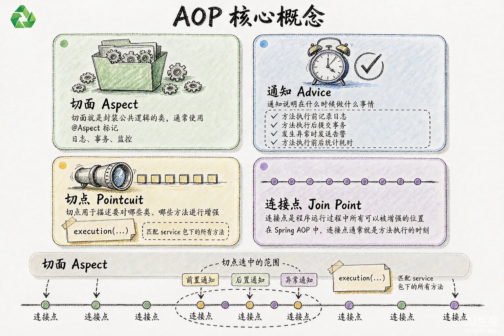

### 切面 Aspect

切面就是封装公共逻辑的类，通常使用 `@Aspect` 标记。切面内部包含日志、事务、监控等需要统一执行的代码。

### 通知 Advice

通知说明“在什么时候做什么事情”，例如：

- 方法执行前记录日志
- 方法执行后提交事务
- 发生异常时发送告警
- 方法执行前后统计耗时

### 切点 Pointcut

切点用于描述要对哪些类、哪些方法进行增强。例如，可以通过 `execution(...)` 表达式匹配 `service` 包下的所有方法。

### 连接点 Join Point

连接点是程序运行过程中所有可以被增强的位置。在 Spring AOP 中，连接点通常就是方法执行的时刻。

## JDK 动态代理与 CGLIB 代理
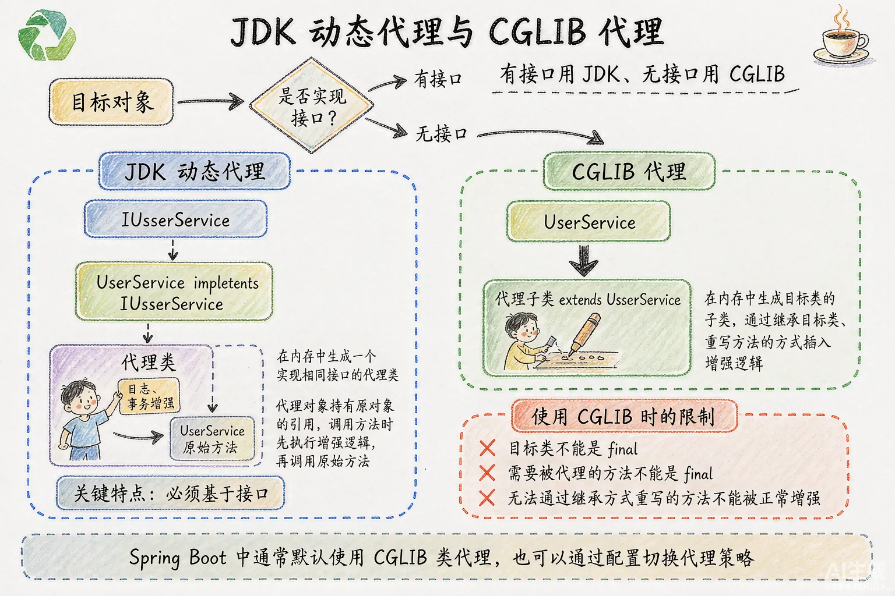

这是面试中提问非常频繁的问题。

### JDK 动态代理

JDK 动态代理要求目标对象实现接口。例如，`UserService` 实现了 `IUserService` 接口，Spring 就可以基于接口创建 JDK 动态代理。

它的原理是在内存中生成一个实现相同接口的代理类。代理对象持有原对象的引用，调用方法时先执行日志、事务等增强逻辑，再调用原始方法。

**关键特点：必须基于接口。**

### CGLIB 代理

如果目标类没有实现接口，可以使用 CGLIB 创建代理。CGLIB 会在内存中生成目标类的子类，通过继承目标类、重写方法的方式插入增强逻辑。

因此，使用 CGLIB 时需要注意：

- 目标类不能是 `final`
- 需要被代理的方法不能是 `final`
- 无法通过继承方式重写的方法不能被正常增强

需要结合具体 Spring 与 Spring Boot 版本、AOP 配置判断最终使用哪种代理。Spring Boot 中通常默认使用 CGLIB 类代理，也可以通过配置切换代理策略。

## AOP 记录操作日志
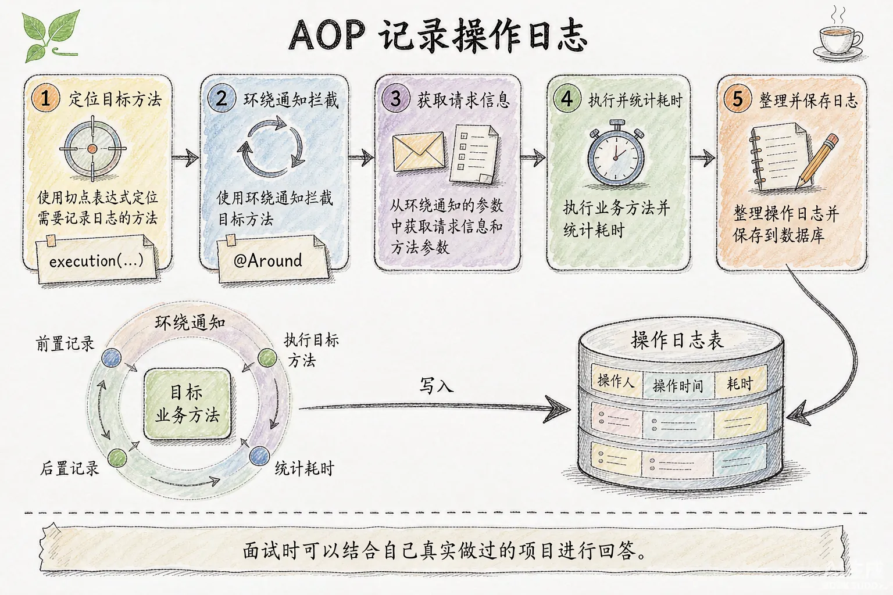

一个典型应用是使用 AOP 记录操作日志，基本思路如下：

1. 使用切点表达式定位需要记录日志的方法。
2. 使用环绕通知拦截目标方法。
3. 从环绕通知的参数中获取请求信息和方法参数。
4. 执行业务方法并统计耗时。
5. 整理操作日志并保存到数据库。

如果学过外卖项目，这类应用一般都接触过。面试时可以结合自己真实做过的项目进行回答。

## Spring MVC 工作流程
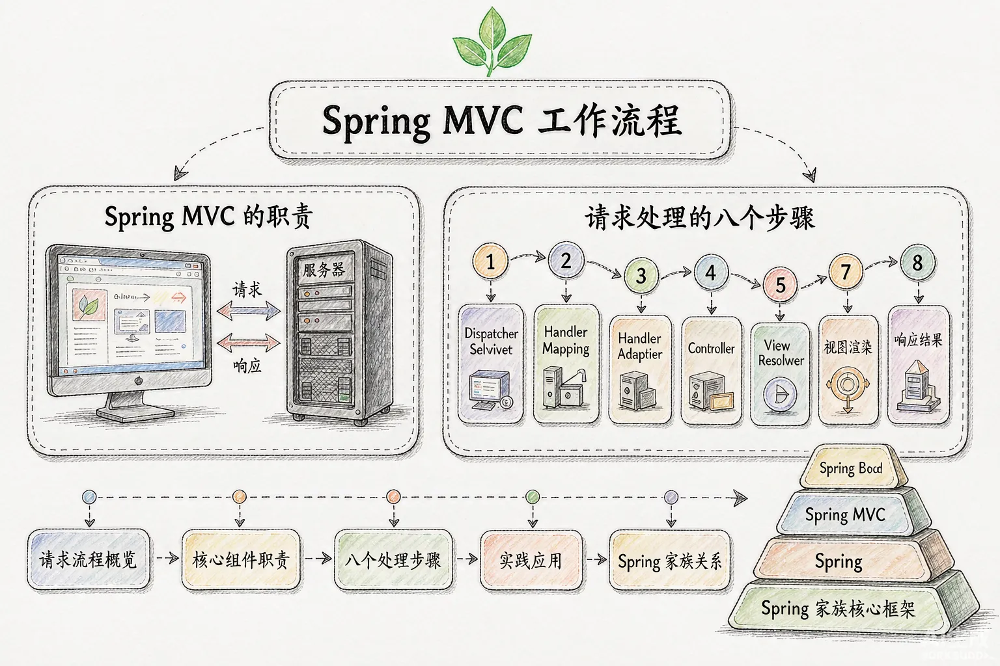

## Spring MVC 的职责
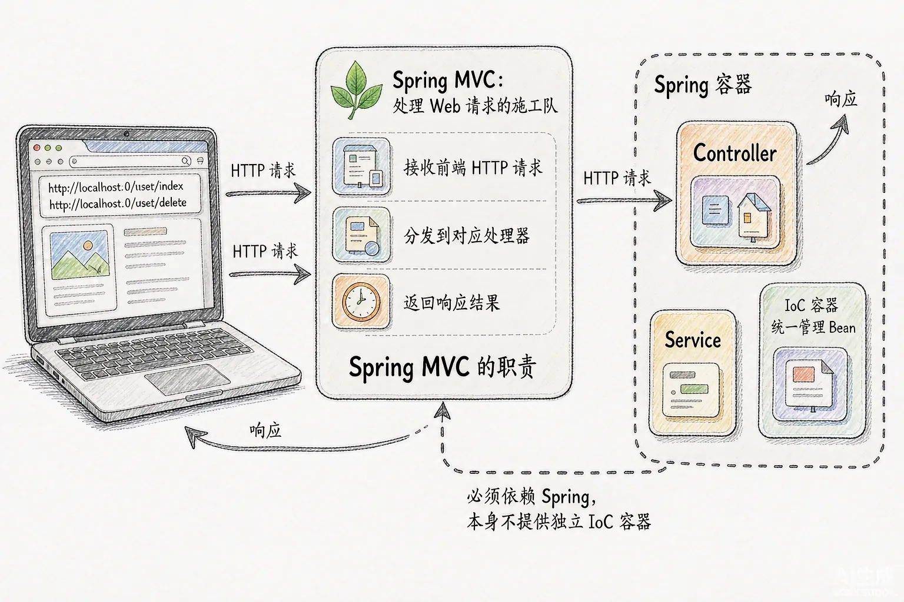

Spring MVC 是 Spring 生态中负责处理 Web 请求的模块。假设用户在浏览器中访问：

```text
http://localhost:8080/user/index
```

或者：

```text
http://localhost:8080/user/delete
```

后台会经历一套完整的请求处理流程。

## 请求处理的八个步骤
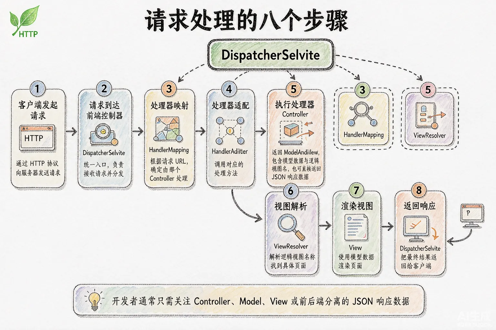

1. **客户端发起请求**  
   客户端通过 HTTP 协议向服务器发送请求。

2. **请求到达前端控制器**  
   请求首先进入 `DispatcherServlet`。它是整个 Spring MVC 流程的统一入口，负责接收请求并把请求分发给其他组件。

3. **处理器映射**  
   `DispatcherServlet` 调用 `HandlerMapping`，根据请求 URL 等信息确定应该由哪个 Controller 处理。

4. **处理器适配**  
   找到目标 Controller 后，`DispatcherServlet` 使用 `HandlerAdapter` 调用对应的处理方法。

5. **执行处理器**  
   Controller 处理请求。传统页面渲染模式下，处理完成后可以返回 `ModelAndView`，其中包含模型数据和逻辑视图名称；前后端分离场景下，也可以直接返回响应数据。

6. **视图解析**  
   `DispatcherServlet` 接收到 `ModelAndView` 后，使用 `ViewResolver` 解析逻辑视图名称，找到具体页面。

7. **渲染视图**  
   视图使用模型数据渲染页面，生成最终内容。

8. **返回响应**  
   `DispatcherServlet` 把最终结果返回给客户端。

Spring MVC 的完整流程看起来比较复杂，但实际开发并不复杂。大部分组件都不需要开发者手动创建和管理，真正需要重点处理的通常是 Controller、Model 和 View，或者前后端分离场景中的 JSON 响应数据。

## Spring Boot 核心原理
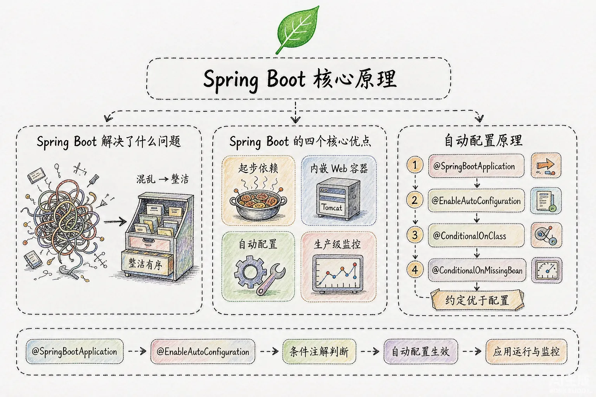

## Spring Boot 解决了什么问题
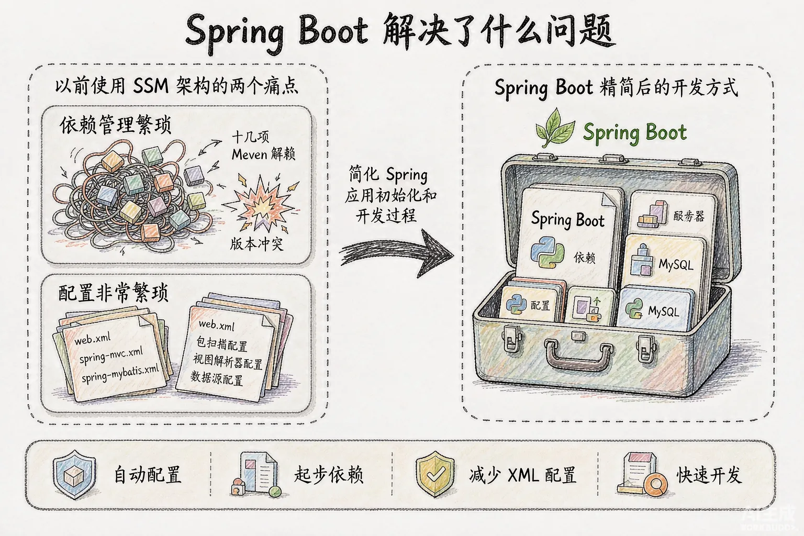

Spring Boot 是一个用于简化 Spring 应用初始化和开发过程的框架。

以前使用 SSM 等架构开发 Java Web 项目时，主要存在两个痛点。

### 依赖管理繁琐

例如整合 MyBatis 时，可能需要引入十几项 Maven 依赖，不同依赖之间还容易发生版本冲突。

### 配置非常繁琐

可能需要编写：

- `web.xml`
- `spring-mvc.xml`
- `spring-mybatis.xml`
- 包扫描配置
- 视图解析器配置
- 数据源配置

Spring Boot 的出现就是为了解决这些痛点。

## Spring Boot 的四个核心优点
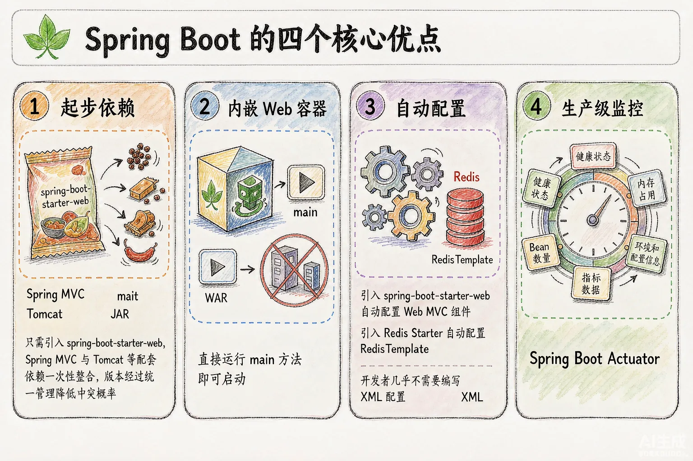

### 1. 起步依赖

进行 Web 开发时，只需要引入：

```xml
spring-boot-starter-web
```

Spring MVC、Tomcat 等相关配套依赖就会被一次性整合进来，而且版本组合经过统一管理和测试，可以大幅降低依赖冲突的概率。

> 以前做火锅，需要自己搭配花椒、牛油、辣椒和各种香料；Spring Boot 相当于直接提供一包已经配好的火锅底料。

### 2. 内嵌 Web 容器

不需要再把项目打成 WAR 包后丢到外部 Tomcat 中。Spring Boot 可以内嵌 Tomcat 或 Jetty，直接运行 `main` 方法即可启动，一个 JAR 包就可以承载整个应用。

### 3. 自动配置

这是 Spring Boot 最核心的优点。引入什么依赖，Spring Boot 就会尝试自动配置对应的 Bean。

例如：

- 引入 `spring-boot-starter-web`，自动配置 Web MVC 相关组件。
- 引入 Redis Starter，自动配置 `RedisTemplate` 等组件。

开发者几乎不需要编写 XML 配置。

### 4. 生产级监控

Spring Boot Actuator 可以通过一系列端点查看应用的：

- 健康状态
- 内存占用
- Bean 数量
- 指标数据
- 环境和配置信息

这些能力对运维和线上排查非常重要。

## 自动配置原理
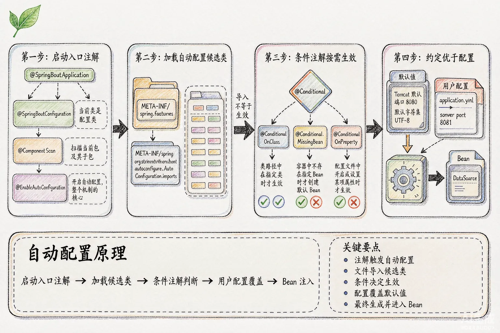

面试官经常会问：

> Spring Boot 是怎么知道项目配置了 MySQL，并自动创建 `DataSource` 的？

可以从以下几个步骤回答。

### 第一步：启动入口注解

启动类上通常有 `@SpringBootApplication`。它是一个组合注解，核心包含：

- `@SpringBootConfiguration`
- `@ComponentScan`
- `@EnableAutoConfiguration`

其中：

- `@SpringBootConfiguration` 表示当前类是配置类。
- `@ComponentScan` 扫描当前包及其子包中的组件。
- `@EnableAutoConfiguration` 开启自动配置，是整个机制的核心。

### 第二步：加载自动配置候选类

`@EnableAutoConfiguration` 内部会通过导入选择器等机制，读取框架声明的自动配置类。

较早版本主要涉及 `META-INF/spring.factories`；较新版本会使用：

```text
META-INF/spring/org.springframework.boot.autoconfigure.AutoConfiguration.imports
```

这些文件中记录了大量自动配置类，例如 Web 配置、数据源配置等。

### 第三步：条件注解按需生效

自动配置类被读取，不代表一定会生效。Spring Boot 会通过一系列条件注解判断当前环境是否满足要求。

常见条件注解包括：

- `@ConditionalOnClass`：类路径中存在指定类时才生效。
- `@ConditionalOnMissingBean`：容器中不存在指定 Bean 时，才创建默认 Bean。
- `@ConditionalOnProperty`：配置文件中开启或设置了某项属性时才生效。

### 第四步：约定优于配置

自动配置会提供大量默认值，例如：

- Tomcat 默认端口为 `8080`
- 默认字符集通常为 UTF-8
- 其他组件的默认参数

这些默认值可能来自自动配置类、属性类和框架内部元数据。如果在 `application.yml` 中显式配置：

```yaml
server:
  port: 8081
```

属性绑定机制就会使用用户配置覆盖默认值，这就是**约定优于配置**。

可以向面试官这样总结：

> Spring Boot 自动配置的核心是 `@EnableAutoConfiguration`。它会导入大量候选自动配置类，但导入不等于生效。Spring Boot 会结合项目依赖、配置属性和 `@Conditional` 系列条件注解进行按需装配。如果容器中已经存在用户自定义的 Bean，默认配置还可以通过 `@ConditionalOnMissingBean` 自动让位，这体现了约定优于配置的设计思想。

## Spring 事务管理
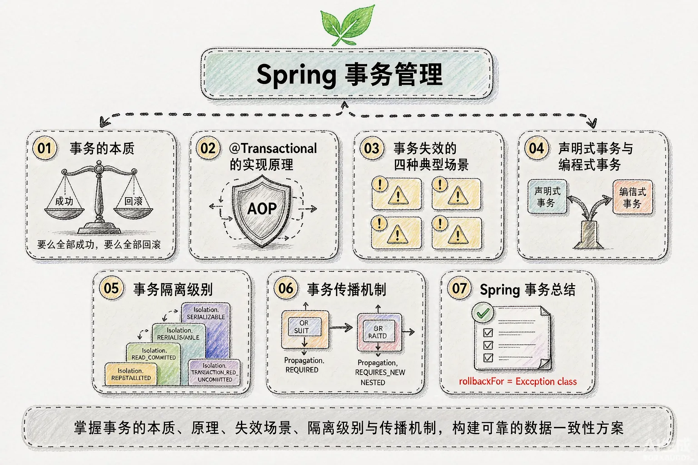

## 事务的本质
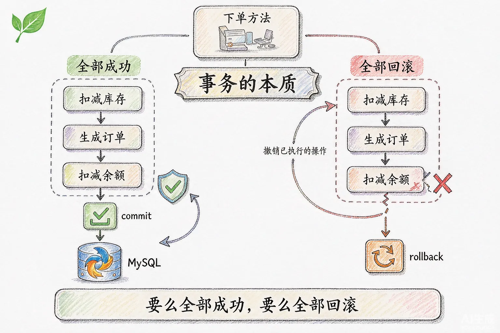

事务的本质就是：**要么全部成功，要么全部回滚。**

在商城或外卖项目中，下单方法可能包含：

- 扣减库存
- 生成订单
- 扣减余额

其中任何一步失败，前面已经执行的操作都必须撤销。

## `@Transactional` 的实现原理
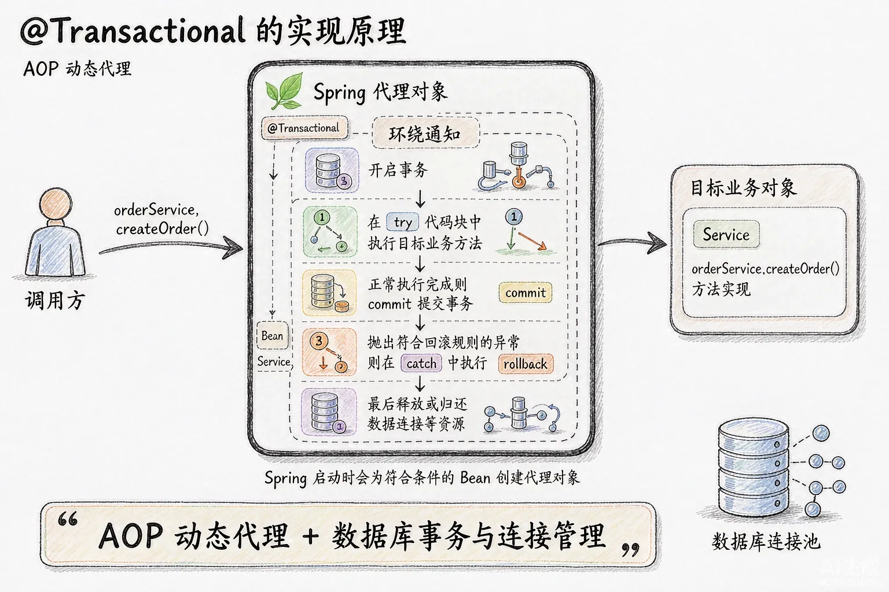

在 Service 方法上添加 `@Transactional` 后，Spring 底层主要依靠 AOP 动态代理实现事务管理。

Spring 启动时会为符合条件的 Bean 创建代理对象。调用类似下面的方法时：

```java
orderService.createOrder();
```

实际调用的通常是代理对象。代理对象执行的逻辑类似环绕通知：

1. 开启事务。
2. 在 `try` 代码块中执行目标业务方法。
3. 如果正常执行完成，则 `commit` 提交事务。
4. 如果抛出符合回滚规则的异常，则在 `catch` 中执行 `rollback`。
5. 最后释放或归还数据库连接等资源。

因此，声明式事务可以理解为：

> **AOP 动态代理 + 数据库事务与连接管理。**

## 事务失效的四种典型场景
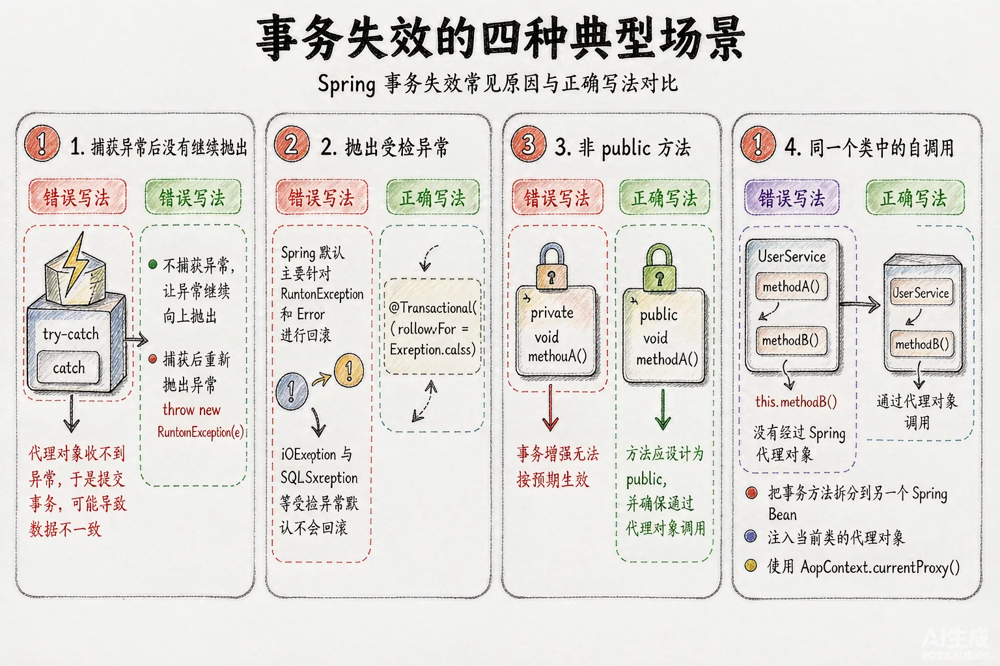

### 1. 捕获异常后没有继续抛出

如果在业务方法中使用 `try-catch` 把异常吞掉，代理对象就收不到异常。它会认为方法正常执行完成，于是提交事务，最终可能导致数据不一致。

解决方式：

- 不捕获异常，让异常继续向上抛出。
- 捕获后重新抛出异常，例如 `RuntimeException`。

```java
catch (Exception e) {
    throw new RuntimeException(e);
}
```

### 2. 抛出受检异常

Spring 默认主要针对 `RuntimeException` 和 `Error` 进行回滚。如果抛出 `IOException`、`SQLException` 等受检异常，默认规则下可能不会回滚。

可以显式指定：

```java
@Transactional(rollbackFor = Exception.class)
```

这句配置最好记住。

### 3. 非 `public` 方法

在常规代理式事务管理中，`@Transactional` 通常应添加在 `public` 方法上。添加到 `private` 等方法上时，事务增强无法按预期生效。

解决方法就是把需要事务增强的方法设计为 `public`，并确保它通过代理对象调用。

### 4. 同一个类中的自调用

假设 `UserService` 中有 `methodA()` 和 `methodB()`，两者都有 `@Transactional`。如果 `methodA()` 通过 `this.methodB()` 调用后者，这属于类内部自调用，没有经过 Spring 代理对象，因此 `methodB()` 上的事务注解可能不会被解析。

解决思路包括：

- 把事务方法拆分到另一个 Spring Bean 中。
- 注入当前类的代理对象，再通过代理调用。
- 使用 `AopContext.currentProxy()` 获取代理对象，但需要相应配置。

例如：

```java
@Autowired
private UserService self;

public void methodA() {
    self.methodB();
}
```

## 声明式事务与编程式事务
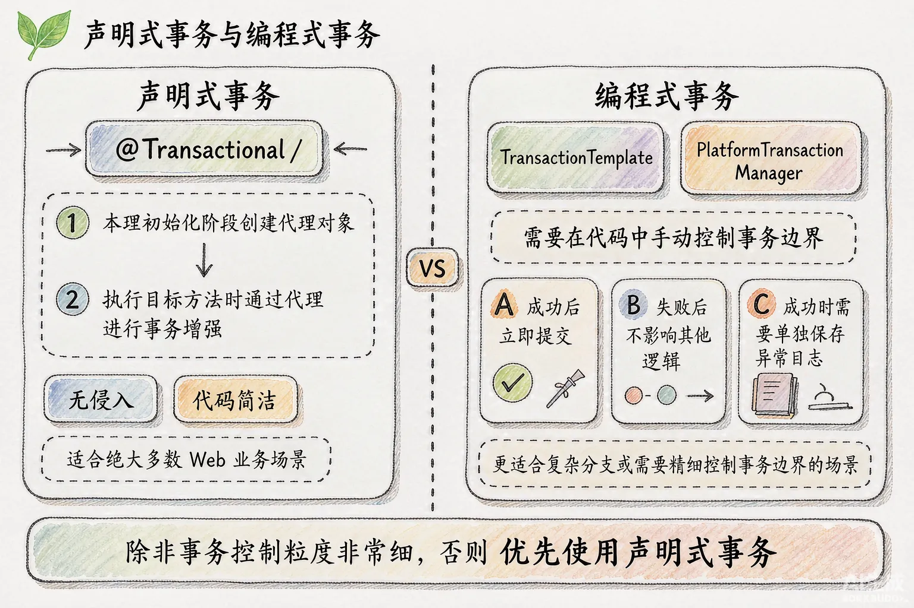

### 声明式事务

声明式事务通常使用：

```java
@Transactional
```

它无侵入、代码简洁，适合绝大多数 Web 业务场景。

声明式事务的基本过程是：

1. 在 Bean 初始化阶段创建代理对象。
2. 执行目标方法时，通过代理进行事务增强。

### 编程式事务

编程式事务可以使用：

- `TransactionTemplate`
- `PlatformTransactionManager`

编程式事务需要在代码中手动控制事务，更适合复杂分支或需要精细控制事务边界的场景。例如：

- A 成功后立即提交。
- B 失败后不影响其他逻辑。
- C 成功时需要单独保存异常日志。

一般来说，除非事务控制粒度非常细，否则优先使用声明式事务。

## 事务隔离级别
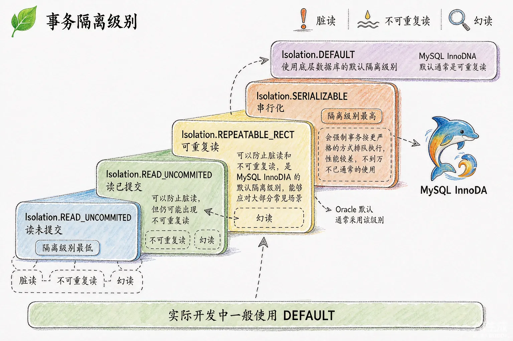

在高并发情况下，多个事务同时操作同一份数据，可能出现：

- 脏读
- 不可重复读
- 幻读

隔离级别可以理解为数据库对并发事务进行隔离的等级。Spring 中常见的事务隔离级别包括：

### `Isolation.DEFAULT`

使用底层数据库的默认隔离级别。MySQL InnoDB 默认通常是可重复读。

### `Isolation.READ_UNCOMMITTED`

读未提交，隔离级别最低，可能出现脏读、不可重复读和幻读。

### `Isolation.READ_COMMITTED`

读已提交，可以防止脏读，但仍可能出现不可重复读。Oracle 默认通常采用该级别。

### `Isolation.REPEATABLE_READ`

可重复读，可以防止脏读和不可重复读，是 MySQL InnoDB 的默认隔离级别，能够应对大部分常见场景。

### `Isolation.SERIALIZABLE`

串行化，隔离级别最高，会强制事务按更严格的方式排队执行，性能较差，不到万不得已通常不使用。

实际开发中一般使用 `DEFAULT`，由数据库默认隔离级别处理大多数业务场景。

## 事务传播机制
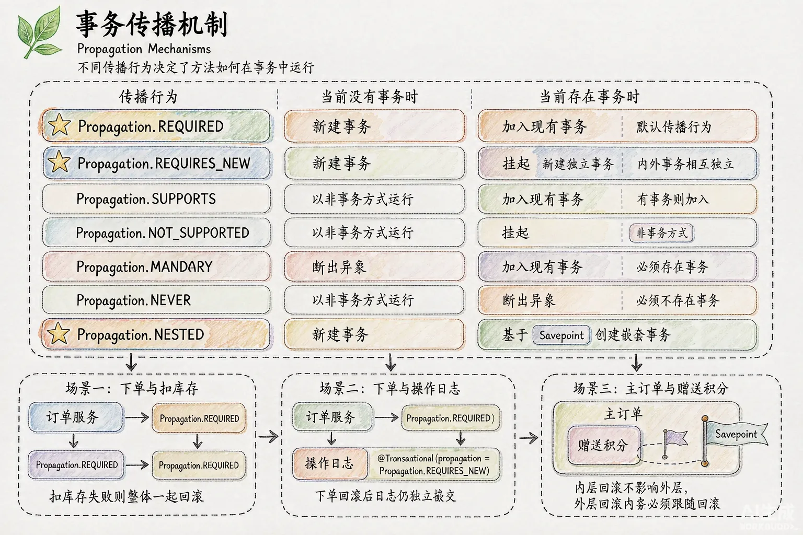

当一个事务方法调用另一个事务方法时，事务应该如何传递，这就是**事务传播机制**。

Spring 一共提供了多种传播行为，其中最常见、最应该掌握的是以下三种。

### `Propagation.REQUIRED`

这是默认传播行为。

- 当前没有事务时，新建事务。
- 当前已经存在事务时，加入现有事务。

例如，订单服务的下单方法调用扣库存方法，两者都使用 `REQUIRED`。如果扣库存失败并抛出异常，下单和扣库存会作为整体一起回滚。

### `Propagation.REQUIRES_NEW`

无论当前是否存在事务，都挂起当前事务，并新建一个独立事务。内外事务相互独立。

典型场景是记录操作日志。即使下单业务失败并回滚，日志仍然需要保存，以便后续排查故障。日志方法可以配置：

```java
@Transactional(propagation = Propagation.REQUIRES_NEW)
```

这样即使下单事务回滚，日志事务仍可以独立提交。

### `Propagation.NESTED`

`NESTED` 表示嵌套事务。如果当前存在事务，会基于保存点 `Savepoint` 创建嵌套事务。

- 内层事务回滚时，可以回滚到保存点，不一定影响外层事务。
- 外层事务回滚时，内层事务也必须跟随回滚。

例如，用户下单时需要赠送积分。赠送积分失败，不希望影响主订单生成；但如果订单最终被撤销，那么对应积分也必须一起撤销。

## Spring 事务总结
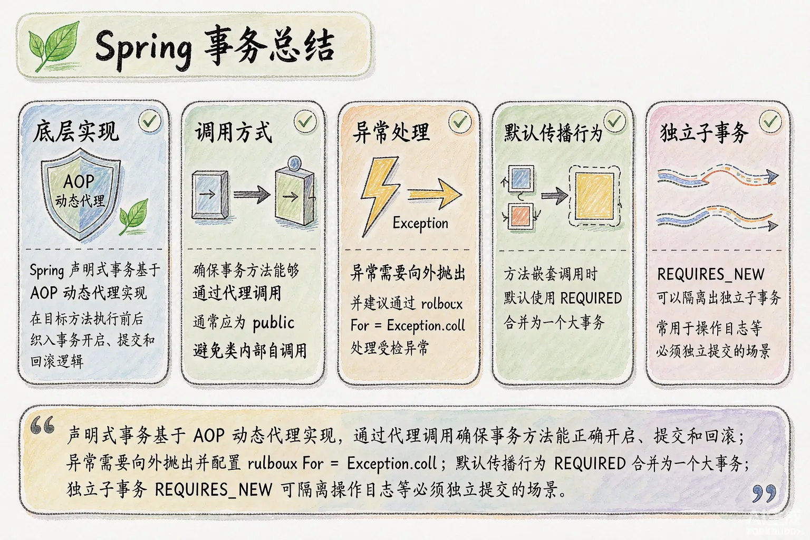

> Spring 声明式事务基于 AOP 动态代理实现，在目标方法执行前后织入事务开启、提交和回滚逻辑。使用时应确保事务方法能够通过代理调用，通常应为 `public`，避免类内部自调用；异常需要向外抛出，并建议通过 `rollbackFor = Exception.class` 处理受检异常。方法嵌套调用时，默认使用 `REQUIRED` 合并为一个大事务；`REQUIRES_NEW` 可以隔离出独立子事务，常用于操作日志等必须独立提交的场景。

## Spring Cloud 与微服务
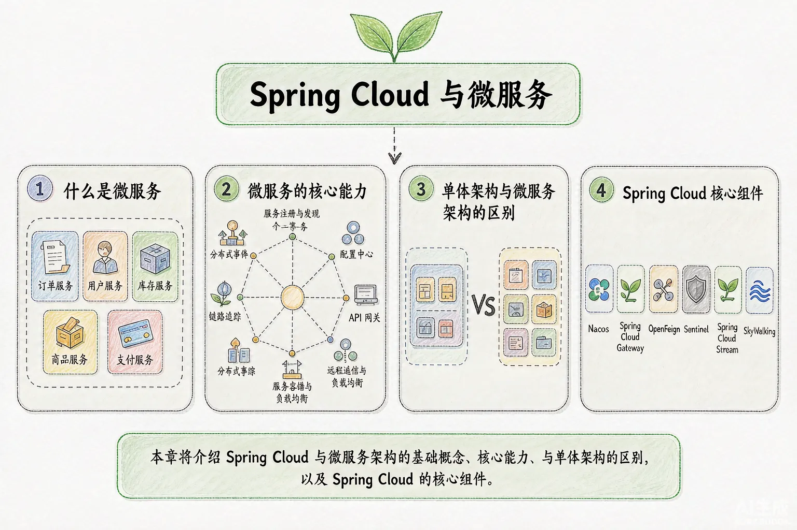

## 什么是微服务
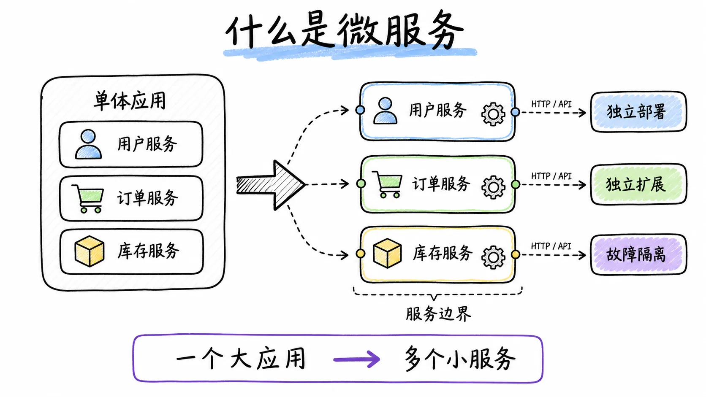

微服务是一种架构风格。它的核心思想是把一个大而全的单体系统，按照业务功能拆分成多个独立的小型服务。

例如，在商城项目中可以拆分为：

- 订单服务
- 用户服务
- 库存服务
- 商品服务
- 支付服务

这些服务都可以是独立的 Spring Boot 项目，也可以拥有独立数据库。服务之间通过轻量级 HTTP 接口或 RPC 通信，不能像单体项目那样简单地使用 `@Autowired` 直接调用另一个模块中的对象。

## 微服务的核心能力
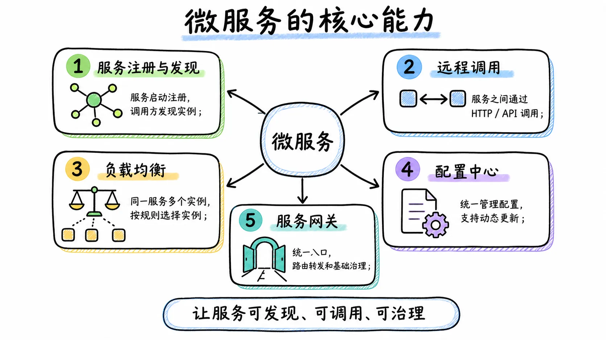

### 服务注册与发现

服务启动时，把自己的 IP 地址和端口上报给注册中心，并通过心跳或续约机制维持实例状态。

### 配置中心

把配置文件从应用中抽离，集中存储和管理，并支持运行过程中动态刷新部分参数。

### API 网关

网关作为系统统一的外部入口，拦截外部进入系统的流量，并集中执行：

- 路由转发
- 身份认证
- 权限校验
- 限流
- 日志记录

### 远程通信与负载均衡

服务之间通过 HTTP 或 RPC 进行同步调用。当一个服务部署多个实例时，由负载均衡组件决定具体调用哪一个实例。

### 服务容错与降级

通过熔断、限流、超时、重试和降级等机制，防止单个服务故障拖垮整个系统。

### 链路追踪

为每次跨节点请求生成全局唯一的 `Trace ID`，记录请求经过的各个服务、Span 和执行耗时。

### 分布式事务

对于跨数据库写入场景，可以使用：

- TCC 补偿模式
- RocketMQ 事务消息
- 最终一致性方案

从而尽量保证多个服务之间的数据状态一致。

## 单体架构与微服务架构的区别
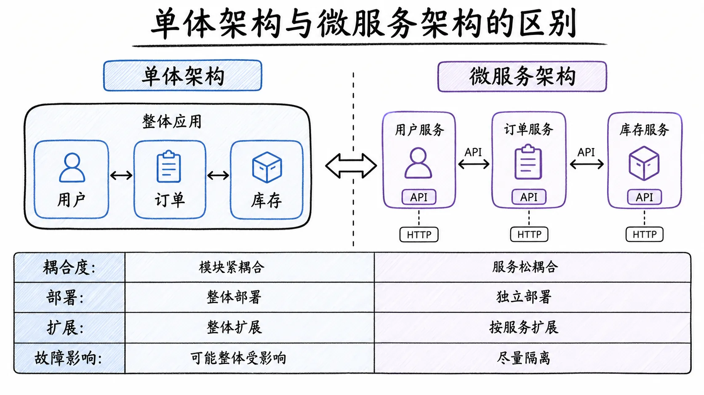

### 单体架构

单体项目会把 Controller、Service、DAO 等所有代码打进一个 WAR 包或 JAR 包，再整体部署。

它的痛点包括：

- 修改一行用户模块代码，整个项目都可能需要重新编译、测试和发布。
- 某个模块发生内存溢出，可能导致整个网站瘫痪。
- 各模块耦合较高，无法独立扩容和部署。

### 微服务架构

微服务会把用户、订单、库存等业务拆分为不同服务，并分别部署。

它的优点包括：

- **故障隔离**：订单服务故障时，不一定影响用户登录。
- **独立部署**：用户团队可以独立发布用户服务。
- **独立扩容**：热点服务可以单独增加实例。
- **异构兼容**：订单服务可以使用 Java，报表服务也可以使用 Go。

它的代价是引入了网络调用的复杂性，例如：

- 找不到目标服务怎么办？
- 调用超时怎么办？
- 某个服务响应过慢怎么办？
- 跨服务数据如何保证一致？

这些正是 Spring Cloud 等微服务体系需要解决的问题。

## Spring Cloud 核心组件
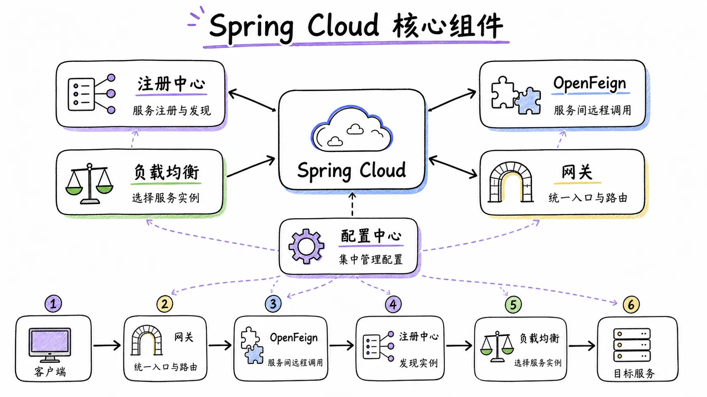

### 注册中心：Nacos 或 Eureka

所有微服务启动时，都会把自己的 IP 地址和端口注册到注册中心。

例如，订单服务需要调用用户服务时，不再把用户服务的 IP 写死，而是向注册中心查询用户服务的可用实例，这就是服务发现。

目前面试中经常会问 Nacos，因为它同时支持服务注册发现与配置管理，并支持不同一致性模式，相比 Eureka 功能更加综合。

### 配置中心：Nacos Config 或 Spring Cloud Config

配置中心用于统一管理各个服务的配置，减少配置分散问题，并支持集中修改、发布和动态刷新。

### API 网关：Spring Cloud Gateway

所有外部请求先经过网关，再由网关根据请求路径路由到对应服务。

网关还可以承担其他职责：

- 统一鉴权，例如校验 JWT Token
- 限流，防止秒杀流量刷爆系统
- 日志埋点
- 请求过滤
- 跨域处理

### 远程调用：OpenFeign

在订单服务中调用用户服务时，可以定义一个带有 `@FeignClient` 的接口，然后像调用本地方法一样调用远程服务。

OpenFeign 底层封装了 HTTP 请求，帮助开发者：

1. 序列化请求参数。
2. 发送 HTTP 请求。
3. 接收响应。
4. 把返回的 JSON 反序列化为 Java 对象。

### 负载均衡：Spring Cloud LoadBalancer

假设用户服务部署了三台服务器，OpenFeign 发起请求时，Spring Cloud LoadBalancer 可以按照轮询、随机或权重等规则，决定具体调用哪一台服务器。

### 熔断与降级：Sentinel 或 Hystrix

假设订单服务调用用户服务，而用户服务突然宕机或响应非常慢，就需要进行容错处理。

**熔断**是指失败率达到阈值后，直接暂时切断调用，不再一直等待，避免订单服务中的线程被拖死。

**降级**是指切断调用后返回兜底数据，让前端仍然有内容可以展示，而不是直接返回 500 错误。

面试中经常会问 Sentinel，因为它支持动态调整限流规则、热点参数限流等能力，功能更加丰富。Hystrix 目前更多作为历史方案和原理类知识了解。

### 消息驱动：Spring Cloud Stream

Spring Cloud Stream 用于屏蔽底层消息中间件之间的差异，提供统一的消息编程模型，实现异步处理和服务解耦。

### 链路追踪：Sleuth 与 SkyWalking

链路追踪可以通过全局 `Trace ID` 把多个服务的调用日志串联起来，并可视化展示调用链和各环节耗时，从而帮助开发者进行性能瓶颈分析和故障定位。

常见方案包括：

- Spring Cloud Sleuth
- SkyWalking

## 面试复习与整体总结
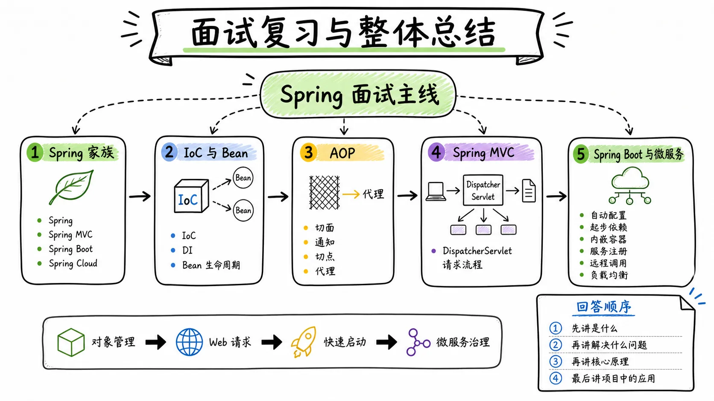

以上就是 Spring 体系中经常被问到的主要知识点。大家可以通过思维导图在每次面试前进行回顾，加深对 Spring、Spring MVC、Spring Boot、Spring Cloud、IoC、AOP 和事务等内容的理解。

也可以把自己在面试中遇到的新问题不断补充到思维导图里。有了过去的面试经验，再面对类似问题时，就能更完整、准确地回答，让面试官感受到你对 Spring 整套框架体系具备较为深入的理解。
