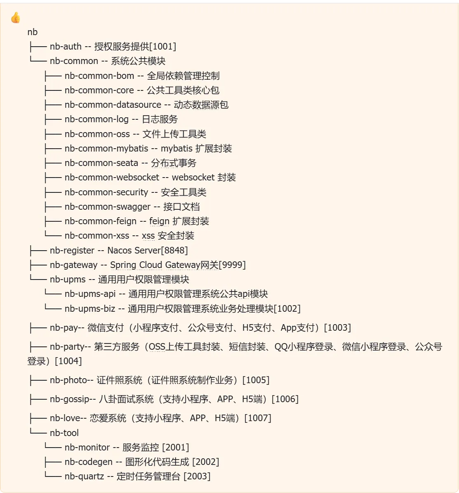
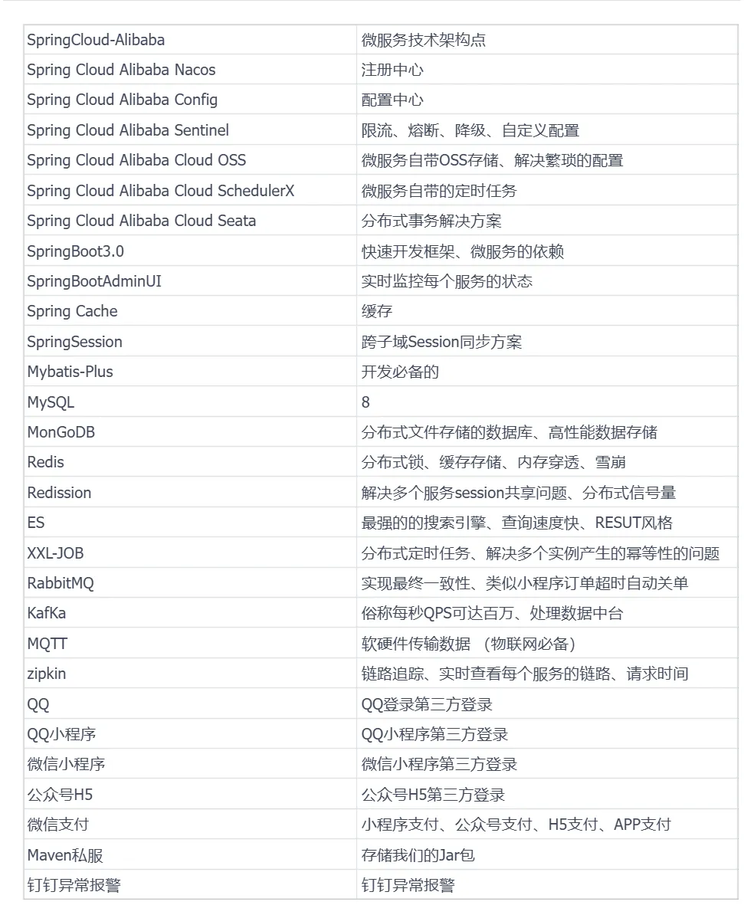
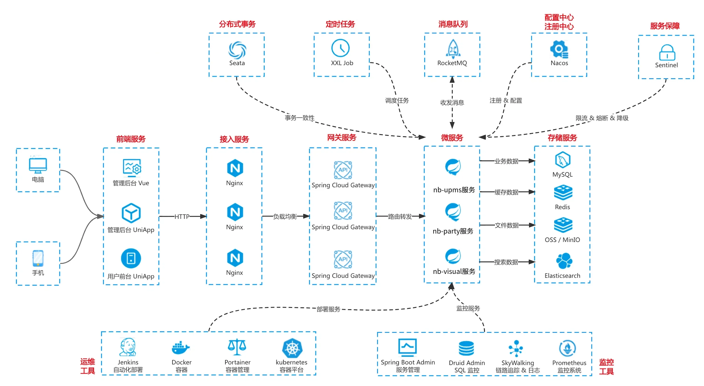

## 项目介绍

三个实战项目/小程序 共用一个微服务: (`java`, `python`, `vue`, `go`, `uniapp`)

**JDK 17** Java 开发工具包第 17 版，提供运行时环境、编译器与标准类库，是整个系统的基础运行平台。

**Spring Boot 3.5** 基于 Spring 框架的快速开发脚手架，简化配置与部署，用于构建独立的、生产级的微服务应用。

**Spring Cloud 2025** Spring 生态下的微服务治理框架，提供服务注册发现、配置中心、负载均衡、熔断限流、网关等分布式系统能力。

**Alibaba 全家桶组件（Spring Cloud Alibaba）** 阿里巴巴开源的微服务组件集合（如 Nacos、Sentinel、Seata、RocketMQ 等），与 Spring Cloud 深度集成，用于服务治理、配置管理、流量控制和分布式事务。

**SAS OAuth2.0** 基于 OAuth 2.0 协议的认证授权方案（此处 SAS 通常指 Spring Authorization Server 或同类授权服务器实现），用于统一身份认证、令牌签发与权限校验。

**Kafka** 高吞吐量分布式消息队列，主要用于日志收集、事件流处理与系统间异步解耦。

**RabbitMQ** 基于 AMQP 协议的消息中间件，适合可靠性要求较高的任务队列、延迟消息与复杂路由场景。

**Redis** 内存型键值数据库，常用于缓存、分布式锁、会话存储与高频数据读写加速。

**ELK（Elasticsearch + Logstash + Kibana）** 日志与搜索分析套件：Elasticsearch 负责全文检索与存储，Logstash 负责日志采集与转换，Kibana 负责可视化展示，用于系统监控与问题排查。

**微信小程序 / QQ 小程序** 分别运行在微信与 QQ 客户端内的轻量级应用形态，提供无需安装即可使用的前端交互入口。1

**微信 PC 支付、微信小程序支付、微信公众号支付、H5 支付、APP 支付** 微信支付体系下的不同接入渠道，分别对应 PC 网页、小程序、公众号、移动端 H5 页面以及原生 APP 的支付场景，统一对接微信支付接口完成收款。

**MQTT** 轻量级物联网消息协议，专门用于监听与上报设备上线、下线状态，支持低带宽、高并发的设备连接管理。

整体系统定位为基于上述技术构建的微服务架构 RBAC（基于角色的访问控制）权限管理系统，并包含证件照服务与八卦系统服务等业务模块。

