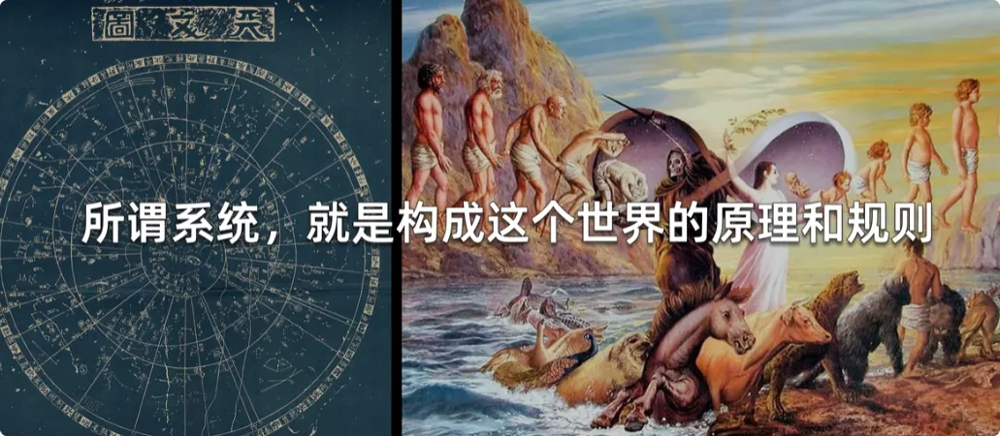
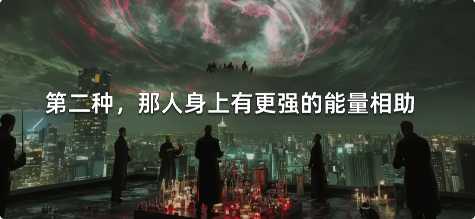
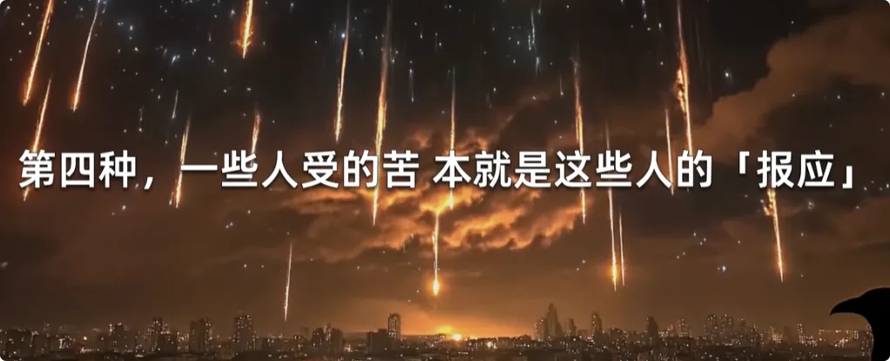
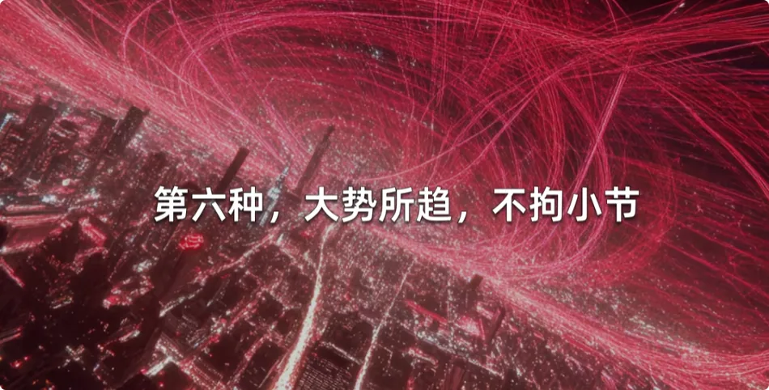
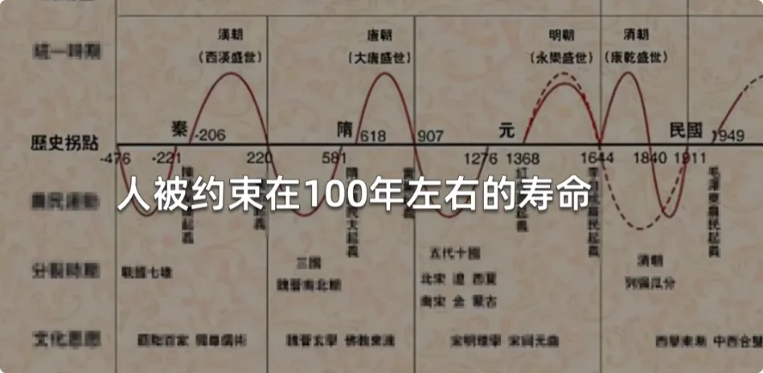
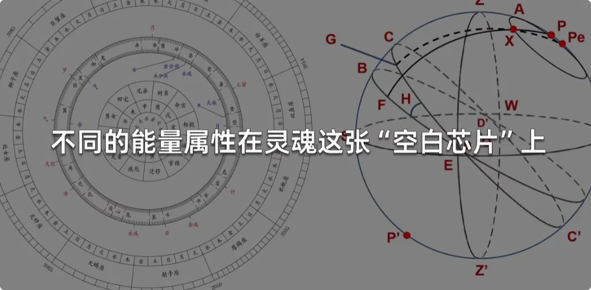
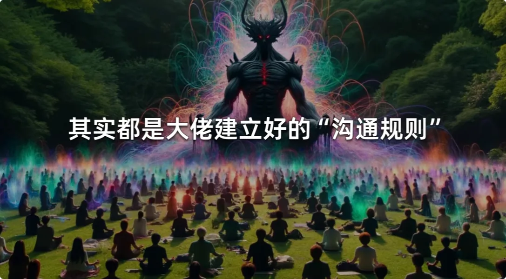
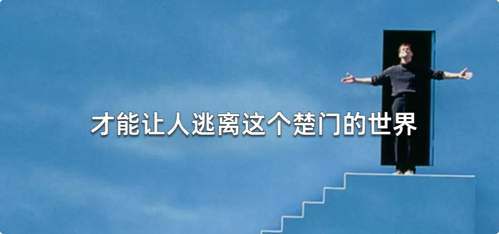
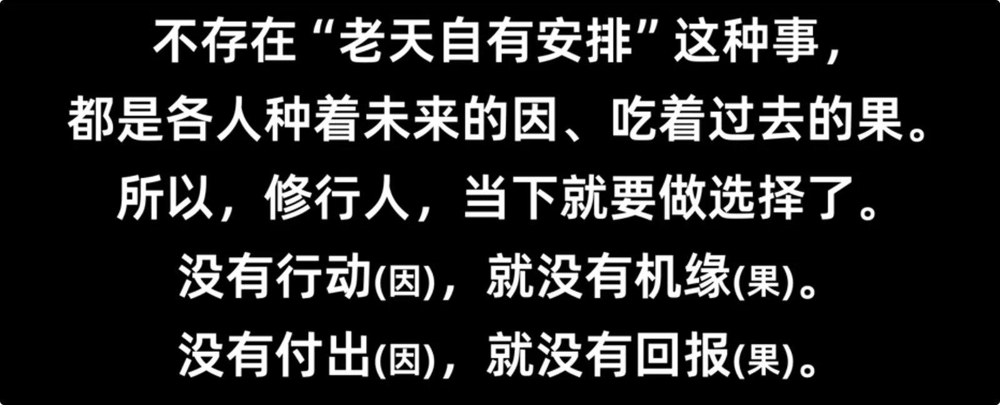

大家好，我是修炼者小叶，这期视频我们来聊一聊超自然，想必有些朋友有机会接触物理世界的边缘，经历过超常规的事件，也知道有些神秘知识啊被严格隔离起来，不能被常人知晓，也就是说常人所处的世界其实是楚门的世界，这期视频呢主要是解答这类朋友的疑惑，但我肯定不能说的太露骨，不然怎么能叫禁忌的知识呢，观众得机灵点，有点悟性，否则get不到

如果你已经发现世界超自然的一面，那你一定会有这样的疑问: 
超自然事物是怎么运作的，它们的来源或者说原理是什么，我们所处的这个现实世界，什么才是真的，我们是否有机会并且安全地接触那个世界，我们能否逃离这样一个楚门的世界。

## 超自然现象的两个来源

超自然现象的来源有两个：一个是**系统**，一个是**存在者**。

所谓系统就是构成这个世界的原理和规则，比如大家常说的道法、命运、因果转世等等。

所谓存在者就是超自然存在体，包括很多人借助特殊仪式来获得超自然助力，其背后都是借助超自然存在体找他们借的能力。

系统和存在者之间就是**计算机(computer)和用户(user)的关系**。

首先宇宙一定是有一个底层逻辑的，通过最基本最朴素的道理来运作。比如道德经里讲的道，朴素至极，合理至极，没有人会反对。**但大部分人类是通过现实生活去理解道的，只能靠现实经验去领悟道的规则，对于超自然世界是零经验的状态，因此无法理解更深层的含义。**

这里讲几个道延伸出来的超自然层面的现象：

**阴阳动态平衡**：宏观大世界整体趋于平衡，这是平稳发展的基石。世界运动发展靠的是局部的不平衡，不平衡是事物运动运作的根本。这两句的深层含义是
超自然能量中的正能量和负能量必然是等量存在的，既有好的存在者，也就有不好的存在着，两边等量等强度。

如果你想向无形世界拿什么，不管是能量气还是祈求神助，你都得先具备分辨的能力。太多人异想天开，缺乏严谨求证的精神，靠想象连接不明神秘力量，甚至只贪图一时的利益，不惜拿重要的人事物去交换，这都是非常危险的。
危险在于你和谁在做交易，你和他能否实力上绝对平等，背后引发的因果——直白的讲叫报应——你能不能担，你遭不遭得住。

其次，世界运动发展靠局部不平衡，也就是说不平等必然存在。人人绝对平等，拿一样的资源体验一样的人生，是不可能的事情，要如此，宇宙也没有开展的必要了。

所谓众生平等，指的是在道法规则之下，每个个体修行求生、向上扬升所要接受的规则相等，考验相等。这就跟高考一样，只要上升的考核制度绝对公平公正，大世界的秩序还是稳定的。
所以上层得道者关爱和引渡众生的根本逻辑，不是来服务你的，而是以点拨教化你为主，甚至动用因果报应来提醒你。

因为你是考生，没有人能替你考试。

**阴阳互为作用力**：事物的发展离不开正反两种推力，成事成人都有正反两股力量相互推动而成就。想要好的发展，必然要面对或承受不好的事物，所谓逆境是成长的最佳土壤，未经世间险恶，难成真正圣贤。

所以大恶者有时是为了成就大善者才出现的。不要以为大恶者拥有这么好的资源，苍天就不公了。看看人类历史，整体最终还是螺旋式上升发展的，说明人格化的道还在。

阴阳互为作用力隐含的另一个道理是，阴阳不管哪一方增长，另一方也得增长，才能重归平衡。所以你看到不好的现象，在世界的其他地方一定有好的事物在发生，反之亦然。一个人能带出的力有多大，也就意味着能带出的害就有多大。**因此，任何人不管是凡人还是神仙，越往上走，招致的考验也越大，因为当个体的影响力大了，若其心性和行为仍无章法，那就必然带来灾难。**

阴阳合归太一这句话大家都听过，它在超自然界面最直接的含义就是存在一位太极，有着绝对的实力统合各界秩序。

他是道法的缔造者，也是道法的人格化。有了太极存在，再强的个体也得学会谦卑。

在太极的绝对实力之下，众生才得以修行，平等资源才得以有序分配，因果法则才得以落实。

若无太极，那到处都是无主之地，灵和博弈，黑暗森林熵增寂灭，道德二字也将沦为精致利己者口中的笑柄。

## 因果法则

其实因果法则是很朴素的，就是简单的种瓜得瓜。常人之所以能理解，是因为这背后的因果关系都是可见的。但我们的世界尤其是无形世界中是有很多事物是不可见的，常人没有经历过，没有建立相应的认知，所以无法预见深层次的因果关系。

举个例子：假如一个人心性不正，私底下干过很多缺德事。虽然没有人直接看见，但附近的灵体看得见。
人若作恶为乐，那就容易被鬼盯上，因为鬼喜欢作祟；
如果喜欢破坏物件，总有一天会惊扰到物件上的灵体；
如果直接或间接背负了人命，一定会缠上冤魂。

久而久之，那人身上跟着的鬼越来越多，人的能量频率就会变质，能量场由生机转向衰变，最后一定引发意外事故。
若发生意外死亡，以这人此时的能量状态恐怕还不好转世，要么当孤魂野鬼，要么转世到戾气重、鬼气重的家庭。常人观测不到无形世界的事情，故而不相信无形的因果业力，也因此大多数人都不会约束自己的言行。

那为什么很多坏人没有报应呢？报应未到无外乎以下几种情况：
1. 那人来历不凡，背后有更强的灵体相助，小报应到不到他身上。

2. 那人身上有更强的能量相助，自身能量足够大时，就算出现一定的报应，他的运势也难败。

3. 那人当前被立为大恶人，是为了成就另一些人而出现的，受报还需延后。

4. 一些人受的苦本就是这些人的报应，坏人只是来了结这些人的业力，当然坏人大概率又给自己种下新的因果。

5. 因果发展的时间尺度很长，业报还没来。这种业报一般都是集体业报，关乎一个家族或一类人群，等到合适时机才能出现。

6. 大势所趋，不拘小节。人在地球上就一定是众生共业，人作为有形生灵之长，总是要背一些责任的，连动植物都要默默承受人类的业报。

从存在的意义上说，报应往往起到教化的作用。
**人教人教不会，事教人一遍就会。**
人类集体得亲自经历了才能领悟，才懂得调转车头，迷途知返。

最后，很多人认为善行善果，恶行恶果，其实这并不完全正确。我曾多次强调**善非功，恶非过**。
很多人做了自以为对的事情，其实都埋下了更大的恶意。只有修行修炼，才能把个人的智慧和眼界提上去，才能结束这些无穷无尽的因果业力。

## 高等能量与地球试炼场

生命并不只是一场随机事件，生命不只是简单的分子活动，还有许多无形的系统在运作。

***地球是挺特殊的。首先凡生命都是向往高纬度的，都是想要扬升的。***

向上走是生命的本能，对于无形的生灵来说，都想获取高等能量，扬升到高维度，这个过程就叫修炼。如果高等能量随机扔在宇宙空间，谁先占到地盘谁就能垄断，宇宙最终只会变成一小部分人的狂欢，这种宇宙没有存在的必要。

高等能量具备**精神和能量**两个层面。
从精神层面讲就是灵能，有个体对自我、对世界的深层认知；
从能量层面讲，就是改变外部世界的强能力，也就是神力。
能量越高者，带动因果的能力也越强。如果没有被约束，那宇宙各处都将是自封为神的巨婴。

所以为了回应宇宙各处生命对成长的需求，太一制定了严格的考核要求：
**有多少品性和灵性，就拿多少高等能量**。

而这个试炼场就是地球。

太一将相当多的能量资源投射到这颗星球上，目的就是吸引众生在此修行、修正：
- **物理躯体**：人形是最有美感的一种形态，早在物理人类演化出来之前，人形就存在了。

- **寿命**：人被约束在100年左右，有利于缩短文明演化周期，防止常年一家独大。

- **能量系统**：日月星辰、山河湖海皆储存着一定的能量，能量的变化会具象化为气候地动等物理事件。

- **灵魂和转世系统**：人过百年必亡，死后将元神装进新身份容器，抹除记忆和修为，否则强者持续开挂，弱者就没有成长的机会。

- **命运系统**：卵子受孕的那一刻起，新的灵魂就会接入天上星辰，地上山川的时空能量，此时就是光刻机不同的能量属性，在灵魂这张空白芯片上刻画出每个人的身份证。
- 个人按照各自的身份进入到众生共业里，但还是要说明规则仍是**七分天意，三分人为**，否则生命就没有存在的意义了，都成了NPC，虽然转世的时候都抹除了记忆和修为，但个体的灵根和因果还在，灵根是个体的根本意志，根底越强越能自主，命运反之根底，弱者要靠命运系统来帮助成长，要经历不同事的身份修炼根底
- 而因果系统存在的意义就好比投资，因为生命都是要规划未来的，付出，当有回报，个体可以通过因果来塑造自身，未来的环境和机会，其实啊众生自始至终规划的只有修行这一件事，只是常人离道太远，不知也不明

- **修炼系统**：人生自然是最适合修炼的，但该怎么修，还得规则的制定者说了算，自己给自己打满分没用。

- **冥府系统**：总需要一个能接纳亡魂的空间，以及相关的管理人员。

如果大家非要演化成25号宇宙那样，是可以提前关机重启的。
众生共业范围很广，人类之外的众生也在其中。如果人类无法修正自己，阻碍了更多众生的成长，那这场失败的试验不如早点重开。

## 人类之外的众生与求神

接下来我们来说说人类之外的众生。首先生命的基础是灵能，也就是有灵性的能量，有了灵性，生命才开始有自我意识，不同属性的灵性能量诞生不同的意识个性。

其次凡有形之物皆可接收和承载能量，当一个有形物体处在某个能量交汇的位置，不断被能量熏陶，直到能量中稀薄的灵性碎片积攒到一定程度，足够形成一套自我认知闭环，这个物体就会诞生自己的意识和能量体，也就是元神和灵体，也就是俗话说的成精。
从负能量中诞生出来的，俗称妖魔精怪；
而从正向能量中诞生的则是自然神灵。

最初的生命都是能量态，都是通过有形物体来塑造出无形能量体，通过吸收相应的能量属性来塑造个体意识。

所以在宇宙的漫长岁月中，早就诞生出了极大能量者，尤其是负能量大佬。不管是本土诞生还是外来的，他们都有着各自的社会体系，有自己的地盘，同样他们有建立自己的沟通规则。

一个祭司或巫师想要连接和借助大佬的能力，那么就要用大佬规定的符号、文字图像等等。在我之前的视频中提到过，创作出来的作品会带着创作者的能量，能量是跨时空连接的。有心的人类想要连接无形的大佬，想往无形世界中拨打一通电话，那就必须靠具体的意象来连通，否则大佬怎么知道是你找他，人家又没那么闲，天天待在你旁边守着你。

这也可以解释为什么教派总是层出不穷，为什么能有影响力。
因为大佬有很多，当你具备建立新教的潜力，他们可以帮你完成新符号、新教义的建立，也可以帮你搞出一些超自然现象。

那大佬为什么要帮这些人呢？

首先俗人之所求无非就那么几样，大佬是看不上的。

无形生命终究是为了能量修炼，不管他们愿意正向还是负向，他们总是要往上走的。除了正向修炼能量以外，人类的能量算是最好的一种选择，毕竟人类是神明以自身之姿创作吹一口气而诞生的产物。**所以与大佬的交易中，人永远是交易品，永远不可能平等。**

所以很多修行人引以为傲的修行方法，比如念什么咒语观想什么事情，做什么动作，摆什么仪式，其实都是大佬建立好的沟通规则

比如某<金华>就是某阴仙所作人，用自身能量气场练出来的这个丹，终有一日大佬会来一口吃掉。

还记得前面说过阴阳平衡的道理，世界上有多强的神灵，也就有多强的魔物。
无形世界比的是手腕，强大的负能量大佬可以斩杀较弱的正能量神灵，也只有靠更强的神灵才能封印和约束魔物。

这也意味着人有弑神的途径，同样也意味着人类背负的恶业远比预想中要深重。

有人会问了，那这些大佬不会有因果报应吗？

>有是有，但人家毕竟比人类更懂因果关系，所以大多数时候，他们都是等着人类主动来求自己，事实上也确实如此，人类的欲望总是填不满，所以从缘由上讲，因果主要还是人类在背。

常人要记住，无知无明不是逃避业报的借口，也逃避不了，唯有修行才能解脱因果，不修行，放任无知，放任无意识伤害众生的行为本就是恶因。

还有人会问了，那修行人正信正念之人，为什么连接不到正神，借不到正神的力量呢？

1. 正神几乎不留沟通方式，就算有常人也接触不到。
2. 不是你想呼叫谁就呼叫谁，大多数人求神不过是求神满足自己的欲望，哪怕是声称维护正义，降妖除魔，都不过是满足个人欲望，而正神是不屑于与凡人做交易的，也不会出力干涉常人的因果。   
3. 大多数所谓的修行人并不是真正的想修行，或者说不理解真正的修行的意义，仍然是太过自我，太清高，太违心，放不下身段，学习何为道，神灵根本没办法教他。
4. 正神若真要出面，那也是关乎人类集体的大型因果事件，所以问问你自己，你什么身份？

## 破除信息茧房与修行真谛

自始至终我都是呼吁修行，因为只有修行才能让人真正的自主，才能让人逃离这个楚门的世界。不管你再聪明，你也无法看透楚门的世界，因为过度依赖可观测的事实，就意味着只需要把超自然部分从你视野中屏蔽，你的理性就能让你困死在信息茧房里。只需要把信息茧房里的推理结果导向弱肉强食，零和博弈，你就会义无反顾地支持和执行，最终你成就了恶业，成为了业报的牺牲品，甚至你都不会相信会有恶意，放手去做一堆不合道的事情。

想要破解信息茧房的唯一方法就是修灵智。

灵智会天然地让个体怀疑机械理性，有灵本就是反机械的。

灵智能让人接受和接触到不可见的事物，学习到超验的知识，比如超自然存在、深层因果关系、众生共业、自然之道等等。

看到的和体验到的世界更加全面完整，更有全局观，因此才能具备解决个体和集体困境的能力，才能规划真正有意义的未来。当一个人具备了这样的智识，也就有了跳出地面因果系统的资质和扬升的机会。

**也就是说，只有灵智才能给人最大的自主性，而灵智是怎么来的呢？就是修行得来的。所以修行并不是避世者的专属，相反修行是所有人的归宿。**

我是修炼者小烨，我们下期再见。