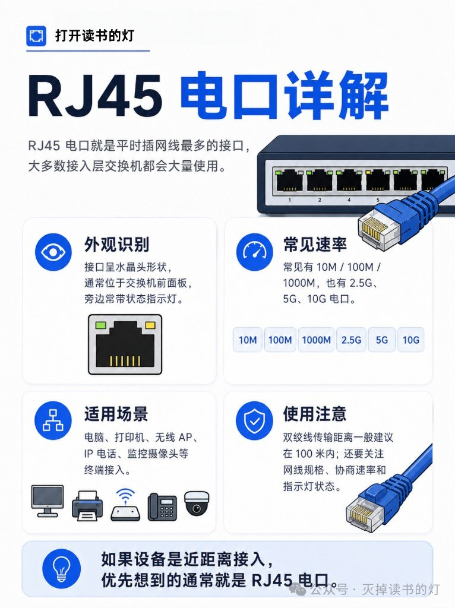
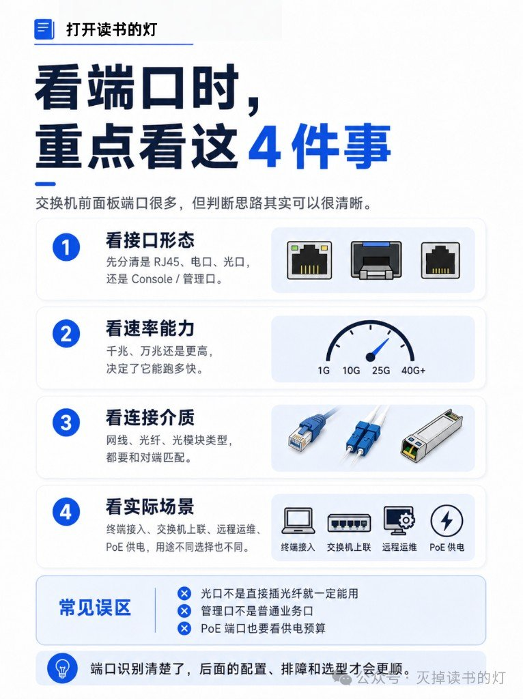
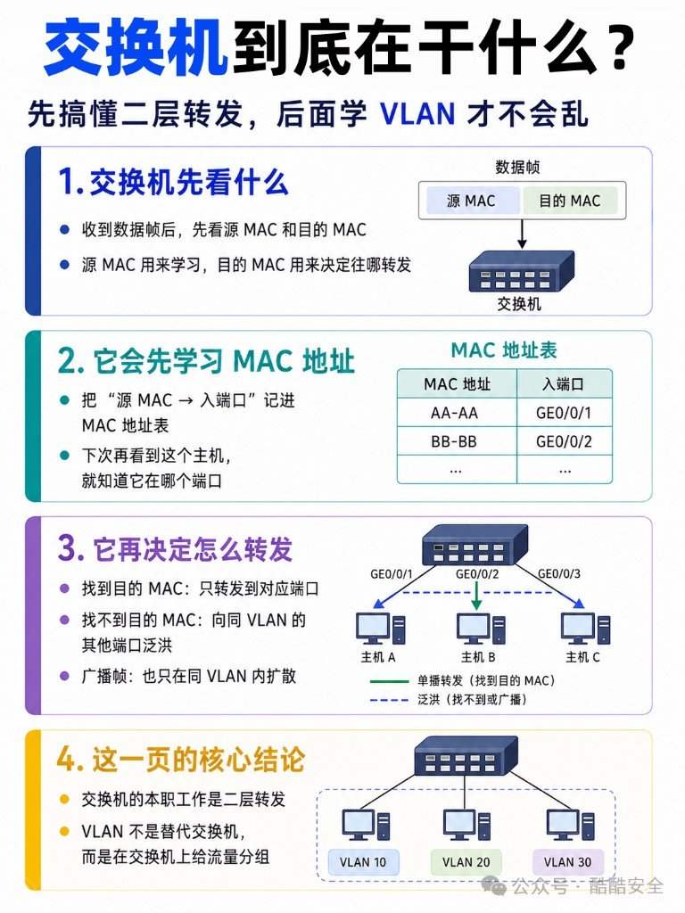
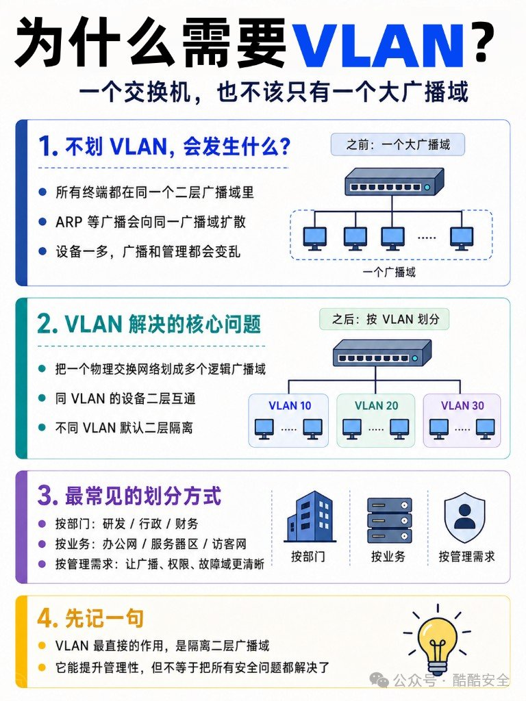
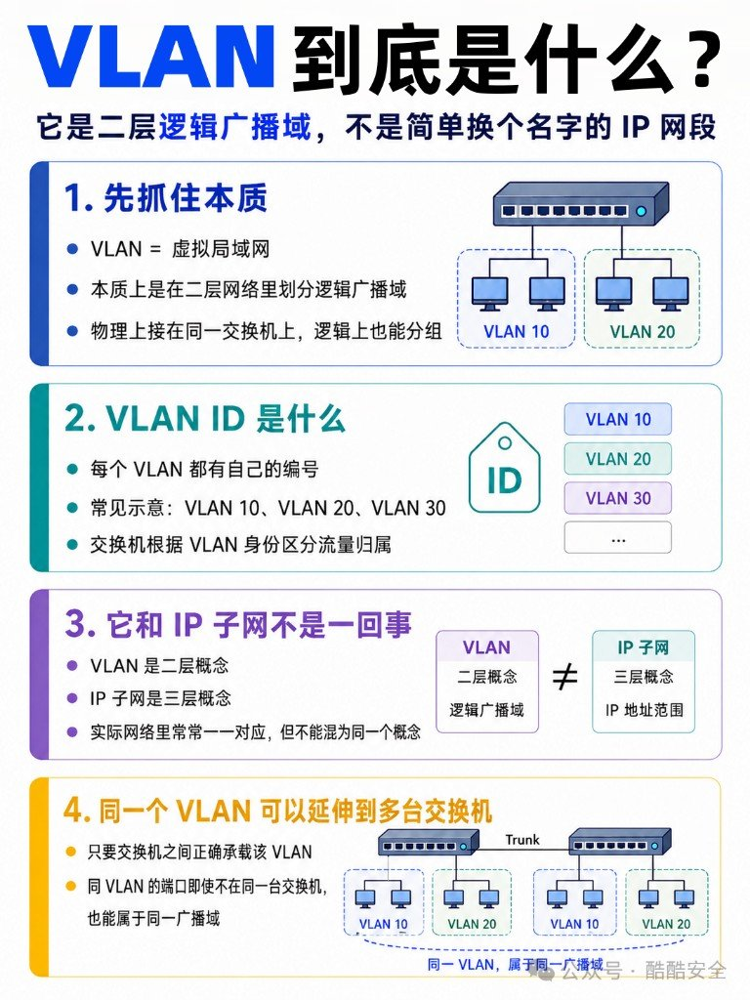
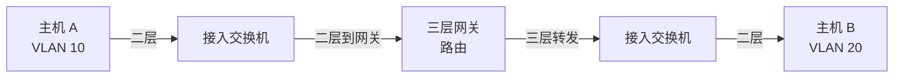
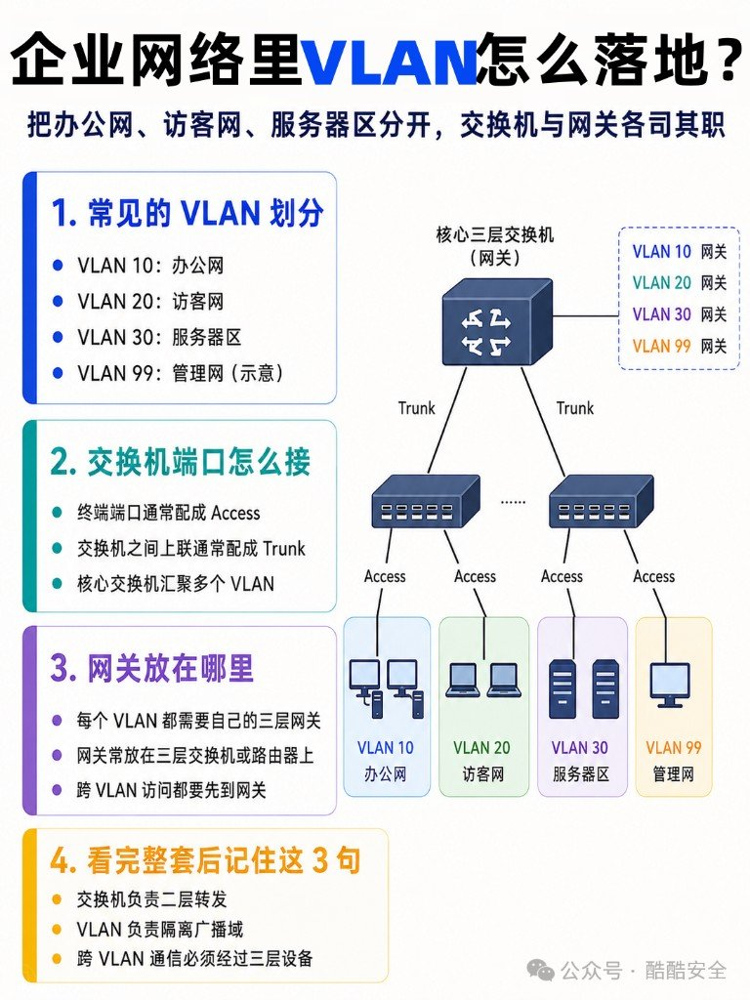

很多人一上来就背 `switchport mode access`，面板上那些口还分不清。口认错了，VLAN 配得再漂亮也是空转。这篇按现场顺序走：先把面板摸清楚，再讲 VLAN 到底切的是什么。

材料合了两份笔记：端口详解（面板物理口）+ VLAN 在干嘛（广播域 / Trunk / 三层）。厂商私有堆叠口另说，这里只覆盖常见面板。

## 面板先认一遍

常见机型大致是：一排 RJ45 业务口 → 右侧 SFP+ 上联 → CONSOLE / MGMT → 指示灯（PWR / SYS / STAT / PoE）。

记这句就够：**业务走电口或光口，运维走 Console / MGMT，供电看 PoE。**

## 六类口，别按长相分组

| 类型 | 干什么 | 典型场景 |
|---|---|---|
| RJ45 电口 | 网线接终端，传数据 | 电脑、打印机、摄像头、AP、话机 |
| SFP 光口 | 插光模块，中长距离 / 高速链路 | 楼宇互联、上联 |
| SFP+ | 常见万兆上联 | 交换机互连、服务器高速接入 |
| Console | 本地 CLI，初始配置 / 救场 | 没配 IP、SSH 挂了 |
| MGMT | 独立管理通道，不跑业务流量 | 远程运维、权限隔离 |
| PoE | 网线同时传数据 + 供电 | AP、话机、摄像头、门禁 |

### RJ45：近距离接入首选

外观就是插水晶头的电口，面板上最常见。速率从 10M / 100M / 1000M 到 2.5G、5G、10G 电口都有。

两点别踩：双绞线有效距离大致 ≤100 米；线规（Cat5e / Cat6）、协商速率、指示灯要一起看。设备就在附近、用网线就能到 → 默认先想 RJ45。

### SFP 和 SFP+：槽长得像，速率差一截

| | SFP | SFP+ |
|---|---|---|
| 常见速率 | 千兆 | 万兆 |
| 典型用途 | 中长距离光链路 | 交换机上联、高速互连 |
| 注意 | 要先插模块；也可用电口模块 | 同样要匹配模块与光纤 |

插槽本身不能直接插裸纤。模块速率、接口类型、传输距离要对齐；单模 / 多模、双纤 / 单纤也要和现场光缆匹配。

### Console：本地救场口

Console **不跑业务流量**。干的是：本地登录，做初始配置、排障、系统恢复。常见接法：电脑 → Console 线 → CONSOLE 口，再用 PuTTY / SecureCRT 进 CLI。

IP 还没配上、SSH 进不去、远程全挂时，它往往是唯一还能说话的口。

### MGMT ≠ 业务口

管理口和普通业务口外观可能都是 RJ45，职责完全分开：MGMT 接独立管理网、不转发一般用户业务；业务口才承载 VLAN、速率、链路状态这些日常关注点。别把管理口当成「多一个普通网口」乱用。

### PoE：一根线解决数据和电

常见落点：无线 AP、IP 电话、监控摄像头、门禁。标准常见 802.3af / at / bt，功率逐级抬高。上手前确认三件事：交换机是否支持 PoE、标准是否对得上终端、**整机功率预算**够不够（不是单口标了 PoE 就能全插满）。

## 看端口时盯住这四件事

1. **形态**：RJ45 / 光口槽 / Console / MGMT，先分清是谁
2. **速率**：1G、10G、25G、40G+，决定性能天花板
3. **介质**：网线、光纤、模块类型，两端必须匹配
4. **场景**：终端接入、上联、远程运维、还是 PoE 供电

常见误区：光口不是插上光纤就通（模块与光纤要对）；管理口不是普通业务口；PoE 要看整机功率预算。端口认清了，后面配 VLAN、查链路、选型号都会顺手很多。

---

## 交换机先学 MAC，再决定往哪扔

口接对了，帧进交换机还要看两样：源 MAC 用来记「谁从哪个口进来」，目的 MAC 用来决定往哪送。

| 目的 MAC | 行为 |
|---|---|
| 表里有 | 单播，只送到对应口 |
| 表里没有 | 泛洪到同 VLAN 其它口 |
| 广播 | 也只在同 VLAN 内铺 |

交换机的本职是二层转发；VLAN 不是换一台机器，是在同一台物理交换机上把流量切成逻辑组。

## VLAN 切的是广播域，不是「安全银弹」

不划 VLAN：整机一个大广播域，ARP 一类广播跟着设备数一起涨，管理也糊成一锅。

划了之后：物理一张网，逻辑多个广播域——同 VLAN 二层通，不同 VLAN 默认二层隔离。常见切法按部门、业务（办公 / 访客 / 服务器）、或管理需要。

VLAN ≠ IP 子网。前者二层广播域，后者三层地址段；实务常一对一映射，别当成同义词。同一 VLAN 也能跨多台交换机延伸，前提是中间链路（多半是 Trunk）真的在扛这个 VLAN。

## Access / Trunk，加上 802.1Q 那张「行李牌」

| | Access | Trunk |
|---|---|---|
| 常接 | PC、打印机 | 交换机、路由器上联 |
| 承载 | 通常一个 VLAN | 多个 VLAN |
| 标签 | 终端侧常见帧不带标签 | 靠标签区分 VLAN |

Access = 单 VLAN 接入口；Trunk = 多 VLAN 运输通道。终端走 Access，交换机互连走 Trunk——记这个比背命令有用。

Trunk 上多出来的那截是 802.1Q：插在源 MAC 和 Type 之间。TPID 多半是 `0x8100`，真正要命的是 12 bit 的 VLAN ID。标签服务交换机之间的链路，不是让你在终端上手搓解析。

## 跨 VLAN：必须撞上三层

同 VLAN：同一个广播域，交换机二层就能转。  
不同 VLAN：普通二层交换机不会把它们桥在一起——这不是 bug，是隔离本身。

谁来打通：默认网关 / 路由器 / 三层交换机。常见做法是三层交换机上每个 VLAN 一个网关口（SVI 一类）。

不同 VLAN 互通 = 三层转发。没网关，Access/Trunk 配得再漂亮也白搭。

## 企业落地就这几句

示意划分：VLAN 10 办公、20 访客、30 服务器、99 管理。终端口 Access，上联 Trunk，核心三层交换机扛各 VLAN 网关。

1. 交换机：二层转发  
2. VLAN：隔离广播域  
3. 跨 VLAN：必须过三层设备  

VLAN 让广播域和管理边界清楚，别当成 ACL、零信任或「划完就安全」。网安往下学，这只是地板，不是天花板。

## 适合谁，我怎么记

如果你还在「口都分不清就开配 VLAN」的阶段，先把面板六类口过一遍，再回来看广播域这三句。已经会配 Access/Trunk 但跨 VLAN 总不通——先查有没有三层网关，别在命令字上空转。
