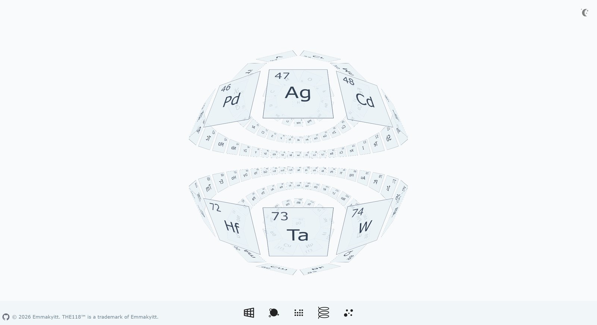

B 站刷到 UP 主「忽见狸」的视频六周年开源回馈：一个 3D 交互式化学元素周期表，README 一句话就勾人——「纯数学矩阵驱动的 Web 3D 渲染方案，不依赖 Three.js/WebGL」。项目叫 the118，正好是第 118 号元素鿫（Og）。

扒下来跑起来，发现这项目比想象中干净：运行时依赖只有 `react` 和 `react-dom`，一个图形库都没有，118 个元素的 3D 位置全靠自己算矩阵，写进 CSS `transform: matrix3d(...)`。这篇文章是源码拆解，重点讲三条能带走的东西：五种布局的数学套路、点击聚焦的「反相机变换」、装饰器自注册工厂。



## 先记住三句话

- **几何不靠 WebGL**：每个元素的 3D 坐标算成一个 4×4 矩阵，直接写进元素的 `transform: matrix3d()`，交还给浏览器合成，切换布局时靠 CSS transition 做动画，没有 JS 动画帧。
- **五种布局是同一套积木**：表格 / 球体 / 螺旋 / 网格 / 随机，差别只在「怎么给每个元素算坐标」，底层用的全是同一个矩阵工具类。
- **点击聚焦是反着算的**：让选中的卡片转正浮到面前，不是把卡片挪过去，而是把它的变换反向施加给整个容器——数学上的「相机跟随」，零成本实现。

## 架构：四层一包，单向依赖

```
Infrastructure          Domain                  Application           UI
─────────────────       ───────────────────     ──────────────        ─────────
MatrixTools (4x4矩阵)     ViewModelFactory         useCardsMatrix3d      ElementCard
MathTools (几何公式)       (抽象工厂+注册表)         useCardsWrapMatrix3d   ElementStage
                         registerTo (装饰器)        Drag3d (拖拽包)         FooterMenu
                         5×ViewModel (布局算法)
                         ViewModelService (桥)
```

依赖方向是单向的：`Infrastructure → Domain → Application → UI`，数学层不依赖 React，UI 层不碰矩阵运算。业务与数学解耦得干净，这是它敢说「两三天能啃明白」的底气。

## 五种布局的数学本质

| 布局 | 一句话 | 数学套路 |
|---|---|---|
| Tab 表格 | 标准周期表 | 9×18 网格，模板掩码标记有效位，`getSpecialOffset` 专门处理镧系/锕系错位；纯平移+缩放，零旋转 |
| Sph 球体 | 地球仪 | 纬度按**余弦加权**分配元素（赤道最密、极点 1 个），圈内经度均分；每卡绕 X 倾斜纬度角 + 绕 Y 转经度角 |
| Hel 螺旋 | DNA 双链 | Y 轴等距排列（步长 5px），每 20 个元素绕 Y 转满一圈，角度均匀分布 |
| Gri 网格 | 卡片堆叠 | 5×8 一组的面板，面板沿 Z 轴层叠（每层 100px），每张卡额外绕 Y 转 -25° 增强立体感 |
| Ran 随机 | 粒子星云 | 三维均匀随机（X/Y 限视口 1/3，Z 在 ±200），**不缓存**，每次重排 |

注意一个细节：Sph 和 Hel 的「每张卡」都是 `旋转 → 平移 → 缩放` 三步矩阵相乘；Tab 和 Ran 只有平移+缩放。变换顺序从右向左应用，这是矩阵列向量约定的结果，写错了布局就会整个扭曲。


## 点击聚焦：反相机变换

五种布局都实现了 `calcCardsWrapMatrix3d(elementId)`，套路完全一致：

1. 取出目标卡片自己的变换参数（旋转角度 / 平移向量）；
2. 反向旋转 Y、X 轴，抵消卡片朝向；
3. 反向平移把卡片中心拉回原点；
4. 再沿 Z 轴前移 250px，让卡片浮到眼前。

表面看是「让选中卡片转正」，本质是「把整个容器往反方向扭，等效于相机移了过去」。不需要真正的相机对象、不需要 lookAt，两三个矩阵相乘就搞定。这个思路在零依赖 3D 里非常实用。

## 装饰器自注册工厂

`ViewModelFactory` 维护一个静态注册表，子类用装饰器自动登记：

```ts
@registerTo(ViewModelFactory)
class SphViewModel extends ViewModelFactory {
  static readonly LAYOUT_STYLE = LayoutStyle.SPH;
  calcCardsMatrix3d() { ... }
}
```

`registerTo` 读取子类的静态属性 `LAYOUT_STYLE` 写入注册表；`new ViewModelFactory(style)` 时用 `new.target` 判断是不是基类被直调，是则从注册表路由到子类并返回实例——运行时多态。

加一种新布局 = 新建一个类 + 一个枚举值，`index.ts` 里补一行副作用 import，其它什么都不用改。想给这项目做二次开发，这是最顺手的扩展点。

## 性能抠到骨子里

118 个卡片 + 拖拽旋转全跑在 CSS transform 上，代码里全是这种细节：

- 预分配 `new Array(118)` 代替 push，避免循环扩容；
- 循环内复用临时数组，不在 118 次迭代里反复建对象；
- `cachedMatrices` / `cardsTransform` 静态缓存，首次计算后直接复用引用；
- 矩阵乘法完全展开循环，消除索引与循环开销；
- 拖拽用 rAF 按帧节流（`needsUpdate` 标志），不高频刷 DOM；
- 拖拽时临时关 `transition`、开 `will-change: transform`，提升 GPU 合成层；
- React 侧用 `useState(() => ...)` 惰性初始化，矩阵只在首次渲染算一次。

还有个容易被忽略的设计：布局切换动画完全靠 CSS transition，所以矩阵更新时系统自动过渡，拖拽时又主动把 transition 关掉——两类交互用同一个属性，靠开关区分，很聪明的处理。

## UP 主自己怎么说

开源的同时 UP 主在评论区长篇回复了「学这项目要不要数学底子」，值得原样记住：

> 数学在软件工程中只占很小一部分，大概百分之三十左右。它只是某个业务能力实现的表达方式，这个算法不行就换一个算法实现。真正的难点在于抽象思维能力：三维空间的元素如何表示，视图布局模型之间怎么管理，元素状态变化何时更新，业务逻辑与数学计算怎么解耦。

几个关键伏笔：

- **欧拉角是现在的实现**，UP 主明说：如果要手动实现布局切换的轨道控制帧动画，就会撞**万向节锁**，下一步得引入**四元数**。代码里 `rotateY` 那项故意反转的 sin 符号，就是在欧拉角约定下跟渲染管线对齐的补丁。
- **数学是门槛不是天花板**：球体布局的加权分配需要高中到大学之间的空间解析几何（线性代数、矩阵、指数衰减模型），UP 主说「花两三天能啃明白」。
- **先搞懂数据怎么流动**：这是作者给的最基础的一条——元素状态怎么从点击到矩阵到 DOM，数据流理清了，优化才有抓手。

## 什么时候别用这套

纯 CSS 矩阵渲染有明确的天花板：

- **对象少、几何规则**（≤ 几百个卡片、球/螺旋/网格这类有解析解的形状）是它的主场，118 个元素刚好在甜区；
- 上千对象、需要光照阴影、遮挡剔除、粒子特效，还是老实上 WebGL 或 Three.js，CSS 合成层撑不住；
- 它赢在**零依赖 + 源码可读 + 渐变过渡免费送**，适合教育工具、数据可视化、规则排列的展示型页面。

想复刻这套，抓住一条主线就行：所有 3D 视觉问题，先翻译成「每个对象在自己的局部坐标里长什么样」，再翻译成「一组 4×4 矩阵」，最后灌进 CSS transform。剩下的都是工程包装。
