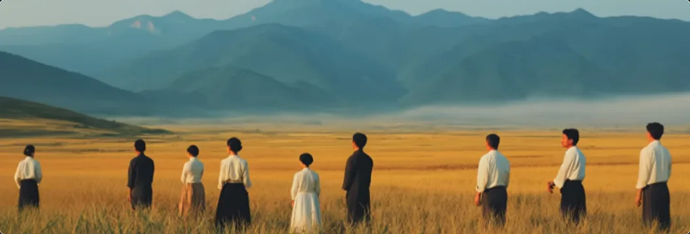
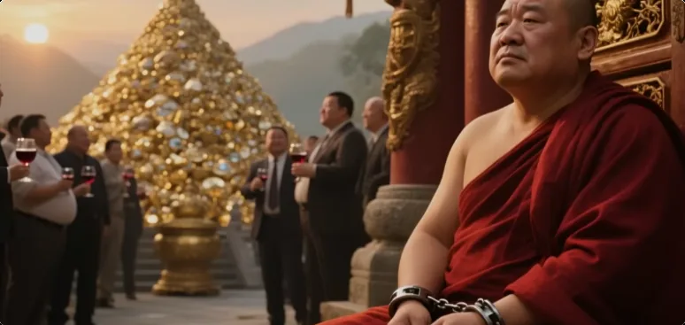
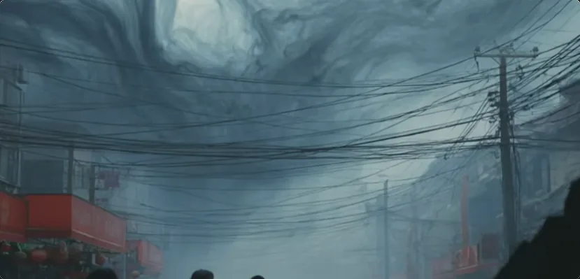
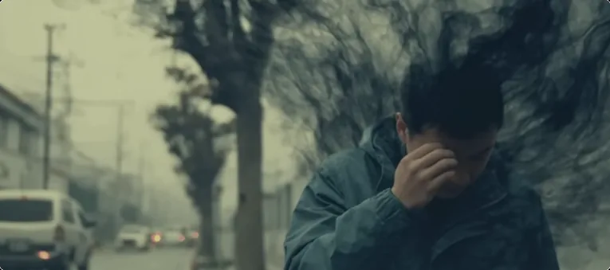

## 你是否有对未来的担忧?
你有没有对未来感到莫名担忧？
不仅是对未来的大环境，也是对个人未来何去何从感到莫名的心慌。

建议你好好看看本期视频。这一期我会透露一些新的视角，远比算命那些要更精准，希望有的人能醒悟。

首先我要说大趋势，不管是在当前还是在未来，人就是要修行的，不修行是不行的。人们会体会到什么叫“不修行就不行”。
好比用饥饿让人们了解粮食的可贵，也终将会有些事情让人们领悟修行的必要性。这也是人类集体必须要学会的下一件事情，就是如何真正地修行。这也是人类命运想要进入下一台阶的重要审核点。

而且人类没有拒绝修行的权利，因为这是天意。也就是说，任何事情都将是围绕让人类学会修行而展开的。

**人类本该在修行的过程中推进文明，现在亏欠太多了。如果再不修行，必然要被心中的嗔念、掌握的技术所反噬。**

其次，我所说的修行绝不是一种生活方式，绝不是去念经、祈祷、打坐、尽心求神、朝拜，这些通通都不是真正的修行。空想主义修不成任何正果。

*真正的修行，得从你的肉体和灵体两个层面去改造，用能量去质变，去提升真正的灵性，提升与自然心神合一的能力，觉醒辨别灵界众生的能力。*
只有这样，人类才能认知世界的全貌，才知道真正的文明发展应该是什么样子，而不是在蒙住双眼的情况下自掘坟墓。

各位之所以感到心慌，不只是因为现实的变化，更重要的是能量层面在变化。大多数人目前就是温水煮蛙的一个状态，只有一部分前世有点修行底子的人感受到了不安。

比如去年我还会帮粉丝或者求道者看看身上的能量场，今年我就不看了。你知道为什么吗？因为现在的人身上越来越脏了，根本不知道自己身上跟了有多少东西，损失了多少生命能量。

而解决的方法也只有一个，就是真正的修行。

### 粉丝朋友的"黑气"案例
这里有个案例。有一个今年刚开始修行的朋友，他说他有一个易学师傅。这几年每年见到他师傅，他师傅都要摇头，说他面带黑气，不知道他又招惹了什么东西。

这次他来修行实践，回去之后立马又见了他师傅一面。他师傅第一眼就察觉到他身上的黑气不见了。观众知道黑气是什么吗？就是一种死气。

如果这个人还不开始修行，结局就只剩下一个了。之前我的视频讲过，能改变生命本质的才叫修行。哪一道能移除死亡之气呢？只有修仙之道。

所以接下来我要讲的是消除大家对修行的误解，或者说普及一下真正的修行路径。

修行绝不是说与尘世一刀两断。如果修行是这样一套说辞，那么全世界99.99%的人都做不到，都会觉得修行离自己很远，最后都不修行了，都在放任不合理的欲望。

## 三条修行的路径: 
所以真正的修行是会给到几条路径的，大致来说可以分三条：

1. **普世路径**：适合所有普通人。
2. **精进路径**：适合有慧根，但没做好离开尘世的人。
3. **飞升路径**：适合少数觉悟高的人。

刚才说的人类最终的归途是人人都要修行，指的就是第一条路。
但是当前大部分人并不知道真正的修行有多可贵，不知道修行其实是跟生命直接挂钩的，不知道人不修为自己是要被天诛地灭的，思维也没有转变过来，所以这条路还没有开放。
我打个比方，人人都知道粮食可贵，不吃就会饿死，所以需要四季务农。也没有人会质疑付出才有收获的道理，甚至收获少点也不敢有怨言。

而目前人们对修行的理解远远达不到这种基本程度。大多数人觉得，修行又不是什么必不可少的事情，修行只是一种精神状态，我为什么还要付出精力去获取呢？

说白了，人们还不能理解，修行是另一种需要付出才能获取、不吃就会饿死的粮食。所以如果我说当下人人都可以修行，那么肯定有人要说了：“拿来吧你。”, 所以现在真正开放的是后两条路，同样需要有一定的认知和觉悟才能修。你是想要精进自己的生命，还是想修上天？现在没有实践和体会的情况下，说这些都为时尚早，不如先接触何为真正的修行，再做选择。

## 修行的可贵性和必要性: 
接下来我会讲几个修行的基本可贵性，或者说必要性。

1. **改变生命本质**
   这一点体现在肉体和灵体两个层面。
   修行就是用纯净自然能量滋养自己，清除掉病气、死气、浊气，建立能量场屏障，防止负面灵体干扰，这样思维才会清明。
   因此，修行人比常人更有生命力，更容易领悟事物的本质。肉体和灵魂双重防御的优势，在未来某些节点上会非常明显。

2. **趋吉避凶的判断力**
   哪里有危险，哪里有灾性在孕育，哪里安全，这个可贵性不用我多说了。

3. **超感官觉察力**
   人靠五感认知世界知识，而修行人可以多一维度，认识到更深层的世界。喜欢读书的人应该清楚，信息差在关键时候有多可贵。

4. **正神的庇佑**
   神灵从天上看下去，个个都是肉体凡胎裹着一层凡气。唯有修行人有一层纯净的能量反射到他眼中，也就多留意你一眼。要有什么事情，也就放你一马了。

5. **能保护家人**
   这是简单的道理。你安全了，你肯定会去保你家人的安全。当然，个人有个人的自由意志，修行人也要尊重家人自己的选择。

如果说这几个可贵性都无法打动你，那真的建议不要修行，等以后再慢慢领悟吧。

如果你认识到了可贵性，那不妨想想种庄稼的比喻：修行的可贵性是比五谷贵呢，还是比五谷贱呢？可不可以不劳而获？可不可以坐享其成？

道理我就不多说了，免得有比我仙风道骨的观众说我太俗了。

## 一些关于"放下"的误解:
因为有很多人觉得，修行就是放下，不要持有或执于任何事情。可佛陀说的是放下尘世上的得失执念，不是连修行上的切实提升都放下。
修行没有耕耘，哪来实际成果？哪来果位呢？

**佛陀本人也说过，要现世正果。如果遇到现实的困难，就闭眼装作视而不见，拿“一切皆空”来美化逃避行为和精神懒惰，恐怕佛陀看了也要摇头。**

真正的修行跟种庄稼一样，修行人就是农民，需要有弯腰劳作的觉悟。只有知道付出和收获都不易，才知道“粒粒皆辛苦”，才懂得珍惜和守成。

以个体为基础，放大到集体来看，天意让人类修行的意义，不仅是要人类学会如何提升生命质量，更是要让人类学会珍惜、学会守成、学会节制。

我是修炼者小烨，我们下期再见。