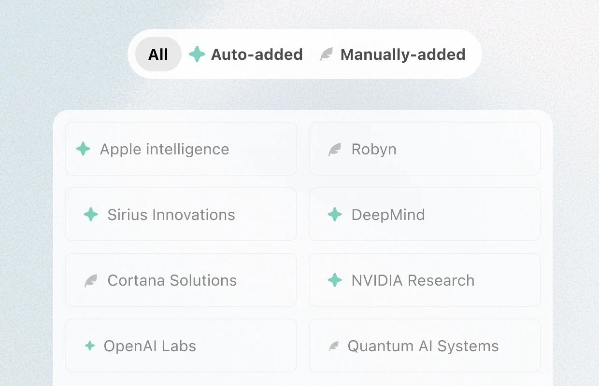
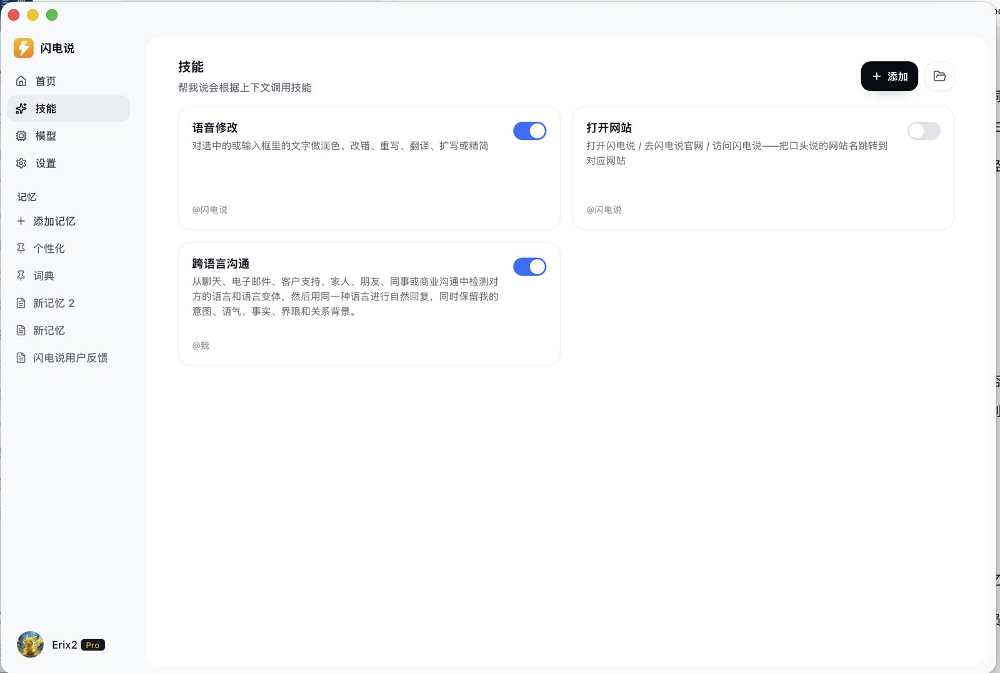

打字慢不是借口了。真正麻烦的是：你一口气装了好几个「嘴替」，热键打架、词库各写各的，最后还是在用最熟的那一套硬扛所有场景。

我这边长期并行三套：

1. **Typeless**（闲鱼拼车，约 168/人/年，三人）——长 prompt、格式化整理的主力
2. **闪电说**（个人会员，约 230+）——短句日常 + 技能 / 关于我 / FAQ 生态
3. **微信电脑端语音输入**（`Ctrl + Win`）——离线兜底，顺手但认不准专业词

官网价位、能力边界对照过公开资料；分工和槽点来自自己的真实排班。不是评测榜，是班表。

## 先把班表钉死

| 优先级 | 工具 | 热键（我的配置） | 上岗条件 |
|---|---|---|---|
| P0 | Typeless | Right Alt | 长 prompt、要强整理 / 强格式 |
| P1 | 闪电说 | F1 短按出字 / 长按帮我说 | 短句、帮回、润色技能、词典生态 |
| P2 | 微信语音输入 | Ctrl + Win | 没网、随手一句日常口语 |

同一时刻只让一套抢麦克风。键位错开就不容易误触；误触了也知道该怪谁。

## Typeless：额度宽、整理狠，专治长 prompt

[Typeless](https://www.typeless.com/) 把自己定位成「真的会整理的听写」：去语气词、去重复、中途改口只留最终意图、自动排列表格和步骤。公开文案还强调个性化文风、个人词典、按 App 调语气、100+ 语言混说。

定价（2026 公开页）：Free 约每周 8000 词；Pro 年付约 \$144（约 \$12/月），月付更贵。拼车落在年付档附近，体感就是「可以放开造」。本机 Pro 有效期到 2027 年中，日请求上限也高到日常打不满——所以我说它额度「无限」，指的是相对闪电说那种小时/积分账本，不是物理无限。

它真正暴杀闪电说的地方，不是「出字」，而是**把乱七八糟的口语收成能直接丢给 Cursor / Claude 的长文**。中英混输、专有名词、一整段需求说明，Typeless 更敢给你排版。

短板也很清楚：

- 公开评测普遍认为它是**云端转写**，别指望断网硬刚（「历史留本机」≠「识别离线」）
- 没有闪电说那种本地 `SKILL.md` 技能树、关于我、常见问题口径库
- 词典在 App 的 Dictionary 页（偏云端同步），本地数据库里主要是历史，不是词条文件

我怎么用：Right Alt 听写；`Right Alt + Space` 走 Ask Anything；翻译用 `Right Alt + Right Shift`。词库手动养，和闪电说那份错词表双向补，长 prompt 专用词优先丢这边。

官网入口：[typeless.com](https://www.typeless.com/) · [定价](https://www.typeless.com/pricing)

## 闪电说：快 + 词典 + 沟通 Agent 生态

[闪电说](https://shandianshuo.cn/)（前身代体）现在官宣自己是「沟通 Agent」：短按直接说，长按帮我说。本地优先的语音识别可以很快；资料库存风格、词典、关于我、常见问题；技能用 `SKILL.md` 描述场景（正式任务 / 轻松聊 / 文学润色 / 熟人帮回……）。Windows 上技能真源大致在：

`%AppData%\Roaming\Shandianshuo\skills\voice_assistant\`

它吃额度：会员侧常见是「直接说时长 + Agent 积分」账本（我这边体感大约月 10 小时量级 + 一千级 Agent 分，以你账号页为准）。换来的是：

- 出字快，适合日常短句
- 词典纠正稳，技术名词可养
- 长按读屏 + 技能路由，微信 / QQ 帮回、润色、对 AI 下指令能「按剧本走」
- 记忆、FAQ、个性化分槽，不怕全塞进一个大文本框

和 Typeless 比，格式化长文的「智商感」往往弱一截；但它是**可装配的本地工作流**，不是单一听写器。把 Agent 正式 / 轻松拆成两条技能后，输出终于不再先开新闻发布会——只要正文。

资料：[官网](https://shandianshuo.cn/) · [文档](https://shandianshuo.cn/docs) · [GitHub Releases](https://github.com/shandianshuo/shandianshuo-releases)

## 微信电脑端语音：Ctrl+Win，离线顺手，专业词容易翻车

2026 年初起，微信电脑端（约 4.1.7+）内置语音输入：Windows 默认 **Ctrl + Win**（也可点输入框麦克风）；Mac 常见 Fn。不止微信聊天框，装了微信客户端后，其它输入框也能调。另有不必按住的组合（如 Ctrl+Win+Shift）。官方还带「整理文字」去嗯啊、理顺逻辑。

独立产品 [微信输入法](https://z.weixin.qq.com) 也宣传离线语音、大模型整理；我日常说的「微信键盘语音」，落点主要是**电脑微信这条 Ctrl+Win 全局能力**——开机即有、不另开会员账本。

它适合干嘛：没网、随口一句「晚上吃啥」、懒得切 Typeless / 闪电说。  
它不适合干嘛：CC Switch、shadcn、Codex、一串英文 API——**没你的专有词库时，专业名词基本听天由命**。识别率在日常口语还行，一进术语区就废，这点和我实感一致。

所以它永远是 P2：兜底，不夺权。

## 三家放一张桌上比

| 维度 | Typeless | 闪电说 | 微信 Ctrl+Win |
|---|---|---|---|
| 我怎么付 | 拼车 ~168/年 | 个人会员 ~230+ | 跟微信走，无另购 |
| 额度体感 | 宽，长文敢说 | 有时长 / Agent 分 | 无会员账本焦虑 |
| 整理 / 格式化 | 最强 | 中等偏上，靠模型档 | 有整理，但上限一般 |
| 速度体感 | 强但不拼极致低延迟 | 快，短句舒服 | 够用 |
| 词典 | 有，云端 Dictionary | 有，本地 md + UI | 基本无个人术语库 |
| 风格 / 记忆 | 自动文风学习强 | 风格规则 + 关于我 + FAQ + 技能 | 弱 |
| 读屏 / 技能 Agent | Ask Anything 等，偏通用 | 帮我说 + 本地技能树 | 无 |
| 离线 | 基本不行 | 本地 ASR 可离线出字；帮我说看模型 | 体感可离线硬刚日常 |
| 典型上岗 | 长 prompt | 短句 / 帮回 / 技能 | 随手口语 |

别跟自己较劲「只能留一个」。钱都付了，按场景换人比站队划算。

## 词库别养三遍

长 prompt 里炸过的词，先丢 **Typeless Dictionary**。帮回、短按里炸的，写进 **闪电说词典**（格式就 `错 → 对`）。微信那条别指望养词库；一进术语区直接换人。

Cloud / Claude、shadow / shadcn、CG Switch / CC Switch 这类易错骨架，Typeless 和闪电说各留一份就行，别搞第三份。

技能、关于我、常见问题是另一摊：只活在闪电说本地。Typeless 再强，也不会去翻 `%AppData%\Shandianshuo\skills\`。

## 现场怎么换人

对着 Cursor 喷二三百字需求，上 Typeless。QQ / 微信要帮回、要正式轻松两套口径，长按闪电说。电梯没网只回「到了」，`Ctrl + Win`。两套热键别同时按住，麦克风只会认一个，乱了你也烦。

## 只想留一个？以及我为啥没砍

别问最优解。我砍过，砍完又装回来。

真要砍：天天长需求、中英混着喷、云端你认了，留 Typeless。天天靠帮回、还想养技能和 FAQ，留闪电说。啥都不想配、只求随手出字，微信那条够用，别拿它认 CC Switch。

我三个都挂着，一半是会员钱已经砸了，一半是这三家根本不打同一个工种。Typeless 能把胡扯口述收成能贴进 Claude 的稿；闪电说那套技能和关于我，Typeless 读不到；没网的时候前两家都别指望。所以这不是「三合一信仰」，就是懒得再选一次。班表写进置顶备忘录，按场景按键，比纠结谁更贵有用。

相关链接：

- Typeless：https://www.typeless.com/
- 闪电说：https://shandianshuo.cn/
- 微信输入法：https://z.weixin.qq.com/
