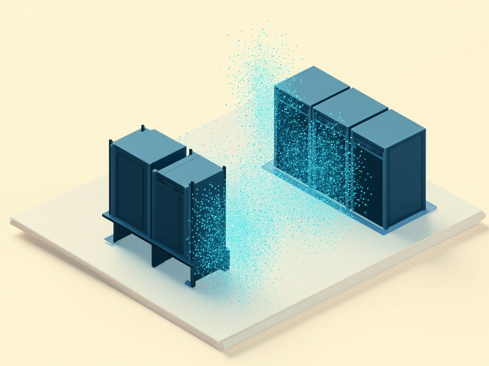

这篇是同主题三篇实测的**正文合并**（不是另写一篇空对照）。下面三个二级标题对应原来三帖的全文骨架，读完等于以前翻三帖。

合并来源（旧独立帖已并入本文并下线）：Best Codex 三把钥匙与 Luna 账本 · 双 Pro 拼池压测 · K12 号池 403 排错。

---

## Best Codex：三把钥匙、一个 Luna

早上邮箱里蹦出「好久不见，送你 50 额度」。人一懒就容易把这种中转站忘在角落，但这次正好想搞清楚：Best Codex 到底能不能扛 Codex / Claude Code / 生图，以及**一美元在 Luna 上能熬多久**。

测完余额变成 **$39.47**。掉的那十来块，教训比数字更值钱。

接到 OpenCode 之后怎么分活，见 [把高成本判断留给 Luna](/posts/opencode-luna-deepseek-minimax/)。并发脾气见下文「双 Pro 拼池」。

### 先把站点想明白

Best Codex 是个 AI API 网关（自家叫 sub2api 一类）。你拿 Key，工具打到 `https://api.bestcodex.xyz/v1`，它再往上游转。

配工具时别手写一堆 toml / json 来回改——**CC Switch** 才是正经入口：官网一键「导入到 CCS」，Codex / Claude Code 共用配置。

还有个坑得先说：**分组决定能力**。同一域名下，不同 Key 能打的模型和协议完全不是一回事。列表里看见的名字，不等于这组账号真接得上。

### 三把钥匙，各干各的

| 钥匙 | 分组体感 | 真能用的 | 评价 |
|------|----------|----------|------|
| GPT 活动（约 0.6x） | 文本 / Codex | `gpt-5.6-luna` / `terra` / `sol` 等；Chat、Responses、流式、Tools 都通 | **日常写代码主力** |
| 画图专用（标 0.15/张·异步） | 只生图 | 实质只有 **`gpt-image-2`** | 质量可以，**额度杀手** |
| Claude 超值 / Kiro（约 0.6x） | Anthropic 协议 | **`claude-sonnet-5`** 稳；`sonnet-4-6` 也能通；大量旧 Sonnet 上游 502 | **Claude Code 专用** |

别混着用：Claude Key 去打 GPT 会吃闭门羹；画图 Key 塞进 OpenCode 聊天配置，纯属对牛弹琴。

### 模型怎么选才不后悔

- **Codex / OpenCode 主用**：`gpt-5.6-luna`，推理档日常用 **high**，别动不动 **max + 超长输出**（实测会拖到超时）。
- **均衡备选**：`gpt-5.6-terra` + high，体感稍快，够用。
- **Claude Code**：死磕 **`claude-sonnet-5`**。列表里一堆 Opus / 老 Sonnet / Fable，好看但不能当真。
- **生图**：只在需要时开 `gpt-image-2`。产品图、图标、复杂夜景都像样，但今天 OpenAI 侧 **~$10.53** 基本是它贡献的。

性价比排序（结合 0.6x 和仪表盘实际扣费）：**Sonnet 5 ≈ Luna/Terra 文本 ≫ 画图**。文本便宜到几乎可以「随便试」；画图不行。

### $1 在 Luna 上大概能干多久

按仪表盘当时一行粗算：`gpt-5.6-luna` 约 **18K tokens / $0.0022（实际）**。

| 口径 | 约合 / $1 |
|------|-----------|
| Token | **~820 万** |
| 短问答（~320 tok/次，含网关注入） | ~2.5 万次 |
| 中等编码（~800 tok/次） | ~1 万轮 |
| 偏重一轮（~2K tok） | ~4 千轮 |

说人话：**一美元的 Luna，正经写代码能熬很久**。你现在剩 ~$39，如果几乎只跑 Luna 文本，压力主要不在余额，而在自己舍不舍得刷。

两个记账细节别忽略：

1. 短 prompt 也会冒出 ~300 prompt tokens——网关爱塞系统上下文。
2. 仪表盘单价会变；上面是量级，不是合同价。

Luna 短中请求一般 2–4 秒内回来；`max` 拉长输出时，我这边出现过 **180 秒读超时**。舒服的用法是 high，不是拉满。

### 生图那笔账，值得单独骂一句

画图分组对外标「0.15/张、异步」，接口却是同步等结果：`POST /v1/images/generations`，大约 **50–70 秒**吐 CDN URL，模型名白纸黑字 `gpt-image-2`。

质量没话说。可今天总消耗里，OpenAI **$10.53 / 58 次**，Claude 几乎是 **$0**。聊天探测那点 token 根本填不满十刀——**大头就是图**。

以后规则简单：Agent 默认别绑画图 Key；要图就单独开，并去「使用记录」核对真实单价，别只信分组文案。

### Claude 这条线的真实水位

- 协议：`/v1/messages` 正统 Anthropic；顺带 `/v1/chat/completions` 也能转。
- `claude-sonnet-5`：对话、流式、Tool use、写码都过了；轻并发 8 路无 429。
- 列表里很多 Sonnet 显示有、一打就「Upstream access forbidden」。**列表 ≠ 可用**，固定 Sonnet 5 最省心。

OpenCode 侧 Anthropic provider 指到 `https://api.bestcodex.xyz/v1` 即可；Claude Code 用环境变量或 CC Switch 导入同理。

### 我会怎么挂日常

```
Codex / OpenCode  →  GPT 活动 Key  →  gpt-5.6-luna (high)
Claude Code       →  Claude/Kiro Key →  claude-sonnet-5
偶尔生图          →  画图 Key        →  gpt-image-2（按次想清楚）
```

密钥别再往聊天、截图、公开文档里扔。测完轮换，尤其是还要长期挂的那两把文本 Key。

### Best Codex 带走的几句

中转站好不好用，不看宣传页模型墙，看**分组真实接通了什么**。  
Best Codex 上：Luna 写代码香且便宜；Sonnet 5 走 Claude 也香；画图好看但会把「50 额度」咬出可见缺口。  

剩 $39 的玩法很明确——**把 Luna 当主粮，把生图当零食。**

---

## 双 Pro 拼池：并发一上来就露馅

号商把两个 ChatGPT Pro 账号拼成池子，套一层 OpenAI 兼容 API 卖中转。这种中转满大街都是，但水平参差。我花了一上午把它三款模型实测了一遍，顺便踩了几个坑，写下来给你省时间。

> 并发不超过 3 的时候它非常好用，写个 HTML 静态页 9 到 10 秒出完，首包延迟 1.6 到 2 秒。但别拿它当高并发底座，并发过 10 延迟开始排队式恶化，高压流式还会 502。额度没有查询接口，你付的是号商服务费，不是 API 里能查的余额。

### 先看它是什么

OpenAI 兼容协议，Anthropic 的 `/v1/messages` 也通。模型白名单 7 个：gpt-5.6-sol / terra / luna、gpt-5.5、gpt-5.4、gpt-5.4-mini、codex-auto-review。注意它是明文 HTTP，这个后面单独说。

### 压测最怕各测各的，口径先定死

| 指标 | 定义 | 说明 |
|---|---|---|
| TTFT | 首 token 延迟 | 请求发出到收到第一个分片 |
| 纯生成 TPS | 生成速度 | 输出 token ÷（总耗时 − TTFT）|
| 稳定并发 | 错误率可控的最大并发 | 并发阶梯逐档试出来 |

两条硬规矩：TPS 必须扣掉 TTFT 再算；错误率要把流式中断算进去，HTTP 200 不代表响应拿全了。这类流式接口得自己解析分片，现成压测工具不太顺手。

### 三款模型，脾气各不相同

| 指标 | gpt-5.6-luna | gpt-5.6-terra | gpt-5.6-sol |
|---|---|---|---|
| 定位 | 轻量快响应 | 均衡 | 旗舰重推理 |
| 空闲流式 TTFT | ~2s | ~1.6s | ~1.7~2.2s |
| 长输出 TPS | ~50 | ~52 | ~40 |
| 3 并发小任务 | ~9s 出完 HTML | ~10s 出完 HTML | 短任务更快，长页 15~24s |

- **luna 是快枪手**。日常首选，首包最低，也最耐并发。长文档别指望它。
- **terra 是均衡款**。数据点少，但 3 并发下 10 秒出完落地页，表现最平。
- **sol 是重炮**。输出质量最高，但最慢，写长页要 15 到 24 秒。短任务反而结束得快，适合深度推理。

### 并发一上来，就露馅了

| 并发 | 平均延迟 | 长尾 |
|---|---|---|
| 5 | 5.9s | P95 7.1s |
| 10 | 20.6s | P95 31.6s |
| 20 | 29.2s | P95 51.9s |

延迟随并发线性恶化，稳定吞吐只有 QPS 0.4 到 0.7。两个账号的配额就那么多，并发再高只是排队。判定口诀：单请求快、并发就垮，基本就是账号拼池。



### 上下文倒是出奇地大

塞到 200k 字符（约 128k tokens）还能正常返回，120k 之后响应反而变快，疑似命中 prompt caching。两次独立测试都没摸到硬上限。

### 踩的坑，一个比一个值钱

**短任务 TPS 是假的。** 几十个 token 的短任务，生成段被连接建立和首包延迟盖住，TPS 能虚高到 15 甚至更高。TPS 只信长输出，短任务只看 TTFT。

**高压流式会 502。** 并发拉高后流式响应中途断流，网关直接 502，偶尔返回 200 但内容只有一半。客户端必须校验结束标记，压测要把「200 但没结束标记」算失败。

**额度查不到。** 常见余额接口全是 502，像是把请求原样转给 chatgpt.com。买的 120 到 130 刀是号商服务费，不是 API 余额，只能问卖家或用到报错。


**明文 HTTP + key 已暴露。** 传输是明文，key 又在多个会话里出现过。当已泄露处理，用完轮换。

**TTFT 单次波动大。** 1.9 到 6.9 秒都出现过，看中位数别被均值带偏，空闲串行重测最可信。

### 拼池怎么选

| 场景 | 选谁 | 理由 |
|---|---|---|
| 日常对话、补全、小任务 | luna | 首包最快，最耐造 |
| 长文、分析 | terra | 上下文稳，性价比平衡 |
| 深度推理 | sol | 质量最稳，但慢，走离线批处理 |
| 并发 | 控制在 3 到 5 | 超过就开始排队 |

说到底，它是典型的「单请求快、上下文大、并发弱」中转，适合个人工具和日常 AI 编码辅助，不适合当高并发服务底座。

---

## K12 号池：一次 403 的刨根问底

起因特别朴素：GPT 桌面端和 Codex CLI 一起「吐不出字」，报 `403 codex_workspace_access_denied` 或者 `502 no auth available`。本以为是号商账号的问题，查到最后发现是三层问题叠在一起，其中一层反直觉到让人拍桌子。中间几次被事实打脸的地方也留着，比顺理成章的教程有用。

**「Codex 不能用了」从来不是单一原因。坏掉的代理 URL、被写死的高优档、名不副实的「10 个号」，缺一不可地把它卡死了。**

### 先给结论

| 层 | 问题 | 现象 | 能不能救 |
|---|---|---|---|
| ① 代理 | 上游代理 URL 被写成裸端口 `7892`（缺 `http://127.0.0.1`） | `proxy URL missing scheme/host`，请求卡 60–90s 零输出 | ✅ 配置改对就行 |
| ② 服务档 | 中转服务给所有请求强制注入 `service_tier=priority` | priority 档在 ChatGPT 上游要 Codex workspace 授权，K12 没有 → 403 | ✅ 改 default 就通 |
| ③ 账号结构 | 「10 个 K12 号」其实是**同一个 ChatGPT 账号的 10 个令牌** | 并发上限是 1，突发请求必触发冷却 | ❌ 账号硬伤，只能找号商 |

修复①②后 Codex 能正常跑；③是容量天花板，工具再怎么调都救不了。

### ① 代理 URL 被写残

最没技术含量的一层，但危害最大。中转服务的上游代理地址被存成了 `7892`，没有协议头和主机名。后果是侧车配不出代理拨号器，请求直连 `chatgpt.com` 被墙，干等 60–90 秒然后超时，一个 token 都回不来。

排查信号：日志里反复出现 `proxy URL missing scheme/host`。修法就是把值补成完整的 `http://127.0.0.1:7892`。

这里有个坑：中转工具的 GUI 会在配置变更时**用自己那份坏配置覆盖侧车运行时配置**，所以改完一次不够，得连「配置源」一起改对，否则一重启又打回原形。

### ② 403 的真凶：service_tier=priority

这一层最反直觉。现象是：`/v1/responses` 接口全 403 `codex_workspace_access_denied`，错误文案是「Contact your ChatGPT workspace administrator for access」，工具把它映射成「账号需要付费」。当时差点认定是号商没开 Codex 权限。

但控制变量一测就露馅了：

| 请求带什么 | 结果 |
|---|---|
| `service_tier=priority` | ❌ 403 |
| `service_tier=default`（或省略） | ✅ 200 |

原因：中转服务的 payload 给**所有**请求硬塞了 `service_tier=priority`，而 priority 档在 ChatGPT 上游要求 Codex workspace 授权，K12 这类号没有，于是全部 403。改成 default 档，Codex 原生 responses 协议直接跑通。

排查这类 403 的顺序应该是：**先看请求里有没有被注入什么档位，再怀疑账号权限**。档位这类「看不见的附加参数」最容易成为隐藏真凶。

### ③ 「10 个号」其实是 1 个号

号商号称给 10 个 K12 账号。翻一下每个「账号」的鉴权文件，`account_id` 全部是同一个值——**这不是 10 个号，是一个 ChatGPT 账号发了 10 个访问令牌**。

这解释了所有诡异现象：

- **并发上限是 1**。轮巡在 10 个令牌之间转，但背后是同一个账号，账号被限流时 10 个令牌一起「冷却」。
- **「冷却」的单位是账号，不是令牌**。工具内置的冷却机制是：账号上游报 403/429 → 标记冷却约 30 分钟 → 轮巡跳过它。10 个令牌共享一个账号，一冷全冷，于是频繁出现 `no auth available`。
- **突发请求是死穴**。顺序、低频请求能一路 200（实测咖啡站任务 15+ 笔全成），但几秒内并发几笔，账号瞬间被掐 → 403 → 全池冷却。

`service_tier=default` 修的是 ②，救不了 ③。想彻底摆脱冷却，只能让号商给**真正独立、有 Codex responses 授权的账号**，或者接受 K12 只适合低速顺序用。

### 排查方法论：比结论更值钱的部分

回看整个过程，判断被推翻过三次：

| 当时的判断 | 被什么推翻 |
|---|---|
| 「额度爆了」（看到 GUI 显示 1000%） | 1000 其实是 10 令牌×100% 的池聚合，不是超额 |
| 「账号被 ChatGPT 封了」 | 令牌对配额接口 200 正常 |
| 「K12 只支持 chat，新版 Codex 只认 responses，不兼容」 | 控制变量发现 service_tier 才是分水岭 |

三条原则撑住了排查：

1. **拆层**。工具配置、网络、账号资格、协议、请求参数，一层层剥，别指望一次定位。
2. **控制变量**。同样的请求只改一个参数（priority vs default），结论立刻清晰。比翻一百行日志有用。
3. **诚实纠错**。每条错判都用新证据覆盖，不抱着旧结论硬撑。

### 顺带：Codex 新版砍了 wire_api=chat

中途想过「让 Codex 走 chat 接口绕过 403」。查官方讨论才知道，**Codex 从 2026 年 2 月起（0.92.0+）彻底移除了 `wire_api=chat`**，只支持 responses。所以「用 chat 绕」这条路在新版上根本不存在，老老实实从服务端档位下手才对。

### 实测：修完之后到底什么水平

修好①和②后，Codex CLI 走完整链路（本地 CLI → 中转 → 号池）跑了个真实任务——咖啡店落地页 + 按 review 意见修问题：

- **顺序请求 15+ 笔全 200**，上下文从 45K 累积到 120K 无中断
- 产出代码质量：语义化、无障碍（aria、reduced-motion）、设计令牌、纯 CSS 插画、移动端汉堡菜单——达到顶尖模型水准
- 平均单请求 2–5 秒出字，~23 token/s 输出吞吐

最核心的一点是：**K12 号池当「低速单发通道」用完全够，当并发底座是拿错工具**。要并发，买真的账号或找能开 responses 授权的号商。

### 附录：这条排查路的完整记录

下面这张终端长图是排查全程的复盘，从「以为服务挂了」到「service_tier 才是真凶」，每一步的判断和被事实打脸的地方都留着，算这趟折腾的纪念：


