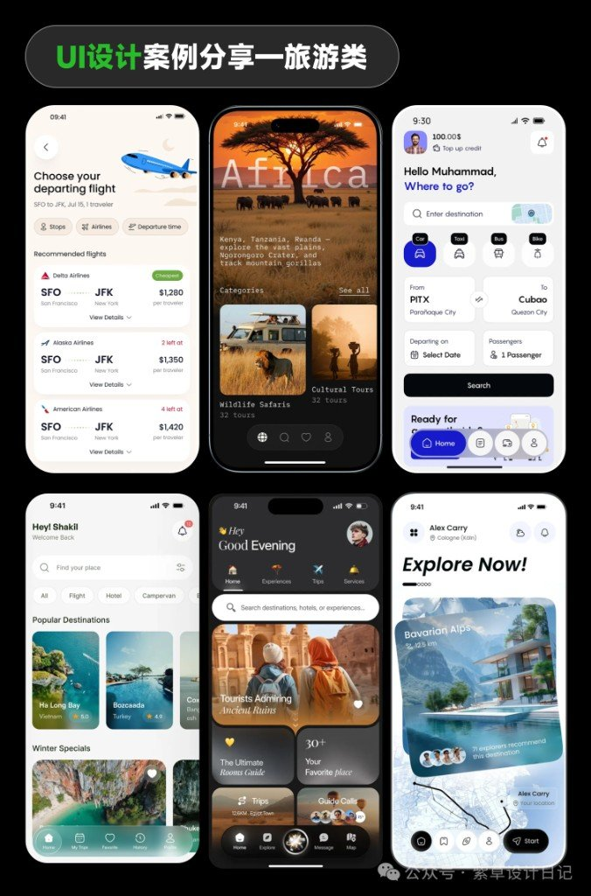
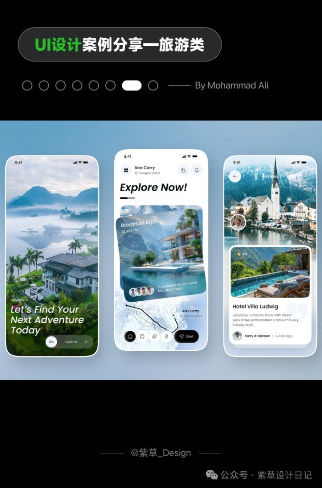

旅行产品的坑通常不是「不够美」，是选项叠太多：机票、酒店、攻略、约车、地图同时抢注意力，用户还没出发就累了。紫草设计日记这组「旅行类 02」拼图，钩子写得很直——怎么把决策焦虑压下去。下面只留能带走的几条，案例当对照表，不当审美鸡汤。

## 决策焦虑从哪来

信息密度高，不等于信息架构清楚。功能入口墙一排图标，等于把「你自己想该点哪」甩给用户。

这组案例反复出现的解法是同一方向：

| 做法 | 在屏上长什么样 | 焦虑被砍掉的是什么 |
|---|---|---|
| 场景化首页 | 目的地大图 / 「Explore Now」/ Good Evening，而不是九宫格入口 | 先选场景，再进功能 |
| 行程/结果卡片 | 酒店+评分+距离、航班+价+余票，挤在一张卡 | 少跳页、少对照 |
| 实景取色 | 草原金、沙漠暖、阿尔卑斯绿进按钮与点缀 | 界面跟目的地同温，少「模板蓝紫」 |

不是说功能入口可以永远消失——是首页别当工具箱封面。

## 八个案例，按「一屏在干嘛」读

设计师署名以图面为准；公众号水印为紫草设计日记 / @紫草_Design。

| 设计师 | 产品/主题线索 | 这一屏主要在解决 |
|---|---|---|
| Paperpillar | 浅色机票流 | 列表筛选 → 选座 → 航班详情，步骤拆开但不碎屏 |
| Ronas IT | Africa / 草原 | 实景开屏 + 分类卡（Safari / Cultural）+ 地图进度 |
| Fazlur Rahman | 约车 + 地图 | From/To + 车型 → 地图选乘 → 选司机，路径短 |
| Harunur Rashid | Fearless Travel（深色） | 发现首页叠推荐卡；当日行程挂路线 |
| Juice Lab | Petra / 暗色体验 | 问候式首页 + 房间指南卡 + 目的地网格 |
| Md. Shakil Hawlader | Elvara（浅绿） | Find your place 分类条；My Trips 状态标签 |
| Mohammad Ali | Odyssey / Bavarian Alps | 地图底 + 大卡推荐 + 酒店详情浮层 |
| Budiarti R. | 机票结果 / 登机牌 | 排序芯片 + 选航班；登机牌一页带走 |

总览拼图把上述几类压成六格对照，适合先扫一眼再钻单案。

## 拿来用时的边界

- 欣赏与对照：看信息怎么折叠进卡片、首页怎么先讲场景。
- 别当商用模板：图上作品归属各设计师 / 工作室；公众号是二次编排分享。直接扒布局、插画、摄影去上线产品，版权风险自担。
- 系列：标题带「旅行类 02」；Knowledge 近 7 日无同题「紫草 / 旅行 UI」撞车，本篇独立落盘。若日后补到「01」，再互相写对照即可。

规范官网速查见同批 [六家设计系统书签](/posts/six-app-design-systems/)（草稿箱）。
