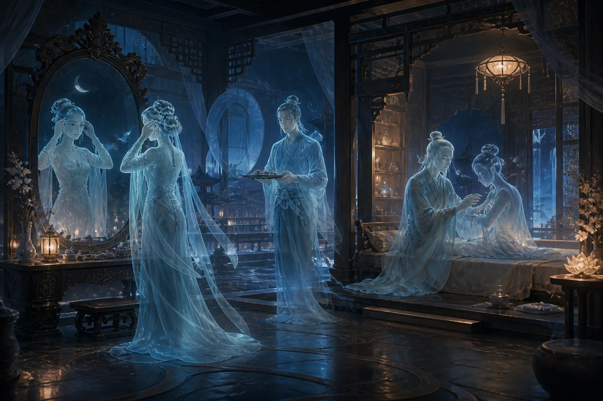

大家好，我是玄灵，这是一个关于九幽还有地府的一个系列的视频。关于这个主题，我其实也想过很久，一直说要做几年，一直拖到现在。最近因为进入到九紫离火运了，身边越来越多通灵相关的东西，包括平时现实生活中的人，也有越来越多接触到这些东西。

由于我自身还有元神，经常接触到九幽地府的一些事情，可能对这方面稍微了解一点，所以我愿意做一个视频，给大家无偿分享一些我知道的关于九幽地府的事情。
同时我这个也是有一个任务在的。至于信息的准确性，可能会有些人在认知中跟我不一样，大家不要赶我，我这边只是做一个信息的传达。那现在废话不多说了，我们开始讲一下我这边知道的。

## 一、死后魂魄去向与审判流程

### 1. 魂魄分离与勾魂流程

首先说人噶了之后的流程。先从肉身上说，肉身上我们有魂魄，肉身之外的魂魄也叫做神魂。首先魂中有天地人三魂：天魂、地魂、人魂。

我们人是被天地阴阳所生，所以在噶了之后，你的天地二魂还有能量会返还给天地，归于天地。然后人魂会进入到一个轮回，对于普通人来说，人魂会进入到一个轮回。那我们的魄会去哪里呢？人死了之后，魂魄是从谷道出的，然后慢慢就消散于人间了。

这个魄的能量就消散了，如果说附近有一些其他的生灵，有些会食用，就是会把你这个魄的能量给吸收进去。然后我们这个人魂就会被阴差，也叫做勾魂使者，就是阴差的一部分，这个职位是勾魂的。

勾魂使者会把我们的魂勾出来之后，会带我们去到土地公那里。土地公那里会简单收留一下，给你检查一些事情，查一下是不是有记录，勾魂的册子上是否有你的记录，有没有搞错之类的。检查没有问题之后，我们就会被带到城隍爷那里去。到城隍爷那里就会办手续，就是你的死亡证明这种的。你在人间办了手续，当然在灵界也会办手续。之后就会经过很多地方，什么恶犬山之类的，达到了我们九幽的一个酆都。

### 2. 审判结果与去处

酆都里头的十殿，里面会有各种七十二司，其中十殿的一些判官就会检查你的生死簿，还有你的命簿。命簿会记录你在阳间的一切事物，类似于编年体那种，会把你哪一年干了什么事情记录在案。然后检查你犯了什么错，也就是赏罚，会检查你的功过。

这时候就会有几种情况了：

- **重大罪恶**：如果你犯了重大罪恶，干了很多坏事，特别严重的话，肯定是直接压入地狱了。这个不用多说，地狱十八层，大家也都了解，各种影视作品中也有写。还有一个可能提的人比较少，就是你会被流放到血海里面。血海里面有很多上古的生物，甚至还有一些修罗族比较残暴的生灵都在。这时候你基本上就是回不来了，很难回来。
- **轻度恶行**：如果说你犯的是轻度一点的，对于一些比如说神主、神二代、神三代这种，本身是下界来办事的，结果又犯下重大的恶行，那肯定会被拖去给丽芙打工，比如说当勾魂使者，就是所谓的*鸡爪子钱少、事儿多*，基本上干个千八百年吧，少说这么多。
- **投入恶道**：还有一种情况就是你会直接被投入恶道，比如说道家的五道轮回，其中的禽兽道、恶鬼道也是很惨的，这两道特别惨，基本上你是没有自我意识的，只是单方面受苦，没有任何自我意识。

然后我们再说一下，如果说你没有犯什么大的罪恶，就是普通人。普通人会根据你的业力，也叫做福报业力，福报各种天德、地德、人德、阴德等等，去统计成你的一个业力换算。

这个是专门在下面有一个标准的换算之后，如果你的业力还是处于一个比较好或者正常水平的话，会把你的业力变现一部分，可以兑换成米、冥币、冥力等等。这个业力其实也算是通货，在下面跟那些黄纸元宝也一样，也算是通货。

### 3. 家族祖地与头七

之后你会被带到家族祖地。阴差会告诉你的祖地在哪里，地图那些会给你，然后把你带到家族祖地，或者你自行前往。

> 这个祖地我要重点说一下，它是根据你在世的男方，就是比如说你爸爸、爷爷、太爷爷、祖太爷爷这种，是男方的一个家族祖地，在下面的一个根据地。这个也是跟整个家族的业力都有关系，家族的业力决定你的祖地的宅子有多大，里面人口有多少，当前没有投胎的人口有多少，他们都会一起住在这个里头，算是你的一个出生点吧，就像游戏的一个出生点一样。

然后你暂时就被分配到那里去了。当然，如果说你想去买新房子什么的，都是可以的，如果你的业力够，你的米够，想买新房子也是可以的。之后你会在那里自由活动七日。
七日之后会有专门的阴差盯着你，把你送回阳间去过你的头七，这时候你也可以跟家人见最后一面。后面也会讲一下亡魂如何返回阳间，会有哪些节日是正常返回，还会有哪些阳间阴魂的福利。

## 二、亡魂的形态、疾病与家庭

### 1. 外貌变化

人嘎了之后的外观，因为很多人有一个疑问，比如像一些横死的鬼，被撞到稀巴烂那种，已经成泥成河了，这种成盒了。那如果说成盒了之后，在下面没有投胎之前那几十年、几百年，我是不是一直都是那个样子？
这个是有一个权利可以改变容貌的。

>因为你们知道在地府九幽，无论是九幽还是九天，法界是跟我们维度不同的。我们现在是三维，他们那边是至少四维以上。这个是没有物质形态的，就是一个精神层面的东西。当然我们现在以三维的头脑没办法理解，大概意思就是他们是没有物质存在的。所以对于容貌来说，只是高维度投射下来的一个面而已。因此他们是能够改变容貌的。

改变容貌你可以花钱，下面的元宝、蜡烛、黄纸、玉皇钱等等一些硬通货，就是正常流通的东西。

然后你也可以花元宝到医馆，下面各个城邦也有医馆，专门会有医生给你做变换。如果自身之前是法师，或者是鬼修，自身有一定的法力，也可以有一个法身存在。法身也是可以变换、幻化的，包括你想变成多漂亮的大美女，什么都可以。因为如果你会通灵到下面去，你会发现基本上人人都是大美女、大帅哥，比现实中的明星好看多了，你可以变换容貌，所以这个不需要担心。

### 2. 疾病治疗

再讲一下疾病。很多人也有疑问，问我说，雪岭，比如有些人得重病走的，或者瘫痪，下肢出现问题走不了路，那在下面几十年几百年，是不是什么都干不了了？

这个其实跟外貌是一个意思，也是可以去医馆，花钱、花米去改变你的容貌、改变你的身体，各个疾病都是可以治好的。然后也可以在阳间找人给你做天医科这种，就是把亡魂的身体治好。各个派都不同。就哪怕你成盒了，成一坨了，甚至被绞肉机搅碎那种，也是不影响你的，因为你的魂还在。除非你非常倒霉，生魂出去后遭意外，

比如被罡风撕裂，或者被其他东西吞噬掉，属于你的*游戏存档整个被卸载了*，这种基本上就悬了，没有机会了。否则哪怕在阳间成盒，你还是有意识存在的，但不一定完全存在，意识有可能只剩下一部分，比如会有失忆的情况，甚至脑子没法思考，只有简单的一些生理行为，这个也是有一定可能性的。

### 3. 家庭关系

再讲一下家庭方面。这个也有很多人问，比如之前找法师给家里人送东西，家里老人去世后，给爷爷和奶奶送东西只送了一家的，然后奶奶过几天托梦说没有收到东西，还在要东西，大家不知道为什么。

我讲一下，嘎掉之后，之前的感情就不算数了，哪怕你们之前是夫妻，嘎掉之后今生的情缘也已经了结了。在下面你又可以进行重新的婚配，下面也会有婚介所存在，自由恋爱，跟阳间差不多，感情上面跟阳间差不多。为什么下面还是会有人结婚呢？因为这个魂自身的生理欲望还在，还没有断干净。

## 三、九幽阴间的世界设定

### 1. 环境与时间

再讲一下九幽阴间的场景。首先九幽阴间是没有白天的，不会像我们现在正午、午时阳光很大，没有的。基本上只有三种：
- 早晨那种天刚刚亮、雾蒙蒙的；
- 像黄昏昏暗的灯光，昏暗的月光，月光亮度大概就跟黄昏差不多；
- 完全的黑夜，一点光都没有。

其实大部分时间是完全的黑夜。然后有一些会通灵的小伙伴，还有会出体的，可能看到过天上有一个挺亮的地方，如果往上飞上去，会看见那里其实是轮回殿。但这里有结界的，不一定每个人都有手续能上去。

### 2. 九幽的定义与范围

九幽到底是什么？他跟地府有什么区别，他跟酆都有什么区别？九幽我们一般理解是叫幽冥界，也就是死后的世界。这样说有点太小了，因为本身在九幽下面，会有很多种很多个种族生命，不光只有鬼、小鬼、亡魂这些，还有一些种族，比如僵尸、妖兽，甚至底下还有妖姬，修罗界也挨得不远。

整个九幽非常大，至少面积在我目前探索下来，至少有几百个地球那么大。同时整个九幽地界有非常多的传送门，还有一些结界存在。传送门顾名思义，就类似于游戏那种，你从这里进去之后会来到一个新的地方。有些传送门可能直接通到九幽的某个地界，有些是维度的传送门，会带你去到其他的维度、其他的地界，非常非常大。

同时，他不光是只有地球的生灵投胎到九幽，其他地方、其他维度的生命体，如果体质纯阴了，万物都是由阴阳组成的，纯阴之后自然就会来到九幽。不是说只有地球上才有，其他维度的生命体阳耗尽之后，自然也会来到九幽。这是我目前知道的。

### 3. 结语与下期预告

今天时长也这么长了，就聊到这里。下一次想知道什么内容，可以在评论区给我发，想了解什么我会讲。如果没人发，下一期我准备讲一下在九幽的生活上的事，就最简单的衣食住行。下回就这样咯，拜拜。
