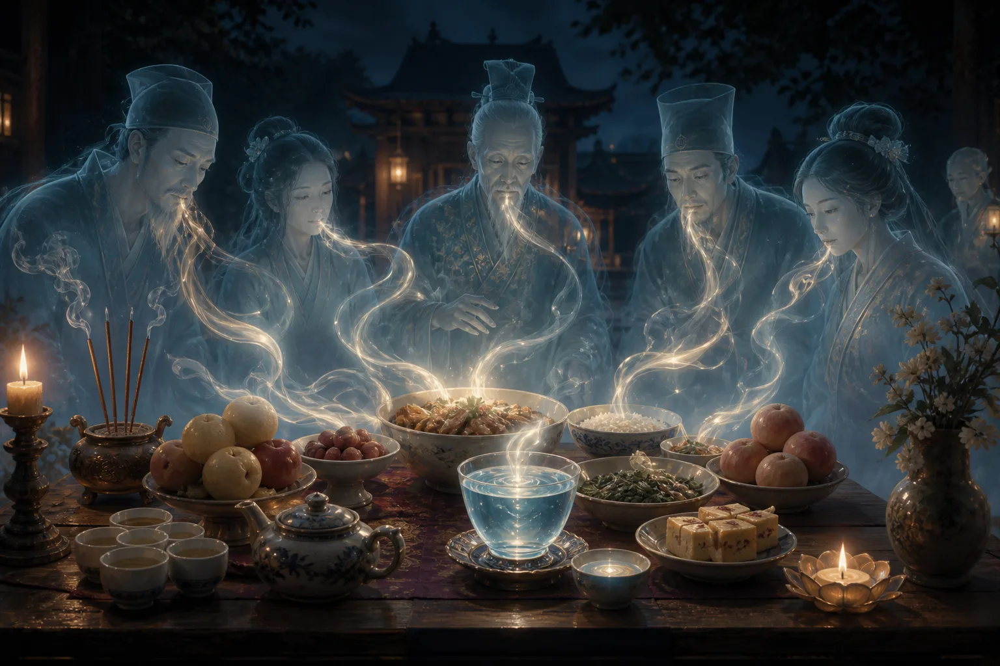
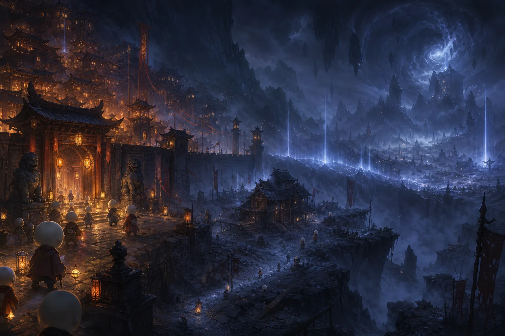
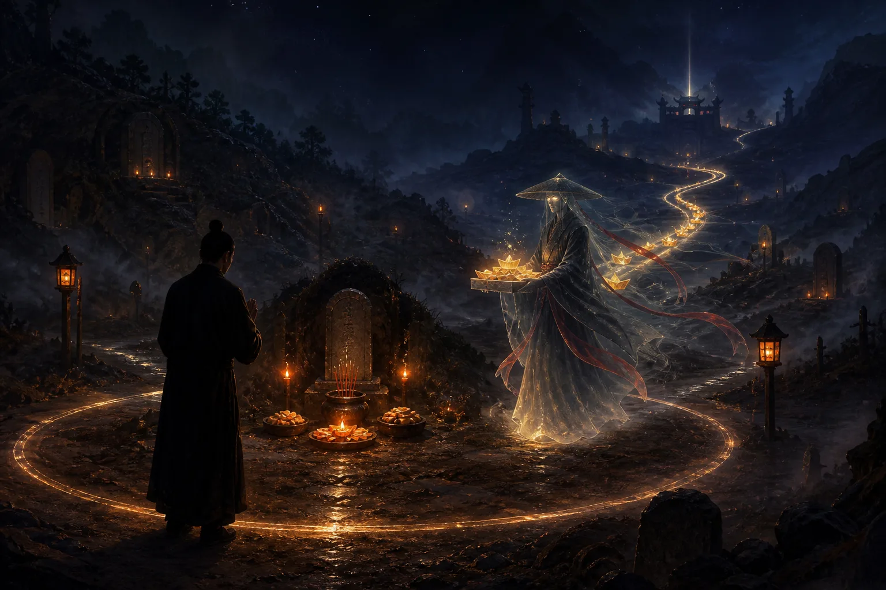

大家好，我是玄灵，也是被催更了很久。咱们的阴间冷知识第二期开始了，今天要讲一下衣食住行各方面，这也是大家后台私信我最多的内容，都很想知道下面的衣食住行到底是什么样子。在开始之前，我先声明一下，视频的全部观点都是我个人的主观思想，大家相信科学，如果不信也无所谓。

## 一、衣着：鬼魂穿什么，衣服有什么功能

下面的人穿的衣服，首先有天然材质的，你给它烧的话，可以烧天然材质的，比如像纸、棉、棉花纸这种，是能够正常烧下去的。如果说衣服就是那种纸衣服，不是特别精致，比如没有扣子、没有口袋，是画出来的那种，没关系，它烧下去自然而然就会变成衣服。一般棉的比较多，像寒衣节的时候，你可以给祖先烧纸衣，也可以。但如果是棉的，细节肯定更好一点，下去的话质量也会更好一点。

如果说这个人家里都没有人给他烧，他怎么办？他可以在下面的铺子里去买。同时衣服也会有一些属性的差异，比如可以称之为法器的衣服，这种衣服兼具很多功能。有一些是护身的功能，简单理解就是你玩游戏里面衣服有一些护甲、魔抗，这种就是护身，打架的时候可以保护你。

还有一些是库身的能力，比如有收纳功能，收纳的意思是可以收武器，有些就是当成一个储物空间用。看过很多小说的都知道，可以当成储物空间，有个收纳系统，里面可以放一些杂物、丹药、武器之类的。有些只是单独作为一个剑匣来使用，存放武器的，有些就比较广泛，还有纯吃的、喝的、玩的各种各样。

还有一种比较特殊，它能够隔绝一定的信息，又可以叫做隐身衣。比如你在下面想去一个秘密的地方，有时候可以穿这个隐身衣去隔绝一下你的信息，大家就看不到你。隔绝也有很多种，有些是隔绝你的整个身形，就是看不见这种；有些是可以隔绝你的一些灵力、法力这种。普通的就不多说了，只起到一个御寒的作用。

## 二、饮食：鬼魂如何进食与供奉要点

### 1. 鬼魂吃气不吃实物

要知道下面的鬼鬼们，他们只是食气，就是吃阳间一些食物的气，不会真正去吃那个食物。因为它本身是灵体，所以吃不到那些物质的东西，因此它是食气，就是吃这个香味。但是有些人上供，可能就是放一个那种用塑料袋包着的吃的，如果说你供祖师爷的话，没问题；但是一些法力低的鬼，他们吃不到，因为有塑料袋隔着，他们就吃不到了。所以一定要把那个开封。

如果说你要供自家祖先，这种阴性比较重的，一般供了之后最好不要吃，吃的话也没关系，会拉肚子，就是会窜稀，这个是很正常的。有些法师供了下坛的，比如供了下坛的鸡鱼，忍不住跑去吃了，会发现会拉稀。

### 2. 水的重要性

再说一下鬼鬼们的一个必需品。首先水非常重要，跟在人间不同，在下面特别渴特别渴。比如你在人间可能一小时不喝水就渴了，他在下面可能十分钟就渴了，一定要喝水。所以水是很珍贵的东西，这也是为什么很多家庭可能供一个牌位或者供一个香炉，然后放一杯水，就会来很多众生过来。因为对于那些游魂或者散仙来说，水非常重要。

### 3. 下面也能买食物，但更喜欢阳间供奉

吃的方面，刚刚说了，吃气吃香味，阳间供奉的。下面如果你家里没有人供你，或者你没有吃到阳间的供奉，也可以在下面去买菜，就是买那种人家做好的。因为本身九幽有小卖部，会卖一些吃食，也会有商铺卖一些吃食，在下面买也是可以的。但是比起下面的东西，他们其实更喜欢阳间的东西，因为本身阳间的东西有一定的灵气，灵气要比下面的大一些。

### 4. 食物被食用后的特征

再说一下吃掉之后的状态。首先你能感受到你供了的东西，它变质非常快，就是有东西使用了之后，变质特别快。可能你正常来说，冬天一天就坏了，夏天有可能半天就坏。有些情况是你供了之后，你发现你后面去吃这个东西没有味道了，比如你供了一个很甜很甜的蛋糕，然后供完之后你说自己要去吃，一口吃进去一点味道都没有，没有香味，这也是表明有鬼鬼们食用过。上面两种情况都是鬼鬼们使用过的特点。

这里有个题外话，如果你供的是正神、祖师爷、正神，或者天上的兵将，你会发现那个吃的会变得很香很香。因为本身正神灵体有很强的阳气，这个东西也会被影响到，有阳气会很香，有灵气，你会感觉这种吃了对身体有很好的作用。

### 5. 饥饿感存在但饿不死

刚刚说的必需品水和食物，其实食物也不是非常必需的。跟在阳间不同，阳间你不吃东西会饿死，但下面会难受，就是你会非常难受，可以感觉到那个饥饿感，但是你不吃的话也没有关系，饿不死。这也是为什么下面如果说他拿不到阳间给他化的宝，他就会去打工。其实你一直不打工，摆烂也可以，但你一定要去忍受那个止渴和饿的感觉，这个感受是在的。哪怕你没有肉体了，你还是会有感受，因为你的魂还在，你的食神还在，所以你会有感受。

## 三、居住：九幽的房屋与区域安全

### 1. 城中：最安全且利于修行

房子的事情，简单来说从三个地方讲。有可能你住在城中，因为九幽有各个城域，有各个疆土城域，每一个管辖的首领都不同。但是整个九幽有一个最大的领导，不过每个城中的管辖不同。城中一直会有神职人员护着，是非常安全的，相对安全。同时它有一个很大的优点，就是修炼非常方便，对于修行来说非常方便。有些人可能在阳间并不知道修行的重要性，所以下去了之后大家都在修，一直在修功德。

功德好了，这边收入更高，转化率也更高，家里人给烧的转化率也更高，所以大家都会去做一个修行。这时候城里面会有一些官方人员，就是一些神职人员，会给你送一些经，就是公益性的，送一些经让你去修行。或者下面是有佛家、道家的庙宇的，同时这里面也会有神职人员，就是会有一些和尚、道士，专门从事度化九幽众生的这样的工作。所以城中的话是最好的选择，大部分人我们大部分人还是会在城中。

### 2. 城外：游魂黑户的过渡区，相对危险

然后城外，这里面有一些特殊的人，就是我上一期讲过有一些游魂，因为个人的原因不会被接下来，就不会去九幽。这个时候他可能通过比如鬼门开了、玉门开了这种，就会进到九幽去，但是他属于黑户了，没有登记户籍。这些是黑户，所以他进不到城里头，或者说他暂时还没有进到城里面，因为你可以去找阴差给你办手续，这些他没有暂时没有到城中，然后在外面迷失了，他可能会去住一些那种偏僻的房子，或者说是人家不要的一些房子。

这时候就不是特别安全了，会有很多其他的势力抢地盘，因为下面打架也比较多，各个地方抢地盘，统治是一块一块的，所以说会有抢地盘，经常打架，可能会波及到你，所以不是特别安全。

### 3. 域外：最危险之地

域外是最危险的地方，这个地方会有邪魔存在，神职员一直在跟他打的。邪魔他也是所谓道高一尺，魔高一丈，所以邪魔一直会有。这里面有一些邪魔，我大概给大家讲一下，比如大家很感兴趣的僵尸，就真的有僵尸在下面，什么毛僵、飞僵这种，真的是有。在九幽是有僵尸存在的，所以很危险这种地方。同时会有一些魔物怪兽，有些长得稀奇古怪的，像山海经里面那种拼接而成的，各个样子，就是头和尾巴各长各的那种样子都有，也是很厉害的怪兽。所以说你要是普通一个小鬼鬼的话，住在域外非常危险。

### 4. 家的组成部分

再讲一下你住的家里面组成部分。一般来说就是有地和房子。地的话，我们是地契，地契就是我上一期讲的，跟家族有关系，本身家族就会有一个地契存在。这个跟你祖上整体的功德相关，你家的地有多大，跟你祖上整体相关，这也是为什么风水可以改变一些东西。然后地是有限的，你必须要有地契，在你的房子，就是家里面人给你化的房子，或者你自己购买的房子，才能被放在这个地上面。如果你光有房子不行，你要有地，你没有地的话，你的房子放不了。

房子有哪些部分？首先日常房间，就是我们房子的那个，跟你现在的家一样，日常房间我们叫做日常房间。然后元辰宫又叫元神宫，这个的话是跟着你累世修行、累世投胎有关系的，这个变动也是只跟你的福报有关系变动。然后财库，这个很多人觉得是在元神宫里头，但其实不是，这个财库是你地府的财库，但是它一般是在你家家里面边上。然后有些人有可能会有堂，这个你可以理解为公司这种，但他不光是指那种像出马出道的，像很多法师道士都会有，他是在法界的一个存在，有可能是在你家边上，也有可能是在某个界域，比如有些厉害的修行的可能在四重天或者其他哪重天，又或者是在九幽普通的那种。

堂里面的话，大家说的兵马肯定是要有的，然后你的堂营，你的营地就是军营，同时还会有一些办事处，这个可以理解为就是公司那种法师办事、神职员办事的一个地方。

## 四、冥界通货：元宝、香烛与纸钱

再讲一下大家很关心的米的问题，这个真的是重点，一定要记下来。上一个视频私信少说有十几个人问我，全部都是问怎么样化宝，怎么样下面的人能收到这个问题，我今天着重讲一下。

### 1. 元宝：硬通货中的硬通货

首先咱们来说一下硬通货，下面的硬通货元宝。这几年的话大家好些了，可能是宣传的比较多，大家都知道给祖先烧一些元宝是最好的。元宝我讲一下烧哪种的，首先金元宝、银元宝、锡纸元宝都可以，大小不限，当然越大的越好。然后一定要注意了，一定要手工，这个手工的话是一定要沾人气，就是要阳人要摸它一下才行。如果说是全部都是用机器那种，因为现在也有元宝机，就很多人偷懒儿，不想自己手工叠，就买那个元宝机，元宝机叠出来都是废纸，都没有用的，一定要沾人气。

然后这个时候我要告诉大家的是，最好你买的时候，不要买那种加了很多化工的东西，锡纸元宝是最好的，但是这个也是最贵的，这个看自己的经济实力吧。反正只要是元宝的话，沾了人气手工叠出来的都有用。你也可以稍微偷懒一点点，买那种半成品元宝，就是那种叠到一半的，然后你这样一拱，两边捏起来一拱，它就会变成一个元宝，这样的话也是可以的，因为你摸过它了，就是沾了人气。

### 2. 香烛：比钱更稀有的硬通货

说完元宝，我们再说下面鬼鬼们都觉得很真香的东西。对比人间，就像金子、大额的票票，这种就觉得很真香稀有，下面很稀有，购买力超强的这种就是我们的香。还有蜡烛的话，在下面一般是分红和白，他们更喜欢红一点，红蜡烛。如果说你要去购物的话，鬼哥们去购物，可能人家带20袋元宝，可能你一根蜡烛就可以买下来。我举个例子，就是说我想说的就是下面香和烛是非常稀有的，而且他们也很喜欢去闻这个香，因为本身这个香背后有一定的信仰之力，也叫做愿力，有一定的愿力，会增加鬼鬼们的法力，或者说是增加他的功德。

就是他会定期去买一些香，买一些烛去闻，点燃去闻那个气。如果说家里面有人给他化了的话，皆大欢喜；如果说没有的话，还是需要花钱去购买。所以你可以在下面大日子的时候，看见各种鬼鬼们在购物，就是去拿很多蜡烛、香去买很多。所以说大家有条件的话，可以给自己家里面祖先多搞一点这个香烛。香烛的话，没有太大的那个区别，反正注意就是最好少买一些化工添加比较多的，比如点起来味道很香，加了很多香精的那种，品级就次了，最好是要天然一点的，就是天然的香烛就可以了，可以买那个香粉自己回来做也可以，蜡烛也可以自己回来做也可以。

### 3. 各种纸钱与黄纸

再说各种钱，这里面就大概说几种。有玉皇钱，像救苦潜龙票这种，就是很多道士、道家的、法教的、佛家的一些做法事用的钱。这个对于法界来说也是硬通货，只是有一点很重要，普通人拿的这个钱，他没法去用，很难去找人换，所以说普通人给自己家人就不需要化这些宝，一般的话是给兵马用的，兵马、给祖师爷这种用的比较多。所以普通人的话，你就元宝加香烛管够就行了。

还有一种黄纸，就是最简单的那种，就是打了钱的那个纸，这个相当于零钱。基本上都是外面去买东西，可能他们就几坨几坨的，绑在车子上面去买东西，这个算是零钱了，也可以烧，可以黄纸加元宝结合起来一起上。

### 4. 天地银行废纸：千万不要买

然后我刚刚说了，天地银行废纸，就是很多人买的那个什么一千亿这种，好家伙，这个烧下去，那不是直接通货膨胀了吗？说实话你用脑子想一想，也不可能用得了这个纸，所以说大家不要买这个了，这个又贵，然后还没有用，千万不要买这个。

## 五、祭祀指南：如何确保祖先收到财物

最后再讲一下，怎么样把我们这些东西给祖先，能够确保他们最大限额能够拿到。

### 1. 大日子：清明节与中元节

先说两个日子，就大日子。清明节对于下面来说，跟我们的春节差不多，大日子，下面有很多活动。在清明节的时候，你烧，还有中元节的时候，七月半，中元节的时候烧都是可以的。

这个时候有阴差会在各个十字路口，或者各个墓地比较多的、集中的地方会站岗。你在这里点的时候，你在念安，请什么什么什么，把这些东西送给我的祖先某某某，这是哪家的，你在念到时候，他就过来了，他听到之后就把你的东西等你化完之后，就给你登记起来，记到册子上面，然后就运走了。这个的话你烧的肯定是能够拿到的，百分之百拿到，就是有阴差在的时候。其实节假日的话，一般都在。

### 2. 普通日子：画圈烧纸法

如果说是普通的日子，比如有人托梦给你，说没钱啦，这个时候你说我要临时去烧一下，怎么办？我教你一招，玄灵这边教你一招。首先你可以拿这个，如果你在泥土里烧，就是在那种荒郊野地上，你拿个棍子画一个圈出来，然后留一个口，留个口，这个相当于是个保护罩，就防止有东西去抢你的东西。

然后留个口之后，你就念叨城隍土地，念叨阴差过来，然后说你要给某某某哪个祖先烧什么什么东西。这时候你可以念化宝咒，这个我就不在这里讲了，你可以有法脉的话，可以问一下自己师傅，没有的话，可以百度搜一下化宝咒。然后你边烧边念，边烧边念，这时候可能就会有阴差过来，把你的东西给你祖先运过去。然后一定要记得就是外面留一坨，可以留一坨给那个孤魂野鬼们，因为可能会有一些围观的，或者是在你烧的时候围观，然后走的时候可能跟着你这种。所以说礼尚往来，都是人情世故嘛，捎一点给别人，这样的话吃人嘴软，拿人手软，他也不好找你麻烦什么的。

好啦，这就是今天这期的内容。如果说你还有什么想知道的，关于阴间、关于九幽地府的事情，可以跟玄灵发消息，然后我统计一下大家最想知道的内容，再做视频。谢谢大家观看，希望大家给我点个关注，一键三连哦。
