大家好，我是玄灵。今天继续更新《阴间冷知识之日常生活篇》。前两期的播放量非常火爆，看来大家对阴间生活确实很好奇。大家发来的私信和留言我都看了，非常感谢大家的支持。

# 九幽的居民与城市

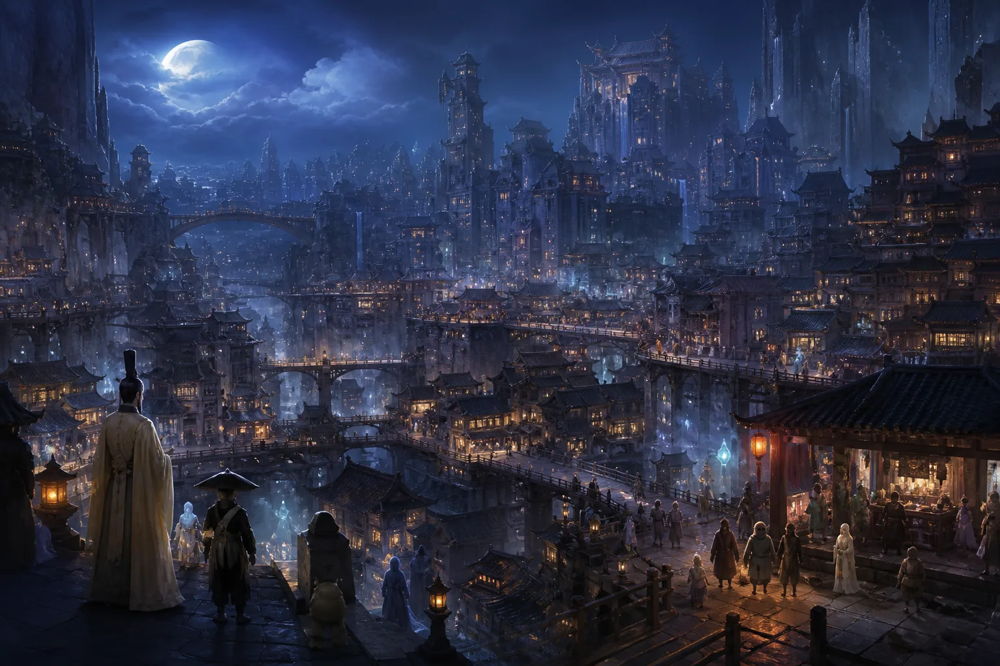

## 九幽有哪些居民

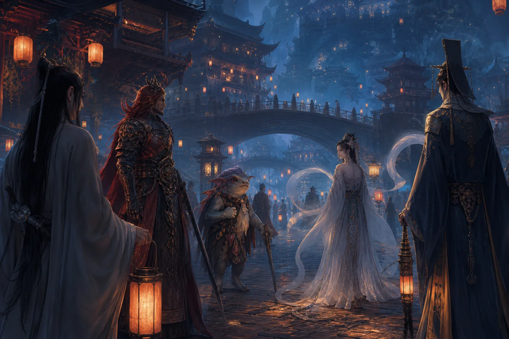

九幽居民的种族很多，大致可以分为以下几类：

- **鬼**：生前是人，死后变成鬼。
- **怪**：来自妖界、长相奇特且形态各异的生物，我们简称为“怪”。
- **修罗族**：修罗界域本身就在九幽之内，所以修罗族也经常在一些城邦中生活。
- **修出法身的妖**：这类妖可以在三界六道中穿梭，持有通行令时，也可以来到九幽居住。
- **天神**：包括在上界九天办事的神仙，以及本身在九幽受封的神仙，他们同样可能居住在九幽。

## 从古代土屋到现代高楼

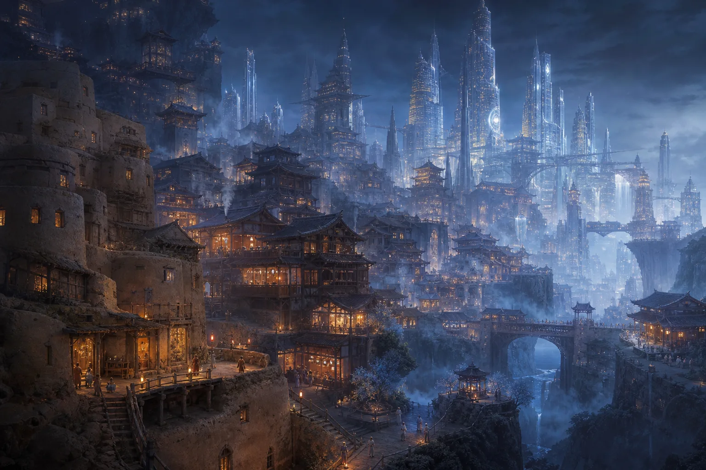

很多人都做过与阴间有关的梦，梦见阴间的天气、建筑，或者收到过世家人的托梦。有人问我：“玄灵，为什么有时会梦见矮矮的土墙、灰蒙蒙的环境，以及非常老旧的木屋；有时又会梦见过世的爷爷奶奶住在灯火通明的高楼大厦里？”

九幽的时间轴很长。过去去世的人和现在去世的人，都在各自所处的时代留下了许多建筑，所以那里既有过去的房子，也有现代的房子。

九幽的房子通常不会自然损坏。如果没有战争之类的破坏，它不会像阳间的房屋一样，随着时间推移而逐渐老化。这就是为什么有时梦中的场景像古代，有时像近代，有时又完全是现代城市。

九幽的高楼大厦，密集程度甚至与北上广深等大城市相近，而且往往成片分布，看上去非常壮观宏伟。前几期提到过，九幽本身的面积比地球大很多，因此大规模的城市区域也非常常见。包括我自己和一些能够出体的小伙伴，都见过类似的景象。有人梦见的是高楼大厦，也有人梦见的是古代房屋。

## 房子是怎么建成的

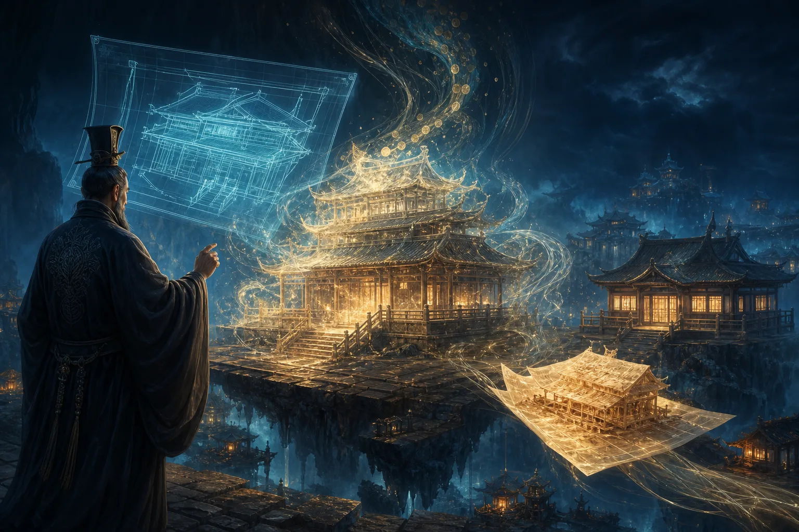

九幽的房子并不是由建筑工人一砖一瓦垒起来的。这里可以类比一部电影中的设定：一位建筑师在梦中可以按照脑海里的蓝图，直接创造出建筑物。

九幽的房屋也类似于此。建筑师或者其他人先在脑海中形成蓝图，再通过自身的灵力或阴德，将房子“兑换”出来；也有一些房子，是阳间的人焚烧后送下去的。它们并非依靠现实中的砖瓦施工建成，而且在一般情况下不会损坏。

# 鬼市与九幽的热门行业

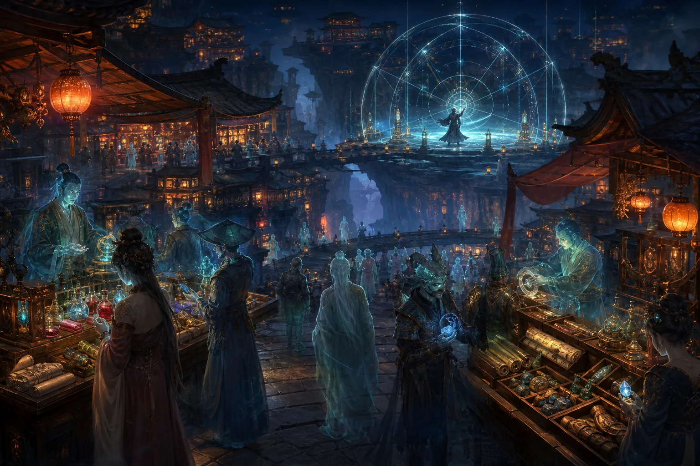

## 鬼市是什么

除了上班，九幽居民也有自己的娱乐和日常活动。至于工作的具体情况，内容比较多，可以留到下一期再讲。

九幽有一种很有意思的地方，叫作**鬼市**。例如青城山就有鬼市；河南好像也有一座钟灵山，那里同样有类似的地方，不过具体地点我记不太清楚了。懂这方面的一些修行人，自然会明白。

鬼市顾名思义，就是鬼的集市，和阳间赶大集差不多。里面的店铺、商品和往来的鬼都非常丰富。

## 阴德交易市场

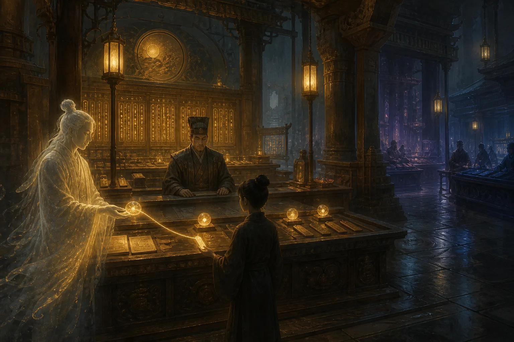

鬼市里存在**阴德交易市场**，其中有些交易合法，也有些是非法的。

例如，有人可能用祖先的阴德，交换后代的阳寿。大部分涉及阳寿的私下交易都是非法的，因为阳寿必须经过地府的正规流程。有些阳寿则是通过与阴差勾结等手段非法弄出来的。

除此之外，还可以用阴德换取子孙的福德。这也对应了很多人在祭祖时许下的愿望。有人会对老祖宗说：

> 保佑我发大财，保佑我事事顺利。

但老祖宗可能也很为难：自己的阴德不够，只能尽量帮后代。这就是阴德交易市场存在的一种背景。

## 修炼资源与法器秘籍

鬼市也会出售修炼资源，例如小说里经常出现的丹药。鬼修同样需要修行，所以也会购买丹药；九幽的一些道士则会购买法器。

有时，鬼市中还会出现极品秘籍，也就是各种修炼功法和修炼资料。

## 吃香的阵法师

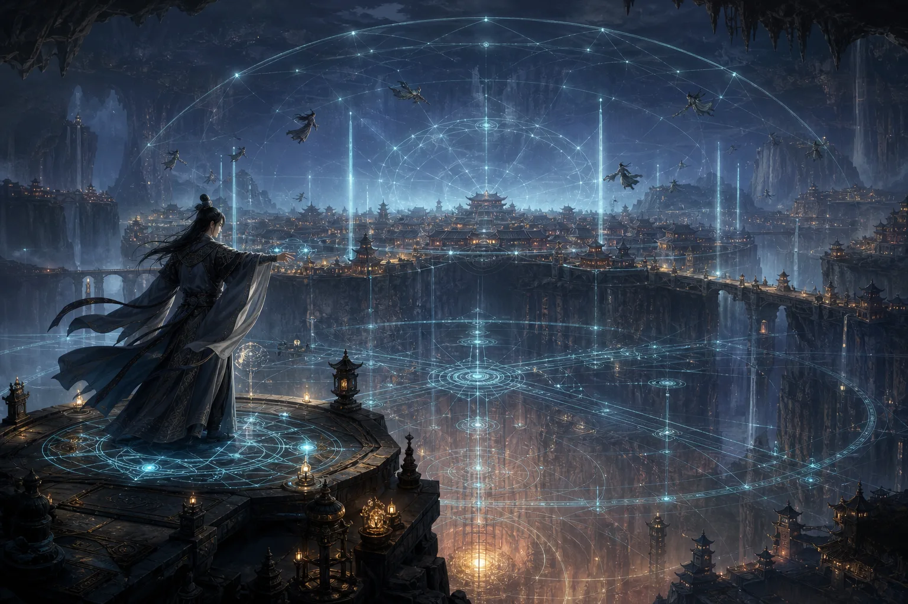

**阵法师**在九幽是非常吃香的行业。九幽地域广阔，整体上虽然由地府管辖，但各地又存在类似于诸侯割据的状态。不同界域都需要官方阵法师布置阵法，防止其他人未经许可直接越界。

九幽有很多修行者可以御剑飞行，也有人乘坐坐骑，从空中穿行。因此，常规的防御阵法必须把天上和地下全部覆盖起来。

除了布置界域防御阵法，阵法师还可以承接很多业务：

1. **勘察阴宅**：也就是查看九幽居民的房屋及相关环境。
2. **布置聚灵阵**：帮助修行者加快修炼速度。
3. **布置避雷劫阵法**：帮助需要渡劫的妖或其他修行者抵挡雷劫。

例如，有些妖达到五百年修为时需要渡雷劫。如果能请到厉害的阵法师，就相当于有人帮助它扛过这一劫。因此，阵法师在九幽非常抢手。

# 跨界服务与托梦业务

## 托梦也可以定制

大家接触得比较多的跨界服务之一，就是**托梦业务**。很多人应该都被自家老祖宗托过梦。这项业务在九幽非常普遍，可能就像我们去营业厅办理套餐一样。

前两期有不少人私信问我：“为什么某位亲戚或祖先一直给我托梦，但另外一些祖先却从来不给我托梦？”

如果一位祖先反复给你托梦，那通常就是有事找你。你需要结合梦里的场景进行解梦，看看他到底想表达什么意思。

比如，你梦见祖先住在一间很破的房子里，屋顶漏水，身上穿着带补丁的破旧衣服，吃的只有馒头、白菜和榨菜。家里也没什么家具，可能只有一个电灯泡或一张桌子。这种情况，很可能就是来向你要钱的：他在下面找不到工作，也没有钱花，所以向你求助。

还有一些梦境中，祖先可能身体某处受了伤，或者被关在笼子里，周围黑压压的、伸手不见五指，整个人无法动弹。这种情况可能代表他被某些东西扣住了，也可能是被困在某个阵法里。

托梦业务可以定制内容和场景。专业人员会根据委托者希望传达给阳间之人的信息，设计相应的梦境。因为两界所处的维度不同，做梦的人往往只能看到片面的内容，无法直接看见真实场景，所以托梦服务人员会把信息转化成阳间之人能够理解的形式。

这也是为什么有些托梦场景特别光怪陆离，甚至让人觉得逻辑不通；可即便逻辑不通，你还是能隐约明白祖先究竟想告诉你什么。

## 墓碑和坟墓的作用

有一位粉丝问我：“墓碑和坟墓到底有什么作用？”

玩过游戏的人应该知道“传送门”或“标记点”的概念。墓碑和坟墓的作用，就有点像《魂》系列游戏里的篝火，可以作为传送和定位的标记。

一般的鬼想通过鬼门关，必须等到鬼门关大开；如果没有相关手续，平时会被拦住。但持有鬼门关手续的鬼，可以借助相应的标记来到阳间办事、赚外快。

很多法师使用的兵马，例如五鬼或者一些鬼仙兵马，就可以来到阳间工作。他们会和法师订立某种协议：

> 我帮法师办事，法师定期给我发工资。

这就是他们的一种工作方式。

## 阴间替身与伤害转移

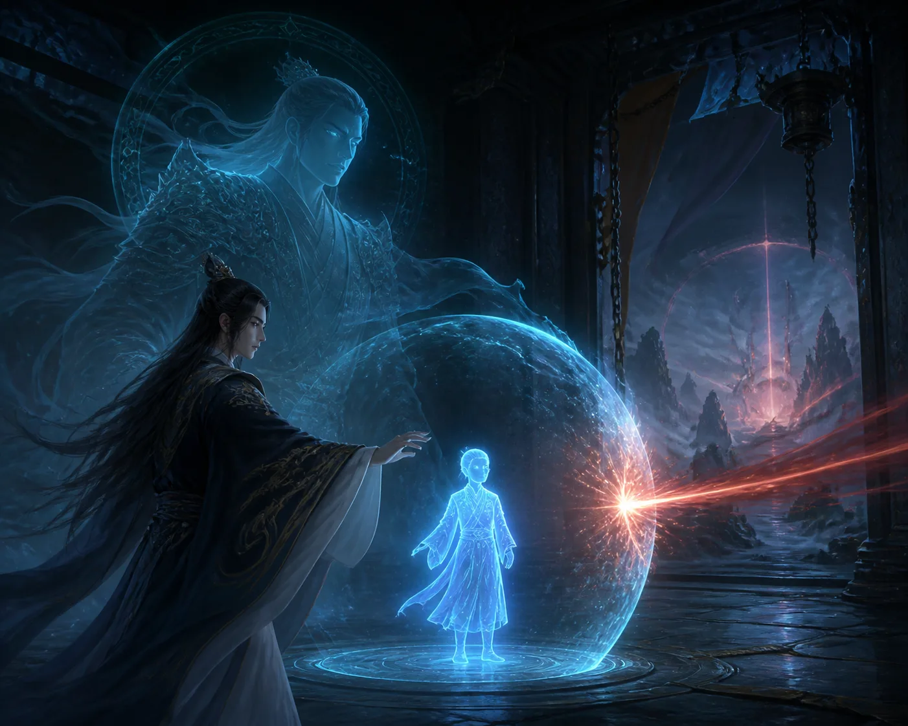

另一种跨界服务叫作**替身**。阳间也有类似的说法，而阴间替身比较特殊的一点，是它可以替使用者承受来自阳间的伤害。

有些鬼仙或鬼修会经常来阳间办事。如果办事时遇到危险，或者执行某件难度很高的任务，打不过对方并受到致命伤，那么提前购买的替身就可以帮助它承担这次伤害。

比如，有人找人做了和合、爱情降之类的事情，一般是让小鬼过去办事，到目标耳边吹风、进入对方梦里，使对方想念某个人，甚至爱得死去活来。但目标如果感觉不舒服，找了一位道行更高的人，请来一道符贴在门上，那么小鬼过去时就可能被符所伤。

如果那道符具有直接斩杀的效果，就会优先消耗替身。也正因为能够承担这种严重伤害，替身在九幽的价格非常昂贵。

# 九幽居民的日常娱乐

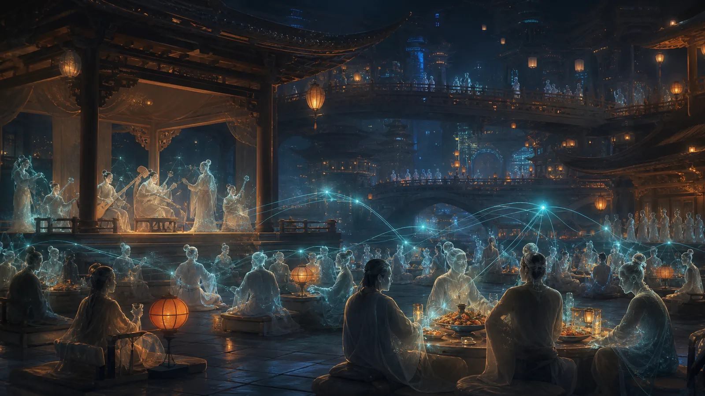

## 通过意识连接的虚拟网络

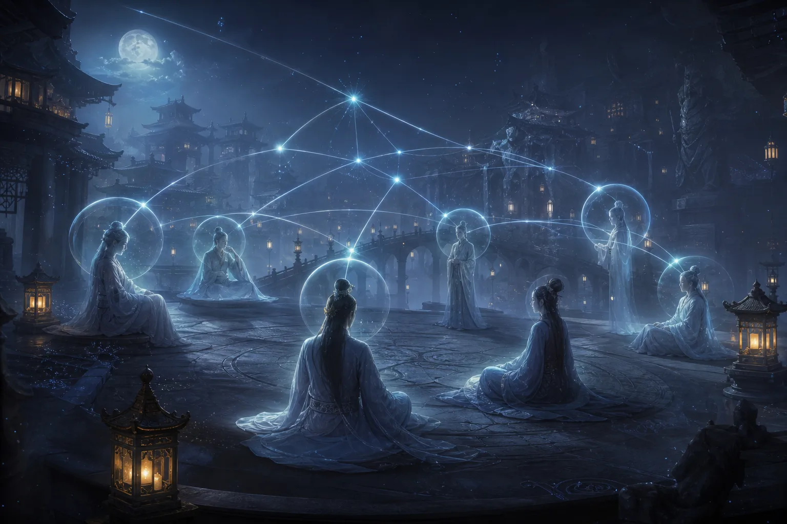

九幽居民的日常娱乐，其实和阳间没有太大区别。九幽也有网络，只不过是一种**虚拟网络**。

那里未必存在实体电脑，电脑中也没有芯片、CPU或显卡等硬件，而是通过意识直接显示内容。可以把它理解成所有人的大脑连接在一起，知识和信息能够共享，但彼此并不会因此直接拥有其他人的私人记忆。

也就是说，大家可以接触到相应的信息或内容，却不会连同信息所属者的全部记忆一起获得。

## 追星、影视与神仙吐槽

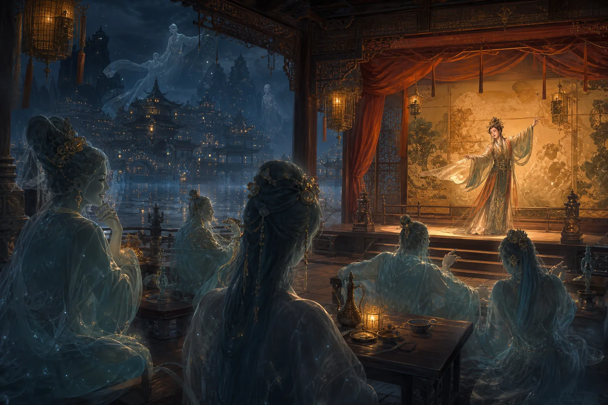

九幽居民也会追星。有些明星去世后尚未投胎，就可以继续运用生前掌握的技能，例如吹拉弹唱、表演和演戏。

他们会观看阳间的电视剧和电影，也会自己拍摄一些作品。阳间拍摄的神仙题材影视剧，上面的神仙有时也会看，而且还会吐槽。

不过，如果作品拍得不好，甚至有辱某些大神，例如一些《封神榜》题材的影视作品可能冒犯了相关神明，那么参与者的功德和福德也可能受到一定影响。

## 节日、宴会与婚姻

九幽居民也会举办宴会。清明节、中元节等重要日子到来时，他们会集中购物、应酬和办酒席。

九幽居民也可以娶妻生子。鬼本身没有阳气，所以孩子是通过阴气孕育出来的。这样的孩子出生时只有地魂；如果以后需要投胎，就必须从生父母的生魂中抽取一部分天魂和人魂，分给孩子。

有些大神孕育后代时，同样会把自己的魂分出一部分，形式上有点类似于**分灵**。

# 九幽的特色食物

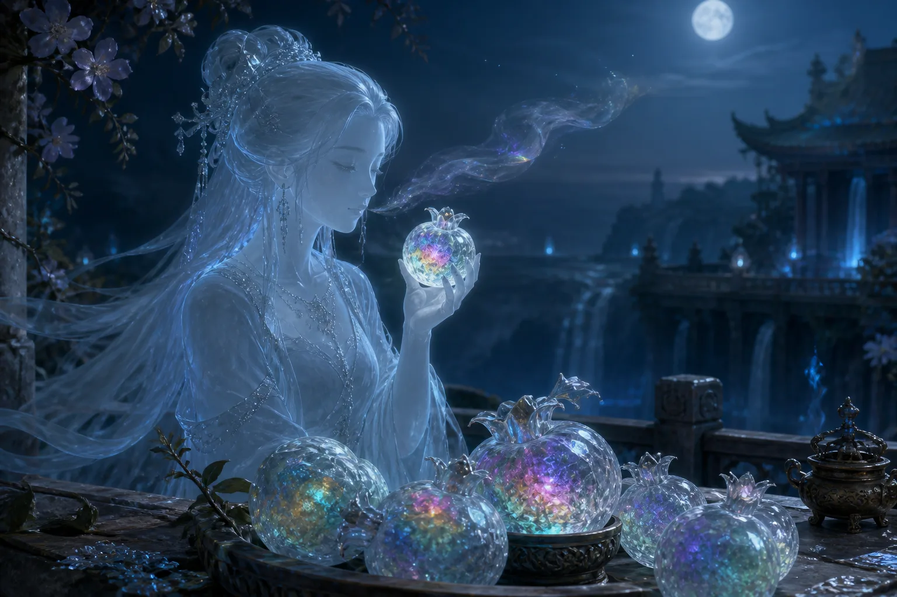

## 晶莹剔透的冰晶果

九幽大部分食物与人间差不多，但也有一些当地特有的东西。

我有一次出体后，吃到了一种叫作**冰晶果**的食物，可以算是一种水果。它看上去非常晶莹剔透，中间的果肉是彩色的。

冰晶果吃进嘴里时能够尝到味道，但不会产生任何明显的咀嚼感，就像在吃空气一样。你好像确实嚼了，却感觉不到自己正在咀嚼。

九幽居民吃东西，主要吃的是其中的“气”。那里的食物和阳间食物不同，不一定具有明确的物质实体，更多呈现为一种没有实体的感受。
