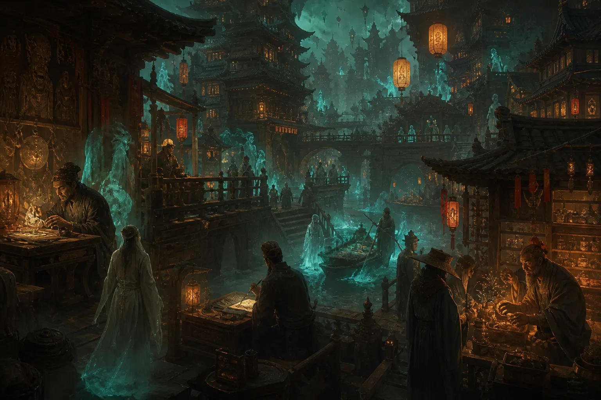

嗨各位观众老爷们大家好，我是玄灵，今天继续来更新阴间生活系列啦。本期内容都是个人见解，大家轻喷。如果觉得有兴趣的话，给玄灵一个一键三连吧，没有硬币的话，一个免费的赞也可以让我开心一整天。废话不多说，我们开始吧。

## 一、阴间的工作体系与公务员

### 1. 功德分类与公务员录用

首先大家非常感兴趣的就是在阴间的工作。很多人问我，玄灵玄灵，我在日常生活中已经很累了，不想上班了，想躺平了，下面还要工作吗？很不幸告诉你的是，我们在下面大部分情况也是会工作的。

在变成鬼鬼之后，先会根据你的各个德行——天德、地德、人德、阴德加起来，查到你的一个总的功德，然后会根据功德分为**大德之人、有德之人、普通之人**。当然这里我也只是举了几种例子，在下面会有一套明确的功德系统。

大部分大德之人可以选择去当不当公务员，也可以选择躺平。首先公务员的话，一个就是他会根据你功德，下去之后本身就成为一个公务员，不需要经过考试这个流程。然后下面所有的鬼鬼们，还有一些修行修上来的、跑到九幽来玩的，他也可以去参加一个考试，就是公务员的考试。

还有一个情况比较特殊，就是阳人去兼职。比如有一些马家的、灵感比较好的人、通灵体质的，比如一些邪骨头这种，他可能会在梦里面就跑去兼职了，就当公务员了，但他大部分情况自己不知情，可能隔一段时间会给你几个梦境反馈。更有甚者可能已经当了40来年的公务员，他一直都有印象，包括他会做梦，但他不会轻易跟大家讲这个事情，因为很多人不理解。

### 2. 常见公务员职位

普通鬼的公务员，我列了几个比较常见的职位：

- **无常**：这个职位大家知道吧，七爷八爷，白无常、黑无常。但是七爷八爷也有白无常和黑无常，他不止一个人。你想他如果说一个人天天跑去办事，肯定会累死，那么多鬼魂需要管理，他其实就是个职位。
- **勾魂使者**：也是职位之一。
- **判官**：一般是查案、审案，有一些冤屈的案子需要审，包括事情的前因后果需要查明，然后再去计算功德。判官都会有助手，包括下面任何七十二司，都会有一些助手的职位，就是在那个司里面查不到职位的，这种就跟实习生一样，是干杂务的。
- **打手**：需要去打架，有些人闹事的，有些鬼闹事的，就需要你出面当打手。
- **轮回镜看守**：看守轮回镜，这里可以查你有几世投胎，每世经历了什么。我之前讲过，跟命簿一样，它也是一个编年体，但轮回镜除了可以出报告，就是文字报告，命簿以外，它还可以进到这个镜子里面去看，一个一个影像的形式，就跟咱们看电影一样，可以看到前世今生发生的一些事情。这个后面我会讲，有一种情况怎么去查。

### 3. 梦境中的地府通道

很多人可能会梦见一些地府的事情，包括看我视频的里面有一些人也可以，你们可以在评论区里讲讲你的故事。他可能会梦见在梦里面跑到地府去，是坐电梯下去的，可能梦见负几层，比如负18层，两层有可能去地狱参观等等，他会坐电梯。这个其实也是个通道，只是说在我们梦境中无法呈现出高维度九幽的真实面貌，所以大家都会经常梦见坐电梯。还有可能就是走大门，那大门也是特别大的一个门，上面可能会有牌匾，旁边会有看守。如果有类似梦境的人，大家可以聊一聊。

## 二、阴间的职业选择与生活状态

### 1. 根据阳间技能选择职业

关于下面工作的职业，其实会根据你在阳间的职业，还有你擅长的一些技能，去选择你在阴间的职业。我这里列举了几个：
- **学校的老师**：就是鬼校，下面学校的老师。有一些小孩子，比如从阴间本身出生的孩子，还有一些婴灵，比如有些堕胎婴灵，他会开始被送去孤儿院，差不多长大之后会有找领养，然后会送到学校里面去学习。这个会有老师，但他教学的内容可能跟阳间有点区别，而且整个学校的环境也是非常大的，甚至有一些走廊是那种无限走廊，无限走廊会有很多门，他的门其实也相当于是那种传送门一样的。
- **医院的医生**：我之前讲过，医生会有一些整容，还有给你治病，这种都是有的。但一般鬼轻易不会生病，不会感染病毒，但是打架可能会，还有包括会有一些血染嘛，之前说过的血染，他都是必须要去医院治疗的。所以医生的话可能也会有区别，但大体上跟阳间都是一样的。
- **建筑工人**：土木行业的，在下面也会去修房子。虽然房子能够烧到下面，但是难免会有一些磕碰，比如你买回来的那种纸房子质量很差，缺了个角、缺了个门这种，你又不好意思托梦给家里人让他重新烧，所以就有一些土木专门去买一些材料，把这个房子给拼好修好。当然这个流程跟阳间的有区别，不是什么钢筋混凝土拼接而成的。

### 2. 个体户与躺平

如果说你干腻了这些职业，你也可以选择去做个体户，但前提是你要有钱，你肯定要有钱去做投资，然后买地、买地契、修房子，买卖一些东西，这些都需要你的元宝。这个就是本身实力比较好的情况，但有德之人这种情况完全可以选择躺平。

## 三、常见疑问解答

### 1. 死后记忆是否保留？朋友还能一起玩吗？

接下来我想回答一下上一期和上上期关于阴间知识的一些网友问题，包括评论区发给我或私信我的。今天讲两个我觉得比较让人疑惑的问题。

有个网友问我，他说玄灵，我阳间的朋友，如果大家以后寿终正寝了之后，在下面还会一起玩吗？然后我结合了另外一个问题，有个网友比较质疑我，他说其实很多魂魄下去了之后，本身是没有记忆的。比如有种情况，他老人了，脑细胞出问题了，像得阿尔兹海默这种，他本身记忆就是错乱的，或者缺失了大部分记忆；又或者那种嘎的时候连头都没有的，怎么办呢？

首先你要知道，阴差如果在你的勾魂手册上找到你，他一定会来把你勾走的，勾走下去也会走流程，一直走到十殿那里。

十殿这里会去判官，判官会审理，如果说你是神志不清的这种人，他会通过一些手段先让天医把你的脑子还有记忆这些修复成功，你会记得人间全部的事情。哪怕我们下去，你可能年纪大了五六十岁，十几岁的记忆就没有了，他都会让你想起来，从三岁到你亡的时候，所有期间发生的所有事，事无大小、事无巨细，他都会让你一清二楚。

这也是为什么下面会这样决定，因为之前有些人可能会看了自己的命簿之后不认同，说“我记忆里面没有做过这个事情啊”，所以后面就出现了一个政策，就是会先把你的记忆修复好了。但是这只是记忆，如果说你身体上有什么，比如脸烂了、手断了这种，下面就不会管了，这个就需要你通过你的阴德、你的功德，去医院或者用元宝去治疗。

所以说记忆还在的，大家都可以去轮回殿找人，也可以在阴间的一些部门去找到这个人，通过他生前的一些信息去找到他。所以说是可以的，还是会一起玩的，如果对方还是没有忘记你的话。

### 2. 动物死后去哪里？如何投胎？

第二个也有很多人问我，说玄灵我看了很多书，不论古代的还是现代的，大家讲的都没有讲过，动物死了之后会去跟人走一样的地方吗？他们又是怎么投胎的？

上一期我说过，动物投胎不会像人类一样，就是变成鬼之后，你还要把你的阳寿过完，如果横死了，要把阳寿过完，然后同时把阴寿过完，然后再排队，然后再去投胎。动物基本上很快投胎。

动物分两种情况：**有灵智的**和**没有灵智的**。

有灵智的，他也会去跟人类一样去审案子。打个比方，比如某一条蛇修炼了500年，本身要回肉身去渡一个劫，假设他肉身在长白山上，然后刚好有一个人看到这个蛇，哇塞这个蛇而且还不是国家保护动物，我就把它砍了，把这个蛇打死了之后，它下去，下面的判官就会去审它，发现它是被某个人打死的，然后这笔账就会记到那个人身上。因为它这个事情，它就可以合法地去找他，他也是会去审的。

但如果是无灵智的，就是他没有觉醒灵智，也没有修行的这种普通动物，比如家猪、家鸭、肉鸭，吃的这种六畜嘛，这种就不会直接去审。但如果说有个人他吃过一些野生动物，开了灵智的话，这笔账就会记在他的本子上。但如果是吃的是家里养的这种，他只会有一些业力，但是不会记在每一个动物的头上。所以说这种基本上就是排队流程完了，就去专门去畜生道投胎的地方继续投胎。

今天的内容就讲到这里了，大家还有什么想知道的，都可以随时给我评论，给我私信，谢谢大家对我的支持，拜拜，下一期见。
