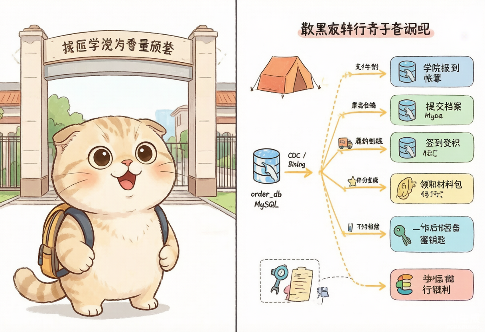
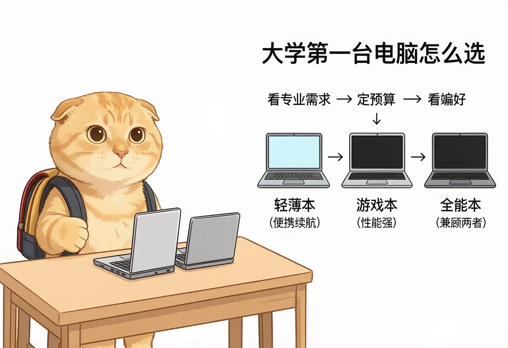
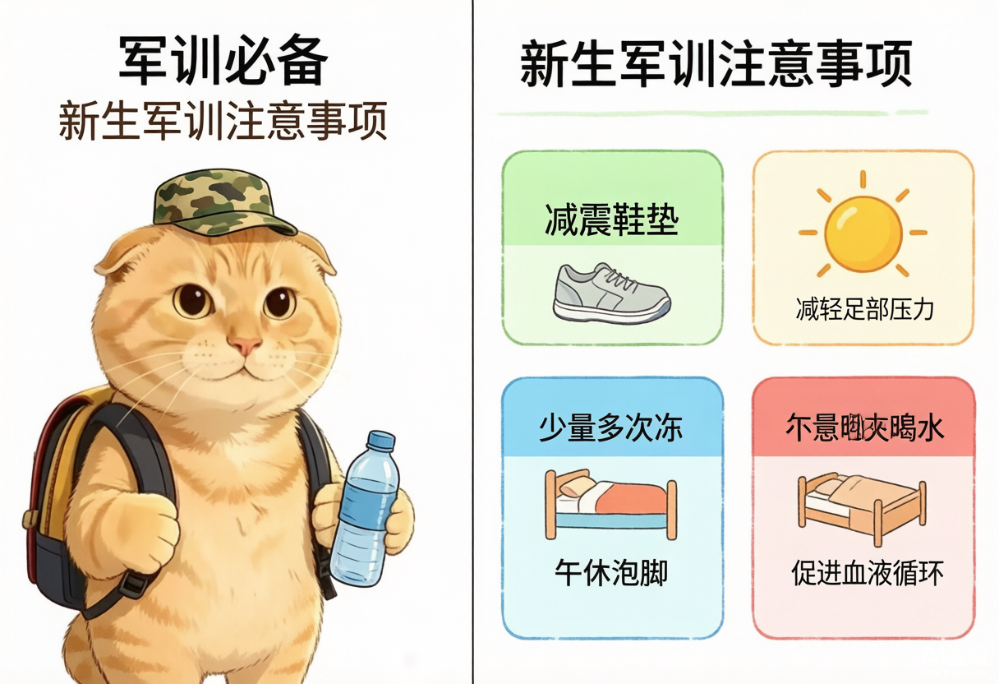
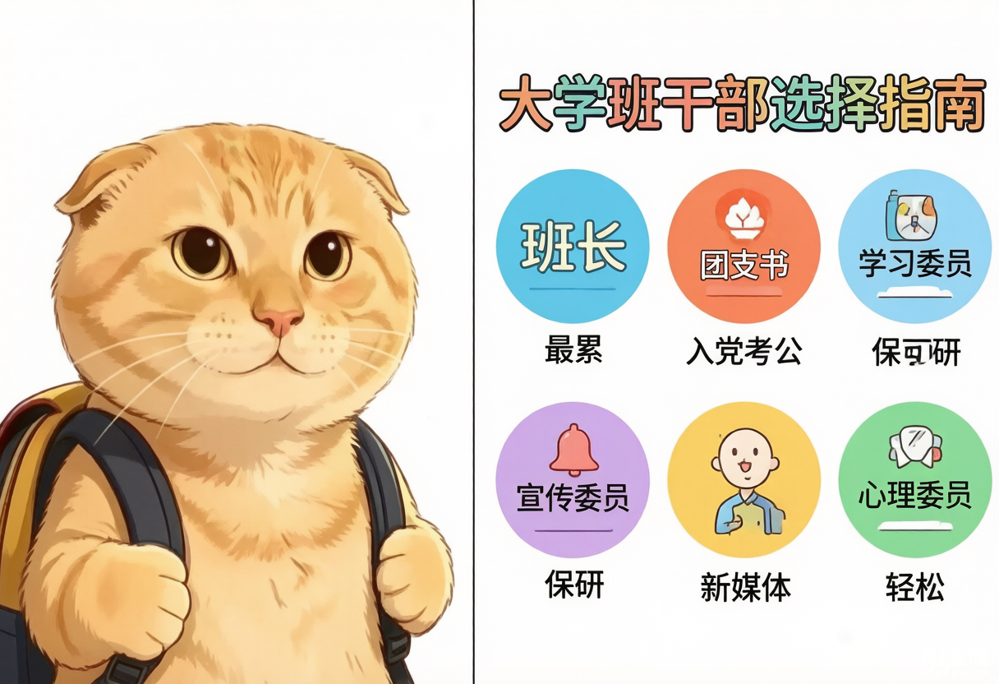
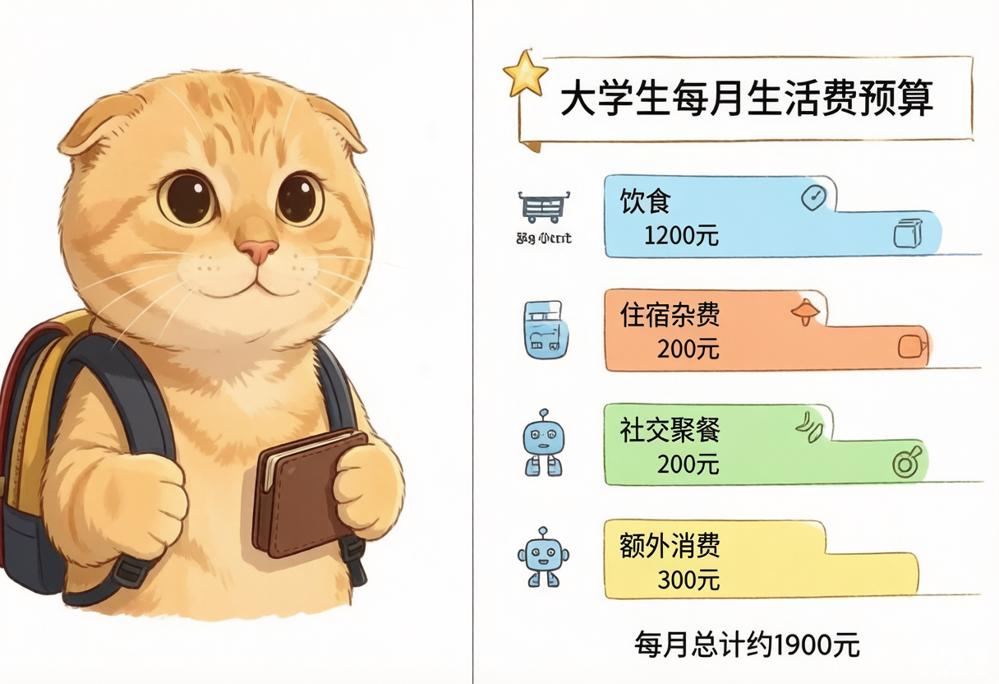
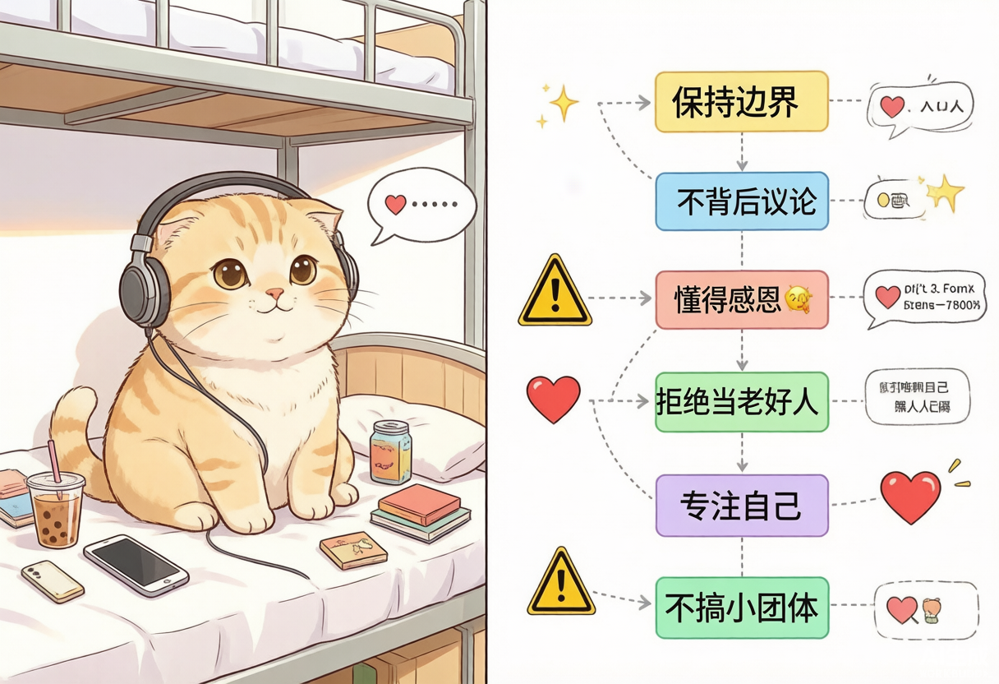
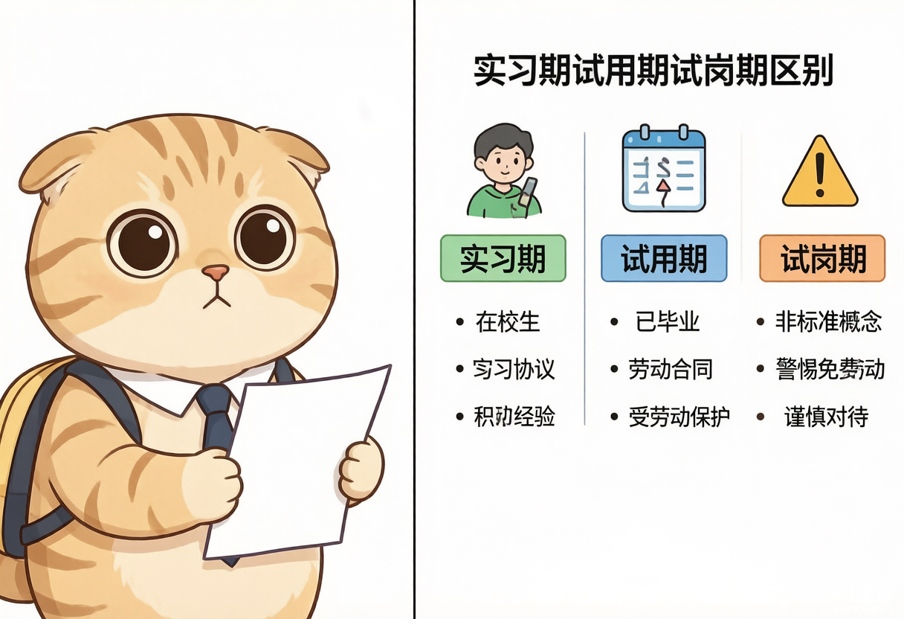
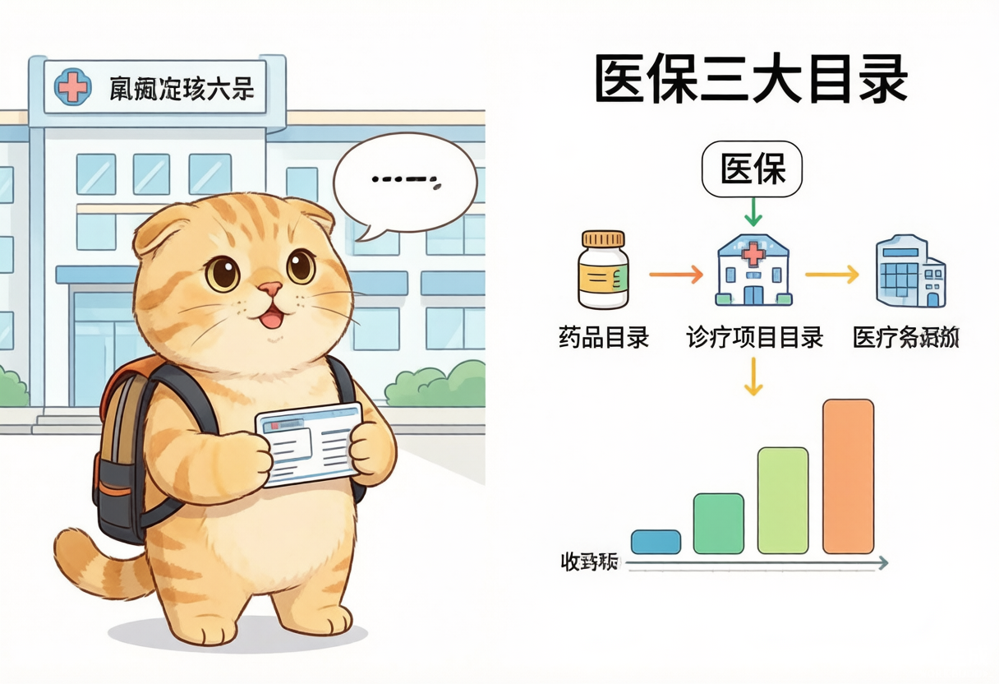
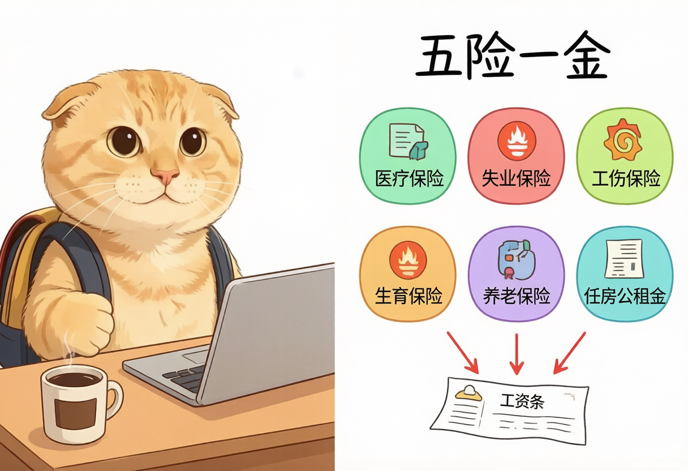
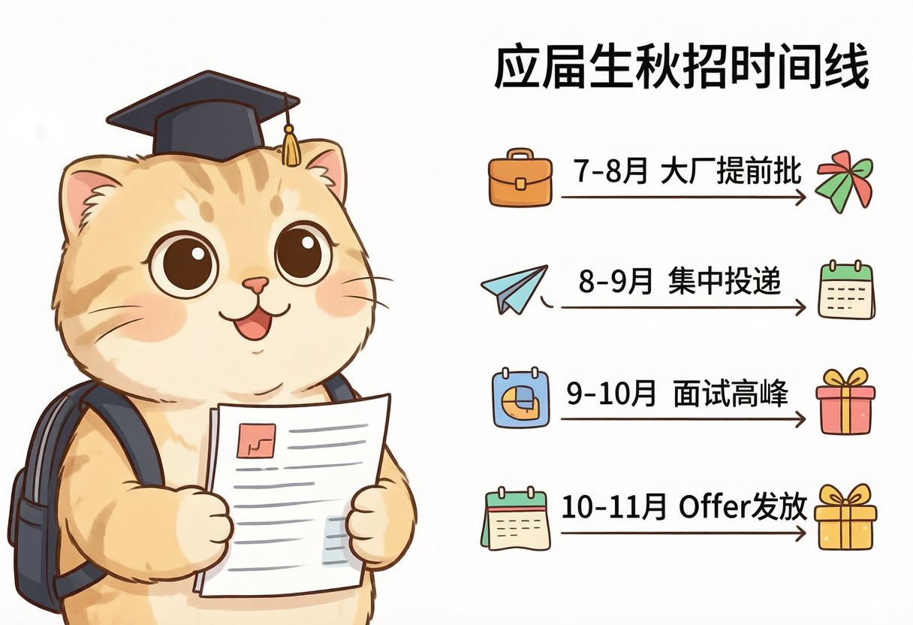

## 进入大学后：你要知道的22个知识

url:  https://www.bilibili.com/video/BV1kftw62EMk/?

> 本文涵盖从大一入学到毕业离校需要了解的22项知识，包括报到、选电脑、军训、选课、宿舍关系、实习就业、社会保障、秋招与毕业手续等内容。

## 一、入学报到与校园适应

## 1. 新生报到的完整流程

准大一新生马上开学，第一次上大学，既紧张又兴奋，不知道报到流程是什么、该做什么、不该做什么。到学校后的第一件事就是**报到**。通常校门两侧会设有各学院的帐篷，先找到自己学院的报到处，依次完成以下事项：

1. 提交档案；
2. 签到登记；
3. 领取材料包；
4. 领取校园一卡通、宿舍钥匙、报到流程单和学生手册。

行李多的同学可以先把行李放在寄存点，轻装上阵去办手续。报到结束后，一般会有学长学姐带你去宿舍楼。

到宿舍后要先选床位。不同床位各有优缺点：

- **下铺**：上下床方便，但容易沦为“公共座椅”；
- **上铺**：相对安静，但上下床比较麻烦；
- **靠门位置**：经常需要负责开关门；
- **靠窗位置**：采光好，但冬天可能漏风。

具体怎么选，根据自己的需求权衡。选完床位后不要急着签字，应先仔细检查宿舍设施：

- 床板、床架是否稳固；
- 梯子是否结实；
- 桌椅、抽屉能否正常使用；
- 衣柜门锁是否完好、钥匙是否齐全；
- 空调、风扇、电灯能否正常开启；
- 水龙头、淋浴头是否正常出水；
- 阳台门窗和纱窗是否完整；
- 墙面是否有脱落、渗水等问题。

发现问题要立刻找宿管登记报修，同时自己拍照留存。确认完毕后再签字，否则入住后才报修，很难说清楚是谁造成的损坏。

宿舍设施确认无误后，接下来解决生活问题。首先是**校园一卡通**，拿到后应尽快激活并充值。大学期间进出门禁、食堂吃饭、打热水、去图书馆借书等都可能用到，可以先充值两三百元，省得军训期间来回跑。

接着是办理宽带。根据自己的需求选择套餐，也可以问问室友是否愿意合办并分摊费用。学校里通常有运营商驻点，尽量通过正规渠道办理，不要轻信宿舍门口的推销人员。缺少的日用品可以到学校超市或附近商场购买，不必什么都从家里扛过去。

通常报到当天晚上或第二天会开第一次班会，一定要认真听。班会上一般会说明：

- 学籍注册和学分要求；
- 挂科达到什么程度可能留级或退学；
- 军训安排；
- 选课规则；
- 奖助学金评定标准；
- 安全教育；
- 班委选举。

班会结束后记得保存辅导员的联系方式，以后请假、开证明等事情通常都要找辅导员。最后一定要警惕上门推销的所谓“学长学姐”，有任何拿不准的事情，直接询问辅导员。

## 2. 大学第一台电脑怎么选

轻薄本、游戏本、全能本让人看得眼花缭乱，选电脑时应先判断自己的真实需求。

### 第一步：看专业和使用需求

- **学习加轻度娱乐**：例如追剧、玩普通网游，可以选择轻薄本、全能本或入门级游戏本；
- **学习加重度游戏**：例如玩大型单机游戏，优先选择游戏本；
- **专业创作**：例如作图、视频剪辑、3D建模，优先选择高性能全能本或游戏本；
- **经常外出、以办公学习为主**：优先考虑便携、续航和低噪声表现。

一定要结合自己的专业情况，不然选错电脑，大学四年用起来都会很折磨。

### 第二步：确定预算

钱要花在刀刃上。预算充足，可以追求更高的配置、更好的屏幕和更轻的机身；预算紧张，就聚焦性价比较高的入门款，优先满足核心需求，再考虑其他因素。购买前也可以提前了解各类促销和教育优惠活动。

### 第三步：结合个人偏好做决定

先问自己三个问题：

1. **屏幕和便携性，更看重哪个？**  
   经常需要外出携带，可以选择13至14英寸、重量在1.5千克以下的产品；更看重影音和游戏体验，可以选择15至16英寸、高分辨率、高刷新率的屏幕。

2. **续航需求是什么？**  
   如果希望一次充电使用一天，应重点关注70瓦时以上的电池容量，或者搭载低功耗处理器的机型。

3. **是否有品牌偏好？**  
   可以优先选择售后网点较多的主流品牌，例如联想、惠普、戴尔、华硕、苹果等，电脑出现问题时更容易维修。

> 没有完美的电脑，只有更适合你的电脑。购买前先定类型，再定预算，最后看个人偏好。

追求极致便携和续航，选轻薄本；既要性能又要便携，选全能本；专业软件和大型游戏是刚需，优先考虑游戏本。

## 3. 新生军训需要注意什么

军训并不只是晒太阳、走方阵。有人站半小时军姿就晕倒，有人脚上磨满水泡，连路都走不了，还有人直接晒到脱皮。军训时方法用对，确实能少受一半罪。

领到装备后，第一件事是检查鞋子。学校发的鞋底通常比较硬，要看看鞋垫有没有足够的支撑。没有的话，可以提前准备一双运动减震鞋垫；实在来不及，临时垫卫生巾也能救急，可以缓解足底酸痛。袜子尽量选纯棉中筒款，减少脚和鞋之间的空隙与摩擦，避免每天磨出好几个水泡。

水杯最好选择保温杯，否则水被太阳晒过后很快会变成温水。喝水时记住**少量多次**，每次休息喝两三口，不要一口闷，更不要突然喝冰水，否则肠胃受到刺激，容易腹痛或抽筋。

防晒可以分两遍涂：出门前半小时涂第一遍，休息时再用喷雾补涂。脖子、耳朵和手背最容易晒伤，尤其是脖子后面，不涂防晒很容易脱皮。戴眼镜的同学可以买一个眼镜防滑套，省得总打报告扶眼镜；不然被教官记住，后面想开小差都难。

训练时还有几个小技巧：

- 站军姿时不要把重心全压在脚后跟上，可以微微移向前脚掌；
- 膝盖保持轻微弯曲，不要完全锁死，避免血液循环不畅引起头晕和腿酸；
- 可以在鞋里轻轻抓握脚趾，促进血液循环；
- 午休一定要睡，哪怕只有20分钟，下午的精神状态也会好很多；
- 晚上回去用热水泡脚5至10分钟，再把腿垫高或靠墙抬一会儿，第二天腿部酸胀感会减轻。

拉歌、喊口号等集体活动不必过度用力，把体力留给正步和队列训练。也别故意当“显眼包”，动作太标准，可能会被拉去当标兵单独加练。

> 身体不舒服时，一定要及时打报告，出列休息，不要硬撑。

## 4. 大学班干部应该怎么选

大学班干部选对了，对评优评先、入党、考研、考公等都有帮助；选错了，可能会变成四年的免费劳动力，还容易得罪人。

### 班长

班长是与辅导员接触最密切、含金量较高，同时也最累的职位。主要负责传达通知、召开班会、组织团建、处理琐事和同学纠纷。竞赛、志愿活动等资源往往能优先接触，评优加分也比较多，但经常要夹在老师和同学之间。

*适合责任心强、擅长沟通、抗压能力好的人。*

### 副班长

副班长通常负责协助班长，压力相对较小，评优时有加分，许多资源和福利也能接触到，性价比较高。

*适合想获得班干部经历和相关福利，又不想被琐事完全绑住的人。*

### 团支书

团支书是入党、考公、选调生等路线的优先选择之一，主要对接学院团委和辅导员，负责团员档案、材料整理、团日活动、团建和入党信息等。优点是获取相关信息更及时，学生干部经历对后续考公、选调也有用；缺点是会议多、紧急任务多。

*适合执行力强、做事细致的人。*

### 学习委员

学习委员主要协助老师收作业、传达专业课通知、管理考勤，能与各科老师熟悉起来，也更容易接触科研和竞赛资源。平时分通常有一定优势，但评优加分可能不如班长和团支书，课程多的时候会比较忙。

*适合想深耕专业、走学术科研或保研路线的人。*

### 纪律委员

纪律委员负责检查早自习、晚自习和上课考勤。大学里逃课、迟到现象较常见：管严了容易得罪同学，管松了又会被辅导员认为不负责，两头受气，费力不讨好。

*非必要情况下，能避则避。*

### 心理委员

心理委员平时事情不算多，还可能获得相关加分，偶尔需要组织心理活动。不过，这个岗位需要一定的沟通和倾听能力，也可能带来情绪消耗。

*适合性格温和、愿意倾听的人。*

### 宣传委员

宣传委员主要负责发布班级动态、制作海报、运营公众号，以及进行PS、视频剪辑和排版。工作相对灵活，还能锻炼新媒体技能，作品可以写进简历。不过，很多东西需要现学，活动结束后赶稿、修图也可能很累。

*适合本身有一定技能基础，或者想锻炼新媒体能力的人。*

### 体育委员和文艺委员

这两类属于兴趣驱动型岗位。体育委员负责组织体育活动、带队参加运动会；文艺委员负责晚会和才艺展示。工作集中在活动期，非活动期相对清闲。

*适合热爱运动或有文艺特长的人。*

### 生活委员

生活委员负责宿舍管理、安全检查、反馈生活问题和管理班费。工作不算累，但比较琐碎。班费使用一定要公开透明，否则很容易受到质疑。

*适合细心、有耐心、不追求高光的人。*

综合来看：

- 想最大化锻炼综合能力，选**班长**；
- 想拿福利但不想太累，选**副班长**；
- 想走入党、考公、选调生路线，选**团支书**；
- 想走学术、科研、保研路线，选**学习委员**；
- 想锻炼新媒体技能，选**宣传委员**；
- 想相对轻松地获得加分，可以考虑**心理委员**；
- 有兴趣爱好，选**体育委员或文艺委员**；
- 非必要情况下，不建议选**纪律委员**。

## 5. 选大学前要查清管理制度

选大学不能只看学校名字和招生简章。管理制度如果没选对，这四年可能比高中还累。你以为上大学就自由了，结果开学后才发现，早读、晚自习、强制打卡、熄灯断电、宵禁、校园跑一样没少，甚至还会安排层长、楼长管理。

“大学高中化”并不只是段子，所以填报志愿前，一定要查清楚学校的管理制度。可以先去各类论坛搜索相关帖子，询问学长学姐的真实体验，这往往比招生简章更有参考价值。

还可以加入大学新生群或在校生群。不要只问“学校好不好”，而要具体询问你所在的**校区和学院**怎么样。不同校区、不同学院之间的管理可能天差地别。重点可以问：

- 宿舍有没有夜查；
- 是否要求晨跑；
- 辅导员是否频繁查寝；
- 请假是否好批；
- 宿舍是几人间；
- 是上下铺还是上床下桌；
- 有没有空调；
- 是公共浴室还是独立卫生间；
- 周边交通是否方便。

这些都会直接影响未来四年的生活体验。

最后，还可以查一下学校领导班子的履历，看看相关负责人以前在哪些学校任职、是不是刚刚上任。如果搜出来的负面消息很多，就要多留心。毕竟一个人的管理风格，通常不会因为换了一所学校就完全改变。

> 选大学不是只选一个好听的名字，宿舍条件和管理制度会直接影响四年的生活质量。

## 6. 专业课、公共课和选修课怎么安排

### 专业课

专业课是三类课程中最重要的一类，决定了你对专业知识的掌握程度，也是未来的立身之本。专业课学分高、成绩权重大，保研、考研复试和找工作都可能用得上，分数会直接影响绩点和排名。

一门核心专业课考砸了，可能要靠好几门选修课才能把绩点拉回来。专业课之间往往一环扣一环，大一没弄明白，后面的课会越听越懵。专业课老师在写论文、拿推荐信、求职内推等方面也可能提供帮助，平时可以多交流，至少混个脸熟。

### 公共课

公共课是大学里的“隐形拉分项”，想提高绩点一定要留意。随便一门高等数学可能就有四个学分，考80分和考90分的差距，可能比两门选修课加起来还大。

对保研和奖学金有想法的同学，公共课千万不要摸鱼。英语四、六级也尽量在大一、大二通过，拖得越久，忘掉的知识越多，备考成本也越高。

### 选修课

选修课分为专业选修课和公共选修课。专业选修课用于拓展专业方向；公共选修课更多是为了满足学分要求，例如电影鉴赏、心理学入门、茶文化等，通常与专业关系不大。

哪些课给分高、作业少、老师好说话，可以提前向学长学姐打听。选修课的目标通常是*用较少的精力获得较好的成绩*，不要在非核心选修课上消耗太多时间。

有余力的同学也可以选择真正有用的课程，例如：

- PPT制作；
- 演讲与口才；
- Python入门；
- 与未来发展方向相关的跨专业课程。

> 把80%的精力分配给核心课程，而不是对每门课平均用力。核心课没有学精，水课分数再高也没有太大意义。

## 二、独立生活与日常办事

## 7. 大学生每个月需要多少生活费

以一日三餐都在学校吃为例：早餐一个包子加一盒牛奶，大约5元；午餐两荤一素或加一份汤，按15元计算；晚餐也按15元计算。三餐一天至少35元，一个月就是1050元。

水果、零食一周买两次，每次15元，一个月约120元。仅饮食这一项，每月就接近1200元。

接下来是住宿杂费：

- 网费和话费约50元；
- 水费、电费根据学校情况计算，通常约50元；
- 纸巾、垃圾袋、洗漱用品等基础消耗品；
- 偶尔剪头发。

这些加起来至少需要200元。算到这里，每月已经要花1400元左右。

大学是一个小社会，不可能每天都闷在宿舍。室友之间需要维护关系，偶尔出去吃饭、聚餐、参加社团活动，即使都采用AA制，每个月也可能需要一两百元。也就是说，在不生病、不谈恋爱、不买衣服、不为兴趣爱好额外消费的情况下，一个月的基础生活费已经接近1500元。

到了这个年纪，难免还会有额外社交，例如和同学看电影、请一杯奶茶、去市区转转，每月可能再多花300元。

每个家庭的经济情况不同，生活费应量力而行。提前和父母沟通，计划清楚每笔必要开销，他们也不愿意你在外面受苦。如果担心给家里带来太大压力，入学后可以在不影响学习的前提下尝试兼职。

> 一定要根据家庭实际情况和个人收入，合理安排大学生活。

## 8. 大学生洗衣服的实用方法

洗衣服不是只加一勺洗衣粉就结束了，不同污渍应采用不同的处理方法。

### 火锅油渍

火锅油渍千万不要直接用力搓。先喷上酒精，让油渍快速分离，再挤上洗洁精，轻轻拍打，把油渍和色素带出来。接着撒上食盐并轻轻揉搓，利用食盐吸附油渍和色素，最后冲洗干净即可。

### 衣服发黄

用约50℃的热水加入小苏打、食盐和洗衣液，将衣服浸泡20分钟，再正常搓洗。

### 黑衣服发白

在盆中加入花露水、食盐和洗衣液，用温水搅拌均匀，把衣服放进去浸泡一会儿，再进行清洗。

### 衣服串色、染色

可使用热水、肥皂屑和小苏打搅拌均匀，把串色的衣服放进去浸泡约30分钟。需要注意的是，处理前应先查看水洗标，避免高温损坏面料。

### 血渍

先用冷水浸泡3至5分钟。记住一定要用冷水，热水会让蛋白质凝固在纤维里。浸泡后涂抹硫磺皂，轻轻搓洗即可。

机洗时，深色和浅色衣服最好分开洗。混色衣物可以搭配吸色片，降低串色风险。洗衣服前记得查看水洗标，把需要手洗和干洗的衣服挑出来；容易变形的衣物可以放进洗衣袋清洗。

## 9. 第一次寄快递怎么操作

寄快递主要有两种方式：**上门取件**和**线下网点寄件**。

### 上门取件

在微信搜索快递公司小程序，或者在支付宝搜索“菜鸟裹裹”，点击寄快递，填写寄件人和收件人信息，选择物品类型并确定上门时间。快递员会主动联系你，取件称重后在线支付运费即可。之后可以随时在手机上查询物流，有问题及时联系客服。

### 线下网点寄件

携带本人身份证前往快递网点，实名扫码填写信息，现场称重并支付运费，最后保存好快递单号。

不同物品应选择不同的快递方式：

- 重要文件、贵重物品：可选顺丰、京东等；
- 食品、生鲜或需要当天送达的物品：选择特快、即日达等服务；
- 寄往偏远地区：优先考虑EMS，覆盖范围较广；
- 日常普通包裹：可选择“三通一达”等，价格相对便宜，网点也多；
- 大件行李：不要只盯着普通快递，走物流通常更划算；
- 同城急送：可以使用闪送、达达、顺丰同城等，通常一两个小时内能送达。

最后两个重点一定要记住：

1. 易碎品要用泡沫包裹，并塞满缓冲材料；
2. 贵重物品一定要保价，保价费通常不高，但丢失或损坏后更方便按规则理赔。

## 10. 快递丢失后怎么处理

> 核心原则：在消费者未实际签收网购商品前，应先保存证据，并根据自己是收件人还是寄件人找对应责任方处理。

### 第一步：保存证据

如果物流信息连续多日不更新，或者显示异常，联系客服后仍无法确认包裹位置，包裹可能已经丢失。此时要及时截图保存：

- 物流轨迹；
- 网购订单；
- 支付记录；
- 商品页面；
- 与客服的聊天记录。

### 第二步：找对应责任人

如果你是收件人，应直接联系卖家，说明快递丢失、自己没有收到货，要求全额退款或补发。卖家推诿时，可以申请平台客服介入，并提交物流证据。

如果你是寄件人，应拨打快递公司官方客服电话并转人工客服，提供快递单号，要求对方尽快核查并给出答复。沟通过程中注意保存通话、工单和聊天记录。

### 第三步：遇到扯皮时继续申诉

如果快递公司迟迟不给答复，或者赔付长期不到位，可以通过国家邮政管理部门的申诉渠道反映，例如12305邮政业消费者申诉渠道；部分地区相关热线已并入12345，按当地现行渠道办理即可。说明事情经过并明确自己的诉求，通常能提高处理效率。

### 第四步：必要时走法律途径

如果以上方式都无法解决，可以通过“人民法院在线服务”等渠道咨询或申请在线立案。诉讼费通常不高，进入司法程序后，对方也可能主动联系协商。

## 11. 如何更高效地考驾照

第一步是确定报考自动挡还是手动挡：

- **C2自动挡**：考试相对简单，拿证更快；
- **C1手动挡**：学费可能较低，准驾车型更多，但操作难度更高。

如果没有特殊需求，可以优先考虑C2。科目二通常少考坡道定点停车和起步，也不用频繁换挡、控制离合器，学习难度会低一些。

科目一和科目四不要盲目按顺序刷题，要学会借鉴前人的经验。可以在B站搜索科目一精华课、科目四速成课，先系统学习知识点，再打开刷题软件做模拟考试。连续三次达到90分以上，就可以考虑预约考试。

科目二练车时，不要一直纠结方向盘打早了还是打晚了。新手只需要记住每个项目的点位，停车位置不对，就对着点位复盘，判断是哪个点没有卡准。没练车时，可以看第一视角练习视频，往往比单纯在车上硬练更容易理解。

科目三起步可以记住口诀：

> 一踩、二挂、三打、四鸣、五看、六松。

也就是踩离合、挂挡、打左转向灯、鸣喇叭、观察周围情况、松手刹。所有操作前都要注意“一灯、二镜、三观察”，即打灯、看后视镜、回头观察。

灯光模拟可以记住：

- 照明不良时使用远光灯；
- 夜间通过路口、坡路等情况时远近光交替；
- 临时停车时使用示廓灯加双闪；
- 其他常见情况按考试要求使用近光灯。

驾驶证照片通常可以更换。考科目四当天，可以带上满意的小一寸白底证件照，考试通过并签字后，到考场制证窗口咨询并提交。

## 12. 如何处理宿舍关系

大学四年过得好不好，很大程度上取决于宿舍关系。和观点、习惯、背景都不同的人相处四年，发生冲突很正常，聊不到一起才是常态。

大学生存的第一课，是不要一上来就称兄道弟，先学会观察和保持适当沉默。尤其是选寝室长时，千万别随便冒头，不然寝室长可能就指定成你。

和谁都不要轻易撕破脸。没有永远的敌人，你讨厌的人不一定有多坏，可能只是现阶段立场不同。学会和不喜欢的人相处，也是大学的必修课。

如果有人愿意替你出头，你应明确表达态度，不要一味当和事佬，否则以后可能没人愿意再帮你。也不必害怕被小团体孤立，这些小团体内部经常倒戈：今天一起孤立你，明天又拉着你去孤立别人。这样的人没必要做朋友，也不必做敌人，保持距离、专注自己即可。

不要随便向别人发表你对室友的看法，也不要毫无保留地讲述自己的过去。你说过的每一句话，都可能变成别人的谈资，说不定哪天就被“背刺”。

不要在宿舍做容易引起公愤的事，例如：

- 抽烟；
- 熬夜大声打游戏；
- 音视频外放；
- 长期制造噪声；
- 破坏公共卫生。

除非宿舍所有人都明确接受，否则时间长了，大家心里都会烦。

没有人有义务一直帮你。室友提醒你交作业、同学愿意给你资料，都要懂得感恩。大学里的机会不会主动找上门，奖学金、竞赛和实习都要靠自己主动争取。

别相信“上了大学就轻松了”。大学看似有四年，真正能自由规划和积累履历的时间只有两年多：大一需要适应，大四要找工作，中间满打满算也就两年多。

从大一开始就要想清楚，毕业后准备靠什么养活自己，再用这个目标倒推每天该做什么：

- 想保研，大一就要打牢基础；
- 想进大厂，大二就要争取第一份实习；
- 远离持续消耗你的人和事；
- 不要什么都想着“先将就一下”。

## 三、实习就业与劳动权益

## 13. 实习期、试用期和试岗期的区别

### 实习期

实习通常面向在校大学生。尚未毕业时，学校、学生和实习单位之间一般签订实习协议，而不是正式劳动合同，双方关系是否属于劳动关系，需要根据实际用工情况判断。实习报酬常被称为实习补贴，主要目的是积累工作经验。

对于应届生身份，应以当年度招录公告和当地政策为准。部分岗位会要求“未落实工作单位”或对社保缴纳情况作出限制，因此实习前要确认是否缴纳社保，以及这是否会影响后续校招、考公、考编或补贴申请。

### 试用期

试用期发生在毕业后正式入职时，用人单位应依法签订劳动合同。用工之日起超过一个月未签订书面劳动合同，符合条件的，劳动者可以依法主张二倍工资。

试用期工资不得低于本单位相同岗位最低档工资或者劳动合同约定工资的80%，同时不得低于当地最低工资标准。社会保险应从建立劳动关系后依法缴纳，不存在统一意义上的“转正后才交”。

试用期时长有明确限制：

- 劳动合同期限三个月以上、不满一年：试用期不得超过一个月；
- 劳动合同期限一年以上、不满三年：试用期不得超过两个月；
- 三年以上固定期限和无固定期限劳动合同：试用期不得超过六个月。

试用期内，公司如果以“不符合录用条件”为由解除劳动合同，应提供明确的录用条件、考核记录和相关证据，不能只凭一句“不合适”就随意辞退。劳动者在试用期内想离职，一般提前三日通知用人单位即可。

### 试岗期

“试岗期”并不是劳动法律中的标准概念。有些公司让求职者先免费试岗几天，合适后再办理入职，期间不签合同、不缴社保，甚至不发工资，本质上可能是在无偿使用劳动成果。

> 遇到长期免费试岗、拒绝签署任何书面文件的公司，要保持警惕，必要时直接离开。

## 14. 劳务派遣和正式工有什么区别

正式工通常是与实际用人公司直接签订劳动合同，也就是公司的直接员工。劳务派遣则是劳动者与劳务派遣单位签订劳动合同，再被派到用工单位工作。劳动者与派遣单位建立劳动关系，并在用工单位实际提供劳动。

简单来说，就像中间有一家派遣公司负责招聘和管理，再把劳动者派到企业工作。

### 薪酬福利

同一家公司里，正式员工通常能获得基础工资、绩效、年终奖和各类补贴。部分派遣岗位的工资和福利可能比同岗正式员工低，奖金、补贴、带薪休假和晋升资源也可能存在差异。

如果工作期间发生工伤，不能简单以“你不是我们的员工”为由推卸责任。派遣单位和用工单位应按照法律规定分别履行相关义务，但劳动者在实际维权时可能面临沟通主体多、相互推诿等问题，所以一定要保存劳动合同、工资流水、考勤和工作安排等证据。

### 同工不同酬问题

用工单位使用劳务派遣，在部分情况下可以降低直接用工成本。例如正式员工除了工资，还涉及绩效、年终奖、社会保险和住房公积金等成本；派遣岗位则可能采用不同的薪酬结构。

法律强调被派遣劳动者应享有同工同酬的权利，但现实中仍可能存在待遇差异，求职前必须看清楚薪酬构成和福利标准。

### 工作稳定性

正式员工如果没有严重违规，用人单位不能随意辞退；依法解除劳动合同时，还可能涉及提前通知和经济补偿。派遣岗位在项目结束、岗位取消或用工单位退回劳动者时，稳定性通常较弱，后续可能面临重新派遣或失业风险。

如果只是想短期过渡、积累工作经验，可以把派遣岗位当作跳板，但一定要看清合同细则，不要只相信口头承诺。如果奔着长期发展去，能与目标公司直接签订劳动合同的正式岗位通常是更优选择。

## 15. 三方协议和劳动合同不是一回事

三方协议又叫就业协议书，通常由毕业生、用人单位和学校三方在毕业前签订，用于约定学生毕业后到相关单位工作、单位为学生保留岗位。

三方协议不是劳动合同，不能完全等同于劳动关系中的劳动合同。签订后可以反悔，但可能需要按照约定承担违约责任。部分公司会约定较高的违约金，对明显过高的金额可以依法协商、申请调解或通过司法途径处理，并非任何情况下都必须无条件全额支付。

三方协议原则上不是领取毕业证和学位证的法定必要条件。如果遇到“不签三方就不给毕业证”等不合理要求，应保留证据，并向学校相关部门或教育主管部门反映。

劳动合同则是在毕业后正式入职时与公司签订的。签订前要明确以下内容：

- 薪资；
- 绩效和奖金；
- 加班费；
- 工作内容；
- 工作地点；
- 试用期；
- 社会保险；
- 劳动合同期限。

同一用人单位与同一劳动者只能约定一次试用期，续签、调岗或升职时不能随意再次设置试用期。试用期工资不得低于法定标准，社会保险也应依法缴纳。

> 签任何协议前都要看清楚文字，不要签完才后悔。应届生身份涉及的具体资格，以当年度招聘公告和当地政策为准。

## 16. 医保到底怎么使用

医保主要包括**职工基本医疗保险**和**城乡居民基本医疗保险**。

### 职工医保

上班族通常参加职工医保，由单位和个人按规定共同缴费。根据当地政策，相关资金可能分别进入个人账户和统筹基金。

个人账户类似一张医疗储值账户，可以用于符合规定的门诊、购药等支出；统筹基金则类似一个公共资金池，参保人员住院或发生符合条件的医疗费用时，可按规定报销一部分。

### 居民医保

居民医保主要面向学生、农民、老人和无业人员等群体，通常按年度缴费，以统筹保障为主，具体是否设个人账户及门诊统筹方式，以当地政策为准。

使用医保时要理解三个重要概念：

1. **起付线**  
   在一定周期内，个人先承担达到规定金额的医疗费用，超过起付线的合规费用才开始按比例报销。医院等级越高，起付标准可能越高。

2. **封顶线**  
   在一定周期内，医保基金支付的最高限额。超过限额的部分，需要通过个人承担、大病保险或其他保障渠道解决。

3. **医保三大目录**  
   - 药品目录：甲类药通常按规定比例报销，乙类药一般需先自付一定比例，再按政策报销；目录外药品通常需要自费；
   - 诊疗项目目录：规定哪些检查、治疗和手术项目可以纳入医保支付；
   - 医疗服务设施目录：规定住院床位等服务设施的报销范围，超出标准的病房费、护工费、膳食费等可能需要自费。

医保报销通常要求在定点医疗机构或定点药店就医购药。大学生异地看病时，要按参保地政策提前办理异地就医备案，否则可能影响直接结算或报销比例。

想尽可能合理使用医保，可以记住一个原则：*普通小病先去基层医疗机构，处理不了再转诊至大医院。*基层医疗机构的起付线和报销比例往往更友好，但具体仍以当地政策为准。

职工医保个人账户在开通家庭共济后，通常可以按当地规定给父母、配偶和子女使用，用于符合条件的看病、购药等支出。

## 17. 五险一金分别有什么用

“五险”通常包括：

- 基本医疗保险；
- 失业保险；
- 工伤保险；
- 生育保险；
- 基本养老保险。

“一金”指住房公积金。

### 医疗保险

医疗保险用于按规定报销看病、住院和购药产生的部分医疗费用。累计缴费达到当地规定年限后，退休人员可能享受相应的退休医保待遇，各地年限要求并不完全相同。

医保尽量不要轻易断缴。断缴后，待遇等待期、补缴规则和恢复时间由各地政策决定，需要咨询当地医保部门。

### 失业保险

失业保险累计缴费达到规定期限，并且属于非本人意愿中断就业，例如被裁员、劳动合同到期后单位不续签等，符合条件的可以申请失业保险金。领取金额和期限由当地政策及缴费年限决定，领取期间的职工医保通常按规定处理。

### 工伤保险

在工作时间、工作场所内因工作原因受到事故伤害，或者符合规定的上下班途中交通事故、职业病等情形，可以依法申请工伤认定。符合条件的医疗费用和相关待遇由工伤保险基金及用人单位按规定承担，工伤保险费由用人单位缴纳。

### 生育保险

符合当地连续缴费等条件后，可以按规定报销产检费、生产费等费用，并申请生育津贴。部分地区已将生育保险与职工医保合并实施，配偶能否享受相关待遇也要看当地政策。

### 养老保险

达到法定退休年龄且累计缴费达到规定年限后，可以按月领取基本养老金。养老保险缴费年限按累计计算，但缴费时间越长、缴费基数越高，退休后的养老金通常也会相应增加。

### 住房公积金

住房公积金由单位和个人共同缴存，资金进入个人公积金账户，可以按规定用于租房、买房、偿还住房贷款、装修等住房相关支出。住房公积金并非单纯的公司福利，用人单位原则上应按规定为职工办理缴存，具体执行和缴存比例以当地政策为准。

求职时不要一听公司说“有五险一金”就马上入职，还要确认**缴费基数和缴存比例**。有些公司虽然承诺缴纳，却按较低基数缴费。例如实际月薪1万元，却按3000元左右的基数缴纳，会导致医保个人账户、养老金、失业金、公积金等权益缩水。

## 四、秋招、面试与职场维权

## 18. 应届生如何准备秋招

秋招不是学校随便划一块场地、邀请企业摆桌子收简历。真正的秋招，是企业专门面向应届生开放的线上招聘渠道，岗位会发布在官网、公众号和各类招聘平台上，需要学生主动投递。

大多数头部企业、央国企和外企会在这段时间集中放出岗位。这些岗位质量较高，入职后的培训和晋升通道通常也比普通社招岗位更完善。

想进字节跳动、腾讯、阿里等大厂，要关注企业官网的人才招聘页面，查看所有在招岗位，重点留意带有“校招”字样的职位。

想进央国企，可以关注：

- 国资小新；
- 国聘网；
- 中国公共招聘网；
- 国家大学生就业服务平台（24365）；
- “国聘行动”等专项招聘活动。

看到符合要求的岗位就直接投递，要学会广撒网，不必因为害怕被拒绝而迟迟不投。

想去外企，不要只盯着名气最大的公司。外企数量很多，尤其在热门行业里，其他企业的机会可能更大。有一定规模的外企通常会在官网设置招聘入口，也可以搜索“公司名称＋Careers”查找职位，再根据需求投递。

秋招是应届生主要与同届毕业生竞争的窗口，错过后就可能需要在社招中与已有工作经验的人竞争，所以时间线不要弄错：

1. 7月至8月：大厂提前批陆续开始；
2. 8月至9月：集中投递阶段；
3. 9月至10月：面试高峰期；
4. 10月至11月：Offer陆续发放。

秋招拿到Offer后通常不需要马上入职，可以毕业后再去。在此期间，仍可根据协议安排准备考公、考研和毕业设计。

## 19. 面试自我介绍应该怎么说

面试官让你自我介绍，并不是想听你把简历从头到尾背一遍，而是在判断：

- 你是否有清晰的自我认知和总结能力；
- 你的核心优势是否与岗位匹配；
- 你是否提前做过功课；
- 你对这次机会有多重视；
- 你的经历是否值得进一步追问。

当面试官对你产生兴趣时，你已经超过了许多候选人。想在短时间内抓住面试官的注意力，要记住三个原则。

### 第一，不说无关废话

姓名、年龄、家住哪里、普通兴趣爱好等，如果和岗位无关，可以少说或不说。

### 第二，只讲与岗位相关的内容

重点讲清楚：

- 你会什么；
- 你做过什么；
- 你能给公司带来什么。

### 第三，一定要有结果

不要只说“我负责过什么”“我参加过什么”，而要说：

- 我做了什么；
- 我负责了哪些具体内容；
- 最终取得了什么结果；
- 这个结果体现了什么能力。

对于企业来说，结果是衡量能力的重要标准。

如果觉得自己逻辑不好、不懂得总结，或者面试时紧张怕结巴，先调整心态。即使没进入这家公司，你以后可能也不会再见到这位面试官，没有必要过度害怕。可以积极展示自己的优势，但不要虚构关键经历和数据。

有些面试官也会“吹”公司，说平台多大、机会多好，实际上可能只是业务不稳定的小公司。因此，面试既是公司了解你，也是你判断公司的过程。

> 自我介绍不是单纯讲故事，而是在展示你的价值。逻辑清晰、重点突出、有结果、有态度，面试官才会愿意继续追问。

## 20. 被辞退时怎么计算补偿

先理解“N”是什么。通常所说的经济补偿，可按工作年限和离职前十二个月平均工资计算：

> 经济补偿＝工作年限对应的月数 × 月平均工资。

工作年限通常这样计算：

- 满一年，按一个月工资计算；
- 六个月以上、不满一年，按一年计算；
- 不满六个月，按半个月工资计算。

例如，工作两年十个月，通常按三个月工资计算；工作一年四个月，通常按一点五个月工资计算。

月平均工资通常按照解除或终止劳动合同前十二个月的应发工资计算；工作不满十二个月的，按实际工作月数计算。这里不是只算基本工资，也不是只看到手工资，而是税前应得收入，可能包括奖金、津贴、加班费和年终奖等，具体按法律规定和证据认定。

### N

在符合经济补偿条件的情况下，用人单位依法支付的经济补偿通常俗称“N”。

### N＋1

“加一”通常指一个月工资的代通知金。在《劳动合同法》第四十条规定的特定无过失性解除情形中，如果公司没有提前三十日书面通知劳动者，可以额外支付一个月工资后解除，并非所有临时辞退都自动适用“N＋1”。

### 2N

“2N”通常指违法解除劳动合同的赔偿金。公司在没有合法理由或证据的情况下直接辞退员工，或者违法解除处于孕期、产期、哺乳期、医疗期等受法律特殊保护阶段员工的劳动合同，劳动者可以依法主张相应赔偿。

> N是依法补偿时的重要计算基础；符合代通知金条件时可能是N＋1；违法解除则可能涉及2N。HR让你签字前，一定要先算清楚自己应得多少钱。

## 五、毕业补贴与离校手续

## 21. 应届毕业生可能申请哪些补贴

不同地区的补贴项目、金额和申请条件差异很大，以下项目可以作为查询方向，最终以当地人社局、住建部门及政务服务平台发布的现行政策为准。

### 1. 租房补贴

部分城市会为符合条件的应届毕业生提供租房补贴。通常需要在当地就业、缴纳社保，并在规定期限内提交租房合同等资料，也可以由公司协助申请。深圳、杭州、南京、成都、武汉、合肥等城市都曾推出相关政策，金额和发放期限以当地最新规定为准。

### 2. 生活补贴

部分地方政府会向来当地就业或落户的高校毕业生发放生活补贴，本科生可能获得数千元至数万元，硕士、博士的补贴通常更高。一般需要满足在当地就业、落户或连续缴纳社保等条件，通过当地人社局官网或政务服务网提交材料。

### 3. 人才补贴或落户补贴

部分城市针对符合条件的毕业生提供人才补贴、落户补贴等。学历、年龄、社保、单位性质和落户情况都可能影响申请资格，是否能与生活补贴同时领取，也要看当地政策。

### 4. 就业见习补贴

离校一定年限内尚未就业的高校毕业生，可以申请参加就业见习。见习期通常为3至12个月，相关生活补贴一般由见习单位按月发放，具体申请条件以当地人社部门规定为准。

### 5. 面试补贴

部分地区会为外地应届生提供求职、面试交通补贴，金额可能为数百元至数千元。有些城市还会提供免费或低价的人才驿站，方便毕业生短期住宿。

### 6. 职业技能证书补贴

取得纳入当地补贴目录的职业资格证书或职业技能等级证书后，符合条件的人员可以申请技能提升补贴。常见标准可能按初级、中级、高级划分，具体证书范围和金额应在当地政务服务网查询。

### 7. 创业补贴

部分地区会向毕业一定年限内首次创业的高校毕业生提供一次性创业补贴。一般要求注册公司或个体工商户，取得营业执照并正常经营达到规定时间。开网店、开工作室能否认定为创业，以及补贴金额多少，要看当地现行政策。

“应届生”的认定也不是全国所有场景都完全一致。通常包括当年毕业生；部分考试、招聘或补贴还会覆盖择业期内未落实工作单位的毕业生。是否受社保缴纳影响，必须以具体公告为准。

## 22. 毕业离校前必须办好的事情

应届生离校不是拿到毕业证、收拾行李就可以直接走。以下事情一定要提前处理好。

### 1. 注销或变更校园手机卡套餐

部分校园手机卡优惠套餐只有四年有效期，到期后可能恢复原价，每个月多扣不少钱。部分业务不能跨省办理，等工作后再处理会很麻烦，因此离校前要确认是否需要注销或更换套餐。

### 2. 确认档案去向

考公、考研或进入央国企后，相关单位可能会调取档案；进入私企、外企的毕业生，通常需要根据当地要求，把档案从学校转到户籍地或工作地的人才服务机构。

档案千万不要自己长期保管，更不能私自拆开。一旦材料失效或变成“死档”，以后考公、考研、入职政审等都可能受到影响。

### 3. 打印成绩单

离校前去教务处打印并盖章，最好多准备几份。出国申请、央国企网申、部分单位背调等环节都可能需要。

### 4. 保存毕业证和学位证电子版

毕业证、学位证原件丢失后通常不能补发原件，只能申请相关证明。提前扫描并做好多处备份，以后换工作、考研、落户时可以直接提供扫描件，省得到处翻找。

### 5. 转移团组织或党组织关系

已经确定入职单位的，提前询问单位能否接收组织关系；暂时没有确定工作的，按学校要求转到户籍地或其他可接收的组织。不要觉得暂时用不到就一直拖着，否则很容易忘记。

### 6. 退清各类余额

水卡、电卡、饭卡、校园一卡通、宽带等能退的钱全部退掉。继续留着也不会产生价值，相当于白白送给学校。

### 7. 处理大学生医保

已经找到工作的，可以按参保地要求办理大学生居民医保停保，入职后由单位依法衔接职工医保；暂时没有找到工作的，可以回户籍地或常住地按规定参加居民医保，避免出现保障空档。

> 能在学校处理的事情，不要等离校后再回来补办。时间才是最大的成本。

