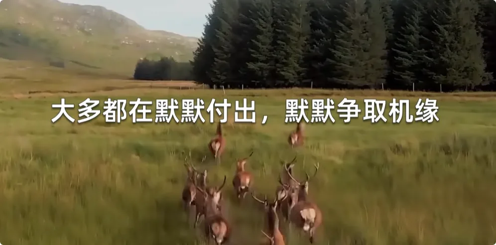

大家好，我是修炼者小烨，今天我来聊一聊修仙或者说修行应该具备什么样的阶段性成果。修行人如何通过实际结果来判断你当前的修行方法是否正确、有效，而不是虚头巴脑的理论。

之所以出这么一期，主要是因为很多修行人书生气太重，纸上谈兵太多，没有实证精神。所以今天小叶来分享一下自己修行修仙以来的几个阶段，都是实实在在走过的路。如果你没有这些成果，那我建议你再规划规划。

## 1. 证得真路：辨别能量来源与发心纯正

**想要真正地开始修行，第一件事就是证明脚下的路是真路。**

这点很难，因为找到真路就已经算是打败`99.9%`的修行人了。放眼古今中外，上升之路看起来多的是，好像条条大路通罗马。

但真正有点悟性，敢于求证、坚持找路的人都能察觉到，这个圈子里面大多数东西，都是空有理论的，表面修饰得高大上，但能让你实打实学到真功夫、真本事的，没有。大多就是让你重复做一些形式化的事情，比如念点什么词儿，练点什么功法，甚至保持什么观念。最正派的那种，也不过是教你保持心态平和，身体健康。

很多人也拜了师傅，甚至很多人自己就是师傅，甚至有的师傅自己也有点本事，有些不寻常的功能，这也是让别人能相信他的基础。可是有一个核心问题仍旧没有解答，那就是能量的来源，或者说力量的来源。你怎么证明力量是来自正道，还是来自其他的事物？这点就非常考验修行人的发心了。

如果一个人追求功利性的东西，比如功能、好处、门面，甚至是大家公认的正统这种事情，那么他不会真正在意能量来自于正还是邪，因为他内心需要的只是被认可。相反，如果一个人只求一个真相，只求这辈子不活得无知无明，不愿意任何形式地自我欺骗，那么他会求证能量来源的正义性和正确性。

而只有这样的人，道才会愿意开放一条供他检验的道路。所以我说证得真路的人就已经打败了99.9%的修行人了。因为发心就不在一个层次，不管你身份高低或者聪明与否，道只看重人的发心。

当你具有这样的发心，你就可以检验眼前的路了。那怎么求证道路是不是真的？这里小烨不从个人的角度去讲判断标准，避免给观众自我暗示之嫌，我会用更客观的语言来说。以下是综合众多以上路的修行人的感悟。

**真正地修行，你只需要往那儿一站，用肉眼去看，就能明白何为道法自然，何为真，何为正。**

***你会惊叹和臣服于它的正确性、纯正性和唯一性。***

任何灵界大佬都不可能伪装成它的模样，它也无法用言语来修饰，唯有本人亲自实践的那一刻，才会惊觉何为真正地修行。就好像一个人在人间睡了几十年，做了很久的梦，如今终于醒了一样。很多人因为得到这个缘分而感动得想哭，甚至不敢置信，也感慨过往经历的灵魂暗夜是如此地值得。

正如小烨往期所说，上升有上升的规矩，两千年前是一套规则，一千年前又是一套规则，现在又换另一套规则。因为天梯是不可能被凡人掌握或者关进庭院的，怎么飞升不由权威人士说了算。

## 2. 洞察无形：觉醒元神与重塑三观

大多数有修行根底的人，证得真路以后，就会觉醒元神的一些修为根底，最基本的就是对能量世界的察觉力。因为首先你得知道你身上得到的是什么，修炼用的纯净能量是什么样的，你要记好，以后要找这种能量来修炼。**一旦这种能力复苏，那么一个人不可避免地察觉到隐藏在有形事物下的一切能量和生灵，说是窥探内在维度也毫不过分。**

每个物体、每个地方、每个人，它们背后都有自己的能量状态。你会发现，凡是发生意外或者准备发生意外的人或物，都具备强烈的煞气，周边提前就聚满了不好的生灵。你也会发现，有些地方神清气爽，走进去就能治愈你，令人十分向往。这次你已经学会了如何趋吉避凶。

其次，能量还具备一个属性，它是跨时空连接的。举个例子，一个人十年前拍下一张照片，不管他现在是否在世，你仍可以通过图片辨识他当时的能量状态，以及他身上的大佬。
最重要的是，你察觉大佬的瞬间，大佬也察觉到了你，你和大佬之间的能量已经发生接触，他还能顺手给你一拳，因为你打扰到他了。整个过程，根本不受时空约束。

所以我刚才说觉醒的是觉察力，而非看到的能力，因为看见别人的长相容易留下印象，如果控制不住一念想，就等于打电话到人家家里去了。除此以外，能量世界的奥妙还有很多，需修行人自行探索和学习。

至此，**人事物的能量属性和吉凶发展状态一览无遗，有形世界和无形世界构成了新的完整世界，能量变成了你判断人事物是否值得投入的关键。** 换而言之，你原有的世界观、价值观、人生观完全坍塌和重塑，常人追求的东西你已经看不上了，也就是说，你已经和常人不在一条路上了。

## 3. 修行考验：清浊能量的转换与神明博弈

给你路走，给你能量修炼的是诸神，而考验你的，倒逼你成长的，其实常常是大佬亲自动的手。当你得到能量后，你已经开始不凡了。在灵界众生的眼里，你比常人更加明亮，神明可以看见你发出的亮点，能量越大越看得见，越多看你两眼。而在大佬眼里，你也是个香饽饽，你消耗清能量后转换出来的浊能量不仅量足，而且比常人更好吃。

那为啥大佬不直接吃修行人的清能量？因为下了死令，不能吃修行人辛苦修得的东西，但如果是修行人自愿被吃的话，那就无妨了。

这个规矩妙在哪儿？

**当一个修行人心性不稳，缺乏历练，还留恋人间欲望的时候，你的想法，你所做的事就一定会加速消耗清能量，转化成低层次的浊能量，这就给了负能量生灵接近你的机会。**

对于神明来说，这既考验了修行人的心性，也给了其他生灵生存的机会。

而对于大佬来说，这是合法合规的"偷"能量，所以他们会故意勾起修行人心中的欲望，引诱修行人犯错。尤其是能量层级越高的修行人，来找上门的大佬就越强大，越聪明诡诈。他们会挖掘你的弱点，尤其是围绕你的贪嗔痴，逼着你消耗掉身上的清能量。

而神明则可以通过你对贪嗔痴的处理方式来判断你的品性。如果修行人本心够好，那就不怕被考验。大佬不仅会吃掉你的低层次能量，还会逐步吃掉那一部分凡心帮你完成蜕变，而神明也会在下一次给你补充更好的能量。但如果修行人发心就是歪的，那么身上的清能量很快就会变浊，连大佬来净身都察觉不到，最后能量被掏空，气场也被置换。
这种经不起考验的修行人需在原地好好修心，如果迟迟执迷不悟，心性上不去，那神仙也度不了。

## 4. 书文分辨：如何辨别古书背后的仙人与大佬

最后再来说一下读书修行这件事。往期我提到过，**文字会承载创作者的能量，而能量又是跨时空连接的**，合在一起的意思就是，只有真正的修行人才能分辨古书里:
哪些内容是仙人伏魔顶写出来的
哪些内容是大佬帮忙写出来的
甚至同一本书两种力量都有参与。辨别的关键就在于背后能量的不同。

当修行人读到神仙写的内容时，会和神仙相互察觉。相反，读到大佬的文字时，哪怕其中的逻辑无懈可击，修行人也只会感到头疼。所以真正的道理很多确实写进书里了，但只有真正的修行人才能看懂。
**凡投机取巧，不在正道想念书修成的人，一定会被另一半知识迷了心窍。**

真正的修行人都是无根之萍，永远都在尘世间漂泊，因为世间本不属于修行人，宇宙长空才属于修行人。在没找到回去的路前，神明对这些人的特殊照顾，就是剥离他在尘世间在意的一切，不惜派遣更多的大佬给这些人制造灵魂暗夜，让他们始终无法在尘世扎根。

相信很多人都有这样的疑问，我是谁？我该何去何从？人生的意义是什么？我存在的意义又是什么？什么才是我真正值得追求的事情？

这些问题，只有回到真正的修行上，你才能得到答案，而且只是先回答了一半。你只是知道了自己是修行人，知道了要追寻仙道，但知道只是知道，知道一件事情，跟彻底领悟一件事情是两件事。

## 5. 磨炼心性：从流浪尘世到获得道之归属感

在踏上修行之路后，你仍需不断磨练心性，直到心足够纯粹，*直到你发现无论身处何处，你都能感受到诸神的回应。天地万物都在给你回应。各处神灵就好像你的家人一样，无论你在地球的任何地方，都有不同的家人来和你打招呼，这说明你的心已经接近于道了，得到了道上众生的肯定，这是一种无与伦比的归属感。归属于道，你不再流浪世间，你获得了永久的安全感。道既在，家便在。道无处不在，我亦处处有根。*

从你修行开始，从城市到乡下，走过五湖四海，你会遇见无数生灵，他们中很多都在大地上修炼，千万年如一日，却没有谁是真正的悠哉度日，大多都在默默付出，默默争取机缘，等待一个上升的机会。无论是神仙精灵还是妖魔鬼怪，他们都在相互救赌，也在以自己的方式渡人，只是人不自知，也不想知。而此时的你见过这世间最美好的事情，明白道所规划的扬升之路已然是最公平普适的路径。你也明白，此乃众生所求，众生无不臣服于它的规则。至此，你明白了众生的责任。

上期我们提到过普度众生这件事，有度人之心是好的，但如果你始终置身事外，只愿当个凡人，看不见众生的全貌，看不见众生的行动，看不见众生的需要，那你又怎么敢说为了众生要普度众生？从这儿开始，不修行的人很难理解，多说意义不大，我只讲了大概。

## 6. 觉醒能力与无形法宝：不同元神的特性与实例

当你身上积攒了足够的能量后，会觉醒一些能力。一个修行人什么时候会用能力因人而异，有的人来历和根底好，复苏得早，操作起来也很厉害。而且不同修行人的元神不同，能力也不一样。
比如我遇到过蝴蝶精转世的修行人，他的眼睛和前额就很灵敏，能对外进行能量扫描和能量接收，窥探无形世界更有优势。
另一位鬼仙转世的修行人搭线能力很强，哪怕是陌生的人和事，只要他一提，都能把背后的大佬拉过来见一见。
还有草药仙转世的修行人，手指的能量很锐利，很容易清扫浊气和负能量生灵。
而小烨的元神，比较容易吸收和学习他人的能力。比如刚才提到的三位都被我学走了，也有好好打磨。到目前为止，目光所及就能扫描和吸收能量的能力最让我满意。

所谓法宝，就是能制服诸邪的宝物，但有形的东西总是容易勾起人的贪念。对于准备修行和刚修行的人来说，不见得是好事，所以我就不过多阐述。

我只简单说说我个人的无形法宝，一般都是在梦里，大神给的奖励，第二天就知道自己有没有了。
小烨有两件: 
1. 一件是宝伞，仅用于出门找能量时可以开一个小结界，不被外面的鬼神揍，同我出行的修行人贴近点也能被保护。
2. 另一件是长戟，目前仅在引渡海外修行人的时候，化成三叉戟射退海妖。你看，使用条件还是很苛刻的，绝不是你想怎么来就怎么来，修行人还是要守规矩，自己什么身份还是要掂量掂量。

## 7. 半仙状态：能量满溢的牵引感与对常人的疏离感

所谓半仙就是当一个修行人，修行能量蓄满身体的一半，心性也和道无限接近，其实也差不多可以上去了的，就要看上面要不要收了。
其实大多修行人一天内收取大量能量的时候，也会体验到这种状态，**因为清净的能量会把人的感官、眼界、心性，甚至能量场都向上牵引，这其实就是上面的世界在慢慢引渡你上去的过程了。** 
这种时候，人会放下尘世的一切执念，会感觉人间那点东西真的不算什么，干啥都不如修仙快乐。等到太阳下山，修行人回到城市就会发现，你在人群中真的坐不住，因为你跟常人的能量场完全不一样了。常人是很浊的，尤其是越到后面，越是无法共鸣常人的价值追求，看旁人就好像在看花花草草一样，很难像以前那样喜欢。所以很多人问自己的欲望很重怎么办？
我都会说慢慢来，自然而然地用真正清净的能量去挤掉凡气。因为你还是肉体凡胎，全身上下都在产生欲望，你是无法避免的。

## 8. 最后的劝诫：不追求神通，唯有纯粹心性方能走通此路

以上，如果你没有获得过这些实实在在的经历和成果，如果你还停留在咬文嚼字，停留在形式化的修行，那就不要期待死后成仙佛这种事了，毕竟太长远，人总不能安慰自己一辈子。
最后小烨还是要给大家打退堂鼓，不奔修行修仙来问路，奔着神通，奔着与众不同，那此处没有，绝对不会给你任何甜头。因为你这么发心的时候，就偏离了道，道不会要你的。

只有心思纯粹之人，心里能把修行修仙当第一位的人，才能真正走好这条路。