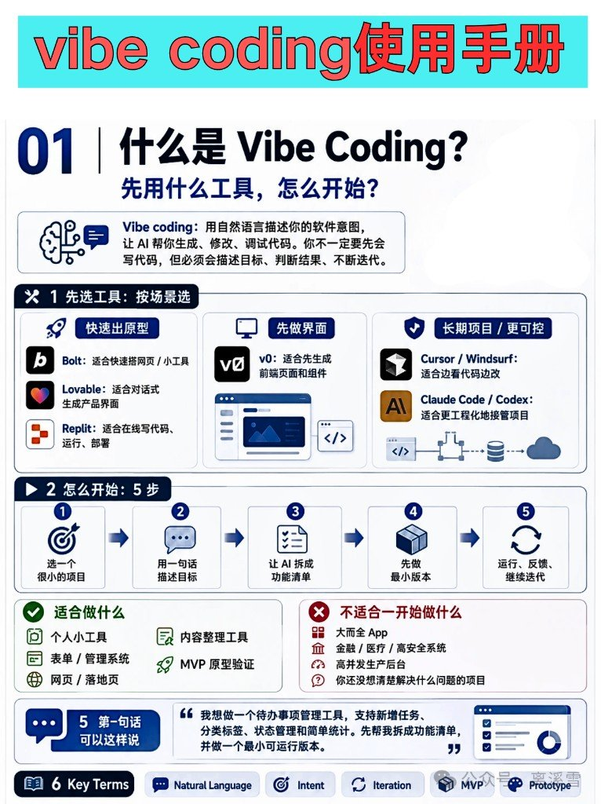
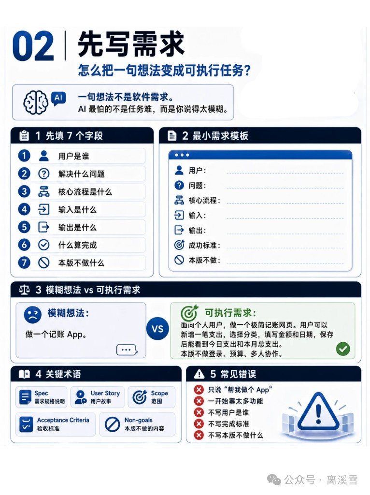
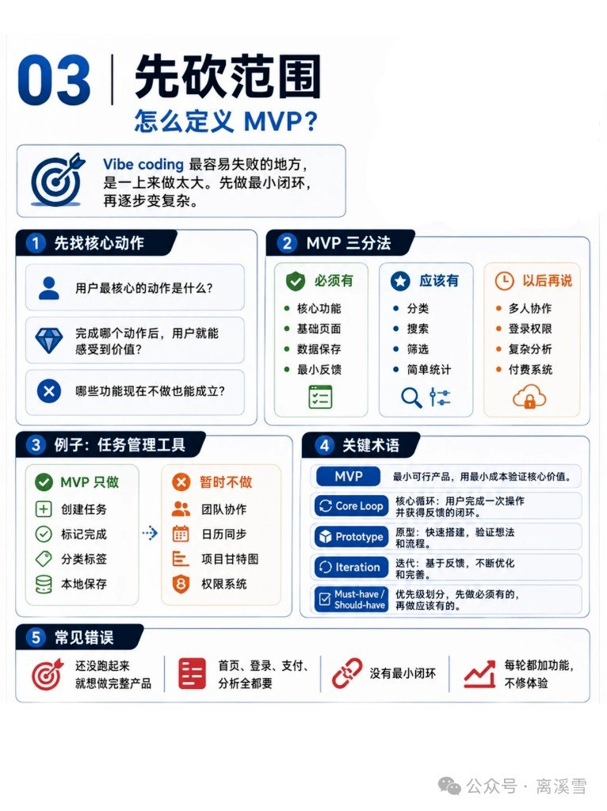
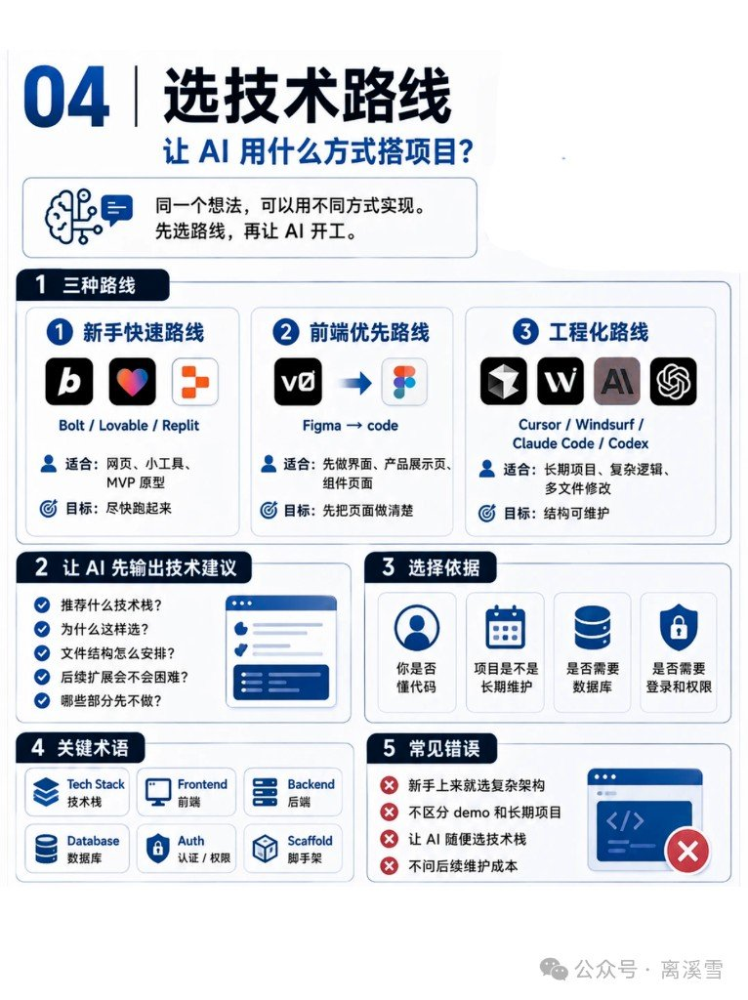
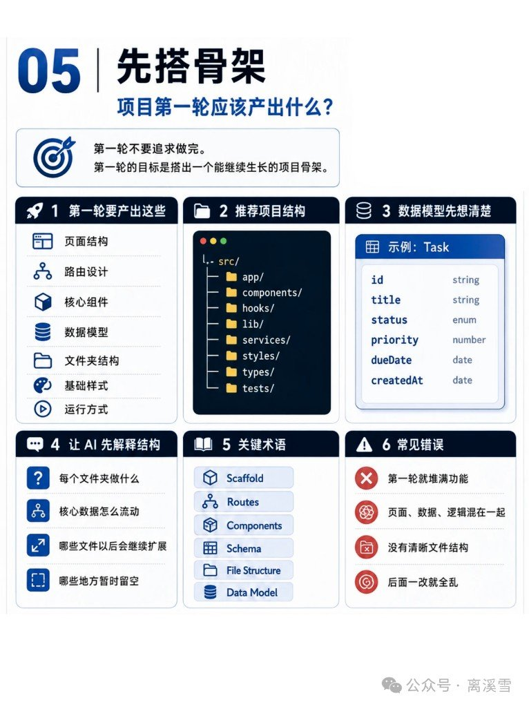
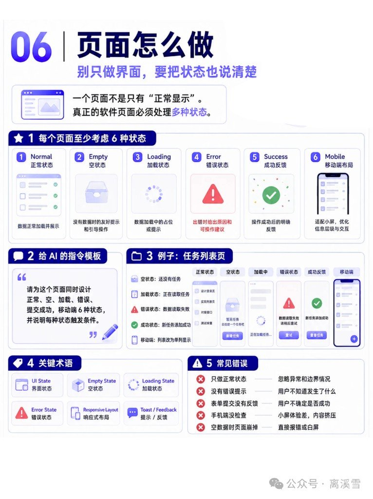
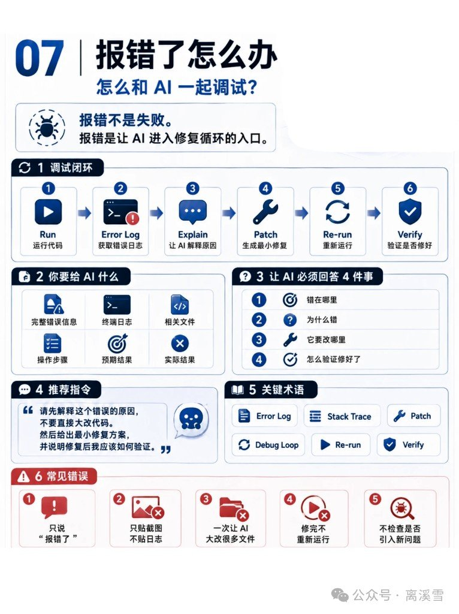
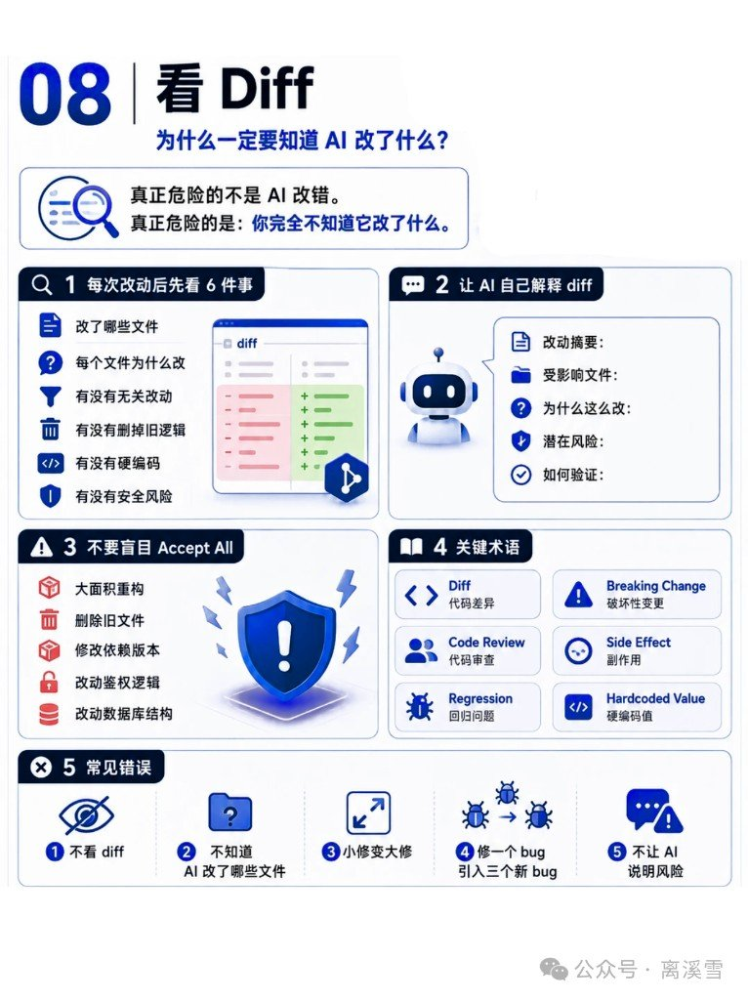
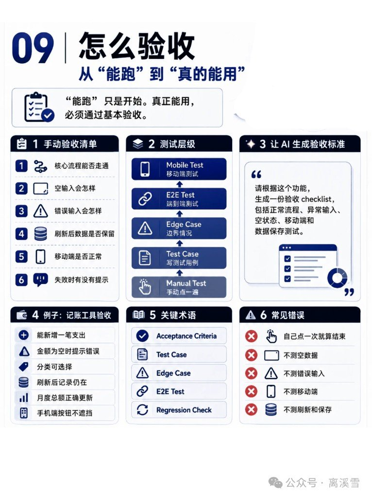
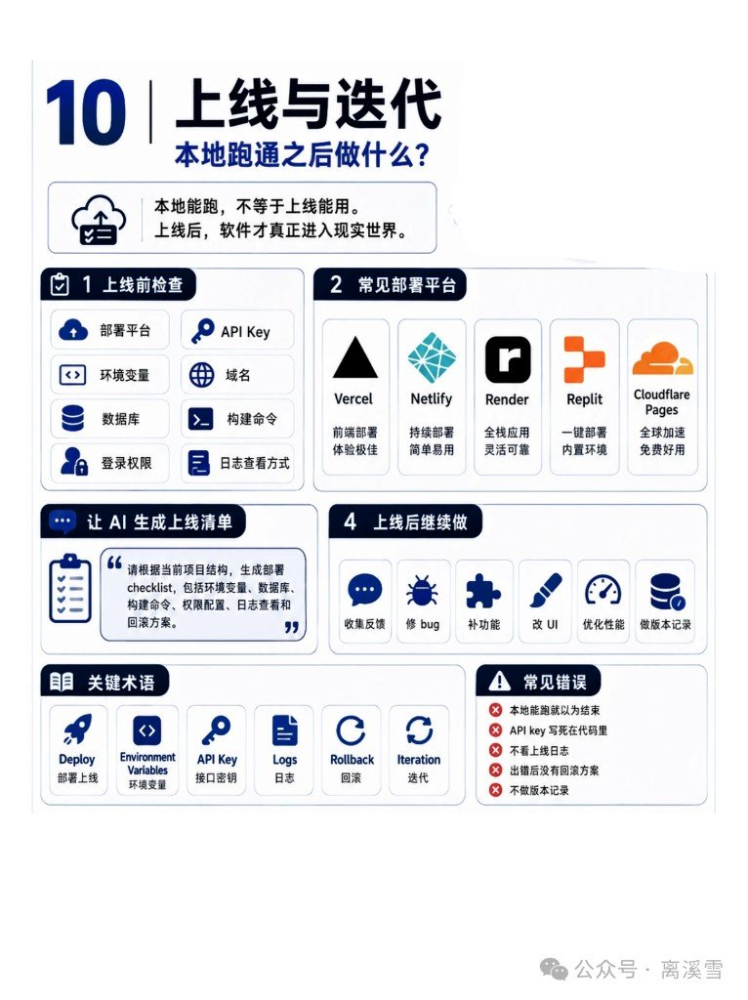

很多人以为 vibe coding = 跟 AI 聊天就能出 App。其实更像一门**描述目标、判断结果、持续迭代**的手艺：你不必先会手写每一行代码，但得说得清、看得懂、敢砍范围。

下面按「离溪雪」系列信息图 01–10 原样拆开。每章一张图，能带走的是动作，不是口号。

---

## 01｜先搞清楚 vibe coding 是啥、用啥、怎么开



**定义（图上原话大意）：** 用自然语言描述软件意图，让 AI 帮你生成、修改、调试代码。不必先会写代码，但要能描述目标、判断结果、持续迭代。

### 先选工具

| 场景 | 工具 | 图上说法 |
|---|---|---|
| 快速出原型 | Bolt | 网页和小工具快速搭 |
| | Lovable | 对话式生成产品界面 |
| | Replit | 在线写、跑、部署 |
| 先做界面 | v0 | 先出前端页面和组件 |
| 长期 / 更可控 | Cursor、Windsurf | 边看代码边改 |
| | Claude Code、Codex | 更偏工程接管项目 |

### 怎么开始：5 步

1. 选一个很小的项目  
2. 用一句话描述目标  
3. 让 AI 拆成功能清单  
4. 先做最小版本（MVP）  
5. 运行、反馈、继续迭代  

**适合：** 个人小工具、表单/管理系统、网页/落地页、内容整理工具、MVP 原型验证。  
**不适合一开始就上：** 大型综合 App、高安全系统（金融/医疗）、高并发生产后端、问题本身都说不清的项目。

**第一句可以这样说：**

> 我想做一个待办管理工具，支持新增任务、分类标签、状态管理和简单统计。先帮我拆成功能清单，并做一个最小可用版本。

**术语：** 自然语言 · 意图 · 迭代 · MVP · 原型

---

## 02｜先写需求：一句想法不是软件需求



AI 最怕的不是任务难，而是你说得太模糊。

### 先填 7 个字段

1. 用户是谁  
2. 解决什么问题  
3. 核心流程是什么  
4. 输入是什么  
5. 输出是什么  
6. 什么算完成  
7. 本版不做什么  

最小需求模板同一套字段：用户 / 问题 / 核心流程 / 输入 / 输出 / 成功标准 / 本版不做。

### 模糊 vs 可执行（记账 App）

| 模糊 | 可执行 |
|---|---|
| 「做一个记账 App。」 | 「面向个人用户，做一个极简记账网页。用户可以新增一笔支出，选择分类，填写金额和日期，保存后能看到今日支出和本月总支出。本版不做登录、预算、多人协作。」 |

**术语：** Spec · User Story · Scope · Acceptance Criteria · Non-goals  

**常见错误：** 只说「帮我做个 App」；一上来塞太多功能；不说明用户；不定义完成标准；不写本版不做。

---

## 03｜先砍范围：怎么定义 MVP



Vibe coding 最容易失败的地方，是一上来做太大。先做最小闭环，再逐步变复杂。

### 先找核心动作（三问）

1. 用户最核心的动作是什么？  
2. 完成哪个动作后，用户就能感受到价值？  
3. 哪些功能现在不做也能成立？  

### MVP 三分法

| 档 | 典型内容 |
|---|---|
| 必须有（Must） | 核心功能、基础页面、数据保存、最小反馈 |
| 应该有（Should） | 分类、搜索、筛选、简单统计 |
| 以后再说 | 多人协作、登录权限、复杂分析、支付系统 |

**例子：任务管理工具**

- MVP 只做：创建任务、标记完成、分类标签、本地保存  
- 暂时不做：团队协作、日历同步、项目甘特图、权限系统  

**术语：** MVP · 核心循环 · 原型 · 迭代 · Must-have / Should-have  

**常见错误：** 还没跑通就想做完整产品；首页+登录+支付+分析一次全要；没有最小闭环；每轮加功能却不管体验。

---

## 04｜选技术路线：让 AI 用什么方式搭项目



### 三种路线

| 路线 | 工具 | 适合 | 目标 |
|---|---|---|---|
| ① 新手快速 | Bolt、Lovable、Replit | 网页、小工具、MVP | 尽快跑起来 |
| ② 前端优先 | v0、Figma → code | 先看界面、落地页、组件多的页 | 先把视觉/UI 说清 |
| ③ 工程化 | Cursor、Windsurf、Claude Code、Codex | 长期项目、复杂逻辑、多文件改 | 可维护结构 |

### 让 AI 先输出技术建议清单

- 推荐什么技术栈？  
- 为什么选这个栈？  
- 文件结构怎么排？  
- 以后扩展难不难？  
- 哪些部分现在先跳过？  

### 选择依据四问

懂不懂代码？要不要长期维护？要不要数据库？要不要登录权限（Auth）？

**术语：** Tech Stack · Frontend · Backend · Database · Auth · Scaffold  

**常见错误：** 新手一上来选复杂架构；临时 demo 和长期项目不分；放任 AI 随便定栈；不考虑维护成本。

---

## 05｜先搭骨架：第一轮别追求做完



第一轮目标不是做完，而是搭出一个能继续生长的项目骨架。

### 第一轮要产出这些

页面结构 · 路由设计 · 核心组件 · 数据模型 · 文件夹结构 · 基础样式 · 运行方式

### 推荐 `src/` 结构（图上示意）

```text
src/
  app/
  components/
  hooks/
  lib/
  services/
  styles/
  types/
  tests/
```

### 数据模型先想清楚（Task 例）

| 字段 | 类型 |
|---|---|
| id | string |
| title | string |
| status | enum |
| priority | number |
| dueDate | date |
| createdAt | date |

### 让 AI 先解释结构

每个文件夹做什么 · 核心数据怎么流动 · 哪些文件以后会扩展 · 哪些地方暂时留空

**术语：** Scaffold · Routes · Components · Schema · File Structure · Data Model  

**常见错误：** 第一轮就堆满功能；页面/数据/逻辑搅在一起；没有清晰文件结构；后面一改就全乱。

---

## 06｜页面怎么做：别只做「正常显示」



真实软件页面至少要把状态说清楚。

### 每页至少考虑 6 种状态

| 状态 | 要点 |
|---|---|
| 正常 | 数据正常加载并展示 |
| 空 | 无数据时的友好提示 + 引导动作 |
| 加载 | 占位或提示，别让人以为卡死 |
| 错误 | 说明原因 + 可操作建议 |
| 成功 | 操作成功后的明确反馈 |
| 移动端 | 小屏信息层级与交互 |

**给 AI 的指令模板：**

> 请为这个页面同时设计正常、空、加载、错误、提交成功、移动端 6 种状态，并说明每种状态触发条件。

**任务列表页例子：** 空=「还没有任务」+ 新建；加载=「正在读取任务」骨架屏；错误=读取失败 + 重试；成功=新增成功 + 查看；移动端=列表改单列。

**术语：** UI State · Empty State · Loading State · Error State · Responsive Layout · Toast / Feedback  

**常见错误：** 只做正常态；没错误提示；表单提交无反馈；不看移动端；空数据直接白屏/崩。

---

## 07｜报错了怎么办：和 AI 一起进修复循环



报错不是失败。报错是让 AI 进入修复循环的入口。

### 调试闭环 6 步

运行 → 错误日志 → 让 AI 解释原因 → 最小修复 → 重跑 → 验证是否修好

### 你要给 AI 的六要素

完整错误信息 · 终端日志 · 相关文件 · 操作步骤 · 预期结果 · 实际结果

### 让 AI 必须答 4 件事

1. 错在哪里  
2. 为什么错  
3. 它要改哪里  
4. 怎么验证修好了  

**推荐指令：**

> 请先解释这个错误的原因，不要直接大改代码。然后给出最小修复方案，并说明修复后我应该如何验证。

**术语：** Error Log · Stack Trace · Patch · Debug Loop · Re-run · Verify  

**常见错误：** 只说「报错了」；只贴截图不贴日志；一次让 AI 大改很多文件；修完不重跑；不检查是否引入新问题。

---

## 08｜看 Diff：真正危险的是你不知道它改了什么



真正危险的不是 AI 改错，而是你完全不知道它改了什么。

### 每次改动后先看 6 件事

1. 改了哪些文件  
2. 每个文件为什么改  
3. 有没有无关改动  
4. 有没有删掉旧逻辑  
5. 有没有硬编码  
6. 有没有安全风险  

### 让 AI 自己解释 diff

改动摘要 · 受影响文件 · 为什么这么改 · 潜在风险 · 如何验证

### 不要盲目 Accept All

涉及这些时尤其别一键全收：大面积重构 · 删除旧文件 · 修改依赖版本 · 改动鉴权逻辑 · 改动数据库结构

**术语：** Diff · Code Review · Regression · Breaking Change · Side Effect · Hardcoded Value  

**常见错误：** 不看 diff；不知道改了哪些文件；小修变大修；修一个 bug 引入三个新 bug；不让 AI 说明风险。

---

## 09｜怎么验收：从「能跑」到「真能用」



### 手动验收 6 问

1. 核心流程能否走通？  
2. 空输入会怎样？  
3. 错误输入会怎样？  
4. 刷新后数据是否保留？  
5. 移动端是否正常？  
6. 失败时有没有提示？  

### 测试层级（由浅到深）

手动点一遍 → 写测试用例 → 边界情况 → 端到端（E2E）→ 移动端测试

**让 AI 生成验收 checklist：**

> 请根据这个功能，生成一份验收 checklist，包括正常流程、异常输入、空状态、移动端和数据保存测试。

**例子：记账工具验收** —— 能新增支出；金额为空有错误提示；分类可选；刷新后记录还在；本月合计正确更新；移动端按钮不被挡住。

**术语：** Acceptance Criteria · Test Case · Edge Case · E2E Test · Regression Check  

**常见错误：** 自己点一遍就当完；不测空数据；不测错误输入；不测移动端；不测刷新与持久化。

---

## 10｜上线与迭代：本地能跑 ≠ 上线能用



软件真正进入「真实世界」，是上线之后。

### 上线前 8 项检查

部署平台 · 环境变量 · 数据库 · 登录权限 · API Key · 域名 · 构建命令 · 日志查看方式

### 常见部署平台（图上）

| 平台 | 图上说法 |
|---|---|
| Vercel | 前端部署体验好 |
| Netlify | 持续部署简单 |
| Render | 全栈灵活可靠 |
| Replit | 内置环境一键部署 |
| Cloudflare Pages | 全球加速，免费好用 |

**让 AI 生成部署清单：**

> 请根据当前项目结构生成一份部署 checklist，包括环境变量、数据库、构建命令、权限配置、日志查看和回滚方案。

### 上线后继续做

收集反馈 · 修 bug · 补功能 · 改 UI · 优化性能 · 做版本记录

**术语：** Deploy · Environment Variables · API Key · Logs · Rollback · Iteration  

**常见错误：** 本地能跑就当完；API Key 写死在代码里；不上生产看日志；没有回滚方案；不做版本记录。

---

## 和同批笔记怎么摆

| 笔记 | 关系 |
|---|---|
| [删了流程 Skill，Codex 还是会写代码…](../2026-08-08_VibeCoding别把流程交给聊天框/) | 入门十步之后，别把流程只活在聊天框 |
| [Vibecoding 的双轨](../2026-08-10_Vibecoding双轨机制/) | 工程化路线里的「一边干一边盯」 |
| [Claude Code 四类 Loop](../2026-08-10_ClaudeCode四类循环工作流/) | 走到 Cursor/Claude Code 后，Loop 怎么交出去 |
| [Prompt → Context → Harness → Loop](../2026-08-10_Prompt-Context-Harness-Loop四次迁移/) | 为什么瓶颈会从 Prompt 挪到 Harness/Loop |
| [Vibe 编程 10 工具选型地图](../../2026-08-04_Vibe编程10工具选型地图/) | 工具怎么选；本篇是**怎么用** |

十步走完，你会发现：难的从来不是「让 AI 写」，而是需求写清、范围砍准、Diff 看得懂、验收过得去、上线还能迭代。
