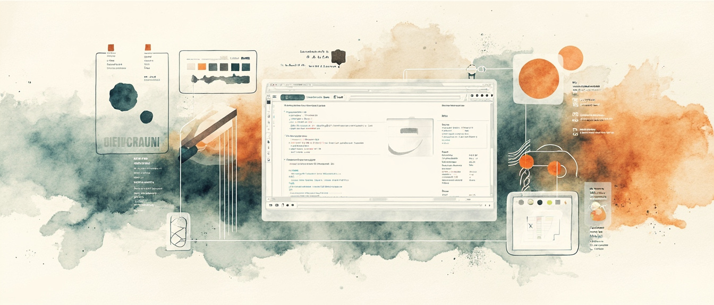

鱼皮那套 [Vibe Coding 零基础教程](https://ai.codefather.cn/vibe) 里，「10 编程工具」板块单独就能占一本小册子：从零代码到 Cursor / Claude Code / Codex，再到 OpenClaw 和 32 工具盘点。全搬进博客没意义，这篇只做索引和能带走的判断，操作细节回原文。

[原文 · 10 编程工具目录（GitHub）](https://github.com/liyupi/ai-guide/tree/main/Vibe%20Coding%20%E9%9B%B6%E5%9F%BA%E7%A1%80%E6%95%99%E7%A8%8B/10%20%E7%BC%96%E7%A8%8B%E5%B7%A5%E5%85%B7) · [Vibe Coding 在线阅读](https://ai.codefather.cn/vibe) · [ai-guide 仓库](https://github.com/liyupi/ai-guide)

## 怎么读这张地图

| 你的情况 | 建议路径 |
|---|---|
| 完全零基础，想今天出东西 | 00 导读 → 01 模型 → 02 零代码 |
| 有基础，要控代码做项目 | 01 模型 → 04 代码编辑器 → Cursor 专题 |
| 极客 / 服务器 / 批量自动化 | 05 命令行 → Claude Code / Codex 专题 |
| 不知道买啥、怎么搭 | 直接跳 09 鱼皮工具箱 |
| OpenClaw 养虾 | 本站已有 [数字员工与权限边界：OpenClaw 索引](/posts/openclaw-tutorial-index/)，本节 07 只挂入口 |

鱼皮把工具分成三大类：**零代码平台**（浏览器开箱）、**AI 代码编辑器**（本地精控）、**命令行工具**（CLI 是 AI 的母语）。选对类型，比纠结「哪个最好」重要。

## 00 AI 编程工具大全

板块总导读：为什么 Vibe 时代选型比传统 IDE 重要、三大类型对照、主线/支线怎么读。支线就是 Cursor / Codex / Claude Code 三个子目录 + `工具实战/`。

[原文 · GitHub](https://github.com/liyupi/ai-guide/blob/main/Vibe%20Coding%20%E9%9B%B6%E5%9F%BA%E7%A1%80%E6%95%99%E7%A8%8B/10%20%E7%BC%96%E7%A8%8B%E5%B7%A5%E5%85%B7/00%20AI%20%E7%BC%96%E7%A8%8B%E5%B7%A5%E5%85%B7%E5%A4%A7%E5%85%A8.md)

## 01 AI 模型选择指南

所有工具共用「大脑」：Claude 偏代码质量，GPT 偏速度和生态，Gemini 偏超长上下文和 UI，国产（DeepSeek / GLM / 通义 / Kimi）偏性价比。按预算 + 场景选，没有绝对最强。

[原文 · GitHub](https://github.com/liyupi/ai-guide/blob/main/Vibe%20Coding%20%E9%9B%B6%E5%9F%BA%E7%A1%80%E6%95%99%E7%A8%8B/10%20%E7%BC%96%E7%A8%8B%E5%B7%A5%E5%85%B7/01%20AI%20%E6%A8%A1%E5%9E%8B%E9%80%89%E6%8B%A9%E6%8C%87%E5%8D%97.md)

## 02 AI 零代码平台

Bolt.new / Lovable / 百度秒哒为主：打开浏览器、说人话、所见即所得。Bolt 快原型，Lovable 全栈+数据库，秒哒中文+商业化（支付）。新手最佳起点。

[原文 · GitHub](https://github.com/liyupi/ai-guide/blob/main/Vibe%20Coding%20%E9%9B%B6%E5%9F%BA%E7%A1%80%E6%95%99%E7%A8%8B/10%20%E7%BC%96%E7%A8%8B%E5%B7%A5%E5%85%B7/02%20AI%20%E9%9B%B6%E4%BB%A3%E7%A0%81%E5%B9%B3%E5%8F%B0.md)

## 03 AI 智能体平台

Flowith / Manus / OpenManus：AI 当项目经理，自主规划、长时运行（做大型站、长 PPT、批量内容）。适合「只要结果、不管过程」；精修仍建议导出到 Cursor。

[原文 · GitHub](https://github.com/liyupi/ai-guide/blob/main/Vibe%20Coding%20%E9%9B%B6%E5%9F%BA%E7%A1%80%E6%95%99%E7%A8%8B/10%20%E7%BC%96%E7%A8%8B%E5%B7%A5%E5%85%B7/03%20AI%20%E6%99%BA%E8%83%BD%E4%BD%93%E5%B9%B3%E5%8F%B0.md)

## 04 AI 代码编辑器

Cursor 深度讲解 + Windsurf / Antigravity / Kiro / TRAE / Zed 横评。Tab 补全、Agent 多文件、Chat / 内联编辑；`.cursorrules`、分步需求、Git 回滚是实战要点。预算够优先 Cursor，省钱看 Windsurf。

[原文 · GitHub](https://github.com/liyupi/ai-guide/blob/main/Vibe%20Coding%20%E9%9B%B6%E5%9F%BA%E7%A1%80%E6%95%99%E7%A8%8B/10%20%E7%BC%96%E7%A8%8B%E5%B7%A5%E5%85%B7/04%20AI%20%E4%BB%A3%E7%A0%81%E7%BC%96%E8%BE%91%E5%99%A8.md)

## 05 AI 命令行编程工具

Claude Code 为主，Gemini CLI / Codex CLI / Aider 等补充。CLI 面向 AI 执行成功率更高、Token 更省；Skills 把规范打包给 Agent。国内常配国产模型 API。

[原文 · GitHub](https://github.com/liyupi/ai-guide/blob/main/Vibe%20Coding%20%E9%9B%B6%E5%9F%BA%E7%A1%80%E6%95%99%E7%A8%8B/10%20%E7%BC%96%E7%A8%8B%E5%B7%A5%E5%85%B7/05%20AI%20%E5%91%BD%E4%BB%A4%E8%A1%8C%E7%BC%96%E7%A8%8B%E5%B7%A5%E5%85%B7.md)

## 06 AI IDE 插件

Cline、Continue、GitHub Copilot 等：在 VS Code / JetBrains 里加 AI，Cursor 额度用尽时的备胎。Cline 免费、跨 IDE，鱼皮当 Cursor 替补。

[原文 · GitHub](https://github.com/liyupi/ai-guide/blob/main/Vibe%20Coding%20%E9%9B%B6%E5%9F%BA%E7%A1%80%E6%95%99%E7%A8%8B/10%20%E7%BC%96%E7%A8%8B%E5%B7%A5%E5%85%B7/06%20AI%20IDE%20%E6%8F%92%E4%BB%B6.md)

## 07 OpenClaw 保姆级安装教程

Vibe 板块里的 OpenClaw 入口：数字员工、接 IM、控本机。**本站已单独做 [OpenClaw 索引](/posts/openclaw-tutorial-index/)**，本章只作链回，不重复展开。

[原文 · GitHub](https://github.com/liyupi/ai-guide/blob/main/Vibe%20Coding%20%E9%9B%B6%E5%9F%BA%E7%A1%80%E6%95%99%E7%A8%8B/10%20%E7%BC%96%E7%A8%8B%E5%B7%A5%E5%85%B7/07%20OpenClaw%20%E4%BF%9D%E5%A7%86%E7%BA%A7%E5%AE%89%E8%A3%85%E6%95%99%E7%A8%8B.md) · [本站 OpenClaw 索引](/posts/openclaw-tutorial-index/)

## 08 AI 辅助工具集

Git / 部署 / MCP / Agent Skills / 规范驱动开发等周边：让主工具跑得稳。和 10 扩展推荐有交叉，08 偏「工作流组件」，10 偏「扩展清单」。

[原文 · GitHub](https://github.com/liyupi/ai-guide/blob/main/Vibe%20Coding%20%E9%9B%B6%E5%9F%BA%E7%A1%80%E6%95%99%E7%A8%8B/10%20%E7%BC%96%E7%A8%8B%E5%B7%A5%E5%85%B7/08%20AI%20%E8%BE%85%E5%8A%A9%E5%B7%A5%E5%85%B7%E9%9B%86.md)

## 09 我的 AI 工具箱推荐

鱼皮 2025 Top 20 实盘：大项目 Cursor+Opus，小项目 Claude Code+GLM，备胎 Cline+DeepSeek；多媒体、大模型、框架、浏览器插件分场景组合。不知道咋搭，先看这篇。

[原文 · GitHub](https://github.com/liyupi/ai-guide/blob/main/Vibe%20Coding%20%E9%9B%B6%E5%9F%BA%E7%A1%80%E6%95%99%E7%A8%8B/10%20%E7%BC%96%E7%A8%8B%E5%B7%A5%E5%85%B7/09%20%E6%88%91%E7%9A%84%20AI%20%E5%B7%A5%E5%85%B7%E7%AE%B1%E6%8E%A8%E8%8D%90.md)

## 10 优质 AI 编程扩展推荐

超长扩展清单：Rules、MCP、Skills、插件、规范工具等。和 Cursor / Claude Code 配置文互补，适合当「还能装什么」的检索表。

[原文 · GitHub](https://github.com/liyupi/ai-guide/blob/main/Vibe%20Coding%20%E9%9B%B6%E5%9F%BA%E7%A1%80%E6%95%99%E7%A8%8B/10%20%E7%BC%96%E7%A8%8B%E5%B7%A5%E5%85%B7/10%20%E4%BC%98%E8%B4%A8%20AI%20%E7%BC%96%E7%A8%8B%E6%89%A9%E5%B1%95%E6%8E%A8%E8%8D%90.md)

## Cursor 专题

| 原文 | 摘要 |
|---|---|
| [Cursor 保姆级教程](https://github.com/liyupi/ai-guide/blob/main/Vibe%20Coding%20%E9%9B%B6%E5%9F%BA%E7%A1%80%E6%95%99%E7%A8%8B/10%20%E7%BC%96%E7%A8%8B%E5%B7%A5%E5%85%B7/Cursor/Cursor%20%E4%BF%9D%E5%A7%86%E7%BA%A7%E6%95%99%E7%A8%8B.md) | 安装到第一个项目：Agent / Chat / Rules 入门 |
| [Cursor Debug 模式详解](https://github.com/liyupi/ai-guide/blob/main/Vibe%20Coding%20%E9%9B%B6%E5%9F%BA%E7%A1%80%E6%95%99%E7%A8%8B/10%20%E7%BC%96%E7%A8%8B%E5%B7%A5%E5%85%B7/Cursor/Cursor%20Debug%20%E6%A8%A1%E5%BC%8F%E8%AF%A6%E8%A7%A3.md) | Debug 模式定位与用法 |

[Cursor 目录 · GitHub](https://github.com/liyupi/ai-guide/tree/main/Vibe%20Coding%20%E9%9B%B6%E5%9F%BA%E7%A1%80%E6%95%99%E7%A8%8B/10%20%E7%BC%96%E7%A8%8B%E5%B7%A5%E5%85%B7/Cursor)

## Claude Code 专题

| 原文 | 摘要 |
|---|---|
| [常用斜杠命令大全](https://github.com/liyupi/ai-guide/blob/main/Vibe%20Coding%20%E9%9B%B6%E5%9F%BA%E7%A1%80%E6%95%99%E7%A8%8B/10%20%E7%BC%96%E7%A8%8B%E5%B7%A5%E5%85%B7/Claude%20Code/Claude%20Code%20%E5%B8%B8%E7%94%A8%E6%96%9C%E6%9D%A0%E5%91%BD%E4%BB%A4%E5%A4%A7%E5%85%A8.md) | 斜杠命令速查 |
| [七种指令方式全解析](https://github.com/liyupi/ai-guide/blob/main/Vibe%20Coding%20%E9%9B%B6%E5%9F%BA%E7%A1%80%E6%95%99%E7%A8%8B/10%20%E7%BC%96%E7%A8%8B%E5%B7%A5%E5%85%B7/Claude%20Code/Claude%20Code%20%E9%85%8D%E7%BD%AE%E5%93%B2%E5%AD%A6%EF%BC%9A%E4%B8%83%E7%A7%8D%E6%8C%87%E4%BB%A4%E6%96%B9%E5%BC%8F%E5%85%A8%E8%A7%A3%E6%9E%90.md) | CLAUDE.md / Rules / Skills / Hooks 等 |
| [用好 CLAUDE.md](https://github.com/liyupi/ai-guide/blob/main/Vibe%20Coding%20%E9%9B%B6%E5%9F%BA%E7%A1%80%E6%95%99%E7%A8%8B/10%20%E7%BC%96%E7%A8%8B%E5%B7%A5%E5%85%B7/Claude%20Code/%E7%94%A8%E5%A5%BD%20CLAUDE.md%20%E8%AE%A9%20AI%20%E7%BC%96%E7%A8%8B%E6%95%88%E7%87%8F%E7%BF%BB%E5%80%8D.md) | 项目级上下文怎么写 |
| [对接国内模型](https://github.com/liyupi/ai-guide/blob/main/Vibe%20Coding%20%E9%9B%B6%E5%9F%BA%E7%A1%80%E6%95%99%E7%A8%8B/10%20%E7%BC%96%E7%A8%8B%E5%B7%A5%E5%85%B7/Claude%20Code/Claude%20Code%20%E5%92%8C%20Codex%20%E5%AF%B9%E6%8E%A5%E5%9B%BD%E5%86%85%E6%A8%A1%E5%9E%8B%E6%95%99%E7%A8%8B.md) | Claude Code / Codex 换国产 API |

[Claude Code 目录 · GitHub](https://github.com/liyupi/ai-guide/tree/main/Vibe%20Coding%20%E9%9B%B6%E5%9F%BA%E7%A1%80%E6%95%99%E7%A8%8B/10%20%E7%BC%96%E7%A8%8B%E5%B7%A5%E5%85%B7/Claude%20Code)

## Codex 专题

| 原文 | 摘要 |
|---|---|
| [AI 桌面应用保姆级教程](https://github.com/liyupi/ai-guide/blob/main/Vibe%20Coding%20%E9%9B%B6%E5%9F%BA%E7%A1%80%E6%95%99%E7%A8%8B/10%20%E7%BC%96%E7%A8%8B%E5%B7%A5%E5%85%B7/Codex/Codex%EF%BC%9AAI%20%E6%A1%8C%E9%9D%A2%E5%BA%94%E7%94%A8%E4%BF%9D%E5%A7%86%E7%BA%A7%E6%95%99%E7%A8%8B.md) | Browser/Computer Use、Skills、MCP、自动化 |
| [Record & Replay](https://github.com/liyupi/ai-guide/blob/main/Vibe%20Coding%20%E9%9B%B6%E5%9F%BA%E7%A1%80%E6%95%99%E7%A8%8B/10%20%E7%BC%96%E7%A8%8B%E5%B7%A5%E5%85%B7/Codex/Codex%20Record%20&%20Replay%EF%BC%9A%E5%BD%95%E5%88%B6%E5%8A%9F%E8%83%BD%E6%95%99%E7%A8%8B.md) | 录制回放工作流 |
| [主题定制教程](https://github.com/liyupi/ai-guide/blob/main/Vibe%20Coding%20%E9%9B%B6%E5%9F%BA%E7%A1%80%E6%95%99%E7%A8%8B/10%20%E7%BC%96%E7%A8%8B%E5%B7%A5%E5%85%B7/Codex/Codex%20%E4%B8%BB%E9%A2%98%E5%AE%9A%E5%88%B6%E6%95%99%E7%A8%8B.md) | 终端/UI 主题 |

[Codex 目录 · GitHub](https://github.com/liyupi/ai-guide/tree/main/Vibe%20Coding%20%E9%9B%B6%E5%9F%BA%E7%A1%80%E6%95%99%E7%A8%8B/10%20%E7%BC%96%E7%A8%8B%E5%B7%A5%E5%85%B7/Codex)

## 工具实战（选读）

| 原文 | 摘要 |
|---|---|
| [盘点 32 个 AI 编程工具](https://github.com/liyupi/ai-guide/blob/main/Vibe%20Coding%20%E9%9B%B6%E5%9F%BA%E7%A1%80%E6%95%99%E7%A8%8B/10%20%E7%BC%96%E7%A8%8B%E5%B7%A5%E5%85%B7/%E5%B7%A5%E5%85%B7%E5%AE%9E%E6%88%98/%E7%9B%98%E7%82%B9%2032%20%E4%B8%AA%20AI%20%E7%BC%96%E7%A8%8B%E5%B7%A5%E5%85%B7.md) | 全景盘点 |
| [VSCode + Copilot 实战](https://github.com/liyupi/ai-guide/blob/main/Vibe%20Coding%20%E9%9B%B6%E5%9F%BA%E7%A1%80%E6%95%99%E7%A8%8B/10%20%E7%BC%96%E7%A8%8B%E5%B7%A5%E5%85%B7/%E5%B7%A5%E5%85%B7%E5%AE%9E%E6%88%98/VSCode%20%2B%20GitHub%20Copilot%EF%BC%9A%E5%BE%AE%E8%BD%AF%E5%85%A8%E5%AE%B6%E6%A1%B6%E7%9A%84%20AI%20%E7%BC%96%E7%A8%8B%E5%AE%9E%E6%88%98.md) | 微软全家桶路线 |
| [Gemini CLI 首测](https://github.com/liyupi/ai-guide/blob/main/Vibe%20Coding%20%E9%9B%B6%E5%9F%BA%E7%A1%80%E6%95%99%E7%A8%8B/10%20%E7%BC%96%E7%A8%8B%E5%B7%A5%E5%85%B7/%E5%B7%A5%E5%85%B7%E5%AE%9E%E6%88%98/Gemini%20CLI%20%E9%A6%96%E6%B5%8B%EF%BC%9A%E5%85%8D%E8%B4%B9%E5%BC%80%E6%BA%90%E5%BE%88%E9%A6%99%EF%BC%8C%E4%BD%86%E5%9D%91%E7%82%B9%E5%BE%88%E5%A4%9A%EF%BC%81.md) | 免费 CLI 实测 |
| [TRAE SOLO](https://github.com/liyupi/ai-guide/blob/main/Vibe%20Coding%20%E9%9B%B6%E5%9F%BA%E7%A1%80%E6%95%99%E7%A8%8B/10%20%E7%BC%96%E7%A8%8B%E5%B7%A5%E5%85%B7/%E5%B7%A5%E5%85%B7%E5%AE%9E%E6%88%98/TRAE%20SOLO%EF%BC%9AAI%20%E4%B8%BB%E5%AF%BC%E7%9A%84%E5%85%A8%E6%A0%88%E5%BC%80%E5%8F%91%E5%B7%A5%E5%85%B7.md) | AI 主导全栈 |
| [Dify 零代码 AI 应用](https://github.com/liyupi/ai-guide/blob/main/Vibe%20Coding%20%E9%9B%B6%E5%9F%BA%E7%A1%80%E6%95%99%E7%A8%8B/10%20%E7%BC%96%E7%A8%8B%E5%B7%A5%E5%85%B7/%E5%B7%A5%E5%85%B7%E5%AE%9E%E6%88%98/Dify%EF%BC%9A%E9%9B%B6%E4%BB%A3%E7%A0%81%20AI%20%E5%BA%94%E7%94%A8%E5%BC%80%E5%8F%91%E5%B9%B3%E5%8F%B0.md) | 知识库 / 工作流 |
| [OpenClaw 数字员工](https://github.com/liyupi/ai-guide/blob/main/Vibe%20Coding%20%E9%9B%B6%E5%9F%BA%E7%A1%80%E6%95%99%E7%A8%8B/10%20%E7%BC%96%E7%A8%8B%E5%B7%A5%E5%85%B7/%E5%B7%A5%E5%85%B7%E5%AE%9E%E6%88%98/OpenClaw%EF%BC%9A%E9%83%A8%E7%BD%B2%E4%BD%A0%E7%9A%84%20AI%20%E6%95%B0%E5%AD%97%E5%91%98%E5%B7%A5.md) | → [本站 OpenClaw 索引](/posts/openclaw-tutorial-index/) |

[工具实战完整目录 · GitHub](https://github.com/liyupi/ai-guide/tree/main/Vibe%20Coding%20%E9%9B%B6%E5%9F%BA%E7%A1%80%E6%95%99%E7%A8%8B/10%20%E7%BC%96%E7%A8%8B%E5%B7%A5%E5%85%B7/%E5%B7%A5%E5%85%B7%E5%AE%9E%E6%88%98)（另含 Spec-kit、Agent Skills、Superpowers、IDEA AI、Copilot 云端开发等）

## 出处与边界

| 项 | 说明 |
|---|---|
| 原作 | 程序员鱼皮 · [ai-guide](https://github.com/liyupi/ai-guide) · [AI 导航 / Vibe](https://ai.codefather.cn/vibe) |
| 本篇 | 索引 + 精炼摘要；步骤与截图以原文为准 |
| 未做 | 不镜像全文、不搬运图床整包 |
| OpenClaw | 07 与实战 OpenClaw 文链到本站 [OpenClaw 索引](/posts/openclaw-tutorial-index/) |
| 相关阅读 | [入门坐标](/posts/vibe-basics-index/) · [模型横评](/posts/vibe-models-index/) · [项目实战](/posts/vibe-projects-index/) · [对话与回路](/posts/vibe-coding-tips-index/) · [编程学习](/posts/vibe-learning-index/) · [概念与热文](/posts/vibe-concepts-hotposts-index/) · [MCP 薄笔记](/posts/vibe-mcp-index/) · [OpenClaw 索引](/posts/openclaw-tutorial-index/) · [Cursor 与 Claude 规范迁移](/posts/cursor-claude-harness-migration/) · [合集 鱼皮VibeCoding](/collections/vibe-tutorial-index/) |
