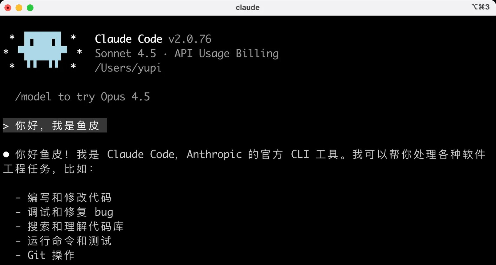

基础索引里已经挂了 **60 资源大全** 和 **90 FAQ**（见 [对话即代码：Vibe 入门坐标](/posts/vibe-basics-index/)），这里不重复展开。这篇补两块：**70 概念大全**（+ 65 视频课入口）和 **站内热文导读**——适合查词、看风向、找「为什么这套教程火了」。

[系列总览 · 鱼皮 AI 导航](https://ai.codefather.cn/vibe) · [GitHub · 教程收尾](https://github.com/liyupi/ai-guide/tree/main/Vibe%20Coding%20%E9%9B%B6%E5%9F%BA%E7%A1%80%E6%95%99%E7%A8%8B)

## 和 basics 怎么分工

| 内容 | 去哪读 |
|---|---|
| 60 资源大全 · 90 FAQ | [vibe-basics-index](/posts/vibe-basics-index/) |
| 70 概念词典 · 65 视频课 | **本篇** |
| 站内爆款 / 模式辨析热文 | **本篇** |

## 70 概念大全

词典型，卡住某个词就翻；不必通读。

| 文 | 带走什么 | 原文 |
|---|---|---|
| 00 Vibe Coding 概念大全 | AI 基础 / 提示词 / 编程模式 / 上下文 / 输出 / 工具 / 项目管理 / 前后端 分区词条 | [GitHub](https://github.com/liyupi/ai-guide/blob/main/Vibe%20Coding%20%E9%9B%B6%E5%9F%BA%E7%A1%80%E6%95%99%E7%A8%8B/70%20AI%20%E7%BC%96%E7%A8%8B%E6%A6%82%E5%BF%B5%E5%A4%A7%E5%85%A8/00%20Vibe%20Coding%20%E6%A6%82%E5%BF%B5%E5%A4%A7%E5%85%A8.md) |
| AI 大模型原理入门 | 原理薄入口 | [GitHub](https://github.com/liyupi/ai-guide/blob/main/Vibe%20Coding%20%E9%9B%B6%E5%9F%BA%E7%A1%80%E6%95%99%E7%A8%8B/70%20AI%20%E7%BC%96%E7%A8%8B%E6%A6%82%E5%BF%B5%E5%A4%A7%E5%85%A8/AI%20%E5%A4%A7%E6%A8%A1%E5%9E%8B%E5%8E%9F%E7%90%86%E5%85%A5%E9%97%A8.md) |
| 主流 AI 应用开发模式 | 模式对照（和热文「6 种模式」互补） | [GitHub](https://github.com/liyupi/ai-guide/blob/main/Vibe%20Coding%20%E9%9B%B6%E5%9F%BA%E7%A1%80%E6%95%99%E7%A8%8B/70%20AI%20%E7%BC%96%E7%A8%8B%E6%A6%82%E5%BF%B5%E5%A4%A7%E5%85%A8/%E4%B8%BB%E6%B5%81%20AI%20%E5%BA%94%E7%94%A8%E5%BC%80%E5%8F%91%E6%A8%A1%E5%BC%8F.md) |
| AI 动态工作流详解 | 动态工作流概念 | [GitHub](https://github.com/liyupi/ai-guide/blob/main/Vibe%20Coding%20%E9%9B%B6%E5%9F%BA%E7%A1%80%E6%95%99%E7%A8%8B/70%20AI%20%E7%BC%96%E7%A8%8B%E6%A6%82%E5%BF%B5%E5%A4%A7%E5%85%A8/AI%20%E5%8A%A8%E6%80%81%E5%B7%A5%E4%BD%9C%E6%B5%81%E8%AF%A6%E8%A7%A3.md) |

## 65 视频课入口

跟做视频 + 源码路线时看；文字索引仍以 GitHub / AI 导航为准。

[原文 · 65 鱼皮的 AI 编程实战视频课](https://github.com/liyupi/ai-guide/blob/main/Vibe%20Coding%20%E9%9B%B6%E5%9F%BA%E7%A1%80%E6%95%99%E7%A8%8B/65%20%E9%B1%BC%E7%9A%AE%E7%9A%84%20AI%20%E7%BC%96%E7%A8%8B%E5%AE%9E%E6%88%98%E8%A7%86%E9%A2%91%E8%AF%BE.md)

## 站内热文导读（精选）

下列优先鱼皮本人 + 高讨论向；社区帖当对照样本，不逐篇摘要。

### 必看风向

| 题 | 为什么点 | 链 |
|---|---|---|
| 我的免费 Vibe Coding 教程，爆了！ | 系列缘起与传播 | [ai.codefather.cn](https://ai.codefather.cn/post/2011284517213483010) |
| 别再说 AI 编程就是 Vibe Coding 了！6 种主流模式一次讲清 | 名词消歧，和 70「开发模式」互补 | [codefather.cn](https://www.codefather.cn/post/2044278935100878850) |
| 130 篇保姆级 AI 编程实战教程，全部免费开源 | 体量与开源承诺 | [ai.codefather.cn](https://ai.codefather.cn/post/2077317562110099457) |

### 鱼皮相关续读

| 题 | 链 |
|---|---|
| 26 年最新 AI 编程学习路线一条龙 | [post/2069253647249719298](https://ai.codefather.cn/post/2069253647249719298) |
| VSCode + Copilot 保姆级实战 | [post/2033395228798443522](https://ai.codefather.cn/post/2033395228798443522) |
| 20 个神级 AI 编程扩展 | [post/2013449096026767361](https://ai.codefather.cn/post/2013449096026767361) |
| 女友怒骂国内不能用 Claude Code… | [post/2004031022055895042](https://ai.codefather.cn/post/2004031022055895042) |
| 揭秘 GitHub 最火开源 Skills 仓库 | [post/2079758116253122561](https://ai.codefather.cn/post/2079758116253122561) |

### 社区对照（点题即可）

执行力、小程序复盘、面试生存、长期维护、会不会淘汰初级……多在 `codefather` / `ai.codefather` 搜标题即可。

## 出处与边界

| 项 | 说明 |
|---|---|
| 原作 | 程序员鱼皮 · [ai-guide](https://github.com/liyupi/ai-guide) · 站内帖另注域名 |
| 本篇 | 概念 + 热文导读；**不重做 60/90** |
| 未做 | 不镜像概念大全全文、不搬 500+ 热文图 |
| 相关阅读 | [入门坐标](/posts/vibe-basics-index/) · [编程学习](/posts/vibe-learning-index/) · [项目实战](/posts/vibe-projects-index/) · [合集 鱼皮VibeCoding](/collections/vibe-tutorial-index/) |
