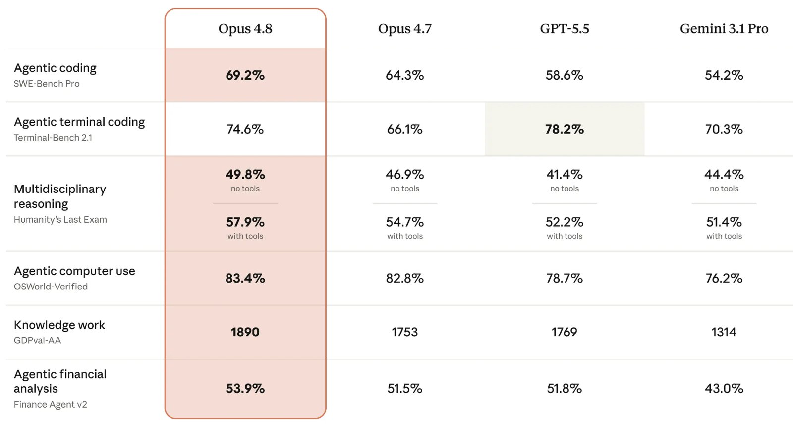

AI 模型几周换一拨，鱼皮单独开了「15 模型动态」：不是教材顺序，是**新闻 + 同题实测**。想系统选型先看工具栏的《AI 模型选择指南》（本站 [工具栈三岔](/posts/vibe-coding-tools-index/) 有摘要）；这篇只管「新模型出来了怎么扫」。

[系列总览 · 鱼皮 AI 导航](https://ai.codefather.cn/vibe) · [GitHub · 15 模型动态](https://github.com/liyupi/ai-guide/tree/main/Vibe%20Coding%20%E9%9B%B6%E5%9F%BA%E7%A1%80%E6%95%99%E7%A8%8B/15%20%E6%A8%A1%E5%9E%8B%E5%8A%A8%E6%80%81)

## 你卡在哪就跳哪

| 你想 | 建议 |
|---|---|
| 弄清板块定位 | 先读 **00 导读** |
| 看某家旗舰能不能写项目 | 单模型 7/4 案例实测 |
| 同题谁完成度高 | 三模型 / 四模型横评 |
| 日常该订哪个 | 回 [工具索引 · 01 模型选择](/posts/vibe-coding-tools-index/) |

## 这篇收了哪些测评

| 类型 | 文 | 带走什么 | 原文 |
|---|---|---|---|
| 导读 | 00 模型动态导读 | 单测 vs 横评怎么用；不必按序学 | [GitHub](https://github.com/liyupi/ai-guide/blob/main/Vibe%20Coding%20%E9%9B%B6%E5%9F%BA%E7%A1%80%E6%95%99%E7%A8%8B/15%20%E6%A8%A1%E5%9E%8B%E5%8A%A8%E6%80%81/00%20%E6%A8%A1%E5%9E%8B%E5%8A%A8%E6%80%81%E5%AF%BC%E8%AF%BB.md) |
| 单测 | Claude Opus 5 · 7 项目 | 同一套提示词跑 7 案，看边界 | [GitHub](https://github.com/liyupi/ai-guide/blob/main/Vibe%20Coding%20%E9%9B%B6%E5%9F%BA%E7%A1%80%E6%95%99%E7%A8%8B/15%20%E6%A8%A1%E5%9E%8B%E5%8A%A8%E6%80%81/Claude%20Opus%205%20%E7%BC%96%E7%A8%8B%E8%83%BD%E5%8A%9B%E5%AE%9E%E6%B5%8B%20-%207%20%E4%B8%AA%E9%A1%B9%E7%9B%AE%E6%A1%88%E4%BE%8B.md) |
| 单测 | Kimi K3 · 7 项目 | 与 Opus 5 同题，方便横比 | [GitHub](https://github.com/liyupi/ai-guide/blob/main/Vibe%20Coding%20%E9%9B%B6%E5%9F%BA%E7%A1%80%E6%95%99%E7%A8%8B/15%20%E6%A8%A1%E5%9E%8B%E5%8A%A8%E6%80%81/Kimi%20K3%20%E7%BC%96%E7%A8%8B%E8%83%BD%E5%8A%9B%E5%AE%9E%E6%B5%8B%20-%207%20%E4%B8%AA%E9%A1%B9%E7%9B%AE%E6%A1%88%E4%BE%8B.md) |
| 单测 | 小米 MiMo · 4 项目 | 国产线案例密度稍低，看性价比场景 | [GitHub](https://github.com/liyupi/ai-guide/blob/main/Vibe%20Coding%20%E9%9B%B6%E5%9F%BA%E7%A1%80%E6%95%99%E7%A8%8B/15%20%E6%A8%A1%E5%9E%8B%E5%8A%A8%E6%80%81/%E5%B0%8F%E7%B1%B3%20MiMo%20%E7%BC%96%E7%A8%8B%E8%83%BD%E5%8A%9B%E5%AE%9E%E6%B5%8B%20-%204%20%E4%B8%AA%E9%A1%B9%E7%9B%AE%E6%A1%88%E4%BE%8B.md) |
| 横评 | Claude Fable 5 vs Opus 4.8 / GPT-5.5 | 同提示开项目，比完成度 | [GitHub](https://github.com/liyupi/ai-guide/blob/main/Vibe%20Coding%20%E9%9B%B6%E5%9F%BA%E7%A1%80%E6%95%99%E7%A8%8B/15%20%E6%A8%A1%E5%9E%8B%E5%8A%A8%E6%80%81/Claude%20Fable%205%20%E7%BC%96%E7%A8%8B%E8%83%BD%E5%8A%9B%E5%AE%9E%E6%B5%8B%20-%20%E5%AF%B9%E6%AF%94%20Opus%204.8%20%E5%92%8C%20GPT-5.5.md) |
| 横评 | GPT-5.6 三模型全栈 | Ultra / Max 等卖点 + Cursor 并行实测 | [GitHub](https://github.com/liyupi/ai-guide/blob/main/Vibe%20Coding%20%E9%9B%B6%E5%9F%BA%E7%A1%80%E6%95%99%E7%A8%8B/15%20%E6%A8%A1%E5%9E%8B%E5%8A%A8%E6%80%81/GPT-5.6%20%E4%B8%89%E6%A8%A1%E5%9E%8B%E6%A8%AA%E8%AF%84%20-%20%E5%85%A8%E6%A0%88%E9%A1%B9%E7%9B%AE%E5%AE%9E%E6%B5%8B.md) |
| 横评 | Opus 4.8 四模型全栈 | 过程 / 成品 / 代码质量分栏再综合 | [GitHub](https://github.com/liyupi/ai-guide/blob/main/Vibe%20Coding%20%E9%9B%B6%E5%9F%BA%E7%A1%80%E6%95%99%E7%A8%8B/15%20%E6%A8%A1%E5%9E%8B%E5%8A%A8%E6%80%81/Opus%204.8%20%E5%9B%9B%E6%A8%A1%E5%9E%8B%E6%A8%AA%E8%AF%84%20-%20%E5%85%A8%E6%A0%88%E9%A1%B9%E7%9B%AE%E5%AE%9E%E6%B5%8B.md) |

## 读测评时盯什么

- **同题才可比**：导读强调单测用同一套项目提示词；横评是同一段需求并行开干。
- **排名会过期**：把文当「当时快照」，订阅决策仍看预算 + 场景，别死磕某一篇冠军。
- **和工具栏分工**：这里偏「刚发布测了啥」；长期选型回 10 工具的模型指南。

## 出处与边界

| 项 | 说明 |
|---|---|
| 原作 | 程序员鱼皮 · [ai-guide](https://github.com/liyupi/ai-guide) · [AI 导航 /vibe](https://ai.codefather.cn/vibe) |
| 本篇 | 7 篇索引摘要；不复述打分细节 |
| 未做 | 不镜像全文、不搬 200+ 张实测截图 |
| 相关阅读 | [工具栈三岔](/posts/vibe-coding-tools-index/) · [项目实战](/posts/vibe-projects-index/) · [入门坐标](/posts/vibe-basics-index/) · [合集 鱼皮VibeCoding](/collections/vibe-tutorial-index/) |
