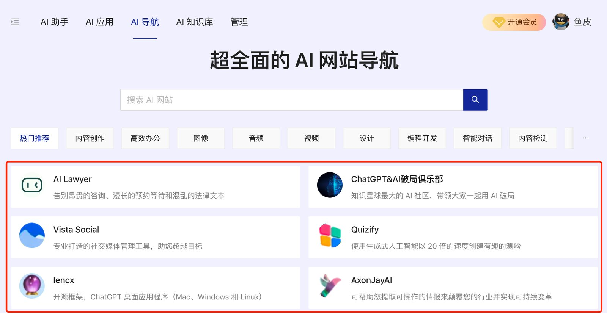
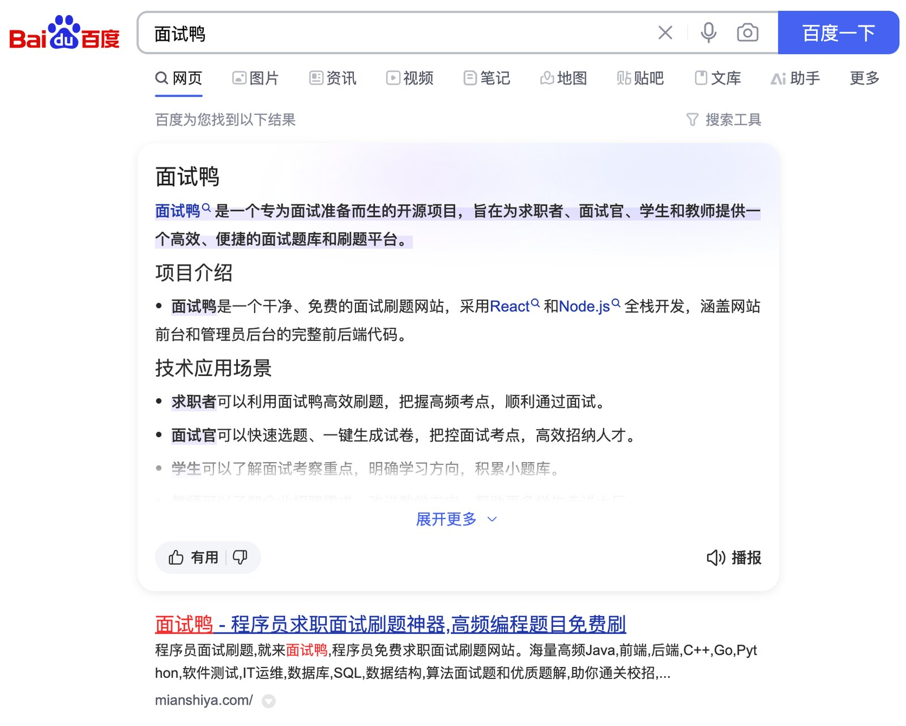

项目能跑 ≠ 产品有人用、有人付。鱼皮「50 产品变现」把腾讯 + 创业里的流程压成主线，再挂安全 / 监控 / 涨粉等支线。这篇只做地图；定价表和踩坑截图回原文。

[系列总览 · 鱼皮 AI 导航](https://ai.codefather.cn/vibe) · [GitHub · 50 产品变现](https://github.com/liyupi/ai-guide/tree/main/Vibe%20Coding%20%E9%9B%B6%E5%9F%BA%E7%A1%80%E6%95%99%E7%A8%8B/50%20%E4%BA%A7%E5%93%81%E5%8F%98%E7%8E%B0)

## 你卡在哪就跳哪

| 你想 | 建议 |
|---|---|
| 从 0 建立变现观 | 00 → 01，再按主线往下 |
| 已有作品要卖 | 重点 07 盈利模式 · 08 付费策略 · 09/10 获客 |
| 站刚上线怕被打 | 云安全 · 数据保护 · 监控告警 |
| 开源涨星 / 做号 | GitHub 涨粉 · 自媒体起号 / 运营 |

做完项目再进本栏更顺；实战地图见 [项目实战索引](/posts/vibe-projects-index/)。

## 主线（建议顺序）

| 章 | 带走什么 | 原文 |
|---|---|---|
| 00 产品变现导读 | 板块怎么用、主线 vs 支线 | [GitHub](https://github.com/liyupi/ai-guide/blob/main/Vibe%20Coding%20%E9%9B%B6%E5%9F%BA%E7%A1%80%E6%95%99%E7%A8%8B/50%20%E4%BA%A7%E5%93%81%E5%8F%98%E7%8E%B0/00%20%E4%BA%A7%E5%93%81%E5%8F%98%E7%8E%B0%E5%AF%BC%E8%AF%BB.md) |
| 01 为什么要做产品变现 | 价值检验、别只堆仓库 | [GitHub](https://github.com/liyupi/ai-guide/blob/main/Vibe%20Coding%20%E9%9B%B6%E5%9F%BA%E7%A1%80%E6%95%99%E7%A8%8B/50%20%E4%BA%A7%E5%93%81%E5%8F%98%E7%8E%B0/01%20%E4%B8%BA%E4%BB%80%E4%B9%88%E8%A6%81%E5%81%9A%E4%BA%A7%E5%93%81%E5%8F%98%E7%8E%B0%EF%BC%9F.md) |
| 02 需求分析和产品规划 | 问题 → 方案，少拍脑袋开干 | [GitHub](https://github.com/liyupi/ai-guide/blob/main/Vibe%20Coding%20%E9%9B%B6%E5%9F%BA%E7%A1%80%E6%95%99%E7%A8%8B/50%20%E4%BA%A7%E5%93%81%E5%8F%98%E7%8E%B0/02%20%E9%9C%80%E6%B1%82%E5%88%86%E6%9E%90%E5%92%8C%E4%BA%A7%E5%93%81%E8%A7%84%E5%88%92.md) |
| 03 文档沉淀和知识管理 | 文档当长期记忆，换人也能接 | [GitHub](https://github.com/liyupi/ai-guide/blob/main/Vibe%20Coding%20%E9%9B%B6%E5%9F%BA%E7%A1%80%E6%95%99%E7%A8%8B/50%20%E4%BA%A7%E5%93%81%E5%8F%98%E7%8E%B0/03%20%E6%96%87%E6%A1%A3%E6%B2%89%E6%B7%80%E5%92%8C%E7%9F%A5%E8%AF%86%E7%AE%A1%E7%90%86.md) |
| 04 技术选型实战指南 | 栈怎么选才扛得住迭代 | [GitHub](https://github.com/liyupi/ai-guide/blob/main/Vibe%20Coding%20%E9%9B%B6%E5%9F%BA%E7%A1%80%E6%95%99%E7%A8%8B/50%20%E4%BA%A7%E5%93%81%E5%8F%98%E7%8E%B0/04%20%E6%8A%80%E6%9C%AF%E9%80%89%E5%9E%8B%E5%AE%9E%E6%88%98%E6%8C%87%E5%8D%97.md) |
| 05 系统架构设计实践 | 从能跑到可演进 | [GitHub](https://github.com/liyupi/ai-guide/blob/main/Vibe%20Coding%20%E9%9B%B6%E5%9F%BA%E7%A1%80%E6%95%99%E7%A8%8B/50%20%E4%BA%A7%E5%93%81%E5%8F%98%E7%8E%B0/05%20%E7%B3%BB%E7%BB%9F%E6%9E%B6%E6%9E%84%E8%AE%BE%E8%AE%A1%E5%AE%9E%E8%B7%B5.md) |
| 06 项目研发流程选择 | 个人节奏 vs 团队流程 | [GitHub](https://github.com/liyupi/ai-guide/blob/main/Vibe%20Coding%20%E9%9B%B6%E5%9F%BA%E7%A1%80%E6%95%99%E7%A8%8B/50%20%E4%BA%A7%E5%93%81%E5%8F%98%E7%8E%B0/06%20%E9%A1%B9%E7%9B%AE%E7%A0%94%E5%8F%91%E6%B5%81%E7%A8%8B%E9%80%89%E6%8B%A9.md) |
| 07 产品盈利模式设计 | 钱从哪来 | [GitHub](https://github.com/liyupi/ai-guide/blob/main/Vibe%20Coding%20%E9%9B%B6%E5%9F%BA%E7%A1%80%E6%95%99%E7%A8%8B/50%20%E4%BA%A7%E5%93%81%E5%8F%98%E7%8E%B0/07%20%E4%BA%A7%E5%93%81%E7%9B%88%E5%88%A9%E6%A8%A1%E5%BC%8F%E8%AE%BE%E8%AE%A1.md) |
| 08 产品付费策略设计 | 怎么定价、怎么挡白嫖 | [GitHub](https://github.com/liyupi/ai-guide/blob/main/Vibe%20Coding%20%E9%9B%B6%E5%9F%BA%E7%A1%80%E6%95%99%E7%A8%8B/50%20%E4%BA%A7%E5%93%81%E5%8F%98%E7%8E%B0/08%20%E4%BA%A7%E5%93%81%E4%BB%98%E8%B4%B9%E7%AD%96%E7%95%A5%E8%AE%BE%E8%AE%A1.md) |
| 09 SEO 实战 | 传统搜索获客 | [GitHub](https://github.com/liyupi/ai-guide/blob/main/Vibe%20Coding%20%E9%9B%B6%E5%9F%BA%E7%A1%80%E6%95%99%E7%A8%8B/50%20%E4%BA%A7%E5%93%81%E5%8F%98%E7%8E%B0/09%20SEO%20%E6%90%9C%E7%B4%A2%E5%BC%95%E6%93%8E%E4%BC%98%E5%8C%96%E5%AE%9E%E6%88%98.md) |
| 10 GEO 实战 | 生成式引擎里被引用 / 被推荐 | [GitHub](https://github.com/liyupi/ai-guide/blob/main/Vibe%20Coding%20%E9%9B%B6%E5%9F%BA%E7%A1%80%E6%95%99%E7%A8%8B/50%20%E4%BA%A7%E5%93%81%E5%8F%98%E7%8E%B0/10%20GEO%20%E7%94%9F%E6%88%90%E5%BC%8F%E5%BC%95%E6%93%8E%E4%BC%98%E5%8C%96%E5%AE%9E%E6%88%98.md) |

## 支线（按需跳读）

| 文 | 场景 |
|---|---|
| [云服务安全防护实践](https://github.com/liyupi/ai-guide/blob/main/Vibe%20Coding%20%E9%9B%B6%E5%9F%BA%E7%A1%80%E6%95%99%E7%A8%8B/50%20%E4%BA%A7%E5%93%81%E5%8F%98%E7%8E%B0/%E4%BA%91%E6%9C%8D%E5%8A%A1%E5%AE%89%E5%85%A8%E9%98%B2%E6%8A%A4%E5%AE%9E%E8%B7%B5.md) | 防刷量、密钥与配额血泪 |
| [网站数据保护实践](https://github.com/liyupi/ai-guide/blob/main/Vibe%20Coding%20%E9%9B%B6%E5%9F%BA%E7%A1%80%E6%95%99%E7%A8%8B/50%20%E4%BA%A7%E5%93%81%E5%8F%98%E7%8E%B0/%E7%BD%91%E7%AB%99%E6%95%B0%E6%8D%AE%E4%BF%9D%E6%8A%A4%E5%AE%9E%E8%B7%B5.md) | 反爬与数据护栏 |
| [系统监控告警实践](https://github.com/liyupi/ai-guide/blob/main/Vibe%20Coding%20%E9%9B%B6%E5%9F%BA%E7%A1%80%E6%95%99%E7%A8%8B/50%20%E4%BA%A7%E5%93%81%E5%8F%98%E7%8E%B0/%E7%B3%BB%E7%BB%9F%E7%9B%91%E6%8E%A7%E5%91%8A%E8%AD%A6%E5%AE%9E%E8%B7%B5.md) | 出事能第一时间知道 |
| [网站数据分析实战](https://github.com/liyupi/ai-guide/blob/main/Vibe%20Coding%20%E9%9B%B6%E5%9F%BA%E7%A1%80%E6%95%99%E7%A8%8B/50%20%E4%BA%A7%E5%93%81%E5%8F%98%E7%8E%B0/%E7%BD%91%E7%AB%99%E6%95%B0%E6%8D%AE%E5%88%86%E6%9E%90%E5%AE%9E%E6%88%98.md) | 用数据改产品 |
| [GitHub 涨星涨粉技巧](https://github.com/liyupi/ai-guide/blob/main/Vibe%20Coding%20%E9%9B%B6%E5%9F%BA%E7%A1%80%E6%95%99%E7%A8%8B/50%20%E4%BA%A7%E5%93%81%E5%8F%98%E7%8E%B0/%E6%88%91%E7%9A%84%20GitHub%20%E6%B6%A8%E6%98%9F%E6%B6%A8%E7%B2%89%E6%8A%80%E5%B7%A7.md) | 开源曝光 |
| [个人站长实战经验](https://github.com/liyupi/ai-guide/blob/main/Vibe%20Coding%20%E9%9B%B6%E5%9F%BA%E7%A1%80%E6%95%99%E7%A8%8B/50%20%E4%BA%A7%E5%93%81%E5%8F%98%E7%8E%B0/%E6%88%91%E7%9A%84%E4%B8%AA%E4%BA%BA%E7%AB%99%E9%95%BF%E5%AE%9E%E6%88%98%E7%BB%8F%E9%AA%8C.md) | 多站运营心得 |
| [自媒体起号经验](https://github.com/liyupi/ai-guide/blob/main/Vibe%20Coding%20%E9%9B%B6%E5%9F%BA%E7%A1%80%E6%95%99%E7%A8%8B/50%20%E4%BA%A7%E5%93%81%E5%8F%98%E7%8E%B0/%E6%88%91%E7%9A%84%E8%87%AA%E5%AA%92%E4%BD%93%E8%B5%B7%E5%8F%B7%E7%BB%8F%E9%AA%8C.md) / [涨粉运营之路](https://github.com/liyupi/ai-guide/blob/main/Vibe%20Coding%20%E9%9B%B6%E5%9F%BA%E7%A1%80%E6%95%99%E7%A8%8B/50%20%E4%BA%A7%E5%93%81%E5%8F%98%E7%8E%B0/%E6%88%91%E7%9A%84%E8%87%AA%E5%AA%92%E4%BD%93%E6%B6%A8%E7%B2%89%E8%BF%90%E8%90%A5%E4%B9%8B%E8%B7%AF.md) | 从 0 到百万粉路径（经验向） |

## 出处与边界

| 项 | 说明 |
|---|---|
| 原作 | 程序员鱼皮 · [ai-guide](https://github.com/liyupi/ai-guide) · [AI 导航 /vibe](https://ai.codefather.cn/vibe) |
| 本篇 | 19 篇索引；不复述商业机密级细节 |
| 未做 | 不镜像全文、不搬运营截图整包 |
| 相关阅读 | [项目实战](/posts/vibe-projects-index/) · [编程学习](/posts/vibe-learning-index/) · [对话与回路](/posts/vibe-coding-tips-index/) · [合集 鱼皮VibeCoding](/collections/vibe-tutorial-index/) |
