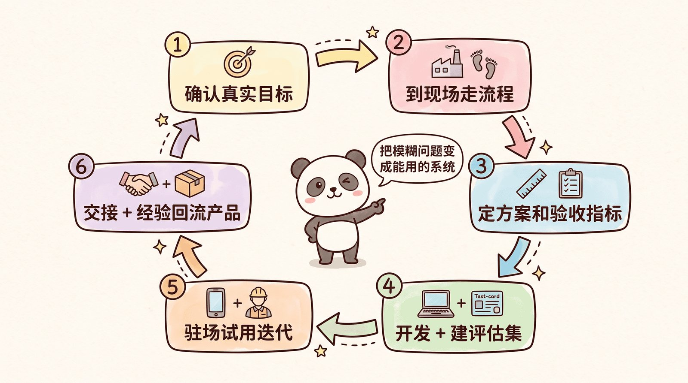
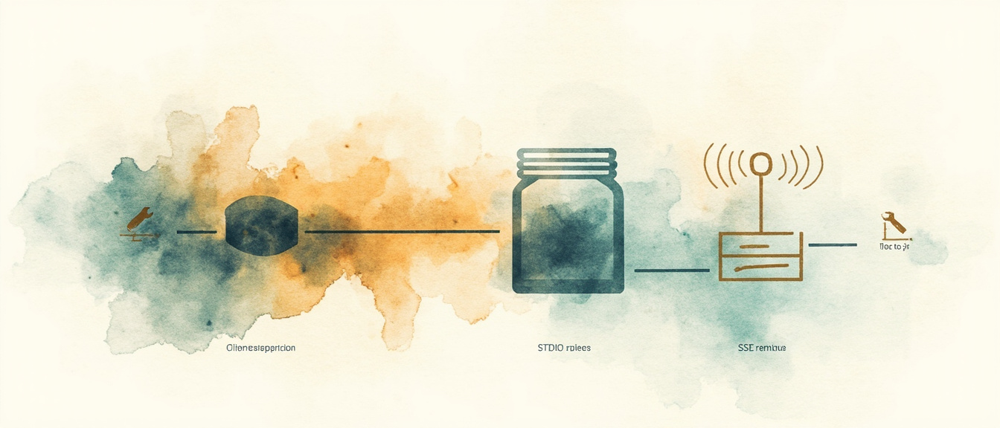
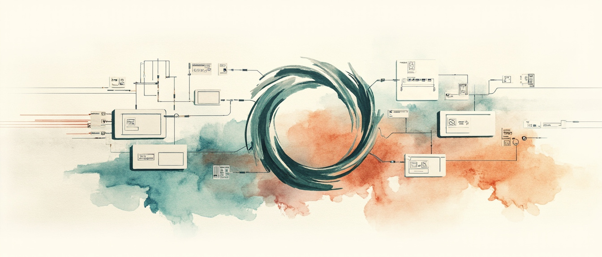
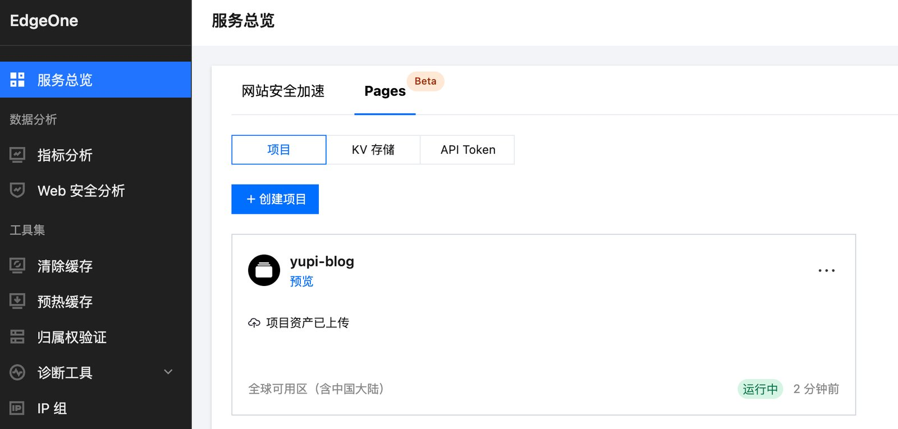

> 本页为「Vibe 学习与实战导航」6 篇的合订本；原文章链接会自动跳转到本页。

## 自学别瞎逛：编程导航那一栏怎么翻

「40 编程学习」更像编程导航的随身目录：路线、百科、资源、面试简历、技术栈速查，外加 FDE / MCP / 团队规范。和「02 学习路线」那篇入门地图互补——那边讲 Vibe 六阶段，这边讲**传统编程 + AI 时代求职**怎么铺。

[系列总览 · 鱼皮 AI 导航](https://ai.codefather.cn/vibe) · [GitHub · 40 编程学习](https://github.com/liyupi/ai-guide/tree/main/Vibe%20Coding%20%E9%9B%B6%E5%9F%BA%E7%A1%80%E6%95%99%E7%A8%8B/40%20%E7%BC%96%E7%A8%8B%E5%AD%A6%E4%B9%A0) · [编程导航 learn](https://www.codefather.cn/learn)

## 你卡在哪就跳哪

| 你想 | 建议 |
|---|---|
| 选方向、要 PDF 路线 | **01 编程学习路线** → codefather.cn/learn |
| 补基础名词 | 02 百科 · 11 工具大全 · 技术栈速查 |
| 找工作 | 06 面试题 · 07 简历 · 08 刷题 · 09/10 工作与成长 |
| 写 MCP | 本站已有 [MCP 薄笔记](/posts/vibe-mcp-index/)，本章只挂入口 |
| 搞清新岗位 FDE | 「前线部署工程师」专文 |

## 板块速查表

| 文 | 带走什么 | 原文 |
|---|---|---|
| 01 编程学习路线 | 100+ 条路线入口，可下 PDF | [GitHub](https://github.com/liyupi/ai-guide/blob/main/Vibe%20Coding%20%E9%9B%B6%E5%9F%BA%E7%A1%80%E6%95%99%E7%A8%8B/40%20%E7%BC%96%E7%A8%8B%E5%AD%A6%E4%B9%A0/01%20%E7%BC%96%E7%A8%8B%E5%AD%A6%E4%B9%A0%E8%B7%AF%E7%BA%BF.md) |
| 02 编程知识百科 | 名词与结构扫盲 | [GitHub](https://github.com/liyupi/ai-guide/blob/main/Vibe%20Coding%20%E9%9B%B6%E5%9F%BA%E7%A1%80%E6%95%99%E7%A8%8B/40%20%E7%BC%96%E7%A8%8B%E5%AD%A6%E4%B9%A0/02%20%E7%BC%96%E7%A8%8B%E7%9F%A5%E8%AF%86%E7%99%BE%E7%A7%91.md) |
| 03 编程资源大全 | 导航 / 面试鸭 / 老鱼简历等入口 | [GitHub](https://github.com/liyupi/ai-guide/blob/main/Vibe%20Coding%20%E9%9B%B6%E5%9F%BA%E7%A1%80%E6%95%99%E7%A8%8B/40%20%E7%BC%96%E7%A8%8B%E5%AD%A6%E4%B9%A0/03%20%E7%BC%96%E7%A8%8B%E8%B5%84%E6%BA%90%E5%A4%A7%E5%85%A8.md) |
| 04 AI 编程技术 | 企业 AI 业务技术位（含 MCP 定位段） | [GitHub](https://github.com/liyupi/ai-guide/blob/main/Vibe%20Coding%20%E9%9B%B6%E5%9F%BA%E7%A1%80%E6%95%99%E7%A8%8B/40%20%E7%BC%96%E7%A8%8B%E5%AD%A6%E4%B9%A0/04%20AI%20%E7%BC%96%E7%A8%8B%E6%8A%80%E6%9C%AF.md) |
| 05 AI 绘图指南 | 配图 / 提示词向 | [GitHub](https://github.com/liyupi/ai-guide/blob/main/Vibe%20Coding%20%E9%9B%B6%E5%9F%BA%E7%A1%80%E6%95%99%E7%A8%8B/40%20%E7%BC%96%E7%A8%8B%E5%AD%A6%E4%B9%A0/05%20AI%20%E7%BB%98%E5%9B%BE%E6%8C%87%E5%8D%97.md) |
| 06 AI 应用开发面试题 | 面试向题库 | [GitHub](https://github.com/liyupi/ai-guide/blob/main/Vibe%20Coding%20%E9%9B%B6%E5%9F%BA%E7%A1%80%E6%95%99%E7%A8%8B/40%20%E7%BC%96%E7%A8%8B%E5%AD%A6%E4%B9%A0/06%20AI%20%E5%BA%94%E7%94%A8%E5%BC%80%E5%8F%91%E9%9D%A2%E8%AF%95%E9%A2%98.md) |
| 07 程序员简历模板 | 模板与写法 | [GitHub](https://github.com/liyupi/ai-guide/blob/main/Vibe%20Coding%20%E9%9B%B6%E5%9F%BA%E7%A1%80%E6%95%99%E7%A8%8B/40%20%E7%BC%96%E7%A8%8B%E5%AD%A6%E4%B9%A0/07%20%E7%A8%8B%E5%BA%8F%E5%91%98%E7%AE%80%E5%8E%86%E6%A8%A1%E6%9D%BF.md) |
| 08 程序员面试刷题 | 刷题站与方法 | [GitHub](https://github.com/liyupi/ai-guide/blob/main/Vibe%20Coding%20%E9%9B%B6%E5%9F%BA%E7%A1%80%E6%95%99%E7%A8%8B/40%20%E7%BC%96%E7%A8%8B%E5%AD%A6%E4%B9%A0/08%20%E7%A8%8B%E5%BA%8F%E5%91%98%E9%9D%A2%E8%AF%95%E5%88%B7%E9%A2%98.md) |
| 09 程序员工作技巧 | 日常协作与提效 | [GitHub](https://github.com/liyupi/ai-guide/blob/main/Vibe%20Coding%20%E9%9B%B6%E5%9F%BA%E7%A1%80%E6%95%99%E7%A8%8B/40%20%E7%BC%96%E7%A8%8B%E5%AD%A6%E4%B9%A0/09%20%E7%A8%8B%E5%BA%8F%E5%91%98%E5%B7%A5%E4%BD%9C%E6%8A%80%E5%B7%A7.md) |
| 10 程序员成长大法 | 长期成长观 | [GitHub](https://github.com/liyupi/ai-guide/blob/main/Vibe%20Coding%20%E9%9B%B6%E5%9F%BA%E7%A1%80%E6%95%99%E7%A8%8B/40%20%E7%BC%96%E7%A8%8B%E5%AD%A6%E4%B9%A0/10%20%E7%A8%8B%E5%BA%8F%E5%91%98%E6%88%90%E9%95%BF%E5%A4%A7%E6%B3%95.md) |
| 11 编程工具大全 | 通用工具清单（与 10 工具栏交叉） | [GitHub](https://github.com/liyupi/ai-guide/blob/main/Vibe%20Coding%20%E9%9B%B6%E5%9F%BA%E7%A1%80%E6%95%99%E7%A8%8B/40%20%E7%BC%96%E7%A8%8B%E5%AD%A6%E4%B9%A0/11%20%E7%BC%96%E7%A8%8B%E5%B7%A5%E5%85%B7%E5%A4%A7%E5%85%A8.md) |
| AI 编程技术栈速查 | JS/TS/Python/React/Next/Spring… 卡片式 | [GitHub](https://github.com/liyupi/ai-guide/blob/main/Vibe%20Coding%20%E9%9B%B6%E5%9F%BA%E7%A1%80%E6%95%99%E7%A8%8B/40%20%E7%BC%96%E7%A8%8B%E5%AD%A6%E4%B9%A0/AI%20%E7%BC%96%E7%A8%8B%E6%8A%80%E6%9C%AF%E6%A0%88%E9%80%9F%E6%9F%A5.md) |
| AI 时代程序员必须做的 20 件事 | 行动清单 | [GitHub](https://github.com/liyupi/ai-guide/blob/main/Vibe%20Coding%20%E9%9B%B6%E5%9F%BA%E7%A1%80%E6%95%99%E7%A8%8B/40%20%E7%BC%96%E7%A8%8B%E5%AD%A6%E4%B9%A0/AI%20%E6%97%B6%E4%BB%A3%E7%A8%8B%E5%BA%8F%E5%91%98%E5%BF%85%E9%A1%BB%E5%81%9A%E7%9A%84%2020%20%E4%BB%B6%E4%BA%8B.md) |
| AI 时代新岗位 FDE | 前线部署工程师闭环 | [GitHub](https://github.com/liyupi/ai-guide/blob/main/Vibe%20Coding%20%E9%9B%B6%E5%9F%BA%E7%A1%80%E6%95%99%E7%A8%8B/40%20%E7%BC%96%E7%A8%8B%E5%AD%A6%E4%B9%A0/AI%20%E6%97%B6%E4%BB%A3%E6%96%B0%E5%B2%97%E4%BD%8D%20FDE%20%E5%89%8D%E7%BA%BF%E9%83%A8%E7%BD%B2%E5%B7%A5%E7%A8%8B%E5%B8%88.md) |
| MCP 服务开发 | → [本站 MCP 薄笔记](/posts/vibe-mcp-index/) | [GitHub](https://github.com/liyupi/ai-guide/blob/main/Vibe%20Coding%20%E9%9B%B6%E5%9F%BA%E7%A1%80%E6%95%99%E7%A8%8B/40%20%E7%BC%96%E7%A8%8B%E5%AD%A6%E4%B9%A0/MCP%20%E6%9C%8D%E5%8A%A1%E5%BC%80%E5%8F%91.md) |
| 团队研发规范 | 协作与规范底线 | [GitHub](https://github.com/liyupi/ai-guide/blob/main/Vibe%20Coding%20%E9%9B%B6%E5%9F%BA%E7%A1%80%E6%95%99%E7%A8%8B/40%20%E7%BC%96%E7%A8%8B%E5%AD%A6%E4%B9%A0/%E5%9B%A2%E9%98%9F%E7%A0%94%E5%8F%91%E8%A7%84%E8%8C%83.md) |

## 出处与边界

| 项 | 说明 |
|---|---|
| 原作 | 程序员鱼皮 · [ai-guide](https://github.com/liyupi/ai-guide) · [AI 导航 /vibe](https://ai.codefather.cn/vibe) |
| 本篇 | 16 篇索引；MCP 不重复展开 |
| 未做 | 不镜像全文、不搬路线大图整包 |
| 相关阅读 | [入门坐标](/posts/vibe-basics-index/) · [MCP 薄笔记](/posts/vibe-mcp-index/) · [工具栈三岔](/posts/vibe-coding-tools-index/) · [概念与热文](/posts/vibe-concepts-hotposts-index/) · [合集 鱼皮VibeCoding](/collections/vibe-tutorial-index/) |

## 新模型别跟风订：同题横评怎么扫

AI 模型几周换一拨，鱼皮单独开了「15 模型动态」：不是教材顺序，是**新闻 + 同题实测**。想系统选型先看工具栏的《AI 模型选择指南》（本站 [工具栈三岔](/posts/vibe-coding-tools-index/) 有摘要）；这篇只管「新模型出来了怎么扫」。

[系列总览 · 鱼皮 AI 导航](https://ai.codefather.cn/vibe) · [GitHub · 15 模型动态](https://github.com/liyupi/ai-guide/tree/main/Vibe%20Coding%20%E9%9B%B6%E5%9F%BA%E7%A1%80%E6%95%99%E7%A8%8B/15%20%E6%A8%A1%E5%9E%8B%E5%8A%A8%E6%80%81)

## 你卡在哪就跳哪

| 你想 | 建议 |
|---|---|
| 弄清板块定位 | 先读 **00 导读** |
| 看某家旗舰能不能写项目 | 单模型 7/4 案例实测 |
| 同题谁完成度高 | 三模型 / 四模型横评 |
| 日常该订哪个 | 回 [工具索引 · 01 模型选择](/posts/vibe-coding-tools-index/) |

## 这篇收了哪些测评

| 类型 | 文 | 带走什么 | 原文 |
|---|---|---|---|
| 导读 | 00 模型动态导读 | 单测 vs 横评怎么用；不必按序学 | [GitHub](https://github.com/liyupi/ai-guide/blob/main/Vibe%20Coding%20%E9%9B%B6%E5%9F%BA%E7%A1%80%E6%95%99%E7%A8%8B/15%20%E6%A8%A1%E5%9E%8B%E5%8A%A8%E6%80%81/00%20%E6%A8%A1%E5%9E%8B%E5%8A%A8%E6%80%81%E5%AF%BC%E8%AF%BB.md) |
| 单测 | Claude Opus 5 · 7 项目 | 同一套提示词跑 7 案，看边界 | [GitHub](https://github.com/liyupi/ai-guide/blob/main/Vibe%20Coding%20%E9%9B%B6%E5%9F%BA%E7%A1%80%E6%95%99%E7%A8%8B/15%20%E6%A8%A1%E5%9E%8B%E5%8A%A8%E6%80%81/Claude%20Opus%205%20%E7%BC%96%E7%A8%8B%E8%83%BD%E5%8A%9B%E5%AE%9E%E6%B5%8B%20-%207%20%E4%B8%AA%E9%A1%B9%E7%9B%AE%E6%A1%88%E4%BE%8B.md) |
| 单测 | Kimi K3 · 7 项目 | 与 Opus 5 同题，方便横比 | [GitHub](https://github.com/liyupi/ai-guide/blob/main/Vibe%20Coding%20%E9%9B%B6%E5%9F%BA%E7%A1%80%E6%95%99%E7%A8%8B/15%20%E6%A8%A1%E5%9E%8B%E5%8A%A8%E6%80%81/Kimi%20K3%20%E7%BC%96%E7%A8%8B%E8%83%BD%E5%8A%9B%E5%AE%9E%E6%B5%8B%20-%207%20%E4%B8%AA%E9%A1%B9%E7%9B%AE%E6%A1%88%E4%BE%8B.md) |
| 单测 | 小米 MiMo · 4 项目 | 国产线案例密度稍低，看性价比场景 | [GitHub](https://github.com/liyupi/ai-guide/blob/main/Vibe%20Coding%20%E9%9B%B6%E5%9F%BA%E7%A1%80%E6%95%99%E7%A8%8B/15%20%E6%A8%A1%E5%9E%8B%E5%8A%A8%E6%80%81/%E5%B0%8F%E7%B1%B3%20MiMo%20%E7%BC%96%E7%A8%8B%E8%83%BD%E5%8A%9B%E5%AE%9E%E6%B5%8B%20-%204%20%E4%B8%AA%E9%A1%B9%E7%9B%AE%E6%A1%88%E4%BE%8B.md) |
| 横评 | Claude Fable 5 vs Opus 4.8 / GPT-5.5 | 同提示开项目，比完成度 | [GitHub](https://github.com/liyupi/ai-guide/blob/main/Vibe%20Coding%20%E9%9B%B6%E5%9F%BA%E7%A1%80%E6%95%99%E7%A8%8B/15%20%E6%A8%A1%E5%9E%8B%E5%8A%A8%E6%80%81/Claude%20Fable%205%20%E7%BC%96%E7%A8%8B%E8%83%BD%E5%8A%9B%E5%AE%9E%E6%B5%8B%20-%20%E5%AF%B9%E6%AF%94%20Opus%204.8%20%E5%92%8C%20GPT-5.5.md) |
| 横评 | GPT-5.6 三模型全栈 | Ultra / Max 等卖点 + Cursor 并行实测 | [GitHub](https://github.com/liyupi/ai-guide/blob/main/Vibe%20Coding%20%E9%9B%B6%E5%9F%BA%E7%A1%80%E6%95%99%E7%A8%8B/15%20%E6%A8%A1%E5%9E%8B%E5%8A%A8%E6%80%81/GPT-5.6%20%E4%B8%89%E6%A8%A1%E5%9E%8B%E6%A8%AA%E8%AF%84%20-%20%E5%85%A8%E6%A0%88%E9%A1%B9%E7%9B%AE%E5%AE%9E%E6%B5%8B.md) |
| 横评 | Opus 4.8 四模型全栈 | 过程 / 成品 / 代码质量分栏再综合 | [GitHub](https://github.com/liyupi/ai-guide/blob/main/Vibe%20Coding%20%E9%9B%B6%E5%9F%BA%E7%A1%80%E6%95%99%E7%A8%8B/15%20%E6%A8%A1%E5%9E%8B%E5%8A%A8%E6%80%81/Opus%204.8%20%E5%9B%9B%E6%A8%A1%E5%9E%8B%E6%A8%AA%E8%AF%84%20-%20%E5%85%A8%E6%A0%88%E9%A1%B9%E7%9B%AE%E5%AE%9E%E6%B5%8B.md) |

## 读测评时盯什么

- **同题才可比**：导读强调单测用同一套项目提示词；横评是同一段需求并行开干。
- **排名会过期**：把文当「当时快照」，订阅决策仍看预算 + 场景，别死磕某一篇冠军。
- **和工具栏分工**：这里偏「刚发布测了啥」；长期选型回 10 工具的模型指南。

## 出处与边界

| 项 | 说明 |
|---|---|
| 原作 | 程序员鱼皮 · [ai-guide](https://github.com/liyupi/ai-guide) · [AI 导航 /vibe](https://ai.codefather.cn/vibe) |
| 本篇 | 7 篇索引摘要；不复述打分细节 |
| 未做 | 不镜像全文、不搬 200+ 张实测截图 |
| 相关阅读 | [工具栈三岔](/posts/vibe-coding-tools-index/) · [项目实战](/posts/vibe-projects-index/) · [入门坐标](/posts/vibe-basics-index/) · [合集 鱼皮VibeCoding](/collections/vibe-tutorial-index/) |

## 查词追热点：概念大全与站内热文

基础索引里已经挂了 **60 资源大全** 和 **90 FAQ**（见 [对话即代码：Vibe 入门坐标](/posts/vibe-basics-index/)），这里不重复展开。这篇补两块：**70 概念大全**（+ 65 视频课入口）和 **站内热文导读**——适合查词、看风向、找「为什么这套教程火了」。

[系列总览 · 鱼皮 AI 导航](https://ai.codefather.cn/vibe) · [GitHub · 教程收尾](https://github.com/liyupi/ai-guide/tree/main/Vibe%20Coding%20%E9%9B%B6%E5%9F%BA%E7%A1%80%E6%95%99%E7%A8%8B)

## 和 basics 怎么分工

| 内容 | 去哪读 |
|---|---|
| 60 资源大全 · 90 FAQ | [vibe-basics-index](/posts/vibe-basics-index/) |
| 70 概念词典 · 65 视频课 | **本篇** |
| 站内爆款 / 模式辨析热文 | **本篇** |

## 70 概念大全

词典型，卡住某个词就翻；不必通读。

| 文 | 带走什么 | 原文 |
|---|---|---|
| 00 Vibe Coding 概念大全 | AI 基础 / 提示词 / 编程模式 / 上下文 / 输出 / 工具 / 项目管理 / 前后端 分区词条 | [GitHub](https://github.com/liyupi/ai-guide/blob/main/Vibe%20Coding%20%E9%9B%B6%E5%9F%BA%E7%A1%80%E6%95%99%E7%A8%8B/70%20AI%20%E7%BC%96%E7%A8%8B%E6%A6%82%E5%BF%B5%E5%A4%A7%E5%85%A8/00%20Vibe%20Coding%20%E6%A6%82%E5%BF%B5%E5%A4%A7%E5%85%A8.md) |
| AI 大模型原理入门 | 原理薄入口 | [GitHub](https://github.com/liyupi/ai-guide/blob/main/Vibe%20Coding%20%E9%9B%B6%E5%9F%BA%E7%A1%80%E6%95%99%E7%A8%8B/70%20AI%20%E7%BC%96%E7%A8%8B%E6%A6%82%E5%BF%B5%E5%A4%A7%E5%85%A8/AI%20%E5%A4%A7%E6%A8%A1%E5%9E%8B%E5%8E%9F%E7%90%86%E5%85%A5%E9%97%A8.md) |
| 主流 AI 应用开发模式 | 模式对照（和热文「6 种模式」互补） | [GitHub](https://github.com/liyupi/ai-guide/blob/main/Vibe%20Coding%20%E9%9B%B6%E5%9F%BA%E7%A1%80%E6%95%99%E7%A8%8B/70%20AI%20%E7%BC%96%E7%A8%8B%E6%A6%82%E5%BF%B5%E5%A4%A7%E5%85%A8/%E4%B8%BB%E6%B5%81%20AI%20%E5%BA%94%E7%94%A8%E5%BC%80%E5%8F%91%E6%A8%A1%E5%BC%8F.md) |
| AI 动态工作流详解 | 动态工作流概念 | [GitHub](https://github.com/liyupi/ai-guide/blob/main/Vibe%20Coding%20%E9%9B%B6%E5%9F%BA%E7%A1%80%E6%95%99%E7%A8%8B/70%20AI%20%E7%BC%96%E7%A8%8B%E6%A6%82%E5%BF%B5%E5%A4%A7%E5%85%A8/AI%20%E5%8A%A8%E6%80%81%E5%B7%A5%E4%BD%9C%E6%B5%81%E8%AF%A6%E8%A7%A3.md) |

## 65 视频课入口

跟做视频 + 源码路线时看；文字索引仍以 GitHub / AI 导航为准。

[原文 · 65 鱼皮的 AI 编程实战视频课](https://github.com/liyupi/ai-guide/blob/main/Vibe%20Coding%20%E9%9B%B6%E5%9F%BA%E7%A1%80%E6%95%99%E7%A8%8B/65%20%E9%B1%BC%E7%9A%AE%E7%9A%84%20AI%20%E7%BC%96%E7%A8%8B%E5%AE%9E%E6%88%98%E8%A7%86%E9%A2%91%E8%AF%BE.md)

## 站内热文导读（精选）

下列优先鱼皮本人 + 高讨论向；社区帖当对照样本，不逐篇摘要。

### 必看风向

| 题 | 为什么点 | 链 |
|---|---|---|
| 我的免费 Vibe Coding 教程，爆了！ | 系列缘起与传播 | [ai.codefather.cn](https://ai.codefather.cn/post/2011284517213483010) |
| 别再说 AI 编程就是 Vibe Coding 了！6 种主流模式一次讲清 | 名词消歧，和 70「开发模式」互补 | [codefather.cn](https://www.codefather.cn/post/2044278935100878850) |
| 130 篇保姆级 AI 编程实战教程，全部免费开源 | 体量与开源承诺 | [ai.codefather.cn](https://ai.codefather.cn/post/2077317562110099457) |

### 鱼皮相关续读

| 题 | 链 |
|---|---|
| 26 年最新 AI 编程学习路线一条龙 | [post/2069253647249719298](https://ai.codefather.cn/post/2069253647249719298) |
| VSCode + Copilot 保姆级实战 | [post/2033395228798443522](https://ai.codefather.cn/post/2033395228798443522) |
| 20 个神级 AI 编程扩展 | [post/2013449096026767361](https://ai.codefather.cn/post/2013449096026767361) |
| 女友怒骂国内不能用 Claude Code… | [post/2004031022055895042](https://ai.codefather.cn/post/2004031022055895042) |
| 揭秘 GitHub 最火开源 Skills 仓库 | [post/2079758116253122561](https://ai.codefather.cn/post/2079758116253122561) |

### 社区对照（点题即可）

执行力、小程序复盘、面试生存、长期维护、会不会淘汰初级……多在 `codefather` / `ai.codefather` 搜标题即可。

## 出处与边界

| 项 | 说明 |
|---|---|
| 原作 | 程序员鱼皮 · [ai-guide](https://github.com/liyupi/ai-guide) · 站内帖另注域名 |
| 本篇 | 概念 + 热文导读；**不重做 60/90** |
| 未做 | 不镜像概念大全全文、不搬 500+ 热文图 |
| 相关阅读 | [入门坐标](/posts/vibe-basics-index/) · [编程学习](/posts/vibe-learning-index/) · [项目实战](/posts/vibe-projects-index/) · [合集 鱼皮VibeCoding](/collections/vibe-tutorial-index/) |

## MCP 薄笔记：协议与业务位

鱼皮 [Vibe Coding 教程](https://ai.codefather.cn/vibe) 的「40 编程学习 / 进阶」目录里文件不少，但 **和 MCP 强相关的正文很薄**：Dedicated 专稿就 **《MCP 服务开发》** 一篇，另 **《04 AI 编程技术》** 里有一段 MCP 在 AI 业务里的定位。这篇只做 MCP 切片索引，不 mirror 全文，也不把 06 面试题、简历模板那些灌水进来。

[40 编程学习 · GitHub 目录](https://github.com/liyupi/ai-guide/tree/main/Vibe%20Coding%20%E9%9B%B6%E5%9F%BA%E7%A1%80%E6%95%99%E7%A8%8B/40%20%E7%BC%96%E7%A8%8B%E5%AD%A6%E4%B9%A0) · [Vibe 在线阅读](https://ai.codefather.cn/vibe) · [ai-guide 仓库](https://github.com/liyupi/ai-guide)

## 怎么读这张薄地图

| 你想 | 建议 |
|---|---|
| 从零写 MCP（Java / Spring AI） | 直接读 **MCP 服务开发** |
| 搞清 MCP 在企业 AI 业务里站哪 | **04 AI 编程技术** 的 MCP + ReAct 段 |
| 在 Cursor / Cherry Studio 接 MCP | MCP 服务开发第四节；现成 MCP 清单看 [编程工具索引](/posts/vibe-coding-tools-index/) 的 10 扩展 |
| 面试被问 MCP 八股 | 原文 **06 面试题**，本篇刻意不收 |

40* 里 **没有** 第二篇 MCP 长文；想装 Context7、GitHub MCP、Chrome DevTools MCP 等，材料在 **10 编程工具** 板块，本站已有 [vibe-coding-tools-index](/posts/vibe-coding-tools-index/)。

## MCP 服务开发

鱼皮这篇是 40* 的 MCP 主菜：讲清 Model Context Protocol（Anthropic 开放标准）、客户端—服务器架构，并以 **面试鸭搜题 MCP** 走通服务端 + 客户端。

**STDIO（本地）**：Spring AI `spring-ai-mcp-server-spring-boot-starter`，禁用 Web、`stdio: true`，`@Tool` 暴露业务能力，`ToolCallbackProvider` 注册；客户端用 `mcp-servers-config.json` 拉起 JAR，ChatClient 挂 `defaultTools`。

**SSE（远程）**：`spring-ai-mcp-server-webflux-spring-boot-starter`，独立端口，适合远程部署。

**用起来**：Cherry Studio / Cursor 等填 MCP JSON 即可；成品可提交 [MCP.so](https://mcp.so) 类市场。开源参考：[mcp-mianshiya-server](https://github.com/yuyuanweb/mcp-mianshiya-server)。

[原文 · AI 导航](https://ai.codefather.cn/library/2010991320544776194) · [原文 · GitHub](https://github.com/liyupi/ai-guide/blob/main/Vibe%20Coding%20%E9%9B%B6%E5%9F%BA%E7%A1%80%E6%95%99%E7%A8%8B/40%20%E7%BC%96%E7%A8%8B%E5%AD%A6%E4%B9%A0/MCP%20%E6%9C%8D%E5%8A%A1%E5%BC%80%E5%8F%91.md)

## 04 AI 编程技术（只摘 MCP 相关）

长文讲 Spring AI / LangChain4j、RAG、多模态、ReAct 等；**和 MCP 直接相关的就三块**：

1. **Spring AI 核心能力**列表里含 MCP 支持（接入与开发）。
2. **「MCP 服务」专节**：MCP = 给 AI 用的标准化外部服务；要学「接别人的」和「写自己的」；提到 mcpify.ai 一句话生成 MCP。
3. **ReAct 智能体**：工具调用可走 Function Call 或 **MCP**（检索、文件、终端等）。

这里是概念地图，**不含 Spring 配置细节**——写代码仍回上一节《MCP 服务开发》。

[原文 · AI 导航](https://ai.codefather.cn/library/2010991312495906818) · [原文 · GitHub](https://github.com/liyupi/ai-guide/blob/main/Vibe%20Coding%20%E9%9B%B6%E5%9F%BA%E7%A1%80%E6%95%99%E7%A8%8B/40%20%E7%BC%96%E7%A8%8B%E5%AD%A6%E4%B9%A0/04%20AI%20%E7%BC%96%E7%A8%8B%E6%8A%80%E6%9C%AF.md)

## 收录与排除

### 收录（MCP 强相关）

| 源文件 | 本站摘要 |
|---|---|
| `MCP 服务开发.md` | 架构、STDIO/SSE、Spring AI 实战、Cherry Studio、MCP.so |
| `04 AI 编程技术.md`（MCP 段） | 业务定位、Spring AI 能力、ReAct 与 MCP |

### 排除（40* 同夹，非本切片）

| 源文件 | 排除原因 |
|---|---|
| `06 AI 应用开发面试题.md` | 面试刷题；可能含 MCP 考点，不扩进索引 |
| `01 编程学习路线.md` | 编程导航导流，无 MCP 正文 |
| `02 编程知识百科.md` | 百科系列入口，无 MCP 专节 |
| `03 编程资源大全.md` | 产品导航，无 MCP |
| `05 AI 绘图指南.md` | 绘图，无关 |
| `07`～`11`、番外 | 简历 / 成长 / 工具大全等，无关 |
| `AI 编程技术栈速查.md` | 全文无 MCP 关键词 |

### 范围外（易混淆，不在 40*）

| 位置 | 说明 |
|---|---|
| `10 编程工具/10 优质 AI 编程扩展推荐` | MCP 服务器大清单（Context7、GitHub MCP 等）→ [编程工具索引](/posts/vibe-coding-tools-index/) |
| `20 项目实战` 部分项目 | 实战里会用 MCP，属项目帖非 40 概念 |

## 出处与边界

| 项 | 说明 |
|---|---|
| 原作 | 程序员鱼皮 · [ai-guide](https://github.com/liyupi/ai-guide) · [AI 导航 / Vibe](https://ai.codefather.cn/vibe) |
| 本篇 | **薄索引** + 精炼摘要；步骤与代码以原文为准 |
| 呈现 | 封面 + 模块小长条配图；步骤与代码以原文为准 |
| 对照 | 结构对齐 [OpenClaw 索引](/posts/openclaw-tutorial-index/)，章节数远少于 OpenClaw |
| 相关阅读 | [入门坐标](/posts/vibe-basics-index/) · [工具栈三岔](/posts/vibe-coding-tools-index/) · [对话与回路](/posts/vibe-coding-tips-index/) · [编程学习](/posts/vibe-learning-index/) · [项目实战](/posts/vibe-projects-index/) · [OpenClaw 索引](/posts/openclaw-tutorial-index/) |

## 从想法到上线：Vibe 项目实战地图

鱼皮 Vibe 教程里「20 项目实战」是动手密度最高的一栏：流程 → 各形态项目 → **部署上线** → 灵感库，外加一堆可跟做的原创案例。全搬进博客没意义；这篇只做导航和能带走的判断，步骤与截图回原文。

[系列总览 · 鱼皮 AI 导航](https://ai.codefather.cn/vibe) · [GitHub · 20 项目实战](https://github.com/liyupi/ai-guide/tree/main/Vibe%20Coding%20%E9%9B%B6%E5%9F%BA%E7%A1%80%E6%95%99%E7%A8%8B/20%20%E9%A1%B9%E7%9B%AE%E5%AE%9E%E6%88%98)

## 你卡在哪就跳哪

| 你想 | 建议 |
|---|---|
| 第一次正经做项目 | 00 导读 → **01 开发流程** → 02 个人工具里挑一个做完 |
| 想做带 AI 能力的产品 | 03 AI 应用 → 实用工具案例目录 |
| 全栈 / 小程序 | 04 / 05，做完必看 **06 部署** |
| 本地能跑但不敢上线 | 直接跳 **部署上线专节** |
| 没灵感 | 10 项目灵感大全（约 100 个点子） |
| 企业级 / 简历项目 | 进阶两篇 + 智能体目录里带「进阶」的 |

## 主线目录（00–10）

| 章 | 带走什么 | 原文 |
|---|---|---|
| 00 项目实战导读 | 为什么做项目、四类案例怎么挑、建议学习顺序 | [GitHub](https://github.com/liyupi/ai-guide/blob/main/Vibe%20Coding%20%E9%9B%B6%E5%9F%BA%E7%A1%80%E6%95%99%E7%A8%8B/20%20%E9%A1%B9%E7%9B%AE%E5%AE%9E%E6%88%98/00%20Vibe%20Coding%20%E9%A1%B9%E7%9B%AE%E5%AE%9E%E6%88%98%E5%AF%BC%E8%AF%BB.md) |
| 01 项目开发流程 | Research → PRD → Tech Design → 实现 → 验收的 5 步工作流 | [GitHub](https://github.com/liyupi/ai-guide/blob/main/Vibe%20Coding%20%E9%9B%B6%E5%9F%BA%E7%A1%80%E6%95%99%E7%A8%8B/20%20%E9%A1%B9%E7%9B%AE%E5%AE%9E%E6%88%98/01%20Vibe%20Coding%20%E9%A1%B9%E7%9B%AE%E5%BC%80%E5%8F%91%E6%B5%81%E7%A8%8B.md) |
| 02 个人工具开发 | 作品集、待办、笔记类；新手闭环最短 | [GitHub](https://github.com/liyupi/ai-guide/blob/main/Vibe%20Coding%20%E9%9B%B6%E5%9F%BA%E7%A1%80%E6%95%99%E7%A8%8B/20%20%E9%A1%B9%E7%9B%AE%E5%AE%9E%E6%88%98/02%20Vibe%20Coding%20%E4%B8%AA%E4%BA%BA%E5%B7%A5%E5%85%B7%E5%BC%80%E5%8F%91.md) |
| 03 AI 应用开发 | 聊天 / 写作 / 生图等「接模型」的套路 | [GitHub](https://github.com/liyupi/ai-guide/blob/main/Vibe%20Coding%20%E9%9B%B6%E5%9F%BA%E7%A1%80%E6%95%99%E7%A8%8B/20%20%E9%A1%B9%E7%9B%AE%E5%AE%9E%E6%88%98/03%20Vibe%20Coding%20AI%20%E5%BA%94%E7%94%A8%E5%BC%80%E5%8F%91.md) |
| 04 全栈应用开发 | 博客 / 社区 / 商城：前后端 + 库 | [GitHub](https://github.com/liyupi/ai-guide/blob/main/Vibe%20Coding%20%E9%9B%B6%E5%9F%BA%E7%A1%80%E6%95%99%E7%A8%8B/20%20%E9%A1%B9%E7%9B%AE%E5%AE%9E%E6%88%98/04%20Vibe%20Coding%20%E5%85%A8%E6%A0%88%E5%BA%94%E7%94%A8%E5%BC%80%E5%8F%91.md) |
| 05 小程序开发 | 微信小程序从开发到提审的完整路径 | [GitHub](https://github.com/liyupi/ai-guide/blob/main/Vibe%20Coding%20%E9%9B%B6%E5%9F%BA%E7%A1%80%E6%95%99%E7%A8%8B/20%20%E9%A1%B9%E7%9B%AE%E5%AE%9E%E6%88%98/05%20Vibe%20Coding%20%E5%B0%8F%E7%A8%8B%E5%BA%8F%E5%BC%80%E5%8F%91.md) |
| **06 项目部署上线** | 见下一节专表 | [GitHub](https://github.com/liyupi/ai-guide/blob/main/Vibe%20Coding%20%E9%9B%B6%E5%9F%BA%E7%A1%80%E6%95%99%E7%A8%8B/20%20%E9%A1%B9%E7%9B%AE%E5%AE%9E%E6%88%98/06%20%E9%A1%B9%E7%9B%AE%E9%83%A8%E7%BD%B2%E4%B8%8A%E7%BA%BF%E6%95%99%E7%A8%8B.md) |
| 10 项目灵感大全 | 约 100 个创意池，卡住时翻 | [GitHub](https://github.com/liyupi/ai-guide/blob/main/Vibe%20Coding%20%E9%9B%B6%E5%9F%BA%E7%A1%80%E6%95%99%E7%A8%8B/20%20%E9%A1%B9%E7%9B%AE%E5%AE%9E%E6%88%98/10%20Vibe%20Coding%20%E9%A1%B9%E7%9B%AE%E7%81%B5%E6%84%9F%E5%A4%A7%E5%85%A8.md) |

## 部署上线专节（06）

零代码平台往往一键 Publish；想要自定义域名、全栈或服务器控制权，再读这一章。路径从「AI 帮你发」到「自己控机」。

| 路径 | 适合谁 | 要点 |
|---|---|---|
| AI + EdgeOne Pages MCP | 想体验「提需求 → 上线」最短环 | Cursor 配 **EdgeOne Pages MCP**；先拿 API Token |
| AI + Vercel CLI / Skills | 同样要 AI 代发，偏海外 / Next 栈 | **Vercel CLI** + `deploy-to-vercel` Skills（MCP 可选）；原文有完整走法 |
| Vercel 一键部署（Git） | 前端 / Next 类，默认推荐 | 连仓库推送触发；环境变量单独配 |
| GitHub Pages | 纯静态、文档站 | 免费够用，能力边界清晰 |
| 云服务器 | 要长期跑后端 / 自管运行时 | 阿里云 / 腾讯云等；安全组与进程守护别省 |
| Docker | 环境要可复现、可迁移 | 镜像 → 容器 → 反向代理 |
| AI Agent 应用部署 | 带长时 Agent / 工具链的产品 | 和普通 Web 部署坑不同，单独一节 |
| CDN / 域名 / SSL | 有正式流量后再上 | 可选加速 + 证书 |

[原文 · 06 项目部署上线教程](https://github.com/liyupi/ai-guide/blob/main/Vibe%20Coding%20%E9%9B%B6%E5%9F%BA%E7%A1%80%E6%95%99%E7%A8%8B/20%20%E9%A1%B9%E7%9B%AE%E5%AE%9E%E6%88%98/06%20%E9%A1%B9%E7%9B%AE%E9%83%A8%E7%BD%B2%E4%B8%8A%E7%BA%BF%E6%95%99%E7%A8%8B.md)

## 案例库怎么挑（不逐篇展开）

四类目录 + 进阶，按兴趣跳；工具覆盖 Cursor / Claude Code / Codex / Copilot / TRAE / EdgeOne 等。

| 分类 | 气质 | 举例（链到目录） |
|---|---|---|
| AI 创意应用 | 好玩、上手快 | 人格测试、塔罗、海龟汤、肉鸽游戏、高考预测器… → [目录](https://github.com/liyupi/ai-guide/tree/main/Vibe%20Coding%20%E9%9B%B6%E5%9F%BA%E7%A1%80%E6%95%99%E7%A8%8B/20%20%E9%A1%B9%E7%9B%AE%E5%AE%9E%E6%88%98/AI%20%E5%88%9B%E6%84%8F%E5%BA%94%E7%94%A8) |
| AI 实用工具 | 自己真会用 | 搜索引擎、文档助手、视频总结、热点监控、副业点子验证… → [目录](https://github.com/liyupi/ai-guide/tree/main/Vibe%20Coding%20%E9%9B%B6%E5%9F%BA%E7%A1%80%E6%95%99%E7%A8%8B/20%20%E9%A1%B9%E7%9B%AE%E5%AE%9E%E6%88%98/AI%20%E5%AE%9E%E7%94%A8%E5%B7%A5%E5%85%B7) |
| AI 智能体和平台 | Agent / 多智能体 / 中转站 | 编程助手、超级智能体、零代码生成平台、API 中转… → [目录](https://github.com/liyupi/ai-guide/tree/main/Vibe%20Coding%20%E9%9B%B6%E5%9F%BA%E7%A1%80%E6%95%99%E7%A8%8B/20%20%E9%A1%B9%E7%9B%AE%E5%AE%9E%E6%88%98/AI%20%E6%99%BA%E8%83%BD%E4%BD%93%E5%92%8C%E5%B9%B3%E5%8F%B0) |
| AI 跨端应用 | APP / 小程序 / CLI / 桌面 | 表情包 APP、桌面「装了吗」、学习英雄小程序、CLI 工具… → [目录](https://github.com/liyupi/ai-guide/tree/main/Vibe%20Coding%20%E9%9B%B6%E5%9F%BA%E7%A1%80%E6%95%99%E7%A8%8B/20%20%E9%A1%B9%E7%9B%AE%E5%AE%9E%E6%88%98/AI%20%E8%B7%A8%E7%AB%AF%E5%BA%94%E7%94%A8) |
| 进阶 | 企业流程与大项目 | [企业项目开发流程](https://github.com/liyupi/ai-guide/blob/main/Vibe%20Coding%20%E9%9B%B6%E5%9F%BA%E7%A1%80%E6%95%99%E7%A8%8B/20%20%E9%A1%B9%E7%9B%AE%E5%AE%9E%E6%88%98/%E8%BF%9B%E9%98%B6%20-%20%E4%BC%81%E4%B8%9A%E9%A1%B9%E7%9B%AE%E5%BC%80%E5%8F%91%E6%B5%81%E7%A8%8B.md) · [企业级 AI 编程实战项目](https://github.com/liyupi/ai-guide/blob/main/Vibe%20Coding%20%E9%9B%B6%E5%9F%BA%E7%A1%80%E6%95%99%E7%A8%8B/20%20%E9%A1%B9%E7%9B%AE%E5%AE%9E%E6%88%98/%E8%BF%9B%E9%98%B6%20-%20%E4%BC%81%E4%B8%9A%E7%BA%A7%20AI%20%E7%BC%96%E7%A8%8B%E5%AE%9E%E6%88%98%E9%A1%B9%E7%9B%AE.md) |

## 出处与边界

| 项 | 说明 |
|---|---|
| 原作 | 程序员鱼皮 · [ai-guide](https://github.com/liyupi/ai-guide) · [AI 导航 /vibe](https://ai.codefather.cn/vibe) |
| 本篇 | 索引 + 精炼摘要；**部署专节并入本文**，不另开短帖 |
| 未做 | 不镜像 35 篇全文、不搬运 900+ 张配图 |
| 相关阅读 | [入门坐标](/posts/vibe-basics-index/) · [工具栈三岔](/posts/vibe-coding-tools-index/) · [对话与回路](/posts/vibe-coding-tips-index/) · [模型横评](/posts/vibe-models-index/) · [产品变现](/posts/vibe-monetize-index/) · [合集 鱼皮VibeCoding](/collections/vibe-tutorial-index/) |

## 做出能卖的东西：产品变现导读

项目能跑 ≠ 产品有人用、有人付。鱼皮「50 产品变现」把腾讯 + 创业里的流程压成主线，再挂安全 / 监控 / 涨粉等支线。这篇只做地图；定价表和踩坑截图回原文。

[系列总览 · 鱼皮 AI 导航](https://ai.codefather.cn/vibe) · [GitHub · 50 产品变现](https://github.com/liyupi/ai-guide/tree/main/Vibe%20Coding%20%E9%9B%B6%E5%9F%BA%E7%A1%80%E6%95%99%E7%A8%8B/50%20%E4%BA%A7%E5%93%81%E5%8F%98%E7%8E%B0)

## 你卡在哪就跳哪

| 你想 | 建议 |
|---|---|
| 从 0 建立变现观 | 00 → 01，再按主线往下 |
| 已有作品要卖 | 重点 07 盈利模式 · 08 付费策略 · 09/10 获客 |
| 站刚上线怕被打 | 云安全 · 数据保护 · 监控告警 |
| 开源涨星 / 做号 | GitHub 涨粉 · 自媒体起号 / 运营 |

做完项目再进本栏更顺；实战地图见 [项目实战索引](/posts/vibe-projects-index/)。

## 主线（建议顺序）

| 章 | 带走什么 | 原文 |
|---|---|---|
| 00 产品变现导读 | 板块怎么用、主线 vs 支线 | [GitHub](https://github.com/liyupi/ai-guide/blob/main/Vibe%20Coding%20%E9%9B%B6%E5%9F%BA%E7%A1%80%E6%95%99%E7%A8%8B/50%20%E4%BA%A7%E5%93%81%E5%8F%98%E7%8E%B0/00%20%E4%BA%A7%E5%93%81%E5%8F%98%E7%8E%B0%E5%AF%BC%E8%AF%BB.md) |
| 01 为什么要做产品变现 | 价值检验、别只堆仓库 | [GitHub](https://github.com/liyupi/ai-guide/blob/main/Vibe%20Coding%20%E9%9B%B6%E5%9F%BA%E7%A1%80%E6%95%99%E7%A8%8B/50%20%E4%BA%A7%E5%93%81%E5%8F%98%E7%8E%B0/01%20%E4%B8%BA%E4%BB%80%E4%B9%88%E8%A6%81%E5%81%9A%E4%BA%A7%E5%93%81%E5%8F%98%E7%8E%B0%EF%BC%9F.md) |
| 02 需求分析和产品规划 | 问题 → 方案，少拍脑袋开干 | [GitHub](https://github.com/liyupi/ai-guide/blob/main/Vibe%20Coding%20%E9%9B%B6%E5%9F%BA%E7%A1%80%E6%95%99%E7%A8%8B/50%20%E4%BA%A7%E5%93%81%E5%8F%98%E7%8E%B0/02%20%E9%9C%80%E6%B1%82%E5%88%86%E6%9E%90%E5%92%8C%E4%BA%A7%E5%93%81%E8%A7%84%E5%88%92.md) |
| 03 文档沉淀和知识管理 | 文档当长期记忆，换人也能接 | [GitHub](https://github.com/liyupi/ai-guide/blob/main/Vibe%20Coding%20%E9%9B%B6%E5%9F%BA%E7%A1%80%E6%95%99%E7%A8%8B/50%20%E4%BA%A7%E5%93%81%E5%8F%98%E7%8E%B0/03%20%E6%96%87%E6%A1%A3%E6%B2%89%E6%B7%80%E5%92%8C%E7%9F%A5%E8%AF%86%E7%AE%A1%E7%90%86.md) |
| 04 技术选型实战指南 | 栈怎么选才扛得住迭代 | [GitHub](https://github.com/liyupi/ai-guide/blob/main/Vibe%20Coding%20%E9%9B%B6%E5%9F%BA%E7%A1%80%E6%95%99%E7%A8%8B/50%20%E4%BA%A7%E5%93%81%E5%8F%98%E7%8E%B0/04%20%E6%8A%80%E6%9C%AF%E9%80%89%E5%9E%8B%E5%AE%9E%E6%88%98%E6%8C%87%E5%8D%97.md) |
| 05 系统架构设计实践 | 从能跑到可演进 | [GitHub](https://github.com/liyupi/ai-guide/blob/main/Vibe%20Coding%20%E9%9B%B6%E5%9F%BA%E7%A1%80%E6%95%99%E7%A8%8B/50%20%E4%BA%A7%E5%93%81%E5%8F%98%E7%8E%B0/05%20%E7%B3%BB%E7%BB%9F%E6%9E%B6%E6%9E%84%E8%AE%BE%E8%AE%A1%E5%AE%9E%E8%B7%B5.md) |
| 06 项目研发流程选择 | 个人节奏 vs 团队流程 | [GitHub](https://github.com/liyupi/ai-guide/blob/main/Vibe%20Coding%20%E9%9B%B6%E5%9F%BA%E7%A1%80%E6%95%99%E7%A8%8B/50%20%E4%BA%A7%E5%93%81%E5%8F%98%E7%8E%B0/06%20%E9%A1%B9%E7%9B%AE%E7%A0%94%E5%8F%91%E6%B5%81%E7%A8%8B%E9%80%89%E6%8B%A9.md) |
| 07 产品盈利模式设计 | 钱从哪来 | [GitHub](https://github.com/liyupi/ai-guide/blob/main/Vibe%20Coding%20%E9%9B%B6%E5%9F%BA%E7%A1%80%E6%95%99%E7%A8%8B/50%20%E4%BA%A7%E5%93%81%E5%8F%98%E7%8E%B0/07%20%E4%BA%A7%E5%93%81%E7%9B%88%E5%88%A9%E6%A8%A1%E5%BC%8F%E8%AE%BE%E8%AE%A1.md) |
| 08 产品付费策略设计 | 怎么定价、怎么挡白嫖 | [GitHub](https://github.com/liyupi/ai-guide/blob/main/Vibe%20Coding%20%E9%9B%B6%E5%9F%BA%E7%A1%80%E6%95%99%E7%A8%8B/50%20%E4%BA%A7%E5%93%81%E5%8F%98%E7%8E%B0/08%20%E4%BA%A7%E5%93%81%E4%BB%98%E8%B4%B9%E7%AD%96%E7%95%A5%E8%AE%BE%E8%AE%A1.md) |
| 09 SEO 实战 | 传统搜索获客 | [GitHub](https://github.com/liyupi/ai-guide/blob/main/Vibe%20Coding%20%E9%9B%B6%E5%9F%BA%E7%A1%80%E6%95%99%E7%A8%8B/50%20%E4%BA%A7%E5%93%81%E5%8F%98%E7%8E%B0/09%20SEO%20%E6%90%9C%E7%B4%A2%E5%BC%95%E6%93%8E%E4%BC%98%E5%8C%96%E5%AE%9E%E6%88%98.md) |
| 10 GEO 实战 | 生成式引擎里被引用 / 被推荐 | [GitHub](https://github.com/liyupi/ai-guide/blob/main/Vibe%20Coding%20%E9%9B%B6%E5%9F%BA%E7%A1%80%E6%95%99%E7%A8%8B/50%20%E4%BA%A7%E5%93%81%E5%8F%98%E7%8E%B0/10%20GEO%20%E7%94%9F%E6%88%90%E5%BC%8F%E5%BC%95%E6%93%8E%E4%BC%98%E5%8C%96%E5%AE%9E%E6%88%98.md) |

## 支线（按需跳读）

| 文 | 场景 |
|---|---|
| [云服务安全防护实践](https://github.com/liyupi/ai-guide/blob/main/Vibe%20Coding%20%E9%9B%B6%E5%9F%BA%E7%A1%80%E6%95%99%E7%A8%8B/50%20%E4%BA%A7%E5%93%81%E5%8F%98%E7%8E%B0/%E4%BA%91%E6%9C%8D%E5%8A%A1%E5%AE%89%E5%85%A8%E9%98%B2%E6%8A%A4%E5%AE%9E%E8%B7%B5.md) | 防刷量、密钥与配额血泪 |
| [网站数据保护实践](https://github.com/liyupi/ai-guide/blob/main/Vibe%20Coding%20%E9%9B%B6%E5%9F%BA%E7%A1%80%E6%95%99%E7%A8%8B/50%20%E4%BA%A7%E5%93%81%E5%8F%98%E7%8E%B0/%E7%BD%91%E7%AB%99%E6%95%B0%E6%8D%AE%E4%BF%9D%E6%8A%A4%E5%AE%9E%E8%B7%B5.md) | 反爬与数据护栏 |
| [系统监控告警实践](https://github.com/liyupi/ai-guide/blob/main/Vibe%20Coding%20%E9%9B%B6%E5%9F%BA%E7%A1%80%E6%95%99%E7%A8%8B/50%20%E4%BA%A7%E5%93%81%E5%8F%98%E7%8E%B0/%E7%B3%BB%E7%BB%9F%E7%9B%91%E6%8E%A7%E5%91%8A%E8%AD%A6%E5%AE%9E%E8%B7%B5.md) | 出事能第一时间知道 |
| [网站数据分析实战](https://github.com/liyupi/ai-guide/blob/main/Vibe%20Coding%20%E9%9B%B6%E5%9F%BA%E7%A1%80%E6%95%99%E7%A8%8B/50%20%E4%BA%A7%E5%93%81%E5%8F%98%E7%8E%B0/%E7%BD%91%E7%AB%99%E6%95%B0%E6%8D%AE%E5%88%86%E6%9E%90%E5%AE%9E%E6%88%98.md) | 用数据改产品 |
| [GitHub 涨星涨粉技巧](https://github.com/liyupi/ai-guide/blob/main/Vibe%20Coding%20%E9%9B%B6%E5%9F%BA%E7%A1%80%E6%95%99%E7%A8%8B/50%20%E4%BA%A7%E5%93%81%E5%8F%98%E7%8E%B0/%E6%88%91%E7%9A%84%20GitHub%20%E6%B6%A8%E6%98%9F%E6%B6%A8%E7%B2%89%E6%8A%80%E5%B7%A7.md) | 开源曝光 |
| [个人站长实战经验](https://github.com/liyupi/ai-guide/blob/main/Vibe%20Coding%20%E9%9B%B6%E5%9F%BA%E7%A1%80%E6%95%99%E7%A8%8B/50%20%E4%BA%A7%E5%93%81%E5%8F%98%E7%8E%B0/%E6%88%91%E7%9A%84%E4%B8%AA%E4%BA%BA%E7%AB%99%E9%95%BF%E5%AE%9E%E6%88%98%E7%BB%8F%E9%AA%8C.md) | 多站运营心得 |
| [自媒体起号经验](https://github.com/liyupi/ai-guide/blob/main/Vibe%20Coding%20%E9%9B%B6%E5%9F%BA%E7%A1%80%E6%95%99%E7%A8%8B/50%20%E4%BA%A7%E5%93%81%E5%8F%98%E7%8E%B0/%E6%88%91%E7%9A%84%E8%87%AA%E5%AA%92%E4%BD%93%E8%B5%B7%E5%8F%B7%E7%BB%8F%E9%AA%8C.md) / [涨粉运营之路](https://github.com/liyupi/ai-guide/blob/main/Vibe%20Coding%20%E9%9B%B6%E5%9F%BA%E7%A1%80%E6%95%99%E7%A8%8B/50%20%E4%BA%A7%E5%93%81%E5%8F%98%E7%8E%B0/%E6%88%91%E7%9A%84%E8%87%AA%E5%AA%92%E4%BD%93%E6%B6%A8%E7%B2%89%E8%BF%90%E8%90%A5%E4%B9%8B%E8%B7%AF.md) | 从 0 到百万粉路径（经验向） |

## 出处与边界

| 项 | 说明 |
|---|---|
| 原作 | 程序员鱼皮 · [ai-guide](https://github.com/liyupi/ai-guide) · [AI 导航 /vibe](https://ai.codefather.cn/vibe) |
| 本篇 | 19 篇索引；不复述商业机密级细节 |
| 未做 | 不镜像全文、不搬运营截图整包 |
| 相关阅读 | [项目实战](/posts/vibe-projects-index/) · [编程学习](/posts/vibe-learning-index/) · [对话与回路](/posts/vibe-coding-tips-index/) · [合集 鱼皮VibeCoding](/collections/vibe-tutorial-index/) |
