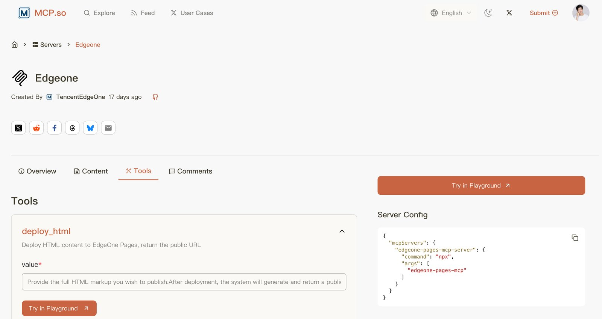

鱼皮 Vibe 教程里「20 项目实战」是动手密度最高的一栏：流程 → 各形态项目 → **部署上线** → 灵感库，外加一堆可跟做的原创案例。全搬进博客没意义；这篇只做导航和能带走的判断，步骤与截图回原文。

[系列总览 · 鱼皮 AI 导航](https://ai.codefather.cn/vibe) · [GitHub · 20 项目实战](https://github.com/liyupi/ai-guide/tree/main/Vibe%20Coding%20%E9%9B%B6%E5%9F%BA%E7%A1%80%E6%95%99%E7%A8%8B/20%20%E9%A1%B9%E7%9B%AE%E5%AE%9E%E6%88%98)

## 你卡在哪就跳哪

| 你想 | 建议 |
|---|---|
| 第一次正经做项目 | 00 导读 → **01 开发流程** → 02 个人工具里挑一个做完 |
| 想做带 AI 能力的产品 | 03 AI 应用 → 实用工具案例目录 |
| 全栈 / 小程序 | 04 / 05，做完必看 **06 部署** |
| 本地能跑但不敢上线 | 直接跳 **部署上线专节** |
| 没灵感 | 10 项目灵感大全（约 100 个点子） |
| 企业级 / 简历项目 | 进阶两篇 + 智能体目录里带「进阶」的 |

## 主线目录（00–10）

| 章 | 带走什么 | 原文 |
|---|---|---|
| 00 项目实战导读 | 为什么做项目、四类案例怎么挑、建议学习顺序 | [GitHub](https://github.com/liyupi/ai-guide/blob/main/Vibe%20Coding%20%E9%9B%B6%E5%9F%BA%E7%A1%80%E6%95%99%E7%A8%8B/20%20%E9%A1%B9%E7%9B%AE%E5%AE%9E%E6%88%98/00%20Vibe%20Coding%20%E9%A1%B9%E7%9B%AE%E5%AE%9E%E6%88%98%E5%AF%BC%E8%AF%BB.md) |
| 01 项目开发流程 | Research → PRD → Tech Design → 实现 → 验收的 5 步工作流 | [GitHub](https://github.com/liyupi/ai-guide/blob/main/Vibe%20Coding%20%E9%9B%B6%E5%9F%BA%E7%A1%80%E6%95%99%E7%A8%8B/20%20%E9%A1%B9%E7%9B%AE%E5%AE%9E%E6%88%98/01%20Vibe%20Coding%20%E9%A1%B9%E7%9B%AE%E5%BC%80%E5%8F%91%E6%B5%81%E7%A8%8B.md) |
| 02 个人工具开发 | 作品集、待办、笔记类；新手闭环最短 | [GitHub](https://github.com/liyupi/ai-guide/blob/main/Vibe%20Coding%20%E9%9B%B6%E5%9F%BA%E7%A1%80%E6%95%99%E7%A8%8B/20%20%E9%A1%B9%E7%9B%AE%E5%AE%9E%E6%88%98/02%20Vibe%20Coding%20%E4%B8%AA%E4%BA%BA%E5%B7%A5%E5%85%B7%E5%BC%80%E5%8F%91.md) |
| 03 AI 应用开发 | 聊天 / 写作 / 生图等「接模型」的套路 | [GitHub](https://github.com/liyupi/ai-guide/blob/main/Vibe%20Coding%20%E9%9B%B6%E5%9F%BA%E7%A1%80%E6%95%99%E7%A8%8B/20%20%E9%A1%B9%E7%9B%AE%E5%AE%9E%E6%88%98/03%20Vibe%20Coding%20AI%20%E5%BA%94%E7%94%A8%E5%BC%80%E5%8F%91.md) |
| 04 全栈应用开发 | 博客 / 社区 / 商城：前后端 + 库 | [GitHub](https://github.com/liyupi/ai-guide/blob/main/Vibe%20Coding%20%E9%9B%B6%E5%9F%BA%E7%A1%80%E6%95%99%E7%A8%8B/20%20%E9%A1%B9%E7%9B%AE%E5%AE%9E%E6%88%98/04%20Vibe%20Coding%20%E5%85%A8%E6%A0%88%E5%BA%94%E7%94%A8%E5%BC%80%E5%8F%91.md) |
| 05 小程序开发 | 微信小程序从开发到提审的完整路径 | [GitHub](https://github.com/liyupi/ai-guide/blob/main/Vibe%20Coding%20%E9%9B%B6%E5%9F%BA%E7%A1%80%E6%95%99%E7%A8%8B/20%20%E9%A1%B9%E7%9B%AE%E5%AE%9E%E6%88%98/05%20Vibe%20Coding%20%E5%B0%8F%E7%A8%8B%E5%BA%8F%E5%BC%80%E5%8F%91.md) |
| **06 项目部署上线** | 见下一节专表 | [GitHub](https://github.com/liyupi/ai-guide/blob/main/Vibe%20Coding%20%E9%9B%B6%E5%9F%BA%E7%A1%80%E6%95%99%E7%A8%8B/20%20%E9%A1%B9%E7%9B%AE%E5%AE%9E%E6%88%98/06%20%E9%A1%B9%E7%9B%AE%E9%83%A8%E7%BD%B2%E4%B8%8A%E7%BA%BF%E6%95%99%E7%A8%8B.md) |
| 10 项目灵感大全 | 约 100 个创意池，卡住时翻 | [GitHub](https://github.com/liyupi/ai-guide/blob/main/Vibe%20Coding%20%E9%9B%B6%E5%9F%BA%E7%A1%80%E6%95%99%E7%A8%8B/20%20%E9%A1%B9%E7%9B%AE%E5%AE%9E%E6%88%98/10%20Vibe%20Coding%20%E9%A1%B9%E7%9B%AE%E7%81%B5%E6%84%9F%E5%A4%A7%E5%85%A8.md) |

## 部署上线专节（06）

零代码平台往往一键 Publish；想要自定义域名、全栈或服务器控制权，再读这一章。路径从「AI 帮你发」到「自己控机」。

| 路径 | 适合谁 | 要点 |
|---|---|---|
| AI + EdgeOne Pages MCP | 想体验「提需求 → 上线」最短环 | Cursor 配 **EdgeOne Pages MCP**；先拿 API Token |
| AI + Vercel CLI / Skills | 同样要 AI 代发，偏海外 / Next 栈 | **Vercel CLI** + `deploy-to-vercel` Skills（MCP 可选）；原文有完整走法 |
| Vercel 一键部署（Git） | 前端 / Next 类，默认推荐 | 连仓库推送触发；环境变量单独配 |
| GitHub Pages | 纯静态、文档站 | 免费够用，能力边界清晰 |
| 云服务器 | 要长期跑后端 / 自管运行时 | 阿里云 / 腾讯云等；安全组与进程守护别省 |
| Docker | 环境要可复现、可迁移 | 镜像 → 容器 → 反向代理 |
| AI Agent 应用部署 | 带长时 Agent / 工具链的产品 | 和普通 Web 部署坑不同，单独一节 |
| CDN / 域名 / SSL | 有正式流量后再上 | 可选加速 + 证书 |

[原文 · 06 项目部署上线教程](https://github.com/liyupi/ai-guide/blob/main/Vibe%20Coding%20%E9%9B%B6%E5%9F%BA%E7%A1%80%E6%95%99%E7%A8%8B/20%20%E9%A1%B9%E7%9B%AE%E5%AE%9E%E6%88%98/06%20%E9%A1%B9%E7%9B%AE%E9%83%A8%E7%BD%B2%E4%B8%8A%E7%BA%BF%E6%95%99%E7%A8%8B.md)

## 案例库怎么挑（不逐篇展开）

四类目录 + 进阶，按兴趣跳；工具覆盖 Cursor / Claude Code / Codex / Copilot / TRAE / EdgeOne 等。

| 分类 | 气质 | 举例（链到目录） |
|---|---|---|
| AI 创意应用 | 好玩、上手快 | 人格测试、塔罗、海龟汤、肉鸽游戏、高考预测器… → [目录](https://github.com/liyupi/ai-guide/tree/main/Vibe%20Coding%20%E9%9B%B6%E5%9F%BA%E7%A1%80%E6%95%99%E7%A8%8B/20%20%E9%A1%B9%E7%9B%AE%E5%AE%9E%E6%88%98/AI%20%E5%88%9B%E6%84%8F%E5%BA%94%E7%94%A8) |
| AI 实用工具 | 自己真会用 | 搜索引擎、文档助手、视频总结、热点监控、副业点子验证… → [目录](https://github.com/liyupi/ai-guide/tree/main/Vibe%20Coding%20%E9%9B%B6%E5%9F%BA%E7%A1%80%E6%95%99%E7%A8%8B/20%20%E9%A1%B9%E7%9B%AE%E5%AE%9E%E6%88%98/AI%20%E5%AE%9E%E7%94%A8%E5%B7%A5%E5%85%B7) |
| AI 智能体和平台 | Agent / 多智能体 / 中转站 | 编程助手、超级智能体、零代码生成平台、API 中转… → [目录](https://github.com/liyupi/ai-guide/tree/main/Vibe%20Coding%20%E9%9B%B6%E5%9F%BA%E7%A1%80%E6%95%99%E7%A8%8B/20%20%E9%A1%B9%E7%9B%AE%E5%AE%9E%E6%88%98/AI%20%E6%99%BA%E8%83%BD%E4%BD%93%E5%92%8C%E5%B9%B3%E5%8F%B0) |
| AI 跨端应用 | APP / 小程序 / CLI / 桌面 | 表情包 APP、桌面「装了吗」、学习英雄小程序、CLI 工具… → [目录](https://github.com/liyupi/ai-guide/tree/main/Vibe%20Coding%20%E9%9B%B6%E5%9F%BA%E7%A1%80%E6%95%99%E7%A8%8B/20%20%E9%A1%B9%E7%9B%AE%E5%AE%9E%E6%88%98/AI%20%E8%B7%A8%E7%AB%AF%E5%BA%94%E7%94%A8) |
| 进阶 | 企业流程与大项目 | [企业项目开发流程](https://github.com/liyupi/ai-guide/blob/main/Vibe%20Coding%20%E9%9B%B6%E5%9F%BA%E7%A1%80%E6%95%99%E7%A8%8B/20%20%E9%A1%B9%E7%9B%AE%E5%AE%9E%E6%88%98/%E8%BF%9B%E9%98%B6%20-%20%E4%BC%81%E4%B8%9A%E9%A1%B9%E7%9B%AE%E5%BC%80%E5%8F%91%E6%B5%81%E7%A8%8B.md) · [企业级 AI 编程实战项目](https://github.com/liyupi/ai-guide/blob/main/Vibe%20Coding%20%E9%9B%B6%E5%9F%BA%E7%A1%80%E6%95%99%E7%A8%8B/20%20%E9%A1%B9%E7%9B%AE%E5%AE%9E%E6%88%98/%E8%BF%9B%E9%98%B6%20-%20%E4%BC%81%E4%B8%9A%E7%BA%A7%20AI%20%E7%BC%96%E7%A8%8B%E5%AE%9E%E6%88%98%E9%A1%B9%E7%9B%AE.md) |

## 出处与边界

| 项 | 说明 |
|---|---|
| 原作 | 程序员鱼皮 · [ai-guide](https://github.com/liyupi/ai-guide) · [AI 导航 /vibe](https://ai.codefather.cn/vibe) |
| 本篇 | 索引 + 精炼摘要；**部署专节并入本文**，不另开短帖 |
| 未做 | 不镜像 35 篇全文、不搬运 900+ 张配图 |
| 相关阅读 | [入门坐标](/posts/vibe-basics-index/) · [工具栈三岔](/posts/vibe-coding-tools-index/) · [对话与回路](/posts/vibe-coding-tips-index/) · [模型横评](/posts/vibe-models-index/) · [产品变现](/posts/vibe-monetize-index/) · [合集 鱼皮VibeCoding](/collections/vibe-tutorial-index/) |
