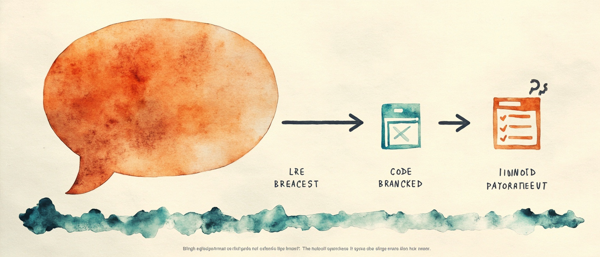

> 本页为「Vibe 入门坐标与工具栈」3 篇的合订本；原文章链接会自动跳转到本页。

## 对话即代码：Vibe 入门坐标

鱼皮那套 Vibe Coding 教程很长，全搬进博客没意义。这篇只覆盖**基础必读**（00 / 01 / 02）和同级薄入口（60 资源大全、90 常见问题）：按他的目录立标题、每章给能带走的摘要、原文挂回 AI 导航 / 开源仓。细节去原文；这里当索引和导航。

[系列总览 · 鱼皮 AI 导航](https://ai.codefather.cn/vibe) · [GitHub · liyupi/ai-guide](https://github.com/liyupi/ai-guide)

## 怎么读这篇

| 你想 | 建议 |
|---|---|
| 第一次碰 Vibe Coding | 00 → 01，当天做出第一个网页 |
| 想规划学习路径 | 02 六阶段路线图，对照自己缺哪块 |
| 找工具 / 模板 / 资讯 | 60 鱼皮 AI 导航导读 |
| 卡在某个具体问题 | 90 FAQ 速查，没有再社区问 |

摘要基于公开正文提炼，不是逐字搬运。配图为章节小长条信息图，点击可进原文；操作步骤以原文为准。

## 00 Vibe Coding 简介

Vibe Coding = 用人话和 AI 聊天写代码：你负责「要做什么」，AI 负责「怎么做」，多轮迭代。和传统编程比，核心从背语法变成讲需求；几天能上手，但大项目仍有 UI 同质化、代码不可控等坑。三个常见误解：不是作弊、不会不学、不只玩具。

[原文 · 00 Vibe Coding 简介](https://ai.codefather.cn/library/2010974735415316482) · [GitHub](https://github.com/liyupi/ai-guide/blob/main/Vibe%20Coding%20%E9%9B%B6%E5%9F%BA%E7%A1%80%E6%95%99%E7%A8%8B/00%20Vibe%20Coding%20%E7%AE%80%E4%BB%8B.md)

## 01 快速上手 Vibe Coding

10 分钟做出待办类网页并 Publish 上线。准备浏览器 + Bolt.new（国内可换 NoCode / 秒哒）+ GitHub；写清功能/界面需求 → 多轮微调 → 测功能 → 一键发布。对话要点：需求具体、一次别改太多、bug 描述现象。跑通后再进工具/实战板块。

[原文 · 01 快速上手](https://ai.codefather.cn/library/2010974736249982977) · [GitHub](https://github.com/liyupi/ai-guide/blob/main/Vibe%20Coding%20%E9%9B%B6%E5%9F%BA%E7%A1%80%E6%95%99%E7%A8%8B/01%20%E5%BF%AB%E9%80%9F%E4%B8%8A%E6%89%8B%20Vibe%20Coding.md)

## 02 AI 编程学习路线

六阶段地图：入门（概念 + 零代码出作品）→ 工具（Cursor / Codex / Claude Code）→ 核心技能（需求、提示词、上下文、Git、部署）→ 实战（小工具 → 全栈 → AI 应用）→ 进阶（失败模式、成本、变现）→ 持续学习。小工具够用前两段；系统掌握约 2～3 个月。

[原文 · 02 学习路线](https://ai.codefather.cn/library/2062514924696948738) · [GitHub](https://github.com/liyupi/ai-guide/blob/main/Vibe%20Coding%20%E9%9B%B6%E5%9F%BA%E7%A1%80%E6%95%99%E7%A8%8B/02%20AI%20%E7%BC%96%E7%A8%8B%E5%AD%A6%E4%B9%A0%E8%B7%AF%E7%BA%BF.md)

## 60 Vibe Coding 资源大全

鱼皮 AI 导航（ai.codefather.cn）导读：上千 AI 工具、Vibe/OpenClaw 教程库、提示词模板、MCP+Skills、热点资讯、交流社区。找资源的一站式入口；资源再多也要动手做。

[原文 · 60 资源大全](https://ai.codefather.cn/library/2010974737051095041) · [GitHub](https://github.com/liyupi/ai-guide/blob/main/Vibe%20Coding%20%E9%9B%B6%E5%9F%BA%E7%A1%80%E6%95%99%E7%A8%8B/60%20Vibe%20Coding%20%E8%B5%84%E6%BA%90%E5%A4%A7%E5%85%A8.md)

## 90 Vibe Coding 常见问题和解决

FAQ 速查：概念（和传统编程区别、幻觉、MVP）→ 工具选型（Cursor、模型、Bolt vs v0、免费够不够）→ 使用技巧（报错、技术栈跑偏、死循环）→ 部署/成本/安全。卡住先搜本章。

[原文 · 90 常见问题](https://ai.codefather.cn/library/2010974738795925506) · [GitHub](https://github.com/liyupi/ai-guide/blob/main/Vibe%20Coding%20%E9%9B%B6%E5%9F%BA%E7%A1%80%E6%95%99%E7%A8%8B/90%20Vibe%20Coding%20%E5%B8%B8%E8%A7%81%E9%97%AE%E9%A2%98%E5%92%8C%E8%A7%A3%E5%86%B3.md)

## 出处与边界

| 项 | 说明 |
|---|---|
| 原作 | 程序员鱼皮 · [ai-guide](https://github.com/liyupi/ai-guide) · [AI 导航 /vibe](https://ai.codefather.cn/vibe) |
| 本篇 | 基础必读 + 60/90 薄入口；索引 + 精炼摘要 |
| 未做 | 不镜像全文、不搬运图床整包；70 概念与热文见 [概念与热文](/posts/vibe-concepts-hotposts-index/)，不在此重复 |
| 相关阅读 | [工具栈三岔](/posts/vibe-coding-tools-index/) · [项目实战](/posts/vibe-projects-index/) · [模型横评](/posts/vibe-models-index/) · [对话与回路](/posts/vibe-coding-tips-index/) · [编程学习](/posts/vibe-learning-index/) · [产品变现](/posts/vibe-monetize-index/) · [概念与热文](/posts/vibe-concepts-hotposts-index/) · [MCP 薄笔记](/posts/vibe-mcp-index/) · [OpenClaw 索引](/posts/openclaw-tutorial-index/) · [合集 鱼皮VibeCoding](/collections/vibe-tutorial-index/) |

## 工具栈三岔：浏览器 · 编辑器 · 终端

鱼皮那套 [Vibe Coding 零基础教程](https://ai.codefather.cn/vibe) 里，「10 编程工具」板块单独就能占一本小册子：从零代码到 Cursor / Claude Code / Codex，再到 OpenClaw 和 32 工具盘点。全搬进博客没意义，这篇只做索引和能带走的判断，操作细节回原文。

[原文 · 10 编程工具目录（GitHub）](https://github.com/liyupi/ai-guide/tree/main/Vibe%20Coding%20%E9%9B%B6%E5%9F%BA%E7%A1%80%E6%95%99%E7%A8%8B/10%20%E7%BC%96%E7%A8%8B%E5%B7%A5%E5%85%B7) · [Vibe Coding 在线阅读](https://ai.codefather.cn/vibe) · [ai-guide 仓库](https://github.com/liyupi/ai-guide)

## 怎么读这张地图

| 你的情况 | 建议路径 |
|---|---|
| 完全零基础，想今天出东西 | 00 导读 → 01 模型 → 02 零代码 |
| 有基础，要控代码做项目 | 01 模型 → 04 代码编辑器 → Cursor 专题 |
| 极客 / 服务器 / 批量自动化 | 05 命令行 → Claude Code / Codex 专题 |
| 不知道买啥、怎么搭 | 直接跳 09 鱼皮工具箱 |
| OpenClaw 养虾 | 本站已有 [数字员工与权限边界：OpenClaw 索引](/posts/openclaw-tutorial-index/)，本节 07 只挂入口 |

鱼皮把工具分成三大类：**零代码平台**（浏览器开箱）、**AI 代码编辑器**（本地精控）、**命令行工具**（CLI 是 AI 的母语）。选对类型，比纠结「哪个最好」重要。

## 00 AI 编程工具大全

板块总导读：为什么 Vibe 时代选型比传统 IDE 重要、三大类型对照、主线/支线怎么读。支线就是 Cursor / Codex / Claude Code 三个子目录 + `工具实战/`。

[原文 · GitHub](https://github.com/liyupi/ai-guide/blob/main/Vibe%20Coding%20%E9%9B%B6%E5%9F%BA%E7%A1%80%E6%95%99%E7%A8%8B/10%20%E7%BC%96%E7%A8%8B%E5%B7%A5%E5%85%B7/00%20AI%20%E7%BC%96%E7%A8%8B%E5%B7%A5%E5%85%B7%E5%A4%A7%E5%85%A8.md)

## 01 AI 模型选择指南

所有工具共用「大脑」：Claude 偏代码质量，GPT 偏速度和生态，Gemini 偏超长上下文和 UI，国产（DeepSeek / GLM / 通义 / Kimi）偏性价比。按预算 + 场景选，没有绝对最强。

[原文 · GitHub](https://github.com/liyupi/ai-guide/blob/main/Vibe%20Coding%20%E9%9B%B6%E5%9F%BA%E7%A1%80%E6%95%99%E7%A8%8B/10%20%E7%BC%96%E7%A8%8B%E5%B7%A5%E5%85%B7/01%20AI%20%E6%A8%A1%E5%9E%8B%E9%80%89%E6%8B%A9%E6%8C%87%E5%8D%97.md)

## 02 AI 零代码平台

Bolt.new / Lovable / 百度秒哒为主：打开浏览器、说人话、所见即所得。Bolt 快原型，Lovable 全栈+数据库，秒哒中文+商业化（支付）。新手最佳起点。

[原文 · GitHub](https://github.com/liyupi/ai-guide/blob/main/Vibe%20Coding%20%E9%9B%B6%E5%9F%BA%E7%A1%80%E6%95%99%E7%A8%8B/10%20%E7%BC%96%E7%A8%8B%E5%B7%A5%E5%85%B7/02%20AI%20%E9%9B%B6%E4%BB%A3%E7%A0%81%E5%B9%B3%E5%8F%B0.md)

## 03 AI 智能体平台

Flowith / Manus / OpenManus：AI 当项目经理，自主规划、长时运行（做大型站、长 PPT、批量内容）。适合「只要结果、不管过程」；精修仍建议导出到 Cursor。

[原文 · GitHub](https://github.com/liyupi/ai-guide/blob/main/Vibe%20Coding%20%E9%9B%B6%E5%9F%BA%E7%A1%80%E6%95%99%E7%A8%8B/10%20%E7%BC%96%E7%A8%8B%E5%B7%A5%E5%85%B7/03%20AI%20%E6%99%BA%E8%83%BD%E4%BD%93%E5%B9%B3%E5%8F%B0.md)

## 04 AI 代码编辑器

Cursor 深度讲解 + Windsurf / Antigravity / Kiro / TRAE / Zed 横评。Tab 补全、Agent 多文件、Chat / 内联编辑；`.cursorrules`、分步需求、Git 回滚是实战要点。预算够优先 Cursor，省钱看 Windsurf。

[原文 · GitHub](https://github.com/liyupi/ai-guide/blob/main/Vibe%20Coding%20%E9%9B%B6%E5%9F%BA%E7%A1%80%E6%95%99%E7%A8%8B/10%20%E7%BC%96%E7%A8%8B%E5%B7%A5%E5%85%B7/04%20AI%20%E4%BB%A3%E7%A0%81%E7%BC%96%E8%BE%91%E5%99%A8.md)

## 05 AI 命令行编程工具

Claude Code 为主，Gemini CLI / Codex CLI / Aider 等补充。CLI 面向 AI 执行成功率更高、Token 更省；Skills 把规范打包给 Agent。国内常配国产模型 API。

[原文 · GitHub](https://github.com/liyupi/ai-guide/blob/main/Vibe%20Coding%20%E9%9B%B6%E5%9F%BA%E7%A1%80%E6%95%99%E7%A8%8B/10%20%E7%BC%96%E7%A8%8B%E5%B7%A5%E5%85%B7/05%20AI%20%E5%91%BD%E4%BB%A4%E8%A1%8C%E7%BC%96%E7%A8%8B%E5%B7%A5%E5%85%B7.md)

## 06 AI IDE 插件

Cline、Continue、GitHub Copilot 等：在 VS Code / JetBrains 里加 AI，Cursor 额度用尽时的备胎。Cline 免费、跨 IDE，鱼皮当 Cursor 替补。

[原文 · GitHub](https://github.com/liyupi/ai-guide/blob/main/Vibe%20Coding%20%E9%9B%B6%E5%9F%BA%E7%A1%80%E6%95%99%E7%A8%8B/10%20%E7%BC%96%E7%A8%8B%E5%B7%A5%E5%85%B7/06%20AI%20IDE%20%E6%8F%92%E4%BB%B6.md)

## 07 OpenClaw 保姆级安装教程

Vibe 板块里的 OpenClaw 入口：数字员工、接 IM、控本机。**本站已单独做 [OpenClaw 索引](/posts/openclaw-tutorial-index/)**，本章只作链回，不重复展开。

[原文 · GitHub](https://github.com/liyupi/ai-guide/blob/main/Vibe%20Coding%20%E9%9B%B6%E5%9F%BA%E7%A1%80%E6%95%99%E7%A8%8B/10%20%E7%BC%96%E7%A8%8B%E5%B7%A5%E5%85%B7/07%20OpenClaw%20%E4%BF%9D%E5%A7%86%E7%BA%A7%E5%AE%89%E8%A3%85%E6%95%99%E7%A8%8B.md) · [本站 OpenClaw 索引](/posts/openclaw-tutorial-index/)

## 08 AI 辅助工具集

Git / 部署 / MCP / Agent Skills / 规范驱动开发等周边：让主工具跑得稳。和 10 扩展推荐有交叉，08 偏「工作流组件」，10 偏「扩展清单」。

[原文 · GitHub](https://github.com/liyupi/ai-guide/blob/main/Vibe%20Coding%20%E9%9B%B6%E5%9F%BA%E7%A1%80%E6%95%99%E7%A8%8B/10%20%E7%BC%96%E7%A8%8B%E5%B7%A5%E5%85%B7/08%20AI%20%E8%BE%85%E5%8A%A9%E5%B7%A5%E5%85%B7%E9%9B%86.md)

## 09 我的 AI 工具箱推荐

鱼皮 2025 Top 20 实盘：大项目 Cursor+Opus，小项目 Claude Code+GLM，备胎 Cline+DeepSeek；多媒体、大模型、框架、浏览器插件分场景组合。不知道咋搭，先看这篇。

[原文 · GitHub](https://github.com/liyupi/ai-guide/blob/main/Vibe%20Coding%20%E9%9B%B6%E5%9F%BA%E7%A1%80%E6%95%99%E7%A8%8B/10%20%E7%BC%96%E7%A8%8B%E5%B7%A5%E5%85%B7/09%20%E6%88%91%E7%9A%84%20AI%20%E5%B7%A5%E5%85%B7%E7%AE%B1%E6%8E%A8%E8%8D%90.md)

## 10 优质 AI 编程扩展推荐

超长扩展清单：Rules、MCP、Skills、插件、规范工具等。和 Cursor / Claude Code 配置文互补，适合当「还能装什么」的检索表。

[原文 · GitHub](https://github.com/liyupi/ai-guide/blob/main/Vibe%20Coding%20%E9%9B%B6%E5%9F%BA%E7%A1%80%E6%95%99%E7%A8%8B/10%20%E7%BC%96%E7%A8%8B%E5%B7%A5%E5%85%B7/10%20%E4%BC%98%E8%B4%A8%20AI%20%E7%BC%96%E7%A8%8B%E6%89%A9%E5%B1%95%E6%8E%A8%E8%8D%90.md)

## Cursor 专题

| 原文 | 摘要 |
|---|---|
| [Cursor 保姆级教程](https://github.com/liyupi/ai-guide/blob/main/Vibe%20Coding%20%E9%9B%B6%E5%9F%BA%E7%A1%80%E6%95%99%E7%A8%8B/10%20%E7%BC%96%E7%A8%8B%E5%B7%A5%E5%85%B7/Cursor/Cursor%20%E4%BF%9D%E5%A7%86%E7%BA%A7%E6%95%99%E7%A8%8B.md) | 安装到第一个项目：Agent / Chat / Rules 入门 |
| [Cursor Debug 模式详解](https://github.com/liyupi/ai-guide/blob/main/Vibe%20Coding%20%E9%9B%B6%E5%9F%BA%E7%A1%80%E6%95%99%E7%A8%8B/10%20%E7%BC%96%E7%A8%8B%E5%B7%A5%E5%85%B7/Cursor/Cursor%20Debug%20%E6%A8%A1%E5%BC%8F%E8%AF%A6%E8%A7%A3.md) | Debug 模式定位与用法 |

[Cursor 目录 · GitHub](https://github.com/liyupi/ai-guide/tree/main/Vibe%20Coding%20%E9%9B%B6%E5%9F%BA%E7%A1%80%E6%95%99%E7%A8%8B/10%20%E7%BC%96%E7%A8%8B%E5%B7%A5%E5%85%B7/Cursor)

## Claude Code 专题

| 原文 | 摘要 |
|---|---|
| [常用斜杠命令大全](https://github.com/liyupi/ai-guide/blob/main/Vibe%20Coding%20%E9%9B%B6%E5%9F%BA%E7%A1%80%E6%95%99%E7%A8%8B/10%20%E7%BC%96%E7%A8%8B%E5%B7%A5%E5%85%B7/Claude%20Code/Claude%20Code%20%E5%B8%B8%E7%94%A8%E6%96%9C%E6%9D%A0%E5%91%BD%E4%BB%A4%E5%A4%A7%E5%85%A8.md) | 斜杠命令速查 |
| [七种指令方式全解析](https://github.com/liyupi/ai-guide/blob/main/Vibe%20Coding%20%E9%9B%B6%E5%9F%BA%E7%A1%80%E6%95%99%E7%A8%8B/10%20%E7%BC%96%E7%A8%8B%E5%B7%A5%E5%85%B7/Claude%20Code/Claude%20Code%20%E9%85%8D%E7%BD%AE%E5%93%B2%E5%AD%A6%EF%BC%9A%E4%B8%83%E7%A7%8D%E6%8C%87%E4%BB%A4%E6%96%B9%E5%BC%8F%E5%85%A8%E8%A7%A3%E6%9E%90.md) | CLAUDE.md / Rules / Skills / Hooks 等 |
| [用好 CLAUDE.md](https://github.com/liyupi/ai-guide/blob/main/Vibe%20Coding%20%E9%9B%B6%E5%9F%BA%E7%A1%80%E6%95%99%E7%A8%8B/10%20%E7%BC%96%E7%A8%8B%E5%B7%A5%E5%85%B7/Claude%20Code/%E7%94%A8%E5%A5%BD%20CLAUDE.md%20%E8%AE%A9%20AI%20%E7%BC%96%E7%A8%8B%E6%95%88%E7%87%8F%E7%BF%BB%E5%80%8D.md) | 项目级上下文怎么写 |
| [对接国内模型](https://github.com/liyupi/ai-guide/blob/main/Vibe%20Coding%20%E9%9B%B6%E5%9F%BA%E7%A1%80%E6%95%99%E7%A8%8B/10%20%E7%BC%96%E7%A8%8B%E5%B7%A5%E5%85%B7/Claude%20Code/Claude%20Code%20%E5%92%8C%20Codex%20%E5%AF%B9%E6%8E%A5%E5%9B%BD%E5%86%85%E6%A8%A1%E5%9E%8B%E6%95%99%E7%A8%8B.md) | Claude Code / Codex 换国产 API |

[Claude Code 目录 · GitHub](https://github.com/liyupi/ai-guide/tree/main/Vibe%20Coding%20%E9%9B%B6%E5%9F%BA%E7%A1%80%E6%95%99%E7%A8%8B/10%20%E7%BC%96%E7%A8%8B%E5%B7%A5%E5%85%B7/Claude%20Code)

## Codex 专题

| 原文 | 摘要 |
|---|---|
| [AI 桌面应用保姆级教程](https://github.com/liyupi/ai-guide/blob/main/Vibe%20Coding%20%E9%9B%B6%E5%9F%BA%E7%A1%80%E6%95%99%E7%A8%8B/10%20%E7%BC%96%E7%A8%8B%E5%B7%A5%E5%85%B7/Codex/Codex%EF%BC%9AAI%20%E6%A1%8C%E9%9D%A2%E5%BA%94%E7%94%A8%E4%BF%9D%E5%A7%86%E7%BA%A7%E6%95%99%E7%A8%8B.md) | Browser/Computer Use、Skills、MCP、自动化 |
| [Record & Replay](https://github.com/liyupi/ai-guide/blob/main/Vibe%20Coding%20%E9%9B%B6%E5%9F%BA%E7%A1%80%E6%95%99%E7%A8%8B/10%20%E7%BC%96%E7%A8%8B%E5%B7%A5%E5%85%B7/Codex/Codex%20Record%20&%20Replay%EF%BC%9A%E5%BD%95%E5%88%B6%E5%8A%9F%E8%83%BD%E6%95%99%E7%A8%8B.md) | 录制回放工作流 |
| [主题定制教程](https://github.com/liyupi/ai-guide/blob/main/Vibe%20Coding%20%E9%9B%B6%E5%9F%BA%E7%A1%80%E6%95%99%E7%A8%8B/10%20%E7%BC%96%E7%A8%8B%E5%B7%A5%E5%85%B7/Codex/Codex%20%E4%B8%BB%E9%A2%98%E5%AE%9A%E5%88%B6%E6%95%99%E7%A8%8B.md) | 终端/UI 主题 |

[Codex 目录 · GitHub](https://github.com/liyupi/ai-guide/tree/main/Vibe%20Coding%20%E9%9B%B6%E5%9F%BA%E7%A1%80%E6%95%99%E7%A8%8B/10%20%E7%BC%96%E7%A8%8B%E5%B7%A5%E5%85%B7/Codex)

## 工具实战（选读）

| 原文 | 摘要 |
|---|---|
| [盘点 32 个 AI 编程工具](https://github.com/liyupi/ai-guide/blob/main/Vibe%20Coding%20%E9%9B%B6%E5%9F%BA%E7%A1%80%E6%95%99%E7%A8%8B/10%20%E7%BC%96%E7%A8%8B%E5%B7%A5%E5%85%B7/%E5%B7%A5%E5%85%B7%E5%AE%9E%E6%88%98/%E7%9B%98%E7%82%B9%2032%20%E4%B8%AA%20AI%20%E7%BC%96%E7%A8%8B%E5%B7%A5%E5%85%B7.md) | 全景盘点 |
| [VSCode + Copilot 实战](https://github.com/liyupi/ai-guide/blob/main/Vibe%20Coding%20%E9%9B%B6%E5%9F%BA%E7%A1%80%E6%95%99%E7%A8%8B/10%20%E7%BC%96%E7%A8%8B%E5%B7%A5%E5%85%B7/%E5%B7%A5%E5%85%B7%E5%AE%9E%E6%88%98/VSCode%20%2B%20GitHub%20Copilot%EF%BC%9A%E5%BE%AE%E8%BD%AF%E5%85%A8%E5%AE%B6%E6%A1%B6%E7%9A%84%20AI%20%E7%BC%96%E7%A8%8B%E5%AE%9E%E6%88%98.md) | 微软全家桶路线 |
| [Gemini CLI 首测](https://github.com/liyupi/ai-guide/blob/main/Vibe%20Coding%20%E9%9B%B6%E5%9F%BA%E7%A1%80%E6%95%99%E7%A8%8B/10%20%E7%BC%96%E7%A8%8B%E5%B7%A5%E5%85%B7/%E5%B7%A5%E5%85%B7%E5%AE%9E%E6%88%98/Gemini%20CLI%20%E9%A6%96%E6%B5%8B%EF%BC%9A%E5%85%8D%E8%B4%B9%E5%BC%80%E6%BA%90%E5%BE%88%E9%A6%99%EF%BC%8C%E4%BD%86%E5%9D%91%E7%82%B9%E5%BE%88%E5%A4%9A%EF%BC%81.md) | 免费 CLI 实测 |
| [TRAE SOLO](https://github.com/liyupi/ai-guide/blob/main/Vibe%20Coding%20%E9%9B%B6%E5%9F%BA%E7%A1%80%E6%95%99%E7%A8%8B/10%20%E7%BC%96%E7%A8%8B%E5%B7%A5%E5%85%B7/%E5%B7%A5%E5%85%B7%E5%AE%9E%E6%88%98/TRAE%20SOLO%EF%BC%9AAI%20%E4%B8%BB%E5%AF%BC%E7%9A%84%E5%85%A8%E6%A0%88%E5%BC%80%E5%8F%91%E5%B7%A5%E5%85%B7.md) | AI 主导全栈 |
| [Dify 零代码 AI 应用](https://github.com/liyupi/ai-guide/blob/main/Vibe%20Coding%20%E9%9B%B6%E5%9F%BA%E7%A1%80%E6%95%99%E7%A8%8B/10%20%E7%BC%96%E7%A8%8B%E5%B7%A5%E5%85%B7/%E5%B7%A5%E5%85%B7%E5%AE%9E%E6%88%98/Dify%EF%BC%9A%E9%9B%B6%E4%BB%A3%E7%A0%81%20AI%20%E5%BA%94%E7%94%A8%E5%BC%80%E5%8F%91%E5%B9%B3%E5%8F%B0.md) | 知识库 / 工作流 |
| [OpenClaw 数字员工](https://github.com/liyupi/ai-guide/blob/main/Vibe%20Coding%20%E9%9B%B6%E5%9F%BA%E7%A1%80%E6%95%99%E7%A8%8B/10%20%E7%BC%96%E7%A8%8B%E5%B7%A5%E5%85%B7/%E5%B7%A5%E5%85%B7%E5%AE%9E%E6%88%98/OpenClaw%EF%BC%9A%E9%83%A8%E7%BD%B2%E4%BD%A0%E7%9A%84%20AI%20%E6%95%B0%E5%AD%97%E5%91%98%E5%B7%A5.md) | → [本站 OpenClaw 索引](/posts/openclaw-tutorial-index/) |

[工具实战完整目录 · GitHub](https://github.com/liyupi/ai-guide/tree/main/Vibe%20Coding%20%E9%9B%B6%E5%9F%BA%E7%A1%80%E6%95%99%E7%A8%8B/10%20%E7%BC%96%E7%A8%8B%E5%B7%A5%E5%85%B7/%E5%B7%A5%E5%85%B7%E5%AE%9E%E6%88%98)（另含 Spec-kit、Agent Skills、Superpowers、IDEA AI、Copilot 云端开发等）

## 出处与边界

| 项 | 说明 |
|---|---|
| 原作 | 程序员鱼皮 · [ai-guide](https://github.com/liyupi/ai-guide) · [AI 导航 / Vibe](https://ai.codefather.cn/vibe) |
| 本篇 | 索引 + 精炼摘要；步骤与截图以原文为准 |
| 未做 | 不镜像全文、不搬运图床整包 |
| OpenClaw | 07 与实战 OpenClaw 文链到本站 [OpenClaw 索引](/posts/openclaw-tutorial-index/) |
| 相关阅读 | [入门坐标](/posts/vibe-basics-index/) · [模型横评](/posts/vibe-models-index/) · [项目实战](/posts/vibe-projects-index/) · [对话与回路](/posts/vibe-coding-tips-index/) · [编程学习](/posts/vibe-learning-index/) · [概念与热文](/posts/vibe-concepts-hotposts-index/) · [MCP 薄笔记](/posts/vibe-mcp-index/) · [OpenClaw 索引](/posts/openclaw-tutorial-index/) · [Cursor 与 Claude 规范迁移](/posts/cursor-claude-harness-migration/) · [合集 鱼皮VibeCoding](/collections/vibe-tutorial-index/) |

## 对话与回路：Harness / Loop 笔记

鱼皮 Vibe Coding 教程里，「30 经验技巧」是最该当工具书翻的一栏：心法、对话、上下文、Harness、Loop、成本控制都在这儿。全搬进博客没意义；这篇按原目录立标题、每章给能带走的摘要，原文链回 AI 导航 / 开源仓。和本站 [OpenClaw 索引](/posts/openclaw-tutorial-index/) 互补——那边偏养虾落地，这边偏怎么驾驭 AI 做项目。

[原文 · Vibe Coding 系列（鱼皮 AI 导航）](https://ai.codefather.cn/vibe) · [GitHub · liyupi/ai-guide · 30 经验技巧](https://github.com/liyupi/ai-guide/tree/main/Vibe%20Coding%20%E9%9B%B6%E5%9F%BA%E7%A1%80%E6%95%99%E7%A8%8B/30%20%E7%BB%8F%E9%AA%8C%E6%8A%80%E5%B7%A7)

## 怎么读这篇

| 你想 | 建议 |
|---|---|
| 刚做完第一个 Demo，老被 AI 带偏 | 00 总览 → 01 心法 → 02 对话 → 03 上下文 |
| 项目越做越乱、修 Bug 越修越多 | 04 幻觉 → 06 质量 → 07 重构 → **Harness** |
| 账单吓人、长对话烧 token | **10 成本控制** + 05 效率 |
| 想少盯着 AI、让它自己跑完 | **Loop Engineering**（Harness 搭好再上） |
| 大规模重构 / 技术栈迁移 | **AI 大规模代码迁移** |

摘要基于公开正文提炼，不是逐字搬运。

## 00 经验技巧总览

板块定位：从「能做」到「做好」。主线分思维基础、核心技能、质量保障、实战进阶；支线收录 Harness / Loop 等前沿方法论。

[原文 · 00 经验技巧总览 · GitHub](https://github.com/liyupi/ai-guide/blob/main/Vibe%20Coding%20%E9%9B%B6%E5%9F%BA%E7%A1%80%E6%95%99%E7%A8%8B/30%20%E7%BB%8F%E9%AA%8C%E6%8A%80%E5%B7%A7/00%20Vibe%20Coding%20%E7%BB%8F%E9%AA%8C%E6%8A%80%E5%B7%A7%E6%80%BB%E8%A7%88.md) · [Vibe 系列入口](https://ai.codefather.cn/vibe)

## 01 五大核心心法

Planning is Everything、MVP、迭代优于完美、上下文是王道、产品经理思维。规划五分钟常能省返工半小时；Plan Mode 值得养成习惯。

[原文 · 01 · GitHub](https://github.com/liyupi/ai-guide/blob/main/Vibe%20Coding%20%E9%9B%B6%E5%9F%BA%E7%A1%80%E6%95%99%E7%A8%8B/30%20%E7%BB%8F%E9%AA%8C%E6%8A%80%E5%B7%A7/01%20Vibe%20Coding%20%E4%BA%94%E5%A4%A7%E6%A0%B8%E5%BF%83%E5%BF%83%E6%B3%95.md) · [Vibe 系列入口](https://ai.codefather.cn/vibe)

## 02 对话工程技巧

从「一次性完美提示词」转向迭代式对话：逐步澄清、让 AI 提问补洞，双向探索比单向咒语靠谱。

[原文 · 02 · GitHub](https://github.com/liyupi/ai-guide/blob/main/Vibe%20Coding%20%E9%9B%B6%E5%9F%BA%E7%A1%80%E6%95%99%E7%A8%8B/30%20%E7%BB%8F%E9%AA%8C%E6%8A%80%E5%B7%A7/02%20Vibe%20Coding%20%E5%AF%B9%E8%AF%9D%E5%B7%A5%E7%A8%8B%E6%8A%80%E5%B7%A7.md) · [Vibe 系列入口](https://ai.codefather.cn/vibe)

## 03 上下文管理技巧

项目 / 功能 / 对话三层上下文；README、TODO、Rules 文件当长期记忆；一对话一任务，失忆就 summarize 或开新窗。

[原文 · 03 · GitHub](https://github.com/liyupi/ai-guide/blob/main/Vibe%20Coding%20%E9%9B%B6%E5%9F%BA%E7%A1%80%E6%95%99%E7%A8%8B/30%20%E7%BB%8F%E9%AA%8C%E6%8A%80%E5%B7%A7/03%20Vibe%20Coding%20%E4%B8%8A%E4%B8%8B%E6%96%87%E7%AE%A1%E7%90%86%E6%8A%80%E5%B7%A7.md) · [Vibe 系列入口](https://ai.codefather.cn/vibe)

## 04 幻觉和死循环处理

识别编造 API、同错三遍；完整贴报错；果断切断上下文；TypeScript / 测试 / 让 AI 自验可防坑。

[原文 · 04 · GitHub](https://github.com/liyupi/ai-guide/blob/main/Vibe%20Coding%20%E9%9B%B6%E5%9F%BA%E7%A1%80%E6%95%99%E7%A8%8B/30%20%E7%BB%8F%E9%AA%8C%E6%8A%80%E5%B7%A7/04%20Vibe%20Coding%20%E5%B9%BB%E8%A7%89%E5%92%8C%E6%AD%BB%E5%BE%AA%E7%8E%AF%E5%A4%84%E7%90%86.md) · [Vibe 系列入口](https://ai.codefather.cn/vibe)

## 05 效率提升技巧

模型分级、禁废话输出、并行 Agent / Worktree、多开实例、快捷键、MCP / Skills 封装重复活。与 10 成本控制大量重叠，可按需跳读。

[原文 · 05 · GitHub](https://github.com/liyupi/ai-guide/blob/main/Vibe%20Coding%20%E9%9B%B6%E5%9F%BA%E7%A1%80%E6%95%99%E7%A8%8B/30%20%E7%BB%8F%E9%AA%8C%E6%8A%80%E5%B7%A7/05%20Vibe%20Coding%20%E6%95%88%E7%8E%87%E6%8F%90%E5%8D%87%E6%8A%80%E5%B7%A7.md) · [Vibe 系列入口](https://ai.codefather.cn/vibe)

## 06 代码质量保障

Lint / 测试 / Review 体系；和 Harness 的反馈机制、架构护栏是一套东西的不同讲法。

[原文 · 06 · GitHub](https://github.com/liyupi/ai-guide/blob/main/Vibe%20Coding%20%E9%9B%B6%E5%9F%BA%E7%A1%80%E6%95%99%E7%A8%8B/30%20%E7%BB%8F%E9%AA%8C%E6%8A%80%E5%B7%A7/06%20Vibe%20Coding%20%E4%BB%A3%E7%A0%81%E8%B4%A8%E9%87%8F%E4%BF%9D%E9%9A%9C.md) · [Vibe 系列入口](https://ai.codefather.cn/vibe)

## 07 代码重构技巧

识别 AI 堆出来的意大利面与技术债；小步重构、提取组件，别等完全不能动再收拾。

[原文 · 07 · GitHub](https://github.com/liyupi/ai-guide/blob/main/Vibe%20Coding%20%E9%9B%B6%E5%9F%BA%E7%A1%80%E6%95%99%E7%A8%8B/30%20%E7%BB%8F%E9%AA%8C%E6%8A%80%E5%B7%A7/07%20Vibe%20Coding%20%E4%BB%A3%E7%A0%81%E9%87%8D%E6%9E%84%E6%8A%80%E5%B7%A7.md) · [Vibe 系列入口](https://ai.codefather.cn/vibe)

## 08 性能优化技巧

从用户体感找瓶颈；让 AI 做 profiling 导向优化，而不是盲目堆缓存。

[原文 · 08 · GitHub](https://github.com/liyupi/ai-guide/blob/main/Vibe%20Coding%20%E9%9B%B6%E5%9F%BA%E7%A1%80%E6%95%99%E7%A8%8B/30%20%E7%BB%8F%E9%AA%8C%E6%8A%80%E5%B7%A7/08%20Vibe%20Coding%20%E6%80%A7%E8%83%BD%E4%BC%98%E5%8C%96%E6%8A%80%E5%B7%A7.md) · [Vibe 系列入口](https://ai.codefather.cn/vibe)

## 09 安全防护技巧

API Key 别进仓库和前端；环境变量；SQL / XSS / CSRF；发布前安全检查清单。

[原文 · 09 · GitHub](https://github.com/liyupi/ai-guide/blob/main/Vibe%20Coding%20%E9%9B%B6%E5%9F%BA%E7%A1%80%E6%95%99%E7%A8%8B/30%20%E7%BB%8F%E9%AA%8C%E6%8A%80%E5%B7%A7/09%20Vibe%20Coding%20%E5%AE%89%E5%85%A8%E9%98%B2%E6%8A%A4%E6%8A%80%E5%B7%A7.md) · [Vibe 系列入口](https://ai.codefather.cn/vibe)

## 10 成本控制技巧

Token 四类计费、输出比输入贵、长对话隐性翻倍；模型分级；Plan 先审再写；`@` 精确引用、`/summarize`、分阶段新对话；团队预算上限。和 OpenClaw 13 记忆成本可对照读。

[原文 · 10 · GitHub](https://github.com/liyupi/ai-guide/blob/main/Vibe%20Coding%20%E9%9B%B6%E5%9F%BA%E7%A1%80%E6%95%99%E7%A8%8B/30%20%E7%BB%8F%E9%AA%8C%E6%8A%80%E5%B7%A7/10%20Vibe%20Coding%20%E6%88%90%E6%9C%AC%E6%8E%A7%E5%88%B6%E6%8A%80%E5%B7%A7.md) · [Vibe 系列入口](https://ai.codefather.cn/vibe)

## 11 团队协作技巧

统一 Rules / Git 流程 / 共享 Skills；避免多人各 vibe 各的风格。

[原文 · 11 · GitHub](https://github.com/liyupi/ai-guide/blob/main/Vibe%20Coding%20%E9%9B%B6%E5%9F%BA%E7%A1%80%E6%95%99%E7%A8%8B/30%20%E7%BB%8F%E9%AA%8C%E6%8A%80%E5%B7%A7/11%20Vibe%20Coding%20%E5%9B%A2%E9%98%9F%E5%8D%8F%E4%BD%9C%E6%8A%80%E5%B7%A7.md) · [Vibe 系列入口](https://ai.codefather.cn/vibe)

## 12 网站美化技巧

七招去 AI 味儿：配色、排版、动效、真实素材；别默认蓝紫渐变。

[原文 · 12 · GitHub](https://github.com/liyupi/ai-guide/blob/main/Vibe%20Coding%20%E9%9B%B6%E5%9F%BA%E7%A1%80%E6%95%99%E7%A8%8B/30%20%E7%BB%8F%E9%AA%8C%E6%8A%80%E5%B7%A7/12%20Vibe%20Coding%20%E7%BD%91%E7%AB%99%E7%BE%8E%E5%8C%96%E6%8A%80%E5%B7%A7.md) · [Vibe 系列入口](https://ai.codefather.cn/vibe)

## Harness Engineering 保姆级教程

**Agent = 模型 + Harness。** 五模块：上下文架构、执行能力、任务编排、反馈机制、架构护栏。瓶颈常在环境不在模型；OpenAI 小团队靠 Harness 上百万行代码的案例在这篇里讲透了。

[原文 · Harness · GitHub](https://github.com/liyupi/ai-guide/blob/main/Vibe%20Coding%20%E9%9B%B6%E5%9F%BA%E7%A1%80%E6%95%99%E7%A8%8B/30%20%E7%BB%8F%E9%AA%8C%E6%8A%80%E5%B7%A7/Harness%20Engineering%20%E4%BF%9D%E5%A7%86%E7%BA%A7%E6%95%99%E7%A8%8B.md) · [Vibe 系列入口](https://ai.codefather.cn/vibe)

## Loop Engineering 保姆级教程

Prompt → Context → Harness → **Loop**：设计可验证停止条件 + 反馈闭环 + 状态文件，让系统代替你逐步提示 Agent。Boris / Peter 都在推这个范式；Harness 没搭好就上 Loop 容易空转烧钱。

[原文 · Loop · GitHub](https://github.com/liyupi/ai-guide/blob/main/Vibe%20Coding%20%E9%9B%B6%E5%9F%BA%E7%A1%80%E6%95%99%E7%A8%8B/30%20%E7%BB%8F%E9%AA%8C%E6%8A%80%E5%B7%A7/Loop%20Engineering%20%E4%BF%9D%E5%A7%86%E7%BA%A7%E6%95%99%E7%A8%8B.md) · [Vibe 系列入口](https://ai.codefather.cn/vibe)

## AI 大规模代码迁移方法

Anthropic 六步迁移法：验证 → 规则手册 → 试跑 → 全量翻译（翻译 / 找茬 / 修复 Agent）→ 编译 / 行为对齐循环。核心：**改流程不改单点代码**；审查与实现必须隔离对话。

[原文 · 代码迁移 · GitHub](https://github.com/liyupi/ai-guide/blob/main/Vibe%20Coding%20%E9%9B%B6%E5%9F%BA%E7%A1%80%E6%95%99%E7%A8%8B/30%20%E7%BB%8F%E9%AA%8C%E6%8A%80%E5%B7%A7/AI%20%E5%A4%A7%E8%A7%84%E6%A8%A1%E4%BB%A3%E7%A0%81%E8%BF%81%E7%A7%BB%E6%96%B9%E6%B3%95.md) · [Vibe 系列入口](https://ai.codefather.cn/vibe)

## 鱼皮的 AI 工作流分享

热点监控、图文创作、编程、客服法务、NL2SQL、视频元信息——重复劳动沉淀为 Skills；monthly 十亿 token 量级的真实工作流样本。

[原文 · 工作流 · GitHub](https://github.com/liyupi/ai-guide/blob/main/Vibe%20Coding%20%E9%9B%B6%E5%9F%BA%E7%A1%80%E6%95%99%E7%A8%8B/30%20%E7%BB%8F%E9%AA%8C%E6%8A%80%E5%B7%A7/%E9%B1%BC%E7%9A%AE%E7%9A%84%20AI%20%E5%B7%A5%E4%BD%9C%E6%B5%81%E5%88%86%E4%BA%AB.md) · [Vibe 系列入口](https://ai.codefather.cn/vibe)

## 方法论怎么串

| 层次 | 本栏对应 | OpenClaw 索引侧重 |
|---|---|---|
| 对话 / 上下文 | 01–04 | 07 初始化、08 模型、13 记忆 |
| Harness | Harness 文 + 06–07 | 10 Skills、09 工具、14 安全 |
| Loop | Loop 文 | 11 定时、12 多 Agent |
| 成本 | 10 + 05 | 13 记忆与成本控制 |
| 远程执行 | — | 安装、IM 接入、部署 |

## 出处与边界

| 项 | 说明 |
|---|---|
| 原作 | 程序员鱼皮 · [ai-guide](https://github.com/liyupi/ai-guide) · [Vibe Coding](https://ai.codefather.cn/vibe) |
| 本篇 | 索引 + 精炼摘要；步骤以原文为准 |
| 呈现 | 章节小长条配图 + 表格 + 原文链接 |
| 相关阅读 | [入门坐标](/posts/vibe-basics-index/) · [工具栈三岔](/posts/vibe-coding-tools-index/) · [项目实战](/posts/vibe-projects-index/) · [产品变现](/posts/vibe-monetize-index/) · [编程学习](/posts/vibe-learning-index/) · [概念与热文](/posts/vibe-concepts-hotposts-index/) · [MCP 薄笔记](/posts/vibe-mcp-index/) · [OpenClaw 索引](/posts/openclaw-tutorial-index/) · [合集 鱼皮VibeCoding](/collections/vibe-tutorial-index/) |
| 未做 | 不镜像全文、不搬运图床 |

部分章节 AI 导航暂无独立 `library` ID，深链以 GitHub 为准，并挂 [Vibe 系列总入口](https://ai.codefather.cn/vibe)。
