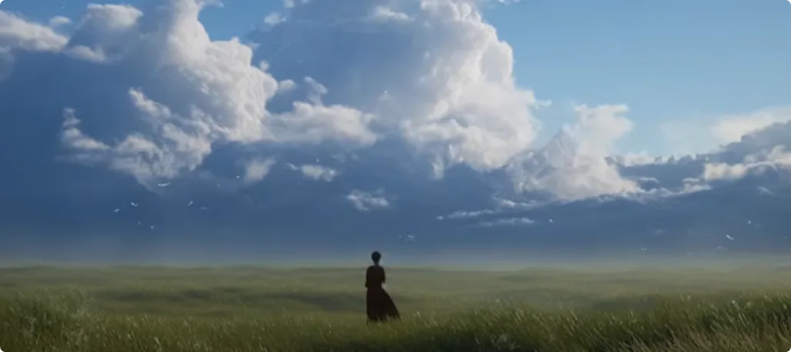
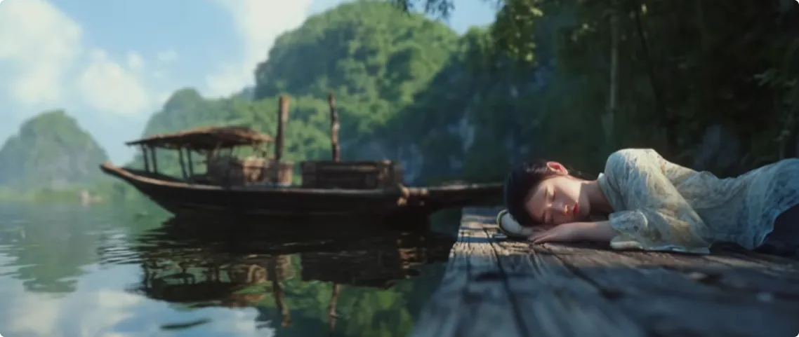
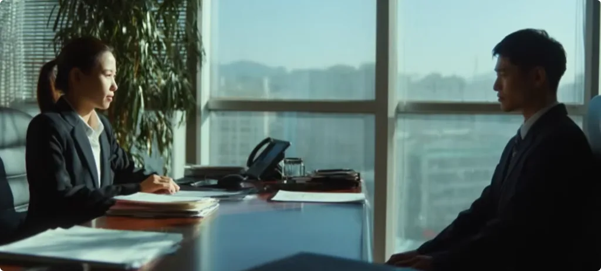
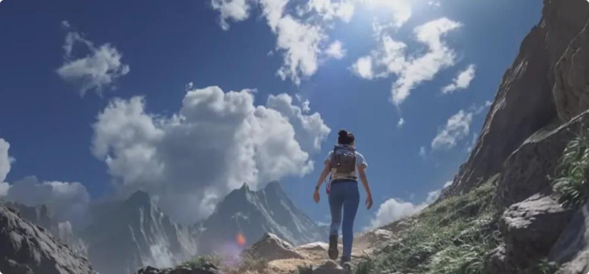
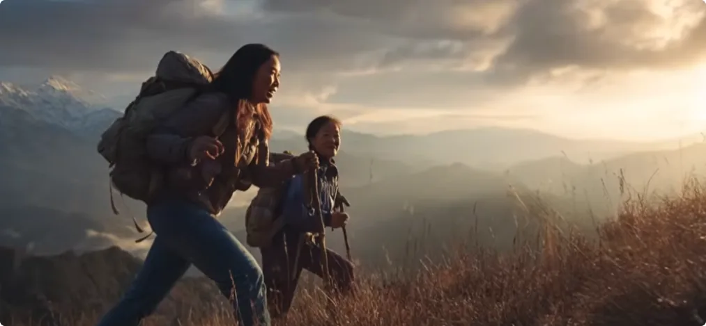
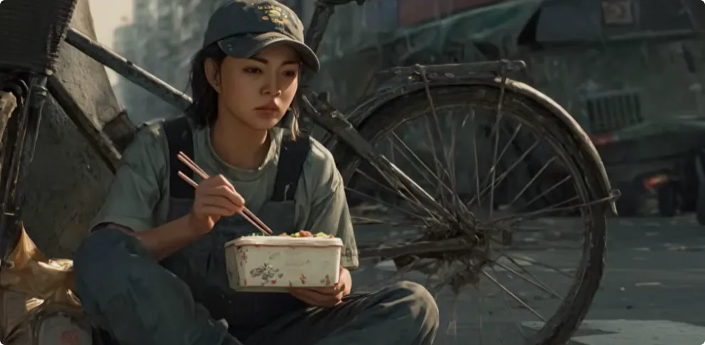

你是在什么时候开始有了修仙、修佛的想法？

据我了解，相当多有缘修仙佛之人，他们都在童年阶段因为一些特殊的经历，从而觉醒了修行的意识。

比如：
- 有的人小时候亲眼目睹云层中有仙人穿行；
- 有的人梦到过前世的师父提醒他要修行；
- 有的人的父母在胎梦中梦到过巨龙在天地间穿梭。

而更多的有缘人，则是从小就有一种感觉，好像今生有什么事情没有完成，总觉得这件事情只有通过修行才能得到答案。

当然，还有更多的启蒙方式。无一例外，这些启蒙背后都有不同的神秘力量在推动，目的是让这些人尽早觉醒修行的意识，开启他们今生的寻路之旅。

在找路的过程中，虽然那些古籍不曾记录真正的修成秘诀，但也在极大程度上培养了灵性思维。
这是一部分前人留给后来者的教诲，但前人终究是不能让后人从书中得到的，因为这违背了修成仙佛的根本逻辑，也就是：
- 实践大于理论；
- 现实大于空想；
- 正果大于剖心。

所以，这些修行人最终都要脱离虚无缥缈的书本，回到现实、实践和实证中来。

以上种种，自幼就被启蒙过的人，其实都可以说是该修行的人。但并不意味着该修行的人就能修有所成，有了修行的意识，并不意味着有了修行的资质。

因为想做一件事跟做成一件事之间，相隔十万八千里。一个人想做成一件事，心性、认知、条件、手段都必不可少。

那么今天，我们就来说说什么样的人才有机会接触和实证修仙佛的道路。

## 一、要从心底里想修仙佛

首先是要从心底里想修仙佛，想从尘世解脱。这是第一步，也是最难的一步。

如果一个人没有强大的、长久的信念，就做不到排除万难，也不会抵达终点。
**当现实和利益都无法说服自己坚持下去时，往往是内心深处那份不可动摇的信念，让人扛过去，让人找到路。**

在视频的开始，我说到，真正的修行人都有一个启蒙阶段。启蒙的目的，就是尽快唤醒修行人修行的本心，也就是他们的深层驱动力。
真正的修行人，都是各类修有所成的生灵转世来的。尽早被唤醒，他们可以尽早与尘世保持疏离感。

尽管大多数修行人会忙于家庭和工作，但是不管他们怎么忙碌，他们也会时不时地想起要修行。他们会觉得，如果今生没有接触到修仙佛之道，那就不完整，甚至因此感到悲伤。
这种深层驱动力会持续推动他们去找路。

正如之前我说过，人间邪道很多，骗局很多，灵界的尔虞我诈也很多。想要看破谎言，想要排除万难，就需要不断探索、不断试错、不断验证答案。
哪怕最后精疲力竭，也做不到放弃，无法忘记寻找真路。而这一切行动，如果没有想修行的本心，就做不到。
**在走投无路的情况下，这些修行人必须迫使自己动用直觉，思考真正的修行、修炼是什么样子。要尽可能地回忆起前世修行的感觉，直到重新悟出真气的必要性，如此才有机会识别出真正的修炼道路。**

然而，我之所以把修行的本心放在第一的位置，是因为我发现，相当多的修行人哪怕已经引渡到路上，仍然缺少持久修行的恒心。

如果说找不到路的修行人是处于学前班的状态，那么找到路的修行人就是小学一年级阶段。其实离登天的考试还有很远的距离，但是后者常常像泄了气的皮球一样，有了一种“上岸了就安全了，可以躺平了”的错误认知。

也许是以前找路太辛苦，所以找到了路就松懈了。
这些修行人应尽快认识到，修行是一辈子的事，不是一时的兴趣，不是生活的插曲。

这其中的差别在于：
- 一个是想修行，一个是想修成；
- 一个停留在想，一个更注重做，想要持续精进学问，想要接受考验升级。

那么，修行人应尽快转变观念，将“想修行”进阶成“想修成”。如此，你才能抵达成仙成佛的终点。

## 二、人品关乎修行之路

如果说想不想修行是个人的事，是个人的觉悟，关乎的是找不找得到路，那么人品的好坏，则关乎一个修行人能不能规划好脚下的路，能不能争取到更多的修行机缘。

因为：
- 一个求学者，离不开教导他的老师、师父或者贵人；
- 一个修炼者，离不开和各类生灵打交道；
- 一个成仙成佛者，离不开对道法的维护和实践。

无论修行人处于何种角色，他都必须考虑自己和他人、和众生的关系。

更何况，在修行大道上，所有修行人都是匮乏不足之人。
**知识、资源、机会都是从高处流向低处，由丰盈者施与不足者。这时，人品的重要性就体现出来了。**

所谓“得道多助，失道寡助”，没有谁会喜欢跟一个人品差的人打交道，哪怕黑帮也不待见这样的人。

如果你认可《凡人修仙传》里那种价值观，那你这辈子可以和修仙佛说拜拜了。
宇宙不可能让一群自私自利、无情无义、目无章法的生灵修上去，让他们去管理众生的生命之源、发展之源。

那么，对于一个修行人来说，什么人品才算是好的呢？
总的来说，记住这个底层逻辑就好了：**不要让对方感到为难或受困。**
接下来，我会用几个修行人的必要品质来解释这句话。

### 1. 修行人要真诚

修行人要真诚，言行合一的真诚。

如果一个人求道时表现的是一副轻浮的态度，那么这个人大概率不是真心想修行的人。他最终一定经受不住考验，更何况还是漫长的考验。

对于这样诚意不够的人，向他施以援手，完全是浪费时间、精力和资源。
很多人可能会有异议：施道者难道不应该耐心教导和培养吗？

那我问你，现实中有几亿的修行人，一个个去教导，早累死了。在时间、精力和资源有限的情况下，当然是尽可能引渡本就准备好的人。
所以，如果你诚意足够，记得言行合一地表达出来。不要让施道者猜，没有那么多时间来理解你。

### 2. 修行人要忠义

修行人要忠义。背信弃义永远是关系的大忌，这意味着施道者之前的所有付出和心血都付诸东流。

这不仅是对施道者的不尊重，也是对道的漠视。
比如，今天教会你修行的功夫，明天你就自立门户，不甘被规则约束，还美其名曰要大发慈悲、普度众生。

不仅漠视宇宙的修行考核规则，还反称所谓规则是施道者不愿分享的自私行径。同样也意味着，背信弃义的人已将施道者陷于不义之中，因为施道者将重要的事物托付给了不值得的人。

对道而言，他有失察之责，且要承担后续造成的一系列因果损失和风险。

也因此，从结果倒推执行过程，从一开始，施道者就必须观察求道者是否有任何不忠诚的行为，不论求道者有意还是无意。

### 3. 修行人要独立

所谓“君子之交淡如水”，修行人之间本就应该淡如水。

每个人都是独立的个体，每个人都需要有自己修行的空间。没有谁喜欢被反复打扰、被索取、被情感和道德绑架、被依附等等。

听起来很合理，对吧？

然而，恰恰有很多修行人都做不到。很多修行人常常遇到一点点问题和困难，都不愿独立思考和克服，还美其名曰这是“打破砂锅问到底”的求知精神。

### 4. 修行人要重视规则和契约

修行人要重视规则和契约，要言而有信，要善始善终。

正如前面所说，低位的求道者想要高位的充盈者向自身倾斜精力和资源，想要众生之间有公平公正的成长机会，那么求道者务必要遵守现有的修行规则，遵守修行的契约。

没有规矩，不成方圆。人间秩序是如此，宇宙秩序亦是如此。

好比为什么要安排雷公电母？为什么不是谁都能跑到天空中降雨？因为没有宏观规则约束的话，必定会带来混乱和灾难。

## 三、修行人要有大爱

在之前的视频中，我没提到过这个理念，因为是否慈悲渡人，完全是修行人自己的选择。

但我发现，很多人有点过于冷漠了。

修行人最终都是要去悟道的，不只是悟道，道的规律也要悟到，道之所想。如此，才能顺道而行。

得道飞升，而道终究是爱众生的。不是小爱，而是大爱。

何为大爱呢？
- 教导是爱，戒尺也是爱；
- 舍身渡人是爱，尊重他人命运也是爱。

两者都是为众生、为他人考虑后做出的选择。选择慈悲也好，选择严厉也罢，都是大爱的一种表现。

怕就怕在修行人不做任何思考，不做任何选择，一副“事不关己，高高挂起”的态度。因为道同时包含两种不同倾向的爱，而最终实现和呈现这两种爱之一的人，是选择它的众生。

选择意味着造化，而不只是空有慈悲的眼泪。

回看历史，修成仙佛之人，大多给人慈悲为怀的印象。因为只有这样的人，才符合“损有余而补不足”的道德，才具备成神的资格。

所以，我觉得**大爱应该作为修行人自我评判和自我实现的标准之一**。这次才拿出来单独讲。

## 四、修行人要谦虚自省

人外有人，天外有天。人再聪明，也无法超越宇宙。

道法本身很多道理就是大道至简，真传一句话，需要你在修行、修炼的实践过程中，反复去品同样一句真理。

**同样一句真理, 当你进入不同的修行阶段时，这句话的前置条件也会随着你而改变。你再去读，会发现句意又不同了。**

然而，很多人聪明反被聪明误。要么追求那些复杂晦涩的概念，要么觉得自己什么都听懂了，忽视了实践才是学习知识的根本，最后反而连最基本的一句话，甚至是几个字，都不知其深意。

所以，只有谦虚的人才能学到真正的知识、真正的智慧。

况且，成仙成佛路上之严苛霸道，会以何种方式考核你？如何在你的弱点和盲点上设置考题？你根本不清楚。

唯有时时谦虚自省。

一个谦虚的人，能够时刻仰视大道、敬重大道，通过换位思考，持续观察到自己的不足，认识到自己的渺小，明白还有很远的路要走，于是“终日乾乾，夕惕若厉”。这样的人才能真的进步。

而骄傲自负者，大多认为自己的聪明才智已经能参悟到道，认为自己所悟已然接近于真理。

这样的人在未来极易向着错误的方向一意孤行，最终给众生带来灾难。因此，大多时候，修仙佛的道路上首先会过滤掉自负的修行人。

此外，也只有谦虚的人才能通过贪嗔痴的考验。

一个谦虚的人，会始终把自己放在学徒的位置，不会因自身地位的改变，或者资源的多少，或者机会的得失，而心生贪婪或愤恨不平。

知道自己的所得所失皆是自身造化，大道之下众生皆是平等的，他便不会迷失。

最后，也只有谦虚的人，才能务实地面对现阶段的不足，循序渐进地解决现阶段的困难，而不是整天傻呵傻呵的，沉迷于修行的幸福中，成为修行路上的巨婴。

## 五、修行最终要落实到行动

前面四个可以说是心灵层面的修行，也就是要修心的部分。

但心是易变的。你可以说你想通了，而能否做到，并且不因现实的挑战而改变心意，却是最难的。

因此，付出行动去实现，才是考验修行人的重点。

所谓行动力，不仅是你要在心理上敢于行动，也需要你具备行动的素质，比如：
- 金钱；
- 时间；
- 独立性；
- 学习力；
- 等等。

直白点说，就是通过你已实现的现实条件，来判断你当前实现修行的能力。

这就好比你不能只在简历上把自己夸得天花乱坠，而实际工作能力却做得一塌糊涂。修行得道，最终仍要看你实现的能力。

我之前讲过高经济、高生存能力的必要性，很多人听不懂是什么意思，也常误解我的意思。今天我来举几个例子，大家就知道了。

### 第一类修行人

第一类修行人尽管学历不错，但是社会工作技能并不算出众。加上现实就业环境不好，每天在公司朝九晚九、上六休一，一个月尽量抽出一两天时间出门修行。

修行也只能做到这种程度，没法抽身去做更多的事情，甚至总结学习经验的时间也少。不上班就没有收入，辞职可能找不到更好的工作。你该如何选择呢？

### 第二类修行人

第二类修行人有家庭，有孩子要养。

有的人没有房贷、车贷压力，但是收入和开支都需要和家人共同商议；有的人还需要在节假日陪伴家人；有的人甚至受到另一半的约束，不同意他修行。

你如何平衡家庭和修行呢？

### 第三类修行人

第三类修行人可以是所有人。

体会过修行的好的人，都想尽量去引渡自己的亲人。因为修行人更看得透尘世那些无意义的苦，哪怕亲人此生注定不会修行，但是能抓住机会启蒙、开智和改命，已是万幸。

在这时候，能否在顾好自己修行的情况下，再去兼顾家人，其实是有挑战的。
而这些都仅仅是停留在修好自己的范畴。如果你连自己都修不好，又何谈引渡他人呢？

## 六、真正的修炼需要现实条件

很多人修心修惯了，没有任何实际支出，不知道真正的修炼需要经济支持。

一个修行人出门一趟，飞机、高铁费，租车费、油费、伙食费、住宿费、能量守恒的损耗费用等等，都是要花出去的。

更何况，很多人只在节假日有空闲，而节假日出行的费用还得翻几倍。所以，没有一定的现实条件，是很难修行的。

有些年轻人写信说，自己可以省吃俭用，尽可能修行。那我得泼盆冷水了。

**修行最没必要吃的苦，就是衣食住行的苦。**
因为大多数普通人也是这么过来的，如果只是做到这点就能修成，那绝大多数人都可以。

所以，皮肉之苦并不是修行考核的主要范围。
真正的苦，真正的考验，是你发心之后：
- 如何解决现实困境；
- 如何面对两难的选择；
- 能否经得住长期的付出；
- 能否实现自己的目标；
- 能否经受得住不被理解的孤独。

通过看你面对困境的选择和处理能力，来判断你的修行觉悟，判断你是否能践行前面四个发心。

所以，不要怪博主的引渡要求高。因为我见过太多的人说自己多么真诚、多么想修行，到头来吃不了一点苦，面对现实的困境也只是鸵鸟战术。这就属于修行觉悟还不够。

因此，我常常强调：除非这辈子只想修行、修仙，或者从小启蒙要修行、修仙，否则不要轻易尝试这条路。

我是修炼者小烨，我们下集再见。