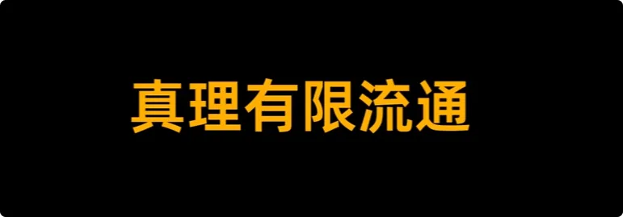

大家好，我是修炼者小烨。今天我们来讲讲一个人的认知是怎么锁死自己的出路的: 
>**越顶级的知识越难流通，越是能带来实质性好处的知识越是被藏得好好的。**

首先，世界上不存在无限的资源，知道的人越少，对知识的持有者越有利。所以明面上你不可能接触得到别人的财富。
其次，只要是有用的知识就会产生流通权，即谁来持有，谁来继承，谁来决定流通，谁来把控人数以及怎么使用等等，总是会产生规则和约束力的。所以每个圈子都有自己进不去的俱乐部。
第三，收益越大的知识就越是一字千金，一两句话就能把关键和窍门说出来。不在于知识有多难，而在于知道还是不知道。知道的人就能撬动巨大的好处，这种好处可能是财富，也可能是力量。总之这种知识的厉害性极大, 于公于私，对外都需一字不漏，规矩极其严格。

所以顶级的知识都不在纸上流通，而是跟某个人绑在一块儿的，由那个人口传心授，想要破圈，要么拜师学艺，要么认作义父。
不过对于大部分人来说，如果你自身价值有限，资质不够，那么你几乎没可能闯进这些人际关系里，甚至连人影都摸不到。

反过来说，凡是能向你公开的知识，要么这知识没什么用，要么他对你有所企图，你是他的韭菜，无一例外。

大家可以根据自己的实际生活细想一下是不是这个道理。

经常有人说，小烨，你作为修行修仙博主，讲的东西是不是太现实了，太中国人思维了，修行不应该是超凡脱俗的吗？仙佛的世界怎会这么功利？

那小烨可要反问一句了：
**成仙成佛这么难实现的事情，你都不严谨、不现实、不实事求是的话，那你靠什么来修行的呢？光靠想象力吗？**

你当前所处的身份位置，无论是世俗层面还是修行层面都是很低很初级的，有用的信息都轮不到你，你连自保的能力都没有，你又有什么资格谈超凡脱俗的修行呢？

人要求知要向上走，要想改变自己，就必须清楚和遵守知识的潜规则。越有用的知识越是一字千金，越是有很大的利害性，它必然是分配不均的。
**当知识的持有者是人的时候，知道的人越多，蛋糕越小，稀释的是自己的生存，所以为了自身利益不会轻易分享。**

而当知识的持有者是仙佛的时候，所有的知识都具有超自然影响力。比如
风雨雷电之术，斩杀鬼神之法...
你当了仙佛，天地道法肯定也要把这些知识交于你。那你能随便告诉一个凡人吗？你敢任凭他瞎搞吗？你不用先考核他吗？你不用对道法和众生负责吗？

所以很多修行人认为摆几个手势，念几个咒语就能得到真理，得到神通，就是因为没有想明白真正的知识具备利害两面，不可能写进经书里，让什么人都可以随便学了去。能在书上公开告诉你的都只是在讲道理，包括小烨的视频在内。

至于真正的知识，你得找到知识的持有者，经受得住相应的考验，才有机会得到口传心授。
**拜师这个动作，换个角度也是体现一个人对知识的敬重。只有这样的人才能对知识的厉害性负责，这就是顶级知识的流通规则。**

## 1.真正有用的知识与现实案例

那什么是真正有用的知识呢？

如果你社会身份比较低，基本接触不到认知之外的知识，那么我建议你多观察，去看看有钱人在做什么。因为有钱人最趋利，没有利益的事情他们不会做的，你要看他们在做什么，不要听他们说什么。

这里讲几个案例：
1. 我身边认识一个老板，几十岁人了，每天都在开会，倍精神。他的微信头像是他一岁不到穿着藏传僧衣的照片，而且这张照片散发的味道极大，一看就是做了灌顶的。
2. 还有一个老板，每年开工都要先摆台烧香，每天到办公室都要先点上一根香才开始办公，而且只要他的香一点，那香招来的东西就很大。
3. 还有一个老板亲口跟我说，盖寺庙很赚钱，很多老板都是合伙开连锁。完事后有些老板会把一部分钱捐给寺庙，至于捐了做什么，只有一小撮老板才知道了。这些人起码要给1000万才有跟大师面对面学习的机会。少于这个数，你顶多跟大师在厅堂一起用过膳。
4. 之前有个新闻，有位女士卖了全部身家五百多万，全捐了一分钱也没留给在念大学的子女，最后自己也没有得到任何实质性的好处。为什么呢？因为一不缺你这点钱，二你已经没有任何价值了。

那些老板除了能捐，还有社会价值，比如盖庙的能力、活动支持、拉人脉等等，所以他们才有晋升学习的机会。那他们在学什么呢？他们赚这么多钱，难道是为了虔诚的学修行吗？怎么可能？他们是要借某位大佬的能量给自己助运。至于具体怎么借的，听过这个说法的人自己知道就好，我反正是不知道的。

所以说很多人去庙里找正神，可这庙又不是正神开的，是人开的。有些庙观虽然是某位大神飞升的地方，可是大神走很久了，他不会再管这间屋子了。
**正神不需要香火，不需要人的信仰，也不屑于与凡人交易。人家飞升前就不需要这些东西，飞升后更不需要这些。**

回过头来说，为啥有些老板遇事总是不败，而有些老板败得快？因为除了自身积累，还要看背后站着谁。背后有人，那能量气场自然强，别人扛不住的事儿你能扛，机会就是你的。甚至有些人冥冥之中被拉来跟你合作，教你做事，这些都是特殊照顾得来的。

## 2.命运、能量与修行

人的命运本质上就是两种能量模式: 
命的能量难改，运的能量可以改。
强大的运势本质上就是强大的能量之势，能把你带到风口，把你带到更高的平台上，历练学习新的知识体系，获取别人看不见的资源。很多老板都是在不断破圈后，接触到了认知之外的事情，才意识到能量的重要性。而且他们试错成本很低，有机会都愿意试一试。对他们来说，打破信息壁垒更重要。

而普通人呢？口袋紧，试错成本高，本能的警惕任何认知之外的事情。

另外人的天赋也是如此，也是跟能量有关的。学过命理的朋友都知道，什么能量特质促成什么天赋。为什么有些人对某个领域有极大的兴趣，而且在这件事情上悟性极高？为什么他们能持久的钻研并最终成就一番事业？

>因为都是靠对应的能量，能量既是药引子，也给予相应的悟性。持续的能量支撑，一个人持续的投入，有所成就。

有很多人知道了能量的重要性，不惜借旁门邪道，也要一世名利。但常人怎么借能量，找谁借，带来什么恶果，这都是个人自己的选择。正神是没有义务给你收拾烂摊子的，不要最后退无可退的时候大骂神仙在哪。

当然了，作为修行修仙博主，我还是建议大家走正道修能量，因为只有正道才会有好的能量。

命运二字，命包括你的本性、结束和生命。**你的本性就是你的元神根底，决定了你当前是个什么心性的人，你会诉求什么，你的选择和行动是什么。你的行为带来了果业，决定了你的结束，而结束又跟你的生命挂钩。**

人想要改变本性，必须要有上层能量的辅助，把你的心性和格局拔高。不然你天天待在人间臭水沟里，能熏陶出什么品质来呢？淤泥里开出的莲花，本质上还是凡品，没有上层资源的改造，不可能出现本质的变化。

其次，人想要改变结束，改变因果，依旧是靠能量。在绝对的力量面前，因果也算不上什么。

最后想要改变生命，那你得有点资格说服得了改生死簿的那位及以上的力量。

说到这里你应该知道我已经是在讲修行和修仙了。

## 3.认清位置与神明的考验

从人到神仙之间，其实是有很多生灵存在的。只不过只有到神仙佛级别，才具有教导世人的意义，才会被立为榜样，写成故事，被世人知晓。
大多数人就以为人之上就那么几位神灵，而且离人不远，举头三尺罢了，并且有感必应。这个说法到底是哪位大佬加进经书的我也不清楚，但是确实很符合人心，很符合人的需要。

人们都很喜欢这两句话：
浪子回头金不换
放下屠刀，立地成佛。
就是希望自己犯的错不会被审视，就算干了坏事，自己也可以随时被谅解，最后只需要做一点点好事，就可以重新当圣人了。所以你看不论什么品德的人都能大大方方的烧香拜佛，他内心是没有一点心理负担的。

另外有感必应的说法，很能满足一个人的英雄情结。因为很多人都认为自己很正，是正义的化身，站在道法的制高点，张嘴一招就能把大神请下来，而且常常认为神仙佛就应该托他上去，他有这个资格，甚至上去了也是和大神平起平坐，你是道法，我也是道法，我们应当平等。

很多人看见小烨说要用能量修炼，要给仙人叩头，不屑，觉得不够高级，不够大气。
我只认本源，我只认如来，我只认三清，
其他我都看不上。这就像小学生在挑未来上清华还是北大一样，认不清自己的位置，认不清现实。

成仙成佛从来不是一步到位。典籍里白日飞升的，哪个不是大神下凡来教化世人的？他们是修回去，不是修上去的。任何人不管你过去什么来历，你都不可能比他们大，都得脚踏实地的修行。你当前什么段位就修什么段位。好大喜功的人，正神看都不看一眼。

而且神仙佛都是一群能量极大的存在，不可能为了地上某个人亲自下来一趟。人类看得上花花草草吗？

只能说喜爱，因为物种差距太大了。

神之下，人之上还有亿亿万万的众生，在神座下寻求修炼机缘的也不在少数。有修了很久的山水精灵，有打工很久的大妖大魔: 
哪个不是诚心向道，哪个不是脚踏实地，哪个没有付出辛勤劳动？
连他们都要遵守真理的流通规则，遵守能量的获取规则，才能更上一层楼。而人类比起来其实是差远了的，神其实是更爱非人类的。

所以大家不要以为神对世人有着无限的包容，相反神对人的愚性其实是不包容的。你可以浪子回头，但你该受的罚还得受。不浪子回头，那你的结局还会更惨。在神明眼里，人类都是小朋友。跌倒了就得知道疼，疼了你才能长进。如果不长进，周期性反复轮回，那就让你更疼，疼到成为你灵魂的印记。

**你可以把正神都视作一群极其严格的老师，能真正为你长远考虑的老师不会放任你的。愚行一定会使用教尺。因为被溺爱的人无法成长，唯有大火淬炼，才能诞生独立自由的灵魂。**

所以回过头来，为什么正神从不干涉人间的香火交易？为什么正神从不来给修行人指路，任由人们被大妖大魔耍的团团转？因为那都是人自己的选择，人自己愿意跟妖魔混一起的。
去寺庙烧香的人，你心里求什么你不知道吗？玩通灵占卜赚钱的人有多危险你不知道吗？打坐到精神发颤的人，你自己什么健康状态不知道吗？都是人自己选择视而不见罢了。人什么时候知道疼了，疼的在地上滚，叫了正神就出来了。尤其是那群本该修行修炼的人，被人被妖魔骗得越惨越好。因为只有看遍伪善的把戏，才能恢复对真理的嗅觉。

其实每个人在想些什么，灵界都知道: 
你贪恋钱财和地位，周围的魔一下就过来了。
你贪恋美色，周围的妖就过来了。
你有害人之心，周围的鬼就过来了。
因为同气相求，你什么能量状态招来的就是什么灵体。

很多人会说了，我这么想修行，我这么善良虔诚，神听不到吗？我不能把他们招过来吗？不能。

首先你无法模拟神的气场，也没有功能去连接正神，神注意不到你。其次光有心是没有用的，心是个人意愿，能促成什么结果才叫本事。

比如: 
你说你想修仙佛，那你有时刻虚心求道吗？你有寻找过真正的修行之法吗？你说你善良，那你帮助了谁？天地万物之间你又拯救了谁？你说你虔诚，那你为道做了什么？
我一问你可能都哑口无言。你什么实质性的动作和付出都没有，正神怎么敢给你机缘，给你能量？哪位神敢把一个只懂嘴皮子的人渡上天？

其实很多人说自己在修行，有奉献，却察觉不到已经陷入一种贪念，贪图轻松。比如念咒就很轻松，起伏也很轻松，放生几条鱼也很轻松。很多人不是真心想试修，只是想要被认可、被回应、被庇佑。人一旦有了贪念，就会招来不好的东西。

灵界个个都是千年的狐狸，这点要求他们略微出手就能把人框住。一个想要被善待，一个最会伪善。不过好在大多数寺庙里的都不是真正的大佬，因为大多数人都很普通，产出的能量也一般，大佬看不上的。

## 4.修行与道同行

那什么人产出的能量更好吃呢？
>那就是愈高愈寒，每天都提心吊胆，生怕被替代，永远没有安全感的人。这样的人执念才重，他们随时都在失心疯，但又因为太聪明太理智而没疯。
>这种人私下都是以虐己或虐人为乐，堕落到了既不信自己也不信他人的程度。其实这种人挺孤独的，身边没有敢真正交心的人也挺累的。

其实这是对你的考验，所有这类人都会被考验。那些顶级的大妖大魔是没兴趣去搞普通人的，他们所在的生态位大多是帮老天考验能人去的。他们会诱导你心中更大的贪欲和执念，你能扛得住，老天才会放心把一些东西交给你。

很多人扛不住，纷纷投降，但是心里又过意不去，在人间很迷茫，也不知道要追求什么。其实此题也好解，那就是修行与道同行。

看过我视频的都知道，我是呼吁所有人都修行的。不用出家，就用好的能量提升自己的品性，一步步往上走就可以了。

**道无情亦有情，有情无情都赏罚分明。你若向道，道亦向你。** 
只有真正的修行，你才能体验到正神对你的回应，对你的教导。道会告诉你什么是对的，你只需要有一颗纯粹的心去做就是了。**届时你会发现，无论你在地球的何处，你都能感受到诸神的回应，天地万物都在给你回应。**
这种归属感是人给不了你的，什么亲情、友情、爱情，什么功名利禄，都比不上这种高级的情感。用个词描述，也许叫与神同乐。到那时你会明白你真正想要的精神追求是什么。

最后我还得多说一句: 
*永远不要在大神或者大佬面前显摆你的聪明。灵界最不缺的就是聪明，真理永远是由上到下传递，你只能是下，也不要想着用最小成本撬动最大资源。人的想法都是透明的，任何心计都不好使，尤其是如果你想被心性（欲望）驱使并且做出来了，下场会很惨。*

以上，明白真理的流通规则，明白能量的意义，明白自己的位置，摆正自己的心态，你就可以开始启程了。

我是修炼者小烨，我们下期再见。