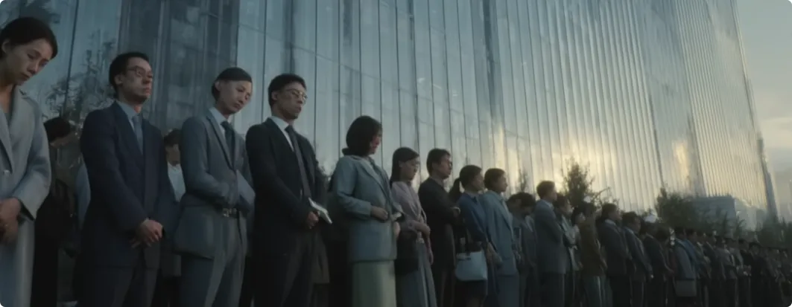
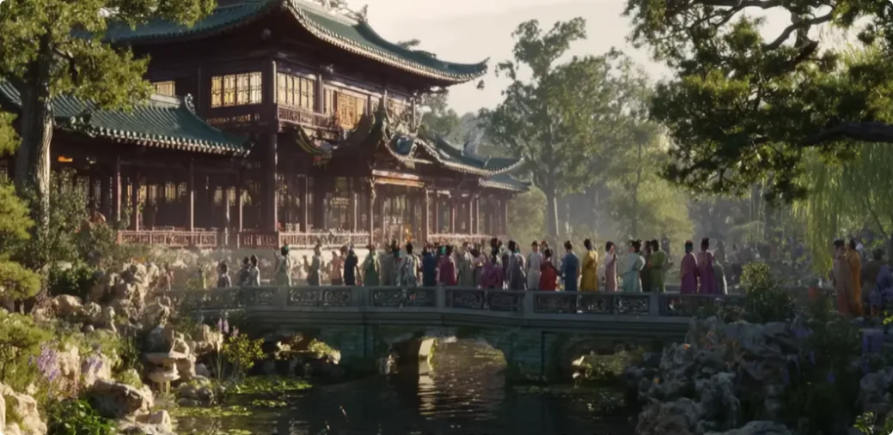
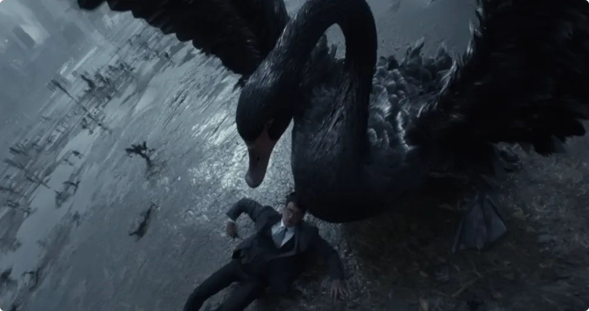

很多人问：为什么要修仙？为什么要追求长生？这么无聊的世界一直活下去，难道不是一种痛苦吗？

那是因为你活得不痛快，痛感大过幸福感，所以对生活、对时间产生厌恶。如果你能拥有大量的生活资源，每天都幸福快乐，每天都想积极向上，那么你肯定也想多活几百年。

你不想长生，恰好说明了当下的你活得不明不白: 
***既为笼中之雀，又安知鸿鹄之志呢？***

所以今天我来分享一下：为什么要修仙？修仙到底能给你带来什么？

## 第一: 摆脱欲望的信息失真环境

相信很多人对生活有着强烈的无意义感。明明是身体的主人，却做着身不由己的事，就像是一个机器人，日复一日地运转，找不到生活的意义。

正是因为理想与现实高度不重合，让人们对现实生活有了失真的感觉。

首先是**价值观不真**。

>在这个时代，人被工具化，人生被指标化、标准化。你不再是你，拼命追逐被他人定义好的价值观，你的人生也运行在你不想走的那条路上。

其次是**人心不真**。

>资源被设计得太少，而个人需要争取的权益又太多，每个人都不得不为自身利益步步为营。不是你吃掉我，就是我吃掉你，时刻都要担心失去生存保障。

所以，人与人之间，猜忌和防备成为了常态。看似人潮喧嚣，实际上都是一座座孤岛。大多数人其实是有真情的，可笑的是，现实世界却没有。人本该是世界的创作者，却创作不出一个真情的世界。

最后是**信息失真**。

所有围绕在我们身边的信息，真的不多。你能走的人生剧本基本定型，不管是人为设计，还是玄学层面的设计，大多数人都逃不出这两个框架。

你的理想再丰满，也跟你无关。你就像是 NPC，不管多高级的 NPC，也走不出既定的程序。
而想要打破这种不真实感，唯一的路径只有修行，或者直白点说，是修仙。
只有修仙，才能彻底改变一个人的命运，改变你的生命本质，把你挪出 NPC 的位置。只有修仙能给人最大的选择自由，或者说，最大的自由意志。

其次是情感上，只有修仙人之间的感情是纯粹的。修仙之人不以个人利益为前提，而是以道法为共同理想，可以说是真正能体会何为同道中人的人了。

只有在修仙的过程中，你内心深处的愿景得以表露，也没有人会拿现实嘲讽你的理想。

## 第二: 明利害, 懂得趋吉避凶

以前我会跟大家说，修行、修仙可以做到趋吉避凶。
修仙人是自然的孩子，大自然无论如何也不会为难修仙之人，所以修仙才拥有真正的安全。

但现在我说得更直白点：修仙就是为了活着。“活着”这两个字已无价。

因为有些东西，**知者不好多言，言多者大多不知**。

博主一直以来透露了很多事情，差不多把神秘学领域都关联了起来，但大多都只打了桥墩，没有铺桥面，也没法铺桥面。这也是很多人说博主讲的逻辑有漏洞的原因。

现实就是这样。很多知识和信息的传递，由于限制太多，只能是有点社会阅历、修行阅历的人才能接收到。

很多人觉得：“我现在好好的, "活着"又算什么理由？”没关系，听不懂，可以再在生活中好好磨磨性子。毕竟一个人未经历大的磨难，很难大彻大悟。

话说之前我做了一个梦，梦里道法说他怒了。不过具体什么意思，我也不太懂。

## 第三: 渡自己周边的亲人

自古以来，一人得势，家族享福。在修行、修仙领域，也有一句话叫“一人得道，鸡犬升天”。

这里面的道理其实是相通的。
在资源匮乏、社会信任稀缺的环境中，以血脉为纽带的家族，是最基本、最可靠的利益共同体。

>家族会集中有限的资源，去投资最有潜力的成员，助他成才、成功。这是一种着眼于长远发展的投资。而该家族成员成功后，则有责任和义务反馈和反哺家族，以此实现整个家族的繁荣与延续。

而在修行领域中，一人修好，必然也辐射到身边的人，尤其是跟你以血脉相连的人。
首先是**气场**。
你的气场强了，必然会辐射和改善周边的人和环境。哪怕是你家养的鸡和狗，也能沾点真气，说不定还能成精。
其次是**命运**。
你的命运改变了，你带出的因果就变了，你家人的结局也会随着你的选择改变。
最后是**机缘**。
你成为了仙道上的人，你的家人其实也比常人多了一个引渡的缘分。你的家人比陌生人更容易走出 NPC 的角色。

不过别误会，这跟帮亲没什么关系，其实就是就近原则：
眼前人能渡就渡，渡不了也拉倒，就这么简单。

总的来说，想保自己所爱之人的周全，要先能保自己周全。除了修仙，其他手段恐怕都难。

## 第四: 活的更加通透

世人在情感、利益、胜负上执迷不悟的行径，其实是很可笑的。

因为在信息严重失真的情况下，理性和逻辑也毫无用处，辩论也只是无意义的争执。对错已然成为立场的工具，而非真理本身。

人类无法达成共识，争执成为最好消磨精力的手段，可谓是被人卖了还帮着数钱。

想要结束这种不明不白的痴态，最直接的办法就是弥补信息差，尽可能看得更清楚。

既然你改变不了你的地位，也改变不了血液，那么就尝试改变圈子，尤其是那些难以约束的圈子，比如玄学圈。这类人的很多消息都来自于无法管辖的神秘世界。听听他们说什么，也许对你有好处。

但我的建议还是：
修仙、走正道，才是对自己负责。毕竟真知不在道上，还能在哪呢？

## 第五: 知道未雨绸缪

一个人再聪明、再有远见，也无法预料"黑天鹅事件"。
在这件事情上，通灵师比占卜师有用，占卜师比算命师有用，算命师比天才有用。

总结起来就是：消息越不受人管束，这件事越有可能成真。

道理很简单，**大道先行，而德后动。说要有光，才有光**。黑天鹅就是这样的霸道。

他说他来了，最先得到消息的是无形的神秘世界，一层一层往下传，最后才到人间。所以，人是最后一个知道的。

现在行情不好，很多人都喜欢算上一卦，希望做好人生规划，这其实都是自欺欺人。算命改不了命，知道会发生什么，跟你能不能改变结局没有直接关系。

你规划得再严谨，到头来该空也还是空。

很多富豪和家族的兴衰，跟算命没什么关系。算命算不出财富，究其原因，时也，运也。

有些富豪觉得自己的运已经准备得足够多，天不怕地不怕，再不济，瘦死的骆驼比马大。

可是在黑天鹅面前，这还真不一定。没有谁的运是固定的，也没有谁的命是固定的。黑天鹅面前，人人平等。

## 结尾
还是那句话：除了对修仙的规划，其他的规划我真不看好。

> 机关算尽终成患，镜花水月了无痕。

从这期开始，博主的讲话会更加现实，只说给有一定阅历、能听懂的人听。

因为我发现，那些本就听不懂的人，就算把道理给他掰碎了，他也还是理解不了，那我就不费这个力气了。

> 取乎其上，得乎其中。

最近很多人说，无法理解博主作为一个修仙之人，为什么要谈论现实层面的利害。

这个道理也很简单：
修仙是超脱现实，不是脱离现实。修仙者身在凡尘，必须理解和驾驭现实的规则。

修成仙可比干一番事业难多了。脑子不清醒、不严谨的话，你拿什么修仙呢？

我是修炼者小烨，我们下期再见。