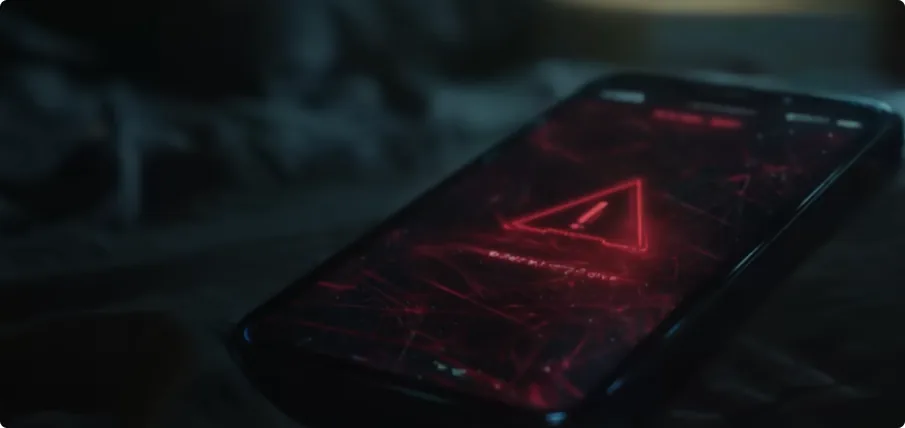
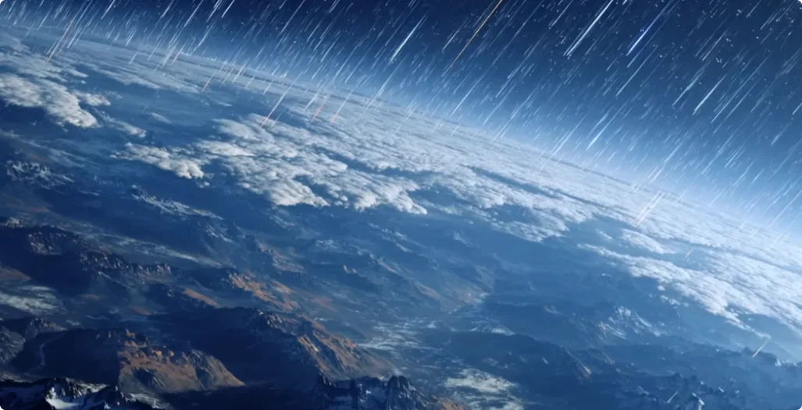
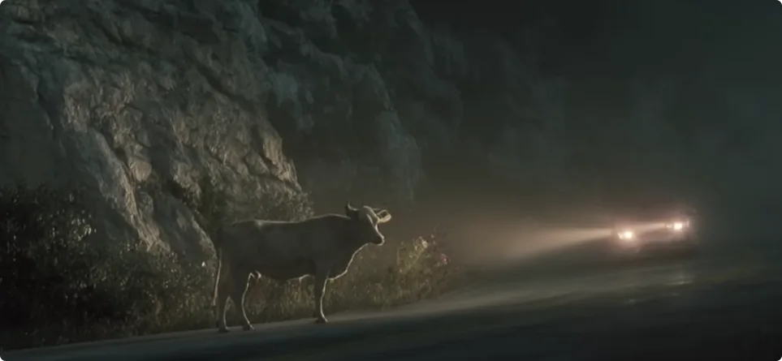
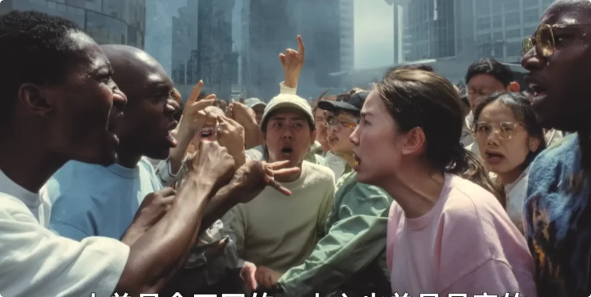

大家好，我是修炼者小烨。

这一期我想以一个旁观者的口吻，来给大家讲讲在修仙之人的眼中，为什么修炼是自救行为？为什么修炼是每个人最大的投资？
因为之前很多人没听明白，我也不妨再讲清楚一些。
先来分享我很久之前的一个梦。

## 关于一个夜晚的梦
有一天晚上，大概是一点左右，我躺在床上玩手机，想着明天去哪玩，挺悠哉的。突然，手机里弹出一条实时的播报消息，说各地都已经放弃了。

接着，一条一条的红线在手机屏幕上冒出来，疯狂移动。紧接着，窗外就传来了轰鸣声。一声清脆的、机械的、震耳欲聋的声音传来，好像放鞭炮一样，一串一串的巨响，白色闪光一次比一次近。

我的第一反应是跑，可是我又能跑到哪儿去呢？
就当我快走到窗户的时候，一道白光在附近闪烁，随后无形的光线穿过我的身体。我的双膝像是朽坏了的金属一样慢慢弯曲，跪倒在地上。

光线穿过我的身体，从表皮一点点烧进胸腔内部。我的四肢慢慢扭曲，动弹不得。我感觉到刺骨的疼痛以及面临终末的恐惧，然后我眼前慢慢就黑掉了。

我仿佛看到城市被黑雾淹没，一切都在被格式化。

我不停地问我自己：
为什么会这样？
为什么突然就结束了？
所有人就这么突然结束了？

**每个人生前争夺的事物根本没有任何意义。在终末面前，一切都会清零，谁都不会剩下什么，连回忆都不剩。一切就像从未存在过一样，留给每个人的只剩无尽的黑暗与绝望。**

而我过去究竟在做什么呢？

随着我的胸腔、腹腔越来越疼，最终被疼醒了。我从梦中惊醒，大口大口地喘着气，我又回到了这副健康的身体里。
我还是躺在那张床上，看着面前那扇刚刚闪过白光的窗户，死亡带给我的压迫感仍旧没有褪去。
我看了看时间，1点40分，跟刚才的时间差不多。此后的几个小时里，我都不敢入睡。我害怕回到刚才那个没有未来的地方。

我脑海里有个声音问我自己：
***所以现在再给你一次机会，你会如何呢？***

梦到这里就结束了。我重申一遍，这只是个梦，大家别当真。

## 此后更加勤勉地修炼

### 修行的真正意义
在这梦之后，我就不敢怠慢了，每天都在好好修行。
因为时间是最大的成本。珍惜这一世的时间，不要将生命和健康浪费在争夺名利上。你赚得了全世界，却丢了性命，又有什么意义呢？

**这世界上能真心为你的成功感到欣慰的人屈指可数，所以没有必要向任何人证明你自己，能在死前不愧对你自己就行了。**

在有限的生命里，人应该多思考，在这一世到底什么才是最重要的？对于你的存在来说，什么是重要的？
有很多人觉得是来体验人生，这个其实没有任何意义。因为人投胎了，记忆都会清空，没有任何意义。
个体的成长完全不靠活了多少世，不是靠累世来积累天赋和智慧的，而是靠修行、修炼。

我委婉地说，那些富贵人家，不管是一代还是二代，其实都是有在被动修行、修炼的，只不过他们自己都不知道。
你看，很多有钱的人家都喜欢去一些美丽的地方旅行，而且越赏心悦目越好。其实他们根本不知道，他们的灵魂在渴望去那些地方，那里有能滋养他们灵魂的东西。

### 能量的潜移默化转移
之前我看过国内的一个旅行博主，甚至不是修行人。他大老远跑去欧洲，专门去看某个著名景点。
他在录视频的过程中，连他自己都不知道，有一部分修炼的能量已经给到他了，罩在他身上。也许是因为见他人品还不错，才给了他一点点修炼缘分。
这些能量能帮助他开悟、修养品性，提升灵魂层面的东西。

那些富贵人家每天跟打鸡血似的干事业，随便睡一觉又满血复活，因为他们过去或今生有能量的积累。

还有那些古人描述的神仙腾云驾雾、法力无边、神通广大，以及佛菩萨的金刚手段，也是靠对能量的积累。
任何能力背后都是要有能量支撑的。所以无论是人是神，都不是靠所谓的脑子想通了就成功了、飞升了。

一个人在世间，甚至是其他世界能不能过好日子，取决于你身上修得的能量。
所以回过头来说，**人活这一世，在钱方面够用就行，而且钱要花在刀刃上。尽量去修得真正的能量，同步在修品性，让自己的修行缘分持久下去，让自己成为在世界生存的强者，而不是弱者。**

如果你只顾着赚钱，把钱当第一位，那就是本末倒置了。到时候抱着一大堆钱去死，过完这一世什么都不留下，有什么用呢？
很多人觉得要多赚钱，以后留给自己的子孙后代。其实你的子孙后代有没有机会花，这都是遥远未知的事情。
**只有先顾好自己，才有余力顾好所爱之人，才能给所爱的人指明对的方向。**

### 当前时代隐藏的修仙机缘
当前这个人口爆发的时代，其实很多人不明白，这个时代是历来最好的修行、修炼、修仙的时代，是名额最大的时代。
很多转世成人的，投胎前可不是为了来体验人间的，更不是来享受人间富贵的，而是为了接触真正的修炼才来的。
这些人普遍都投在那些对玄学、修行感兴趣的命格上，甚至是那些多点挫折和磨难的人生，就是为了尽快苏醒，尽快尽力地取得修行层面的成果。
既是为了争取鲤鱼跃龙门，也是已经冒了回不去的风险。

所以各位，尤其是听这个视频的修行人，一定要珍惜这一世的时间，一定要想明白真正重要的是什么，真正值得投入的事情是什么。
这一次错过了，下次不知道要等多久了。

## 灵性是生命的分水岭

**灵性是生命的分水岭。**

### 关于动物灵的一些误解
之前网上有个传言，说世界上80亿人，有很多人是动物转世来的，因此很多人听不懂人话，贡献了很多蠢事。

其实此言差矣，很多转世成人的动物比人都有灵性。
平日里，我们都听过哪条道路上有山体滑坡，会有鸟、牛、黄鼠狼之类的挡在人的面前，不让人过去。

有灵性的阿猫阿狗尚且对不好的地方有预感，知道哪里该去，哪里不该去。反倒是纯粹的人类已经失去了和自然沟通的能力，完全不通自然。
每年有很多人迷失在深山中，明明给了多次返程的机会，都通过天气给了很多次警告，却还是执意去送死。在动物的眼中，这些人难道不也是在做蠢事吗？
所以不要以为听不懂心机深沉的聪明人说什么就是傻了，就是呆鸟转世。人家的能力从来不在心计上，而在修行、修炼上。

**很多动物灵过去都是懂修炼的灵魂，知道干什么最重要，所以转世成人，也不爱干俗人的事。**
**当普通人还在争名夺利、造下恶业，最后抱着钱去死的时候，反倒是那些有灵性的，对人的心计嗤之以鼻。**

坚守道德底线，不造恶业，保持敬畏，自然最后拥有一个好的结局，甚至飞升更高的世界。

### 缺少灵性的人呈现出的麻木
比起那些结局死得不能再死的聪明人，有灵性的人难道不更聪明吗？
缺少灵性还有一个特点，就是麻木，类似于温水煮蛙的麻木。

哪怕有个仙人坐在他旁边，给他点出什么好、什么不好，他也只会觉得这仙人有异于常人，可关他一日三餐什么事呢？能发大财吗？能事业有成吗？
这些人通常不在乎世界的真相是什么，也不思考自我存在的真正意义是什么。灵魂缺少深度，灵魂没有自己的想法。
这些人其实是最人云亦云的。他们只靠公开的信息活着，在原地干等着，等着有权威人士为他们兜底。
说他们笨，他们却有100个心眼争名夺利；
说他们聪明，他们却敢放100个心在没见过的人身上。

我曾试过带着一个没有灵性的人修炼。他明明跟着我修得了许多能量，也能察觉到能量的世界，能做到趋吉避凶，也学到了凡人一辈子都摸不到的知识。
但是他仍旧不为所动，每天想着的都是他的事业。没有灵性的人就是这样麻木，除非天塌下来砸在他的事业上、砸在他的生命上，他可能才会惊觉哪些是实的，哪些是虚的。

否则，他想不通修行、修炼的意义是什么。

又比如有很多观众说，我的视频没有讲实际的东西。可是在过往的视频中，我能讲出来的修行的好处就是健康和安全。
**健康而安全，不正是生命的基石吗？**
**生命已经是世间最宝贵的东西，一个站在绝路中的人最需要的不就是生命吗？**

我只不过把这个东西提前拿给大家看，给大家一个提前选择的机会。
至于如何开始、敲门砖是什么，我也有讲过很多
**找路的修行人不要好高骛远了，连基本的生命都不修、不想修，又谈什么修大智慧、大功能，见大世界、大真相呢？求道路上首先剔除的，就是不能脚踏实地的人**

向前看。

### 远离斗蛐蛐的纷争
对于绝大部分没想过修行的人，我想说的是，不要被仇恨蒙蔽双眼。很多恨其实是斗蛐蛐的杆子，它们一开始存在的目的，就是为了有朝一日斗蛐蛐用的。

地球上的人，橘生淮南则为橘，生于淮北则为枳。
人总是会不同的，人心也总是易变的。就算是亲兄弟也有反目的时候，谁都不愿吃亏，争执又怎么可能休呢？
我之所以这么说，是不希望各位走进未来那个大漩涡中。那个漩涡很大，会吞噬掉很多人。
有人希望从这个漩涡中捞到好处，想从浑水中捞到好处。但我要说的是，任何人都得不到好处，因为这是定好的结局。

胜利注定不会属于任何群体，一定属于道法。
道法会来拿回他的东西，也就是子民的心。除此以外的任何人，可笑不自量。

所以大家能不掺和就不掺和，离争执远一点。

### 全局的"总观效应"
最近流行一个词叫“总观效应”:
*是指宇航员从太空回看地球时，大脑的认知会彻底改变，首次从物理上获得一种上帝视角或者宇宙视角。*
地球上所有的边界、人种纷争都消失不见，你看到的是一个完整的、共同的家园。
包裹地球的只有一层薄如蝉翼的大气层，显得异常珍贵和脆弱。
**这种体验会给人带来持久的平静、敬畏感和使命感，会减少人对琐事的纠结，更加关注人类整体的福祉。**
其实所谓的修炼，就是在获得这种认知。

《三体》里面有个说法，说踏上星际旅行的人就已经不再是地球人了，而是新人类。

修炼者也是如此，修炼过的人就已经不再是凡人了。因为他的气场已经质变，他观测世界的感官也已经质变。
他看到的世界不一样了，三观和追求也不一样了。人生走进完全不同的岔路，谁都没有办法再装作什么都不知道了。

过去我和朋友在各地云游，我们总能见到形形色色的人。其中不乏有求神拜佛的，或者条件很好的老板，又或者幸福快乐的一家人。
每个人都以为在为自己而活，其实他们自己都不知道的是，他们都是被大势推着往前走的，未来自己会是什么光景，毫无察觉。

为什么这么说呢？
因为很多人的气场都越发浑浊了，有那大漩涡的味道。

以前我出行还会坐在高铁的位置上，现在哪怕是3小时的车程，我也是找个没人的位置站着，不想挨着任何人。
所以现在我能开车就开车出行。比起耗费仙气，多耗费点油钱都算不得什么。
我的朋友常常为众人叹息。他说，想不明白眼前这些人，自己的身体变化难道都毫无察觉吗？
我倒是说: 
世人皆知世间苦，但又不愿了却凡尘心。一个不愿解脱的人，去帮她有什么用呢？
要么授人以鱼，要么授人以渔。可是鱼和渔都不珍重的人，只有饿死的份了。
所以困难来临前，每个人就已经做出过选择了，不是吗？
我们修行人也还是肉身，我们也有很长的路要走。我们做不到挨个去救，那是神的能力，不是修行人的能力。
修行的精力是有限的，只能做有限的善事。

对于那些处在泥潭中的人，只有伸了手而且脚能发力的人，才敢施以援手。只是伸了手，脚却不能发力的人，单靠修行人的慈悲改变不了什么。
更重要的是，修炼者要看长远。

除了人以外，还有很多众生希望被引渡。每慢一步，就会多一份遗憾。
