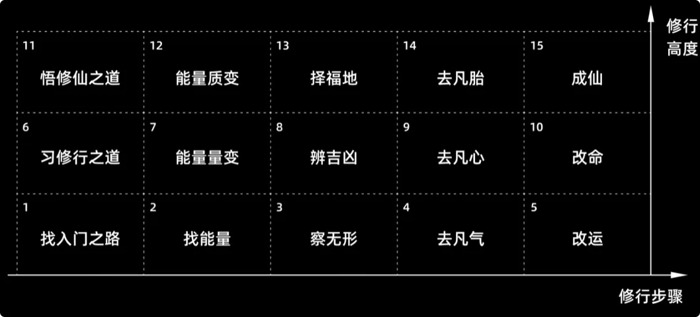
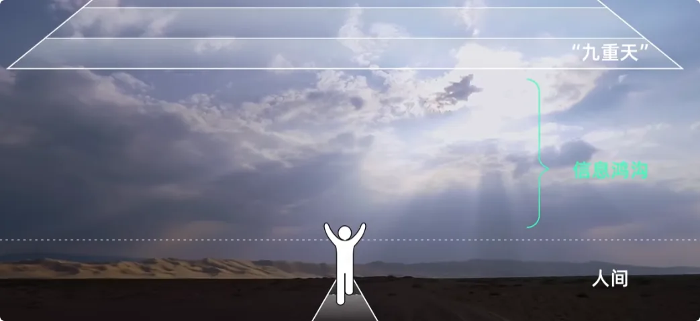
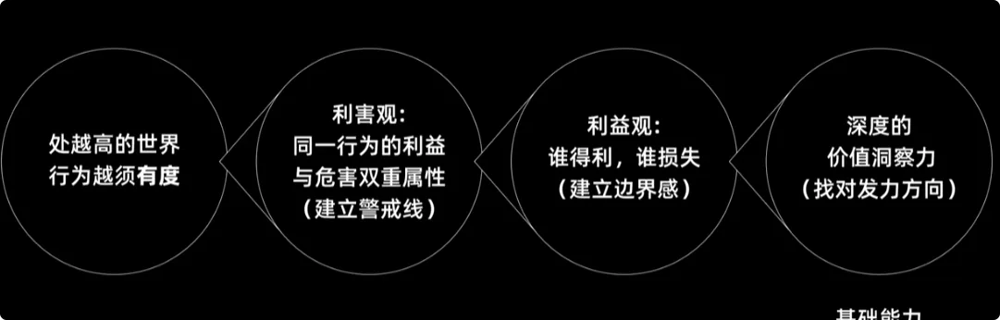
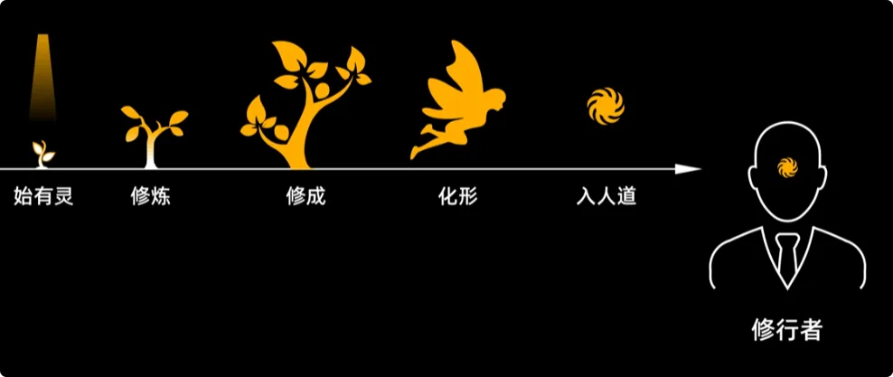
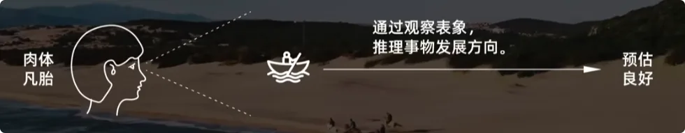
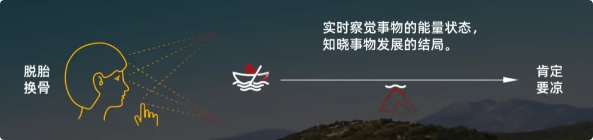
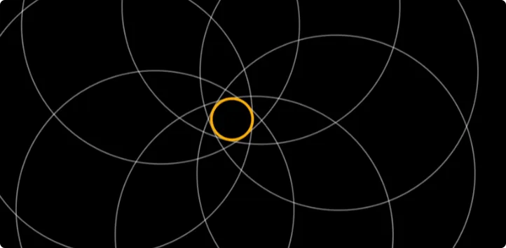

## 前言:  精英圈子的一定优势
为什么说精英圈的修行人士普遍比一般的修行人更容易参悟到，更容易找到修行的真正方法，更容易找到修仙的捷径？
这里面最大的差距体现在认知层次上。**当一个人站的位置足够高，他才能具备丰富的阅历，吃透更广阔的知识体系，在思考问题或领悟道理的时候会更本质，更贴近现实，更能落地。**
这三个要素在修行上缺一不可。具体来说就是能在众多修行骗局中去伪存真，用实证检验真相，而得到的真相往往只有一个，想要排除万千个错误答案，没有相应的认知能力的话，是办不到的。

虽然有这些认知优势，但这些人最大的痛点其实和所有人一样，就是遇不到真正的修行，完全不清楚真正的修行会是什么样子。
如果市面上本就没有答案，那无论你多聪明，多有悟性，也是徒劳的。
**从最现实的角度，凡人想要突破对仙道的认知壁垒，没有真正的人外高人介入，是不可能填补信息差的**。

大家好，我是修炼者小烨，一步步了解为什么他们更容易接近道，同时我也会给出解决问题的方向，在视频的最后，我还会透露一些求道的方法。

## 1.世俗责任与出世修行之间的矛盾

能走到精英阶层的人，要么是自己辛苦摸爬滚打才有了今天的日子，要么是继承祖业，肩负着家族的责任。这种情况下，他是不可能说放下就放下的。
1. 因为一个有求道之心的人，必定也是一个有道德责任感的人，又怎么可能随便抛弃他珍视的家人呢，更何况他的事业可能关乎着很多人的生计。
2. 其次让他抛弃之前辛苦创造的成果，这种行为无疑是否定他过往的努力，过往的人生甚至是否定他存在的价值。
在不知道眼前的路子对不对，不知道能修出什么正果的情况下，让他去冒这么大的风险去投入，这跟毁掉他和他的家人没有区别。

所以精英圈的修行者其实是厌倦传统修行中要求放下一切的二元对立论调的。

他深知自己肩负巨大的世俗责任，同时内心深处又放不下对修行的想法，那他必然是想在世俗责任与精神追求之间找到一个平衡。

所以相较于避世修行，精英修行者更喜欢听**入世修行**。
他会希望能有某位修行大师尊重并赋能他的尘世成就与责任，提供入世修行的可行路径，并产出实实在在的修行成果。

不过现实是大师给不了答案，除了让各位入世去修一套心法，或者去修看不见摸不着的未来式福报，其实给不出实在的修行路径。况且又有几位大师敢保证自己能修成呢

对于习惯了务实和追求高效的精英修行者来说，这种高投入低产出的修行方式显然是不合预期的。那到底应该如何入世修行，为什么精英修行者不得不比普通修行者陷进更深的世俗活动中，这里先按下不表，我们接着讲。

## 2.务实理性与不可量化修行之间的矛盾

对于这样一群思维活跃，洞察力强，时间又宝贵的人来说，做任何事情都要评估投资回报率。
**这不是功利思维，是尊重自己，尊重生命，尊重时间的表现。**
比如既然大家说修行是提升生命的质量，甚至可以提升生命的维度，那市面上提供的修行方法能不能给他带来实际的效果？他投入了金钱，精力和时间之后，有没有明确的可验证的，甚至是可触摸的回报？

然而现实是市面上流传的修行方式往往就只有一套心法，常常连最基本的两个诉求：
一个是规避风险和危险的能力
一个是保持高能量，高活力，都满足不了。
既不能帮助他察觉到危险，保护好自己和家人的安危，又不能实际提升他的生命力，健康和运气。究其原因是，这些修行理论不可被量化，也不见实效。不可量化，就不可实践，不可实践检验，就等于不可证伪。
人困在逻辑自洽，不可证伪，不见实效的学说里，能修成结果才怪了。所以更别提通过这些修行来解决精英修行者复杂的现实困境。

比如说人身在高处，就意味着面对巨大的风险，必须去竞争生存的空间，可能要面对更高背景，更无下限形势，比他更狠，运气比他更好的人。
在这种情况下，任何人都会希望自己具备对风险的预知能力和规避能力，同时希望保证自己高能量，高活力去潜心经营，要保证头脑灵光，能准确嗅到生机，否则就可能被淘汰。最后他还得想着怎么拼得过别人身上无法量化的运气。

光以上这几点哪一点能通过常规手段来获得呢？
读书可以吗? 商业咨询可以吗?

都不能!

只有靠非常规手段。这也是很多人哪怕不是真正想修行的人，也愿意涉猎修行领域的原因。因为很多人都意识到自身气运的缺陷，所以开始无底线的向外借运，甚至是截运，虽然不是正道，但起码可验证。

所以如果一个修行方法不能带来任何实际的超常规的价值，甚至连歪门邪道都比不上，那对于一个务实的人来说，肯定是不敢投入的。

所以认知层次越高的修行者，越是寻找**可量化、可操作、可反馈**的修行方法，甚至会通过自己预期的结果来反推执行的过程。比如说既然要讲修行，要超越肉体凡胎，那首先要改变的就是一个人的性命。

改变性命的第一步是*改变肉体和生气*。
>在严格的自然法则下，肉体和生气是不可能被改变的，除非超自然法则，超常规的资源介入。既然是超自然超常规的资源，那么当人使用之后，身上必然应发生超自然超常规的变化。只有通过这些实实在在的变化，人才能确定自己修行的路子是对的。

在我之前的视频中，我都有跟大家说第一步该怎么做，能获得什么，未来可以怎么规划。这些其实都是在告诉大家，修行需要量化，你要务实地去规划，去实践，去验证，不要空想一些不可证伪的理论，这样只会颗粒无收。

## 3.高价值锚定思维和现实中无高价值事物之间的矛盾

或者说叫停止成长的痛苦。当一个修行者在世俗层面攀至高峰的时候，其实是很无聊的。真正高层次的修行者很难看得上尘世的名利，只能说知道其重要性，但还不至于痴迷。很多人在取得巨大世俗成就之后，会陷入“然后呢”的虚无感和倦怠感。

物质成功带来的边际效益递减，他肯定渴望找到超越名利，超越世俗，**更具持久意义和深度的生命答案。** 这也是精英修行者寻求二次实现自我价值的动力来源。

这种生命意义上的虚无感会倒逼一个人对事物的价值更加挑剔。他会认为要么找到超常规价值的事情去做，要么浑浑噩噩地活在这个世界上。

我相信哪怕他已经站在社会的顶端，他也找不到比财权名更高价值的事情，因为再往上找就不是人间的事了。

说直白点就不是修圣人了，而是修仙人。

也许成为天外神仙，就能接触到更高价值的生命体验，这也是很多精英修行者开始寻求仙道的原因。

可问题是你能在社会上找到得道成仙的方法吗？不可能的。

为什么找不到呢，因为越往上走，想要突破信息差就越难，一丁点儿信息差就能改变一个人的结局，而最后一层揭开超常规价值的信息差，不掌握在人手里。

你要从原来的金字塔走向下一个全新的金字塔，那原来的金字塔的那些人能帮到你吗？不能，因为你们之间没有关键信息差。
所以如果没有下一个金字塔的人亲自搭把手，你不可能摸得到门道。也就是说，除非能见到天外高人，恐怕真的没有别的渠道了。

想必也有极小一部分精英修行者想到这一层，于是到处去寻高人，但最后都无功而返，因为此高人非彼高人，他们也给不了关键的信息差。

说白了这些人的认知层次还不够，对价值洞察力还不够。

我举个西游记的例子，因为这个例子最直接。
>菩提祖师问孙悟空，道，门下一共有360旁门，门门都可以有结果，从诸子百家到各种功法，从医药养生到万般神通，你学哪个？孙悟空说，我只学可长生的那个。这就是高认知的修行者和一般修行者的区别。

世上这么多修法，唯有长生道能带来生命之变，其他都只是思想和能力上的改变。得长生道就等于站在知识体系的顶点，有了长生，那其他知识还不是迟早学会的事情。
也就是说，**长生道才是最顶级的信息差，也是最顶级的价值**。
所以认知层次越高的求道者，越会像孙悟空那样去专注最本质，最有价值，最顶级的信息差。

这里必须先证明一下，有人会问修行者以价值为导向，这种修行是不是太功利了，太外求了，修行不都说要无欲清净为主吗？

其实不然。如果一个修行者没有明辨事物价值的能力，那就容易满足低价值事物，会耗在无意义的事情上，会耗在旁门偏道，识别不出成仙大道。

而且就算走进了正道，也会把精力放在无关紧要的小事上，修不成大器。

其次修行者若无法判断一件事物的价值，没有建立利益思维，就等同于没有利害思维。若不懂得事物的利害性思想和形式，肯定就会轻浮，这样不成熟的人是不够格儿参与更高级别世界的。

最后没有直面利益的考验，何谈无欲的觉悟。很多人都是在社会上吃了闭门羹才想修行，若真遇到大的利益，他可能比谁都要贪婪，又怎么谈无欲清净呢。

## 4.不甘平凡与找不到生命意义之间的矛盾

刚才说了，在原来的金字塔体系里，凡人是无法突破信息壁垒的，这也导致求道者陷进新的困境里。
**一个实现世俗层面高价值的人，对世间看得是非常透的，很多事情都不能引起他的共鸣，常常陷入无意义的虚无思绪中。**
**但是又不甘这么平凡的过完一生，所以会强行给自己编造一套生命的意义，找到一个最接近恒定价值的事情，以此来维持自己的高价值感官。**

从哲学上讲，个体的价值往往靠一些事物来衡量的。比如在社会上，人们常常以社会地位或者名垂千古来衡量一个人的价值。

但高层次的修行者一般会认为人类社会之上肯定有更有价值，更值得做的事情，他希望通过做这么一件事儿来感受它存在的意义。所以他必须把这件事想得足够宏大，才能显得他的思想和灵魂也宏大，他才有生活下去的动力，这也叫意义本体论。这种思想常常出现在殉道者身上。

当一个真正的修行者开始自我定义的时候，他的底色就体现出来了：
***悲悯与道，也就是本心，悲悯众生和本心向往道法。***

这里我们先得搞清楚谁是修行者。不是谁想修行，谁就叫修行者。真正的修行者其实是一群本来就得到修炼过的人，他们的所有修炼经历和资源都来自于道。是道，让万物有了灵性，有了生机，也同样是道，让修行者更灵，更有生命力。

我们都懂一个道理叫“身体发肤，受之父母，不敢毁伤”，这群修行者也会本能地反哺到爱护他创造的万物万灵，而且会非常注重得道，注重道德。

所以当万物万灵受损时，他们会心疼，会悲悯；当道德崩坏时，他们会愤怒；当周围都堕落无光时，他们仍然会坚守善良的底色。

所以观众们，你明白你为什么放不下善良和道德了吗？因为你的底色确实不一样。

但真正的修行者毕竟是少数。

为了让自己活在这样一个格格不入的世界，修行者通常会给自己建立一套自我神圣性，比如**彻底叛离世俗价值，不想做功利型精英，不停地思考“我跟他人不同，那我存在的意义是什么”，时刻寻找自我存在意义的终极命题。**

在他的构想里: 
也许是为众生做点什么
也许是为宇宙道法做点什么
总之他希望将自我完全溶解在宏大意义中，甚至会觉得“这件事成了我消失也无妨”。
如果说功利型修行者追求的是“我因奉献而伟大”，那真正的修行者追求的就是“我消失于伟大中”。
所谓后其身而身先，外其身而身存，最终达到至人无己，神人无功，圣人无名的境界，妥妥的精神赤子。
讲到这里，你有没有发现这套想法和道德经里的“德”高度契合，即放下一切虚名，顺应宏大的道去实现自己的价值。

现在你回头看看你的一生，你会恍然明白: 
为何你投身在这样的家庭，为何你要有今天的成就，为何要有这样的思维和视野，为何又要深陷入世还是出世的两难。
因为最终的目的就是要锻炼你德与道的能力，这其实是在给你修仙道的准入门槛。当你明白这一点的时候，你可以开始真正的修行了。

## 5.善良悲悯的天性与现世道之间的矛盾

如何精准的悲悯，也许是精英修行者常常思考的问题，因为他们有一定的资源和能力去做出善举。

**我遇见的有能力的修行者，他们确实也是这么做的，但他很快就会遇见人性的阴暗面，让他失望透顶。当他失望到想放弃的时候，他又会遇见人性的光辉面，重燃心中的希望。**
命运就好像在戏弄他，让他对人类集体有种摇摆不定的态度，一边是对现实的失望，一边是不能完全放下的慈悲天性。这会促使他不停的思考，对于人类集体来说，到底什么是善，什么是恶。这个问题有没有答案不重要，重要的是这个人在善恶福祸这件事上锻炼了思辨的能力。

我不怀疑精英修行者理解“善非功，恶非过”的能力，毕竟头脑阅历和眼界都摆在那里，但是他肯定没有实现善果的能力。

善的评判标准是什么？

情境、动机、手段、结果、普惠性、信息差，缺一不可，但他一个都做不到。

从情境和普惠性上讲，人类及其他众生到底陷入什么困境，他不知道。连思考问题的背景都不知道，那他的立场动机和手段肯定也是错的，带来的结果也会大相径庭。

那判断善的关键是什么呢？是信息差。一个关键的，哪怕很小的信息差，就能导致原来的善恶定义完全颠倒。换句话说，如果他提前预设并站定了善人的立场，到头来善恶概念一换，他就可能万劫不复。
虽然这是他在无知的情况下做出的选择，但也是要引发因果和承担因果的，任何人都不能以“我本意是善的”为借口陶醉。

所以先补信息差，先提高认知。

那怎么填补信息差呢？还是一样，没有人间实例可以让我讲。

这里我讲西游记的故事：唐僧也是个修行者，慈悲又有智慧，但因为他肉眼凡胎，判断不出现实感官以外的真相，把白骨精当善人接纳，把徒弟当恶人赶走，最后差点步入绝境。

如果取经路上没有孙悟空的火眼金睛和非凡手段，像唐僧这样有影响力的善人，大概率会引狼入室，害死更多的人。

所以如果你只是肉眼凡胎，看不见世界的全貌，看不见众生的因果业力，那就别管行善的事情了，还是先修好自己。

## 6.天性差异和价值观差异带来的孤独

修行者必然是孤立于世人，人性人心，孤立于世人价值观的。

不管你有多会自我排解，不管你再坚强独立，一个人最真实的一面迟迟得不到正反馈
如同把你困在一座孤岛上，长期下去一定会精神崩溃的。如果你觉得你也没那么孤独，那么抱歉，命运一定会加大剂量。
因为真正的修行者注定得是孤独的，这种孤独既是一种诅咒，也是一种恩赐。因为只有这样才能防止你的心在人间扎根，才能逼迫你离开原来的圈子，迫使你去找路，去找自己真正的归宿。

因为人间不属于你，宇宙星辰才是。
逗留人间，等同于辜负你过往的万千岁月。

只有当你找回真正的修行道路的时候，你才能真正想起你是谁，真正的天梯才会出现在攀登的过程中，你才能遇见真正的朋友。

## 如何求道

最后我们再来讲讲如何求道，很多人都不知道如何求道。毕竟求道不同于人间的任何一门学问，因为它包含以下几个关键要素：
*求道者求道的方式，传道者传道的方式以及得到的方式。*

试问历史上有几个人见过真正的传道者，更别提如何向其讨教学问了。

首先作为求道之人，应该对仙道保持谨慎不怠的态度。

有了这种态度，你才会在接触不同修行理论的时候，时时想着分辨真伪，而求真恰恰是提高个人悟性的核心驱动力。
**真正有悟性的修行者，一定具备深刻的洞察力，能穿透语言和视觉的表象，直奔最深处的本质和核心。也就是说他会本能地去找最真实，最实在，最恒定，最接近顶层，最接近本貌的东西。** 
像市面上那种空泛的灵性营销，其实一眼就能望穿。反过来说，如果一个人没有建立这种意识，就没有办法对复杂的信息去伪存真，也就分辨不出谁才是道出真相的那个传道者。

其次求道必须要有传道者。正如前面所说，想要从一个金字塔走向另一个金字塔，这个信息差必须要有下一个金字塔的人来填补，否则你是无法实现认知突破的。

现在你需要反推一下这个陌生的人，对方会是一个什么样的人，会以什么方式出现，如何得以相见。
我们来推理一下：**首先他与凡人之间肯定是有价值观鸿沟的，他有着更高价值的目标，这样的人只会关注实现高价值事件本身，一切言行举止都围绕高价值事件而表露。只要有需要，他可以见人说人话，见鬼说鬼话，甚至可能是大道无情的。所以你不能用世俗的价值标准去判断它的外在表现，你必须发挥你求真的能力，而这也恰恰是传道者考验人的方式之一。**

我们翻翻古书，为何先人通常先化身成借赖老者的模样，最后才显露仙风道骨？
因为绝大多数人都是不合格的人，见到神仙就一个态度：
你要保佑我发财，你要度得众生平安，你要大爱无私帮助我，否则你就不是好神仙。

世人完全把神仙当做许愿池，所以真正的传道者不会招摇过市给自己找麻烦，他只需要在暗处偷偷考验少数的求道者就可以了。

接下来我们想想他会认可什么样的人呢？换句话说你有什么价值亮点值得一看的？

想修行的人很多，有悟性的人很多，有能耐的人很多，有钱的人很多，有品性的人很多，有来历的人很多，能持之以恒的人也很多，唯独样样全面的人很少。

## 结尾
当然人无完人，能以真诚态度全力以赴便是最好的开始，古书上的神仙大多也是以此为标准。所以再来反推你求道的方式，你到底该以何种姿态求道呢？

在这个时代，有的人习惯了义务教育，有的人习惯了花钱买知识。对于非义务的，非金钱衡量的学问，很多人是不懂怎么求学的，更别说进一步求道了。不懂的朋友可以了解一下“童蒙求我，非我求童蒙”，孔子礼问老子，只闻来学，未闻往教。束修之礼，程门立雪等这些故事。

接下来我们继续推理一下传道者传道的方式。

你既然是求道者，你要修炼仙道，那么对方理应传什么给你？还会是一套虚的无法证伪的理论或心法或几本书吗？不会的，一定需要一些能改变你生命本质的好东西，一定是实实在在的可证伪的真东西。这也是你作为求真者，判断传道者是真是假的依据，而真东西从不怕被检验，这就是传道者的底气。

最后你遇见了贵人，又有了方法和路径，是不是就一定能得到呢？当然还得看个人造化。如果你有点阅历，应该能明白以下两个道理：
*最好的东西(机缘/机会/资源)从来都是挑人(优秀的人)，而人成长的最佳捷径是同比你更厉害的人共事。*

这期就先聊到这儿，我是修炼者小烨，我们下期再见。