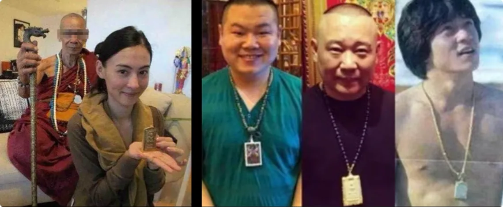
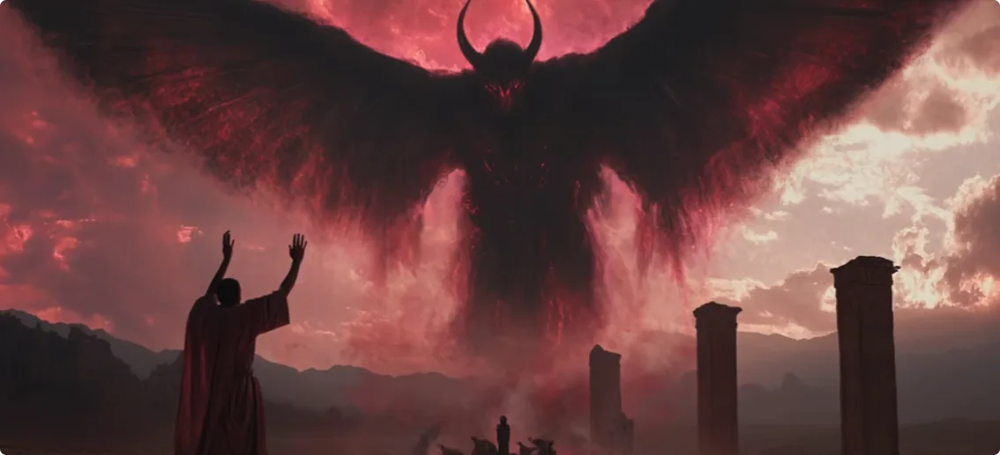
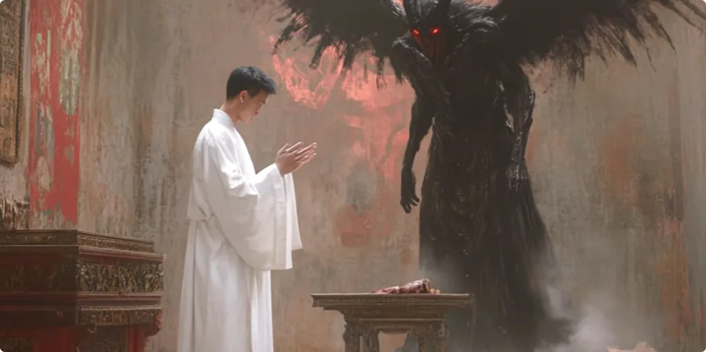
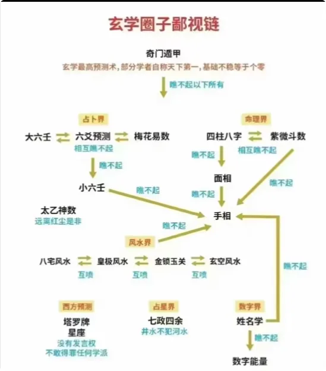
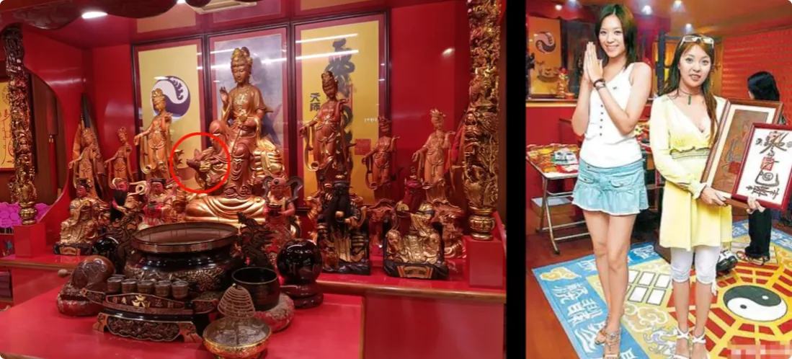
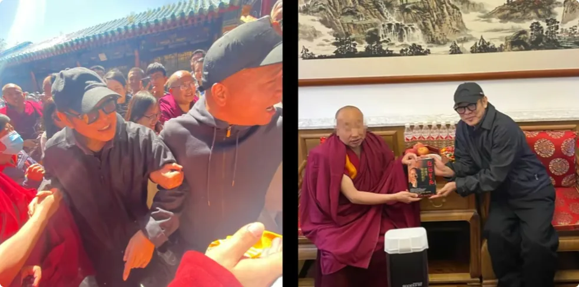
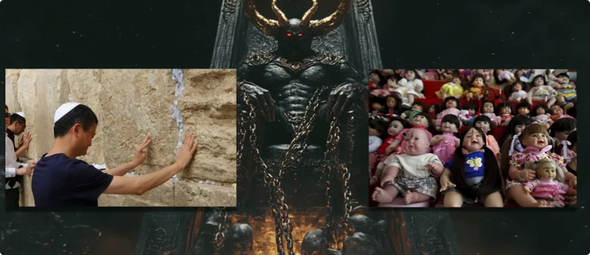
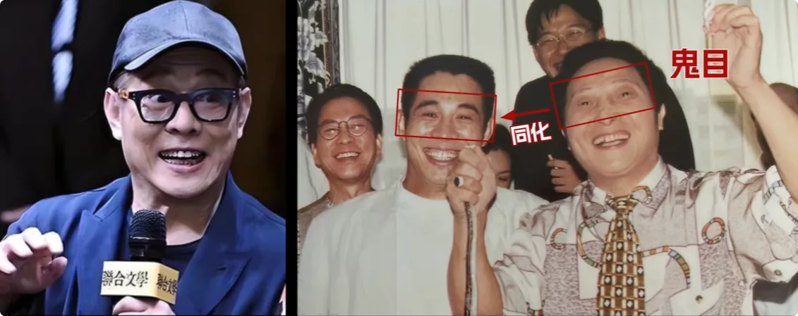

> _**富豪和明星真正崇拜的从来都不是大师，而是背后能带来运势的力量。**_

## 1. 为什么越有钱，越想找大师：试错成本、选择意识与生存焦虑

### 富豪和明星为什么更愿意尝试“神秘力量”

为什么很多富豪和明星最后都爱找大师？如果你身边有娱乐圈的朋友，那么你会发现，连二三线的小明星都喜欢搞点神秘力量回家保自己的运势。

要说缘由，大致有三个：

1. **有钱，试错成本低。** 花点小钱检验一个大师，对他们来说很容易。
2. **有商人思维。** 生活条件好的人普遍都信奉“多一个选择，多一个出路”。如果神秘学有用，干嘛非要拒绝呢？
3. **这些大师多少是有真本事的。** 做出了一些常人做不到的事情，不然你真当这些富豪和明星都是傻子吗？

当然了，我是不信这些的，建议大家也不要信。

### 人拥有得越多，往往越害怕失去

那为什么越有钱的富豪和明星，就越想见到大师呢？首先是**人对生存的欲望**。哪怕你已经很有钱，你也无法确定自己不会走下坡路，或者被突如其来的意外带走；又或者有些人害怕死亡、失去一切，想要死后也可以富足。

人都是贪婪的，想要得到更多，可是有些东西不是你想要，你就能掌握。这时，一位具备预见力、能指导你获得更多财富、能帮你躲避意外的大师出现了，没有谁能拒绝这种诱惑力，他一定能在你心中占领一席之地。

---

## 2. 圈层越高，越容易接触到普通人看不见的资源

### 大师也是一种“稀缺资源”

其次是环境。

人越往上走，接触到的知识和资源就越稀有。像是有些拥有神秘力量的大师，也是这个层级才能接触得到的。这些大师可没兴趣给普罗大众露两手：
1. **不值得。** 人家做的是高净值客户，普通人挣不到几个子儿。
2. **不允许。**

所以这些大师，也是大富豪和大明星才见得到的。
如果你稍微动动手指头搜一搜，你就会发现这些圈子背后都有一个大师，而且还不分国籍。

在这种氛围下，哪怕你本来不信大师，但你敢不信同行那些机灵鬼吗？况且这些大师手里的人脉资源和神秘力量也不是盖的。你不站队，那以后那个世界的信息资源就轮不到你，你就没有发展的优势，而且你的优势还会被其他人吃掉，你肯定会心急的。

---

## 3. 大师为什么从未退出历史：真正被追逐的是背后的力量

那为什么会存在这种环境呢？

要知道，**大师这个角色自远古的祭祀开始，从未退出过历史的舞台。** 哪怕是历代大师去世，传承也没有断。

为什么呢？因为世界是阴阳平衡的，有修仙的存在，那么就有修妖魔的存在。

这世界上的妖魔其实是很多的，又基本不受物理约束。大师这个人凉了，可背后的神秘力量还会存在，物理超度没有什么用，所以大师的选任一直都在换。

况且：

> _**富豪和明星真正崇拜的，从来都不是大师，而是背后能带来运势的力量。**_

所以新的大师很快又会被捧起来，这种大师氛围自然是散不了了。

那背后这些神秘力量到底是怎么运作的呢？他们是怎么保人的呢？信徒有没有代价呢？

接下来我就来和大家聊聊大师的来历。

**再次强调，我瞎编的，我自己都不信，建议大家都不要信。**

---

## 4. 三种大师：对应三种级别的力量与合作模式

首先，大师有三种，对应背后三种级别的神秘力量和三种合作模式。

### 第一种：普通大师——依靠玄学知识、经验与“直觉”

**第一种就是普通的大师**，主要是会算卦，靠的是多年积累的书本知识和算卦经验。

学过一些西洋占星、紫微斗数、八字等玄学的朋友应该能体会，命数、相术、占术是真的会反映一些事情的。而这种大师属于生来对玄学知识比较上手，算得比较准，基本能满足一般人的算卦需求，所以也是大众层面最常接触得到的人。

但这些人的社会地位一般不会很高，这决定了他们背后能吸引来的神秘力量等级也不会很高。因为高级别的灵界大佬当然是去挑选收益更大的大师作为人选，所以这些中下等级的灵界大佬，只能去找一些社会地位一般的大师附身。

大佬会帮他们看一下求卦者的未来运势，并把这些信息返还给大师。具体而言，就是大师的直觉变得更敏锐，推演的卦也更精准。算得越成功，这些大师就会越发依赖这种直觉，与背后的大佬绑定得更牢，长久地建立这种双赢关系。

那灵界大佬为什么要帮他呢？

> **因为麻雀再小也是肉，只要信徒的基数够大，香火多一点，对自己的修为增长总归是有帮助的。**

### 第二种：富豪圈与娱乐圈的大师——传承、人脉与长期绑定

**第二种就是活跃在富豪圈和娱乐圈的大师。**

这种大师一般都是有传承的，或者是有一定社会地位为前提的。有传承的人，一般就是手里的神秘知识和经验远超第一类大师，都是一手资料，而且最重要的是，**几代人都和同一位灵界大佬合作。**

家族传承模式的好处之一，就是父母和子女的能量场是最相近的。如果父母的能量场跟大佬趋同，那么子女的能量场也会趋同，大佬可以更好地更换附身对象。

所以为什么传闻一些密会要讲血统纯净论？因为只有这样，才能更顺利地继承神秘力量，也就是所谓的法力。

另外，有传承的人拥有的人脉资源、社会资源都会沉淀下来，大佬在物质世界也有更多可操作的空间。

上一期我讲，世界是能量运作的。在大佬眼里，他们看得见能量的发展：
- 什么时候该告诉这些家族避险；
- 什么时候避不了，该弃了；
- 哪个新生儿自带阴性能量大，可以作为下一任通灵者。

大佬也是门儿清的。真遇到该放弃某个家族的时候，大佬自然会去培养下一个大师。

### 第三种：更高层级的大师

**第三种大师**不方便多讲，观众自己猜就好。

那些榜上有名的大妖魔，什么七十二魔神、撒旦，还有世界各地的上古蛇神，人家也不是空穴来风。

---

## 5. 富豪、明星、大师与“大佬”：三方到底在交换什么

### 每一方都有自己想得到的东西

接下来说说，大佬怎么帮助富豪和明星的呢？
首先我们要知道，三方各需要什么：
1. **大师要的是影响力和名利。**
2. **富豪和明星要的是持久的发展。**
3. **大佬要的是臣服的信徒数量和质量。**

前两者的需求其实都是很好解决的。

首先，大佬的能量等级越高，越能察觉高维度的精微能量运作，以及更上层的灵界消息。比如什么时候会出现大机会，什么时候会有大变数，甚至怎么干扰生死及转移因果等等，都可以去操作。

**这也是二类大师和一类大师的本质区别。**

大佬帮助了富豪和明星，自然也帮助了大师。
但是代价是什么呢？那就要看大佬的需求是什么了。

### “大佬”真正要的是人气和臣服

大佬的需求从来都很纯粹，也就是之前讲过的**向上生存**。

大佬要的是臣服的信徒数量和质量，也就是以人气为食，供养自己的能量场。

很多富豪和明星帮开了很多大师班，帮大师拉人脉，建了很多寺庙，帮传福音等等，这些就是大佬需要的。

> **人头要多，人气要旺。**

所以为什么人的社会地位越高，招引来的灵界大佬越厉害？因为这些人的可利用价值更大。

---

## 6. 拿得越多，代价越大：从依赖到被彻底绑定

### 先制造麻烦，再由大师出手解决

如果遇到新晋富豪和明星不就范，或者有人想背叛信仰，那大佬有的是手段。

大佬手底下的妖众、鬼众不少，让你不能正常生活也是轻轻松松的。而且大佬很多时候拉人头，都是先让这些妖众、鬼众去捣乱，然后大师再来显法化解。

很多有价值的富豪和明星，从此逃离不出魔爪，本身也是一种代价。

### 越进入核心圈，绑定就越深

越是走进大佬的核心粉丝圈，拿到的越多，那么代价也越大。

首先，大佬的能量来源不正，属妖魔。其中无论是大师还是其他人，借用的能量越多，人自身能量场会越污浊，会逐渐被同化。

你看那些大师和身边的富豪、明星，自己的生气是越来越少的，人的五官都开始变形了。

而这种人死后，由于灵魂的能量场和大佬的能量场同频绑定太深，死后也无法逃离大佬的掌控，成为大佬底下的打工鬼。

---

## 7. 为什么“大师”总能找到信众：人真正放不下的是名利与顺遂

以上就是三种大师的来历。
为什么大师，或者说大佬，总能轻易地找到信众？

因为**人性是贪婪的，而且人在名利熏心下是非常短视的，只在乎眼前的利益，也不在乎正邪对错。**

甚至很多人会说：

> _**谁保我顺遂，我就信谁。**_

作为修仙者，我还是要给大家提一个醒：不管你是大师，还是富豪、明星或是普通人，如果走错了路，选错了信仰，那么你的生命、肉身、钱财、灵魂，甚至你的至亲都会成为代价。

灵界大佬的底线就是没有底线。他们本就没有道义，况且跟你都不是一个等级，也不是一个物种，怎么可能手下留情？

修行的这些年，我看得很清楚：
- 人的钱财，可以帮他们修建新的庙宇；
- 人的肉身和精神，可以贡献修炼所需的人气；
- 人的灵体，可以帮自己打工。

底层灵界弱肉强食。成长出来的大佬，为达到修炼目的，作恶也是很纯粹的，他绝对会把你吃干抹净。

---

## 8. 为什么明知路子不对，很多人仍然不敢离开

### 名利和恐惧，才是最难解开的绑定

我相信很多圈内人士也察觉到了异样，因为自己的运势、身体健康等等已经出问题了，脸型、姿态和气场都不对劲了，然后又不敢背叛大师，怕有报应。

甚至很多大师自己身体已经囊肿了，也有快嘎的。

他们知道自己的路子不对，也有找到我这里来的，但是碍于自身现有的身份，始终拉不下脸面走正道。

> **名利常常是凡人最难放下的心结。**

大佬正是利用了这一点，在背后激发信徒的恐惧，不让信徒离开。
甚至有些人离开了，也因为名利观，转头又去找更有名望的大师，落入利益虎口。

---

## 9. 为什么走正道要先“切割”：保一时顺遂，还是保长久顺遂

### 真正让“大佬”害怕的，是信徒彻底离开

大佬之所以千方百计地阻拦，除了不想放弃韭菜，更核心的原因是：**如果信徒真的走上正道，那到时候大佬的损失会很严重。**

因为任何人走上正道都要先做切割，也就是正神过来赶鬼。

能对大佬造成实际伤害的就是魔法对轰，用真正纯净上乘的能量，对冲掉污浊下乘的能量。这是能掉大佬脑袋的，他还是会怕的。

所以不管是谁，都不应该怕走正道。

**正道一定是能保人、能驱邪、不会要挟你的。**

无论你是大师、富豪、明星还是其他人士，都要及时走上正道修行，保全自己和家人，不能任性地只顾眼前三瓜两枣，不要有侥幸心理。

> _**保一时顺遂，还是保一世、几世顺遂？哪个选择更好，一目了然。**_

只有当你选择走正道，正神才愿意出现，你才能借用到真正能保人顺遂的能量。

当然，既然是叫正道人，起码得是善良和真诚的。

**正神不会庇佑一个癫狂和轻浮之人。**

我是修炼者小烨，我们下期再见。