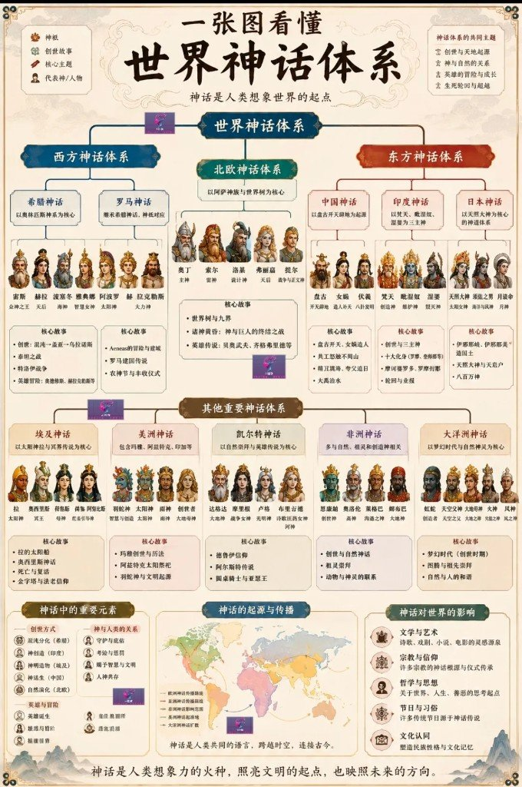
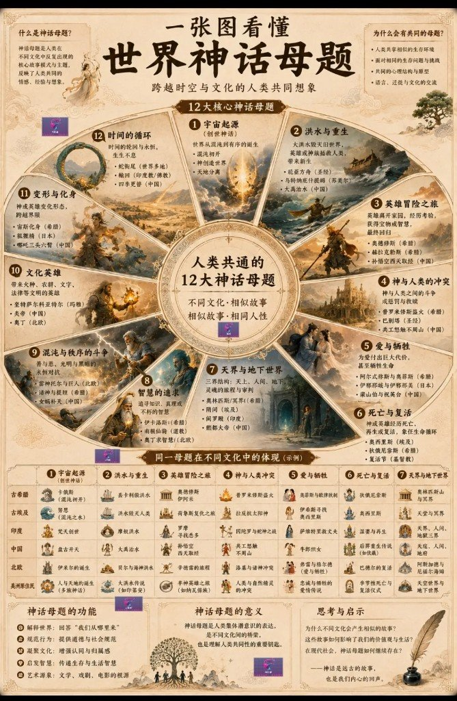
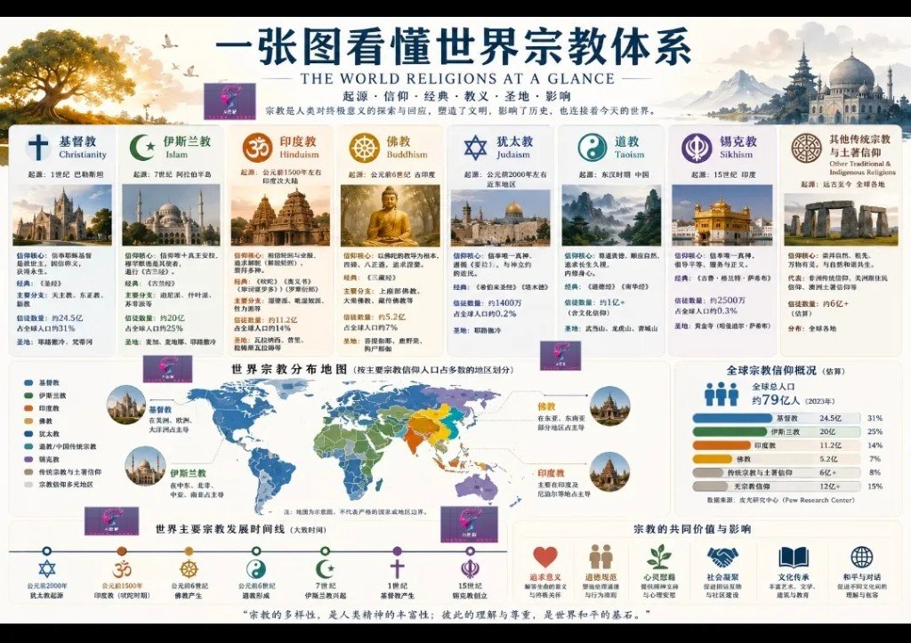
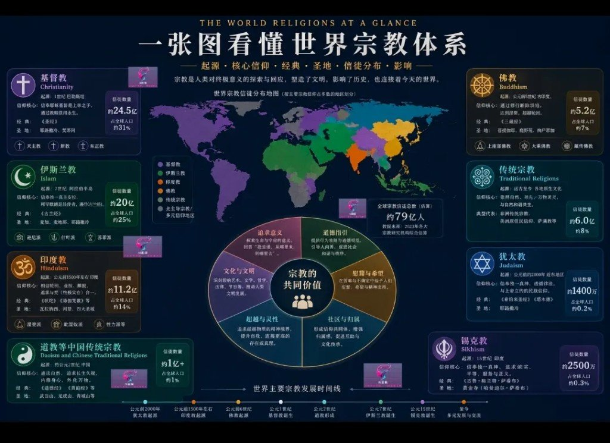

公众号标题写「两张图」，实际塞了神话体系、母题、宗教（还带浅色 / 深蓝两套布局）。正文几乎没有，能带走的就是图里的索引骨架。

用途很窄：**速查地图**。不是宗教学教材，也不是神话学论文。数字、起源年代一律按「作者图画的」看待，**图称未核**——没对过 Pew 或一手文献。

## 世界神话树（图 1）

| 大区 | 支系 | 抓手（图称） |
|---|---|---|
| 西 | 希腊 / 罗马 | 奥林匹斯；罗马神名对应 + 建城传说 |
| 北欧 | 阿萨神族 | 世界树、九界、诸神黄昏 |
| 东 | 中 / 印 / 日 | 盘古女娲；三相神与史诗；天照与八百万神 |
| 其他 | 埃及 / 美洲 / 凯尔特 / 非洲 / 大洋洲 | 太阳与冥界；玛雅阿兹特克印加；自然英雄；祖先与自然；梦创时代 |

共同主题（图称）：创世、神与自然、英雄成长、生死与超越。

## 十二母题 + 对照（图 2）

| # | 母题 | 跨文化举例（图称，摘） |
|---|---|---|
| 1 | 宇宙起源 | 希腊混沌 · 盘古 · 梵天创世 · 伊米尔 |
| 2 | 洪水与重生 | 诺亚 · 大禹 · 摩奴 · 贝尔格勒米尔 |
| 3 | 英雄冒险 | 奥德修斯 · 孙悟空 · 罗摩 · 托尔出行 |
| 4 | 神人冲突 | 普罗米修斯 · 共工撞山 · 因陀罗战弗栗多 |
| 5 | 爱与牺牲 | 俄耳甫斯 · 牛郎织女 · 伊邪那岐寻妻 |
| 6 | 死亡与复活 | 奥西里斯 · 狄俄尼索斯 · 鲍尔德尔叙事 |
| 7 | 天界与地下 | 奥林匹斯/哈迪斯 · 杜阿特 · 丰都 · 阿斯加德/赫尔海姆 |
| 8 | 智慧追求 | 奥丁求智 · 伊卡洛斯（图中例） |
| 9 | 混沌 vs 秩序 | 提坦之战 · 女娲补天 · 托尔战巨人 |
| 10 | 文化英雄 | 盗火/授农耕文字 · 羽蛇 · 炎帝 |
| 11 | 变形与化身 | 《变形记》· 狐精 · 哪吒 |
| 12 | 时间循环 | 衔尾蛇 · 轮回 · 四季 |

图下方还有古希腊 / 埃及 / 印度 / 中国 / 北欧 / 美洲原住民对母题 1–7 的对照表，标了「示例」——当索引行，别当严谨母题学。

## 世界宗教对照（图 3–4）

浅色格与深蓝版同一主题，布局不同；道教在图里有太极。信徒数、百分比、起源年：**图称 · 源注 Pew 2023 · 未核**。

| 宗教 | 起源（图称） | 信徒规模（图称） | 经典（图称） |
|---|---|---|---|
| 基督教 | 公元 1 世纪，巴勒斯坦 | ~24.5 亿（~31%） | 《圣经》 |
| 伊斯兰教 | 公元 7 世纪，阿拉伯半岛 | ~20 亿（~25%） | 《古兰经》 |
| 印度教 | ~前 1500，南亚 | ~11.2 亿（~14%） | 吠陀等 |
| 佛教 | ~前 6 世纪，古印度 | ~5.2 亿（~7%） | 三藏 |
| 传统 / 土著信仰 | 自古至今 | ~6 亿+（~8%） | （无统一经典） |
| 犹太教 | ~前 2000，近东 | ~1400 万（~0.2%） | 托拉 / 塔纳赫等 |
| 道教 | 图称东汉成型（时间轴两版不一致） | ~1 亿+（含民俗口径） | 《道德经》等 |
| 锡克教 | 公元 15 世纪，印度 | ~2500 万（~0.3%） | 《阿迪·格兰思》 |

另有「无宗教」等柱状项（图称）。两版时间轴对道教落点写法不一，以图为准、不当史实定稿。

## 边界与风险

- **科普速查，非权威教材。** 信徒数、起源年代、百分比一律「图称未核」；引用前请自行对 Pew 或其它一级来源。  
- **中立。** 不褒贬任何信仰；不扩写成传教或反宗教文。  
- **版权。** 图中人物插画可能刻板，仅本地欣赏归档，不默认再分发。  
- **读者争议（留言）：** 克苏鲁不是历史神话；有人觉得框架偏西方模板、祖先信仰被低估——记一笔争议，不在此仲裁。  
- **神话 ≠ 宗教。** 图 1–2 与图 3–4 是两套索引，别混成一张「世界精神地图」。
